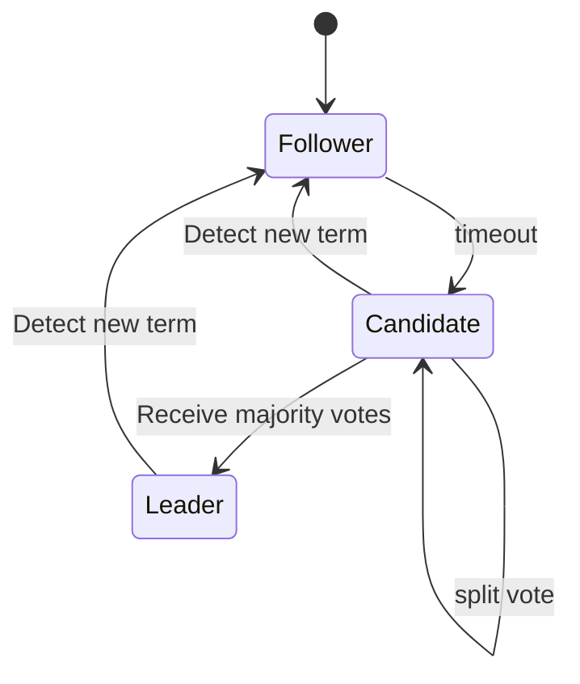

# Raft

## 概述

Raft 协议包含两个部分：Leader 选举和日志复制

## Leader 选举

目的：在 Replica 中选举一个 Leader 节点，处理客户端请求。Follower 节点只复制数据。

节点状态：

* Leader
* Follower：初始状态。会设置一个计时器，时间为 150~300ms（Election timeout），到期后会变成 Candidate（未收到 Leader 心跳）。
* Candidate：候选人。Follower 计时器到期后切换。

### 状态转移

---

### 请求类型

* Candidate 拉票请求
* Leader 心跳请求（Append Entries）
* 客户端请求

### Follower

* 行为：
  * 启动计时器，时间为 150~300ms（Election timeout）。
* 发起请求：无
* 处理请求：
  * Candidate 拉票请求：如果没有投过票则返回投票，更新投票轮次（为请求的轮次），并记录投票给谁。
  * Leader 心跳请求：收到后会返回响应并重新启动计时器。
* 状态转移：
  * 计时器到期：转换成 Candidate。

### Candidate

* 行为：
  * 发起新的选举轮次（term += 1），给自己投票，然后向其他节点发起拉票请求。
    * 刚进入 Candidate 状态会发起新的投票轮次。
    * 发起投票后，启动计时器，时间为 150~300ms。当计时器到期仍未得到半数以上投票，开启新的投票轮次。
* 发起请求：
  * 选举轮次启动时，给其他节点发拉票请求，获取其他节点的投票响应。
* 处理请求：
  * 其他 Candidate 拉票请求：如果其他 Candidate 投票轮次大于当前轮次，则投票给它并更新当前轮次。否则无动作。
  * Leader 心跳请求：对比投票轮次，如果大于等于当前轮次，则说明已经有 Leader 选出，自己转换成 Follower。
* 状态转移：
  * 选票超过半数：转换成 Leader。
  * 收到 Leader 心跳请求：此时其他节点已经是 Leader，转换成 Follower。
  * 选票未超过半数（Split vote）：保持为 Candidate，在计时器到期后开始新的选举轮次。

### Leader

* 行为：
  * 处理所有客户端请求和日志复制
  * 每隔一段时间（Heartbeat timeout），向所有其他节点发送心跳请求（Append Entries），维持统治。
* 发起请求：
  * 向其他节点发送心跳请求（Append Entries），处理心跳响应。如果心跳的轮次大于当前轮次，则转换为 Follower。
* 处理请求：
  * Candidate 拉票请求：
    * 轮次大于当前，转换成 Follower。
    * 轮次小于等于当前，无动作。
  * Leader 心跳请求：
    * 轮次小于当前，无动作。
    * 轮次大于当前，转换成 Follower。
    * 轮次等于当前，可能是由于发生网络分区导致出现多个 Leader，都降为 Follower 重新选举。
  * 客户端请求：处理日志复制
* 状态转移：
  * 发现其他节点的心跳请求响应有更大的投票轮次：转换成 Follower。

## 日志复制

处理客户端的写日志请求，保存数据，然后将数据广播给 Follower。

数据分为两种状态：暂存和存储。

1. 客户端向 Leader 发送请求提交数据
2. Leader 收到请求后将数据暂存本地
3. Leader 将数据由心跳请求发送给所有 Follower
4. Follower 收到心跳请求后暂存数据，向主节点返回成功的响应。
5. Leader 收到响应后进行仲裁，如果超过半数节点都存储成功，则存储数据，向客户端返回响应，写入成功。
6. 在下次心跳时向 Follower 发送的请求中说明本次仲裁成功，Follower 存储数据。

当网络分区被治愈，轮次较低的节点会回滚暂存的数据，同步新的 Leader 的数据。

## 参考

* [The Secret Lives of Data - Raft](http://thesecretlivesofdata.com/raft/)
* [两万字长文解析raft算法原理](https://mp.weixin.qq.com/s/nvg9J4ky9mz-dFVi5CyYWg)