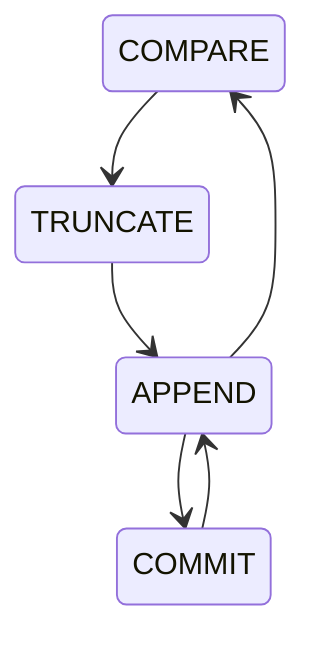

原文地址：[http://hscarb.github.io/rocketmq/20250315-rocketmq-dledger-log-replication.html](http://hscarb.github.io/rocketmq/20250315-rocketmq-dledger-log-replication.html)

# RocketMQ DLedger 日志复制 流程详解 & 源码解析

## 1. 背景

在 RocketMQ 4.5.0 版本以前，只提供了主从同步功能，但是主节点宕机之后从节点只能读不能写，没有主从切换能力。RocketMQ 4.5.0 引入了 DLedger 来实现主从切换。

DLedger 是基于 Raft 算法的 WAL 实现，它是为消息场景量身定制的，提供了日志写入和读取的接口，且对顺序读出和随机读出做了优化，充分适应消息系统消峰填谷的需求。

在 RocketMQ 4.8.0 版本以前，DLedger 模式的性能比主备模式差 1 个数量级[^1]，所以建议用尽可能新的版本部署。

[^1]: https://github.com/apache/rocketmq/issues/2278

DLedger 的实现大体可以分为两个部分，Leader 选举和日志复制。Leader 选举负责集群中选出一个主节点，而日志复制则确保各节点之间的数据一致性。本文基于 DLedger 0.2.7 版本源码详解日志复制的设计和流程。

## 2. 概要设计


整个日志复制流程如上图所示：

1. 客户端向 Broker 发送消息，Leader Broker 中的消息处理器处理该生产请求。
2. 在 DLedger 模式开启的情况下，消息处理器将生产请求交给 DLedger 服务进行消息存储。
3. DLedger 服务先将消息保存到本地存储。
4. 构造客户端响应的 Future，放到一个 Map 中，等待日志转发线程将日志转发到 Follower 之后回填这个 Future 的结果后返回给客户端。
5. 日志转发线程从上次转发的位置开始扫描。
6. 日志转发线程将消息转发到 Follower 节点，该过程也是异步的，转发后会将等待转发完成的日志序号存在一个 pendingMap 中。
7. Follower Broker 中 DLedger 请求处理器收到 Leader 的日志转发请求，将该请求放入待处理队列。
8. Follower 的日志条目接收器扫描待处理队列中的请求。
9. 将扫描到的请求对应的消息写入 Follower 本地存储，回填等待转发完成的 Future 结果。
10. Leader 的日志转发线程感知到日志转发请求完成后，移除 pendingMap 中的日志序号，更新节点水位表，这个表中存储着集群中所有节点的日志转发最新水位，用于判断日志是否被大多数节点写入。
11. 日志转发线程同时唤醒结果仲裁线程。
12. 结果仲裁线程根据节点水位表，得到当前集群中的大多数节点已经写入的日志序号。
13. 大多数节点已经写入的日志序号和它之前的日志序号都认为已经写入完成，回填之前日志追加请求的 Future 结果。
14. 返回结果给客户端。

---

我们可以把日志复制的流程分为 4 个部分：

1. Leader 接收日志请求并存储，包含上面的 2~4 步。
2. Leader 的日志转发线程将日志转发到 Follower，包含上面的 5~6 步。
3. Follower 的请求处理线程接收和保存 Leader 的推送的日志，包含上面的 7~9 步。
4. Leader 的结果仲裁线程仲裁日志在所有节点保存的状态，更新日志水位，包含上面的 10~13 步。

在下面的详细设计中，会按照这 4 个步骤来进行分析。

## 3. 详细设计

在概要设计中，我们把 DLedger 日志复制分成 4 个主要步骤，在 DLedger 中，这 4 个步骤都主要在类 `DLedgerEntryPusher` 中实现，其中后面 3 个步骤有专门的线程进行处理，这些线程都作为 `DLedgerEntryPusher` 的内部类存在，这样就可以访问 `DLedgerEntryPusher` 的私有字段。

* Leader 接收日志请求并存储：由 `DLedgerMmapFileStore` 保存日志，然后由 `DLedgerEntryPusher` 等待日志转发完成。
* Leader 转发日志到 Follower：由 `EntryDispatcher` 处理。
* Follower 接收和保存 Leader 推送的日志：由 `EntryHandler` 处理。
* Leader 仲裁复制结果：由 `QuorumAckChecker` 处理。

---

在具体讲解每个步骤之前，我们先来看一下 DLedger 日志复制中用到的容易混淆的几个 index 的含义。只有 `DLedgerMmapFileStore` 的两个字段是定时持久化的，其他的几个 index 字段都是对应的处理类在处理业务逻辑时需要临时用到的。

| 字段名               | 所属类               | 持久化 | 含义                                                         |
| -------------------- | -------------------- | ------ | ------------------------------------------------------------ |
| writeIndex           | EntryDispatcher      | ×      | Leader 向某一 Follower 节点推送的下一 index                  |
| ledgerEndIndex       | DLedgerMmapFileStore | √      | 本地已写入存储的最大 index                                   |
| committedIndex       | DLedgerMmapFileStore | √      | 已被集群中超过半数节点确认的 index，表示已提交（可应用到状态机）的最大index |
| lastQuorumIndex      | QuorumAckChecker     | ×      | 仲裁成功的最大 index，表示已达到多数节点复制确认的最大 index |
| peerWaterMarksByTerm | DLedgerEntryPusher   | ×      | 每个 term，集群内各个节点已经确认存储的最大 index（水位线）  |

他们的大小关系通常是：

```java
lastQuorumIndex ≤ committedIndex ≤ ledgerEndIndex
```

### 3.1 Leader 日志存储


1. 对于启动 DLedger 模式的 RocketMQ Broker，其 CommitLog 会被初始化为 `DLedgerCommitLog`，它的 `handleAppend` 方法会作为 `DLedgerServer` 的入口，调用 DLedger 的日志追加逻辑。
2. 先校验日志追加请求的合法性，然后调用 `appendAsLeader` 将日志追加到 Leader 本地存储。
   1. 追加前会先根据追加请求计算出 log 需要放入的偏移量。
   2. 将 log 写入底层文件。
   3. 将构造 log 索引，写入索引文件。
   4. 更新 `ledgerEndIndex` 和 `ledgerEndTerm`，表示 Ledger 本地存储的最大 index 和 term。这两个元数据会定期持久化到磁盘，以便故障恢复时使用。
   5. 返回追加结果。
3. 调用 `DLedgerEntryPusher` 的 `waitAck` 方法，将日志推送到 Follower 节点。
   1. 更新集群水位表中 Leader 的最大日志序号，因为在 Leader 上写入的日志已经被确认。
   2. 新建一个日志追加的 Future，放入等待响应的日志追加 Future 中，等日志转发线程回填该 Future 的结果后就将结果返回给上层客户端。

### 3.2 Leader 转发日志到 Follower

Leader 日志转发的流程由 `EntryDispatcher` 类处理，它的主要逻辑在 `doWork` 方法中，无限循环调用。

`EntryDispatcher` 类有 4 个状态，每个状态会向 Follower 发送不同类型的请求。
下面是 `EntryDispatcher` 类状态流转图：



* `COMPARE`：日志对比，当发生 Leader 切换时，新 Leader 需要与 Follower 进行日志对比，截断 Follower 多余的日志。
* `TRUNCATE`：日志截断，新 Leader 发现 Follower 存在多余的数据（未提交的），发送 `TRUNCATE` 请求，要求 Follower 删除多余的数据，保证数据一致性。
* `APPEND`：日志追加，Leader 向 Follower 发送日志追加请求，Leader 将日志复制追加到 Follower。
* `COMMIT`：日志提交，Leader 向 Follower 同步当前节点的已提交日志序号。其实在 `APPEND` 时也会向 Follower 同步当前节点的已提交日志序号，但是有时 `APPEND` 请求不那么频繁，可能存在老的日志在多数节点复制完之后更新 `committedIndex`，但是无法及时用 `APPEND` 请求去更新到 Follower，所以此时需要 `COMMIT` 请求来同步。每秒会向 Follower `COMMIT` 一次。

---

`EntryDispatcher` 的执行逻辑如下：


1. 检查和刷新节点状态，如果不是 Leader 则返回，如果是，则继续判断 `EntryDispatcher` 的状态。
2. 如果是新 Leader，初始状态是 `COMPARE`，进入 `doCompare` 方法。
   1. 如果是新集群，没有数据，无需比较。
   2. 把 Leader 当前的日志末尾 index 作为需要比较的 index，从存储中获取末尾的日志。
   3. 向 Follower 发送 `COMPARE` 请求，等待 Follower 的响应。
   4. 根据比较的结果，决定 Follower 是否要截断，以及从哪里开始截断。具体逻辑查看下面的源码解析部分。
   5. 切换 `EntryDispatcher` 状态为 `TRUNCATE`
   6. 执行 `doTruncate` 方法。
   7. 根据需要截断的 index，从存储中获取对应的日志。
   8. 向 Follower 发送 `TRUNCATE` 请求，等待 Follower 的响应。
   9. 切换 `EntryDispatcher` 状态为 `APPEND`。
3. 完成 `COMPARE` 和 `TRUNCATE` 后，`EntryDispatcher` 的状态会被切换为 `APPEND`，进入 `doAppend` 方法。
   1. 如果 Leader 当前向 Follower 推送的日志 index 大于 Leader 本地存储的日志 index，此时一般是已经推送完了全部的日志（但还不一定全部成功响应），还没有新日志要推送。这种情况下可能之前推送的日志条目被 Follower 响应，这样日志在多数节点复制完成后会推进 committedIndex，需要定时向 Follower 发送 `COMMIT` 请求来更新集群的 `committedIndex`。所以这里直接调用 `doCommit` 之后返回。
   2. 挂起的推送请求数量如果超过 1000，则不推送新的日志到 Follower，而是检查挂起的请求中超时的推送请求进行重推。
   3. 执行 `doAppendInner` 方法进行日志推送
      * 从存储获取要推送的日志数据
      * 检查是否需要流控，用 `sleep` 进行流控
      * 向 Follower 发送 `APPEND` 请求
      * 将推送的 `index` 加入推送等待表
      * 设置推送成功的回调
      * 如果 Follower 返回成功，则从等待表中删除 `index`，更新集群水位表，启动 `QuorumAckChecker` 进行结果检查。
      * 如果 Follower 返回 `INCONSISTENT_STATE`，表示主从日志不一致，需要进行 `COMPARE` 和 `TRUNCATE`，切换状态到 `COMPARE`。
4. 当前 index 推送完成，将 `writeIndex` 加一，准备推送下一条日志。

### 3.3 Follower 存储日志

Follower 收到 Leader 发来的推送请求会进行处理，根据请求类型不同，进行不同的逻辑。


* `EntryHandler` 的 `handlePush` 方法接收 Leader 的推送请求，把请求放入对应的等待表中，唤醒 `EntryHandler` 线程后续从等待表中提取和处理。
* 主要有两个请求等待表
  * 红色的 `compareOrTruncateRequests` 表示 `COMPARE`、`TRUNCATE`、`COMMIT` 请求的等待表，`EntryHandler` 线程会优先处理这个表中的请求，进行日志比对和截断操作。
  * 绿色的 `writeRequestMap` 表示 `APPEND` 请求的等待表。
* `EntryHandler` 线程的 `doWork` 方法主逻辑从两个请求等待表中获取等待的请求进行处理，，如果为空，则从 `writeRequestMap` 中获取请求。
  * 优先从 `compareOrTruncateRequests` 中获取请求
    * `COMPARE`：根据请求中需要比对的 index，从本地获取日志数据，判断是否存在（请求数据和本地数据是否相等）。存在则返回 `SUCCESS`，不存在返回 `INCONSISTENT_STATE`。
    * `TRUNCATE`：调用 `DLedgerMmapFileStore` 的 `truncate` 方法，进行截断。该方法会把需要截断 index 之后的文件删除，index 所在的文件则重置文件末尾位置。
    * `COMMIT`：将请求中的 `committedIndex` 更新到本地，表示整个集群已经确认的 index 序号。
  * 如果 `compareOrTruncateRequests` 为空，从 `writeRequestMap` 中获取请求
    * 如果没有找到下一个 index 的 `APPEND` 请求，且等待表不为空，说明可能存在 `APPEND` 异常：调用 `checkAbnormalFuture` 检查请求是否丢失，会遍历所有挂起的 `APPEND` 请求进行检查。
      1. 待 APPEND 的 index 小于 Follower 存储的最大日志序号，这种情况在 Leader 重复推送时会出现，Follower 存储的内容与请求的一致返回 `SUCCESS`，内容不一致返回 `INCONSISTENT_STATE`
      2. 待 APPEND 的 index 等于 Follower 存储的最大日志序号：正常，直接返回
      3. 待 APPEND 的 index 大于 Follower 存储的最大日志序号，这种情况在 Follower 宕机重启后，其最大 index 可能比宕机之前小，这样 Leader 推送的条目就超前于当前 Follower 保存的最大日志 index。请求已超时则返回 `INCONSISTENT_STATE`，触发 Leader 发送 `COMPARE`。
    * 如果成功找到下一个 index 的 `APPEND` 请求，则将请求中的日志数据写入 Follower 本地存储。然后用请求中的 `committedIndex` 更新到本地。

### 3.4 Leader 仲裁日志复制结果

Leader 在收到 Follower `APPEND` 成功的响应后会唤醒 `QuorumAckChecker` 线程，进行结果检查。`QuorumAckChecker` 的 `doWork` 方法是其主逻辑循环，逻辑如下：


1. 清除过期的（term 与当前不同）被挂起的 APPEND 请求
2. 获取当前 term 的水位表，水位表中包含了集群中所有节点的当前日志复制水位。
3. 将所有节点的水位倒序排序，中间的值就是大多数节点已经确认的 index。
4. 更新 `DLedgerStore` 的已确认 index
5. 对于已确认 index 之前的日志附加请求 Future，遍历它们，回填成功结果，此时客户端的请求会被响应。
6. 更新 `lastQuorumIndex`，用于下次检查后的遍历

## 4. 源码解析

### 4.1 DLedgerEntryPusher 类字段设计

```java
/**
 * DLedger 条目推送器，负责在 Leader 节点上将条目推送给 Follower
 */
public class DLedgerEntryPusher {

    private static Logger logger = LoggerFactory.getLogger(DLedgerEntryPusher.class);

    private DLedgerConfig dLedgerConfig;
    /**
     * DLedger 存储
     */
    private DLedgerStore dLedgerStore;

    /**
     * Raft 节点状态机，保存当前节点角色、id、term、对端节点等信息
     */
    private final MemberState memberState;

    /**
     * RPC 实现类，用于集群内网络通信
     */
    private DLedgerRpcService dLedgerRpcService;

    /**
     * 每个投票轮次中，复制组中每个节点当前已存储的最大日志序号（水位）
     * 用于判断已提交条目序号，仲裁一个条目是否已被超过半数节点存储
     */
    private Map<Long /* 投票轮次 */, ConcurrentMap<String /* 节点编号 */, Long /* 日志序号 */>> peerWaterMarksByTerm = new ConcurrentHashMap<>();
    /**
     * 每一个投票轮次中，发给 Follower，等待响应挂起的 Append 请求
     */
    private Map<Long /* 投票轮次 */, ConcurrentMap<Long /* 日志序号 */, TimeoutFuture<AppendEntryResponse>>> pendingAppendResponsesByTerm = new ConcurrentHashMap<>();

    /**
     * 条目接收处理线程，仅在 Follower 激活
     */
    private EntryHandler entryHandler;

    /**
     * 追加条目 ACK 仲裁线程，仅在 Leader 激活
     */
    private QuorumAckChecker quorumAckChecker;

    /**
     * 数据复制线程，在 Leader 节点会为每一个 Follower 节点创建一个 {@link EntryDispatcher}
     */
    private Map<String, EntryDispatcher> dispatcherMap = new HashMap<>();
}
```

### 4.2 Leader 日志存储

#### 4.2.1 DLedgerServer 处理客户端 Append 请求

```java
 /**
  * Leader 处理追加条目请求入口
  *
  * 1. 将条目追加到本地存储
  * 2. 将 Future 提交给 EntryPusher 并等待超过半数节点 ACK
  * 3. 如果待处理请求已满，则立即拒绝
  *
  * Handle the append requests:
  * 1.append the entry to local store
  * 2.submit the future to entry pusher and wait the quorum ack
  * 3.if the pending requests are full, then reject it immediately
  *
  * @param request
  * @return
  * @throws IOException
  */
 @Override
 public CompletableFuture<AppendEntryResponse> handleAppend(AppendEntryRequest request) throws IOException {
     try {
         // 验证请求合理性
         // 1. 验证请求目的节点是否为当前节点
         PreConditions.check(memberState.getSelfId().equals(request.getRemoteId()), DLedgerResponseCode.UNKNOWN_MEMBER, "%s != %s", request.getRemoteId(), memberState.getSelfId());
         // 2. 验证请求集群是否为当前集群
         PreConditions.check(memberState.getGroup().equals(request.getGroup()), DLedgerResponseCode.UNKNOWN_GROUP, "%s != %s", request.getGroup(), memberState.getGroup());
         // 3. 验证当前节点是否为 Leader
         PreConditions.check(memberState.isLeader(), DLedgerResponseCode.NOT_LEADER);
         // 4. 验证当前节点状态是否为转移中
         PreConditions.check(memberState.getTransferee() == null, DLedgerResponseCode.LEADER_TRANSFERRING);
         long currTerm = memberState.currTerm();
         // 追加条目是异步过程，会将内容暂存到内存队列中。首先检查内存队列是否已满
         if (dLedgerEntryPusher.isPendingFull(currTerm)) {
             // 已满，向客户端返回错误码 LEADER_PENDING_FULL，表示本次追加请求失败
             AppendEntryResponse appendEntryResponse = new AppendEntryResponse();
             appendEntryResponse.setGroup(memberState.getGroup());
             appendEntryResponse.setCode(DLedgerResponseCode.LEADER_PENDING_FULL.getCode());
             appendEntryResponse.setTerm(currTerm);
             appendEntryResponse.setLeaderId(memberState.getSelfId());
             return AppendFuture.newCompletedFuture(-1, appendEntryResponse);
         } else {
             // Push 队列未满
             if (request instanceof BatchAppendEntryRequest) {
                 // 批量 Append 请求
                 BatchAppendEntryRequest batchRequest = (BatchAppendEntryRequest) request;
                 if (batchRequest.getBatchMsgs() != null && batchRequest.getBatchMsgs().size() != 0) {
                     // record positions to return;
                     long[] positions = new long[batchRequest.getBatchMsgs().size()];
                     DLedgerEntry resEntry = null;
                     // split bodys to append
                     int index = 0;
                     Iterator<byte[]> iterator = batchRequest.getBatchMsgs().iterator();
                     while (iterator.hasNext()) {
                         DLedgerEntry dLedgerEntry = new DLedgerEntry();
                         dLedgerEntry.setBody(iterator.next());
                         resEntry = dLedgerStore.appendAsLeader(dLedgerEntry);
                         positions[index++] = resEntry.getPos();
                     }
                     // only wait last entry ack is ok
                     BatchAppendFuture<AppendEntryResponse> batchAppendFuture =
                         (BatchAppendFuture<AppendEntryResponse>) dLedgerEntryPusher.waitAck(resEntry, true);
                     batchAppendFuture.setPositions(positions);
                     return batchAppendFuture;
                 }
                 throw new DLedgerException(DLedgerResponseCode.REQUEST_WITH_EMPTY_BODYS, "BatchAppendEntryRequest" +
                     " with empty bodys");
             } else {
                 // 单个 Append 请求
                 DLedgerEntry dLedgerEntry = new DLedgerEntry();
                 dLedgerEntry.setBody(request.getBody());
                 // Leader 节点日志存储
                 DLedgerEntry resEntry = dLedgerStore.appendAsLeader(dLedgerEntry);
                 // 把写入的条目 Push 到所有 Follower，Leader 等待 Follower 节点 ACK
                 return dLedgerEntryPusher.waitAck(resEntry, false);
             }
         }
     } catch (DLedgerException e) {
         logger.error("[{}][HandleAppend] failed", memberState.getSelfId(), e);
         AppendEntryResponse response = new AppendEntryResponse();
         response.copyBaseInfo(request);
         response.setCode(e.getCode().getCode());
         response.setLeaderId(memberState.getLeaderId());
         return AppendFuture.newCompletedFuture(-1, response);
     }
 }
```

#### 4.2.2 `DLedgerStore` 保存日志到本地存储

```java
/**
 * Leader 节点追加日志条目
 *
 * @param entry 日志条目
 * @return
 */
@Override
public DLedgerEntry appendAsLeader(DLedgerEntry entry) {
    // 校验
    // 1. 当前节点是否为 Leader
    PreConditions.check(memberState.isLeader(), DLedgerResponseCode.NOT_LEADER);
    // 2. 当前节点磁盘是否已满，超过 90% 则磁盘满
    PreConditions.check(!isDiskFull, DLedgerResponseCode.DISK_FULL);
    // 取 ThreadLocal 缓存的 条目和索引 Buffer
    ByteBuffer dataBuffer = localEntryBuffer.get();
    ByteBuffer indexBuffer = localIndexBuffer.get();
    // 对客户端发送的数据进行编码，按照 DLedger 存储协议进行封装
    DLedgerEntryCoder.encode(entry, dataBuffer);
    // 数据缓冲区大小
    int entrySize = dataBuffer.remaining();
    // 锁定状态机
    synchronized (memberState) {
        // 再次校验节点状态是否为 Leader
        PreConditions.check(memberState.isLeader(), DLedgerResponseCode.NOT_LEADER, null);
        PreConditions.check(memberState.getTransferee() == null, DLedgerResponseCode.LEADER_TRANSFERRING, null);
        // 设置当前日志条目序号和投票轮次，DLedger 会为 Leader 节点收到的每一条数据在服务端维护一个递增的日志序号，作为唯一标识
        long nextIndex = ledgerEndIndex + 1;
        entry.setIndex(nextIndex);
        entry.setTerm(memberState.currTerm());
        entry.setMagic(CURRENT_MAGIC);
        // 将当前节点的投票轮次和日志序号强制覆盖写入到数据缓冲区中
        DLedgerEntryCoder.setIndexTerm(dataBuffer, nextIndex, memberState.currTerm(), CURRENT_MAGIC);
        // 计算消息写入的起始物理偏移量，并设置
        long prePos = dataFileList.preAppend(dataBuffer.remaining());
        entry.setPos(prePos);
        PreConditions.check(prePos != -1, DLedgerResponseCode.DISK_ERROR, null);
        // 将写入位置覆盖写入到数据缓冲区
        DLedgerEntryCoder.setPos(dataBuffer, prePos);
        // 执行追加条目钩子函数，在 RocketMQ 中，这里会重新计算消息数据的偏移量并覆盖写入 buffer
        for (AppendHook writeHook : appendHooks) {
            writeHook.doHook(entry, dataBuffer.slice(), DLedgerEntry.BODY_OFFSET);
        }
        // 将数据条目追加到 PageCache 中
        long dataPos = dataFileList.append(dataBuffer.array(), 0, dataBuffer.remaining());
        PreConditions.check(dataPos != -1, DLedgerResponseCode.DISK_ERROR, null);
        PreConditions.check(dataPos == prePos, DLedgerResponseCode.DISK_ERROR, null);
        // 构建索引，写入 indexBuffer，并将索引追加到 PageCache 中
        DLedgerEntryCoder.encodeIndex(dataPos, entrySize, CURRENT_MAGIC, nextIndex, memberState.currTerm(), indexBuffer);
        long indexPos = indexFileList.append(indexBuffer.array(), 0, indexBuffer.remaining(), false);
        PreConditions.check(indexPos == entry.getIndex() * INDEX_UNIT_SIZE, DLedgerResponseCode.DISK_ERROR, null);
        if (logger.isDebugEnabled()) {
            logger.info("[{}] Append as Leader {} {}", memberState.getSelfId(), entry.getIndex(), entry.getBody().length);
        }
        // 日志末尾序号 + 1
        ledgerEndIndex++;
        // 设置日志末尾 term
        ledgerEndTerm = memberState.currTerm();
        // 如果日志开始序号没有初始化，则初始化
        if (ledgerBeginIndex == -1) {
            ledgerBeginIndex = ledgerEndIndex;
        }
        // 更新当前节点 MemberState 的 ledgerEndIndex 与 ledgerEndTerm
        updateLedgerEndIndexAndTerm();
        return entry;
    }
}
```

#### 4.2.3 `DLedgerEntryPusher` 推送写入的日志到 Follower，等待 Follower 节点 ACK

```java
/**
 * 把写入的条目 Push 到所有 Follower，Leader 等待 Follower 节点 ACK
 *
 * @param entry 追加的条目
 * @param isBatchWait
 * @return
 */
public CompletableFuture<AppendEntryResponse> waitAck(DLedgerEntry entry, boolean isBatchWait) {
    // Leader 节点更新自身水位线
    updatePeerWaterMark(entry.getTerm(), memberState.getSelfId(), entry.getIndex());
    if (memberState.getPeerMap().size() == 1) {
        // 如果复制组内只有一个节点，直接返回成功
        AppendEntryResponse response = new AppendEntryResponse();
        response.setGroup(memberState.getGroup());
        response.setLeaderId(memberState.getSelfId());
        response.setIndex(entry.getIndex());
        response.setTerm(entry.getTerm());
        response.setPos(entry.getPos());
        if (isBatchWait) {
            return BatchAppendFuture.newCompletedFuture(entry.getPos(), response);
        }
        return AppendFuture.newCompletedFuture(entry.getPos(), response);
    } else {
        // Leader 等待 Follower 复制完数据，返回给客户端一个 Future
        checkTermForPendingMap(entry.getTerm(), "waitAck");
        AppendFuture<AppendEntryResponse> future;
        if (isBatchWait) {
            future = new BatchAppendFuture<>(dLedgerConfig.getMaxWaitAckTimeMs());
        } else {
            future = new AppendFuture<>(dLedgerConfig.getMaxWaitAckTimeMs());
        }
        future.setPos(entry.getPos());
        // 将 Future 放入 pendingAppendResponsesByTerm 中，等待 Follower 复制完数据后，填充结果
        CompletableFuture<AppendEntryResponse> old = pendingAppendResponsesByTerm.get(entry.getTerm()).put(entry.getIndex(), future);
        if (old != null) {
            logger.warn("[MONITOR] get old wait at index={}", entry.getIndex());
        }
        return future;
    }
}
```

### 4.3 `EntryDispatcher` 将日志从 Leader 转发到 Follower

```java
/**
 * 数据转发线程，负责将 Leader 节点的条目推送给 Follower 节点
 */
private class EntryDispatcher extends ShutdownAbleThread {

    /**
     * 向 Follower 发送命令的类型
     */
    private AtomicReference<PushEntryRequest.Type> type = new AtomicReference<>(PushEntryRequest.Type.COMPARE);
    /**
     * 上一次发送 commit 请求的时间戳
     */
    private long lastPushCommitTimeMs = -1;
    /**
     * 目标节点 ID
     */
    private String peerId;
    /**
     * Leader 已完成 COMPARE 的日志序号
     */
    private long compareIndex = -1;
    /**
     * 已向 Follower 发送 APPEND 请求的日志序号（异步操作，不保证 Follower 响应）
     */
    private long writeIndex = -1;
    /**
     * 允许的最大挂起条目数量
     */
    private int maxPendingSize = 1000;
    /**
     * Leader 节点当前投票轮次
     */
    private long term = -1;
    /**
     * Leader 节点 ID
     */
    private String leaderId = null;
    /**
     * 上次检测泄露的时间，即挂起的日志数量超过 maxPendingSize 的时间
     */
    private long lastCheckLeakTimeMs = System.currentTimeMillis();
    /**
     * 挂起的 APPEND 请求列表（Leader 将日志转发到 Follower 的请求）
     */
    private ConcurrentMap<Long /* 日志序号 */, Long /* 挂起的时间戳 */> pendingMap = new ConcurrentHashMap<>();
    private ConcurrentMap<Long, Pair<Long, Integer>> batchPendingMap = new ConcurrentHashMap<>();
    private PushEntryRequest batchAppendEntryRequest = new PushEntryRequest();
    /**
     * 每秒转发到 Follower 的日志带宽配额，默认 20M
     */
    private Quota quota = new Quota(dLedgerConfig.getPeerPushQuota());

    public EntryDispatcher(String peerId, Logger logger) {
        super("EntryDispatcher-" + memberState.getSelfId() + "-" + peerId, logger);
        this.peerId = peerId;
    }

    /**
     * 检查节点是否为 Leader，并更新日志转发器的状态
     * @return
     */
    private boolean checkAndFreshState() {
        // 当前节点不是 Leader，直接返回 false，暂停 EntryDispatcher 的复制执行
        if (!memberState.isLeader()) {
            return false;
        }
        // 如果集群触发了重新选举，当前节点刚被选举成 Leader，
        // 日志转发器投票轮次与状态机投票轮次不相等，或 LeaderId 为空，或 LeaderId 与状态机 LeaderId 不相等
        // 将 EntryDispatcher 的 term、leaderId 与 MemberState 同步，然后发送 COMPARE 请求
        if (term != memberState.currTerm() || leaderId == null || !leaderId.equals(memberState.getLeaderId())) {
            synchronized (memberState) {
                if (!memberState.isLeader()) {
                    return false;
                }
                PreConditions.check(memberState.getSelfId().equals(memberState.getLeaderId()), DLedgerResponseCode.UNKNOWN);
                // 更新投票轮次和 LeaderId 为状态机的
                term = memberState.currTerm();
                leaderId = memberState.getSelfId();
                // 改变日志转发器的状态为 COMPARE
                changeState(-1, PushEntryRequest.Type.COMPARE);
            }
        }
        return true;
    }

    private PushEntryRequest buildPushRequest(DLedgerEntry entry, PushEntryRequest.Type target) {
        PushEntryRequest request = new PushEntryRequest();
        request.setGroup(memberState.getGroup());
        request.setRemoteId(peerId);
        request.setLeaderId(leaderId);
        request.setTerm(term);
        request.setEntry(entry);
        request.setType(target);
        request.setCommitIndex(dLedgerStore.getCommittedIndex());
        return request;
    }

    private void resetBatchAppendEntryRequest() {
        batchAppendEntryRequest.setGroup(memberState.getGroup());
        batchAppendEntryRequest.setRemoteId(peerId);
        batchAppendEntryRequest.setLeaderId(leaderId);
        batchAppendEntryRequest.setTerm(term);
        batchAppendEntryRequest.setType(PushEntryRequest.Type.APPEND);
        batchAppendEntryRequest.clear();
    }

    /**
     * 检查是否超出配额，超出会触发流控
     * 1. 挂起的 APPEND 请求数，阈值为 1000
     * 2. 主从同步差异，阈值为 300 MB
     * 3. 每秒追加日志速率，阈值为 20 MB
     *
     * @param entry
     */
    private void checkQuotaAndWait(DLedgerEntry entry) {
        // 检查挂起的 APPEND 请求数是否超过阈值，未超过则返回
        if (dLedgerStore.getLedgerEndIndex() - entry.getIndex() <= maxPendingSize) {
            return;
        }
        // 内存存储，直接返回
        if (dLedgerStore instanceof DLedgerMemoryStore) {
            return;
        }
        // MMAP 存储，检查主从同步差异，未超过则返回
        DLedgerMmapFileStore mmapFileStore = (DLedgerMmapFileStore) dLedgerStore;
        if (mmapFileStore.getDataFileList().getMaxWrotePosition() - entry.getPos() < dLedgerConfig.getPeerPushThrottlePoint()) {
            return;
        }
        // 统计当前秒的速率，累加
        quota.sample(entry.getSize());
        // 如果触发流控，等待，直到当前这一秒结束
        if (quota.validateNow()) {
            long leftNow = quota.leftNow();
            logger.warn("[Push-{}]Quota exhaust, will sleep {}ms", peerId, leftNow);
            DLedgerUtils.sleep(leftNow);
        }
    }

    /**
     * APPEND 日志实现，Leader 将日志转发到 Follower
     * @param index 日志序号
     * @throws Exception
     */
    private void doAppendInner(long index) throws Exception {
        // 根据日志序号查询日志内容
        DLedgerEntry entry = getDLedgerEntryForAppend(index);
        if (null == entry) {
            return;
        }
        // 检查是否超出配额，如果超出则流控，sleep 一段时间
        checkQuotaAndWait(entry);
        // 构造 APPEND 请求
        PushEntryRequest request = buildPushRequest(entry, PushEntryRequest.Type.APPEND);
        // 异步发送 APPEND 请求
        CompletableFuture<PushEntryResponse> responseFuture = dLedgerRpcService.push(request);
        // 保存发送 APPEND 请求，Key：APPEND 的日志序号，Value：APPEND 的时间戳
        pendingMap.put(index, System.currentTimeMillis());
        // APPEND 成功回调
        responseFuture.whenComplete((x, ex) -> {
            try {
                PreConditions.check(ex == null, DLedgerResponseCode.UNKNOWN);
                DLedgerResponseCode responseCode = DLedgerResponseCode.valueOf(x.getCode());
                switch (responseCode) {
                    case SUCCESS:
                        // 移除 APPEND 请求等待列表中的日志条目
                        pendingMap.remove(x.getIndex());
                        // APPEND 成功后更新 Peer（对端节点）水位线（追加成功的日志序号）
                        updatePeerWaterMark(x.getTerm(), peerId, x.getIndex());
                        // 唤醒 ACK 仲裁线程，用于仲裁 APPEND 结果
                        quorumAckChecker.wakeup();
                        break;
                    case INCONSISTENT_STATE:
                        // APPEND 请求状态不一致，Leader 将发送 COMPARE 请求，对比数据是否一致
                        logger.info("[Push-{}]Get INCONSISTENT_STATE when push index={} term={}", peerId, x.getIndex(), x.getTerm());
                        changeState(-1, PushEntryRequest.Type.COMPARE);
                        break;
                    default:
                        logger.warn("[Push-{}]Get error response code {} {}", peerId, responseCode, x.baseInfo());
                        break;
                }
            } catch (Throwable t) {
                logger.error("", t);
            }
        });
        lastPushCommitTimeMs = System.currentTimeMillis();
    }

    /**
     * 根据日志序号查询内容
     *
     * @param index 日志序号
     * @return 日志条目
     */
    private DLedgerEntry getDLedgerEntryForAppend(long index) {
        DLedgerEntry entry;
        try {
            entry = dLedgerStore.get(index);
        } catch (DLedgerException e) {
            //  Do compare, in case the ledgerBeginIndex get refreshed.
            if (DLedgerResponseCode.INDEX_LESS_THAN_LOCAL_BEGIN.equals(e.getCode())) {
                logger.info("[Push-{}]Get INDEX_LESS_THAN_LOCAL_BEGIN when requested index is {}, try to compare", peerId, index);
                changeState(-1, PushEntryRequest.Type.COMPARE);
                return null;
            }
            throw e;
        }
        PreConditions.check(entry != null, DLedgerResponseCode.UNKNOWN, "writeIndex=%d", index);
        return entry;
    }

    private void doCommit() throws Exception {
        // 仅在距离上次发送至少过了1秒后才发送COMMIT请求
        if (DLedgerUtils.elapsed(lastPushCommitTimeMs) > 1000) {
            PushEntryRequest request = buildPushRequest(null, PushEntryRequest.Type.COMMIT);
            //Ignore the results
            dLedgerRpcService.push(request);
            lastPushCommitTimeMs = System.currentTimeMillis();
        }
    }

    /**
     * APPEND 请求重推
     * 判断最新一个 APPEND 请求是否已经超时，如果超时则重新发送请求
     *
     * @throws Exception
     */
    private void doCheckAppendResponse() throws Exception {
        // 获取 Follower 节点水位（已复制日志序号）
        long peerWaterMark = getPeerWaterMark(term, peerId);
        // 尝试查找最老的（已复制序号 + 1）等待的 APPEND 请求
        Long sendTimeMs = pendingMap.get(peerWaterMark + 1);
        // 如果下一个等待的 APPEND 请求已超时（1s），重试推送
        if (sendTimeMs != null && System.currentTimeMillis() - sendTimeMs > dLedgerConfig.getMaxPushTimeOutMs()) {
            logger.warn("[Push-{}]Retry to push entry at {}", peerId, peerWaterMark + 1);
            doAppendInner(peerWaterMark + 1);
        }
    }

    /**
     * 追加日志条目到 Follower
     *
     * @throws Exception
     */
    private void doAppend() throws Exception {
        // 无限循环
        while (true) {
            // 检查节点状态，确保是 Leader，否则直接跳出
            if (!checkAndFreshState()) {
                break;
            }
            // 检查日志转发器内部状态，确保为 APPEND，否则直接跳出
            if (type.get() != PushEntryRequest.Type.APPEND) {
                break;
            }
            // 如果准备 APPEND 的日志超过了当前 Leader 的最大日志序号，一般是已经 push 完最后一条消息，还没有新消息需要同步的场景
            // 此时每秒都向 follower 同步一次 commitIndex，因为 commitIndex 可能会随着某些条目在多数节点复制完成后推进
            if (writeIndex > dLedgerStore.getLedgerEndIndex()) {
                // 单独发送 COMMIT 请求
                doCommit();
                // 检查最老的日志 APPEND 的请求是否超时，如果超时，重新发送 APPEND 请求
                doCheckAppendResponse();
                // 没有新的日志条目需要推送，跳出
                break;
            }
            // 检查挂起的 APPEND 请求数量是否超过阈值（1000）
            if (pendingMap.size() >= maxPendingSize || (DLedgerUtils.elapsed(lastCheckLeakTimeMs) > 1000)) {
                // 获取 Follower 节点的水位线（成功 APPEND 的日志序号）
                long peerWaterMark = getPeerWaterMark(term, peerId);
                // 如果挂起请求日志序号小于水位线，说明已经 APPEND 成功，丢弃该请求
                for (Long index : pendingMap.keySet()) {
                    if (index < peerWaterMark) {
                        pendingMap.remove(index);
                    }
                }
                // 记录最新一次检查的时间戳
                lastCheckLeakTimeMs = System.currentTimeMillis();
            }
            // 如果挂起的 APPEND 请求数量大于阈值
            if (pendingMap.size() >= maxPendingSize) {
                // 检查最老的日志 APPEND 的请求是否超时，如果超时，重新发送 APPEND 请求，跳出
                doCheckAppendResponse();
                break;
            }
            // 将日志转发到 Follower，异步操作，不等待 Follower 响应
            doAppendInner(writeIndex);
            // 准备 APPEND 下一条日志
            writeIndex++;
        }
    }

    /**
     * 在发送 COMPARE 请求后，发现 Follower 数据存在差异
     * Leader 向 Follower 发送 TRUNCATE 请求，截断 Follower 的数据
     *
     * @param truncateIndex Follower 需要开始截断的日志序号
     * @throws Exception
     */
    private void doTruncate(long truncateIndex) throws Exception {
        PreConditions.check(type.get() == PushEntryRequest.Type.TRUNCATE, DLedgerResponseCode.UNKNOWN);
        DLedgerEntry truncateEntry = dLedgerStore.get(truncateIndex);
        PreConditions.check(truncateEntry != null, DLedgerResponseCode.UNKNOWN);
        logger.info("[Push-{}]Will push data to truncate truncateIndex={} pos={}", peerId, truncateIndex, truncateEntry.getPos());
        // 构造 TRUNCATE 请求，发送到 Follower，等待 Follower 响应
        PushEntryRequest truncateRequest = buildPushRequest(truncateEntry, PushEntryRequest.Type.TRUNCATE);
        PushEntryResponse truncateResponse = dLedgerRpcService.push(truncateRequest).get(3, TimeUnit.SECONDS);
        PreConditions.check(truncateResponse != null, DLedgerResponseCode.UNKNOWN, "truncateIndex=%d", truncateIndex);
        PreConditions.check(truncateResponse.getCode() == DLedgerResponseCode.SUCCESS.getCode(), DLedgerResponseCode.valueOf(truncateResponse.getCode()), "truncateIndex=%d", truncateIndex);
        lastPushCommitTimeMs = System.currentTimeMillis();
        // Follower 清理完多余的数据，Leader 将状态变为 APPEND
        changeState(truncateIndex, PushEntryRequest.Type.APPEND);
    }

    /**
     * 改变日志转发器的状态
     *
     * @param index 已写入日志序号
     * @param target 要修改的目标状态
     */
    private synchronized void changeState(long index, PushEntryRequest.Type target) {
        logger.info("[Push-{}]Change state from {} to {} at {}", peerId, type.get(), target, index);
        switch (target) {
            case APPEND:
                // 重置 compareIndex 指针
                compareIndex = -1;
                // 更新当前节点已追加日志序号为 index
                updatePeerWaterMark(term, peerId, index);
                // 唤醒 ACK 仲裁线程，对 APPEND 结果进行仲裁
                quorumAckChecker.wakeup();
                // 更新待追加日志序号
                writeIndex = index + 1;
                if (dLedgerConfig.isEnableBatchPush()) {
                    resetBatchAppendEntryRequest();
                }
                break;
            case COMPARE:
                // 从 APPEND 切换到 COMPARE
                if (this.type.compareAndSet(PushEntryRequest.Type.APPEND, PushEntryRequest.Type.COMPARE)) {
                    // 重置 compareIndex 指针为 -1
                    compareIndex = -1;
                    // 清空挂起的日志转发请求
                    if (dLedgerConfig.isEnableBatchPush()) {
                        batchPendingMap.clear();
                    } else {
                        pendingMap.clear();
                    }
                }
                break;
            case TRUNCATE:
                // 重置 compareIndex 为 -1
                compareIndex = -1;
                break;
            default:
                break;
        }
        // 更新日志转发器状态
        type.set(target);
    }

    /**
     * 向 Follower 发送 COMPARE 请求
     * @throws Exception
     */
    private void doCompare() throws Exception {
        // 无限循环
        while (true) {
            // 验证当前状态下是否可以发送 COMPARE 请求，不是 Leader 则跳出循环
            if (!checkAndFreshState()) {
                break;
            }
            // 请求类型不是 COMPARE 或 TRUNCATE，跳出
            if (type.get() != PushEntryRequest.Type.COMPARE
                && type.get() != PushEntryRequest.Type.TRUNCATE) {
                break;
            }
            // compareIndex 和 ledgerEndIndex 都为 -1，表示时新的集群，没有存储任何数据，无需比较主从数据是否一致，跳出
            if (compareIndex == -1 && dLedgerStore.getLedgerEndIndex() == -1) {
                break;
            }
            // 重置 compareIndex，如果为 -1 或不在有效范围内，重置 compareIndex 为 Leader 当前存储的最大日志序号
            //revise the compareIndex
            if (compareIndex == -1) {
                compareIndex = dLedgerStore.getLedgerEndIndex();
                logger.info("[Push-{}][DoCompare] compareIndex=-1 means start to compare", peerId);
            } else if (compareIndex > dLedgerStore.getLedgerEndIndex() || compareIndex < dLedgerStore.getLedgerBeginIndex()) {
                logger.info("[Push-{}][DoCompare] compareIndex={} out of range {}-{}", peerId, compareIndex, dLedgerStore.getLedgerBeginIndex(), dLedgerStore.getLedgerEndIndex());
                compareIndex = dLedgerStore.getLedgerEndIndex();
            }

            // 根据待比较日志序号查询 Leader 日志
            DLedgerEntry entry = dLedgerStore.get(compareIndex);
            PreConditions.check(entry != null, DLedgerResponseCode.INTERNAL_ERROR, "compareIndex=%d", compareIndex);
            // 构造 COMPARE 请求
            PushEntryRequest request = buildPushRequest(entry, PushEntryRequest.Type.COMPARE);
            // 向 Follower 发起 COMPARE 请求
            CompletableFuture<PushEntryResponse> responseFuture = dLedgerRpcService.push(request);
            // 等待获取请求结果，默认超时时间为 3s
            PushEntryResponse response = responseFuture.get(3, TimeUnit.SECONDS);
            PreConditions.check(response != null, DLedgerResponseCode.INTERNAL_ERROR, "compareIndex=%d", compareIndex);
            PreConditions.check(response.getCode() == DLedgerResponseCode.INCONSISTENT_STATE.getCode() || response.getCode() == DLedgerResponseCode.SUCCESS.getCode()
                , DLedgerResponseCode.valueOf(response.getCode()), "compareIndex=%d", compareIndex);
            // Follower 需要开始截断的日志序号
            long truncateIndex = -1;

            // 根据 Follower 响应计算 truncateIndex（Follower 需要截断的日志序号，即多余的数据）
            // 如果响应码为 SUCCESS，表示 compareIndex 对应的日志条目在 Follower 上存在
            if (response.getCode() == DLedgerResponseCode.SUCCESS.getCode()) {
                /*
                 * The comparison is successful:
                 * 1.Just change to append state, if the follower's end index is equal the compared index.
                 * 2.Truncate the follower, if the follower has some dirty entries.
                 */
                if (compareIndex == response.getEndIndex()) {
                    // 如果 Leader 已经完成比较的日志序号与 Follower 存储的最大日志序号相同，无需截断，切换日志转发器状态为 APPEND
                    changeState(compareIndex, PushEntryRequest.Type.APPEND);
                    break;
                } else {
                    // 设置 truncateIndex 为 compareIndex，将向从节点发送 TRUNCATE
                    truncateIndex = compareIndex;
                }
            } else if (response.getEndIndex() < dLedgerStore.getLedgerBeginIndex()
                || response.getBeginIndex() > dLedgerStore.getLedgerEndIndex()) {
                /*
                 * Leader 和 Follower 日志不相交
                 * 设置 truncateIndex 为 Leader 目前最小的偏移量。
                 * 这就意味着会删除 Follower 的所有数据，然后从 truncateIndex 开始向从节点重新转发日志
                 * 这种情况通常发生在 Follower 崩溃很长一段时间，而 Leader 删除过期的日志时
                 */
                /*
                 The follower's entries does not intersect with the leader.
                 This usually happened when the follower has crashed for a long time while the leader has deleted the expired entries.
                 Just truncate the follower.
                 */
                truncateIndex = dLedgerStore.getLedgerBeginIndex();
            } else if (compareIndex < response.getBeginIndex()) {
                /*
                 * Leader 的 compareIndex 小于 Follower 节点的起始日志序号，从 Leader 最小日志序号开始同步
                 */
                /*
                 The compared index is smaller than the follower's begin index.
                 This happened rarely, usually means some disk damage.
                 Just truncate the follower.
                 */
                truncateIndex = dLedgerStore.getLedgerBeginIndex();
            } else if (compareIndex > response.getEndIndex()) {
                /*
                 * Leader 的 compareIndex 大于 Follower 节点的最大日志序号
                 * 将 compareIndex 设置为 Follower 最大日志序号，继续发起 COMPARE 请求
                 */
                /*
                 The compared index is bigger than the follower's end index.
                 This happened frequently. For the compared index is usually starting from the end index of the leader.
                 */
                compareIndex = response.getEndIndex();
            } else {
                /*
                 * compareIndex 大于 Follower 节点的开始日志序号，但小于 最大日志序号
                 * 表示有相交，将 compareIndex 减 1，继续比较，直到找到需要截断的日志序号
                 */
                /*
                  Compare failed and the compared index is in the range of follower's entries.
                 */
                compareIndex--;
            }
            // compareIndex 小于 Leader 的最小日志序号，将 truncateIndex 设置为 Leader 的最小日志序号
            /*
             The compared index is smaller than the leader's begin index, truncate the follower.
             */
            if (compareIndex < dLedgerStore.getLedgerBeginIndex()) {
                truncateIndex = dLedgerStore.getLedgerBeginIndex();
            }
            /*
             * 如果 truncateIndex 不等于 -1，则日志转发器状态为 TRUNCATE，然后立即向 Follower 发送 TRUNCATE 请求
             */
            /*
             If get value for truncateIndex, do it right now.
             */
            if (truncateIndex != -1) {
                changeState(truncateIndex, PushEntryRequest.Type.TRUNCATE);
                doTruncate(truncateIndex);
                break;
            }
        }
    }

    /**
     * 线程主循环，不断循环执行该方法
     */
    @Override
    public void doWork() {
        try {
            // 检查节点状态，并更新日志转发器状态
            if (!checkAndFreshState()) {
                waitForRunning(1);
                return;
            }

            // 根据日志转发器状态向 Follower 发送 APPEND 或 COMPARE 请求
            if (type.get() == PushEntryRequest.Type.APPEND) {
                if (dLedgerConfig.isEnableBatchPush()) {
                    doBatchAppend();
                } else {
                    doAppend();
                }
            } else {
                doCompare();
            }
            waitForRunning(1);
        } catch (Throwable t) {
            DLedgerEntryPusher.logger.error("[Push-{}]Error in {} writeIndex={} compareIndex={}", peerId, getName(), writeIndex, compareIndex, t);
            changeState(-1, PushEntryRequest.Type.COMPARE);
            DLedgerUtils.sleep(500);
        }
    }
}
```

### 4.4 `EntryHandler` 在 Follower 接收 Leader 推送的请求，存储日志

```java
/**
 * 数据接收处理线程，节点为 Follower 时激活
 */
private class EntryHandler extends ShutdownAbleThread {

    /**
     * 上次检查 Leader 是否有推送消息的时间戳
     */
    private long lastCheckFastForwardTimeMs = System.currentTimeMillis();

    /**
     * APPEND 请求处理队列
     */
    ConcurrentMap<Long, Pair<PushEntryRequest, CompletableFuture<PushEntryResponse>>> writeRequestMap = new ConcurrentHashMap<>();
    /**
     * COMMIT、COMPARE、TRUNCATE 请求处理队列
     */
    BlockingQueue<Pair<PushEntryRequest, CompletableFuture<PushEntryResponse>>> compareOrTruncateRequests = new ArrayBlockingQueue<Pair<PushEntryRequest, CompletableFuture<PushEntryResponse>>>(100);

    public EntryHandler(Logger logger) {
        super("EntryHandler-" + memberState.getSelfId(), logger);
    }

    /**
     * Follower 收到 Leader 请求处理入口，将请求放入待处理队列
     * {@link #writeRequestMap} 和 {@link #compareOrTruncateRequests}，由 {@link #doWork()} 方法从队列拉取任务进行处理
     *
     * @param request Leader 请求
     * @return
     * @throws Exception
     */
    public CompletableFuture<PushEntryResponse> handlePush(PushEntryRequest request) throws Exception {
        //The timeout should smaller than the remoting layer's request timeout
        CompletableFuture<PushEntryResponse> future = new TimeoutFuture<>(1000);
        switch (request.getType()) {
            case APPEND:
                if (request.isBatch()) {
                    PreConditions.check(request.getBatchEntry() != null && request.getCount() > 0, DLedgerResponseCode.UNEXPECTED_ARGUMENT);
                } else {
                    PreConditions.check(request.getEntry() != null, DLedgerResponseCode.UNEXPECTED_ARGUMENT);
                }
                long index = request.getFirstEntryIndex();
                // 放入 APPEND 请求处理队列
                Pair<PushEntryRequest, CompletableFuture<PushEntryResponse>> old = writeRequestMap.putIfAbsent(index, new Pair<>(request, future));
                // 如果该序号的日志条目已存在，返回 REPEATED_PUSH
                if (old != null) {
                    logger.warn("[MONITOR]The index {} has already existed with {} and curr is {}", index, old.getKey().baseInfo(), request.baseInfo());
                    future.complete(buildResponse(request, DLedgerResponseCode.REPEATED_PUSH.getCode()));
                }
                break;
            case COMMIT:
                // 放入处理队列
                compareOrTruncateRequests.put(new Pair<>(request, future));
                break;
            case COMPARE:
            case TRUNCATE:
                PreConditions.check(request.getEntry() != null, DLedgerResponseCode.UNEXPECTED_ARGUMENT);
                // 将 APPEND 等待队列清空
                writeRequestMap.clear();
                // 放入处理队列
                compareOrTruncateRequests.put(new Pair<>(request, future));
                break;
            default:
                logger.error("[BUG]Unknown type {} from {}", request.getType(), request.baseInfo());
                future.complete(buildResponse(request, DLedgerResponseCode.UNEXPECTED_ARGUMENT.getCode()));
                break;
        }
        wakeup();
        return future;
    }

    private PushEntryResponse buildResponse(PushEntryRequest request, int code) {
        PushEntryResponse response = new PushEntryResponse();
        response.setGroup(request.getGroup());
        response.setCode(code);
        response.setTerm(request.getTerm());
        if (request.getType() != PushEntryRequest.Type.COMMIT) {
            response.setIndex(request.getFirstEntryIndex());
            response.setCount(request.getCount());
        }
        response.setBeginIndex(dLedgerStore.getLedgerBeginIndex());
        response.setEndIndex(dLedgerStore.getLedgerEndIndex());
        return response;
    }

    /**
     * 处理 Leader 发来的 APPEND 请求
     *
     * @param writeIndex
     * @param request
     * @param future
     */
    private void handleDoAppend(long writeIndex, PushEntryRequest request,
        CompletableFuture<PushEntryResponse> future) {
        try {
            PreConditions.check(writeIndex == request.getEntry().getIndex(), DLedgerResponseCode.INCONSISTENT_STATE);
            // Follower 日志追加
            DLedgerEntry entry = dLedgerStore.appendAsFollower(request.getEntry(), request.getTerm(), request.getLeaderId());
            PreConditions.check(entry.getIndex() == writeIndex, DLedgerResponseCode.INCONSISTENT_STATE);
            future.complete(buildResponse(request, DLedgerResponseCode.SUCCESS.getCode()));
            // 使用 Leader 节点的已提交指针更新 Follower 节点的已提交指针
            updateCommittedIndex(request.getTerm(), request.getCommitIndex());
        } catch (Throwable t) {
            logger.error("[HandleDoWrite] writeIndex={}", writeIndex, t);
            future.complete(buildResponse(request, DLedgerResponseCode.INCONSISTENT_STATE.getCode()));
        }
    }

    /**
     * Follower 处理 Leader 发来的 COMPARE 请求
     * 判断 Leader 传来的日志序号在 Follower 是否存在
     *
     * @param compareIndex Leader 已经完成比较的日志序号
     * @param request LEADER 发来的 COMPARE 请求
     * @param future
     * @return 日志序号存在：SUCCESS，不存在：INCONSISTENT_STATE
     */
    private CompletableFuture<PushEntryResponse> handleDoCompare(long compareIndex, PushEntryRequest request,
        CompletableFuture<PushEntryResponse> future) {
        try {
            PreConditions.check(compareIndex == request.getEntry().getIndex(), DLedgerResponseCode.UNKNOWN);
            PreConditions.check(request.getType() == PushEntryRequest.Type.COMPARE, DLedgerResponseCode.UNKNOWN);
            // 从 Follower 中获取日志序号为 compareIndex 的日志条目
            DLedgerEntry local = dLedgerStore.get(compareIndex);
            // 检查日志条目是否存在
            PreConditions.check(request.getEntry().equals(local), DLedgerResponseCode.INCONSISTENT_STATE);
            // 存在，构造返回体返回
            future.complete(buildResponse(request, DLedgerResponseCode.SUCCESS.getCode()));
        } catch (Throwable t) {
            // 日志条目在 Follower 不存在
            logger.error("[HandleDoCompare] compareIndex={}", compareIndex, t);
            future.complete(buildResponse(request, DLedgerResponseCode.INCONSISTENT_STATE.getCode()));
        }
        return future;
    }

    /**
     * Follower 处理 Leader 发来的 COMMIT 请求
     * @param committedIndex Leader 中已提交的日志序号
     * @param request COMMIT 请求
     * @param future
     * @return
     */
    private CompletableFuture<PushEntryResponse> handleDoCommit(long committedIndex, PushEntryRequest request,
        CompletableFuture<PushEntryResponse> future) {
        try {
            PreConditions.check(committedIndex == request.getCommitIndex(), DLedgerResponseCode.UNKNOWN);
            PreConditions.check(request.getType() == PushEntryRequest.Type.COMMIT, DLedgerResponseCode.UNKNOWN);
            // 将 Leader 节点的轮次和已提交指针，更新到 Follower 节点
            updateCommittedIndex(request.getTerm(), committedIndex);
            future.complete(buildResponse(request, DLedgerResponseCode.SUCCESS.getCode()));
        } catch (Throwable t) {
            logger.error("[HandleDoCommit] committedIndex={}", request.getCommitIndex(), t);
            future.complete(buildResponse(request, DLedgerResponseCode.UNKNOWN.getCode()));
        }
        return future;
    }

    /**
     * 处理 Leader 发来的 TRUNCATE 请求
     * 删除节点上 truncateIndex 之后的所有日志
     *
     * @param truncateIndex
     * @param request
     * @param future
     * @return
     */
    private CompletableFuture<PushEntryResponse> handleDoTruncate(long truncateIndex, PushEntryRequest request,
        CompletableFuture<PushEntryResponse> future) {
        try {
            logger.info("[HandleDoTruncate] truncateIndex={} pos={}", truncateIndex, request.getEntry().getPos());
            PreConditions.check(truncateIndex == request.getEntry().getIndex(), DLedgerResponseCode.UNKNOWN);
            PreConditions.check(request.getType() == PushEntryRequest.Type.TRUNCATE, DLedgerResponseCode.UNKNOWN);
            // 删除节点上 truncateIndex 之后的所有日志文件，包含 truncateIndex 的文件会修改读写指针
            long index = dLedgerStore.truncate(request.getEntry(), request.getTerm(), request.getLeaderId());
            PreConditions.check(index == truncateIndex, DLedgerResponseCode.INCONSISTENT_STATE);
            future.complete(buildResponse(request, DLedgerResponseCode.SUCCESS.getCode()));
            // 使用 Leader 节点的已提交指针更新 Follower 节点的已提交指针
            updateCommittedIndex(request.getTerm(), request.getCommitIndex());
        } catch (Throwable t) {
            logger.error("[HandleDoTruncate] truncateIndex={}", truncateIndex, t);
            future.complete(buildResponse(request, DLedgerResponseCode.INCONSISTENT_STATE.getCode()));
        }
        return future;
    }

    /**
     * 遍历所有挂起的 APPEND 请求进行检查
     * 1. 待 APPEND 的 index 小于 Follower 存储的最大日志序号：
     *   * 内容一致返回 SUCCESS，不一致 INCONSISTENT_STATE
     *   * 这种情况在 Leader 重复推送消息时出现
     * 2. 待 APPEND 的 index 等于 Follower 存储的最大日志序号：正常，直接返回
     * 3. 待 APPEND 的 index 大于 Follower 存储的最大日志序号：
     *   * 请求已超时则返回 INCONSISTENT_STATE，触发 Leader 发送 COMPARE 请求
     *   * 这种情况在 Follower 宕机重启后，其 ledgerEndIndex 可能比之前小。Leader 推送条目的序号可能超前于当前 Follower 的最大日志序号
     * @param endIndex Follower 存储的最大日志序号
     */
    private void checkAppendFuture(long endIndex) {
        long minFastForwardIndex = Long.MAX_VALUE;
        // 遍历所有挂起的 APPEND 请求
        for (Pair<PushEntryRequest, CompletableFuture<PushEntryResponse>> pair : writeRequestMap.values()) {
            // Batch append 的头尾 index
            long firstEntryIndex = pair.getKey().getFirstEntryIndex();
            long lastEntryIndex = pair.getKey().getLastEntryIndex();
            // 待追加日志序号小于等于 Follower 存储的最大日志序号
            //Fall behind
            if (lastEntryIndex <= endIndex) {
                try {
                    // 如果 Follower 存储的该条日志与 Leader 推送请求中的不一样，返回 INCONSISTENT_STATE
                    // 表示从该日志序号开始，Leader 与 Follower 数据不一致，需要发送 COMPARE 和 TRUNCATE 请求修正数据
                    if (pair.getKey().isBatch()) {
                        for (DLedgerEntry dLedgerEntry : pair.getKey().getBatchEntry()) {
                            PreConditions.check(dLedgerEntry.equals(dLedgerStore.get(dLedgerEntry.getIndex())), DLedgerResponseCode.INCONSISTENT_STATE);
                        }
                    } else {
                        DLedgerEntry dLedgerEntry = pair.getKey().getEntry();
                        PreConditions.check(dLedgerEntry.equals(dLedgerStore.get(dLedgerEntry.getIndex())), DLedgerResponseCode.INCONSISTENT_STATE);
                    }
                    // Follower 存储的该条日志内容与 Leader 推送的日志内容相同，说明从节点已经存储该条日志，返回 SUCCESS
                    pair.getValue().complete(buildResponse(pair.getKey(), DLedgerResponseCode.SUCCESS.getCode()));
                    logger.warn("[PushFallBehind]The leader pushed an batch append entry last index={} smaller than current ledgerEndIndex={}, maybe the last ack is missed", lastEntryIndex, endIndex);
                } catch (Throwable t) {
                    logger.error("[PushFallBehind]The leader pushed an batch append entry last index={} smaller than current ledgerEndIndex={}, maybe the last ack is missed", lastEntryIndex, endIndex, t);
                    pair.getValue().complete(buildResponse(pair.getKey(), DLedgerResponseCode.INCONSISTENT_STATE.getCode()));
                }
                writeRequestMap.remove(pair.getKey().getFirstEntryIndex());
                continue;
            }
            // 待追加日志序号等于 endIndex + 1，表示 Follower 下一条期望追加的日志已经被 Leader 推送过来，是正常情况，直接返回
            if (firstEntryIndex == endIndex + 1) {
                return;
            }
            // 处理待追加日志序号大于 endIndex + 1 的情况
            // 挂起时间未超时，继续检查下一条待追加日志
            TimeoutFuture<PushEntryResponse> future = (TimeoutFuture<PushEntryResponse>) pair.getValue();
            if (!future.isTimeOut()) {
                continue;
            }
            // 快速失败机制
            // 挂起时间超时，说明该日志没有正常写入 Follower。记录其日志序号，最终向主节点反馈最小的超时日志序号。
            if (firstEntryIndex < minFastForwardIndex) {
                minFastForwardIndex = firstEntryIndex;
            }
        }
        if (minFastForwardIndex == Long.MAX_VALUE) {
            return;
        }
        Pair<PushEntryRequest, CompletableFuture<PushEntryResponse>> pair = writeRequestMap.get(minFastForwardIndex);
        if (pair == null) {
            return;
        }
        // 如果有记录超时的待追加日志序号，向 Leader 返回 INCONSISTENT_STATE，让主节点发送 COMPARE 进行数据比对，保证主从一致性
        logger.warn("[PushFastForward] ledgerEndIndex={} entryIndex={}", endIndex, minFastForwardIndex);
        pair.getValue().complete(buildResponse(pair.getKey(), DLedgerResponseCode.INCONSISTENT_STATE.getCode()));
    }
    /**
     * Leader 确实会向 Follower 推送条目并记录已推送的索引。但在以下情况下，推送过程可能会停止：
     *   * 如果 Follower 异常关闭，它的 ledgerEndIndex 可能会比之前更小（丢失提交的日志）。此时，Leader 可能会推送 index 超前的条目，并不断重试。
     *   * 如果 Follower 最后的（ack）丢失，且没有新消息写入，Leader 可能会重试推送最后一条消息，但 Follower 会忽略它。
     * @param endIndex Follower 存储的最大日志序号
     */
    private void checkAbnormalFuture(long endIndex) {
        // 距离上一次异常检查不到 1s，直接返回
        if (DLedgerUtils.elapsed(lastCheckFastForwardTimeMs) < 1000) {
            return;
        }
        lastCheckFastForwardTimeMs  = System.currentTimeMillis();
        // 没有积压的 APPEND 请求，Leader 没有推送新日志，直接返回
        if (writeRequestMap.isEmpty()) {
            return;
        }

        checkAppendFuture(endIndex);
    }

    @Override
    public void doWork() {
        try {
            // 不是从节点，跳出
            if (!memberState.isFollower()) {
                waitForRunning(1);
                return;
            }
            if (compareOrTruncateRequests.peek() != null) {
                // 如果 COMMIT、COMPARE、TRUNCATE 请求队列不为空，优先处理
                Pair<PushEntryRequest, CompletableFuture<PushEntryResponse>> pair = compareOrTruncateRequests.poll();
                PreConditions.check(pair != null, DLedgerResponseCode.UNKNOWN);
                switch (pair.getKey().getType()) {
                    case TRUNCATE:
                        handleDoTruncate(pair.getKey().getEntry().getIndex(), pair.getKey(), pair.getValue());
                        break;
                    case COMPARE:
                        handleDoCompare(pair.getKey().getEntry().getIndex(), pair.getKey(), pair.getValue());
                        break;
                    case COMMIT:
                        handleDoCommit(pair.getKey().getCommitIndex(), pair.getKey(), pair.getValue());
                        break;
                    default:
                        break;
                }
            } else {
                // 处理 APPEND 请求
                // 下一条待写日志序号 = 已存储的最大日志序号 + 1
                long nextIndex = dLedgerStore.getLedgerEndIndex() + 1;
                // 根据序号获取 APPEND 请求
                Pair<PushEntryRequest, CompletableFuture<PushEntryResponse>> pair = writeRequestMap.remove(nextIndex);
                if (pair == null) {
                    // 在待写队列中没有找到对应的 APPEND 请求，调用 checkAbnormalFuture 检查请求是否丢失
                    checkAbnormalFuture(dLedgerStore.getLedgerEndIndex());
                    waitForRunning(1);
                    return;
                }
                // 能找到 APPEND 请求，处理请求
                PushEntryRequest request = pair.getKey();
                if (request.isBatch()) {
                    handleDoBatchAppend(nextIndex, request, pair.getValue());
                } else {
                    handleDoAppend(nextIndex, request, pair.getValue());
                }
            }
        } catch (Throwable t) {
            DLedgerEntryPusher.logger.error("Error in {}", getName(), t);
            DLedgerUtils.sleep(100);
        }
    }
}
```

### 4.5 Leader 的 `QuorumAckChecker` 检查日志推送到 Follower 的结果

```java
/**
 * 日志追加 ACK 投票仲裁线程，Leader 节点激活
 * This thread will check the quorum index and complete the pending requests.
 */
private class QuorumAckChecker extends ShutdownAbleThread {

    /**
     * 上次打印水位线日志的时间戳，用于日志打印
     */
    private long lastPrintWatermarkTimeMs = System.currentTimeMillis();
    /**
     * 上次检测泄漏的时间戳
     */
    private long lastCheckLeakTimeMs = System.currentTimeMillis();
    /**
     * 已投票仲裁的日志序号
     */
    private long lastQuorumIndex = -1;

    public QuorumAckChecker(Logger logger) {
        super("QuorumAckChecker-" + memberState.getSelfId(), logger);
    }

    /**
     * 追加日志仲裁主逻辑循环
     * 不断根据当前 term 复制组中所有节点已保存的日志水位 {@link #peerWaterMarksByTerm} 来进行仲裁，
     * 根据仲裁成功的日志 index，把对应的 APPEND 请求返回客户端
     */
    @Override
    public void doWork() {
        try {
            // 打印日志，如果距上次打印时间超过 3s，则输出当前状态日志
            if (DLedgerUtils.elapsed(lastPrintWatermarkTimeMs) > 3000) {
                if (DLedgerEntryPusher.this.fsmCaller.isPresent()) {
                    final long lastAppliedIndex = DLedgerEntryPusher.this.fsmCaller.get().getLastAppliedIndex();
                    logger.info("[{}][{}] term={} ledgerBegin={} ledgerEnd={} committed={} watermarks={} appliedIndex={}",
                        memberState.getSelfId(), memberState.getRole(), memberState.currTerm(), dLedgerStore.getLedgerBeginIndex(), dLedgerStore.getLedgerEndIndex(), dLedgerStore.getCommittedIndex(), JSON.toJSONString(peerWaterMarksByTerm), lastAppliedIndex);
                } else {
                    logger.info("[{}][{}] term={} ledgerBegin={} ledgerEnd={} committed={} watermarks={}",
                        memberState.getSelfId(), memberState.getRole(), memberState.currTerm(), dLedgerStore.getLedgerBeginIndex(), dLedgerStore.getLedgerEndIndex(), dLedgerStore.getCommittedIndex(), JSON.toJSONString(peerWaterMarksByTerm));
                }
                lastPrintWatermarkTimeMs = System.currentTimeMillis();
            }
            // 不是 Leader，等 1ms（防止 CPU 空转），返回
            if (!memberState.isLeader()) {
                waitForRunning(1);
                return;
            }
            long currTerm = memberState.currTerm();
            checkTermForPendingMap(currTerm, "QuorumAckChecker");
            checkTermForWaterMark(currTerm, "QuorumAckChecker");
            // 清除过期的（term 与当前不同）被挂起的 APPEND 请求
            if (pendingAppendResponsesByTerm.size() > 1) {
                for (Long term : pendingAppendResponsesByTerm.keySet()) {
                    if (term == currTerm) {
                        continue;
                    }
                    // 清除 term 与当前不同的挂起请求，向客户端返回错误码 TERM_CHANGED
                    for (Map.Entry<Long, TimeoutFuture<AppendEntryResponse>> futureEntry : pendingAppendResponsesByTerm.get(term).entrySet()) {
                        AppendEntryResponse response = new AppendEntryResponse();
                        response.setGroup(memberState.getGroup());
                        response.setIndex(futureEntry.getKey());
                        response.setCode(DLedgerResponseCode.TERM_CHANGED.getCode());
                        response.setLeaderId(memberState.getLeaderId());
                        logger.info("[TermChange] Will clear the pending response index={} for term changed from {} to {}", futureEntry.getKey(), term, currTerm);
                        futureEntry.getValue().complete(response);
                    }
                    pendingAppendResponsesByTerm.remove(term);
                }
            }
            // 清除已过期的节点日志保存水位线，即投票 term 与当前 term 不同的水位线
            if (peerWaterMarksByTerm.size() > 1) {
                for (Long term : peerWaterMarksByTerm.keySet()) {
                    if (term == currTerm) {
                        continue;
                    }
                    // 清除投票轮次与当前轮次不同的水位线（复制组中每个节点当前存储的最大日志序列号），避免内存泄漏
                    logger.info("[TermChange] Will clear the watermarks for term changed from {} to {}", term, currTerm);
                    peerWaterMarksByTerm.remove(term);
                }
            }

            // 追加日志仲裁
            // 获取当前 term 节点已经保存的日志表
            Map<String /* 节点编号 */, Long /*日志序号*/> peerWaterMarks = peerWaterMarksByTerm.get(currTerm);
            // 按已经保存的日志序号大小降序排序
            List<Long> sortedWaterMarks = peerWaterMarks.values()
                .stream()
                .sorted(Comparator.reverseOrder())
                .collect(Collectors.toList());
            // 获取日志表中间的日志序号，即为完成仲裁的日志序号（超过半数大于它）
            long quorumIndex = sortedWaterMarks.get(sortedWaterMarks.size() / 2);
            final Optional<StateMachineCaller> fsmCaller = DLedgerEntryPusher.this.fsmCaller;
            if (fsmCaller.isPresent()) {
                // If there exist statemachine
                DLedgerEntryPusher.this.dLedgerStore.updateCommittedIndex(currTerm, quorumIndex);
                final StateMachineCaller caller = fsmCaller.get();
                caller.onCommitted(quorumIndex);

                // Check elapsed
                if (DLedgerUtils.elapsed(lastCheckLeakTimeMs) > 1000) {
                    updatePeerWaterMark(currTerm, memberState.getSelfId(), dLedgerStore.getLedgerEndIndex());
                    checkResponseFuturesElapsed(caller.getLastAppliedIndex());
                    lastCheckLeakTimeMs = System.currentTimeMillis();
                }

                if (quorumIndex == this.lastQuorumIndex) {
                    waitForRunning(1);
                }
            } else {
                // 更新 committedIndex 索引（已提交的日志序号），方便 DLedgerStore 定时将 committedIndex 写入 checkPoint
                dLedgerStore.updateCommittedIndex(currTerm, quorumIndex);
                // 处理 quorumIndex（已提交指针）之前的挂起等待 handleAppend 的 future 完成的 Dledger 客户端追加日志请求，返回成功
                ConcurrentMap<Long, TimeoutFuture<AppendEntryResponse>> responses = pendingAppendResponsesByTerm.get(currTerm);
                boolean needCheck = false;
                int ackNum = 0;
                // 从 quorumIndex （已提交指针）开始倒序遍历
                for (Long i = quorumIndex; i > lastQuorumIndex; i--) {
                    try {
                        // 移除对应的挂起请求
                        CompletableFuture<AppendEntryResponse> future = responses.remove(i);
                        if (future == null) {
                            // 如果未找到对应挂起的请求，说明前面挂起的请求已经全部处理完毕，结束遍历。
                            // 标记需要进行泄漏检测
                            needCheck = true;
                            break;
                        } else if (!future.isDone()) {
                            // 找到对应的挂起请求，向客户端返回写入成功
                            AppendEntryResponse response = new AppendEntryResponse();
                            response.setGroup(memberState.getGroup());
                            response.setTerm(currTerm);
                            response.setIndex(i);
                            response.setLeaderId(memberState.getSelfId());
                            response.setPos(((AppendFuture) future).getPos());
                            // 向客户端返回响应结果
                            future.complete(response);
                        }
                        // ackNum + 1，表示本次仲裁向客户端返回响应结果的数量
                        ackNum++;
                    } catch (Throwable t) {
                        logger.error("Error in ack to index={} term={}", i, currTerm, t);
                    }
                }

                // 如果本次仲裁没有日志被成功追加，检查被挂起的追加请求
                // 判断其大于 quorumIndex 日志序号的 APPEND 请求是否超时，如果超时，向客户端返回 WAIT_QUORUM_ACK_TIMEOUT
                if (ackNum == 0) {
                    checkResponseFuturesTimeout(quorumIndex + 1);
                    waitForRunning(1);
                }

                if (DLedgerUtils.elapsed(lastCheckLeakTimeMs) > 1000 || needCheck) {
                    // 检查挂起的日志追加请求是否泄漏
                    updatePeerWaterMark(currTerm, memberState.getSelfId(), dLedgerStore.getLedgerEndIndex());
                    // 遍历已挂起的请求，如果日志序号已经仲裁成功，则向客户端返回成功
                    checkResponseFuturesElapsed(quorumIndex);
                    lastCheckLeakTimeMs = System.currentTimeMillis();
                }
            }
            // 更新上次仲裁成功的日志序号
            lastQuorumIndex = quorumIndex;
        } catch (Throwable t) {
            DLedgerEntryPusher.logger.error("Error in {}", getName(), t);
            DLedgerUtils.sleep(100);
        }
    }
}
```

## 参考资料

- RocketMQ 技术内幕 第2版
- [The Secret Lives of Data - Raft](http://thesecretlivesofdata.com/raft/)


---

欢迎关注公众号【消息中间件】（middleware-mq），更新消息中间件的源码解析和最新动态！


