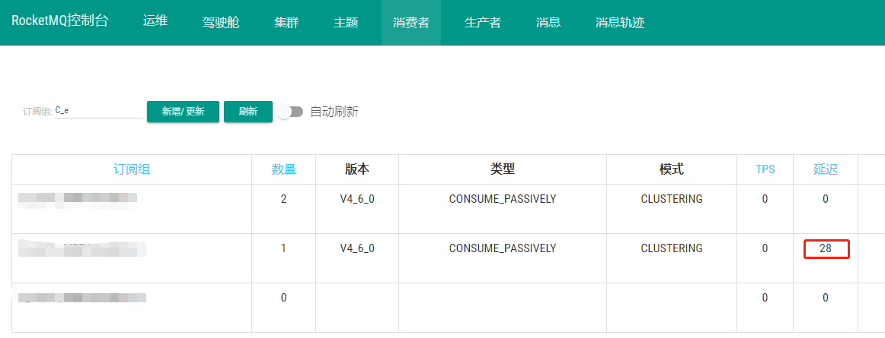
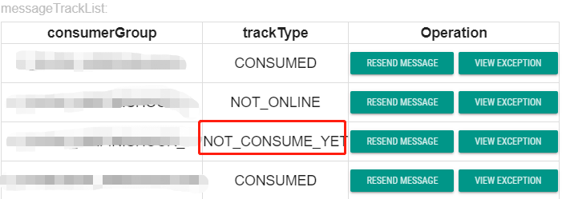
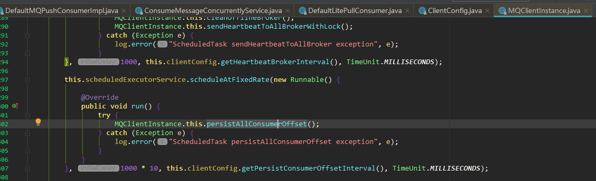
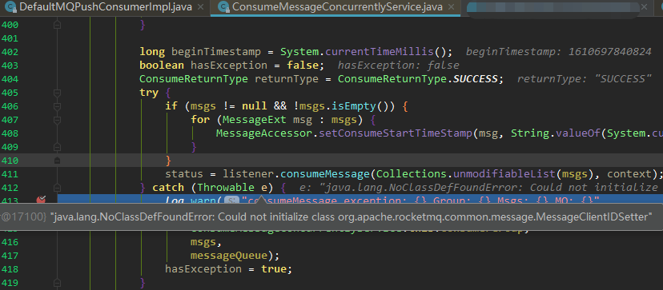
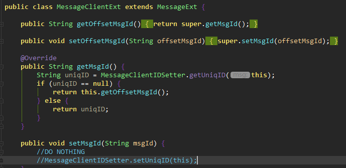
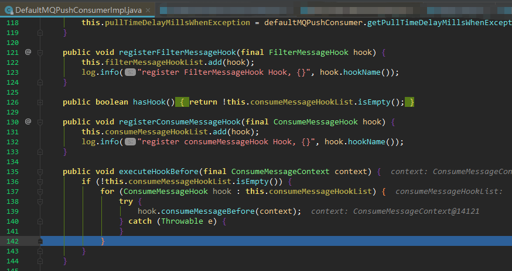
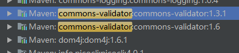
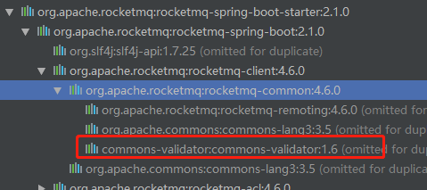
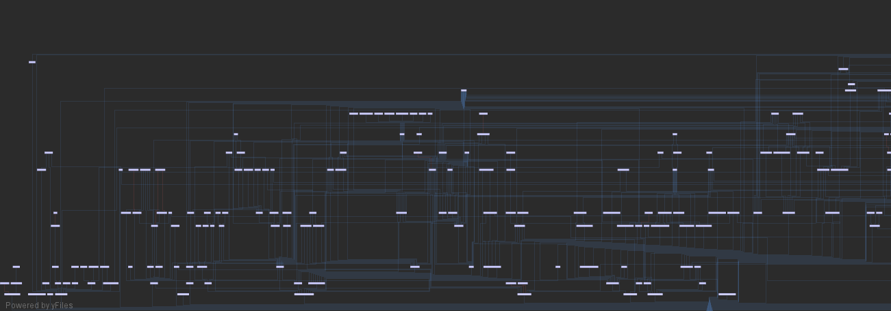

# RocketMQ 消费者依赖冲突导致无法消费，消息堆积

https://my.oschina.net/laigous/blog/4905562（已失效）

https://www.yisu.com/zixun/527805.html（转载）

### 发现问题：

开发中在项目重启时会重复消费消息，但其实消息已经消费过了。

### 查找问题：

##### 1.RocketMq console查看，发现订阅组消息延迟



##### 2.从消息看message Detail 对应的consumerGroup trackType为 not conume yet



##### 3.项目日志也没有任何错误日志，然而根据相关业务查询数据库发现数据已经处理完成

##### 4.业务代码断点，没有抛出任何异常，通过resend message也能正常消费

##### 5.怀疑是不是rocketMq 更新offset的定时任务没有启动

然而通过源码断点MQClientInstance 定时任务正常，只是每次更新的offset都是原offet

##### 6.看看是不是消费的时候出了问题

由于是用的spring-boot整合的client,跟踪consumer源码，代码在DefaultRocketMQListenerContainer.handleMessage方法中

然而一切正常，再往上跟踪到DefaultMessageListenerConcurrently

```java
public class DefaultMessageListenerConcurrently implements MessageListenerConcurrently {

        @SuppressWarnings("unchecked")
        @Override
        public ConsumeConcurrentlyStatus consumeMessage(List<MessageExt> msgs, ConsumeConcurrentlyContext context) {
            for (MessageExt messageExt : msgs) {
                log.debug("received msg: {}", messageExt);
                try {
                    long now = System.currentTimeMillis();
                    handleMessage(messageExt);
                    long costTime = System.currentTimeMillis() - now;
                    log.debug("consume {} cost: {} ms", messageExt.getMsgId(), costTime);
                } catch (Exception e) {
                    log.warn("consume message failed. messageExt:{}, error:{}", messageExt, e);
                    context.setDelayLevelWhenNextConsume(delayLevelWhenNextConsume);
                    return ConsumeConcurrentlyStatus.RECONSUME_LATER;
                }
            }

            return ConsumeConcurrentlyStatus.CONSUME_SUCCESS;
        }
    }
```

首先在catch代码块点打断点看看是不是有问题，结果发现并没有走到这里，这就坑爹了，害我又从其它方面各种查原因，浪费了很多时间。后面一步一步调试，最终在 log.debug("consume {} cost: {} ms", messageExt.getMsgId(), costTime); 打日志这一步时抛出了异常，这尼玛打个日志还能异常，还不是Exception的异常。。本来松了口气以为找到了原因就好解决了，没想到这才是刚刚开始。

##### 7.在往上层调用代码ConsumeMessageConcurrentlyService里断点查看异常信息

java.lang.NoClassDefFoundError:Could not initialize class org.apache.rocketmq.common.message.MessageClientIDSetter



原因是在MessageClientExt类中调用getMsgId方法里，调用了MessageClientIDSetter.getUniqID(**this**)直接抛出的异常



从异常信息来看是MessageClientIDSetter 在初始化的时候出了问题

##### 8.查看MessageClientIDSetter原码，有一断静态代码块，然后在这里断点跟踪。

```java
static {
        byte[] ip;
        try {
            ip = UtilAll.getIP();
        } catch (Exception e) {
            ip = createFakeIP();
        }
        LEN = ip.length + 2 + 4 + 4 + 2;
        ByteBuffer tempBuffer = ByteBuffer.allocate(ip.length + 2 + 4);
        tempBuffer.position(0);
        tempBuffer.put(ip);
        tempBuffer.position(ip.length);
        tempBuffer.putInt(UtilAll.getPid());
        tempBuffer.position(ip.length + 2);
        tempBuffer.putInt(MessageClientIDSetter.class.getClassLoader().hashCode());
        FIX_STRING = UtilAll.bytes2string(tempBuffer.array());
        setStartTime(System.currentTimeMillis());
        COUNTER = new AtomicInteger(0);
    }
```

发面是在ip = UtilAll.getIP();出了问题，然则并没有到catch代码块，而是跳到了DefaultMqPushConsumerImpl类中，这里又一个坑爹的是异常块没有任何处理，看不到异常信息，好吧只能一步一步继续断点调试



最终在UtillAll类的ipV6Check方法执行到InetAddressValidator.getInstance();出了问题。

```java
private static boolean ipV6Check(byte[] ip) {
        if (ip.length != 16) {
            throw new RuntimeException("illegal ipv6 bytes");
        }

        InetAddressValidator validator = InetAddressValidator.getInstance();
        return validator.isValidInet6Address(ipToIPv6Str(ip));
    }
```

但是在本地调试这段代码又没有任何问题。因此只能在debug时调试，报的错是classNotFound异常

##### 9.这又是坑爹的问题，源码上看着类也能找到，最后查看maven依赖，才发现有jar包冲突。



从rocketMq的依赖来看他需要的版本是1.6



因此我们需要把1.3.1的版本移除

##### 10.查找依赖1.3.1版本的commons-validator

看着这密密麻麻的依赖关系，Idea还没有查找功能，只能慢慢找了，最后功夫不复有心人，把依赖移除，重启一切都好了


