# Linux内核Page Cache和Buffer Cache关系及演化历史

[http://lday.me/2019/09/09/0023_linux_page_cache_and_buffer_cache/](https://lday.me/2019/09/09/0023_linux_page_cache_and_buffer_cache/) 

## 0. 背景

在我们进行数据持久化，对文件内容进行落盘处理时，我们时常会使用`fsync`操作，该操作会将文件关联的脏页（dirty page）数据（实际文件内容及元数据信息）一同写回磁盘。这里提到的脏页（dirty page）即为页缓存（page cache）。

块缓存（buffer cache），则是内核为了加速对底层存储介质的访问速度，而构建的一层缓存。它<u>缓存部分磁盘数据，当有磁盘读取请求时，会首先查看块缓存中是否有对应的数据</u>，如果有的话，则直接将对应数据返回，从而减少对磁盘的访问。

两层缓存各有自己的缓存目标，我好奇的是，这两者到底是什么关系。本文主要参考若干 kernel 资料，对应的kernel源码版本主要包括：linux-0.11, linux-2.2.16, linux-2.4.0, linux-2.4.19, linux-2.6.18。

## 1. 两类缓存各自的作用

### 1.1 Page Cache

Page Cache 以 Page 为单位，缓存文件内容。缓存在 Page Cache 中的文件数据，能够更快的被用户读取。同时对于带 buffer 的写入操作，数据在写入到 Page Cache 中即可立即返回，而不需等待数据被实际持久化到磁盘，进而提高了上层应用读写文件的整体性能。

### 1.2 Buffer Cache

磁盘的最小数据单位为 sector，每次读写磁盘都是以 sector 为单位对磁盘进行操作。sector 大小跟具体的磁盘类型有关，有的为 512Byte， 有的为 4K Bytes。无论用户是希望读取 1byte，还是 10byte，最终访问磁盘时，都必须以 sector 为单位读取。如果裸读磁盘，那意味着数据读取的效率会非常低。同样，如果用户希望向磁盘某个位置写入（更新）1byte 的数据，他也必须整个刷新一个sector。言下之意，则是在写入这 1byte 之前，我们需要先将该 1byte 所在的磁盘 sector 数据全部读出来，在内存中，修改对应的这1个byte数据，然后再将整个修改后的sector数据，一口气写入磁盘。

为了降低这类低效访问，尽可能的提升磁盘访问性能，内核会在磁盘 sector 上构建一层缓存，他以 sector 的整数倍为粒度单位（block），缓存部分 sector 数据在内存中，当有数据读取请求时，他能够直接从内存中将对应数据读出。当有数据写入时，他可以直接再内存中直接更新指定部分的数据，然后再通过异步方式，把更新后的数据写回到对应磁盘的sector中。这层缓存则是块缓存Buffer Cache。

## 2. 两类缓存的逻辑关系

从 linux-2.6.18 的内核源码来看，**Page Cache 和 Buffer Cache 是一个事物的两种表现：对于一个 Page 而言，对上，他是某个 File 的一个 Page Cache，而对下，他同样是一个 Device 上的一组 Buffer Cache**。

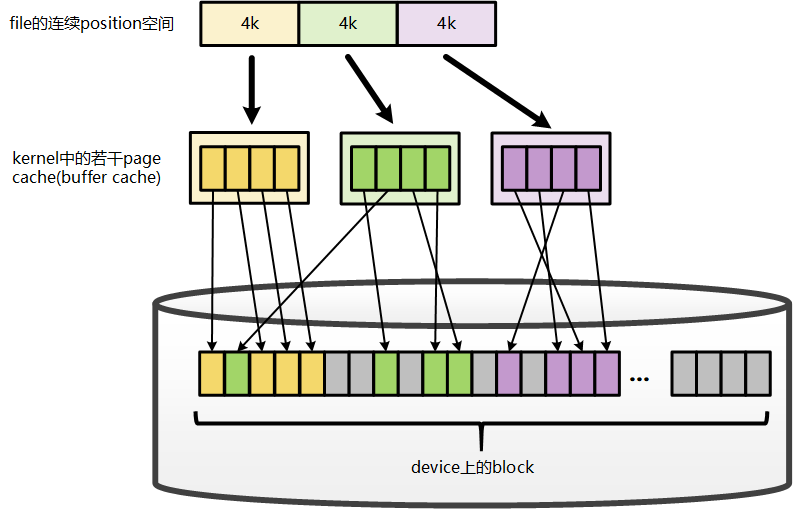

File 在地址空间上，以 4K(page size) 为单位进行切分，每一个4k都*可能*对应到一个page上（这里*可能*的含义是指，只有被缓存的部分，才会对应到page上，没有缓存的部分，则不会对应）。而这个 page，就是这个文件的一个 Page Cache。

而对于落磁盘的一个文件而言，最终，这个 4k 的 page cache，还需要映射到一组磁盘 block 对应的 buffer cache 上，假设 block 为 1k，那么每个 page cache 将对应一组（4个）buffer cache。而每一个 buffer cache，则有一个对应的 buffer cache 与 device block 映射关系的描述符：buffer_head。这个描述符记录了这个 buffer cache 对应的 block 在磁盘上的具体位置。

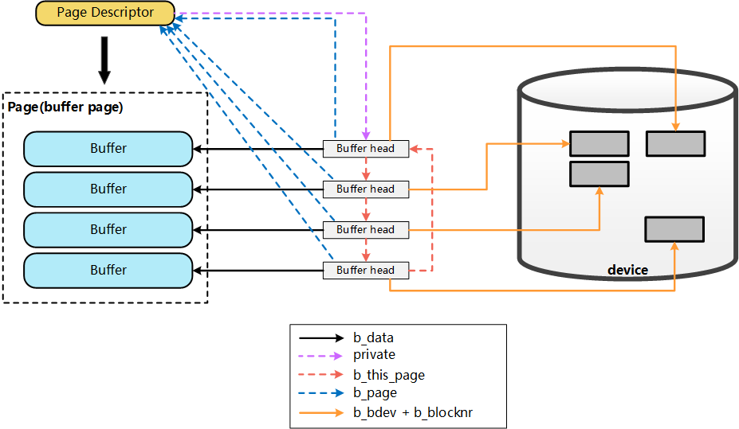

上图只展示了Page Cache与Buffer Cache(buffer_head)，以及对应的block之间的关联关系。而从File的角度来看，要想将数据写入磁盘，第一步，则是需要找到file具体位置对应的page cache是哪个page？ 进而才能将数据写入。而要找到对应的page，则依赖于inode结构中的`i_mapping`字段：

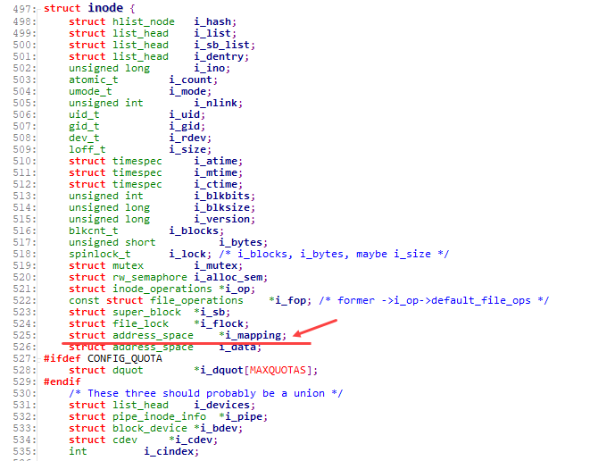

该字段为一`address_space`结构，而实际上`address_space`即为一棵radix tree。简单来说，radix tree即为一个多级索引结构，如果将一个文件的大小，以page为单位来切分，假设一个文件有N个page，这个N是一个32bit的int，那么，这个32bit的N，可以被切分成若干层级：level-0: [0 - 7bit], level-1:[8 - 15bit], level-2: [16 - 23bit], level-3: [24 - 31bit]。在查找File某个位置对应的page是否存在时，则拿着这个page所在的位置N，到对应的radix-tree上查找。 查找时，首先通过N中的level-0部分，到radix tree上的level-0层级索引上去查找，如果不存在，则直接告知不存在，如果存在，则进一步的，拿着N中的level-1部分，到这个level-0下面对应的level-1去查找，一级一级查找。这样，我们可以看出，最多，在4层索引上查找，就能找到N对应的page信息。radix-tree及address_space的详细描述，可参考[^12]、[^2]中的说明。这里借用[^12]、[^2]中的各自一张图，可能会更好说明radix-tree(address_space)结构的样子：

基本的radix-tree映射结构：

对应的inode上，i_mapping字段(address_space)对page的映射关系：

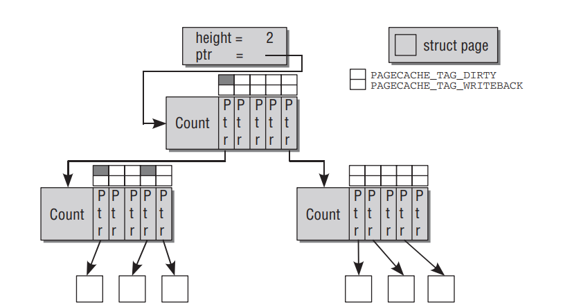

## 3. 两类缓存的演进历史

虽然，目前Linux Kernel代码中，Page Cache和Buffer Cache实际上是统一的，无论是文件的Page Cache还是Block的Buffer Cache最终都统一到Page上。但是，在阅读较老代码时，我们能够看出，这两块缓存的实现，原本是完全分开的。是什么原因使得最终这两类缓存“走到了一起”？[10]中各位的回答，让我豁然开来。 我试着对这一演进的由来做个梳理。

### 3.1 仅有Buffer Cache

在Linux-0.11版本的代码中，我们会看到，buffer cache是完全独立的实现，甚至都还没有基于page作为内存单元，而是以原始指针的系形式出现。每一个block sector，在kernel内部对应一个独立的buffer cache单元，这个buffer cache单元通过buffer head来描述：

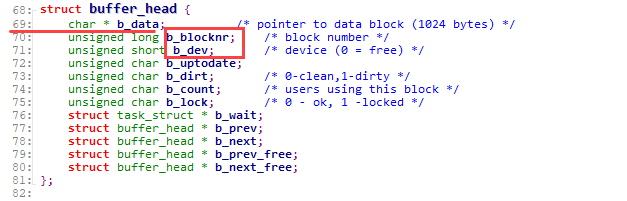

其中，buffer_head在初始化时，其内部的`b_data`指向的是原始的内存地址：

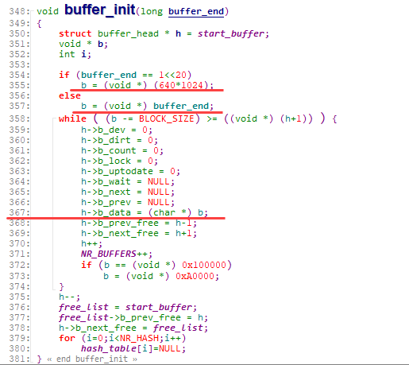

其中，`b_data`指向具体的buffer cache内容，而`b_dev`和`b_blocknr`则代表了这块缓存对应的device以及device上的block number信息。

kernel通过`getblk`函数，会将一个指定dev, blocknr sector对应的buffer cache单元(buffer header)返回给调用方。上层读取、写入这个buffer_header，最终将会映射到对应(dev, blocknr) sector的读取和写入。

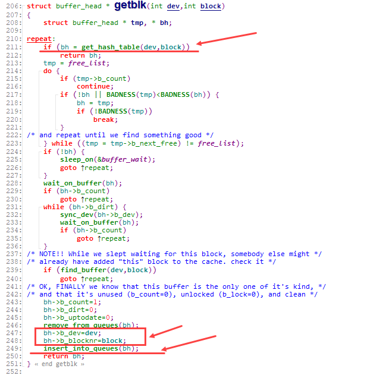

如果一个对应的buffer cache单元(dev, blocknr)已经在kernel中分配了，则会通过`get_hash_table`直接返回给用户，如果没有，则会首先创建出对应的buffer_header，并将其加入到hash_table中(`inser_into_queues`)，最终返回给用户。

上层对于文件的读写，会转化到对于对应buffer_header的读写：

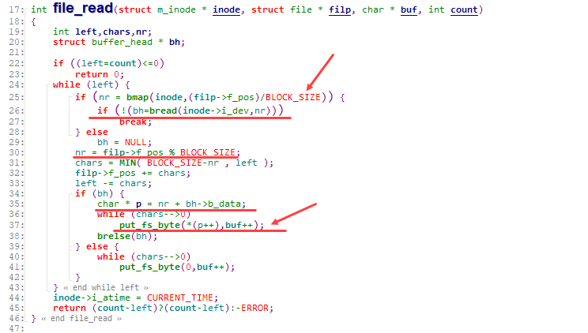

file_read时，会先通过`f_pos`计算出实际位于的dev, blocknr位置，并通过`bread`获取到对应的`buffer_head`, 而在此之后，则会通过`put_fs_byte`完成buffer cache单元中的数据向目标buf的数据回填(数据读取)

同理，在向文件中写入数据时，也是通过`f_pos`首先计算出对应的dev, blocknr位置信息，进而通过`bread`拿到对应的buffer_head，并向buffer_header对应的buffer cache单元中写入数据

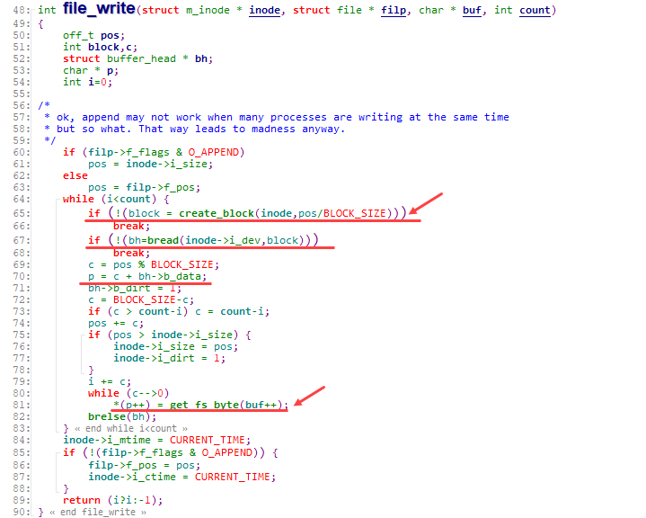

从上面file_read, file_write的实现来看，我们会看到`bread`返回目标buffer_head，让上层只操作buffer cache单元，而不再关心block底层。

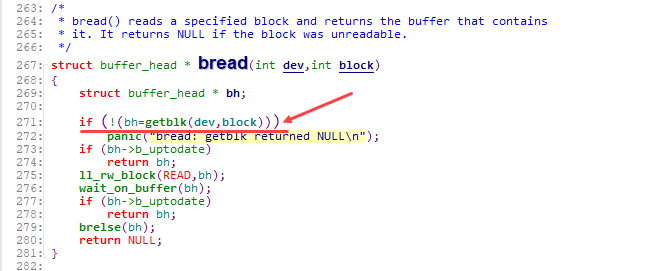

而`bread`内部则是通过上面提到的`getblk`函数，返回对应的buffer_head，接着执行数据读取。

### 3.2 Page Cache、Buffer Cache 两者并存

到Linux-2.2版本时，磁盘文件访问的高速缓冲仍然是缓冲区高速缓冲(Buffer Cache)。其访问模式与上面Linux-0.11版本的访问逻辑基本类似。但此时，Buffer Cache已基于page来分配内存，buffer_head内部，已经有了关于所在page的一些信息：

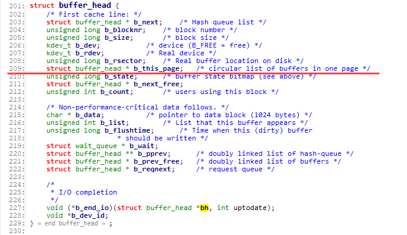

同时，从buffer cache的初始化，以及buffer cache不足时新建buffer cache单元的动作，我们也可以看出，此时buffer cache已经完全是基于page来分配内存

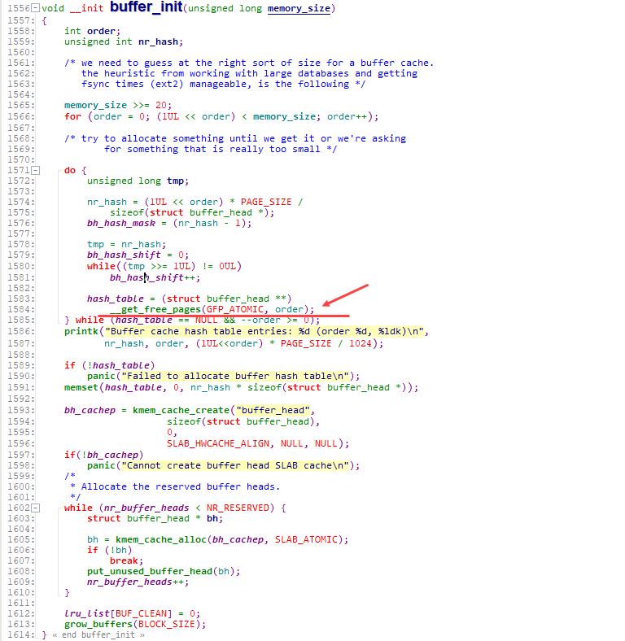

当buffer cache不足时，通过`grow_buffers`来新增buffer cache:

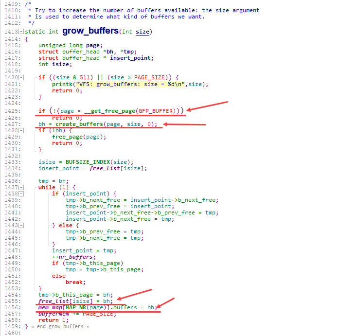

并通过`create_buffers`来完成对buffer_head的初始化构造：

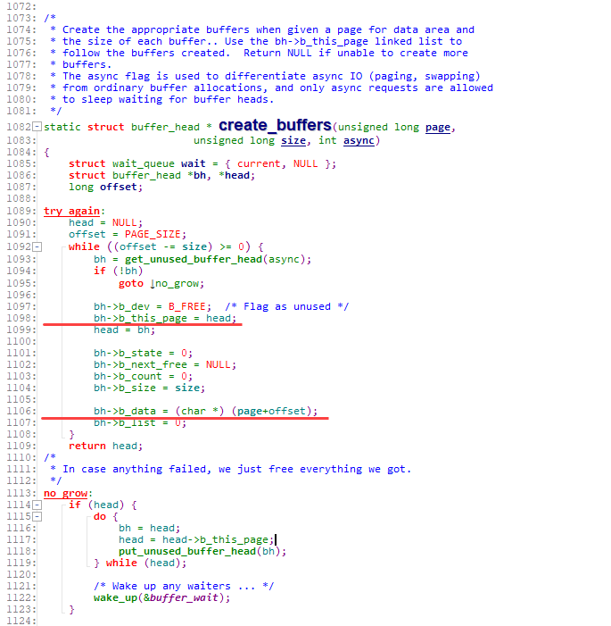

以Linux-2.2.16版本的代码为例，在执行磁盘文件写入时，会通过xxx_getblk获取对应位置的`buffer_head`信息，并将对应的数据写入该buffer中。在此之后，会执行一步**`update_vm_cache`**，至于为什么会要执行这一步，我们后面再来看。

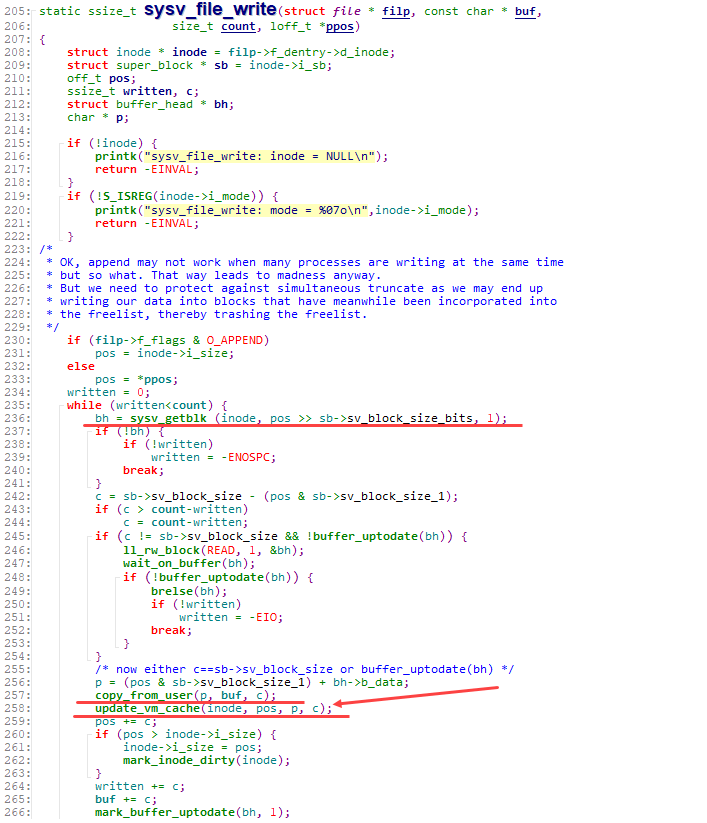

而对于对应的文件读取，则是同样，先通过xxx_getblk找到对应的buffer_head，在此之后，完成对应的数据读取。（通过while循环，一口气将所有目标block的buffer_head拿出来，再一把读取所有的数据）

[!img](./20230318-linux-page-cache-and-buffer-cache.assets/07_linux-2.2.16_sysv_file_read.png)

而xxx_getblk最终，还是使用的`getblk`接口来定位到指定的`buffer_head`:

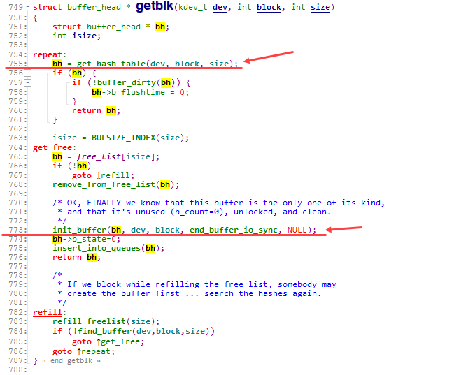

从上面的描述我们可以看出，此时的buffer cache基于page来分配内存，但是与Page Cache完全独立，一点关系都没有。

在Linux-2.2版本中，**Page Cache**此时用来干什么的？

(1). 用于文件的mmap:

来自[^10]:

> page cache was used to cache pages of files mapped with mmap MAP_FILE among other things.

来自[^11]:

> read() and write() are implemented using the buffer cache. The read() system call reads file data into a buffer cache buffer and then copies it to the application. The mmap() system call, however, has to use the page cache to store its data since the buffer cache memory is not managed by the VM system and thus not cannot be mapped into an application address space. Therefore the file data in the buffer cache is copied into page cache pages, which are then used to satisfy page faults on the application mappings.

用于network-based filesytems:
来自[^1]：

> Disk-based filesystems do not directly use the page cache for writing to a regular file. This is
> a heritage from older versions of Linux, in which the only disk cache was the buffer cache.
> However, network-based filesystems always use the page cache for writing to a regular file.

此时， Page Cache和Buffer Cache的关系如下图所示：

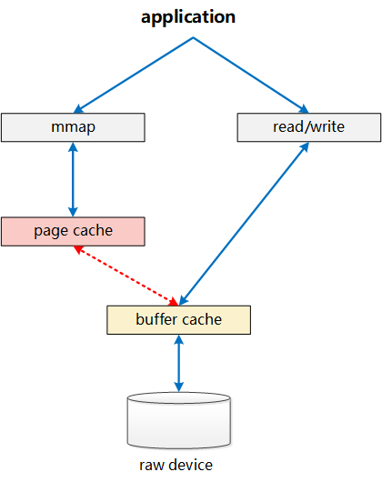

Page Cache仅负责其中mmap部分的处理，而Buffer Cache实际上负责所有对磁盘的IO访问。从上面图中，我们也可看出其中一个问题：write绕过了Page Cache，这里导致了一个同步问题。当write发生时，有效数据是在Buffer Cache中，而不是在Page Cache中。这就导致mmap访问的文件数据可能存在不一致问题。为了解决这个问题，所有基于磁盘文件系统的write，都需要调用**`update_vm_cache()`**函数，该操作会修改write相关Buffer Cache对应的Page Cache。从代码中我们可以看到，上述`sysv_file_write`中，在调用完`copy_from_user`之后，会调用`update_vm_cache`

同样，正是这样Page Cache、Buffer Cache分离的设计，导致基于磁盘的文件，同一份数据，可能在Page Cache中有一份，而同时，却还在Buffer Cache中有一份。

### 3.3 Page Cache、Buffer Cache 两者融合

介于上述Page Cache、Buffer Cache分离设计的弊端，Linux-2.4版本中对Page Cache、Buffer Cache的实现进行了融合，融合后的Buffer Cache不再以独立的形式存在，Buffer Cache的内容，直接存在于Page Cache中，同时，保留了对Buffer Cache的描述符单元：`buffer_head`

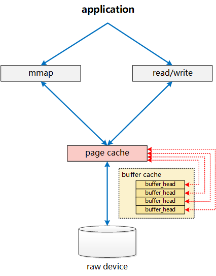

page结构中，通过`buffers`字段是否为空，来判定这个Page是否与一组Buffer Cache关联（在后续的演进过程中，这个判断，转变为由`private`字段来判定）。

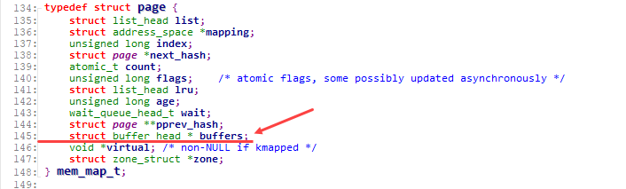

而对应的， buffer_head则增加了字段`b_page`，直接指向对应的page。

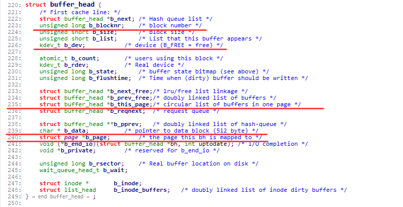

至此，两者的关系已经相互融合如下图所示：

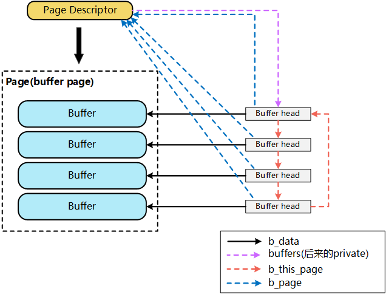

一个文件的PageCache(page)，通过`buffers`字段能够非常快捷的确定该page对应的buffer_head信息，进而明确该page对应的device, block等信息。

从逻辑上来看，当针对一个文件的write请求进入内核时，会执行`generic_file_write`，在这一层，通过inode的address_space结构`mapping`会分配一个新的page来作为对应写入的page cache(这里我们假设是一个新的写入，且数据量仅一个page)：`__grab_cache_page`，而在分配了内存空间page之后，则通过`prepare_write`，来完成对应的buffer_head的构建。

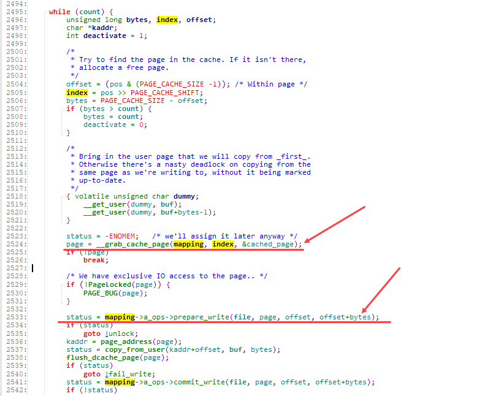

`prepare_write`实际执行的是：`__block_prepare_write`，在其中，会针对该page分配对应的buffer_head(`create_empty_buffers`)，并计算实际写入的在device上的具体位置：blocknr，进而初始化buffer_head(`get_block`)

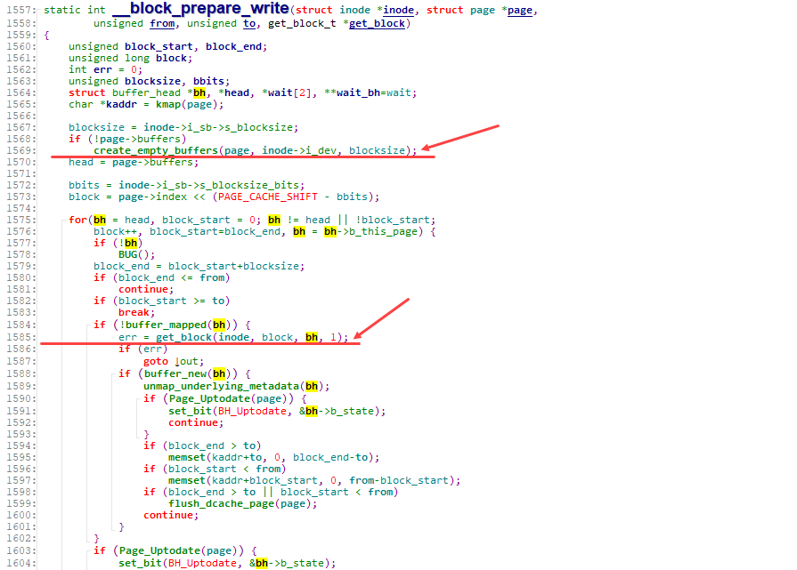

在`create_empty_buffers`内部，则通过`create_buffers`以及`set_bh_page`等一系列操作，将page与buffer_head组织成如前图所示的通过`buffers`、`b_page`等相互关联的关系。

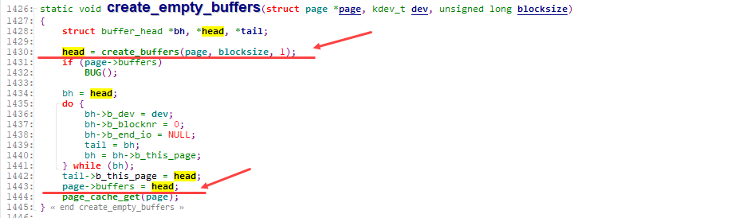

通过`create_buffers`分配一组串联好的buffer_head

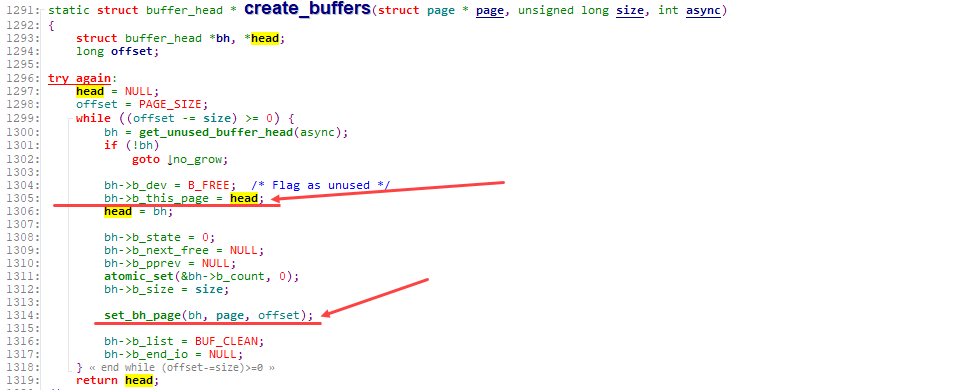

通过`set_bh_page`将各buffer_head关联到对应的page，以及data的具体位置

正是如上的一系列动作，使得Page Cache与Buffer Cache(buffer_head)相互绑定。对上，在文件读写时，以page为单位进行处理。而对下，在数据向device进行刷新时，则可以以buffer_head(block)为单位进行处理。

在后续的linux-2.5版本中，引入了bio结构来替换基于buffer_head的块设备IO操作。

**[注意]**：这里的Page Cache与Buffer Cache的融合，是针对文件这一层面的Page Cache与Buffer Cache的融合。对于跨层的：File层面的Page Cache和裸设备Buffer Cache，虽然都统一到了基于Page的实现，但File的Page Cache和该文件对应的Block在裸设备层访问的Buffer Cache，这两个是完全独立的Page，这种情况下，一个物理磁盘Block上的数据，仍然对应了Linux内核中的两份Page，一个是通过文件层访问的File的Page Cache(Page Cache)，一个是通过裸设备层访问的Page Cache(Buffer Cache)。

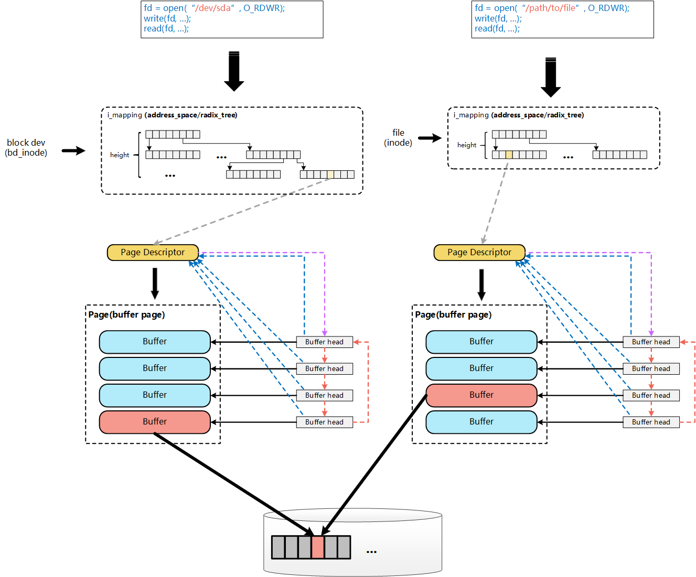

## 4. 参考资料

[^1]: Understanding the Linux Kernel
[^2]: Professional Linux Kernel Architecture
[^3]: The Art of Linux Kernel Design
[^4]: Linux Kernel Development

[^5]: A Heavily Commented Linux Kernel Source Code
[^6]: Linux内核源代码情景分析
[^7]: 独辟蹊径品内核：Linux内核源代码导读
[^8]: [Linux内核的文件Cache管理机制介绍](https://www.ibm.com/developerworks/cn/linux/l-cache/index.html)
[^9]: [Linux内核文件Cache机制](https://ilinuxkernel.com/?p=1700)
[^10]: [What is the major difference between the buffer cache and the page cache](https://www.quora.com/What-is-the-major-difference-between-the-buffer-cache-and-the-page-cache-Why-were-they-separate-entities-in-older-kernels-Why-were-they-merged-later-on)
[^11]: UBC: An Efficient Unified I/O and Memory Caching Subsystem for NetBSD
[^12]: [Trees I: Radix trees](https://lwn.net/Articles/175432/)