# 简述 Linux I/O 原理及零拷贝

https://xie.infoq.cn/article/34df6603f70c94dc4172c9474

https://xie.infoq.cn/article/06449d84c5f6b005775215024

## 1. 简述

什么是零拷贝？零拷贝其实是泛指减少 CPU 复制数据的技术。要讨论“减少”，必须得弄清楚原本为什么需要。

所以：想理解好零拷贝，重点还在于理解为什么需要拷贝，以及不同零拷贝技术的对比。想理解好 I/O 原理，必须先弄清楚数据结构。

掌握了下面这张图，了解各每个组件的作用，自然就理解了 I/O 及零拷贝。

本文重点在于总结 Linux I/O 相关知识之间的联系，帮助读者系统的了解相关原理，因此不会很深入地讨论某一个技术点。另外，本文只包含磁盘 I/O 部分及部分零拷贝内容，后续还会分享网络 I/O，敬请期待《简述 Linux IO 原理及零拷贝（中）——网络 I/O》。

> ***绿色的图形表示数据存储的位置，绿色的箭头则表示数据的复制。* 

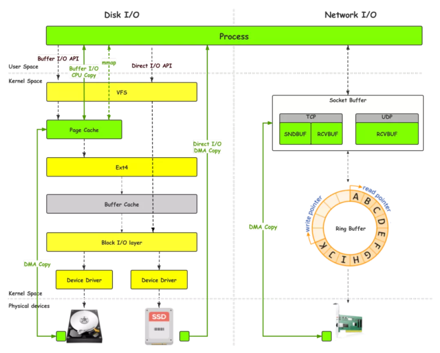

## 2. 划分

从左到右，Linux IO 包含两部分：磁盘 IO 和网络 IO，这个大家都能理解。

从上到下，存储又被划分为三部分：用户空间、内核空间以及物理设备。

### 2.1 从上到下，为什么划分为三层？

我们既然讲数据拷贝，肯定是按是否存在数据拷贝来划分的。内存和外存储是不同的硬件介质，他们之间相互访问自然是靠数据拷贝的，所以要分开。

另外，Linux 操作系统为了安全考虑，其内核管理了几乎所有的硬件设备，不允许用户进程直接访问。因此，逻辑上计算机被分为用户空间和内核空间（外设及其驱动是被划分在内核空间的）。

运行在用户空间的进程就是用户态，运行在内核空间的进程就是内核态。用户态的程序，访问不了内核空间的数据，所以就需要由内核态的进程把数据拷贝到用户态。

------

# 磁盘 I/O

## 1. 缓存 I/O (Buffered I/O)

理解了上面讲的分层逻辑，我们拿 read 举例。

数据从硬盘拷贝到内核空间，再从内核空间拷贝到用户空间，这种 I/O 方式就是标准 I/O。

当线程多次访问同一份磁盘上的数据时，Linux 并不会傻傻地多次访问磁盘。因为磁盘相对内存来时实在是太慢了，为了减少读盘的次数，被加载在内核空间的那份数据会被重复使用（页缓存/Page cache）。

同理，线程的写入操作也会先写入页缓存中，在根据 Linux 的延迟写机制，写入到磁盘中。因此，标准 I/O 又被称作缓存 I/O 大多数文件系统的默认 I/O 操作都是缓存 I/O。

#### 1.1 Page cache 和 Buffer cache

讲到了 Buffered I/O，就得讲一下 Linux 是怎么管理内核空间中那份数据缓存的。早期的 Linux，把缓存分为了两种：**Page cache** 和 **Buffer cache**。

**Buffer cache** 也叫块缓冲，是对物理磁盘上的一个磁盘块进行的缓冲。其大小为通常为 1k，磁盘块也是磁盘的组织单位。设立 Buffer cache 的目的是为在程序多次访问同一磁盘块时，减少访问时间。

**Page cache** 也叫页缓冲或文件缓冲。是由好几个磁盘块构成，大小通常为 4k，在 64 位系统上为 8k。构成的几个磁盘块在物理磁盘上不一定连续，文件的组织单位为一页，也就是一个 Page cache 大小。

文件读取是由外存上不连续的几个磁盘块，到 Buffer cache，然后组成 Page cache，然后供给应用程序。

从图中可以看到 Page cache 是建立在文件系统(Ext4)之上的，因此其缓存的是逻辑数据 。Buffer cache 是建立在块层之上的，因此其缓存的是物理辑数据。

#### 1.2 消失的 Buffer cache

Linux 大约在 2.4.10 之后的 disk cache 只有 Page cache。而 Buffer cache 只是 Page cache 中的 buffer_head 描述符。

换句话说，Page cache 和 Buffer cache 已经合并了。

（所以图中 Buffer cache 是灰色的，为了更容易理解 IO 原理，黄色和灰色部分都可以不考虑了）

#### 1.3 缓存 I/O 的一致性和安全性

如果出现进程死，内核死，掉电这样事件发生。数据会丢失吗?

- 进程死：如果数据还处在 application cache 或 CLib cache 时候，数据会丢失。

- 内核死：即使进入了 page cache(完成了 write)，如果没有进行 sync 操作，数据还是会丢失。

- 掉电：进行了 sync，数据就一定写入了磁盘了吗？答案是：不一定。

  注意到图-1 中，磁盘旁边的绿色图形了吗？它表示的是磁盘上的缓存。写数据达到一个程度时才真正写入磁盘。

#### 1.4 补充知识"磁盘的缓存"

磁盘缓存在磁盘上就表现为一块 RAM 芯片。磁盘上必须有缓存，用来接收指令和数据，还被用来进行预读。磁盘缓存分为**读缓存**和**写缓存**。

**读缓存**是指，操作系统为已读取的文件数据，在内存较空闲的情况下留在内存空间中。当下次软件或用户再次读取同一文件时就不必重新从磁盘上读取，从而提高速度。

**写缓存**实际上就是将要写入磁盘的数据先保存于系统为写缓存分配的内存空间中。当保存到内存池中的数据达到一个程度时，便将数据保存到硬盘中。这样可以减少实际的磁盘操作，有效地保护磁盘免于重复的读写操作而导致的损坏，也能减少写入所需的时间。

所谓磁盘缓存的禁用是指的 Write Through 模式。即：磁盘收到写入指令和数据后，必须先将其写入盘片，然后才向控制器返回成功信号（实际还是先写入缓存，再写入盘片的），这样就相当于“禁用”了缓存。

对一致性要求高的应用，比如 DB/磁盘阵列，都会禁用磁盘写缓存的。

------

## 2. DMA

DMA 是我们最常见的数据传输方式，DMA 的技术细节并不是本文介绍的重点。下文通过对比不同数据传输方式的差别，帮助我们理解 DMA 对于提升性能的重要意义。Linux 提供了 4 种磁盘与主存之间的数据传输机制。

- **直接控制（程序 I/O ）(Programmed I/O)**

基于循环对 I/O 端口进行不断检测。CPU 和 I/O 设备只能串行工作，导致 CPU 的利用率相当低。

- **中断驱动方式（Interrupt）**

当数据到达时，磁盘主动向 CPU 发起中断请求，由 CPU 自身负责数据的传输过程。由于数据中的每个字在存储器与 I/O 控制器之间的传输都必须经过 CPU，这就导致了中断驱动方式仍然会消耗较多的 CPU 时间。而且整个过程中，中断次数很多，导致太多次的上下文切换，所以性能很差。

- **DMA（直接内存访问）方式**

DMA 是一种与 CPU 共享内存总线的设备。它可以代替 CPU，把数据从内存到设备之间进行拷贝。仅在传送一个或多个数据块的开始和结束时，才需 CPU 干预(发送 DMA 中断)，整块数据的传送是在 DMA 控制器的控制下完成的。

- **通道控制方式（不常见）**

通道相当于一个功能简单的处理机。包含通道指令(读，写，控制，转移)，并可执行用这些指令编写的通道程序。I/O 通道方式是 DMA 方式的加强，它可以进一步减少 CPU 的干预。即把对一个数据块的读（或写）为单位的干预，减少为对一组数据块的读（或写）及有关的控制和管理为单位的干预。同时，又可以实现 CPU、通道和 I/O 设备三者的并行操作，从而更有效地提高整个系统的资源利用率。

#### 2.1 不同传输机制的流程图

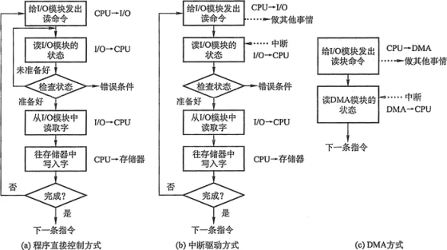

#### 2.2 不同传输机制的时序图

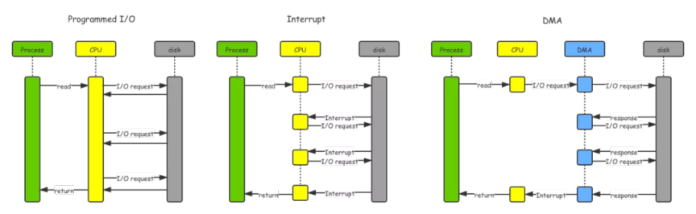

#### 2.3 I/O 通道与 DMA 方式的区别

- DMA 方式需要 CPU 来控制传输的数据块大小、传输的内存位置，而通道方式中这些信息是由通道控制的。
- 每个 DMA 控制器对应一台设备与内存传递数据，而一个通道可以控制多台设备与内存的数据交换。

#### 2.4 总结

PIO，中断 IO 都属于 CPU 拷贝。通道控制，是 DMA 的增强，严格来讲属于 DMA 技术。

I/O 通道并不常见，而程序 I/O，中断 I/O 的效率又太低了。所以，我们常见的磁盘 I/O 和网络 I/O 都是 DMA 方式，后文中也不再提及其他传输机制。

#### 2.5 缓存 I/O 的缺点

在缓存 I/O 机制中，DMA 方式可以将数据直接从磁盘读到页缓存中，或者将数据从页缓存直接写回到磁盘上，而不能直接在应用程序地址空间和磁盘之间进行数据传输。这样的话，数据在传输过程中需要在应用程序地址空间和页缓存之间进行多次数据拷贝操作，这些数据拷贝操作所带来的 CPU 以及内存开销是非常大的。

对于某些特殊的应用程序来说，避开操作系统内核缓冲区，而直接在应用程序地址空间和磁盘之间传输数据，会比使用操作系统内核缓冲区获取更好的性能，因此引入"Direct I/O"。

------

## 3. 直接 I/O(Direct I/O)

从 2.6.0 内核开始支持直接 I/O。

凡是通过直接 I/O 方式进行数据传输，数据均直接在用户地址空间的缓冲区和磁盘之间直接进行传输，完全不需要页缓存的支持。

进程在打开文件的时候设置对文件的访问模式为 O_DIRECT ，这样就等于告诉操作系统进程在接下来使用 read() 或者 write() 系统调用去读写文件的时候使用的是直接 I/O 方式，所传输的数据均不经过操作系统内核缓存空间。

使用直接 I/O 读写数据必须要注意缓冲区对齐（ buffer alignment ）。

从第一张图中可以看到，Direct I/O 跨过了文件系统，由块设备执行直接 I/O 提供的支持，因此 O_DIRECT 要求的对齐基本单位是底层块设备的逻辑块大小（Logical Block Size 也叫 Sector Size）。

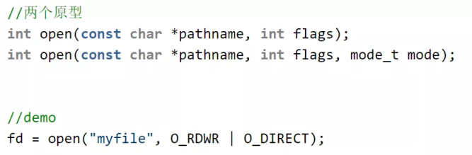

#### 3.1 直接 I/O 优点

最大的优点就是减少操作系统缓冲区和用户地址空间的拷贝次数。降低了 CPU 的开销，和内存带宽。对于某些应用程序来说简直是福音，将会大大提高性能。

#### 3.2 直接 I/O 缺点

直接 I/O 并不总能让人如意。直接 I/O 的开销也很大，应用程序没有控制好读写，将会导致磁盘读写的效率低下。磁盘的读写是通过磁头的切换到不同的磁道上读取和写入数据，如果需要写入数据在磁盘位置相隔比较远，就会导致寻道的时间大大增加，写入读取的效率大大降低。

#### 3.3 直接 I/O 的补充

有的文章把直接 I/O 解释成，数据直接跨过内核进行传输，容易造成误解。用户空间的进程是不允许访问内核空间的，因此 Direct I/O 本质是 DMA 设备把数据从用户空间拷贝到设备,或是从设备拷贝到用户空间。

不过事事总有例外，mmap 就是个特别的存在。

------

## 4. mmap

（文档化的定义）mmap 将一个文件或者其它对象映射进内存。普通文件被映射到进程地址空间后，进程可以像访问普通内存一样对文件进行访问，不必再调用 read()，write（）等操作。

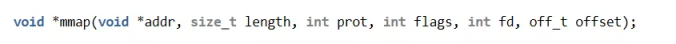

offset 是文件中映射的起始位置，length 是映射的长度。

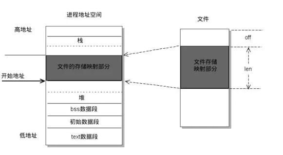

mmap 在用户空间映射调用系统中作用很大。

#### 4.1 mmap 内存映射原理

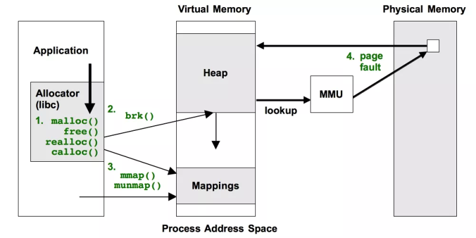

mmap 内存映射过程：

进程在虚拟地址空间中为映射创建虚拟映射区域。

内核把文件物理地址和进程虚拟地址进行映射。

进程发起对这片映射空间的访问，引发缺页异常，实现文件内容到物理内存（主存）的拷贝。

换句话说，在调用 mmap 后，只是在进程的虚拟空间中分配了一段空间，真实的物理地址还不会分配的。

当进程第一次访问这段空间（当作内存一样），CPU 陷入 OS 内核执行异常处理。然后异常处理会在这个时间分配物理内存，并用文件的内容填充这片内存，然后才返回进程的上下文，这时进程才会感知到这片内存里有数据。

#### 4.2 mmap 本质

忘掉文档化的定义。

mmap 本质是内存共享机制，它把 page cache 地址空间映射到用户空间，换句话说，mmap 是一种特殊的 Buffered I/O。

因为底层有 CPU 的 MMU 支持，自然会转换到物理区域，对于进程而言是无感知。所以，磁盘数据加载到 page cache 后，用户进程可以通过指针操作直接读写 page cache，不再需要系统调用和内存拷贝。

因此，offset 必须是按 page size 对齐的（不对齐的话就会映射失败）。

mmap 映射区域大小必须是物理页大小（page size）的整倍数（32 位系统中通常是 4k）。length 对齐是靠内核来保证的，比如文件长度是 10KB，你映射了 5KB，那么内核会将其扩充到 8KB。

#### 4.3 mmap 性能

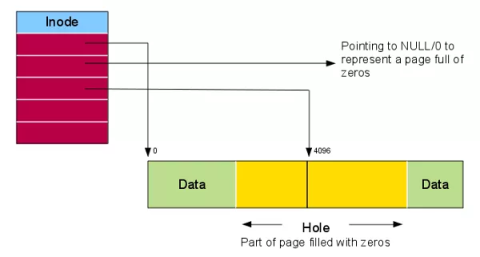

了解 mmap 内存映射原理,有助于了解其性能。

mmap 减少了数据在内核空间与用户空间的复制，从这个角度讲，提高了文件读取效率。但是，mmap 在数据加载到 page cache 的过程中，会触发大量的 page fault 和建立页表映射的操作，开销并不小。

另一方面，随着硬件性能的发展，内存拷贝消耗的时间已经大大降低了。所以很多情况下，mmap 的性能反倒是比不过 read 和 write 的。

#### 4.4 mmap 的补充

有的文章把 mmap 形容成"跨过了页缓存"，因此减少了数据的拷贝次数。这种表述方式是错误的。

mmap 可分为共享映射和私有映射两种。

**共享映射**，修改对所有进程可见。也就是说，如果进程 A 修改了其中某个 page 上的数据，进程 B 之后读取这个 page 得到的就是修改后的内容。

**私有映射**，进程 A 的修改对进程 B 是不可见的，都是同一份数据，这是如何做到的呢？这里利用的是 Copy On Write(COW) 机制。

当进程 A 试图修改某个 page 上的数据时，内核会将这个 page 的内容拷贝一份。之后 A 的写操作实际是在这个拷贝的 page 上进行的（进程 A 中对应这个 page 的页表项也需要被修改，以指向新拷贝的 page），这样进程 B 看到的这个 page 还是原来未经改动的。这种修改只会存在于内存中，不会同步到外部的磁盘文件上（事实上也没法同步，因为不同进程所做的修改是不同的）。

Page fault（页缺失，又名缺页中断，缺页异常），属于硬件中断，是由中央处理器的内存管理单元(MMU)所发出的中断。

------

## 5. 磁盘 I/O 总结

结婚后，你把工资卡上交给了老婆。你就是用户态，只能管理自己的钱包。你老婆就是内核态，她可以访问银行，管理自己的钱包，也包括你的钱包。

- **缓存 I/O**

  你需要钱的时候跟老婆申请。你老婆会从自己的钱包里把钱放到你的钱包。如果她的钱包里也没钱了，她自己会去银行取钱。

- **直接 I/O**

  你最近用钱比较频繁，需要钱的时候同样需要跟老婆申请。你老婆去银行取了钱，直接放到了你的钱包里。

- **mmap**

  你老婆允许你从她的钱包里拿钱。你老婆钱包里没钱的时候，她自己会去银行取钱。

- **CPU 拷贝/ DMA 拷贝**

  你丈母娘都是自己去银行取钱的，这就是 CPU 拷贝。你老婆要忙着追剧，她懒得去取钱，让银行把钱送你家来，这就是 DMA 拷贝。实际上你老婆一直比较忙，她从来没去过银行，一直是银行把钱送你家来的。

# 网络 I/O

## 简述

这已经是 Linux I/O 系列的第二篇文章。之前我们讨论了“磁盘 I/O 及磁盘 I/O 中的部分零拷贝技术”本篇开始讨论“Linux 网络 I/O 的结构”以及大家关心的零拷贝技术。

## socket 发送和接收的过程

socket 是 Linux 内核对 TCP/UDP 的抽象，在这里我们只讨论大家最关心的 TCP。

### TCP 如何发送数据

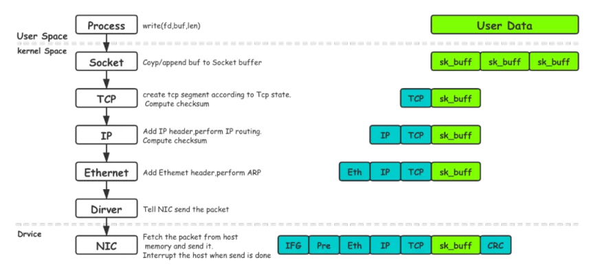

*图 1*

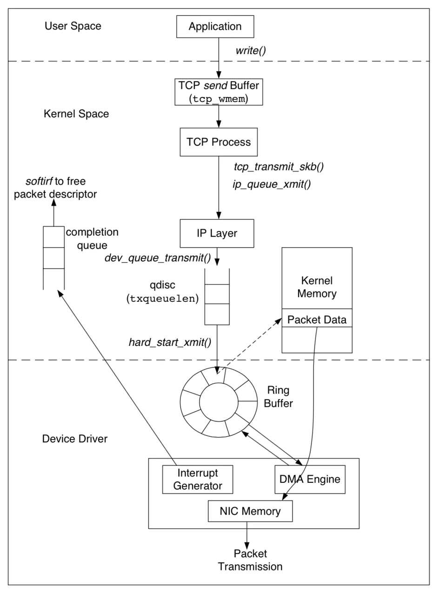

*图 2*

1. 程序调用了 write/send，进入内核空间。

2. 内核根据发送数据创建 sk_buff 链表，sk_buff 中最多会包含 MSS 字节。相当于用 sk_buff 把数据切割了。这个 sk_buff 形成的链表，就是常说的 socket 发送缓冲区。

   *另外 ，有关 MSS 的具体内容我们需要另外写一篇文章讨论，这里我们只要理解为网卡的限制即可

3. 检查堵塞窗口和接收窗口，判断接收方是否可以接收新数据。

   创建数据包（packet,或者叫 TCP 分段 TCP segment）；添加 TCP 头，进行 TCP 校验。

4. 执行 IP 路由选择，添加 IP 头，进行 IP 校验。

   通过 QDisc（排队规则）队列将数据包缓存起来，用来控制网络收发的速度。

5. 经过排队，数据包被发送到驱动，被放入 **Ring Buffer（Tx.ring）**输出队列。

6. 网卡驱动调用 DMA engine 将数据从系统内存中拷贝到它自己的内存中。

7. NIC 会向数据包中增加帧间隙（Inter-Frame Gap，IFG），同步码（preamble）和 CRC 校验。当 NIC 发送了数据包，NIC 会在主机的 CPU 上产生中断，使内核确认已发送。

### TCP 如何接收数据

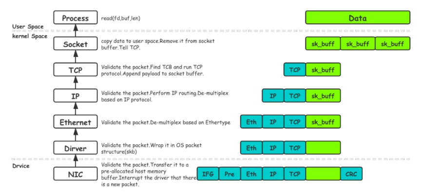

*图 3*

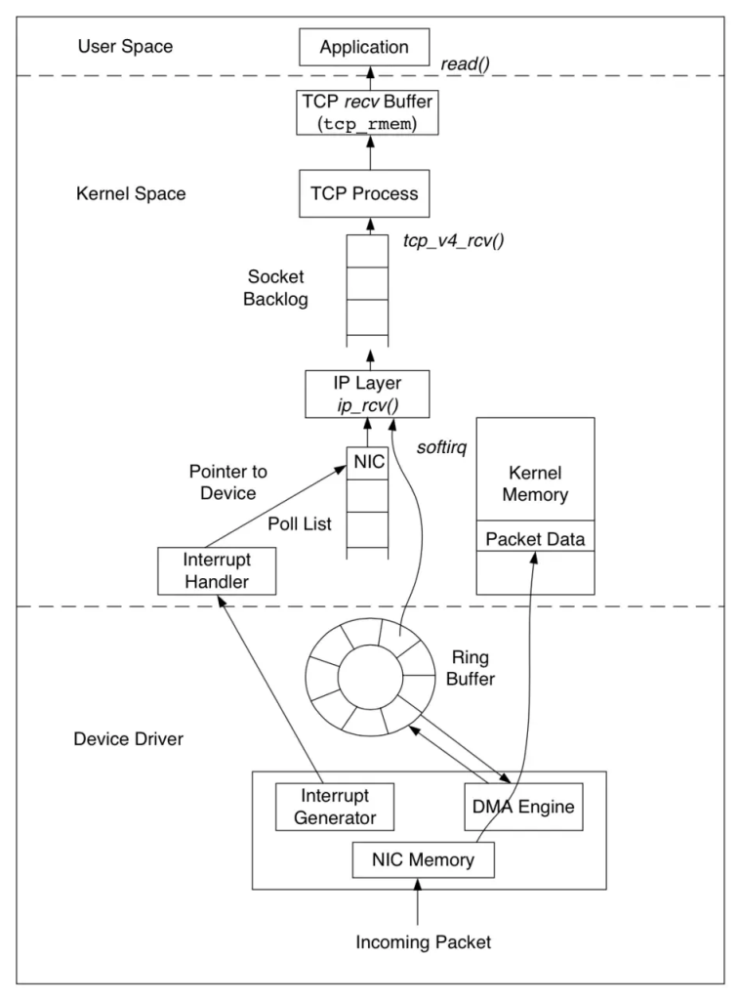

*图 4*

（从下往上看）

1. 当收到报文时，NIC 把数据包写入它自身的内存。
2. NIC 通过 CRC 校验检查数据包是否有效，之后调用 DMA 把数据包发送到主机的内存缓冲区，这是驱动程序提前向内核申请好的一块内存区域。（sk_buff 线性的数据缓冲区，后面会讲）
3. 数据包的实际大小、checksum 和其他信息会保存在独立的 **Ring Buffer(Rx.ring)** 中，Ring Buffer 接收之后，NIC 会向主机发出中断，告知内核有新的数据到达。收到中断，驱动会把数据包包装成指定的数据结构（sk_buff）并发送到上一层。
4. 链路层会检查数据包是否有效并且解析出上层的协议（网络协议）。
5. IP 层同样会检查数据包是否有效。检查 IP checksum。
6. TCP 层检查数据包是否有效。检查 TCP checksum。
7. 根据 TCP 控制块中的端口号信息，找到对应的 socket，数据会被增加到 socket 的接收缓冲区，socket 接收缓冲区的大小就是 TCP 接收窗口。
8. 当应用程序调用 read 系统调用时，程序会切换到内核区，并且会把 socket 接收缓冲区中的数据拷贝到用户区，拷贝后的数据会从 socket 缓冲区中移除。

------

## 1. 各层的关键结构

### 1.1 Socket 层的 Socket Buffer

套接字（socket）是一个抽象层，应用程序可以通过它发送或接收数据，可对其进行像对文件一样的打开、读写和关闭等操作。

那么数据写入到哪里了？又是从哪里读出来的呢？这就要进入一个抽象的概念“Socket Buffer”。

#### 1.1.1 逻辑上的概念

Socket Buffer 是发送缓冲区和接收缓冲区的统称。

- **发送缓冲区**

  进程调用 send() 后，内核会将数据拷贝进入 socket 的发送缓冲区之中。不管它们有没有到达目标机器，也不管它们何时被发送到网络，这些都是 TCP 协议负责的。

- **接收缓冲区**

  接收缓冲区被 TCP 和 UDP 用来缓存网络上来的数据，一直保存到应用进程读走为止。recv()，就是把接收缓冲区中的数据拷贝到应用层用户的内存里面，并返回。

#### 1.1.2 SKB 数据结构（线性 buffer）

Socket Buffer 的设计应该符合两个要求

1. 保持实际在网络中传输的数据。
2. 数据在各协议层传输的过程中，尽量减少拷贝。

怎么才能做到呢？

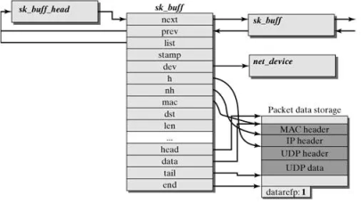

*图 5*

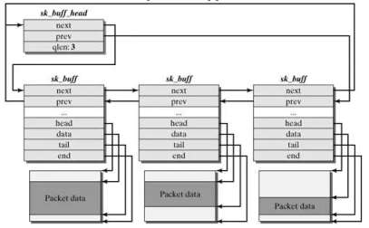

*图 6*

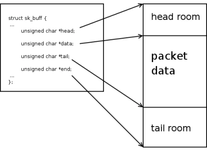

*图 7*

1. 每个 socket 被创建后，内核都会为其分配一个 Socket Buffer（其实是**抽象**的）。Socket Buffer 指的是 sk_buff 链表，初始时只是一个空的指针。所以初始时 sk_buff_head 的 next 和 prev 都是空。
2. write 和 receive 的过程就是 sk_buff 链表 append 的过程。
3. sk_buff 是内核对 **TCP 数据包**的一个**抽象**表示，所以最大不能超过最大传输量 MSS，或者说长度是固定的。
4. sk_buff 的结构设计是为了方便数据的跨层传递。
5. skb 通过 alloc_skb 和 skb_reserve 申请和释放，因此 skb 是有个池的概念的及“线性的数据缓冲区”。

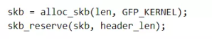

#### 1.1.3 总结（重要，关系到零拷贝的理解）

- **只在两种情况下创建 sk_buff：**

1. 应用程序给 socket 写入数据时。
2. 当数据包到达 NIC 时。

- **数据只会拷贝两次：**

1. 用户空间与内核空间之间的拷贝（socket 的 read、write）。
2. sk_buff 与 NIC 之间的拷贝。

#### 1.1.4 误区

根据《Unix 网络编程 V1， 2.11.2》中的描述：

- TCP 的 socket 中包含发送缓冲区和接收缓冲区。
- UDP 的 socket 中只有一个接收缓冲区，没有发送缓冲区。

UDP 如果没有发送缓冲区，怎么实现多层协议之间的交换数据呢？

参考 man 手册：udpwmemmin 和 udprmemmin 不就是送缓冲区和接收缓冲区吗？

> *https://man7.org/linux/man-pages/man7/udp.7.html*

### 1.2 QDisc

QDisc（排队规则）是 queueing discipline 的简写。位于 IP 层和网卡的 Ring Buffer 之间，是 IP 层流量控制（traffic control）的基础。QDisc 的队列长度由 txqueuelen 设置，和网卡关联。

内核如果需要通过某个网络接口发送数据包，它都需要按照为这个接口配置的 Qdisc（排队规则）把数据包加入队列。然后，内核会尽可能多地从 Qdisc 里面取出数据包，把它们交给网络适配器驱动模块。

说白了，物理设备发送数据是有上限的，IP 层需要约束传输层的行为，避免数据大量堆积，平滑数据的发送。

### 1.3 Ring Buffer

#### 1.3.1 简介

环形缓冲区 Ring Buffer，用于表示一个固定尺寸、头尾相连的缓冲区的数据结构，其本质是个 FIFO 的队列，是为解决某些特殊情况下的竞争问题提供了一种免锁的方法，可以避免频繁的申请/释放内存，避免内存碎片的产生。

本文中讲的 Ring Buffer，特指 NIC 的驱动程序队列（driver queue），位于 NIC 和协议栈之间。

它的存在有两个重要作用：

1. 可以平滑生产者和消费者的速度。
2. 通过 NAPI 的机制，合并以减少 IRQ 次数。

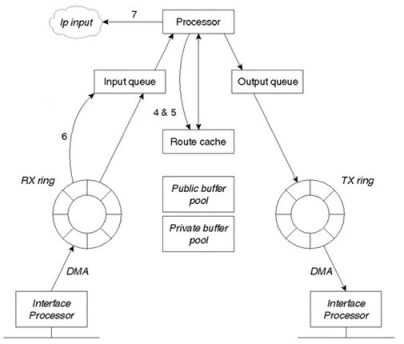

*图 8*

NIC (network interface card) 在系统启动过程中会向系统注册自己的各种信息，系统会分配 Ring Buffer 队列及一块专门的内核内存区用于存放传输上来的数据包。每个 NIC 对应一个 R x.ring 和一个 Tx.ring。一个 Ring Buffer 上同一个时刻只有一个 CPU 处理数据。

Ring Buffer 队列内存放的是一个个描述符(Descriptor) ，其有两种状态：ready 和 used。初始时 Descriptor 是空的，指向一个空的 sk_buff，处在 ready 状态。当有数据时，DMA 负责从 NIC 取数据，并在 Ring Buffer 上按顺序找到下一个 ready 的 Descriptor，将数据存入该 Descriptor 指向的 sk_buff 中，并标记槽为 used。

Ring Buffer 可能被占满，占满之后再来的新数据包会被自动丢弃。为了提高并发度，支持多队列的网卡 driver 里，可以有多个 Rx.ring 和 Tx.ring。

#### 1.3.2 Ring Buffer 误区

虽然名字中带 Buffer，但它其实是个队列，不会存储数据，因此不会发生数据拷贝。

------

## 2. 关于网络 I/O 结构的总结

1. 网络 I/O 中，在内核空间只有一个地方存放数据，那就是 Socket Buffer。
2. Socket Buffer 就是 sk_buff 链表，只有在 Socket 写入或者数据到达 NIC 时创建。
3. sk_buff 是一个线性的数据缓冲区，是通过 alloc_skb 和 skb_reserve 申请和释放的。
4. 每个 sk_buff 是固定大小的，这与 MTU 有关。
5. 数据只有两次拷贝：用户空间与 sk_buff 和 sk_buff 与 NIC。

------

## 3. 网络 I/O 中的零拷贝

#### 3.1 DPDK

网络 I/O 中没有没有类似 Direct I/O 的技术呢？答案是 **DPDK**。

我们上面讲了，处理数据包的传统方式是 CPU 中断方式。网卡驱动接收到数据包后通过中断通知 CPU 处理，数据通过协议栈，保存在 Socket Buffer，最终用户态程序再通过中断取走数据，这种方式会产生大量 CPU 中断性能低下。

DPDK 则采用轮询方式实现数据包处理过程。DPDK 在用户态重载了网卡驱动，该驱动在收到数据包后不中断通知 CPU，而是通过 DMA 直接将数据拷贝至用户空间，这种处理方式节省了 CPU 中断时间、内存拷贝时间。

为了让驱动运行在用户态，Linux 提供 UIO（Userspace I/O）机制，使用 UIO 可以通过 read 感知中断，通过 mmap 实现和网卡的通讯。

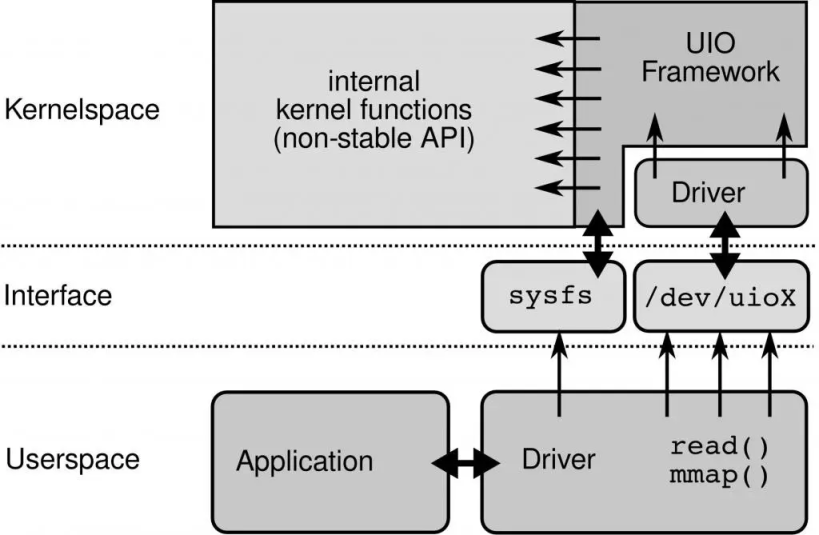

*图 9*

#### 3.1.1 DPDK 缺点

需要程序员做的事情太多，开发量太大，相当于程序员要把整个 IP 协议底层实现一遍。

------

## 4. 跨越磁盘 I/O 和网络 I/O 的零拷贝

通过三篇文章，我们了解了 Linux I/O 的系统结构和基本原理。对于零拷贝，网上的文章很多，我们只要简单解读一下就可以了。

> *另外强调一下，下面的解读，掺杂大量个人观点，并不权威，需要读者自行判断真伪。当然，如有理解错误之处也欢迎指正。

### 4.1 read + write

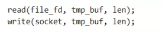

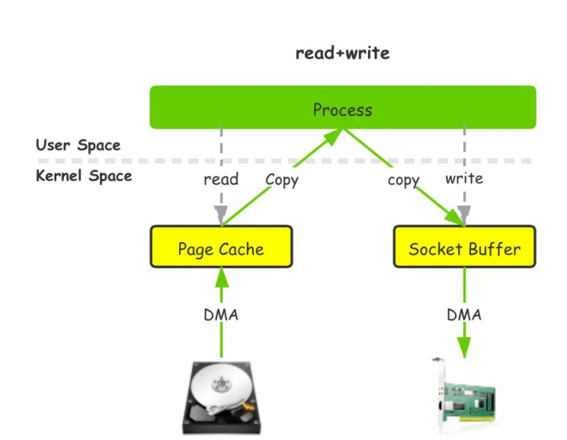

*图-10*

**网上的总结**

4 次上下文切换，2 次 CPU 拷贝和 2 次 DMA 拷贝。

**解读**

1. read 和 write，两次系统调用，每次从用户态切换到内核态，再从内核态切换回用户态，所以 4 次上下文切换。
2. 数据由 Page Cache 拷贝到用户空间，再由用户空间拷贝到 socket buffer，2 次 CPU 拷贝。
3. 现在的磁盘和网卡都是支持 DMA 的，所以从磁盘到内存，从网卡到内存的数据都是 DMA 拷贝。

### 4.2 mmap + write

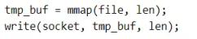

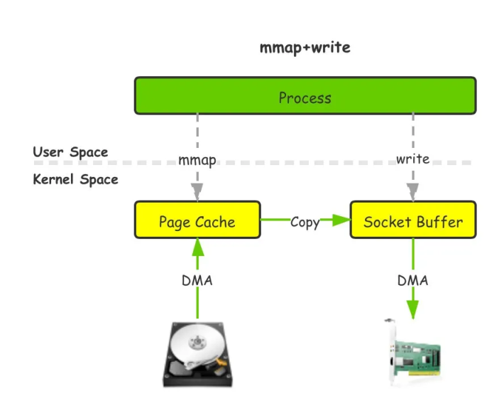

*图-11*

**网上的总结**

4 次上下文切换，1 次 CPU 拷贝。针对大文件性能高，针对小文件需要内存对齐，所以浪费内存。

**解读**

1. mmap 和 write，两次系统调用，4 次上下文切换，没问题。
2. MMU 支持下，数据从虚拟地址到 socket buffer 的拷贝，实际是 PageCache 到 socket buffer 的拷贝，所以 1 次 CPU 拷贝，也没问题。
3. mmap 读取过程中，会触发多次缺页异常，造成上下文切换，所以越大的文件性能越差。
4. 不存在浪费内存，mmap 本质是 Buffer I/O，本来也是 page 对齐的。

**补充**

RocketMQ 选择了 mmap+write 这种零拷贝方式，适用于消息这种小块文件的数据持久化和传输。

### 4.3 sendfile

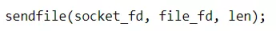

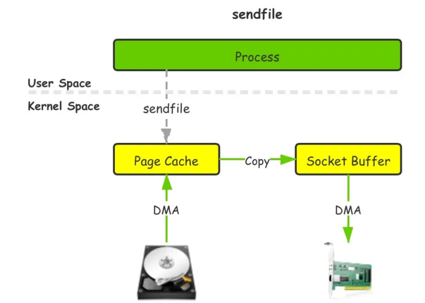

*图-12*

**网上的总结**

1. 2 次上下文切换，1 次 CPU 拷贝。
2. 针对大文件性能高，针对小文件需要内存对齐，所以浪费内存。
3. 

**解读**

1. sendfile，一次系统调用，2 次上下文切换。
2. 数据从 Page Cache 拷贝到 socket buffer，所以 1 次 CPU 拷贝。
3. sendfile 才是更适合处理大文件，所有工作都是内核来完成的，效率一定高。

**补充**

Kafka 采用的是 sendfile 这种零拷贝方式，适用于系统日志消息这种高吞吐量的大块文件的数据持久化和传输。

#### 4.3.1 sendfile,splice,tee 区别

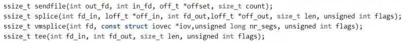

- **sendfile**

在内核态从 in_fd 中读取数据到一个内部 pipe，然后从 pipe 写入 out_fd 中；

in_fd 不能是 socket 类型，因为根据函数原型，必须提供随机访问的语义。

- **splice**

类似 sendfile 但更通用；

需要 fd_in 或者 fd_out 中，至少有一个是 pipe。

- **vmsplice**

fd_in 必须为 pipe；

如果是写端则把 iov 部分数据挂载到这个 pipe 中（不拷贝数据），并通知 reader 有数据需要读取;如果是读端，则从 pipe 中 copy 数据到 userspace。

- **tee**

需要 fd_in 和 fd_out 都必须为 pipe，从 fd_in pipe 中读取数据并挂载到 fd_out 中。

#### 4.3.2 sendfile 是否可以用于 https 传输

我认为，基本上很难实现。http，https 在七层协议中，属于应用层，是在用户空间的。http 可以在用户空间写入 http 头信息，文件内容的拷贝由内核空间完成。https 的加密，解密工作是必须在用户空间完成的，除非内核支持，否则必须进行数据拷贝。

### 4.4 sendfile + DMA gather copy

传说中的，跨越磁盘 I/O 和网络 I/O 的零次 CPU 拷贝的技术。

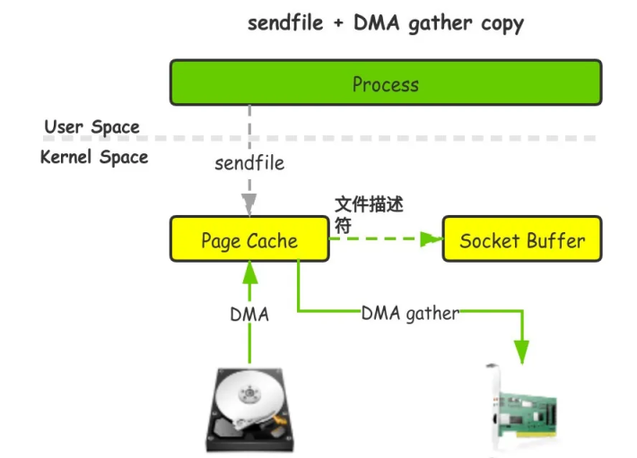

*图 13*

**网上的总结**

在硬件的支持下，sendfile 拷贝方式不再从内核缓冲区的数据拷贝到 socket 缓冲区，取而代之的仅仅是缓冲区文件描述符和数据长度的拷贝，这样 DMA 引擎直接利用 gather 操作将页缓存中数据打包发送到网络中即可，本质就是和虚拟内存映射的思路类似。

**解读**

本人才疏学浅，认为这不太可能。DMA gather 是指 DMA 允许在一次单一的 DMA 处理中传输数据到多个内存区域，说白了就是支持批量操作，不会有太大差异。

Socket Buffer 结构是很复杂的，它担负着数据跨层传递的作用，如果传递过程中 Page Cache 中的数据被回收了怎么办？我觉得能说得过去的至少是图-14 这种方式，而且内核需要有明确的 API 支持 socket_readfile。据我所知，Linux 并没有提供这种 API。

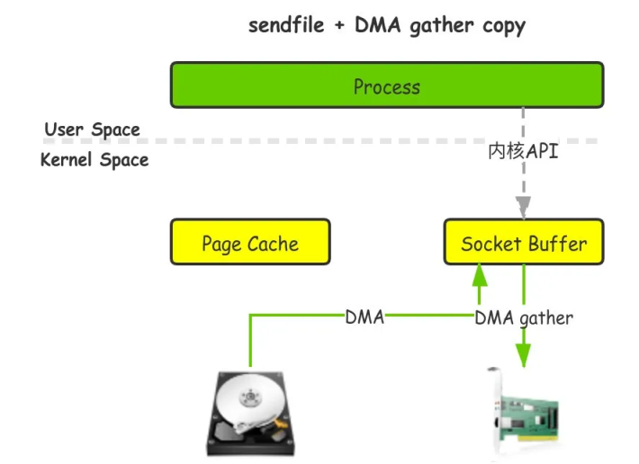

*图 14*
