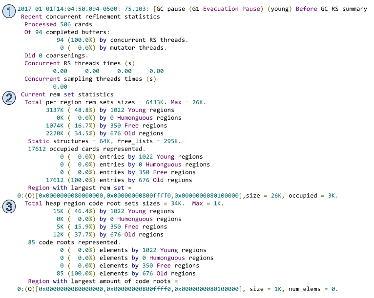

# Collecting and reading G1 garbage collector logs

https://www.redhat.com/en/blog/collecting-and-reading-g1-garbage-collector-logs-part-2

https://juejin.cn/post/6844903893906751501

---

## 背景

Welcome back! I hope you enjoyed [part 1 of this series where we took an in-depth look at how G1 works and makes its decisions](https://www.redhat.com/en/about/blog/part-1-introduction-g1-garbage-collector). In the second part of this ongoing series, we will dive into the extensive list of garbage collection (GC) logging options. In order to determine where tuning can be applied, you need to understand the different steps involved in a collection, what those steps mean, and the impact they have on overall collection time. To do this, we’re going to breakdown the available options into three distinct categories in order to look at what the logs mean and under what circumstances you should use them:

1. **Mandatory** - No one should be running in production without these settings.
2. **Advanced** - Depending on the maturity of the application and the growth rate of the load, these are considerations to run in production when additional tuning will be required.
3. **Debug** - These options are targeted towards solving a specific issue or performance problem and would not be used in production outside of cases where an issue cannot be reproduced anywhere else.

## 基础参数

Beginning with the mandatory flags, these options provide a means of collection and the required baseline of information needed to determine if you are looking at a possible garbage collection problem.

The flags are:

| -Xloggc:/path/to/gc.log               | Path where the GC logs are written               |
| ------------------------------------- | ------------------------------------------------ |
| -XX:+UseGCLogFileRotation             | Enable GC log file rotation                      |
| -XX:NumberOfGCLogFiles=<value>        | Number of rotated GC logs files to retain        |
| -XX:GCLogFileSize=<size>              | Size of each GC logs file to initiate rotation   |
| -XX:+PrintGCDetails                   | Detailed GC log                                  |
| -XX:+PrintGCDateStamps                | Actual date and timestamp of the collection      |
| -XX:+PrintGCApplicationStoppedTime    | Amount of time the application stopped during GC |
| -XX:+PrintGCApplicationConcurrentTime | Amount of time the application ran between GCs   |
| -XX:-PrintCommandLineFlags            | Prints all the command line flags in the GC log  |

Of these flags, selecting appropriate values for the number of log files and the size of each log file will ensure you maintain a suitable history of garbage collection logs. I always recommend keeping a minimum of one week of logs, as it gives you a baseline around how your application performs over the course of a given week.

## 新生代收集

Let’s take a deeper look at the anatomy of a log generated through ‘-XX:+PrintGCDetails’ broken down into six key points:

1. The first point outlines four key pieces of information:
   1. The actual date and time the event occurred, logged by setting ‘-XX:+PrintGCDateStamps’ - **2016-12-12T10:40:18.811-0500**
   2. The relative timestamp, since the start of the JVM - **29.959**
   3. The type of collection - **G1 Evacuation Pause (young)** - identifies this as an evacuation pause and a young collection
      1. The next most popular cause is **G1 Humongous Allocation**
   4. The time the collection took - **0.0305171 sec**
2. The second point outlines all of the parallel tasks:
   1. **Parallel Time** - How much Stop The World (STW) time parallel tasks took, beginning at the start of the collection and finishing when the last GC worker ends - 26.6ms
   2. **GC Workers** - The number of parallel GC workers, defined by -XX:ParallelGCThreads - **4**
      1. Defaults to the number of CPUs, up to 8. For 8+ CPUs, it defaults to a ⅝ thread to CPU ratio
   3. **GC Worker Start** - The min / max timestamp since the start of the JVM when the GC workers began. The difference represents the time in milliseconds between the start of the first and last thread. Ideally, you want them to start quickly and at the same time
   4. **Ext** **Root Scanning** - The time spent scanning external roots (thread stack roots, JNI, global variables, system dictionary, etc..) to find any that reach into the current collection set
   5. **Update RS (Remembered Set or RSet)** - Each region has its own Remembered Set. It tracks the addresses of cards that hold references into a region. As writes occur, a post-write barrier manages changes in inter-region references by marking the newly referred card dirty and placing in on the log buffer or dirty card queue. Once full, concurrent refinement threads process these queues in parallel to running application threads. **Update RS** comes in to enable the GC Workers to process any outstanding buffers which were not handled prior to the start of the collection. This ensures that each RSet is up-to-date
      1. **Processed Buffers** - This shows how many Update Buffers were processed during Update RS
   6. **Scan RS** - The Remembered Set of each region is scanned to look for references that point to the regions in the Collection Set
   7. **Code Root Scanning** - The time spent scanning the roots of compiled source code for references into the Collection Set
   8. **Object Copy** - During an evacuation pause, all regions in the Collection Set must be evacuated. Object copy is responsible for copying all remaining live objects to new regions
   9. **Termination** - When a GC worker finishes, it enters a termination routine where it synchronizes with the other workers and tries to steal outstanding tasks. The time represents how long it took from when a worker first tried to terminate and when it actually terminated
      1. **Termination Attempts** - If a worker successfully steals tasks, it re-enters the termination routine and tries to steal more work or terminate. Every time tasks are stolen and termination is re-entered, the number of termination attempts will be incremented
   10. **GC Worker Other** - This represents time spent on tasks not accounted to the previous tasks
   11. **GC Worker Total** - This shows the min, max, average, diff and sum for the time spent by each of the parallel worker threads
   12. **GC Worker End** - The min / max timestamp since the start of the JVM when the GC workers ended. The diff represents the time in milliseconds between the end of the first and last thread. Ideally, you want them to end quickly and at the same time
3. The third point outlines serial tasks:
   1. **Code Root Fixup** - Walking marked methods that point into the CSet to fix any pointers that may have moved during the GC
   2. **Code Root Purge** - Purge entries in the code root table
   3. **Clear CT** - The card table is cleared of dirtied cards
4. The fourth point outlines other tasks not previously accounted for. They are also serial.
   1. **Choose CSet** - Selects the regions for the Collection Set
   2. **Ref Proc** - Processes any soft/weak/final/phantom/JNI references discovered by the STW reference processor
   3. **Ref** **Enq** - Loops over references and enqueues them to the pending list
   4. **Reditry** **Cards** - Cards modified through the collection process are remarked as dirty
   5. **Humongous Register** - With ‘G1ReclaimDeadHumongousObjectsAtYoungGC’ enabled (default true / feature added in JDK 8u60) G1 will try to eagerly collect Humongous regions during Young GC. This represents how long it took to evaluate if the Humongous regions are candidates for eager reclaim and to record them. Valid candidates will have no existing strong code roots and only sparse entries in the Remembered Set. Each candidate will have its Remembered Set flushed to the dirty card queue and, if emptied, the region will be added to the current Collection Set
   6. **Humongous Reclaim** - The time spent ensuring the humongous object is dead and cleaned up, freeing the regions, resetting the region type and returning the regions to the free list and accounting for the freed space
   7. **Free CSet** - The now evacuated regions are added back to the free list
5. The fifth point outlines how the generations have changed and how they have been adapted as a result of the current collection:
   1. **Eden: 1097.0M(1097.0M)->0.0B(967.0M)**
      1. This shows that the current Young Collection was triggered because the Eden space was full - 1097.0M of the allocated (1097.0M)
      2. It shows that all Eden regions were evacuated and the usage was reduced to 0.0B by the collection
      3. It also shows that the total allocation of Eden space has been reduced to 967.0M for the next collection
   2. **Survivors: 13.0M->139.0M**
      1. As a result of the young evacuation, the survivor space grew from 13.0M to 139.0M
   3. **Heap: 1694.4M(2048.0M)->736.3M(2048.0M)**
      1. At the time of the collection, the overall heap allocation was 1694.4M of the max (2048.0M)
      2. After the collection, the overall heap allocation was reduced to 736.3M and the max heap was unchanged at (2048.0M)
6. The sixth point represents the time taken for the collection:
   1. **user=0.08**
      1. Amount of CPU time spent in the user code within the process during the collection. This accounts for all threads across all CPUs. This does not account for time spent outside the process or time spent waiting. Depending on the number of parallel threads, user time will be quite a bit higher than the real time
   2. **sys=0.00**
      1. Amount of CPU time spent in the kernel within the process. This accounts for all threads across all CPUs. This does not account for time spent outside the process or time spent waiting
   3. **real=0.03**
      1. This is the real wall clock time from the start to the end of the collection. This also includes time spent in other process and time spent waiting

## 并发垃圾收集

The next event you’re likely to encounter is Concurrent Marking. As discussed in Part 1, Concurrent Marking can be triggered in a few of different ways, but it always performs the same work.

1. The first point denotes the start of marking:
   1. GC pause (G1 Evacuation Pause) (young) (initial-mark)
      1. To take advantage of the STW pause and trace all reachable objects, initial-mark is done as part of a Young Collection. The initial-mark sets two top-at-mark-start (TAMS) variables to distinguish existing objects and objects allocated during concurrent marking. Any objects above the top TAMS are implicitly considered live for this cycle
2. The second point is the first concurrent event:
   1. GC concurrent-root-region-scan-start
      1. Region Root Scanning takes the new Survivor regions from the initial-mark and scans them for references. Any references found from these ‘root’ regions are subsequently marked
   2. GC concurrent-root-region-scan-end
3. The third point denotes concurrent marking:
   1. GC concurrent-mark-start
      1. It runs concurrently alongside the application threads. The number of concurrent threads are, by default, 25% of the number of Parallel Threads. It can also be set explicitly through -XX:ConcGCThreads
      2. Tracing the heap and marking of all live objects in a bitmap. Because all objects above the top TAMS are implicitly live, we only need to mark what’s below that threshold
      3. Accounting for the concurrent changes during marking. In order for SATB to work, it must be able to trace objects via the pointer when it took the initial snapshot. In order for that to occur, a pre-write barrier logs the original value to a SATB buffer that, when full, is added to a global list that is periodically processed by the concurrent marking threads
      4. Live data accounting happens concurrently alongside the marking process. The consumed space of each region is tabulated as live objects are marked in order to establish a liveness ratio
   2. GC concurrent-mark-end
4. The fourth point is a STW Phase:
   1. GC remark / Finalize Marking / GC ref-proc / Unloading
      1. This phase is STW so that a final picture can be painted. The remaining SATB buffers are processed and any lingering live objects are marked
5. The fifth point is also a STW phase:
   1. GC cleanup
      1. A final live object count is completed. This is done per regions using the standard set of parallel threads
         1. It marks the card bitmap for all objects allocated since the initial-mark (everything above the TAMS)
         2. It also marks the regions bitmap for any region with at least one live object
      2. In preparation for the next marking, the previous and next bitmaps are swapped
      3. Dead Old and Humongous regions with zero live bytes are freed and cleared
      4. Scrubs the Remembered Sets’ of regions with no live objects
      5. To prepare for the next cycle, the old regions are sorted for Collection Set selection, based on their liveness
      6. The concurrent unloading of dead classes from the metascape
6. The sixth point is once again a concurrent phase:
   1. GC concurrent-cleanup-start
      1. It performs a final cleanup of the empty regions processed in step five
         1. The Remembered Set of each region is cleaned: this includes sparse and coarse entries, the from card cache and the code root tables
      2. As the regions are fully cleaned, they are added to a temporary list. Once cleanup is finished, the temporary list is merged into the secondary free region list where they wait to be added back to the master free list
   2. GC concurrent-cleanup-end

## 混合收集

Once Concurrent Marking is complete, you will see a Young GC immediately followed by a Mixed GC (this assumes the correct criteria is met, as discussed in Part 1). As you can see in the log below, the tasks of the ‘Mixed Collection’ are identical to the previously explained Young Collection. There are only two differences between the Young and Mixed Collections:

1. The first point identifies this collection as Mixed.
   1. GC pause (G1 Evacuation Pause) (mixed)
2. The collection set will contain Old regions, as determined through Concurrent Marking

## Full GC

The third type of collection you may encounter, and the one we’re working to avoid, is the Full GC. In G1, a Full GC is a single threaded Stop The World (STW) pause which will evacuate and compact all regions. There are three important pieces of information you can get from the Full GC logs.

1. The GC Cause, (Allocation Failure), tells you what triggered the Full GC. This will aid in how you approach tuning. Another popular cause is Metadata GC Threshold
2. How frequently they are occurring. A Full GC every few days may not be a relevant problem, whereas a Full GC every hour would be
3. How long the Full GC took. Depending on your requirements, a Full GC may not be a critical issue if it’s not taking significant time to complete

The last log I want to touch on is generated from ‘-XX:+PrintGCApplicationStoppedTime’ and ‘-XX:+PrintGCApplicationConcurrentTime’. These flags provide three useful data points:

1. The first point tells us the amount of time the application threads were stopped during a safepoint
2. The second point tells us the amount of time it took to bring all threads to a safepoint and suspend them
3. The third point tells us how long the application threads ran between safepoints

## Advanced flags

Moving on to the advanced flags, these options provide valuable insights into the values and thresholds.

The flags are:

| -XX:+PrintAdaptiveSizePolicy   | Details about the collector ergonomics |
| ------------------------------ | -------------------------------------- |
| -XX:+PrintTenuringDistribution | Survivor space usage and distribution  |
| -XX:+PrintReferenceGC          | Time spent processing references       |

### PrintAdaptiveSizePolicy

Beginning with ‘-XX:+PrintAdaptiveSizePolicy’, this flag adds details about the G1 ergonomics to each of the previously discussed events. This provides an insight into Collection Set selection and pause time estimates.

Looking at a Young Collection, there are five new pieces of information added inside the original detailed log:

1. The first point tells us the number of cards in the dirty card queue which still need to be processed. It also provides a prediction on how long that processing will take. The prediction includes time for Update RS and Scan RS.
2. The second point tells us the number of regions that will be included in this collection. The time prediction includes an estimate for object copy.
3. The third point provides a final CSet and time prediction for the collection. The prediction is a combination of the base time and the young region CSet time.
4. The fourth point is logged under certain conditions, so you may only see it occasionally. G1 will try expand the heap if the amount of time you spend doing GC work versus application work is greater than a specific threshold. Note: If your min/max heap are the same, expansion cannot occur.
5. The fifth point is only logged when concurrent marking is requested. There are a few variations of this log around the GC causes, like humongous allocations or if marking tried to initiate while it was already running. The most common form we see is that the heap occupancy is greater than our IHOP and thus marking is started.

Immediately following a Young Collection where a concurrent cycle is requested, you will see a Concurrent Cycle ergonomic with a Young Collection initial-mark. The remaining details of this Young Collection remain the same.

Once marking completes, you will see a Young Collection with an ergonomic log about mixed collections.

1. The first point tells us we’re going to start mixed GCs, because the reclaimable percentage (22.62%) is higher than our default G1HeapWastePercent (5%).
   1. Note: If the reclaimable percentage is below 5%, you would see a similar log: do not start mixed GCs, reason: reclaimable percentage not over threshold

Now Mixed Collections will begin:

1. The first point, including the selection of the CSet and addition of young regions remain the same as a Young Collection.
2. The second point outlines the Old regions being added to the CSet for the Mixed Collection. In this case, CSet selection ended because the max old region threshold was hit. By default, G1 will only add up to 10% of the old regions to the CSet, defined by -XX:G1OldCSetRegionThresholdPercent=X.
3. The third point provides the final CSet and pause time prediction.
4. The fourth point provides us with details on the state of the Mixed GC cycle. In this case, we still have 535 old regions we could collect, amounting to 305363768 bytes or 14.22% of the heap. Given this is still higher than our waste percentage, the next collection will again be Mixed.

The following mixed collection will look identical to the previous, but may also choose to end Mixed GCs:

1. The first point of this Mixed collection shows that the reclaimable percentage has now fallen below the 5% threshold and Mixed collections will no longer continue. The following collection will once again be Young.

Finally, let’s look at the ergonomics of the Full GC:

1. The first point tells us that there are no free regions in the primary or secondary free list, and as such, an allocation request failed and heap expansion has been requested.
2. The second point logs the amount of the expansion request. It’s important to note that in both points 1 and 2, no expansion has actually been attempted yet.
3. The third point tells us that heap expansion will not be attempted. This short circuits the expansion logic when the number of available uncommitted regions is 0. As a result of the allocation failure, we end up doing a Full GC.
4. The fourth point comes up in situations where the min heap is less than the max heap. In this case, G1 will attempt to shrink the heap to 70% after a Full GC.
5. The fifth point tell us that the heap is being shrunk and by how much.

### PrintTenuringDistribution

The PrintTenuringDistribution flag provides information about the Survivor space layout and threshold during each collection. This is useful because it enables you to see how objects are aging.

1. The Tenuring Distribution data shows us three important aspects of the Survivor space:
   1. The desired survivor size, equal to the survivor size multiplied by the TargetSurvivorRatio (default 50%)
   2. The target threshold, also known as the age or the number of Young GCs an object may remain. This is calculated by adding up the size of the objects in each age until the size is greater than the desired survivor size
   3. The age distribution, including the size of all objects at each age and an incremental total of the Survivor space usage

## Experimental flags

Finally, we have the diagnostic and experimental flags. These flags can add a significant amount of logging and should be used only when necessary and when you’re trying to debug a specific problem.

| -XX:+UnlockDiagnosticVMOptions                               |                                                              |
| ------------------------------------------------------------ | ------------------------------------------------------------ |
| -XX:+G1SummarizeConcMark                                     | Summarizes Concurrent Mark at JVM exit                       |
| -XX:+G1PrintHeapRegions                                      | Print the heap regions selected for allocation, cleanup, reuse, compact, cset, commit, failure, etc... |
| -XX:+G1PrintRegionLivenessInfo                               | Prints previous and next liveness data per Old region before and after every concurrent mark cycle |
| -XX:+G1SummarizeRSetStats -XX:G1SummarizeRSetStatsPeriod=1   | Print RSet processing information every X, where X is measured in GC cycles |
| -XX:+PrintSafepointStatistics -XX:PrintSafepointStatisticsCount=1-XX:+LogVMOutput-XX:LogFile=/path/to/gc.log | Prints the reason and some details about safepoint synchronization. Can control how many events to collect before printing. By default, logs to STDOut - LogVMOutput can push it to a file |
| -XX:+UnlockExperimentalVMOptions                             |                                                              |
| -XX:G1LogLevel=fine, finer, finest                           | Increases logging verbosity on collections                   |
| -XX:+G1TraceEagerReclaimHumongousObjects                     | Prints details about live and dead Humongous objects during each collection |
| -XX:+G1ConcRegionFreeingVerbose                              | Debug JVM                                                    |

 

The output from ‘-XX:+G1PrintHeapRegions’ adds a LOT of logging. The image below represents a compacted set of events to illustrate the various types that can occur. Certain events occur under Young GC whereas others occur during Full GC.

Printing of the heap region events is only necessary when trying to debug very specific problems such as:

- Debugging evacuation failures and the number of failed regions
- Determining the size and frequency of Humongous objects
- Tracking and evaluating the number of Eden, Survivor and Old regions being allocated and collected as part of the CSet

1. COMMIT
   - The heap is being initialized or expanded, defines the top and bottom of the region being modified
2. ALLOC(Eden)
   - A region, defined by the bottom address, is allocated as an Eden region
3. CSET
   - Region selected for the CSET, all of these regions will be reclaimed
4. CLEANUP
   - A region, defined by the bottom address, is completely empty and cleaned up during concurrent marking
5. UNCOMMIT
   - After a Full GC, if the heap is shrunk, you will see a set of regions uncommitted
6. ALLOC(Old)
   - A region, defined by the bottom address, is allocated as an Old region
7. RETIRE
   - At the end of a collection, the last allocated Old region is marked as retired
8. REUSE
   - At the start of the next GC, the previously retired Old region is reused as the starting point
9. ALLOC(Survivor)
   - A region, defined by the bottom address, is allocated as a Survivor region
10. EVAC-FAILURE
    - If an evacuation failure happens during a collection, this event will outline each of the regions which failed
11. POST-COMPACTION(Old)
    - After a Full GC, a post-compaction event is generated for Old and Humongous regions which contain the remaining live data
12. ALLOC(SingleH)
    - A region, defined by the bottom and top address, is allocated as a Single Humongous region where the object fits into a single region
13. ALLOC(StartsH)
    - A region, defined by the bottom and top address, is allocated as a Starts Humongous region where the object is large enough to span more than one region
14. ALLOC(ContinuesH)
    - A region, defined by the bottom and top address, is allocated as a Continues Humongous region where this is the continuation of an object spanning more than one region

The output from ‘-XX:+G1PrintRegionLivenessInfo’ also produces a lot of additional logging, but it’s limited to the frequency of concurrent marking cycles. It’s very useful if you want to analyze what your Old regions look like after Concurrent Marking, as well as after they’re sorted for efficiency for CSet selection.

The Post-Marking output, which can also include EDEN, FREE, SURV, HUMS and HUMC region types, outlines a detailed per region breakdown of the previous and next top-at-mark-start (TAMS) levels as it pertains to object liveliness for the marking cycle. There are eight pieces of information defined in the output:

- Region Type: Can be Old, Eden, Survivor, Humongous Start, Humongous Continues and Free
- Address Range:The bottom and end value for the region
- Used: Total number of used bytes in the region, measured as the total between the bottom and current top of the region
- Prev-Live: The number of live bytes from the point of view of the previous marking cycle, measured as the total between the previous TAMS and the current top plus the known live objects (previously marked) from the previous marking cycle
- Next-Live: The number of live bytes from the point of view of the current marking cycle, measured as the total between the the next TAMS and the current top plus the known live objects (marked) from the current marking cycle
- GC-Eff: This is measured by taking the reclaimable bytes (known live bytes minus total region capacity) divided by the estimated time to collect the region (RS Scan, Object Copy and Other Time). The higher the efficiency, the better the region is as a candidate
- Remset: Size of the remembered set for the region, measured by adding the size of the region table to the size of the bitmap multiplied by the heap word size
- Code-Roots: The amount of memory, in bytes, the region is consuming for strong code roots. 

The verbosity of ‘-XX:+G1SummarizeRSetStats’ can be controlled by setting ‘-XX:G1SummarizeRSetStatsPeriod=XX’, which defines the number of GC cycles between summaries. This setting is useful when debugging RSet specific issues, such as excessive time spent during Scan and or Update RS activity.

This log defines 3 key sections of data:

1. The first has to do with concurrent refinement statistics. In this case, 506 cards were processed from 94 buffers and 100% of the work was completed by the concurrent threads. The last piece, coarsenings, tells us how many RSets have been coarsened. Essentially, when many regions reference an object in one region, you may not have enough space for a new region bitmap. In this case, the referencing regions bitmap is marked as coarsened. This is expensive because the entire referencing region must be scanned for incoming references;
2. The second section defines the overall remember set statistics on a per region type basis
3. The third section defines the overall code root set statistics on a per region type basis

When it comes to a standard collection, many of the line items are comprised of several underlying tasks. If one task is taking longer than anticipated, you can enable ‘-XX:G1LogLevel=finest’ to provide a detailed breakdown of each operation. Additionally, it adds detailed execution time each individual worker spent on each task.

The final setting we’re going to touch on is ‘-XX:+G1TraceEagerReclaimHumongousObjects’. If you’re experiencing a large number of Humongous allocations, you can enable this option to provide detailed information on which Humongous objects the collector considers to be Dead or Live for eager reclamation. Eager reclaim of Humongous regions was introduced in JDK8u60.

## End

I hope this post sheds some light, not only on how to collect the variety of different GC logs, but also how to interpret and use them throughout the tuning and analysis process. I hope you stay tuned for the next article in this series where we will dig into the various options to collect and interpret the monumental amount of data produce via advanced GC logging.