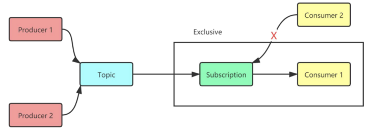

# 中国移动张浩：AMQP on Pulsar 的设计与应用一览

https://segmentfault.com/a/1190000024422903

本期 TGIP-CN 直播，我们邀请到了来自中国移动云能力中心的张浩，他在 AMQP on Pulsar 项目中参与了很多，也一起协助推进了项目的开发与更新，接下来的内容主要基于此次直播中关于 AoP 的一些介绍和细节干货。

## 相关背景

首先一个很重要的问题，就是我们移动内部为什么要自己做 AMQP 消息队列？答案很明显。

一是为了满足内部组件的需求，中国移动是 OpenStack 的重度使用用户，而 OpenStack 中默认使用 RabbitMQ 作为 RPC 通信组件。使用 RabbitMQ 在线上环境部署和运维中，遇到了很多问题。由于我们中间件团队主要采用 Java 架构，围绕 RabbitMQ 只能做一些外围改造。

同时，中国移动的公有云中有很多需要使用 AMQP 消息队列的客户，但是现有的 RabbitMQ 不满足云访问的条件，因此，中国移动的中间件团队开始研究 AMQP 消息队列。在对比 Qpid，RocketMQ 和 Pulsar 之后，发现 Pulsar 的计算分离存储架构非常适合目前的需求。

同时在对 Pulsar 进行调研之后，发现 StreamNative 已经开源了 KoP，这更加确定了我们要基于 Pulsar 开发 AMQP 的可行性。同时 Pulsar 社区活跃度很高，社区方面对本项目的支持力度很高。

所以，我们便开启了与 StreamNative 共同开发 AoP 协议处理插件的征程，携手实现将 AoP 从 0 到 1 的蜕变。

## AMQP 0.9.1

AMQP 0.9.1(高级消息队列协议)是一种消息传递协议，它允许符合标准的客户端应用程序与符合标准的消息传递中间件代理进行通信。

在 AoP 的初始版本中，首先实现了 0.9.1 版本协议。在这里主要有以下几个概念需要大家理解：

- VirtualHost：资源的逻辑分组以及隔离
- Exchange：消息路由
- Queue：消息存储
- Binding：路由规则

大体操作流程如上图：首先消息会发送到 Exchange 中，后根据不同的设置/类型等路由到不同的 queue 中。消费者消费消息时，是直接从 queue 中进行。

## Protocol Handler

在了解了 AMQP 0.9.1 的模型后，我们来看下 AoP 实现依赖的组件——Protocol Handler。

在 Pulsar 架构中，基于 Managed Leger 已经实现了一套分布式的流程封装，包括如何去存储消息和防止消息丢失。Broker 本身也实现了一些特性，比如 load-balancer、geo-replicator 等。

上层中的 Protocol Handler 属于轻量级工具，主要处理 Pulsar 中生产者和消费者发送出来的 TCP 请求，将其转化为可读取状态的操作。

Pulsar 2.5 版本后，将 Protocol Handler 接口单独脱离了出来，利用这个框架就可以单独实现自定义协议的转换，比如 Kafka、AMQP、MQTT 等。实现了不同协议的 Protocol Handler，Pulsar broker 就具有读写/解析其他协议的能力。下图为 AMQP on Pulsar 采用的架构模型。

## 如何实现 AoP

具体实现主要是四个部分：模型转换（将 AMQP 模型接入到 Pulsar 内部）、消息发送、消息消费和 Proxy。

### 模型转换

AMQP 0.9.1 引入了一些基础概念，如 Exchagne、Queue 等。这些与 Pulsar 的模型有着较大的区别。所以我们需要找到一种方法，支持利用 Pulsar 现有的一些特征，并将它们联系在一起。下图展示了消息在 AoP 中的流转，并讨论了关于消息持久化，消息路由，消息投递的细节。

🧰 AmqpExchange

AmqpExchange 包含一个原始消息 Topic，用来保存 AMQP producer 发送的消息。AmqpExchange 的 replicator 会将消息处理到 AMQP 队列中。Replicator 是基于 Pulsar 的持久化游标，可以确保成功将消息发送到队列，而不会丢失消息。

🧰 AmqpMessageRouter

AmqpMessageRouter 用于维护消息路由类型以及将消息从 AmqpExchange 路由到 AmqpQueue 的路由规则。路由类型和路由规则这些原数据都持久化在 Pulsar 的存储中。所以就算 broker 重启，我们也可以恢复 AmqpMessageRouter。

🧰 AmqpQueue

AmqpQueue 提供一个索引消息 Topic，用来存储路由到这个队列的 IndexMessage。IndexMessage 由原始消息的 ID 和存储消息的 Exchange 的名称组成。当 AmqpQueue 向 consumer 发送消息时，AmqpQueue 会根据 IndexMessage 读取原始消息数据，然后将其发送给 consumer。

🧰 Vhost 分配

在 AoP 中，一个 AMQP Vhost 只能由一个 Pulsar broker 提供服务，而一个 Pulsar broker 可以为多个 Vhost 提供服务。所以增加 Vhost 和 broker 的数量可以达到横向扩容的效果。通过使用更多的 Vhost 可以使用户构建更大的 AoP 集群。

在 AoP 中，一个 Vhost 基于一个 Pulsar namespace，并且这个 namespace 只能有一个 bundle。如果一台 broker 崩溃，其他的 broker 可以接管这台崩溃的 broker 维护的 Vhost。Vhost 也可以利用 broker 的负载均衡机制。broker 可以将 Vhost 从一台高负载的机器转移到一台空闲的机器。下图展示了 Vhost 在 broker 上的分配情况。

### 消息发送

在消息发送层面，比如通过 AMQP Producer 做 Basic-publish 的消息发送到 broker 端。当 broker 接收到消息后，会将 AMQP 消息体转换为 Pulsar 消息体，找到当前 Exchange 对应的 topic，并进行消息写入。根据不同的路由关系、参数配置等，会将 topic 中的消息分发到不同 queue 中。

### 消息消费

在消费端，主要用到了 Pulsar 订阅模型里的 Exclusive（独占订阅）和 Shared（共享订阅）两种类型。

Shared（共享订阅）是可以将所需数量的 consumer 附加到同一订阅。消息以多个 consumer 的循环尝试分发形式传递，并且任何给定的消息仅传递给一个 consumer。当消费者断开连接时，所有传递给它并且未被确认的消息将被重新安排，以便发送给该订阅上剩余的 consumer。

根据 AMQP 协议的定义，队列收到的消息是以轮循方式分配给所有消费者，与 Pulsar Shared 订阅方式吻合。所以在 AoP 的实现中将这种 Shared 订阅方式定义为 default 订阅方式。

以上适用于 queue 为非排他队列的情形，如果是排他队列则采用 Exclusive 订阅模型。

不管有多少个 consumer 同时存在，只会有一个 consumer 是活跃的，也就是只有这一个 consumer 可以接收到这个 topic 的所有消息。这种模式就为 Pulsar 订阅模式中的独占订阅（Exclusive），这种模式跟 AMQP 中的排他队列比较吻合。

Pulsar 的消费模型与 RocketMQ 模型相反，一个类似于“推”模型，一个类似于“拉”模型。在 Pulsar 中 consumer 发送 flow 请求给到 broker，通知 broker 可以将消息推送给 consumer。此时 broker 通过检查准许后，将 broker 内的消息推送给 consumer。

AMQP 中有两种消费模型，一种是 consume，另一种是 get。Consume 对应的是“推”模型，Get 对应“拉”模型。

在推模型中，我们自定义了一个 consumer 并命名为“AmqpPushConsumer”，它继承了 Pulsar broker 内的 consumer，最大的不同是修改了 `sendMessage()`方法。将 Pulsar 消息转换成 AMQP 消息后，直接推送到 AMQP consumer 中。

同时将 AmqpPushConsumer 添加到订阅方式中，并调用 `consumer.handleFlow` 命令。

在拉模型中，为了保证消费位点的一致性、避免消息丢失，增加了一个“AmqpPullConsumer”。同样继承了 Pulsar broker consumer，但是对以下两个方法进行了修改：

- getAvailablePermits()-> 0
- isBlocked()-> true

这种模型是主动从 cursor 中读取消息，然后和推模型中的的 consumer 共享 read position。其消息签收的方式也与推模型中的方式一致。

### Proxy

AoP Proxy 用于在客户端与 AMQP 服务连接时，帮助查找负责处理 Vhost 数据的 owner broker，并在客户端与 Vhost 的 owner broker 之间传输数据。下图说明了 AoP Proxy 的服务流程。

1. AMQP 客户端建立与 AoP Proxy 的连接。
2. AoP Proxy 向 Pulsar cluster 发送查找请求，以便确定 Vhost 的 owner broker 的 URL 地址。
3. Pulsar 集群 将 owner broker 的 URL 地址返回给 AoP Proxy。
4. AoP Proxy 建立与 Vhose 的 owner broker 的连接并开始在 AMQP 客户端和 Vhost 的 owner broker 之间传输数据。

目前，AoP Proxy 与 Pulsar broker 共同工作。用户可以通过配置 amqpProxyEnable 来选择是否开启 AoP Proxy 服务。

## 如何使用 AoP

目前 AoP 项目是开源在 StreamNative 项目库内，使用 Apache License V2 许可证，项目地址为可参考下方链接： [https://github.com/streamnati...](https://link.segmentfault.com/?enc=qa6Q314Vv7Q5J6H%2BtXCI6A%3D%3D.JkCEc63TgD6riwKu644Q6vGxAklu7qjc4LaxA1tII0zWNWlISrNPjUh9U3HxUu1E) 。

欢迎大家参与贡献和使用，具体步骤可以参考 readme 的文字介绍。

## 后续计划

- 目前基本实现了 AMQP 0.9.1 版本的协议支持，未来会支持 AMQP 1.0 协议:
- 将 AMQP 元数据做集成化存储，方便信息集中化管理
- 丰富 AMQP 相关监控项
- 后续将支持 namespace 的多 bundle 机制，目前仍为单 bundle 机制

## 总结

本次分享主要针对 AMQP on Pulsar 项目的产生过程、实现细节等层面进行了一些技术和概念上的分享，希望通过本次分享，大家可以对 AoP 项目有了更清晰的理解，感兴趣的话也可以参与该项目贡献哦！