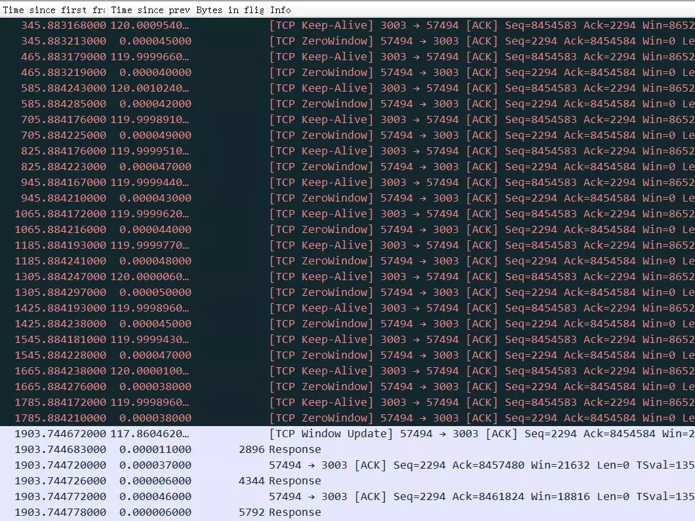
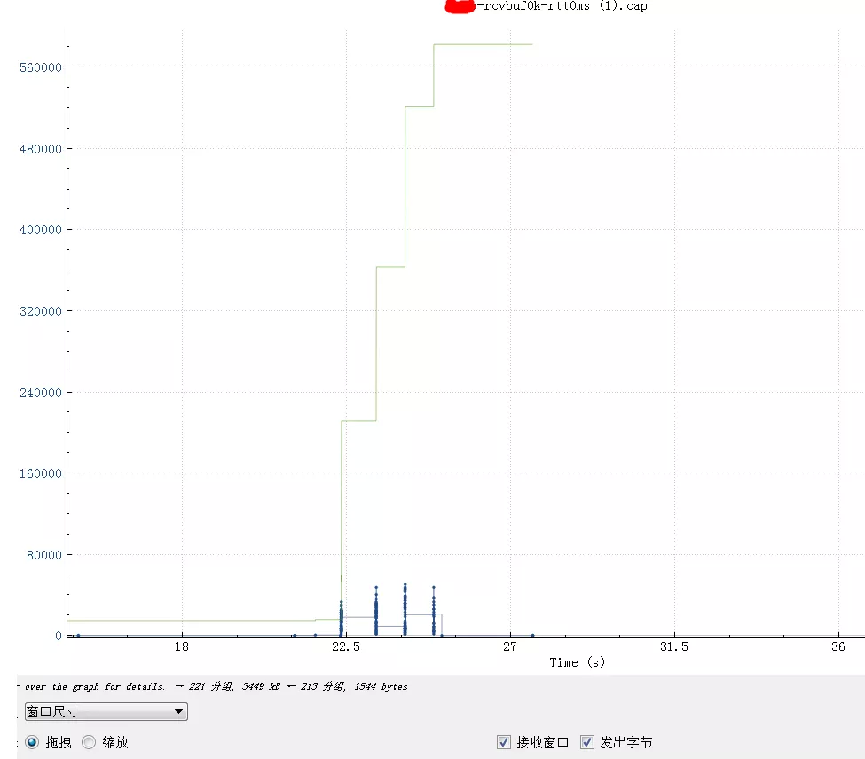

# 直击案发现场！TCP 10倍延迟的真相是？

https://mp.weixin.qq.com/s/fKWJrDNSAZjLsyobolIQKw

https://www.infoq.cn/article/sfjkj1c5bz2koxsxybho

阿里妹导读：什么是经验？就是遇到问题，解决问题，总结方法。遇到的问题多了，解决的办法多了，经验自然就积累出来了。今天的文章是阿里技术专家蛰剑在工作中遇到的一个问题引发的对TCP性能和发送接收Buffer关系的系列思考（问题：应用通过专线从公司访问阿里云上的服务，专线100M，时延20ms，一个SQL查询了22M数据出现10倍+的信息延迟，不正常。）希望，你也能从中得到启发。

## 前言

本文希望解析清楚，当我们在代码中写下 socket.setSendBufferSize 和 sysctl 看到的 rmem/wmem 系统参数以及最终我们在 TCP 常常谈到的接收发送窗口的关系，以及他们怎样影响 TCP 传输的性能。


先明确一下：文章标题中所说的 Buffer 指的是 sysctl 中的 rmem 或者 wmem，如果是代码中指定的话对应着 SO_SNDBUF 或者 SO_RCVBUF，从 TCP 的概念来看对应着发送窗口或者接收窗口。

## TCP 性能和发送接收 Buffer 的关系

相关参数：

```bash
$sudo sysctl -a | egrep "rmem|wmem|adv_win|moderate"
net.core.rmem_default = 212992
net.core.rmem_max = 212992
net.core.wmem_default = 212992
net.core.wmem_max = 212992
net.ipv4.tcp_adv_win_scale = 1
net.ipv4.tcp_moderate_rcvbuf = 1
net.ipv4.tcp_rmem = 4096    87380   6291456
net.ipv4.tcp_wmem = 4096    16384   4194304
net.ipv4.udp_rmem_min = 4096
net.ipv4.udp_wmem_min = 4096
vm.lowmem_reserve_ratio = 256   256 32
```

先从碰到的一个问题看起：

> 应用通过专线从公司访问阿里云上的服务，专线 100M，时延 20ms，一个 SQL 查询了 22M 数据，结果花了大概 25 秒，这太慢了，不正常。如果通过云上 client 访问云上服务那么 1-2 秒就返回了（说明不跨网络服务是正常的）。如果通过 http 或者 scp 从公司向云上传输这 22M 的数据大概两秒钟也传送完毕了（说明网络带宽不是瓶颈），所以这里问题的原因基本上是我们的服务在这种网络条件下有性能问题，需要找出为什么。

### 抓包 tcpdump+wireshark

这个查询结果 22M 的需要 25 秒，如下图（wireshark 时序图），横轴是时间，纵轴是 sequence number：


粗一看没啥问题，因为时间太长掩盖了问题。把这个图形放大，就看中间 50ms 内的传输情况（横轴是时间，纵轴是 sequence number，一个点代表一个包）。


换个角度，看看窗口尺寸图形：


从 bytes in flight 也大致能算出来总的传输时间 16K*1000/20=800Kb/秒我们的应用会默认设置 socketSendBuffer 为 16K：


> socket.setSendBufferSize(16*1024) //16K send buffer


来看一下 tcp 包发送流程：


图片来源：陶辉


如果 sendbuffer 不够就会卡在上图中的第一步 sk_stream_wait_memory，通过 systemtap 脚本可以验证：

```bash
#!/usr/bin/stap
# Simple probe to detect when a process is waiting for more socket send
# buffer memory. Usually means the process is doing writes larger than the
# socket send buffer size or there is a slow receiver at the other side.
# Increasing the socket's send buffer size might help decrease application
# latencies, but it might also make it worse, so buyer beware.

# Typical output: timestamp in microseconds: procname(pid) event
#
# 1218230114875167: python(17631) blocked on full send buffer
# 1218230114876196: python(17631) recovered from full send buffer
# 1218230114876271: python(17631) blocked on full send buffer
# 1218230114876479: python(17631) recovered from full send buffer
probe kernel.function("sk_stream_wait_memory")
{
    printf("%u: %s(%d) blocked on full send buffern",
        gettimeofday_us(), execname(), pid())
}

probe kernel.function("sk_stream_wait_memory").return
{
    printf("%u: %s(%d) recovered from full send buffern",
        gettimeofday_us(), execname(), pid())
}

```

### 原理解析

如果 tcp 发送 buffer 也就是 SO_SNDBUF 只有 16K 的话，这些包很快都发出去了，但是这 16K 不能立即释放出来填新的内容进去，因为 tcp 要保证可靠，万一中间丢包了呢。只有等到这 16K 中的某些包 ack 了，才会填充一些新包进来然后继续发出去。由于这里 rt 基本是 20ms，也就是 16K 发送完毕后，等了 20ms 才收到一些 ack，这 20ms 应用、内核什么都不能做，所以就是如第二个图中的大概 20ms 的等待平台。


**sendbuffer 相当于发送仓库的大小，仓库的货物都发走后，不能立即腾出来发新的货物，而是要等对方确认收到了(ack)才能腾出来发新的货物。 传输速度取决于发送仓库（sendbuffer）、接收仓库（recvbuffer）、路宽（带宽）的大小，如果发送仓库（sendbuffer）足够大了之后接下来的瓶颈就是高速公路了（带宽、拥塞窗口）。**


如果是 UDP，就没有可靠的概念，有数据统统发出去，根本不关心对方是否收到，也就不需要 ack 和这个发送 buffer 了。

### 几个发送 buffer 相关的内核参数

```text
vm.lowmem_reserve_ratio = 256   256     32
net.core.wmem_max = 1048576
net.core.wmem_default = 124928
net.ipv4.tcp_wmem = 4096        16384   4194304
net.ipv4.udp_wmem_min = 4096
```


net.ipv4.tcp_wmem 默认就是 16K，而且是能够动态调整的，只不过我们代码中这块的参数是很多年前从 Cobra 中继承过来的，初始指定了 sendbuffer 的大小。代码中设置了这个参数后就关闭了内核的动态调整功能，但是能看到 http 或者 scp 都很快，因为他们的 send buffer 是动态调整的，所以很快。


接收 buffer 是有开关可以动态控制的，发送 buffer 没有开关默认就是开启，关闭只能在代码层面来控制：


> net.ipv4.tcp_moderate_rcvbuf

### 优化

调整 socketSendBuffer 到 256K，查询时间从 25 秒下降到了 4 秒多，但是比理论带宽所需要的时间略高。


继续查看系统 net.core.wmem_max 参数默认最大是 130K，所以即使我们代码中设置 256K 实际使用的也是 130K，调大这个系统参数后整个网络传输时间大概 2 秒(跟 100M 带宽匹配了，scp 传输 22M 数据也要 2 秒），整体查询时间 2.8 秒。测试用的 mysql client 短连接，如果代码中的是长连接的话会块 300-400ms（消掉了慢启动阶段），这基本上是理论上最快速度了。


如果指定了 tcp_wmem，则 net.core.wmem_default 被 tcp_wmem 的覆盖。send Buffer 在 tcp_wmem 的最小值和最大值之间自动调整。如果调用 setsockopt()设置了 socket 选项 SO_SNDBUF，将关闭发送端缓冲的自动调节机制，tcp_wmem 将被忽略，SO_SNDBUF 的最大值由 net.core.wmem_max 限制。

### BDP 带宽时延积

BDP=rtt*(带宽/8)


这个 buffer 调到 1M 测试没有帮助，从理论计算 BDP（带宽时延积） 0.02 秒*(100MB/8)=250Kb 所以 SO_SNDBUF 为 256Kb 的时候基本能跑满带宽了，再大实际意义也不大了。也就是前面所说的仓库足够后瓶颈在带宽上了。


因为 BDP 是 250K，也就是拥塞窗口（带宽、接收窗口和 rt 决定的）即将成为新的瓶颈，所以调大 buffer 没意义了。

### 用 tc 构造延时和带宽限制的模拟重现环境

```csharp
sudo tc qdisc del dev eth0 root netem delay 20ms
sudo tc qdisc add dev eth0 root tbf rate 500kbit latency 50ms burst 15kb
```

### 这个案例关于 wmem 的结论

默认情况下 Linux 系统会自动调整这个 buffer（net.ipv4.tcp_wmem）, 也就是不推荐程序中主动去设置 SO_SNDBUF，除非明确知道设置的值是最优的。


从这里我们可以看到，有些理论知识点虽然我们知道，但是在实践中很难联系起来，也就是常说的无法学以致用，最开始看到抓包结果的时候比较怀疑发送、接收窗口之类的，没有直接想到 send buffer 上，理论跟实践的鸿沟。

### 说完发送 Buffer(wmem)接下来我们接着一看看接收 buffer(rmem)和接收窗口的情况

用这样一个案例下来验证接收窗口的作用：


> 有一个 batch insert 语句，整个一次要插入 5532 条记录，所有记录大小总共是 376K。SO_RCVBUF 很小的时候并且 rtt 很大对性能的影响


如果 rtt 是 40ms，总共需要 5-6 秒钟：


基本可以看到 server 一旦空出来点窗口，client 马上就发送数据，由于这点窗口太小，rtt 是 40ms，也就是一个 rtt 才能传 3456 字节的数据，整个带宽才 80-90K，完全没跑满。


比较明显间隔 40ms 一个等待台阶，台阶之间两个包大概 3K 数据，总的传输效率如下：


**斜线越陡表示速度越快，从上图看整体 SQL 上传花了 5.5 秒，执行 0.5 秒。**


此时对应的窗口尺寸：


窗口由最开始 28K(20 个 1448）很快降到了不到 4K 的样子，然后基本游走在即将满的边缘，虽然读取慢，幸好 rtt 也大，导致最终也没有满。（这个是 3.1 的 Linux，应用 SO_RCVBUF 设置的是 8K，用一半来做接收窗口）。

### SO_RCVBUF 很小的时候并且 rtt 很小时对性能的影响

如果同样的语句在 rtt 是 0.1ms 的话：


虽然明显看到接收窗口经常跑满，但是因为 rtt 很小，一旦窗口空出来很快就通知到对方了，所以整个过小的接收窗口也没怎么影响到整体性能。


如上图 11.4 秒整个 SQL 开始，到 11.41 秒 SQL 上传完毕，11.89 秒执行完毕（执行花了 0.5 秒），上传只花了 0.01 秒，接收窗口情况：


如图，接收窗口由最开始的 28K 降下来，然后一直在 5880 和满了之间跳动：


从这里可以得出结论，接收窗口的大小对性能的影响，rtt 越大影响越明显，当然这里还需要应用程序配合，如果应用程序一直不读走数据即使接收窗口再大也会堆满的。

### SO_RCVBUF 和 tcp window full 的坏 case


上图中红色平台部分，停顿了大概 6 秒钟没有发任何有内容的数据包，这 6 秒钟具体在做什么如下图所示，可以看到这个时候接收方的 TCP Window Full，同时也能看到接收方（3306 端口）的 TCP Window Size 是 8192（8K），发送方（27545 端口）是 20480。


这个状况跟前面描述的 recv buffer 太小不一样，8K 是很小，但是因为 rtt 也很小，所以 server 总是能很快就 ack 收到了，接收窗口也一直不容易达到 full 状态，但是一旦接收窗口达到了 full 状态，居然需要惊人的 6 秒钟才能恢复，这等待的时间有点太长了。这里应该是应用读取数据太慢导致了耗时 6 秒才恢复，所以最终这个请求执行会非常非常慢（时间主要耗在了上传 SQL 而不是执行 SQL）。


实际原因不知道，从读取 TCP 数据的逻辑来看这里没有明显的 block，可能的原因：


- request 的 SQL 太大，Server（3306 端口上的服务）从 TCP 读取 SQL 需要放到一块分配好的内存，内存不够的时候需要扩容，扩容有可能触发 fgc，从图形来看，第一次满就卡顿了，而且每次满都卡顿，不像是这个原因
- request 请求一次发过来的是多个 SQL，应用读取 SQL 后，将 SQL 分成多个，然后先执行第一个，第一个执行完后返回 response，再读取第二个。图形中卡顿前没有 response 返回，所以也不是这个原因。
- ……其它未知原因

### 接收方不读取数据导致的接收窗口满同时有丢包发生

服务端返回数据到 client 端，TCP 协议栈 ack 这些包，但是应用层没读走包，这个时候 SO_RCVBUF 堆积满，client 的 TCP 协议栈发送 ZeroWindow 标志给服务端。也就是接收端的 buffer 堆满了（但是服务端这个时候看到的 bytes in fly 是 0，因为都 ack 了），这时服务端不能继续发数据，要等 ZeroWindow 恢复。


那么接收端上层应用不读走包可能的原因：


- 应用代码卡顿、GC 等等


应用代码逻辑上在做其它事情（比如 Server 将 SQL 分片到多个 DB 上，Server 先读取第一个分片，如果第一个分片数据很大很大，处理也慢，那么第二个分片数据都返回到了 TCP buffer，也没去读取其它分片的结果集，直到第一个分片读取完毕。如果 SQL 带排序，那么 Server。


- 会轮询读取多个分片，造成这种卡顿的概率小了很多





上图这个流因为应用层不读取 TCP 数据，导致 TCP 接收 Buffer 满，进而接收窗口为 0，server 端不能再发送数据而卡住，但是 ZeroWindow 的探测包，client 都有正常回复，所以 1903 秒之后接收方窗口不为 0 后（window update）传输恢复。


这个截图和前一个类似，是在 Server 上(3003 端口)抓到的包，不同的是接收窗口为 0 后，server 端多次探测（Server 上抓包能看到），但是 client 端没有回复 ZeroWindow（也有可能是回复了，但是中间环节把 ack 包丢了,或者这个探测包 client 没收到），造成 server 端认为 client 死了、不可达之类，进而反复重传，重传超过 15 次之后，server 端认为这个连接死了，粗暴单方面断开（没有 reset 和 fin,因为没必要，server 认为网络连通性出了问题）。


等到 1800 秒后，client 的接收窗口恢复了，发个 window update 给 server，这个时候 server 认为这个连接已经断开了，只能回复 reset。


网络不通，重传超过一定的时间（tcp_retries2)然后断开这个连接是正常的，这里的问题是：


为什么这种场景下丢包了，而且是针对某个 stream 一直丢包？


可能是因为这种场景下触发了中间环节的流量管控，故意丢包了（比如 proxy、slb、交换机都有可能做这种选择性的丢包）


这里 server 认为连接断开，没有发 reset 和 fin,因为没必要，server 认为网络连通性出了问题。client 还不知道 server 上这个连接清理掉了，等 client 回复了一个 window update，server 早就认为这个连接早断了，突然收到一个 update，莫名其妙，只能 reset。

## 接收窗口和 SO_RCVBUF 的关系

初始接收窗口一般是 mss 乘以初始 cwnd（为了和慢启动逻辑兼容，不想一下子冲击到网络），如果没有设置 SO_RCVBUF，那么会根据 net.ipv4.tcp_rmem 动态变化，如果设置了 SO_RCVBUF，那么接收窗口要向下面描述的值靠拢。


初始 cwnd 可以大致通过查看到：


```csharp
ss -itmpn dst "10.81.212.8"
State      Recv-Q Send-Q Local Address:Port  Peer Address:Port
ESTAB      0      0      10.xx.xx.xxx:22     10.yy.yy.yyy:12345  users:(("sshd",pid=1442,fd=3))
         skmem:(r0,rb369280,t0,tb87040,f4096,w0,o0,bl0,d92)

Here we can see this socket has Receive Buffer 369280 bytes, and Transmit Buffer 87040 bytes.
Keep in mind the kernel will double any socket buffer allocation for overhead.
So a process asks for 256 KiB buffer with setsockopt(SO_RCVBUF) then it will get 512 KiB buffer
space. This is described on man 7 tcp.

```

初始窗口计算的代码逻辑，重点在 18 行：

```php
/* TCP initial congestion window as per rfc6928 */
#define TCP_INIT_CWND           10


/* 3. Try to fixup all. It is made immediately after connection enters
 *    established state.
 */
void tcp_init_buffer_space(struct sock *sk)
{
        int tcp_app_win = sock_net(sk)->ipv4.sysctl_tcp_app_win;
        struct tcp_sock *tp = tcp_sk(sk);
        int maxwin;

        if (!(sk->sk_userlocks & SOCK_SNDBUF_LOCK))
                tcp_sndbuf_expand(sk);

        //初始最大接收窗口计算过程
        tp->rcvq_space.space = min_t(u32, tp->rcv_wnd, TCP_INIT_CWND * tp->advmss);
        tcp_mstamp_refresh(tp);
        tp->rcvq_space.time = tp->tcp_mstamp;
        tp->rcvq_space.seq = tp->copied_seq;

        maxwin = tcp_full_space(sk);

        if (tp->window_clamp >= maxwin) {
                tp->window_clamp = maxwin;

                if (tcp_app_win && maxwin > 4 * tp->advmss)
                        tp->window_clamp = max(maxwin -
                                               (maxwin >> tcp_app_win),
                                               4 * tp->advmss);
        }

        /* Force reservation of one segment. */
        if (tcp_app_win &&
            tp->window_clamp > 2 * tp->advmss &&
            tp->window_clamp + tp->advmss > maxwin)
                tp->window_clamp = max(2 * tp->advmss, maxwin - tp->advmss);

        tp->rcv_ssthresh = min(tp->rcv_ssthresh, tp->window_clamp);
        tp->snd_cwnd_stamp = tcp_jiffies32;
}

```

传输过程中，最大接收窗口会动态调整，当指定了 SO_RCVBUF 后，实际 buffer 是两倍 SO_RCVBUF，但是要分出一部分（2^net.ipv4.tcp_adv_win_scale)来作为乱序报文缓存。


> 1. net.ipv4.tcp_adv_win_scale = 2 [//2.6内核](https://2.xn--6-i47a701e/)，3.1 中这个值默认是 1。


如果 SO_RCVBUF 是 8K，总共就是 16K，然后分出 2^2 分之一，也就是 4 分之一，还剩 12K 当做接收窗口；如果设置的 32K，那么接收窗口是 48K。


```cpp
static inline int tcp_win_from_space(const struct sock *sk, int space)
{//space 传入的时候就已经是 2*SO_RCVBUF了
        int tcp_adv_win_scale = sock_net(sk)->ipv4.sysctl_tcp_adv_win_scale;

        return tcp_adv_win_scale <= 0 ?
                (space>>(-tcp_adv_win_scale)) :
                space - (space>>tcp_adv_win_scale); //sysctl参数tcp_adv_win_scale
}
```


接收窗口有最大接收窗口和当前可用接收窗口。


一般来说一次中断基本都会将 buffer 中的包都取走。


绿线是最大接收窗口动态调整的过程，最开始是 1460*10，握手完毕后略微调整到 1472*10（可利用 body 增加了 12），随着数据的传输开始跳涨。





上图是四个 batch insert 语句，可以看到绿色接收窗口随着数据的传输越来越大，图中蓝色竖直部分基本表示 SQL 上传，两个蓝色竖直条的间隔代表这个 insert 在服务器上真正的执行时间。这图非常陡峭，表示上传没有任何瓶颈。

### 设置 SO_RCVBUF 后通过 wireshark 观察到的接收窗口基本

下图是设置了 SO_RCVBUF 为 8192 的实际情况：


从最开始的 14720，执行第一个 create table 语句后降到 14330，到真正执行 batch insert 就降到了 8192*1.5. 然后一直保持在这个值。


If you set a “receive buffer size” on a TCP socket, what does it actually mean?


The naive answer would go something along the lines of: the TCP receive buffer setting indicates the maximum number of bytes a read() syscall could retrieve without blocking.


Note that if the buffer size is set with setsockopt(), the value returned with getsockopt() is always double the size requested to allow for overhead. This is described in man 7 socket.

## 总结

- 一般来说绝对不要在程序中手工设置 SO_SNDBUF 和 SO_RCVBUF，内核自动调整比你做的要好；
- SO_SNDBUF 一般会比发送滑动窗口要大，因为发送出去并且 ack 了的才能从 SO_SNDBUF 中释放；
- TCP 接收窗口跟 SO_RCVBUF 关系很复杂；
- SO_RCVBUF 太小并且 rtt 很大的时候会严重影响性能；
- 接收窗口比发送窗口复杂多了；
- 发送窗口/SO_SNDBUF–发送仓库，带宽/拥塞窗口–马路通畅程度，接收窗口/SO_RCVBUF–接收仓库；
- 发送仓库、马路通畅程度、接收仓库一起决定了传输速度–类比一下快递过程。


总之记住一句话：不要设置 socket 的 SO_SNDBUF 和 SO_RCVBUF。

## 相关和参考文章

经典的 nagle 和 dalay ack对性能的影响 就是要你懂 TCP-- 最经典的TCP性能问题

关于TCP 半连接队列和全连接队列

MSS和MTU导致的悲剧

双11通过网络优化提升10倍性能

就是要你懂TCP的握手和挥手

高性能网络编程7--tcp连接的内存使用

The story of one latency spike

What is rcv_space in the 'ss --info' output, and why it's value is larger than net.core.rmem_max