# IO 中阻塞非阻塞、同步异步区别详解 + 5 种 IO 模型详解

https://mp.weixin.qq.com/s?__biz=Mzg2MzU3Mjc3Ng==&mid=2247483737&idx=1&sn=7ef3afbb54289c6e839eed724bb8a9d6

https://www.cnblogs.com/binlovetech/p/16439838.html

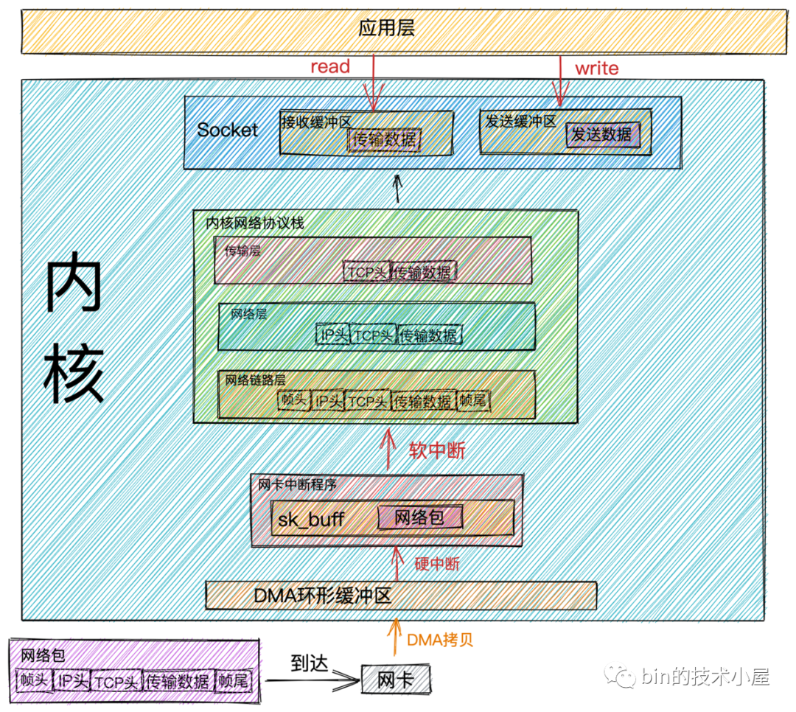

# 再谈(阻塞，非阻塞)与(同步，异步)

在我们聊完网络数据的接收和发送过程后，我们来谈下IO中特别容易混淆的概念：`阻塞与同步`，`非阻塞与异步`。

网上各种博文还有各种书籍中有大量的关于这两个概念的解释，但是笔者觉得还是不够形象化，只是对概念的生硬解释，如果硬套概念的话，其实感觉`阻塞与同步`，`非阻塞与异步`还是没啥区别，时间长了，还是比较模糊容易混淆。

所以笔者在这里尝试换一种更加形象化，更加容易理解记忆的方式来清晰地解释下什么是`阻塞与非阻塞`，什么是`同步与异步`。

经过前边对网络数据包接收流程的介绍，在这里我们可以将整个流程总结为两个阶段：

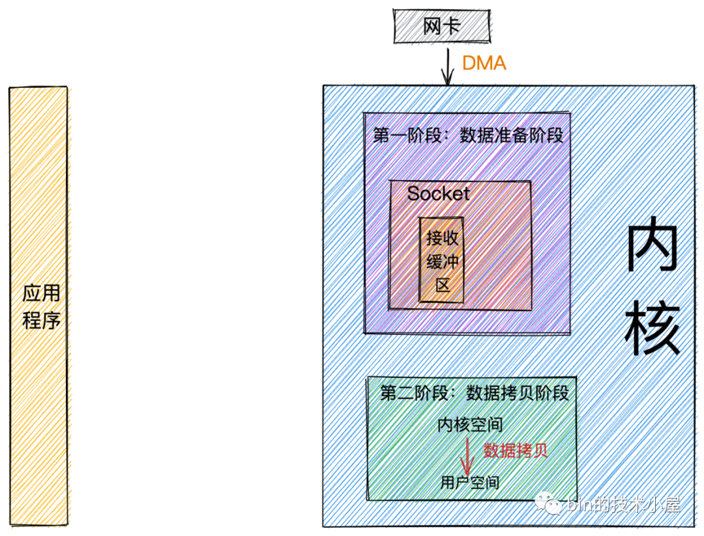

- **数据准备阶段：** 在这个阶段，网络数据包到达网卡，通过`DMA`的方式将数据包拷贝到内存中，然后经过硬中断，软中断，接着通过内核线程`ksoftirqd`经过内核协议栈的处理，最终将数据发送到`内核Socket`的接收缓冲区中。
- **数据拷贝阶段：** 当数据到达`内核Socket`的接收缓冲区中时，此时数据存在于`内核空间`中，需要将数据`拷贝`到`用户空间`中，才能够被应用程序读取。

## 阻塞与非阻塞

阻塞与非阻塞的区别主要发生在第一阶段：`数据准备阶段`。

当应用程序发起`系统调用read`时，线程从用户态转为内核态，读取内核`Socket`的接收缓冲区中的网络数据。

### 阻塞

如果这时内核`Socket`的接收缓冲区没有数据，那么线程就会一直`等待`，直到`Socket`接收缓冲区有数据为止。随后将数据从内核空间拷贝到用户空间，`系统调用read`返回。

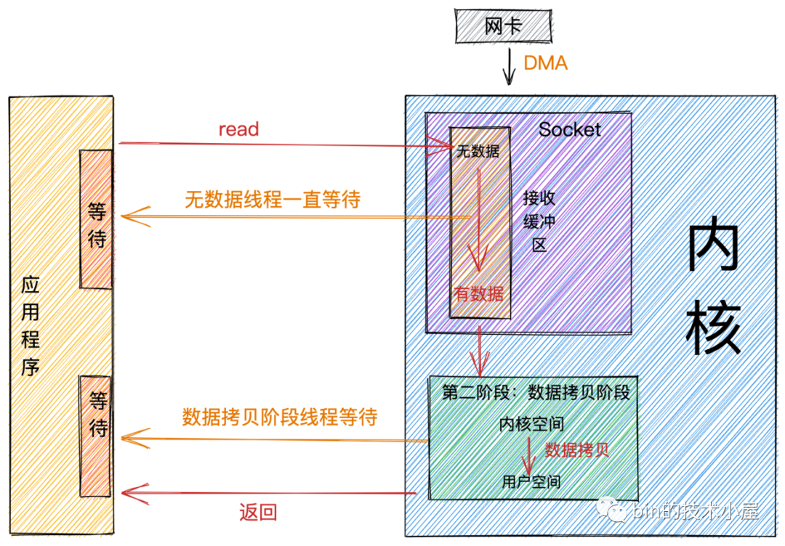

从图中我们可以看出：**阻塞**的特点是在第一阶段和第二阶段`都会等待`。

### 非阻塞

`阻塞`和`非阻塞`主要的区分是在第一阶段：`数据准备阶段`。

- 在第一阶段，当`Socket`的接收缓冲区中没有数据的时候，`阻塞模式下`应用线程会一直等待。`非阻塞模式下`应用线程不会等待，`系统调用`直接返回错误标志`EWOULDBLOCK`。
- 当`Socket`的接收缓冲区中有数据的时候，`阻塞`和`非阻塞`的表现是一样的，都会进入第二阶段`等待`数据从`内核空间`拷贝到`用户空间`，然后`系统调用返回`。

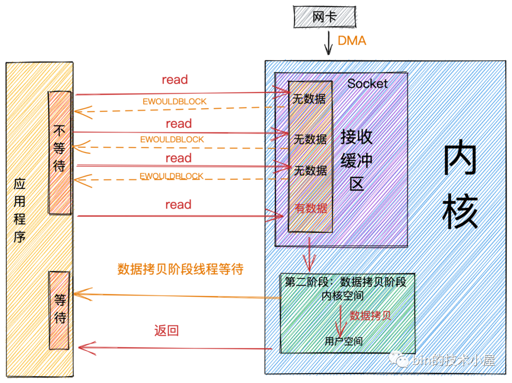

从上图中，我们可以看出：**非阻塞**的特点是第一阶段`不会等待`，但是在第二阶段还是会`等待`。

## 同步与异步

`同步`与`异步`主要的区别发生在第二阶段：`数据拷贝阶段`。

前边我们提到在`数据拷贝阶段`主要是将数据从`内核空间`拷贝到`用户空间`。然后应用程序才可以读取数据。

当内核`Socket`的接收缓冲区有数据到达时，进入第二阶段。

### 同步

`同步模式`在数据准备好后，是由`用户线程`的`内核态`来执行`第二阶段`。所以应用程序会在第二阶段发生`阻塞`，直到数据从`内核空间`拷贝到`用户空间`，系统调用才会返回。

Linux下的 `epoll`和Mac 下的 `kqueue`都属于`同步 IO`。

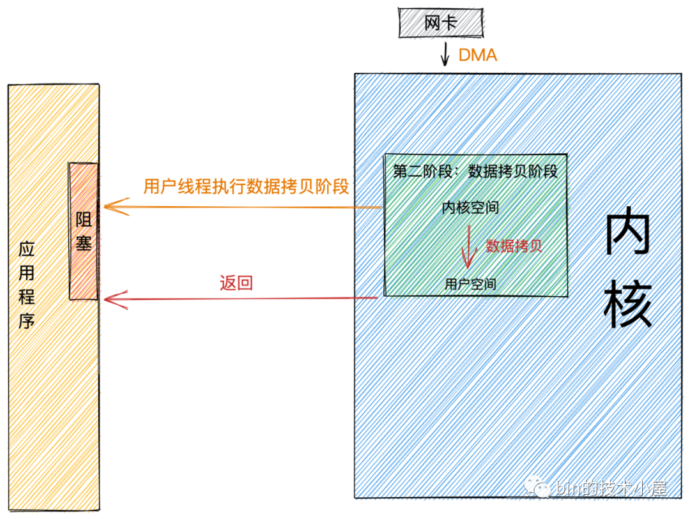

### 异步

`异步模式`下是由`内核`来执行第二阶段的数据拷贝操作，当`内核`执行完第二阶段，会通知用户线程IO操作已经完成，并将数据回调给用户线程。所以在`异步模式`下 `数据准备阶段`和`数据拷贝阶段`均是由`内核`来完成，不会对应用程序造成任何阻塞。

基于以上特征，我们可以看到`异步模式`需要内核的支持，比较依赖操作系统底层的支持。

在目前流行的操作系统中，只有Windows 中的 `IOCP`才真正属于异步 IO，实现的也非常成熟。但Windows很少用来作为服务器使用。

而常用来作为服务器使用的Linux，`异步IO机制`实现的不够成熟，与NIO相比性能提升的也不够明显。

但Linux kernel 在5.1版本由Facebook的大神Jens Axboe引入了新的异步IO库`io_uring` 改善了原来Linux native AIO的一些性能问题。性能相比`Epoll`以及之前原生的`AIO`提高了不少，值得关注。

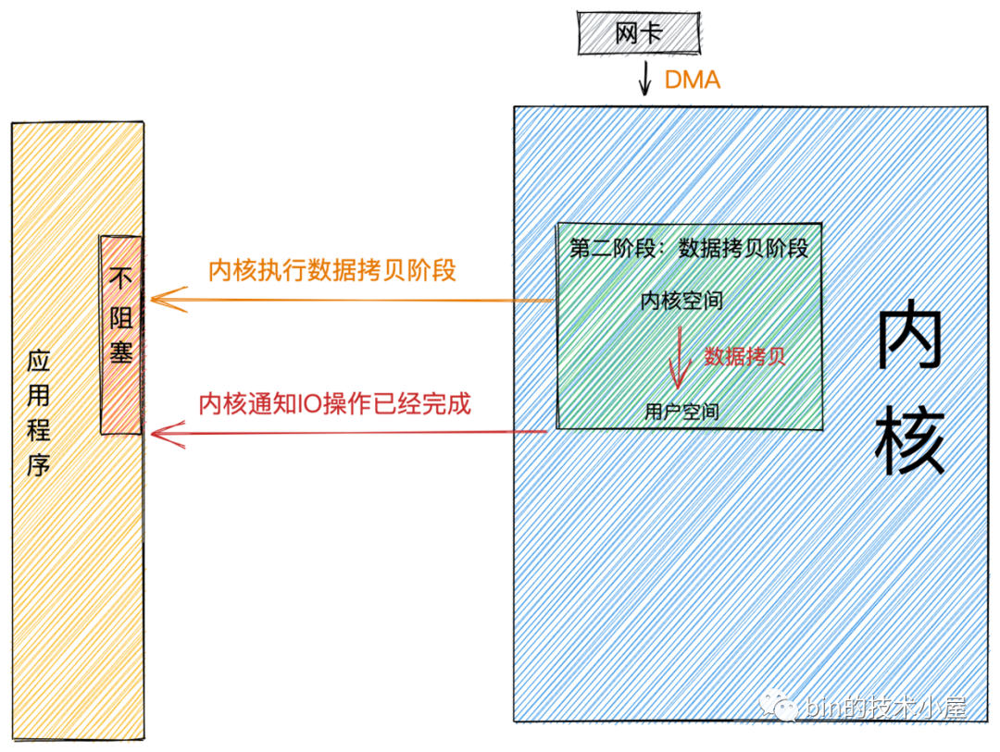

# IO模型

在进行网络IO操作时，用什么样的IO模型来读写数据将在很大程度上决定了网络框架的IO性能。所以IO模型的选择是构建一个高性能网络框架的基础。

在《UNIX 网络编程》一书中介绍了五种IO模型：`阻塞IO`,`非阻塞IO`,`IO多路复用`,`信号驱动IO`,`异步IO`，每一种IO模型的出现都是对前一种的升级优化。

下面我们就来分别介绍下这五种IO模型各自都解决了什么问题，适用于哪些场景，各自的优缺点是什么？

## 阻塞IO（BIO）


经过前一小节对`阻塞`这个概念的介绍，相信大家可以很容易理解`阻塞IO`的概念和过程。

既然这小节我们谈的是`IO`，那么下边我们来看下在`阻塞IO`模型下，网络数据的读写过程。

#### 阻塞读

当用户线程发起`read`系统调用，用户线程从用户态切换到内核态，在内核中去查看`Socket`接收缓冲区是否有数据到来。

- `Socket`接收缓冲区中`有数据`，则用户线程在内核态将内核空间中的数据拷贝到用户空间，系统IO调用返回。
- `Socket`接收缓冲区中`无数据`，则用户线程让出CPU，进入`阻塞状态`。当数据到达`Socket`接收缓冲区后，内核唤醒`阻塞状态`中的用户线程进入`就绪状态`，随后经过CPU的调度获取到`CPU quota`进入`运行状态`，将内核空间的数据拷贝到用户空间，随后系统调用返回。

#### 阻塞写

当用户线程发起`send`系统调用时，用户线程从用户态切换到内核态，将发送数据从用户空间拷贝到内核空间中的`Socket`发送缓冲区中。

- 当`Socket`发送缓冲区能够容纳下发送数据时，用户线程会将全部的发送数据写入`Socket`缓冲区，然后执行在《网络包发送流程》这小节介绍的后续流程，然后返回。
- 当`Socket`发送缓冲区空间不够，无法容纳下全部发送数据时，用户线程让出CPU,进入`阻塞状态`，直到`Socket`发送缓冲区能够容纳下全部发送数据时，内核唤醒用户线程，执行后续发送流程。

`阻塞IO`模型下的写操作做事风格比较硬刚，非得要把全部的发送数据写入发送缓冲区才肯善罢甘休。

### 阻塞IO模型

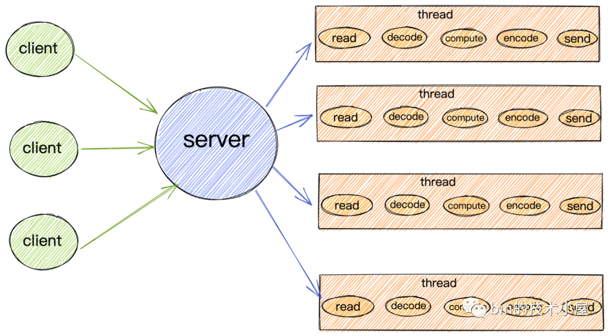

由于`阻塞IO`的读写特点，所以导致在`阻塞IO`模型下，每个请求都需要被一个独立的线程处理。一个线程在同一时刻只能与一个连接绑定。来一个请求，服务端就需要创建一个线程用来处理请求。

当客户端请求的并发量突然增大时，服务端在一瞬间就会创建出大量的线程，而创建线程是需要系统资源开销的，这样一来就会一瞬间占用大量的系统资源。

如果客户端创建好连接后，但是一直不发数据，通常大部分情况下，网络连接也`并不`总是有数据可读，那么在空闲的这段时间内，服务端线程就会一直处于`阻塞状态`，无法干其他的事情。CPU也`无法得到充分的发挥`，同时还会`导致大量线程切换的开销`。

### 适用场景

基于以上`阻塞IO模型`的特点，该模型只适用于`连接数少`，`并发度低`的业务场景。

比如公司内部的一些管理系统，通常请求数在100个左右，使用`阻塞IO模型`还是非常适合的。而且性能还不输NIO。

该模型在C10K之前，是普遍被采用的一种IO模型。

## 非阻塞IO（NIO）

`阻塞IO模型`最大的问题就是一个线程只能处理一个连接，如果这个连接上没有数据的话，那么这个线程就只能阻塞在系统IO调用上，不能干其他的事情。这对系统资源来说，是一种极大的浪费。同时大量的线程上下文切换，也是一个巨大的系统开销。

所以为了解决这个问题，**我们就需要用尽可能少的线程去处理更多的连接。**，`网络IO模型的演变`也是根据这个需求来一步一步演进的。

基于这个需求，第一种解决方案`非阻塞IO`就出现了。我们在上一小节中介绍了`非阻塞`的概念，现在我们来看下网络读写操作在`非阻塞IO`下的特点：


#### 非阻塞读

当用户线程发起非阻塞`read`系统调用时，用户线程从`用户态`转为`内核态`，在内核中去查看`Socket`接收缓冲区是否有数据到来。

- `Socket`接收缓冲区中`无数据`，系统调用立马返回，并带有一个 `EWOULDBLOCK` 或 `EAGAIN`错误，这个阶段用户线程`不会阻塞`，也`不会让出CPU`，而是会继续`轮训`直到`Socket`接收缓冲区中有数据为止。
- `Socket`接收缓冲区中`有数据`，用户线程在`内核态`会将`内核空间`中的数据拷贝到`用户空间`，**注意**这个数据拷贝阶段，应用程序是`阻塞的`，当数据拷贝完成，系统调用返回。

#### 非阻塞写

前边我们在介绍`阻塞写`的时候提到`阻塞写`的风格特别的硬朗，头比较铁非要把全部发送数据一次性都写到`Socket`的发送缓冲区中才返回，如果发送缓冲区中没有足够的空间容纳，那么就一直阻塞死等，特别的刚。

相比较而言`非阻塞写`的特点就比较佛系，当发送缓冲区中没有足够的空间容纳全部发送数据时，`非阻塞写`的特点是`能写多少写多少`，写不下了，就立即返回。并将写入到发送缓冲区的字节数返回给应用程序，方便用户线程不断的`轮训`尝试将`剩下的数据`写入发送缓冲区中。

### 非阻塞IO模型

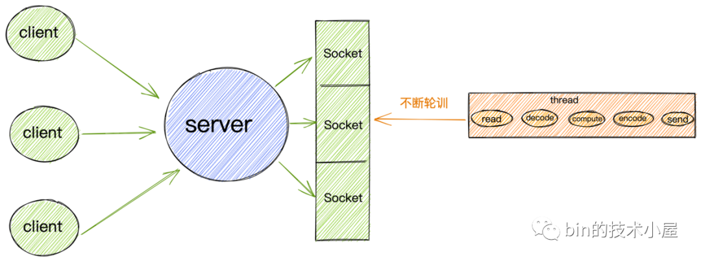

基于以上`非阻塞IO`的特点，我们就不必像`阻塞IO`那样为每个请求分配一个线程去处理连接上的读写了。

我们可以利用**一个线程或者很少的线程**，去`不断地轮询`每个`Socket`的接收缓冲区是否有数据到达，如果没有数据，`不必阻塞`线程，而是接着去`轮询`下一个`Socket`接收缓冲区，直到轮询到数据后，处理连接上的读写，或者交给业务线程池去处理，轮询线程则`继续轮询`其他的`Socket`接收缓冲区。

这样一个`非阻塞IO模型`就实现了我们在本小节开始提出的需求：**我们需要用尽可能少的线程去处理更多的连接**

### 适用场景

虽然`非阻塞IO模型`与`阻塞IO模型`相比，减少了很大一部分的资源消耗和系统开销。

但是它仍然有很大的性能问题，因为在`非阻塞IO模型`下，需要用户线程去`不断地`发起`系统调用`去轮训`Socket`接收缓冲区，这就需要用户线程不断地从`用户态`切换到`内核态`，`内核态`切换到`用户态`。随着并发量的增大，这个上下文切换的开销也是巨大的。

所以单纯的`非阻塞IO`模型还是无法适用于高并发的场景。只能适用于`C10K`以下的场景。

## IO多路复用

在`非阻塞IO`这一小节的开头，我们提到`网络IO模型`的演变都是围绕着---**如何用尽可能少的线程去处理更多的连接**这个核心需求开始展开的。

本小节我们来谈谈`IO多路复用模型`，那么什么是`多路`？，什么又是`复用`呢？

我们还是以这个核心需求来对这两个概念展开阐述：

- **多路**：我们的核心需求是要用尽可能少的线程来处理尽可能多的连接，这里的`多路`指的就是我们需要处理的众多连接。
- **复用**：核心需求要求我们使用`尽可能少的线程`，`尽可能少的系统开销`去处理`尽可能多`的连接（`多路`），那么这里的`复用`指的就是用`有限的资源`，比如用一个线程或者固定数量的线程去处理众多连接上的读写事件。换句话说，在`阻塞IO模型`中一个连接就需要分配一个独立的线程去专门处理这个连接上的读写，到了`IO多路复用模型`中，多个连接可以`复用`这一个独立的线程去处理这多个连接上的读写。

好了，`IO多路复用模型`的概念解释清楚了，那么**问题的关键**是我们如何去实现这个`复用`，也就是如何让一个独立的线程去处理众多连接上的读写事件呢？

这个问题其实在`非阻塞IO模型`中已经给出了它的答案，在`非阻塞IO模型`中，利用`非阻塞`的系统IO调用去不断的轮询众多连接的`Socket`接收缓冲区看是否有数据到来，如果有则处理，如果没有则继续轮询下一个`Socket`。这样就达到了用一个线程去处理众多连接上的读写事件了。

**但是**`非阻塞IO模型`最大的问题就是需要不断的发起`系统调用`去轮询各个`Socket`中的接收缓冲区是否有数据到来，`频繁`的`系统调用`随之带来了大量的上下文切换开销。随着并发量的提升，这样也会导致非常严重的性能问题。

**那么如何避免频繁的系统调用同时又可以实现我们的核心需求呢？**

这就需要操作系统的内核来支持这样的操作，我们可以把频繁的轮询操作交给操作系统内核来替我们完成，这样就避免了在`用户空间`频繁的去使用系统调用来轮询所带来的性能开销。

正如我们所想，操作系统内核也确实为我们提供了这样的功能实现，下面我们来一起看下操作系统对`IO多路复用模型`的实现。

### select

`select`是操作系统内核提供给我们使用的一个`系统调用`，它解决了在`非阻塞IO模型`中需要不断的发起`系统IO调用`去轮询`各个连接上的Socket`接收缓冲区所带来的`用户空间`与`内核空间`不断切换的`系统开销`。

`select`系统调用将`轮询`的操作交给了`内核`来帮助我们完成，从而避免了在`用户空间`不断的发起轮询所带来的的系统性能开销。

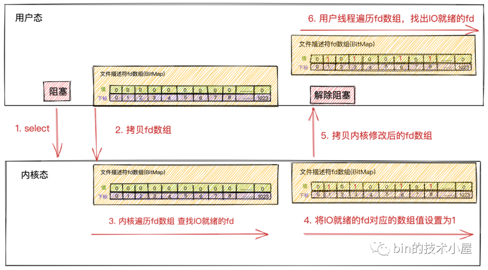

- 首先用户线程在发起`select`系统调用的时候会`阻塞`在`select`系统调用上。此时，用户线程从`用户态`切换到了`内核态`完成了一次`上下文切换`
- 用户线程将需要监听的`Socket`对应的文件描述符`fd`数组通过`select`系统调用传递给内核。此时，用户线程将`用户空间`中的文件描述符`fd`数组`拷贝`到`内核空间`。

这里的**文件描述符数组**其实是一个`BitMap`，`BitMap`下标为`文件描述符fd`，下标对应的值为：`1`表示该`fd`上有读写事件，`0`表示该`fd`上没有读写事件。


**文件描述符fd**其实就是一个`整数值`，在Linux中一切皆文件，`Socket`也是一个文件。描述进程所有信息的数据结构`task_struct`中有一个属性`struct files_struct *files`，它最终指向了一个数组，数组里存放了进程打开的所有文件列表，文件信息封装在`struct file`结构体中，这个数组存放的类型就是
`struct file`结构体，`数组的下标`则是我们常说的文件描述符`fd`。

- 当用户线程调用完`select`后开始进入`阻塞状态`，`内核`开始轮询遍历`fd`数组，查看`fd`对应的`Socket`接收缓冲区中是否有数据到来。如果有数据到来，则将`fd`对应`BitMap`的值设置为`1`。如果没有数据到来，则保持值为`0`。

> **注意**这里内核会修改原始的`fd`数组！！

- 内核遍历一遍`fd`数组后，如果发现有些`fd`上有IO数据到来，则将修改后的`fd`数组返回给用户线程。此时，会将`fd`数组从`内核空间`拷贝到`用户空间`。
- 当内核将修改后的`fd`数组返回给用户线程后，用户线程解除`阻塞`，由用户线程开始遍历`fd`数组然后找出`fd`数组中值为`1`的`Socket`文件描述符。最后对这些`Socket`发起系统调用读取数据。

> `select`不会告诉用户线程具体哪些`fd`上有IO数据到来，只是在`IO活跃`的`fd`上打上标记，将打好标记的完整`fd`数组返回给用户线程，所以用户线程还需要遍历`fd`数组找出具体哪些`fd`上有`IO数据`到来。

- 由于内核在遍历的过程中已经修改了`fd`数组，所以在用户线程遍历完`fd`数组后获取到`IO就绪`的`Socket`后，就需要`重置`fd数组，并重新调用`select`传入重置后的`fd`数组，让内核发起新的一轮遍历轮询。

#### API介绍

当我们熟悉了`select`的原理后，就很容易理解内核给我们提供的`select API`了。

```c
 int select(int maxfdp1,fd_set *readset,fd_set *writeset,fd_set *exceptset,const struct timeval *timeout)
```

从`select API`中我们可以看到，`select`系统调用是在规定的`超时时间内`，监听（`轮询`）用户感兴趣的文件描述符集合上的`可读`,`可写`,`异常`三类事件。

- `maxfdp1 ：` select传递给内核监听的文件描述符集合中数值最大的文件描述符`+1`，目的是用于限定内核遍历范围。比如：`select`监听的文件描述符集合为`{0,1,2,3,4}`，那么`maxfdp1`的值为`5`。
- `fd_set *readset：` 对`可读事件`感兴趣的文件描述符集合。
- `fd_set *writeset：` 对`可写事件`感兴趣的文件描述符集合。
- `fd_set *exceptset：`对`可写事件`感兴趣的文件描述符集合。

> 这里的`fd_set`就是我们前边提到的`文件描述符数组`，是一个`BitMap`结构。

- `const struct timeval *timeout：`select系统调用超时时间，在这段时间内，内核如果没有发现有`IO就绪`的文件描述符，就直接返回。

上小节提到，在`内核`遍历完`fd`数组后，发现有`IO就绪`的`fd`，则会将该`fd`对应的`BitMap`中的值设置为`1`，并将修改后的`fd`数组，返回给用户线程。

在用户线程中需要重新遍历`fd`数组，找出`IO就绪`的`fd`出来，然后发起真正的读写调用。

下面介绍下在用户线程中重新遍历`fd`数组的过程中，我们需要用到的`API`：

- `void FD_ZERO(fd_set *fdset)：`清空指定的文件描述符集合，即让`fd_set`中不在包含任何文件描述符。
- `void FD_SET(int fd, fd_set *fdset)：`将一个给定的文件描述符加入集合之中。

> 每次调用`select`之前都要通过`FD_ZERO`和`FD_SET`重新设置文件描述符，因为文件描述符集合会在`内核`中`被修改`。

- `int FD_ISSET(int fd, fd_set *fdset)：`检查集合中指定的文件描述符是否可以读写。用户线程`遍历`文件描述符集合,调用该方法检查相应的文件描述符是否`IO就绪`。
- `void FD_CLR(int fd, fd_set *fdset)：`将一个给定的文件描述符从集合中删除

#### 性能开销

虽然`select`解决了`非阻塞IO模型`中频繁发起`系统调用`的问题，但是在整个`select`工作过程中，我们还是看出了`select`有些不足的地方。

- 在发起`select`系统调用以及返回时，用户线程各发生了一次`用户态`到`内核态`以及`内核态`到`用户态`的上下文切换开销。**发生2次上下文`切换`**
- 在发起`select`系统调用以及返回时，用户线程在`内核态`需要将`文件描述符集合`从用户空间`拷贝`到内核空间。以及在内核修改完`文件描述符集合`后，又要将它从内核空间`拷贝`到用户空间。**发生2次文件描述符集合的`拷贝`**
- 虽然由原来在`用户空间`发起轮询`优化成了`在`内核空间`发起轮询但`select`不会告诉用户线程到底是哪些`Socket`上发生了`IO就绪`事件，只是对`IO就绪`的`Socket`作了标记，用户线程依然要`遍历`文件描述符集合去查找具体`IO就绪`的`Socket`。时间复杂度依然为`O(n)`。

> 大部分情况下，网络连接并不总是活跃的，如果`select`监听了大量的客户端连接，只有少数的连接活跃，然而使用轮询的这种方式会随着连接数的增大，效率会越来越低。

- `内核`会对原始的`文件描述符集合`进行修改。导致每次在用户空间重新发起`select`调用时，都需要对`文件描述符集合`进行`重置`。
- `BitMap`结构的文件描述符集合，长度为固定的`1024`,所以只能监听`0~1023`的文件描述符。
- `select`系统调用 不是线程安全的。

以上`select`的不足所产生的`性能开销`都会随着并发量的增大而`线性增长`。

很明显`select`也不能解决`C10K`问题，只适用于`1000`个左右的并发连接场景。

### poll

`poll`相当于是改进版的`select`，但是工作原理基本和`select`没有本质的区别。

```c
int poll(struct pollfd *fds, unsigned int nfds, int timeout)
struct pollfd {
    int   fd;         /* 文件描述符 */
    short events;     /* 需要监听的事件 */
    short revents;    /* 实际发生的事件 由内核修改设置 */
};
```

`select`中使用的文件描述符集合是采用的固定长度为1024的`BitMap`结构的`fd_set`，而`poll`换成了一个`pollfd`结构没有固定长度的数组，这样就没有了最大描述符数量的限制（当然还会受到系统文件描述符限制）

`poll`只是改进了`select`只能监听`1024`个文件描述符的数量限制，但是并没有在性能方面做出改进。和`select`上本质并没有多大差别。

- 同样需要在`内核空间`和`用户空间`中对文件描述符集合进行`轮询`，查找出`IO就绪`的`Socket`的时间复杂度依然为`O(n)`。
- 同样需要将`包含大量文件描述符的集合`整体在`用户空间`和`内核空间`之间`来回复制`，**无论这些文件描述符是否就绪**。他们的开销都会随着文件描述符数量的增加而线性增大。
- `select，poll`在每次新增，删除需要监听的socket时，都需要将整个新的`socket`集合全量传至`内核`。

`poll`同样不适用高并发的场景。依然无法解决`C10K`问题。

### epoll

通过上边对`select,poll`核心原理的介绍，我们看到`select,poll`的性能瓶颈主要体现在下面三个地方：

- 因为内核不会保存我们要监听的`socket`集合，所以在每次调用`select,poll`的时候都需要传入，传出全量的`socket`文件描述符集合。这导致了大量的文件描述符在`用户空间`和`内核空间`频繁的来回复制。
- 由于内核不会通知具体`IO就绪`的`socket`，只是在这些`IO就绪`的socket上打好标记，所以当`select`系统调用返回时，在`用户空间`还是需要`完整遍历`一遍`socket`文件描述符集合来获取具体`IO就绪`的`socket`。
- 在`内核空间`中也是通过遍历的方式来得到`IO就绪`的`socket`。

下面我们来看下`epoll`是如何解决这些问题的。在介绍`epoll`的核心原理之前，我们需要介绍下理解`epoll`工作过程所需要的一些核心基础知识。

#### Socket的创建

服务端线程调用`accept`系统调用后开始`阻塞`，当有客户端连接上来并完成`TCP三次握手`后，`内核`会创建一个对应的`Socket`作为服务端与客户端通信的`内核`接口。

在Linux内核的角度看来，一切皆是文件，`Socket`也不例外，当内核创建出`Socket`之后，会将这个`Socket`放到当前进程所打开的文件列表中管理起来。

下面我们来看下进程管理这些打开的文件列表相关的内核数据结构是什么样的？在了解完这些数据结构后，我们会更加清晰的理解`Socket`在内核中所发挥的作用。并且对后面我们理解`epoll`的创建过程有很大的帮助。

##### 进程中管理文件列表结构

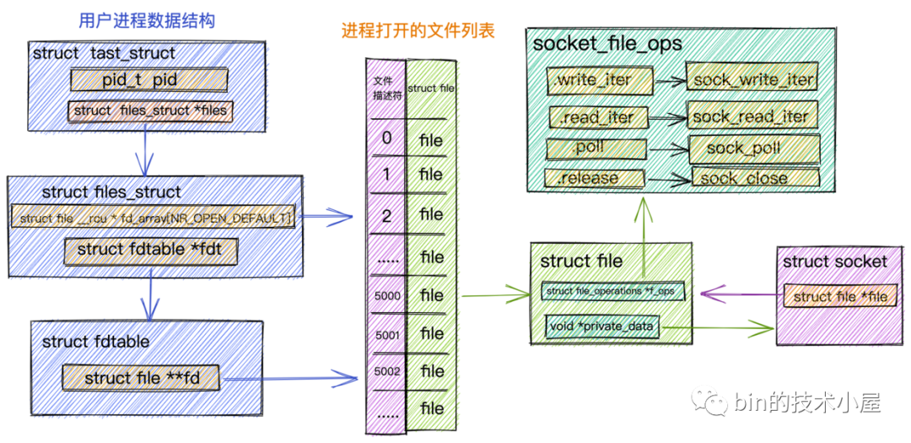

`struct tast_struct`是内核中用来表示进程的一个数据结构，它包含了进程的所有信息。本小节我们只列出和文件管理相关的属性。

其中进程内打开的所有文件是通过一个数组`fd_array`来进行组织管理，数组的下标即为我们常提到的`文件描述符`，数组中存放的是对应的文件数据结构`struct file`。每打开一个文件，内核都会创建一个`struct file`与之对应，并在`fd_array`中找到一个空闲位置分配给它，数组中对应的下标，就是我们在`用户空间`用到的`文件描述符`。

> 对于任何一个进程，默认情况下，文件描述符 `0`表示 `stdin 标准输入`，文件描述符 `1`表示`stdout 标准输出`，文件描述符`2`表示`stderr 标准错误输出`。

进程中打开的文件列表`fd_array`定义在内核数据结构`struct files_struct`中，在`struct fdtable`结构中有一个指针`struct fd **fd`指向`fd_array`。

**由于本小节讨论的是内核网络系统部分的数据结构**，所以这里拿`Socket`文件类型来举例说明：

用于封装文件元信息的内核数据结构`struct file`中的`private_data`指针指向具体的`Socket`结构。

`struct file`中的`file_operations`属性定义了文件的操作函数，不同的文件类型，对应的`file_operations`是不同的，针对`Socket`文件类型，这里的`file_operations`指向`socket_file_ops`。

> 我们在`用户空间`对`Socket`发起的读写等系统调用，进入内核首先会调用的是`Socket`对应的`struct file`中指向的`socket_file_ops`。
> **比如**：对`Socket`发起`write`写操作，在内核中首先被调用的就是`socket_file_ops`中定义的`sock_write_iter`。`Socket`发起`read`读操作内核中对应的则是`sock_read_iter`。

```c
static const struct file_operations socket_file_ops = {
  .owner =  THIS_MODULE,
  .llseek =  no_llseek,
  .read_iter =  sock_read_iter,
  .write_iter =  sock_write_iter,
  .poll =    sock_poll,
  .unlocked_ioctl = sock_ioctl,
  .mmap =    sock_mmap,
  .release =  sock_close,
  .fasync =  sock_fasync,
  .sendpage =  sock_sendpage,
  .splice_write = generic_splice_sendpage,
  .splice_read =  sock_splice_read,
};
```

##### Socket内核结构

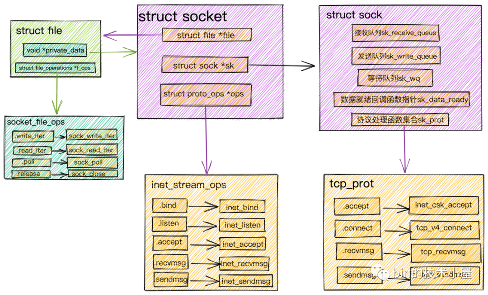

在我们进行网络程序的编写时会首先创建一个`Socket`，然后基于这个`Socket`进行`bind`，`listen`，我们先将这个`Socket`称作为`监听Socket`。

1. 当我们调用`accept`后，内核会基于`监听Socket`创建出来一个新的`Socket`专门用于与客户端之间的网络通信。并将`监听Socket`中的`Socket操作函数集合`（`inet_stream_ops`）`ops`赋值到新的`Socket`的`ops`属性中。

```c
const struct proto_ops inet_stream_ops = {
  .bind = inet_bind,
  .connect = inet_stream_connect,
  .accept = inet_accept,
  .poll = tcp_poll,
  .listen = inet_listen,
  .sendmsg = inet_sendmsg,
  .recvmsg = inet_recvmsg,
  ......
}
```

> 这里需要注意的是，`监听的 socket`和真正用来网络通信的 `Socket`，是两个 Socket，一个叫作`监听 Socket`，一个叫作`已连接的Socket`。

1. 接着内核会为`已连接的Socket`创建`struct file`并初始化，并把Socket文件操作函数集合（`socket_file_ops`）赋值给`struct file`中的`f_ops`指针。然后将`struct socket`中的`file`指针指向这个新分配申请的`struct file`结构体。

> 内核会维护两个队列：
>
> - 一个是已经完成`TCP三次握手`，连接状态处于`established`的连接队列。内核中为`icsk_accept_queue`。
> - 一个是还没有完成`TCP三次握手`，连接状态处于`syn_rcvd`的半连接队列。

1. 然后调用`socket->ops->accept`，从`Socket内核结构图`中我们可以看到其实调用的是`inet_accept`，该函数会在`icsk_accept_queue`中查找是否有已经建立好的连接，如果有的话，直接从`icsk_accept_queue`中获取已经创建好的`struct sock`。并将这个`struct sock`对象赋值给`struct socket`中的`sock`指针。

```
struct sock`在`struct socket`中是一个非常核心的内核对象，正是在这里定义了我们在介绍`网络包的接收发送流程`中提到的`接收队列`，`发送队列`，`等待队列`，`数据就绪回调函数指针`，`内核协议栈操作函数集合
```

- 根据创建`Socket`时发起的系统调用`sock_create`中的`protocol`参数(对于`TCP协议`这里的参数值为`SOCK_STREAM`)查找到对于 tcp 定义的操作方法实现集合 `inet_stream_ops` 和`tcp_prot`。并把它们分别设置到`socket->ops`和`sock->sk_prot`上。

> 这里可以回看下本小节开头的《Socket内核结构图》捋一下他们之间的关系。

> `socket`相关的操作接口定义在`inet_stream_ops`函数集合中，负责对上给用户提供接口。而`socket`与内核协议栈之间的操作接口定义在`struct sock`中的`sk_prot`指针上，这里指向`tcp_prot`协议操作函数集合。

```c
struct proto tcp_prot = {
  .name      = "TCP",
  .owner      = THIS_MODULE,
  .close      = tcp_close,
  .connect    = tcp_v4_connect,
  .disconnect    = tcp_disconnect,
  .accept      = inet_csk_accept,
  .keepalive    = tcp_set_keepalive,
  .recvmsg    = tcp_recvmsg,
  .sendmsg    = tcp_sendmsg,
  .backlog_rcv    = tcp_v4_do_rcv,
   ......
}
```

> 之前提到的对`Socket`发起的系统IO调用，在内核中首先会调用`Socket`的文件结构`struct file`中的`file_operations`文件操作集合，然后调用`struct socket`中的`ops`指向的`inet_stream_ops`socket操作函数，最终调用到`struct sock`中`sk_prot`指针指向的`tcp_prot`内核协议栈操作函数接口集合。

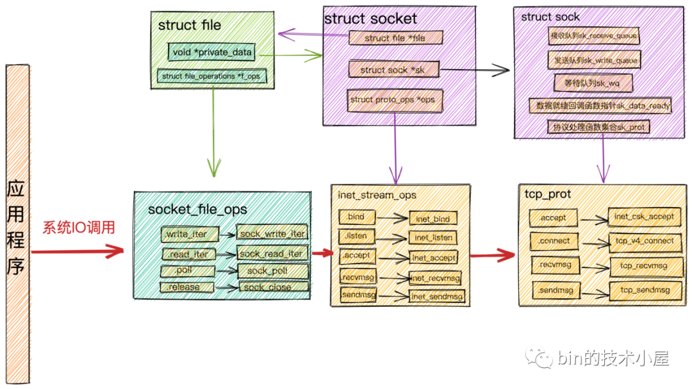

- 将`struct sock` 对象中的`sk_data_ready` 函数指针设置为 `sock_def_readable`，在`Socket`数据就绪的时候内核会回调该函数。
- `struct sock`中的`等待队列`中存放的是系统IO调用发生阻塞的`进程fd`，以及相应的`回调函数`。**记住这个地方，后边介绍epoll的时候我们还会提到！**

1. 当`struct file`，`struct socket`，`struct sock`这些核心的内核对象创建好之后，最后就是把`socket`对象对应的`struct file`放到进程打开的文件列表`fd_array`中。随后系统调用`accept`返回`socket`的文件描述符`fd`给用户程序。

#### 阻塞IO中用户进程阻塞以及唤醒原理

在前边小节我们介绍`阻塞IO`的时候提到，当用户进程发起系统IO调用时，这里我们拿`read`举例，用户进程会在`内核态`查看对应`Socket`接收缓冲区是否有数据到来。

- `Socket`接收缓冲区有数据，则拷贝数据到`用户空间`，系统调用返回。
- `Socket`接收缓冲区没有数据，则用户进程让出`CPU`进入`阻塞状态`，当数据到达接收缓冲区时，用户进程会被唤醒，从`阻塞状态`进入`就绪状态`，等待CPU调度。

本小节我们就来看下用户进程是如何`阻塞`在`Socket`上，又是如何在`Socket`上被唤醒的。**理解这个过程很重要，对我们理解epoll的事件通知过程很有帮助**

- 首先我们在用户进程中对`Socket`进行`read`系统调用时，用户进程会从`用户态`转为`内核态`。
- 在进程的`struct task_struct`结构找到`fd_array`，并根据`Socket`的文件描述符`fd`找到对应的`struct file`，调用`struct file`中的文件操作函数结合`file_operations`，`read`系统调用对应的是`sock_read_iter`。
- 在`sock_read_iter`函数中找到`struct file`指向的`struct socket`，并调用`socket->ops->recvmsg`，这里我们知道调用的是`inet_stream_ops`集合中定义的`inet_recvmsg`。
- 在`inet_recvmsg`中会找到`struct sock`，并调用`sock->skprot->recvmsg`,这里调用的是`tcp_prot`集合中定义的`tcp_recvmsg`函数。

> 整个调用过程可以参考上边的《系统IO调用结构图》

**熟悉了内核函数调用栈后，我们来看下系统IO调用在`tcp_recvmsg`内核函数中是如何将用户进程给阻塞掉的**

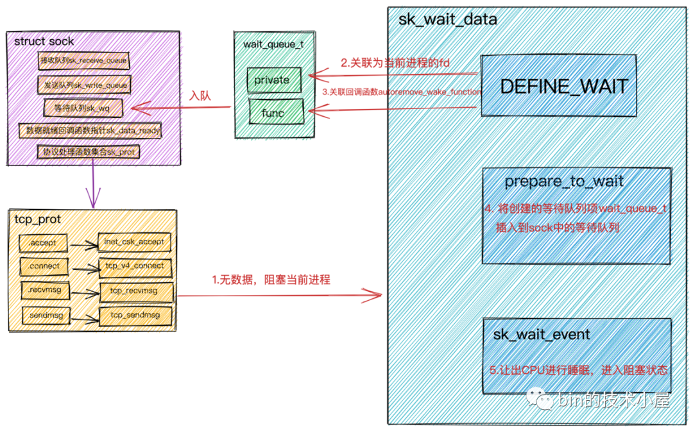

```c
int tcp_recvmsg(struct kiocb *iocb, struct sock *sk, struct msghdr *msg,
  size_t len, int nonblock, int flags, int *addr_len)
{
    .................省略非核心代码...............
   //访问sock对象中定义的接收队列
  skb_queue_walk(&sk->sk_receive_queue, skb) {

    .................省略非核心代码...............

  //没有收到足够数据，调用sk_wait_data 阻塞当前进程
  sk_wait_data(sk, &timeo);
}
int sk_wait_data(struct sock *sk, long *timeo)
{
 //创建struct sock中等待队列上的元素wait_queue_t
 //将进程描述符和回调函数autoremove_wake_function关联到wait_queue_t中
 DEFINE_WAIT(wait);

 // 调用 sk_sleep 获取 sock 对象下的等待队列的头指针wait_queue_head_t
 // 调用prepare_to_wait将新创建的等待项wait_queue_t插入到等待队列中，并将进程状态设置为可打断 INTERRUPTIBLE
 prepare_to_wait(sk_sleep(sk), &wait, TASK_INTERRUPTIBLE);
 set_bit(SOCK_ASYNC_WAITDATA, &sk->sk_socket->flags);

 // 通过调用schedule_timeout让出CPU，然后进行睡眠，导致一次上下文切换
 rc = sk_wait_event(sk, timeo, !skb_queue_empty(&sk->sk_receive_queue));
 ...
```

- 首先会在`DEFINE_WAIT`中创建`struct sock`中等待队列上的等待类型`wait_queue_t`。

```c
#define DEFINE_WAIT(name) DEFINE_WAIT_FUNC(name, autoremove_wake_function)

#define DEFINE_WAIT_FUNC(name, function)    \
 wait_queue_t name = {      \
  .private = current,    \
  .func  = function,    \
  .task_list = LIST_HEAD_INIT((name).task_list), \
 }
```

等待类型`wait_queue_t`中的`private`用来关联`阻塞`在当前`socket`上的用户进程`fd`。`func`用来关联等待项上注册的回调函数。这里注册的是`autoremove_wake_function`。

- 调用`sk_sleep(sk)`获取`struct sock`对象中的等待队列头指针`wait_queue_head_t`。
- 调用`prepare_to_wait`将新创建的等待项`wait_queue_t`插入到等待队列中，并将进程设置为可打断 `INTERRUPTIBL`。
- 调用`sk_wait_event`让出CPU，进程进入睡眠状态。

用户进程的`阻塞过程`我们就介绍完了，关键是要理解记住`struct sock`中定义的等待队列上的等待类型`wait_queue_t`的结构。后面`epoll`的介绍中我们还会用到它。

**下面我们接着介绍当数据就绪后，用户进程是如何被唤醒的**

在本文开始介绍《网络包接收过程》这一小节中我们提到：

- 当网络数据包到达网卡时，网卡通过`DMA`的方式将数据放到`RingBuffer`中。
- 然后向CPU发起硬中断，在硬中断响应程序中创建`sk_buffer`，并将网络数据拷贝至`sk_buffer`中。
- 随后发起软中断，内核线程`ksoftirqd`响应软中断，调用`poll函数`将`sk_buffer`送往内核协议栈做层层协议处理。
- 在传输层`tcp_rcv 函数`中，去掉TCP头，根据`四元组（源IP，源端口，目的IP，目的端口）`查找对应的`Socket`。
- 最后将`sk_buffer`放到`Socket`中的接收队列里。

上边这些过程是内核接收网络数据的完整过程，下边我们来看下，当数据包接收完毕后，用户进程是如何被唤醒的。

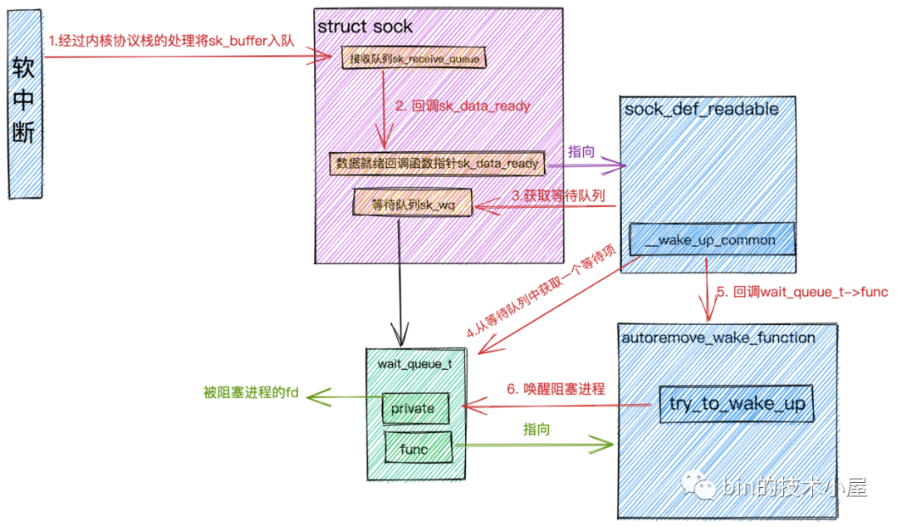

- 当软中断将`sk_buffer`放到`Socket`的接收队列上时，接着就会调用`数据就绪函数回调指针sk_data_ready`，前边我们提到，这个函数指针在初始化的时候指向了`sock_def_readable`函数。
- 在`sock_def_readable`函数中会去获取`socket->sock->sk_wq`等待队列。在`wake_up_common`函数中从等待队列`sk_wq`中找出`一个`等待项`wait_queue_t`，回调注册在该等待项上的`func`回调函数（`wait_queue_t->func`）,创建等待项`wait_queue_t`是我们提到，这里注册的回调函数是`autoremove_wake_function`。

> 即使是有多个进程都阻塞在同一个 socket 上，也只唤醒 1 个进程。其作用是为了避免惊群。

- 在`autoremove_wake_function`函数中，根据等待项`wait_queue_t`上的`private`关联的`阻塞进程fd`调用`try_to_wake_up`唤醒阻塞在该`Socket`上的进程。

> 记住`wait_queue_t`中的`func`函数指针，在`epoll`中这里会注册`epoll`的回调函数。

现在理解`epoll`所需要的基础知识我们就介绍完了，唠叨了这么多，下面终于正式进入本小节的主题`epoll`了。

#### epoll_create创建epoll对象

`epoll_create`是内核提供给我们创建`epoll`对象的一个系统调用，当我们在用户进程中调用`epoll_create`时，内核会为我们创建一个`struct eventpoll`对象，并且也有相应的`struct file`与之关联，同样需要把这个`struct eventpoll`对象所关联的`struct file`放入进程打开的文件列表`fd_array`中管理。

> 熟悉了`Socket`的创建逻辑，`epoll`的创建逻辑也就不难理解了。

> `struct eventpoll`对象关联的`struct file`中的`file_operations 指针`指向的是`eventpoll_fops`操作函数集合。

```c
static const struct file_operations eventpoll_fops = {
     .release = ep_eventpoll_release;
     .poll = ep_eventpoll_poll,
}
```

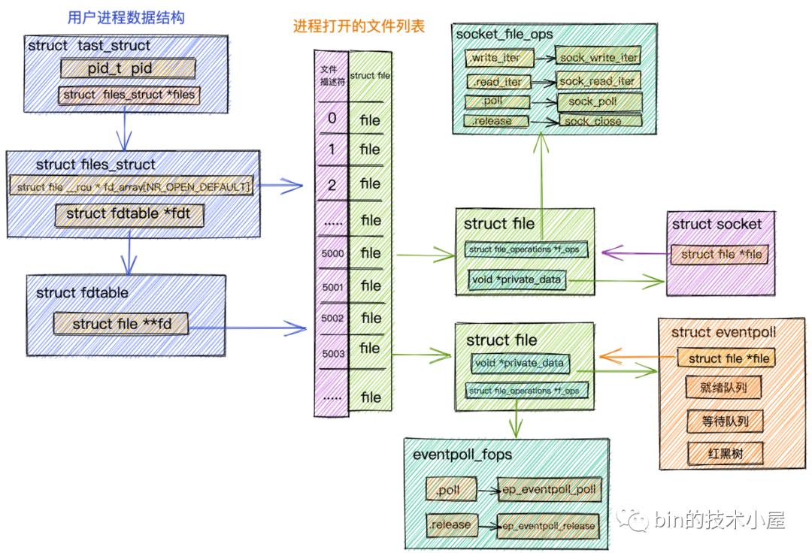

```c
struct eventpoll {

    //等待队列，阻塞在epoll上的进程会放在这里
    wait_queue_head_t wq;

    //就绪队列，IO就绪的socket连接会放在这里
    struct list_head rdllist;

    //红黑树用来管理所有监听的socket连接
    struct rb_root rbr;

    ......
}
```

- `wait_queue_head_t wq：`epoll中的等待队列，队列里存放的是`阻塞`在`epoll`上的用户进程。在`IO就绪`的时候`epoll`可以通过这个队列找到这些`阻塞`的进程并唤醒它们，从而执行`IO调用`读写`Socket`上的数据。

> 这里注意与`Socket`中的等待队列区分！！！

- `struct list_head rdllist：`epoll中的就绪队列，队列里存放的是都是`IO就绪`的`Socket`，被唤醒的用户进程可以直接读取这个队列获取`IO活跃`的`Socket`。无需再次遍历整个`Socket`集合。

> 这里正是`epoll`比`select ，poll`高效之处，`select ，poll`返回的是全部的`socket`连接，我们需要在`用户空间`再次遍历找出真正`IO活跃`的`Socket`连接。
> 而`epoll`只是返回`IO活跃`的`Socket`连接。用户进程可以直接进行IO操作。

- `struct rb_root rbr :` 由于红黑树在`查找`，`插入`，`删除`等综合性能方面是最优的，所以epoll内部使用一颗红黑树来管理海量的`Socket`连接。

> `select`用`数组`管理连接，`poll`用`链表`管理连接。

#### epoll_ctl向epoll对象中添加监听的Socket

当我们调用`epoll_create`在内核中创建出`epoll`对象`struct eventpoll`后，我们就可以利用`epoll_ctl`向`epoll`中添加我们需要管理的`Socket`连接了。

1. 首先要在epoll内核中创建一个表示`Socket连接`的数据结构`struct epitem`，而在`epoll`中为了综合性能的考虑，采用一颗红黑树来管理这些海量`socket连接`。所以`struct epitem`是一个红黑树节点。

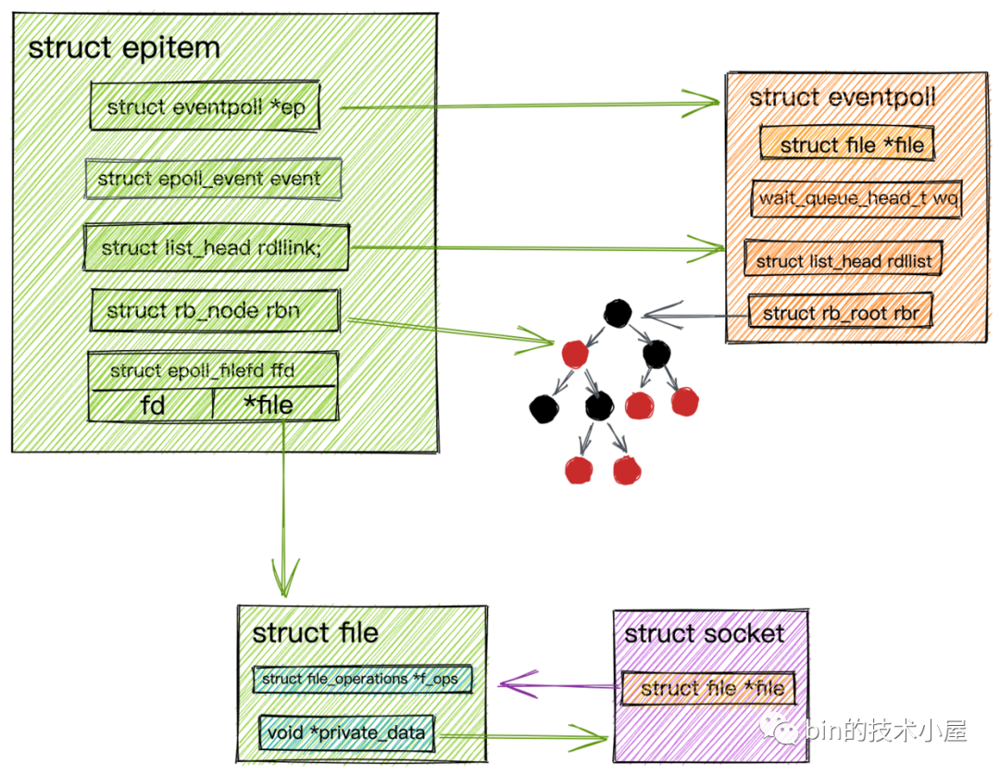

```c
struct epitem
{
      //指向所属epoll对象
      struct eventpoll *ep; 
      //注册的感兴趣的事件,也就是用户空间的epoll_event     
      struct epoll_event event; 
      //指向epoll对象中的就绪队列
      struct list_head rdllink;  
      //指向epoll中对应的红黑树节点
      struct rb_node rbn;     
      //指向epitem所表示的socket->file结构以及对应的fd
      struct epoll_filefd ffd;                  
  }
```

> 这里重点记住`struct epitem`结构中的`rdllink`以及`epoll_filefd`成员，后面我们会用到。

1. 在内核中创建完表示`Socket连接`的数据结构`struct epitem`后，我们就需要在`Socket`中的等待队列上创建等待项`wait_queue_t`并且注册`epoll的回调函数ep_poll_callback`。

通过`《阻塞IO中用户进程阻塞以及唤醒原理》`小节的铺垫，我想大家已经猜到这一步的意义所在了吧！当时在等待项`wait_queue_t`中注册的是`autoremove_wake_function`回调函数。还记得吗？

> epoll的回调函数`ep_poll_callback`正是`epoll`同步IO事件通知机制的核心所在，也是区别于`select，poll`采用内核轮询方式的根本性能差异所在。

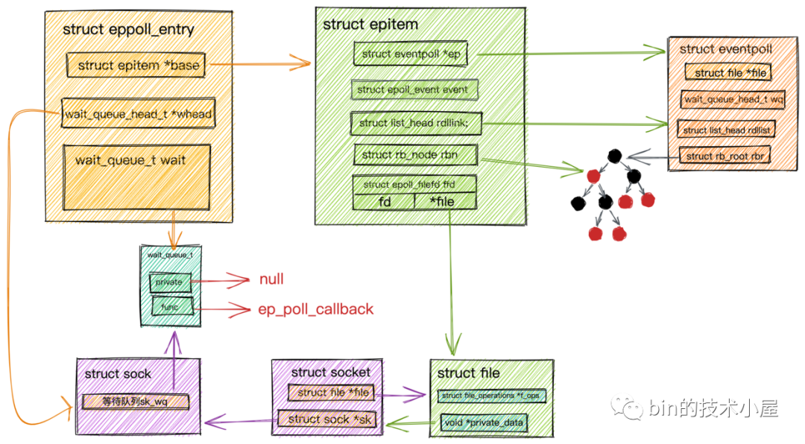

**这里又出现了一个新的数据结构`struct eppoll_entry`，那它的作用是干什么的呢？大家可以结合上图先猜测下它的作用!**

我们知道`socket->sock->sk_wq`等待队列中的类型是`wait_queue_t`，我们需要在`struct epitem`所表示的`socket`的等待队列上注册`epoll`回调函数`ep_poll_callback`。

这样当数据到达`socket`中的接收队列时，内核会回调`sk_data_ready`，在`阻塞IO中用户进程阻塞以及唤醒原理`这一小节中，我们知道这个`sk_data_ready`函数指针会指向`sk_def_readable`函数，在`sk_def_readable`中会回调注册在等待队列里的等待项`wait_queue_t -> func`回调函数`ep_poll_callback`。**在`ep_poll_callback`中需要找到`epitem`**，将`IO就绪`的`epitem`放入`epoll`中的就绪队列中。

而`socket`等待队列中类型是`wait_queue_t`无法关联到`epitem`。所以就出现了`struct eppoll_entry`结构体，它的作用就是关联`Socket`等待队列中的等待项`wait_queue_t`和`epitem`。

```c
struct eppoll_entry { 
   //指向关联的epitem
   struct epitem *base; 

  // 关联监听socket中等待队列中的等待项 (private = null  func = ep_poll_callback)
   wait_queue_t wait;   

   // 监听socket中等待队列头指针
   wait_queue_head_t *whead; 
    .........
  }; 
```

这样在`ep_poll_callback`回调函数中就可以根据`Socket`等待队列中的等待项`wait`，通过`container_of宏`找到`eppoll_entry`，继而找到`epitem`了。

> `container_of`在Linux内核中是一个常用的宏，用于从包含在某个结构中的指针获得结构本身的指针，通俗地讲就是通过结构体变量中某个成员的首地址进而获得整个结构体变量的首地址。

> 这里需要注意下这次等待项`wait_queue_t`中的`private`设置的是`null`，因为这里`Socket`是交给`epoll`来管理的，阻塞在`Socket`上的进程是也由`epoll`来唤醒。在等待项`wait_queue_t`注册的`func`是`ep_poll_callback`而不是`autoremove_wake_function`，`阻塞进程`并不需要`autoremove_wake_function`来唤醒，所以这里设置`private`为`null`

1. 当在`Socket`的等待队列中创建好等待项`wait_queue_t`并且注册了`epoll`的回调函数`ep_poll_callback`，然后又通过`eppoll_entry`关联了`epitem`后。
   剩下要做的就是将`epitem`插入到`epoll`中的红黑树`struct rb_root rbr`中。

> 这里可以看到`epoll`另一个优化的地方，`epoll`将所有的`socket`连接通过内核中的红黑树来集中管理。每次添加或者删除`socket连接`都是增量添加删除，而不是像`select，poll`那样每次调用都是全量`socket连接`集合传入内核。避免了`频繁大量`的`内存拷贝`。

#### epoll_wait同步阻塞获取IO就绪的Socket

1. 用户程序调用`epoll_wait`后，内核首先会查找epoll中的就绪队列`eventpoll->rdllist`是否有`IO就绪`的`epitem`。`epitem`里封装了`socket`的信息。如果就绪队列中有就绪的`epitem`，就将`就绪的socket`信息封装到`epoll_event`返回。
2. 如果`eventpoll->rdllist`就绪队列中没有`IO就绪`的`epitem`，则会创建等待项`wait_queue_t`，将用户进程的`fd`关联到`wait_queue_t->private`上，并在等待项`wait_queue_t->func`上注册回调函数`default_wake_function`。最后将等待项添加到`epoll`中的等待队列中。用户进程让出CPU，进入`阻塞状态`。

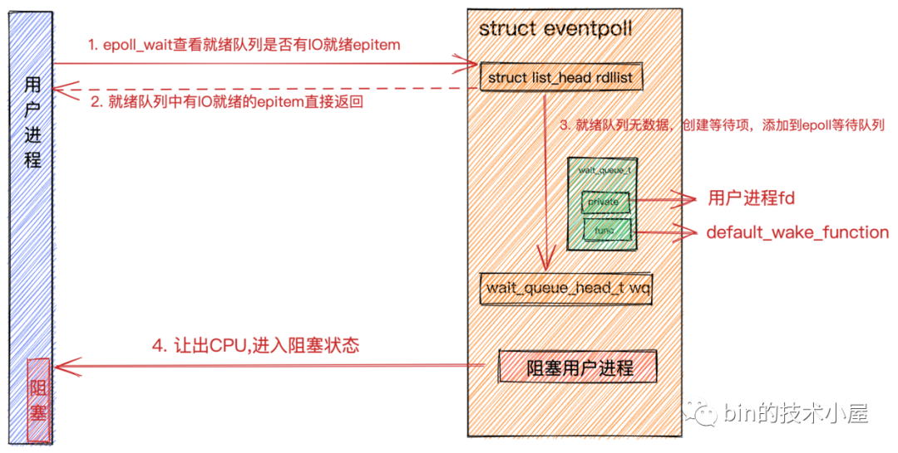

> 这里和`阻塞IO模型`中的阻塞原理是一样的，只不过在`阻塞IO模型`中注册到等待项`wait_queue_t->func`上的是`autoremove_wake_function`，并将等待项添加到`socket`中的等待队列中。这里注册的是`default_wake_function`，将等待项添加到`epoll`中的等待队列上。

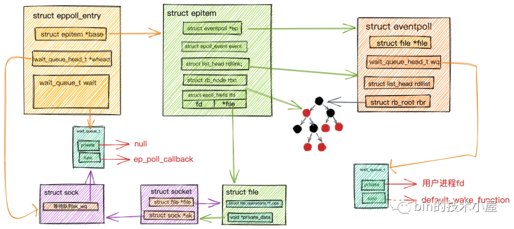

1. **前边做了那么多的知识铺垫，下面终于到了`epoll`的整个工作流程了：**

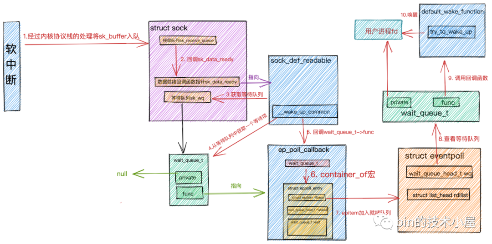

- 当网络数据包在软中断中经过内核协议栈的处理到达`socket`的接收缓冲区时，紧接着会调用socket的数据就绪回调指针`sk_data_ready`，回调函数为`sock_def_readable`。在`socket`的等待队列中找出等待项，其中等待项中注册的回调函数为`ep_poll_callback`。
- 在回调函数`ep_poll_callback`中，根据`struct eppoll_entry`中的`struct wait_queue_t wait`通过`container_of宏`找到`eppoll_entry`对象并通过它的`base`指针找到封装`socket`的数据结构`struct epitem`，并将它加入到`epoll`中的就绪队列`rdllist`中。
- 随后查看`epoll`中的等待队列中是否有等待项，也就是说查看是否有进程阻塞在`epoll_wait`上等待`IO就绪`的`socket`。如果没有等待项，则软中断处理完成。
- 如果有等待项，则回到注册在等待项中的回调函数`default_wake_function`,在回调函数中唤醒`阻塞进程`，并将就绪队列`rdllist`中的`epitem`的`IO就绪`socket信息封装到`struct epoll_event`中返回。
- 用户进程拿到`epoll_event`获取`IO就绪`的socket，发起系统IO调用读取数据。

### 再谈水平触发和边缘触发

网上有大量的关于这两种模式的讲解，大部分讲的比较模糊，感觉只是强行从概念上进行描述，看完让人难以理解。所以在这里，笔者想结合上边`epoll`的工作过程，再次对这两种模式做下自己的解读，力求清晰的解释出这两种工作模式的异同。

经过上边对`epoll`工作过程的详细解读，我们知道，当我们监听的`socket`上有数据到来时，软中断会执行`epoll`的回调函数`ep_poll_callback`,在回调函数中会将`epoll`中描述`socket信息`的数据结构`epitem`插入到`epoll`中的就绪队列`rdllist`中。随后用户进程从`epoll`的等待队列中被唤醒，`epoll_wait`将`IO就绪`的`socket`返回给用户进程，随即`epoll_wait`会清空`rdllist`。

**水平触发**和**边缘触发**最关键的**区别**就在于当`socket`中的接收缓冲区还有数据可读时。**`epoll_wait`是否会清空`rdllist`。**

- **水平触发**：在这种模式下，用户线程调用`epoll_wait`获取到`IO就绪`的socket后，对`Socket`进行系统IO调用读取数据，假设`socket`中的数据只读了一部分没有全部读完，这时再次调用`epoll_wait`，`epoll_wait`会检查这些`Socket`中的接收缓冲区是否还有数据可读，如果还有数据可读，就将`socket`重新放回`rdllist`。所以当`socket`上的IO没有被处理完时，再次调用`epoll_wait`依然可以获得这些`socket`，用户进程可以接着处理`socket`上的IO事件。
- **边缘触发：** 在这种模式下，`epoll_wait`就会直接清空`rdllist`，不管`socket`上是否还有数据可读。所以在边缘触发模式下，当你没有来得及处理`socket`接收缓冲区的剩下可读数据时，再次调用`epoll_wait`，因为这时`rdlist`已经被清空了，`socket`不会再次从`epoll_wait`中返回，所以用户进程就不会再次获得这个`socket`了，也就无法在对它进行IO处理了。**除非，这个`socket`上有新的IO数据到达**，根据`epoll`的工作过程，该`socket`会被再次放入`rdllist`中。

> 如果你在`边缘触发模式`下，处理了部分`socket`上的数据，那么想要处理剩下部分的数据，就只能等到这个`socket`上再次有网络数据到达。

在`Netty`中实现的`EpollSocketChannel`默认的就是`边缘触发`模式。`JDK`的`NIO`默认是`水平触发`模式。

#### epoll对select，poll的优化总结

- `epoll`在内核中通过`红黑树`管理海量的连接，所以在调用`epoll_wait`获取`IO就绪`的socket时，不需要传入监听的socket文件描述符。从而避免了海量的文件描述符集合在`用户空间`和`内核空间`中来回复制。

> `select，poll`每次调用时都需要传递全量的文件描述符集合，导致大量频繁的拷贝操作。

- `epoll`仅会通知`IO就绪`的socket。避免了在用户空间遍历的开销。

> `select，poll`只会在`IO就绪`的socket上打好标记，依然是全量返回，所以在用户空间还需要用户程序在一次遍历全量集合找出具体`IO就绪`的socket。

- `epoll`通过在`socket`的等待队列上注册回调函数`ep_poll_callback`通知用户程序`IO就绪`的socket。避免了在内核中轮询的开销。

> 大部分情况下`socket`上并不总是`IO活跃`的，在面对海量连接的情况下，`select，poll`采用内核轮询的方式获取`IO活跃`的socket，无疑是性能低下的核心原因。

根据以上`epoll`的性能优势，它是目前为止各大主流网络框架，以及反向代理中间件使用到的网络IO模型。

利用`epoll`多路复用IO模型可以轻松的解决`C10K`问题。

`C100k`的解决方案也还是基于`C10K`的方案，通过`epoll` 配合线程池，再加上 CPU、内存和网络接口的性能和容量提升。大部分情况下，`C100K`很自然就可以达到。

甚至`C1000K`的解决方法，本质上还是构建在 `epoll` 的`多路复用 I/O 模型`上。只不过，除了 I/O 模型之外，还需要从应用程序到 Linux 内核、再到 CPU、内存和网络等各个层次的深度优化，特别是需要借助硬件，来卸载那些原来通过软件处理的大量功能（`去掉大量的中断响应开销`，`以及内核协议栈处理的开销`）。

## 信号驱动IO


大家对这个装备肯定不会陌生，当我们去一些美食城吃饭的时候，点完餐付了钱，老板会给我们一个信号器。然后我们带着这个信号器可以去找餐桌，或者干些其他的事情。当信号器亮了的时候，这时代表饭餐已经做好，我们可以去窗口取餐了。

这个典型的生活场景和我们要介绍的`信号驱动IO模型`就很像。

在`信号驱动IO模型`下，用户进程操作通过`系统调用 sigaction 函数`发起一个 IO 请求，在对应的`socket`注册一个`信号回调`，此时`不阻塞`用户进程，进程会继续工作。当内核数据就绪时，内核就为该进程生成一个 `SIGIO 信号`，通过信号回调通知进程进行相关 IO 操作。

> 这里需要注意的是：`信号驱动式 IO 模型`依然是`同步IO`，因为它虽然可以在等待数据的时候不被阻塞，也不会频繁的轮询，但是当数据就绪，内核信号通知后，用户进程依然要自己去读取数据，在`数据拷贝阶段`发生阻塞。

> 信号驱动 IO模型 相比于前三种 IO 模型，实现了在等待数据就绪时，进程不被阻塞，主循环可以继续工作，所以`理论上`性能更佳。

但是实际上，使用`TCP协议`通信时，`信号驱动IO模型`几乎`不会被采用`。原因如下：

- 信号IO 在大量 IO 操作时可能会因为信号队列溢出导致没法通知
- `SIGIO 信号`是一种 Unix 信号，信号没有附加信息，如果一个信号源有多种产生信号的原因，信号接收者就无法确定究竟发生了什么。而 TCP socket 生产的信号事件有七种之多，这样应用程序收到 SIGIO，根本无从区分处理。

但`信号驱动IO模型`可以用在 `UDP`通信上，因为UDP 只有`一个数据请求事件`，这也就意味着在正常情况下 UDP 进程只要捕获 SIGIO 信号，就调用 `read 系统调用`读取到达的数据。如果出现异常，就返回一个异常错误。

------

这里插句题外话，大家觉不觉得`阻塞IO模型`在生活中的例子就像是我们在食堂排队打饭。你自己需要排队去打饭同时打饭师傅在配菜的过程中你需要等待。


`IO多路复用模型`就像是我们在饭店门口排队等待叫号。叫号器就好比`select,poll,epoll`可以统一管理全部顾客的`吃饭就绪`事件，客户好比是`socket`连接，谁可以去吃饭了，叫号器就通知谁。


## 异步IO（AIO）

以上介绍的四种`IO模型`均为`同步IO`，它们都会阻塞在第二阶段`数据拷贝阶段`。

通过在前边小节《同步与异步》中的介绍，相信大家很容易就会理解`异步IO模型`，在`异步IO模型`下，IO操作在`数据准备阶段`和`数据拷贝阶段`均是由内核来完成，不会对应用程序造成任何阻塞。应用进程只需要在`指定的数组`中引用数据即可。

`异步 IO` 与`信号驱动 IO` 的主要区别在于：`信号驱动 IO` 由内核通知何时可以`开始一个 IO 操作`，而`异步 IO`由内核通知 `IO 操作何时已经完成`。

举个生活中的例子：`异步IO模型`就像我们去一个高档饭店里的包间吃饭，我们只需要坐在包间里面，点完餐（`类比异步IO调用`）之后，我们就什么也不需要管，该喝酒喝酒，该聊天聊天，饭餐做好后服务员（`类比内核`）会自己给我们送到包间（`类比用户空间`）来。整个过程没有任何阻塞。


`异步IO`的系统调用需要操作系统内核来支持，目前只有`Window`中的`IOCP`实现了非常成熟的`异步IO机制`。

而`Linux`系统对`异步IO机制`实现的不够成熟，且与`NIO`的性能相比提升也不明显。

> 但Linux kernel 在5.1版本由Facebook的大神Jens Axboe引入了新的异步IO库`io_uring` 改善了原来Linux native AIO的一些性能问题。性能相比`Epoll`以及之前原生的`AIO`提高了不少，值得关注。

再加上`信号驱动IO模型`不适用`TCP协议`，所以目前大部分采用的还是`IO多路复用模型`。

## 总结

在前边内容的介绍中，我们详述了网络数据包的接收和发送过程，并通过介绍5种`IO模型`了解了内核是如何读取网络数据并通知给用户线程的。

前边的内容都是以`内核空间`的视角来剖析网络数据的收发模型。相对`内核`来讲，`用户空间的IO线程模型`相对就简单一些。`用户空间`的`IO线程模型`都是在讨论当多线程一起配合工作时谁负责接收连接，谁负责响应IO 读写、谁负责计算、谁负责发送和接收，仅仅是用户IO线程的不同分工模式罢了。