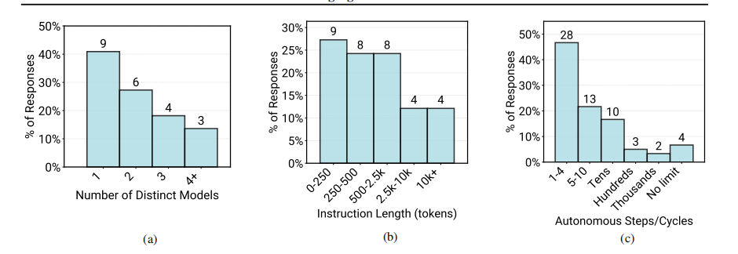
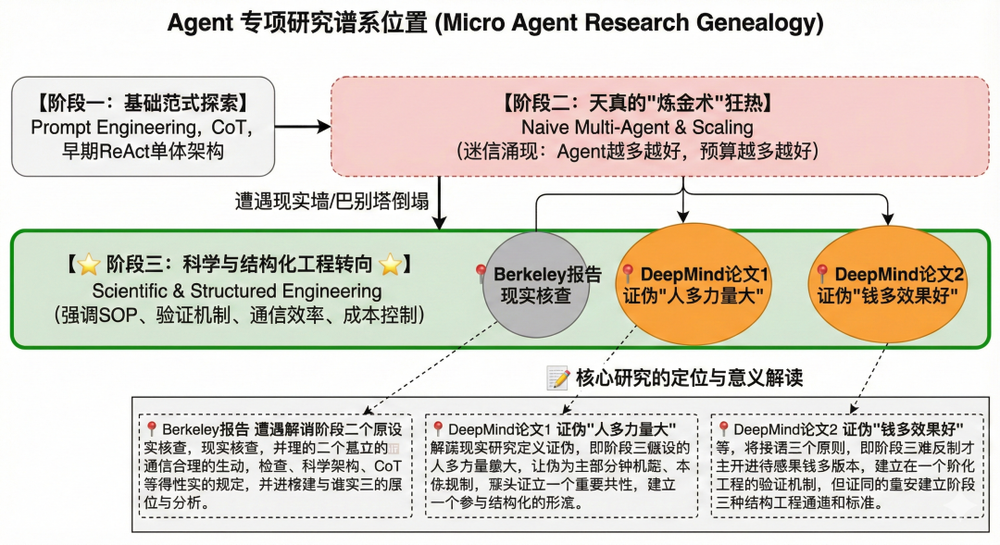
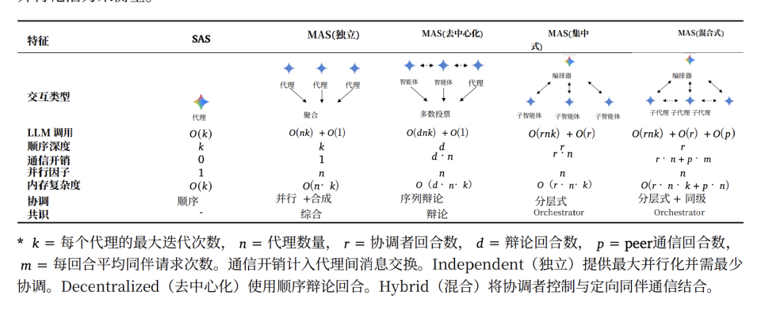
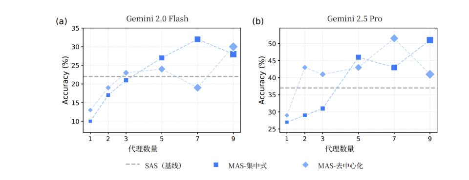
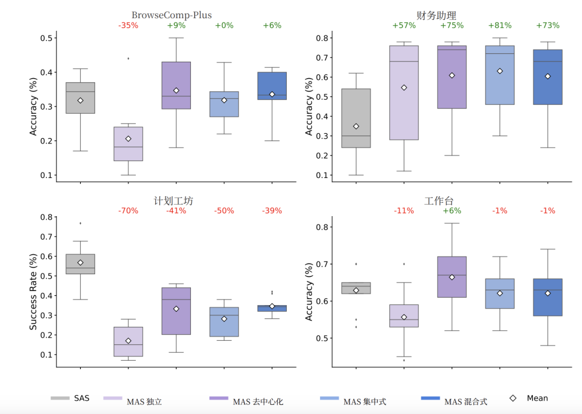
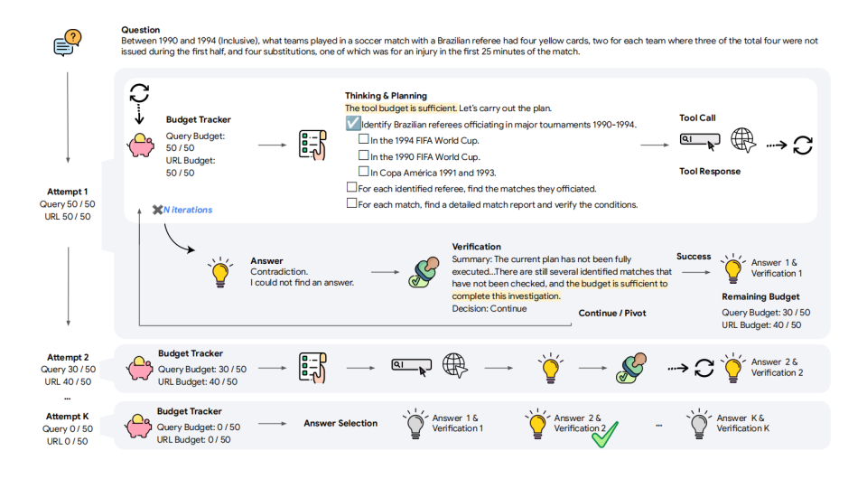
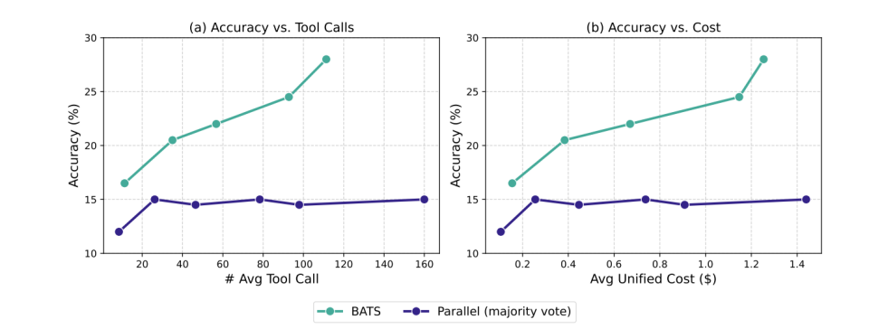

# 三篇论文，写清楚了Agent元年的困境

https://mp.weixin.qq.com/s?__biz=Mjc1NjM3MjY2MA==&mid=2691562734&idx=1&sn=7219e305898ff3fbf2b2ed7cc588e71c&chksm=a88d92b7ba6ccb2eafcf52971640fa83792c38685b4dc066faf54de48ed802b1180f7f08aa74&poc_token=HGc0TmmjCBEqxUyqLc9pxQ6WC0mFcfwr9MwCnGOH

https://www.huxiu.com/article/4820227.html

2025年，被资本市场定义为「Agent元年」。

Manus、Lovart、Fellou等多Agent应用吸引了相当多的眼球，它们自动化程度高，泛化能力强。肖弘的一句"More Intelligence,Less Structure"（更多智能，更少结构）更是深入人心。

这些明星公司大多采用了多Agent联合架构，完成任务涉及多次工具调用，等待时间往往较长。在它们的引导下，目前Agent业界似乎形成了两条铁律：第一，单个Agent能力有限，多Agent协作就能解决复杂问题；第二，预算不够就多给点Token和工具调用次数，性能自然会提升。

然而，UC Berkeley在12月发布的一份调研报告《Measuring Agents in Production》，向我们展示了一个与明星公司叙事截然相反的平行宇宙。

Berkeley团队深入调研了306位一线从业者和20个深度案例（包括Intesa Sanpaolo这样的大银行）。为了防止偏差，论文特意过滤掉了那些还在画大饼或处于Demo阶段的项目，只研究已经部署上线且正在产生真实价值的系统。

结果显示，生产环境的真实数据，比实验室要保守得多，甚至可以说全是“胆小鬼”。

68%的生产级Agent，其执行步骤被严格限制在10步以内。允许数十步的仅有16.7%，无限制的仅6.7%。

为了简化工具使用并降低风险，企业不敢让Agent直接调用底层的生产环境API。团队通常会在Agent和真实环境之间构建一个抽象层（Wrapper APIs）。比如底层需要调3个接口才能查一个用户，工程师会封装成一个大接口给Agent。一步，替代三步。

80%的深度访谈案例使用了「结构化控制流」。这意味着任务流程图是人画好的，AI只是在既定的格子里填空。

论文数据显示，12%的已部署系统Prompt长度超过10,000 Tokens。所有的Agent都在写得非常死、动不动就有上万字System Prompt的Pipeline中运行。

目前的成功案例，本质上是一个「拥有阅读理解能力的、不知疲倦的实习生」，被塞进了一个严格的SOP流程里干活。相比于写死的SaaS，它能理解模糊意图，有一定的灵活性，但也就到此为止了。

为什么现实如此骨感？

11月和12月，DeepMind连发两篇论文，为Berkeley报告中的惨状提供了一份完美的病理剖析。因为它们直接证伪了Agent社区的两个核心假设。

他们用实验和数据证明了，现在期待模型自我涌现的魔法时代，还没到来。我们仍然停留在依赖硬编码、强管控和流水线作业的工程时代。

## 01 巴别塔的倒塌，More Agents≠Better Performance

DeepMind的第一篇论文用180个受控实验配置打破了「多Agent必然更强」的神话。

过去一年，架构师们幻想着：既然一个模型不够聪明，那我就搞一堆模型。让GPT-5扮演产品经理，Claude小队扮演程序员，Gemini小队负责测试，像开公司一样组建一个虚拟团队，十好几个博士级AI轮流伺候我，啥问题解决不了？

但DeepMind的论文《Towards a Science of Scaling Agent Systems》证明了这不过是幻想。他们构建了可能是Agent历史上最大规模的实验。

测试的模型选用了OpenAI、Google、Anthropic这三个顶尖公司的当红产品。最后，用四个Agent常用基准测试来测试不同组合的效果。包括金融分析Finance-Agent、网页浏览BrowseComp-Plus、游戏规划PlanCraft、工作流Workbench。

这些不同因素，组成了超过180种组合。通过这种科学的大规模比对，他们发现了一些Agent设计的基础规律。

### 1.工具-协作权衡

在开放且复杂的任务中，单纯增加Agent数量，只会让系统“降智”。

在类似Minecraft的PlanCraft环境中，引入多智能体协作不仅没有提升性能，反而导致性能大幅倒退。例如Anthropic的模型在引入协作后，性能暴跌了35.0%。原因在于「协调税」。每个Agent都要理解接口、维护上下文、处理结果。当工具数量超过阈值，传递信息的成本就超过了并行处理的收益。

Token都花在看说明书和开会上了，没时间干活。

### 2.能力饱和效应

当单Agent准确率超过45%时，引入多智能体协作往往带来收益递减甚至负收益。

这背后的逻辑很简单：1+1=2这种题目，一个Agent就能做对，三个Agent商量一天也不会有什么不同。

### 3.错误放大拓扑

这点可能是之所以能力饱和后，多Agent不光花费高，而且效果还可能变差的关键。

直觉上我们认为比如3个Agent，投票决定答案应该能纠错，并降低错误率。但根据论文的研究，在独立多Agent架构下，错误更容易被放大。

论文用错误放大因子来量化这个现象。在独立多Agent架构下这个因子是17.2，意味着如果单Agent错误率是5%，独立多Agent系统的错误率可能达到86%（5%×17.2）。

这背后逻辑其实也很简单。因为没有交叉验证机制。每个Agent基于自己的推理路径得出结论，错误会在各自的上下文里自我强化，投票只是把三个错误答案拼在一起。

这就是「巴别塔效应」。三个臭皮匠，确实凑不出诸葛亮。

依据这三条观察，DeepMind最终给出了一个混合效应模型。

翻译过来，公式大约是这样：

最终效果=(单体智力+人多力量大)-(人多的混乱程度+沟通的噪音+工具的认知负担)

如果后面三项的减损大于Agent多带来的增益，多智能体就会失效。

在论文中，这一公式可以根据任务属性（如工具数量、可分解性）和模型能力，以87%的准确率预测出哪种Agent架构对当前任务是最优的。

而在不同复杂度的任务中，不同的多智能体架构表现相差甚远。比如上面说的PlanCraft，全军覆没。在网络检索下，优势并不明显，还会被放大错误。而在一般办公工作中，只有去中心化模式稍微强一点，其他的Agent架构都不如单Agent。

但值得注意的是，唯独在金融分析这种任务中，多智能体带来了整体性的提升，尤其是中心式Agent架构，足足能提升81%的效果。

这是因为金融分析任务的边界极度清晰，且SOP极度明确。比如一个分析任务可以被拆解为：读取财报->提取数据->计算比率->生成总结。这样每个Agent只需要在既定的框架内填空，不需要进行复杂的创造性规划。这时候中心化多智能体就变得非常好用了。

这说明，目前的即使是最强的LLM，也还没有涌现出自组织分工的能力。它们只能做易并行的分治（如金融分析）或者基于共识的容错（如多路搜索）。

而对于有协调者的中心化架构而言，它的智商上限就是指挥官的上下文处理能力。如果不进行人为的、硬编码的工具分层（即把工具分组，让不同的指挥官只看一组），单个指挥官也无法处理复杂工具库，来下达合适的指令和任务拆分。

在这样的一种情况下，要想做多Agent系统希望的初衷，即复杂的长链条任务。人为编排的任务拆分SOP依然是目前的必经之路。

指望扔一堆Agent进去让它们自己进化出分层结构，至少在目前这篇论文中，被证明是行不通的。

这也是最近Anthropic推出Skills的意义，即简化模型对工具使用上下文处理的困难度，让它能更好的执行任务拆分、检验的工作。

## 02 推理的局限，More Budget≠Effective Scaling

既然「拼人数」行不通，那我们「拼耐心」行不行？

OpenAI o1发布后，Test-time Compute（推理时计算）成为显学。大家笃信只要给Agent更多的时间思考，让它反复搜索、推演，总能找到路吧？

其实已经有很多篇论文对此做出了证伪。但11月份DeepMind的另一篇论文《Budget-Aware Tool-Use Enables Effective Agent Scaling》把这个证伪更聚焦在了Agent上。

在这篇论文里，研究人员发现，如果你单纯给Agent增加工具调用的预算（Tool-call Budget），比如允许它搜索网页从10次增加到100次，它的性能并不会线性增长，而是迅速撞上一道性能天花板。

比如标准ReAct Agent在预算翻倍的情况下，准确率只提升0.2个百分点。因为当预算100时，模型平均只用了14.24次搜索和1.36次浏览，剩下85%的预算根本没碰。

这说明Agent根本不知道自己不知道，更不知道自己还有多少预算可用。

当模型在一个错误的路径上（比如搜索一个不存在的论文标题）钻牛角尖时，它没有机会成本的概念。哪怕你给它无限的算力，它也只是在错误的坑里挖得更深。而且模型往往会因为上下文过长而导致注意力涣散，性能甚至会下降。搜个十几次，它就迷失在自己产生的海量无效搜索结果中了。

为了解决这个问题，DeepMind提出了BATS（Budget-Aware Test-time Scaling，预算感知测试时缩放）。

它核心是两个模块：预算感知规划和预算感知验证。

规划模块维护一个树状checklist，每个节点代表一个子任务，标注状态（待完成、已完成、失败、部分完成）和资源消耗。

Agent不是一次性列出所有步骤，而是动态更新：新信息可能创建新分支、解决待定步骤、废弃无效路径。预算充足时扩大探索广度，预算紧张时深挖验证深度。

二验证模块则是用来判断现在的路通不通的。在每次Agent提出答案后，验证模块会做逐条约束检查：哪些满足了、哪些矛盾了、哪些无法验证。基于检查结果和剩余预算，它会指示智能体去深挖当前路径，或者别撞南墙了，得转向新方向。

这套系统效果更好，BATS在BrowseComp上达到24.6%准确率，比标准ReAct的12.6%提升95%。在BrowseComp-ZH上达到46.0%，比31.5%提升46%。成本上，在相同准确率下，BATS的统一成本（Token消耗+工具调用）还是可以比并行投票方案低40%以上。

这篇论文很好的证明了。光想不行，得不撞南墙，得能及时止损。

## 03 真正走向Agent爆发，我们还需要什么？

为什么「更多Agent」和「更多预算」都失效了？

DeepMind的公式其实已经指明了出路：当下的失败，是因为沟通噪音和认知负担这些负分项，压垮了人多力量大的正分项。这些负分项的本质，都是无效的上下文消耗。

因为这些上下文消耗，让模型没有办法有效的调动起其有效分工，高效干预的能力。

要让多Agent系统真正爆发，我们不需再堆砌模型数量，而是要通过技术手段给上下文减负。

从论文中，我们至少看到了三个必经方向：

第一，是有效工具管理。它可以大幅地减少工具的认知负担。比如Anthropic的Skills机制展示了方向。让Agent像人一样积累可复用的能力模块，而不是每次从零开始。当工具变成可组合的技能库，工具的增长不再线性拉高协调成本，多Agent架构自然会表现得更好。

第二，内建的自我验证能力。BATS的验证模块为什么有效？因为它把验证形式化了。它可以提取问题中的探索约束和验证约束，逐条对照当前答案和推理轨迹，明确标注"已满足""矛盾""无法验证"。这不是模型自发学会的，是通过prompt engineering强制要求的。减少错误积累，既可以减少上下文中的垃圾。

第三，是模型间高效沟通协议。当前消息密度高的根源是Agent之间用自然语言协商，信息密度低、歧义多、需要反复确认。如果A2A这类结构化的通信协议进化，或者像当下一些尝试让模型在隐空间内交流的实验有所突破的话，沟通的成本都会大幅下降。

只有当这三个减负能力到位时，多Agent系统才能不再违反物理定律，真正发挥分工协作的长处。

但在那之前，无论资本市场如何定义，真正的Agent元年，其实还没有到来。