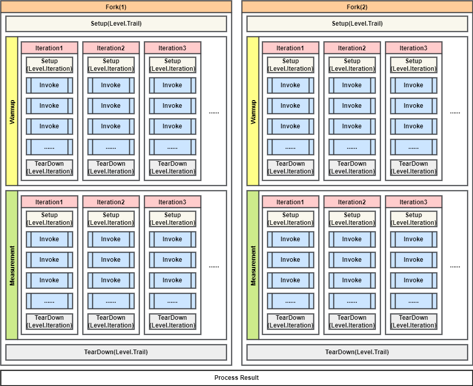

# Java 性能优化神器 JMH 从入门到精通

[TOC]

# 背景

你在写 Java 高性能程序时有没有这样的场景：

* 纠结使用 ArrayList 还是 LinkedList 哪个更快？
* 进行运算时，怎么提高效率？使用 int 还是 long？
* 读写文件时，使用 FileChannel 还是 MappedByteBuffer 更快？
* 使用锁还是 synchronized？
* 使用 AtomicLong 还是 LongAdder 更快？
* ……

特别是在写性能要求高的程序时，这些问题会更频繁地出现。有时上网查询可以找到答案，但是当遇到更复杂、独特的场景时可能就需要自己进行性能压测。

自己写一个测试方法或者 `Main` 函数固然也可以，但是有没有更【专业】的工具？我们的神器 JMH 闪亮登场。

JMH 是 Java Microbenchmark Harness 的缩写，官方介绍如下：

>JMH 是 OpenJDK 提供的 JVM 基准测试工具，用于测试 Java 和其他跑在 JVM 上语言程序的性能。

## JMH 的意义

当对一个程序的一小部分代码或者一个函数进行基准测试时，JVM 或底层硬件可能对这部分测试代码进行许多优化，但当这部分代码作为较大程序的一部分时可能无法应用这些优化。

自己实现基准测试代码时，编写的测试代码可能有缺陷。比如缺乏预热的步骤。

使用 JMH，你可以使用它提供的一系列注解轻松地编写基准测试代码。并且它通常会阻止 JVM 和硬件在基准测试时执行优化。此外它还能提供简单明了的基准测试结果输出，使用一些工具可以对该结果进行可视化。

## JMH 如何工作？

应用 JMH 注解的代码在编译之后会被编译成多个执行类以进行基准测试结果输出。



JMH 按照如上所示的流程进行基准测试。
* Fork 为一个新的进程，如果设置用多个进程执行，则各个线程串行执行。
* 每个线程中先执行预热（Warmup），然后再执行测试（Measurement）。在预热和测试执行过程中，每一轮测试称为一个迭代（Iteration），一个迭代也是测试数据统计的最小单元。在 `@Warmup` 和 `@Measurement` 注解中可以指定执行的迭代次数和每次迭代的执行时常。
* 每个迭代中会根据基准测试的模式（`@BenchmarkMode`）来调用（Invoke）测试方法，可能一次也可能多次，并计算该测试模式所关注的指标。
* 可以看到在每次测试前后、每次迭代前后、甚至每次调用方法前后都可以用 `@Setup` 和 `@TearDown` 注解来设置启动和停止的方法。


# 快速开始

## 安装插件

使用 JMH 前最好先安装一下配套的 idea 插件。


它可以帮助解析 JMH 的注解。

## 使用 Maven archtype

官方推荐的使用方法是使用 Maven archtype 构建项目，这样可以自动生成基准测试代码，打包之后也自带可以运行基准测试代码的 `benchmark.jar` 包。由于可能需要在 Linux 上测试，所以这个 jar 包十分有用。

运行如下代码使用 maven archtype 构建项目。

```shell
mvn archetype:generate \
  -DinteractiveMode=false \
  -DarchetypeGroupId=org.openjdk.jmh \
  -DarchetypeArtifactId=jmh-java-benchmark-archetype \
  -DgroupId=org.sample \
  -DartifactId=test \
  -Dversion=1.0
```

如果使用 idea，可以使用 idea 添加 Archtype 后创建。


## 引入依赖

JMH 在 JDK9 之后的版本已经原生支持。在 JDK9 之前的版本需要引入依赖。当前最新的版本为 1.35。如果已经使用 Archtype 方式构建项目，那么无需额外引入依赖。

```xml
<dependency>
    <groupId>org.openjdk.jmh</groupId>
    <artifactId>jmh-core</artifactId>
    <version>1.35</version>
</dependency>
<dependency>
    <groupId>org.openjdk.jmh</groupId>
    <artifactId>jmh-generator-annprocess</artifactId>
    <version>1.35</version>
</dependency>
```

## 编写测试代码

使用 Archtype 构建的项目已经写好了 `MyBenchmark` 类，可以直接运行空测试函数。

我们编写代码来测试一下 `ArrayList` 和 `LinkedList` 添加数据的性能。假设需要测试分别向两种列表中添加 1000w 数据。

```java
// 使用一个进程来运行测试，如果大于 1，多进程串行执行
@Fork(1)
// 类变量的作用域，这里指 linkedList 和 arrayList 在同一个测试类中共享
@State(Scope.Benchmark)
// 预热执行 5 次，每次 1 秒
@Warmup(iterations = 5, time = 1)
// 测试执行 5 次，每次 1 秒次
@Measurement(iterations = 5, time = 1)
// 测试模式为计算测试方法的吞吐量（每秒执行次数）
@BenchmarkMode(Mode.Throughput)
// 用例计时和输出的时间单位
@OutputTimeUnit(TimeUnit.MILLISECONDS)
public class MyBenchmark {

    private LinkedList<Integer> linkedList;
    private ArrayList<Integer> arrayList;

    // 初始化方法，在每次调用测试方法之前执行，类似 JUnit
    // Level 表示该方法运行的时机，Iteration 表示每次测试都会执行（包括预热）
    @Setup(Level.Iteration)
    public void setup() {
        linkedList = new LinkedList<>();
        arrayList = new ArrayList<>();
    }

    // 测试方法，类似 JUnit @Test。标注了 @Benchmark 的方法会被进行基准测试
    @Benchmark
    public void testArrayList() {
        arrayList.add(1);
    }

    @Benchmark
    public void testLinkedList() {
        linkedList.add(1);
    }
}
```

## 运行测试

在 idea 安装插件的情况下可以直接运行测试。


另一种方式，可以通过 Archtype 的 benchmark.jar 来运行测试。

```shell
mvn clean verify
```

```shell
java -jar target/benchmarks.jar
```

## 查看结果

```java
# JMH version: 1.35
# Blackhole mode: full + dont-inline hint (auto-detected, use -Djmh.blackhole.autoDetect=false to disable)
# Warmup: 5 iterations, 1 s each                      // 预热 5 次，每次 1 秒
# Measurement: 5 iterations, 1 s each                 // 测试 5 次，每次 1 秒
# Timeout: 10 min per iteration                       // 每次执行测试方法的超时时间为 10 分钟
# Threads: 1 thread, will synchronize iterations      // 单线程执行
# Benchmark mode: Throughput, ops/time                // 测试模式：吞吐量，统计每秒操作数
# Benchmark: org.example.MyBenchmark.testArrayList    // 本次测试的测试方法

# Run progress: 0.00% complete, ETA 00:00:20
# Fork: 1 of 1                                        // 第一个进程执行测试
# Warmup Iteration   1: 141579.663 ops/ms             // 每次预热耗时
# Warmup Iteration   2: 13048.155 ops/ms
# Warmup Iteration   3: 126507.754 ops/ms
# Warmup Iteration   4: 127890.530 ops/ms
# Warmup Iteration   5: 152379.871 ops/ms
Iteration   1: 149509.372 ops/ms                      // 每次测试执行耗时
Iteration   2: 147695.938 ops/ms
Iteration   3: 100544.988 ops/ms
Iteration   4: 169084.449 ops/ms
Iteration   5: 177057.200 ops/ms

Result "org.example.MyBenchmark.testArrayList":
  148778.389 ±(99.9%) 114555.755 ops/ms [Average]
  (min, avg, max) = (100544.988, 148778.389, 177057.200), stdev = 29749.766
  CI (99.9%): [34222.635, 263334.144] (assumes normal distribution)

# ...
# Benchmark: org.example.MyBenchmark.testLinkedList

# Run progress: 50.00% complete, ETA 00:00:13
# Fork: 1 of 1
# Warmup Iteration   1: 3997.950 ops/ms
# Warmup Iteration   2: 9656.378 ops/ms
# Warmup Iteration   3: 9767.753 ops/ms
# Warmup Iteration   4: 8815.672 ops/ms
# Warmup Iteration   5: 47451.551 ops/ms
Iteration   1: 21131.024 ops/ms
Iteration   2: 9101.728 ops/ms
Iteration   3: 28116.765 ops/ms
Iteration   4: 8994.693 ops/ms
Iteration   5: 28290.489 ops/ms


Result "org.example.MyBenchmark.testLinkedList":
  19126.940 ±(99.9%) 37132.831 ops/ms [Average]
  (min, avg, max) = (8994.693, 19126.940, 28290.489), stdev = 9643.278
  CI (99.9%): [≈ 0, 56259.771] (assumes normal distribution)

# Run complete. Total time: 00:00:40                 // 所有测试执行完毕，耗时

// 测试结果，Mode 表示测试模式，thrpt 表示模式为 Throughput
// Score 表示平均耗时，Error 表示误差
Benchmark                    Mode  Cnt       Score        Error   Units
MyBenchmark.testArrayList   thrpt    5  148778.389 ± 114555.755  ops/ms
MyBenchmark.testLinkedList  thrpt    5   19126.940 ±  37132.831  ops/ms
```

# 注释详解

这个图片可以帮助快速查阅 JMH 各个注解的含义和用法。


具体的解析可以看 [关键注解](https://juejin.cn/post/7031008727645831176#heading-1)

# 高级用法

详见 [基准测试神器JMH —— 详解36个官方例子](https://juejin.cn/post/6844904147674726407)

# 将结果图形化

# 参考资料

* [JMH - Java 微基准测试工具（自助性能测试）@Benchmark](https://blog.csdn.net/yangbindxj/article/details/122899328)
* [顶级Java才懂的，基准测试JMH！](https://juejin.cn/post/7031008727645831176)
* [JUC学习笔记 - 08JMH入门](https://juejin.cn/post/7069967034636845092)
* [基准测试神器JMH —— 详解36个官方例子](https://juejin.cn/post/6844904147674726407)
* [性能调优必备利器之 JMH](https://www.cnblogs.com/wupeixuan/p/13091381.html)
* [JMH - Java Microbenchmark Harness](https://jenkov.com/tutorials/java-performance/jmh.html)
* [JMH Cheatsheet](http://leogomes.github.io/assets/JMH_cheatsheet.pdf)
* [Understanding Java Microbenchmark Harness or JMH Tool](https://medium.com/javarevisited/understanding-java-microbenchmark-harness-or-jmh-tool-5b9b90ccbe8d)