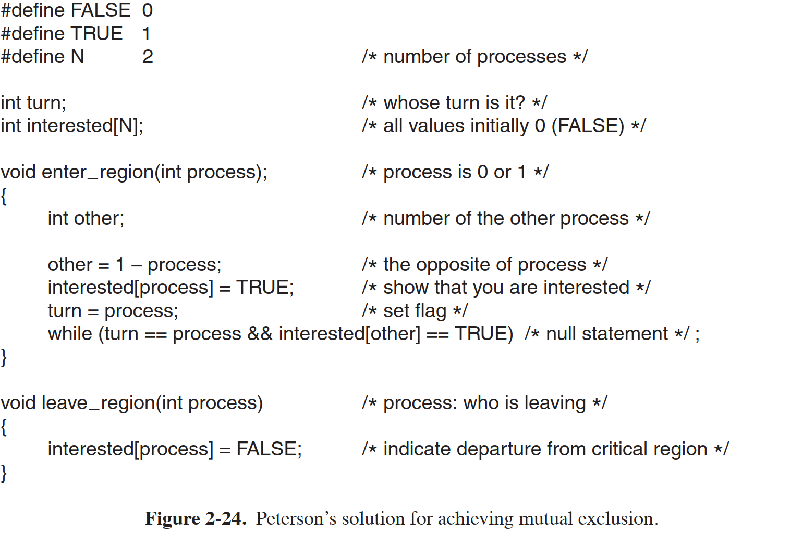

# 现代操作系统 第二章 进程与线程

## 1. 进程

### 1.1 进程模型

进程（顺序进程）：一个正在执行程序的实例，包括程序计数器、寄存器和变量的当前值。在传统操作系统中，每个进程有一个地址空间和一个控制线程。

### 1.2 进程的创建

4 种导致进程创建的主要事件：

1. 系统初始化
2. 正在运行的程序执行了创建进程的系统调用
3. 用户请求创建一个新进程
4. 一个批处理作业的初始化

守护进程（daemon）：停留在后台进行处理的进程。

* UNIX 系统中，只有一个系统调用可以用来创建新进程：fork。这个系统调用会创建一个与调用进程相同的副本。调用了 fork 后，父进程和子进程拥有相同的内存映像、同样的环境字符串和同样的打开文件。
  * 通常，子进程接着执行 execve 或一个类似的系统调用，以修改内存影响并运行一个新的程序。
* Windows 中，一个 Win32 函数 CreateProcess 既处理进程的创建，也负责把正确的程序装入新的进程。

### 1.3 进程的终止

进程终止通常由下列条件引起：

1. 正常退出（自愿的）

   * UNIX 系统调用：exit

   * Windows 系统调用：ExitProcess

2. 出错退出（自愿的）

3. 严重错误（非自愿）

   * UNIX 中，进程可以通知操作系统，它希望自行处理某些类型的错误，在这类错误中，进程会收到信号（被终端），而不是在这类错误出现时终止。

4. 被其他进程杀死（非自愿）

   * UNIX：kill
   * Windows：TerminateProcess

### 1.4 进程的层次结构

UNIX 中进程和它的所有子进程以及后裔共同组成一个**进程组**。用户发出一个信号时，该信号被送给当前与信号源相关的进程组中的所有成员。每个进程可以分别捕获该信号、忽略该信号或采取默认的动作。

Windows 中没有进程层次的概念，所有进程都是地位相同的。在创建进程时，父进程得到一个句柄，可以用来控制子进程。

### 1.5 进程的状态

进程的三种状态：

1. 运行态（Running）：该时刻进程实际占用 CPU
2. 就绪态（Ready）：可运行，但因为其他进程正在运行而暂时停止（没有占用 CPU）
3. 阻塞态（Blocked）：除非某种外部事件发生，否则进程不能运行

状态间转换：

1. 操作系统发现进程不能继续运行下去。
   * 某些进程可以执行一个 pause 系统调用进入阻塞状态。
   * UNIX 中，当进程从管道或设备文件读取数据时，如果没有有效的输入存在，进程被自动阻塞。
2. 由进程调度程序引起（操作系统的一部分）。系统认为一个运行进程占用 CPU 时间过长，决定让其他进程使用 CPU 时间。
3. 由进程调度程序引起。系统已经让所有其他进程享有了它们应有的公平待遇而重新轮到第一个进程再次占用 CPU。
4. 进程等待的一个外部事件发生时（如一些输入到达）。此时如果没有其他进程运行，进程立即进入运行态。

### 1.6 进程的实现

为实现进程模型，操作系统维护着**进程表**，每个进程占用一个**进程表项**，以保证进程可以从终端中恢复。

单个 CPU 上如何维持多个顺序进程执行：依靠**中断**。每次中断后被中断的进程都返回到与中断发生前完全相同的状态。

中断向量：靠近内存底部固定区域的位置，包含中断服务程序的入口地址。

中断的硬件操作：

1. 中断硬件将程序计数器、程序状态字、一个或多个寄存器压入堆栈
2. 计算机跳转到中断向量所指示的地址

软件，中断服务例程操作：

1. 汇编语言过程将寄存器保存在进程表项中
2. 汇编语言过程设置新的堆栈
3. C 中断服务历程运行（典型地地和缓冲输入）
4. 调度程序决定下一个将运行的进程
5. C 过程返回至汇编代码
6. 汇编语言过程开始运行新的当前进程

### 1.7 多道程序设计模型

纵坐标是 CPU 利用率，或者可以换算成 CPU 的浪费率。横坐标是程序个数。如一个 80% 时间花在等待 I/O 的程序，为使 CPU 浪费低于 10%，至少要有 10 个进程同时在内存中。

## 2. 线程

并行实体，拥有共享同一个地址空间和所有可用数据的能力。

### 2.1 线程的使用

线程产生的必要性

1. 应用中同时发生多种活动，通过将这些应用程序分解成可以准并行的多个顺序线程，程序设计模型会变得更简单。
2. 线程比进程更轻量级，比进程更容易创建和撤销。
3. 在多 CPU 系统中，多线程能实现真正并行。

### 2.2 经典的线程模型

| 每个进程中的内容   | 每个线程中的内容 |
| ------------------ | ---------------- |
| 地址空间           | 程序计数器       |
| 全局变量           | 寄存器           |
| 打开文件           | 堆栈             |
| 子进程             | 状态             |
| 即将发生的定时器   |                  |
| 信号与信号处理程序 |                  |
| 账户信息           |                  |

线程状态：

* 运行：拥有 CPU 并且是活跃的
* 阻塞：正在等待某个释放它的事件
* 就绪：可以被调度运行
* 终止

每个线程都有自己的堆栈，其中有一帧是供各个被调用但是还没有从中返回的过程使用。该栈帧中存放了相应过程的**局部变量**以及过程调用完成之后使用的**返回地址**。

* thread_create：创建线程，返回线程标识符
* thread_exit：退出线程，线程消失
* thread_join：等待一个线程退出
* thread_yield：允许线程自动放弃 CPU 从而让另一个线程运行。（线程无法利用时钟中断强制让出 CPU。）

### 2.3 POSIX 线程

为实现可移植的线程程序而定义的线程标准，大部分 UNIX 系统都支持。它定义的线程包胶 **pthread**。

### 2.4 在用户空间中实现线程

可以在用户空间或在内核中实现 pthread。

整个线程包放**用户空间**中。每个进程要有**线程表**来跟踪进程中的线程。

优点

1. **创建和销毁速度快**：
   用户级线程的创建、销毁和切换不需要操作系统内核的干预，因此这些操作的开销较小，速度较快。
2. **上下文切换开销小**：
   用户级线程的上下文切换仅涉及用户空间的状态保存和恢复，不涉及内核态的切换，因此开销较低。
3. **可定制性强**：
   应用程序可以根据自身需求实现特定的<u>调度算法</u>，灵活度高。用户级线程库可以提供多种调度策略以满足不同应用的需求。
4. **跨平台性**：
   用户级线程库可以在<u>不支持内核线程的操作系统上实现</u>，从而提高了应用程序的可移植性。

问题

1. **无法利用多处理器**：
   
   用户级线程库无法直接利用多处理器的并行处理能力，因为内核无法感知和调度这些线程到多个处理器上运行。
2. **阻塞问题**：
   
   如果一个用户级线程在执行阻塞操作（如I/O操作），整个进程会被阻塞，所有用户级线程都会暂停，直到阻塞操作完成。这是因为<u>用户级线程库无法知道线程的阻塞状态，无法进行合理的调度</u>。
3. **缺乏内核支持的调度**：
   
   用户级线程的调度完全由用户级线程库管理，无法利用操作系统内核提供的高级调度功能，如优先级调度等。
4. **复杂的信号处理**：
   
   由于内核不直接管理用户级线程，信号处理变得复杂。信号通常是针对进程的，如何在多个用户级线程间分配和处理信号需要额外的机制和代码。

### 2.5 在内核中实现线程

内核中有记录系统中所有线程的线程表，保存了每个线程的寄存器、状态和其他信息。

回收线程时标记为不可用，创建时重新启动某个旧线程。

优点

1. **多处理器利用**：
   内核级线程可以被操作系统内核调度到多个处理器上运行，从而充分利用多核处理器的并行处理能力，提高系统的整体性能和吞吐量。
2. **独立的阻塞处理**：
   内核级线程在执行阻塞操作（如I/O操作）时，只会阻塞当前的线程，不会影响同一进程中的其他线程。内核可以调度其他线程继续执行，提高系统的响应能力。
3. **优先级调度**：
   内核可以根据线程的优先级、运行状态和其他因素，进行复杂的调度决策，确保系统的公平性和高效性。
4. **系统调用支持**：
   内核级线程可以直接使用操作系统的系统调用，进行各种底层操作，如文件操作、网络通信等。这使得线程能够充分利用操作系统提供的各种服务。
5. **安全性和稳定性**：
   由于内核直接管理线程，能够更好地监控和控制线程的行为，提供更高的安全性和稳定性。

问题

1. **创建和销毁开销大**：
   内核级线程的创建和销毁需要操作系统内核的介入，涉及内核态和用户态的切换，开销较大，速度较慢。
2. **上下文切换开销大**：
   内核级线程的上下文切换涉及保存和恢复大量的内核态信息，包括寄存器、内核堆栈等，开销比用户级线程大。
3. **资源消耗高**：
   内核级线程需要操作系统内核为每个线程分配数据结构（如线程控制块），以及内核态的堆栈空间，消耗更多的系统资源。
4. **缺乏灵活性**：
   内核级线程的调度和管理由操作系统内核统一控制，应用程序无法根据自身需求实现特定的调度算法，灵活性较低。

### 2.6 混合实现

使用内核级线程，将用户级线程与某些或全部内核线程**多路复用**起来。

### 2.7 调度程序激活机制

调度程序激活：保持内核级线程优良特性的前提下改进其速度。

模拟内核线程的功能，但是为线程包提供通常在用户空间中才能实现的更好的性能和更大的灵活性。

### 2.8 弹出式线程

一个消息的到达导致系统创建一个处理该消息的**弹出式线程**。

### 2.9 使单线程代码多线程化

## 3. 进程间通信

1. 一个进程如何把信息传递给另一个线程
2. 确保两个或更多的进程在关键活动中不会出现交叉（竞争）
3. 程序执行顺序

### 3.1 竞争条件

**竞争条件**：两个或多个进程读写某些<u>共享数据</u>，而最后的结果取决于进程运行的精确时序。

### 3.2 临界区

避免共享<u>竞争条件</u>引发的错误，需要**互斥**：以某种手段确保<u>当一个进程在使用一个共享变量或文件时，其他进程不能做同样的操作</u>。

为实现**互斥**而选择适当的**原语**是任何操作系统的主要设计内容之一。如果能使两个进程不可能同时处于**临界区**（对<u>共享内存进行访问</u>的<u>程序片段</u>），就能避免**竞争条件**。

好的解决方案要具备的条件：

1. 任何两个进程不能同时处于其临界区
2. 不应对 CPU 的速度和数量做任何假设
3. 临界区外运行的进程不得阻塞其他进程
4. 不得使进程无限期等待进入临界区

期望的进程行为如下：

### 3.3 忙等待的互斥

本节介绍几种使用忙等待的方法实现互斥的方案，忙等待即进程进入临界区时<u>先检查是否允许进入，若不允许，则进程将原地等待，直到允许为止</u>。

#### 3.3.1 屏蔽中断

CPU 只有发生始终中断或娶她中断时才会进行进程切换，最简单的方法使使每个进程在刚刚进入临界区后立即屏蔽所有中断，并在就要离开之前再打开中断。

但是把屏蔽中断的权利交给用户进程是不明智的，所以屏蔽中断对于操作系统本身而言是一项很有用的技术，但队医用户进程则不是一种合适的通用互斥机制。而且，在一个多核系统中，屏蔽一个 CPU 的中断不会阻止其他 CPU 干预第一个 CPU 所做的操作。

#### 3.3.2 锁变量

设置一个共享变量，0 表示临界区内没有进程，1 表示已经有进程进入临界区。

初始值为 0，当一个进程项进入其临界区时，先测试这把锁。如果该锁的值为 0，则该进程将其设置为 1；若锁的值已经为 1，则该进程将等待，直到其值变为 0。

#### 3.3.3 严格轮换法

#### 3.3.4 Peterson 解法

#### 3.3.5 TSL 指令

### 3.4 睡眠与唤醒

忙等待会浪费 CPU 时间，还会有优先级反转问题。

一些通信原语能够在无法进入临界区时阻塞，而不是忙等待。

* sleep：将调用进程阻塞的系统调用，即被挂起，直到另外一个进程将其唤醒。
* wakeup：唤醒一个进程。

#### 生产者-消费者问题（有界缓冲区问题）

两个进程共享一个公共的固定大小的缓冲区，其中一个是生产者，将信息放入缓冲区；另一个是消费者，从缓冲区取出信息。

可能出现竞争条件，因为对 count 访问未加限制，问题的实质是发送给一个尚未睡眠的进程的 wakeup 信号丢失了。

### 3.5 信号量

使用一个整型变量来累计唤醒次数，供以后使用，称为信号量。它的取值可以为 0 或正值。

### 3.6 互斥量

### 3.7 管程

