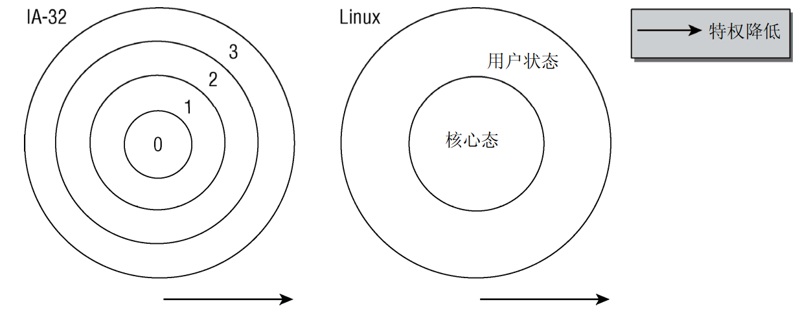
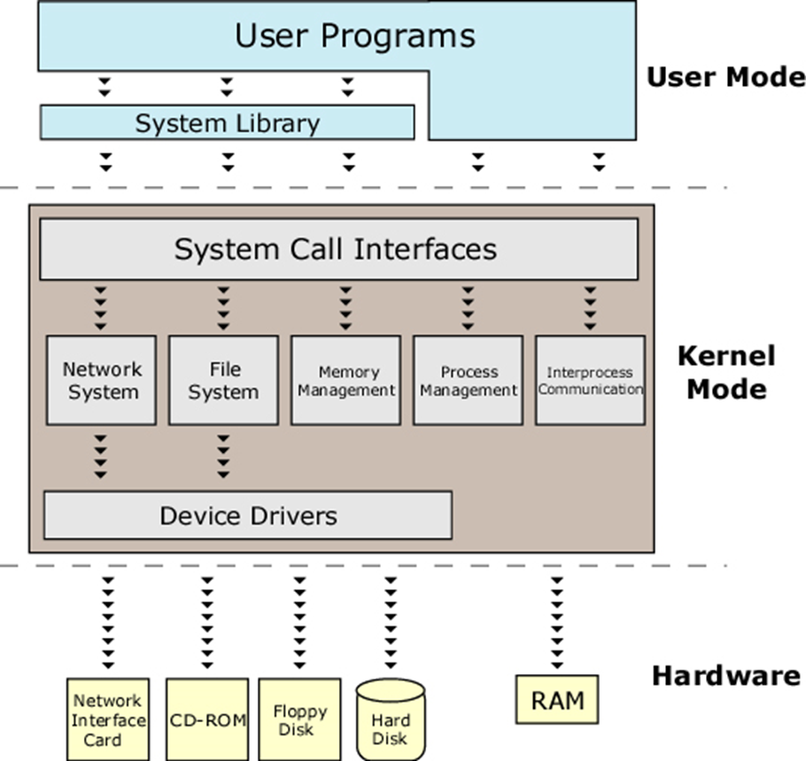
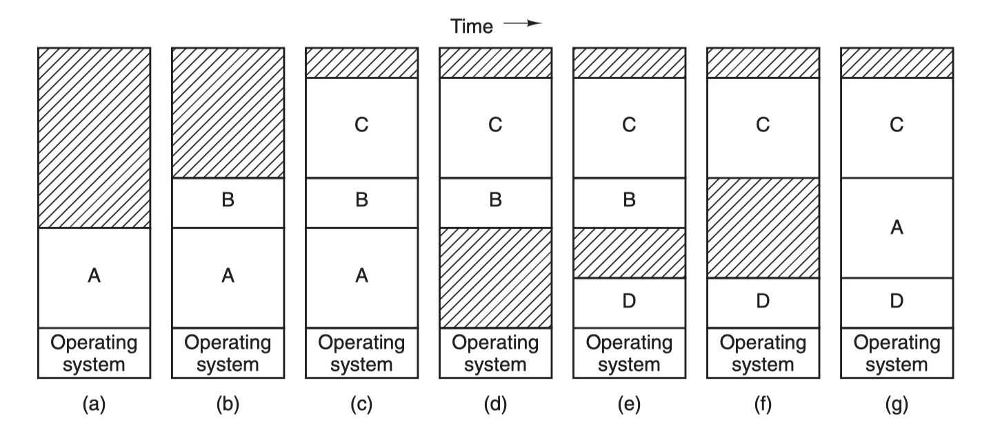
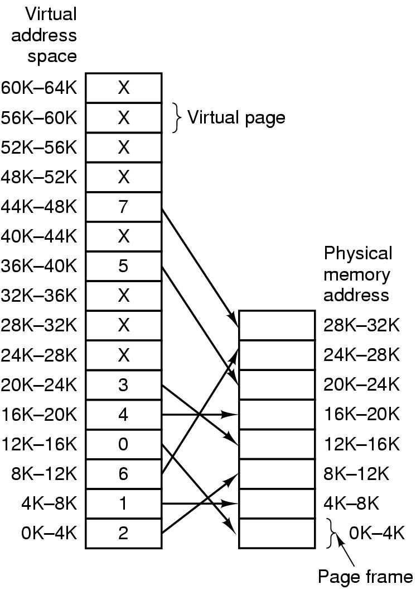
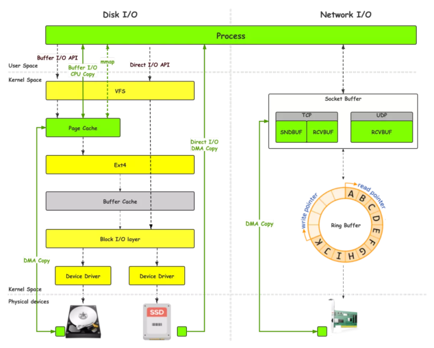
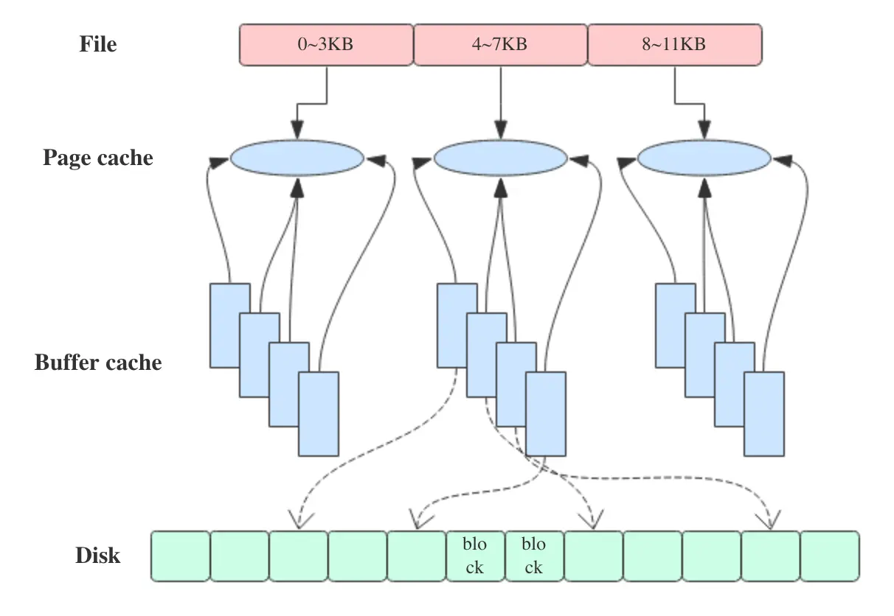
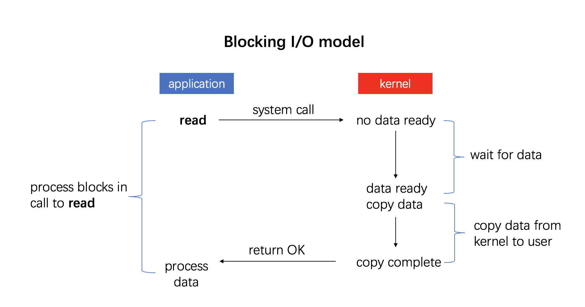
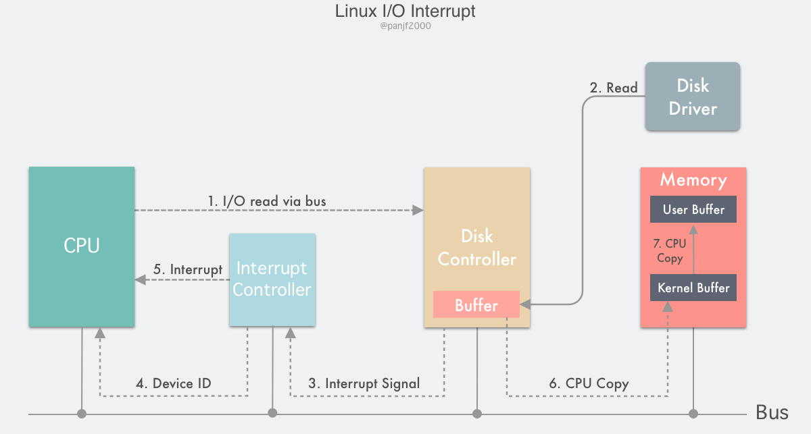
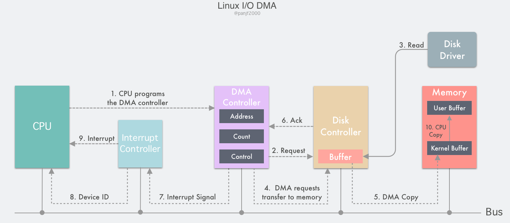

# 零拷贝

## 1. 背景

在接触中间件（尤其是消息队列）的过程中，经常看到如 Kafka、RocketMQ 等中间件使用零拷贝技术大大提升消息读写性能。零拷贝到底是什么？

## 2. 前置知识

### 2.1 内核空间与用户空间

零拷贝中的拷贝，说的其实是数据在操作系统内核空间和用户空间之间的拷贝。用户态的程序，访问不了内核空间的数据，所以就需要由内核态的进程把数据拷贝到用户态。

#### 2.1.1 虚拟地址空间

要理解内核空间和用户空间，首先要理解**虚拟地址空间**的概念。

操作系统使用虚拟内存技术管理内存，每个进程在运行时，从进程自身角度来看，在地址空间中就只有它自己一个进程，无需关注也无法感知其他进程。此外，使用虚拟内存技术下，地址空间的最大长度也和实际的物理内存无关，与系统位数和架构有关。所以也被称为**虚拟地址空间**。

由于内存区域通过指针寻址，因此 CPU 字长决定了所能管理的地址空间的最大长度。对 32 位系统来说，是 2^32B=4GiB，对 64 位处理器，可以管理 2^64B。

#### 2.1.2 内核空间和用户空间的划分

操作系统内核管理了几乎所有的硬件设备，为了防止用户程序破坏内核的运行、防止系统资源被过多的消耗，并且方便内存的管理，Linux 又将虚拟地址空间分为两个部分，分别称为**内核空间**和**用户空间**。

系统中每个用户进程都有自己的虚拟地址范围，从 0 到 `TASK_SIZE`，在用户空间之上的区域（从 `TASK_SIZE` 到 2^32 或 2^64）留给内核，用户进程无法访问。

`TASK_SIZE` 是一个常数，例如，在 32 位系统中它在 3GiB 处划分，因此每个进程的虚拟地址空间是 3GiB，内核空间有 1GiB 可用。

在 64 位计算机中，用户空间通常可以达到 128TB（2^47），内核空间通常可以达到数 TB。这与处理器的架构相关。

#### 2.1.3 特权级别、内核态和用户态

现代 CPU 都提供了几种特权级别，每个特权级别都有各种限制，进程可以驻留在某一级别，用这种方式来实现权限的隔离。Intel 的 x86 CPU 提供了 4 个特权级别，数字越小特权越高。Linux 只使用两种状态，内核态和用户态。

简而言之，用户态的进程运行在用户空间，禁止访问内核空间；内核态的进程运行在内核空间，没有访问限制。

用户态的进程需要执行一些内核态才能进行的操作时，需要切换到内核态运行。用户态进程切换到内核态的方法有：系统调用、异常和中断。

* **系统调用**：用户进程主动发起的操作。用户态进程发起系统调用主动要求切换到内核态，陷入内核之后，由操作系统来操作系统资源，完成之后再返回到进程。
* **异常**：被动的操作，且用户进程无法预测其发生的时机。当用户进程在运行期间发生了异常（比如某条指令出了问题），这时会触发由当前运行进程切换到处理此异常的内核相关进程中，也即是切换到了内核态。异常包括程序运算引起的各种错误如除 0、缓冲区溢出、缺页等。
* **中断**：当外围设备完成用户请求的操作后，会向 CPU 发出相应的中断信号，这时 CPU 会暂停执行下一条即将要执行的指令而转到与中断信号对应的处理程序去执行，如果前面执行的指令是用户态下的程序，那么转换的过程自然就会是从用户态到内核态的切换。中断包括 I/O 中断、外部信号中断、各种定时器引起的时钟中断等。中断和异常类似，都是通过中断向量表来找到相应的处理程序进行处理。区别在于，中断来自处理器外部，不是由任何一条专门的指令造成，而异常是执行当前指令的结果。

---

有了用户空间和内核空间的划分后，Linux 内部层级结构可以分为三部分，从最底层到最上层依次是硬件、内核空间和用户空间，如下图所示：

### 2.2 内存管理和虚拟内存

操作系统内存管理中的一些关键技术也为零拷贝的实现提供了基础，除了上面说到的虚拟内存技术以外，还有分页、内存映射、DMA 等。

本节介绍计算机的内存管理技术及其演化历史，它经历了 直接访问物理内存->静态重定位->动态重定位->交换技术->虚拟内存 的演变历史。

#### 2.2.1 地址空间

上面说到的地址空间，是由直接访问物理内存演变而来的。最早的计算机没有存储抽象，每个程序都直接访问物理内存，在这种情况下用户程序容易破坏操作系统，且同时运行多个程序很困难。

于是就引入了**地址空间**的概念：它是一个进程可用于寻址的内存地址集合。每个进程都有自己的独立于其他进程的地址空间。

**动态重定位**可以实现地址空间的抽象，它的思想是把每个进程的地址空间映射到物理空间的不同部分。

它的原理是：动态保存每一个程序的起始物理内存地址和长度，然后每次访问指定的内存地址时，CPU 会在把地址发往内存总线之前自动把基址寄存器里的值加到该内存地址上，得到一个真正的物理内存地址，同时还会根据界限寄存器里的值检查该地址是否溢出，若是，则产生错误中止程序。

#### 2.2.2 交换技术

在操作系统中实现地址空间的抽象，面临物理内存不足的问题。如果把每个进程的内存都保留在物理内存中，就需要巨大的内存，交换技术旨在解决该问题。

**交换**：把进程完整调入内存运行一段时间，然后存回磁盘。空闲进程主要存储在磁盘上，不运行时不会占用内存。

#### 2.2.2 虚拟内存

软件大小增长极快，交换技术不是一个很好的解决方案，因为 SATA 磁盘峰值传输率是几百兆每秒，要好几秒才能换出或者换入一个 1GB 的程序。

虚拟内存技术是比交换更复杂高效，也是目前最新应用最广泛的存储器抽象技术。

它的基本思想是：

* 每个程序拥有自己的地址空间，该空间被分割成多块，每块称为一页（page），每页有连续的地址范围。

* 这些页被映射到物理内存，不是所有页都在内存中才能运行程序。

* 当程序引用到一部分在物理内存中的地址空间时，由硬件立刻执行必要的映射
* 当程序引用到一部分不在物理内存中的地址空间时，由操作系统负责将缺失的部分装入物理内存并重新执行失败的指令

---

虚拟内存系统中使用分页（paging）技术，程序产生的地址为<u>虚拟地址</u>，它们构成<u>虚拟地址空间</u>。读写操作访问<u>虚拟内存</u>情况下，先将虚拟地址送到<u>内存管理单元（MMU）</u>，MMU 把<u>虚拟地址</u>映射为<u>物理内存地址</u>。如下图所示

虚拟地址空间按固定大小划分成若干<u>页（page）</u>，在物理内存中对应的单元为<u>页框（page frame）</u>。内存与磁盘间的交换总是以整个<u>页</u>为单位进行。

MMU 负责将虚拟地址转换成物理地址。在实际硬件中，用一个<u>“在/不在”位（present/absent bit）</u>来记录页在物理内存中是否实际存在。如果不存在，会引发一个 CPU 的<u>缺页中断</u>。

操作系统会找到一个很少使用的页框，把它的内容写入磁盘，然后把要访问的页读到刚才回收的 页框中，最后重新执行引发中断的指令。

### 2.3 Linux I/O

I/O 指是指数据在系统内部或与外部设备之间进行传输的过程。

零拷贝技术是 I/O 操作过程中，尽量减少数据在内存中的拷贝次数。这里的 I/O 操作主要指磁盘 I/O 或是网络 I/O。我们先来了解一下磁盘 I/O。

#### 2.3.1 I/O 缓冲区

Linux 的磁盘和网络 I/O 中的数据拷贝流程可以用下图表示

在开发程序的过程当中，对于磁盘上文件的读写，常用的 Linux 系统调用是 `read(2)` 和 `write(2)`，他们是上图中的 Buffer I/O API。

所谓 Buffer I/O，指在 I/O 的过程当中使用缓冲区来增加读写效率：

* 读磁盘：内核会先检查 Page cache 里是不是已经缓存了这个数据，若是，直接从这个内存缓冲区里读取返回，若否，则穿透到磁盘去读取，然后再缓存在 Page cache 里，以备下次缓存命中。

* 写磁盘：内核直接把数据写入 Page cache，并把对应的页标记为 dirty，添加到 dirty list 里，然后就直接返回，内核会定期把 dirty list 的页缓存 flush 到磁盘，保证页缓存和磁盘的最终一致性。

##### Page cache 和 Buffer cache

早期的（2.4 以前）Linux 版本中存在两种 I/O 缓冲区。分别为 Page cache 和 Buffer cache，在图中分别为绿色和灰色。

**Buffer cache**：也叫块缓冲，是对物理磁盘上的一个磁盘块进行的缓冲，磁盘块也是磁盘的组织单位，操作系统读写的最小单位，其大小为通常为 1k。设立 Buffer cache 的目的是为在程序多次访问同一磁盘块时，减少访问时间。

**Page cache**：也叫页缓冲或文件缓冲。是由好几个磁盘块构成，大小通常为 4k，在 64 位系统上为 8k。构成的几个磁盘块在物理磁盘上不一定连续，文件的组织单位为一页，也就是一个 Page cache 大小。它是对虚拟内存页的缓存。

**Page cache用于缓存文件的页数据，Buffer cache用于缓存块设备（如磁盘）的块数据。**页是逻辑上的概念，因此 Page cache 是与文件系统同级的；块是物理上的概念，因此 Buffer cache 是与块设备驱动程序同级的。

Page cache 与 Buffer cache 的共同目的都是加速数据I/O：

* 写数据时首先写到缓存，将写入的页标记为 dirty，然后向外部存储 flush，也就是缓存写机制中的 write-back（另一种是 write-through，Linux未采用）
* 读数据时首先读取缓存，如果未命中，再去外部存储读取，并且将读取来的数据也加入缓存。操作系统总是积极地将所有空闲内存都用作 Page cache 和 Buffer cache，当内存不够用时也会用LRU等算法淘汰缓存页。

如上所述，可以得出 Page cache 和 Buffer cache 是一个事物的两种表现，Page cache 底层还是会基于 Buffer cache。

在Linux 2.4版本的内核之前，Page cache 与 Buffer cache 是完全分离的。但是，块设备大多是磁盘，磁盘上的数据又大多通过文件系统来组织，这种设计导致很多数据被缓存了两次，浪费内存。所以在2.4版本内核之后，两块缓存近似融合在了一起：如果一个文件的页加载到了 Page cache，那么同时 Buffer cache 只需要维护块指向页的指针就可以了。只有那些没有文件表示的块，或者绕过了文件系统直接操作（如dd命令）的块，才会真正放到 Buffer cache 里。因此，我们现在提起 Page cache，基本上都同时指 Page cache 和 Buffer cache两者。

#### 2.3.2 I/O 模式

Linux 提供了多种硬件（磁盘）与主存之间的数据传输机制，常见的为以下三种。

##### 2.3.2.1 程序控制 I/O

最简单的 I/O 模式，用户程序发起一个系统调用，陷入内核态，内核将系统调用翻译成一个对设备驱动程序的过程调用，接着设备驱动程序会启动 I/O 不断循环去检查该设备是否就绪。I/O 结束后，设备驱动程序会把数据送到指定地方并返回，切回用户态。

程序控制 I/O 的最大缺点是：**直到全部 I/O 完成之前，要占用 CPU 的全部时间**。

##### 2.3.2.2 中断驱动 I/O

##### 2.3.2.3 DMA I/O

#### 2.3.3 传统 I/O 读写

## 3. 零拷贝原理

## 4. Java 中零拷贝实现

## 5. 中间件中零拷贝的使用

### 5.1 RocketMQ

### 5.2 Kafka

## 参考资料

* 《操作系统导论》
* 《现代操作系统》
* [Linux I/O 原理和 Zero-copy 技术全面揭秘——潘少](https://strikefreedom.top/archives/linux-io-and-zero-copy)
* [深入剖析Linux IO原理和几种零拷贝机制的实现——零壹技术栈](https://zhuanlan.zhihu.com/p/83398714)
* [简述 Linux I/O 原理及零拷贝——冯志明](https://xie.infoq.cn/article/34df6603f70c94dc4172c9474)
* [Linux内核Page cache和Buffer cache关系及演化历史——lday](https://lday.me/2019/09/09/0023_linux_page_cache_and_buffer_cache/)
* [聊聊Page cache与Kafka之间的事儿——LittleMagic](https://www.jianshu.com/p/92f33aa0ff52)
* [文件 I/O 简明概述——spongecaptain](https://github.com/spongecaptain/SimpleClearFileIO)
