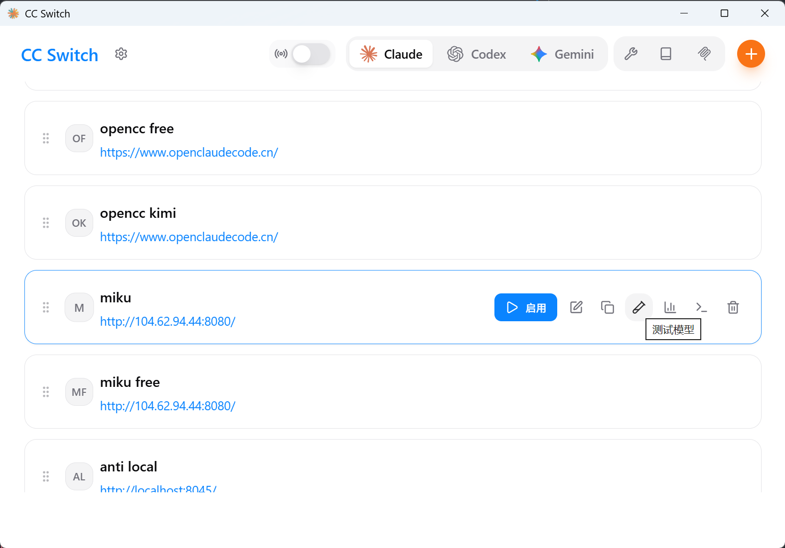
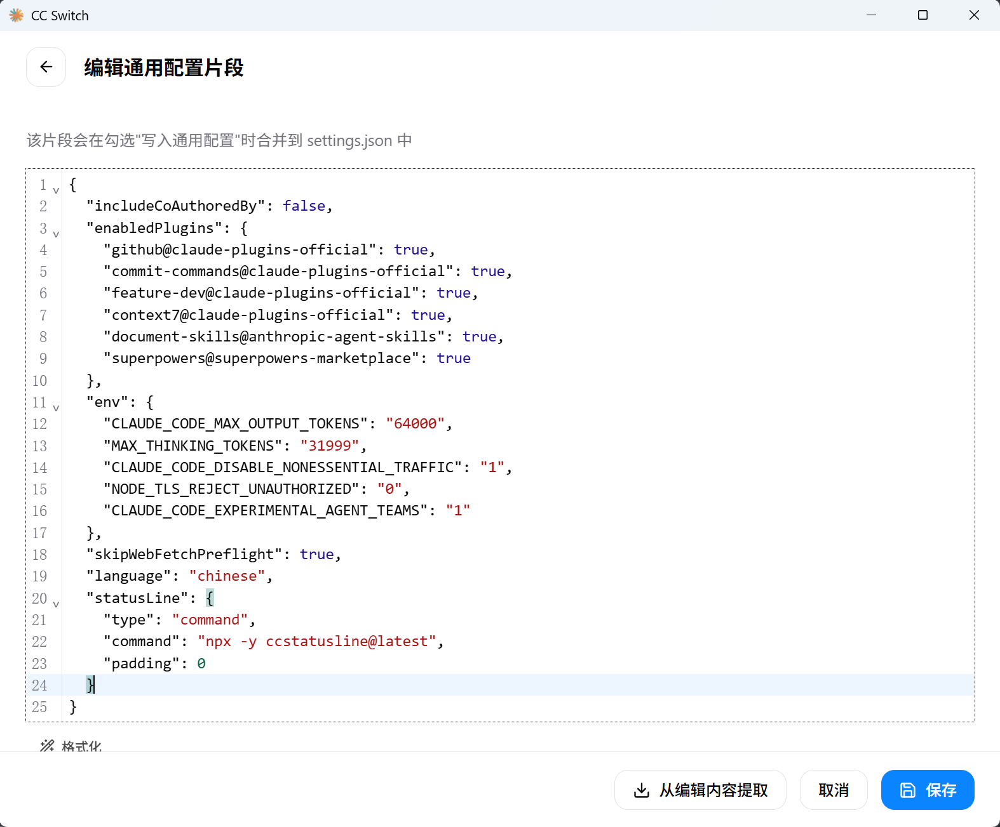
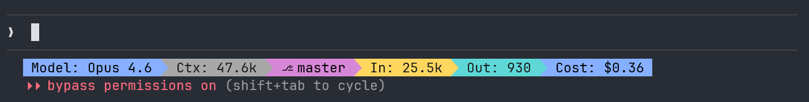
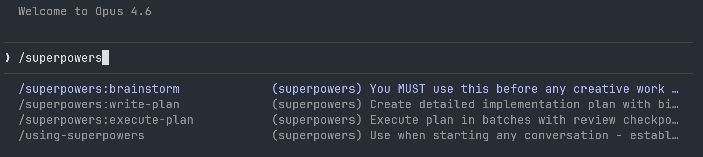
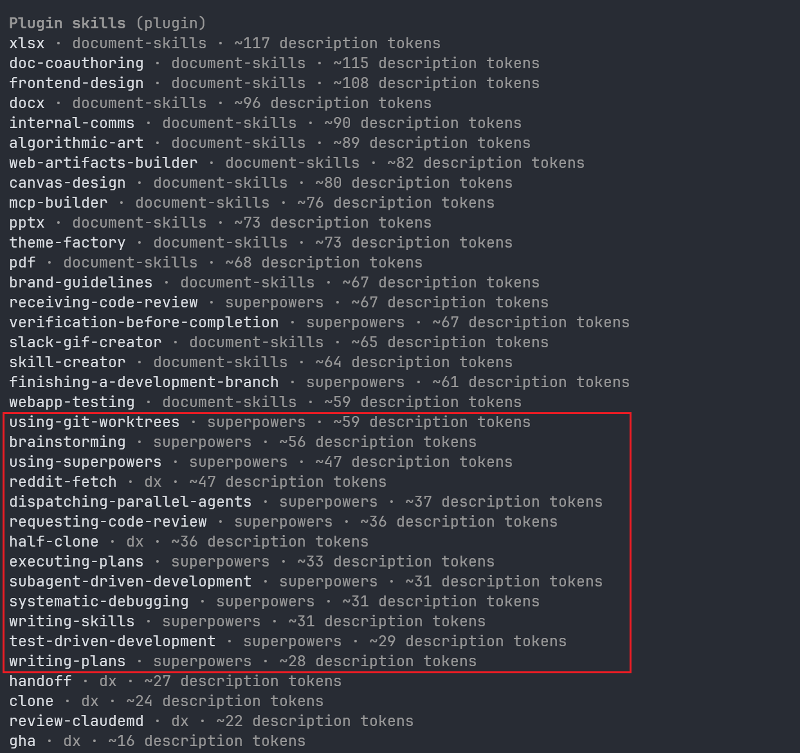

# 使用 Claude Code 进行 vibe coding 编程最佳实践

## 1. 概述

AI 辅助编程的演进大致经历了三个阶段。

1. 2022 年 GitHub Copilot 正式发布，开启了 AI 代码补全时代。
2. 2023 年 Cursor 等 AI IDE 出现，将交互方式从行内补全升级为 Chatbox 对话式编程。
3. 2025 年 2 月，Karpathy 用 "Vibe Coding" 一词概括了这种新的编程方式——对 AI 描述意图，看结果、跑一跑、改一改。

同月，Anthropic 发布 Claude Code，CLI Coding Agent 开始崛起。Agent 能自主读文件、跑命令、执行测试、修 bug，人从"写代码"变成"下指令、做决策、审结果"。

但没有约束的 Agent 会跑偏。社区随之发展出 OpenSpec、Spec-Kit、Superpowers 等工作流框架，用 SDD 和 TDD 约束 Agent 行为，让 Vibe Coding 从随性编程进化为有纪律的人机协作模式。

我一直积极拥抱和使用这些新工具和方法。从最初使用 GitHub Copilot 进行 AI 代码补全，到使用 Cursor、Windsurf 进行 Chatbox 对话式编程。在过去几个月里，我用 Claude Code 和 SDD 的方法完成了多个中大型项目的需求设计和开发工作，积累了不少实践经验。

这篇文章记录了我在这个过程中积累的实践：工具选择与配置、基于 Superpowers 的开发工作流，以及各种提效技巧。

## 2. 获取和使用 vibe-coding 工具

### 2.1 交互式编程的未来：Cli Coding Agent

在我看来，Cli Coding Agent 正在成为比 IDE + chatbox 更进一步的编程交互方式。随着 LLM 能力的持续提升，Coding Agent 在智能深度和自主性上有了明显的进步。它们不再局限于写代码本身，而是可以自主地长时间执行复杂任务——调试、测试、甚至驱动一个 Agent 团队来完成完整的软件开发生命周期。

畅想一下再下一代的 Coding Agent 使用方式也许是一个看板，来展示当前 Agent 的任务执行状态，用户可以在看板上直接与 Agent 交互，调整任务优先级，或者查看日志来理解 Agent 的行为。

### 2.2 主流 Coding Agent 选择

目前主流的 Cli Coding Agent 包括：

- [Claude Code](https://claude.ai/code)：目前最强大的 Coding Agent，适合复杂任务和长期项目，skill 等概念的提出者，生态最丰富，模型能力和速度达到完美平衡。
- [Codex](https://openai.com/blog/codex)：模型能力大力出奇迹的典范，模型能力很强，但是工具生态和用户体验不如 Claude Code，速度也较慢。适合解决疑难的但是结果确定的问题。
- [Gemini CLI](https://github.com/google-gemini/gemini-cli)：谷歌推出的开源 Coding Agent，工具生态在快速追赶。硬伤是模型的编程能力不如前两者，优势是速度快和提供了免费的用量。适合前端编写和评价前面两个工具的结果。
- [OpenCode](https://opencode.ai/)：开源的 Coding Agent，工具生态和模型能力都在快速追赶，社区活跃，支持各种模型的接入。

---

除了 OpenCode 以外，我都深度使用过。目前我的使用组合是：

* 主力：Claude Code，用它做任何事情，缺点是贵和上下文较小（200K）。
* 辅助：Codex，偶尔用来解决 Claude Code 无法解决的难题，或者对 Claude Code 的结果进行二次验证。它的优势是便宜且上下文长（1M），所以可以用它来处理一些需要大量上下文的任务。
* 验证：Gemini CLI，偶尔用来对前两个工具的结果进行快速评价，它的优势是速度快、上下文大（1M）、知识宽度广而且有免费的用量。

### 2.3 如何获取和使用 Coding Agent

我目前通过国内中转站的方式使用这些工具。国内中转站提供稳定和价格实惠的 API 中转，让使用顶尖模型变得容易。

我通过这些中转评测网站来找到性价比较高的中转站：

- [https://aio.helphelp.club](https://aio.helphelp.club/transit)：提供多个中转站的评测和链接
- [https://relaypulse.top](https://relaypulse.top/?service=cc&period=7d)：中转站可用性监控，可以查看不同中转站的稳定性和响应速度

目前个人在使用的中转站：

- [Micu](https://www.openclaudecode.cn/register?aff=vVsG)：Claude Code 价格 0.85x，特价分组 0.2x，稳定性佳。
- [MikuCode](https://mikucode.xyz/)：纯 Claude Code Max 号池，小而美，价格 1.2x，稳定性中上。

> 注意，所有中转站都有跑路风险，请勿大额度充值。

### 2.4 使用 cc-switch 快速配置和切换中转站

配置这几种 Coding Agent 的变量比较麻烦，尤其是需要频繁切换中转站和模型的情况下。

[cc-switch](https://github.com/farion1231/cc-switch)是一个页面工具，可以快速切换不同 Coding Agent 的配置。它支持预设多个配置文件，每个文件包含不同的 API 密钥、模型选择和其他参数。使用 `cc-switch` 可以大大简化在不同工具之间切换的流程，提高工作效率。还支持 Skill 管理、MCP 管理等功能。




启用某个配置之后，它会自动设置 claude 的 `~/.claude/settings.json`，重新启动 claude 即可生效。

### 2.5 使用 ccstatusline 实时查看运行状态

[ccstatusline](https://github.com/sirmalloc/ccstatusline) 可以在 Claude Code 中实时显示当前使用的模型、上下文使用情况、费用消耗等信息。



## 3. 需求开发最佳实践（使用 Superpowers）

### 3.1 了解 Agent 能力的边界

Vibe Coding 前，了解 Agent 能力的边界非常重要，这决定了你把什么任务让 Agent 完成。

目前 Claude Code 的能力能做到：

- 与用户进行讨论，实现架构设计
- 100% 代码编写
- 环境搭建、依赖安装
- 端到端测试（单元测试、集成测试、E2E 测试）
- 调试问题，分析日志，修复 bug

可以说，只要有足够的上下文，它的能力超过领域专家。所以，放心地把任务交给 Agent 吧！Agent 能力的边界远比你想象的要宽广。只要你给它足够的信息和正确的指令，它就能完成很多你觉得不可能的任务。

我曾经给他指令，让它自己查看日志，然后定位问题并修复。它通过 tail -f 实时查看日志，发现问题并定位到具体代码行，最后成功修复了问题。完全不需要人类介入。

目前最大的约束在于它还无法高效进行除了文本以外的输入输出，以及上下文大小有限。相信在不久的将来 Agent 能够实现所有执行层面的内容，人类只需要下达指令，剩下的交给 Agent 就好。

### 3.2 Superpowers 介绍和获取

简单来说 [Superpowers](https://github.com/obra/superpowers) 就是一套开发工作流的 Skills。它通过工作流约束 Coding Agent 的行为，让 Agent 在执行任务前与用户讨论清楚需求和计划，然后再以 TDD 的形式执行任务。

在 claude code 中直接使用下面命令安装，其他 Agent 的安装方式请参考其文档。

```bash
# Claude Code 安装
/plugin marketplace add obra/superpowers-marketplace
/plugin install superpowers@superpowers-marketplace
```

安装之后可以使用斜杠命令来看到它提供的 command，也可以在 prompt 中直接让它使用相应的技能。



```bash
/skills
```



#### 关于 SDD （Specification-Driven Development）

Spec Driven Development (SDD) 是一种"先写规格说明，再写代码"的开发方法。核心思路：在动手实现之前，先用文档明确定义系统该做什么（API 契约、行为规格、接口定义等），然后所有实现、测试、审查都围绕这份 spec 展开。

我强烈建议在 Vibe Coding 场景下应该使用 SDD 来开发中大型的需求。而 Superpowers 就为 Coding Agent 实现这套方法论提供了工具。但是它的实现比较灵活，它是一系列 Skill，你可以自行选择使用哪些 Skill 来执行你的 SDD 工作流。

---

我也使用过一些其他的 SDD 框架或者命令。他们各有各的特点和适用场景：

- [feature-dev](https://github.com/anthropics/claude-code/tree/main/plugins/feature-dev)：Anthropic 官方 command，提供了一个简单的工作流，在开发特性前会先让 Agent 探索代码，然后与用户讨论并生成一个开发计划，然后执行，最后用多个 agent 进行审查。
  - 适合中小需求的快速开发。
- [Spec Kit](https://github.com/github/spec-kit)：严格规定了六步流程（原则 → 规格 → 计划 → 任务 → 实施 → 验证），适合正式项目和团队使用。它的特点是每一步都有明确的输入输出，且有专门的命令来管理整个流程。
  - 流程较重，而且与用户讨论不充分。适合从 0 到 1 开发一个完整项目。
- 对于更小的需求或者 BUG 修复，建议先用 `/plan` 模式编写一个计划，审查完计划再执行。

superpowers 是我使用下来感觉比较灵活高效的 SDD 实现。它提供了很多实用的 Skill 来支持 SDD 工作流，同时又不会过于死板地限制开发流程，适合进行中大型需求的开发。

#### 关于 TDD（Test-Driven Development）

TDD 是"先写测试，再写代码"的开发方法，也是我觉得非常适合 Coding Agent 的开发方法。

在人写代码时，TDD 往往无法得到很好的执行，因为它需要耗费大量时间设计和编写高质量的测试用例，而人类开发者往往会因为时间压力或者缺乏动力而跳过这个步骤。但是在 Coding Agent 的世界里，Agent 本身就非常擅长编写测试用例，TDD 可以得到非常好的执行。

Superpowers 中的流程也天然按照 TDD 的方式来设置，在执行阶段它要求 Agent 先完成测试用例的编写，然后再编写实现代码，最后运行测试验证结果。这个流程非常适合 Agent 的能力特点，可以最大化地发挥 Agent 在测试编写方面的优势，同时也能保证代码质量。

### 3.3 使用 Superpowers 进行需求开发

Superpowers 的核心工作流是一条从"想法"到"交付"的完整链路。每个环节对应一个 Skill，Skill 之间通过明确的衔接点串联。下面按实际执行顺序逐步介绍。

#### 3.3.0 初始化 Vibe Coding 环境

在开始 Vibe Coding 之前，建议先进行一些环境准备工作：

1. 使用 `/init` 命令来初始化 `CLAUDE.md` 文件，Claude Code 会探索整个代码仓，记录项目约定。这个文件会作为作为上下文的一部分，让 Agent 在执行过程时刻都能参考到这些约定。

   你还可以把一些你要求 Agent 遵守的规则写入 `CLAUDE.md`，比如"每次修改代码都要运行测试验证"、"每次提交都要写清楚 commit message 的内容和目的"等。

2. 在本地准备集成测试需要的环境，比如数据库、中间件等。我会让 Agent 在项目目录中写一个 `docker-compose.yml` 来定义这些环境，然后让 Agent 在集成测试中使用这些环境，确保编写的代码能够在真实环境中运行。

3. 把项目的编码规范写到 `.claude/rules` 目录下，Claude Code 会自动加载这些规则并在执行过程中遵守。[一些 Rules 参考](https://github.com/affaan-m/everything-claude-code/tree/main/rules)

#### 3.3.1 头脑风暴（brainstorming）

拿到一个需求之后，我们需要先进行方案设计。当脑中有一个方案框架时，我们用 `/brainstorming` 命令，与 LLM 讨论设计方案，直到达成一致。LLM 能识别出很多你没有考虑到的点，并且通过多轮提问的方式来确定最终的方案。

这是我认为 superpowers 工作流中非常好的一个点，其他的 SDD 框架往往在设计环节比较薄弱，直接让 Agent 拿到需求后写计划。而 superpowers 强制要求先进行设计讨论，确保需求和方案被充分理解和审视。

它做什么：
- 先探索项目上下文（文件结构、文档、最近的 git 提交）
- 每次只问你一个问题，逐步理解你的意图、约束和成功标准
- 提出 2-3 种实现方案，附带权衡分析和推荐理由，你只要做选择题来选择期望的方案
- 分段展示最终设计方案，每段确认后再继续
- 最终将设计文档保存到 `docs/plans/YYYY-MM-DD-<topic>-design.md`

对于设计文档的格式，我个人根据我的实践总结了一个结构清晰、信息密度高的模板，已经写成了一个 Skill，可以参考。

[feature-designer](https://github.com/HScarb/agent-configs/tree/main/.claude/skills/feature-designer)

所以最终的 prompt 可以类似这样：

```bash
/brainstorming 帮我设计一个新的特性，功能是 xxx。设计文档请按照 feature-designer skill 的模板来写。
```

#### 3.3.2 创建 Git Worktree（using-git-worktrees）

这步是可选的。当需要并行开发多个特性时，可以用 `/using-git-worktrees` 命令为每个特性创建一个隔离的 git worktree 工作区，避免分支冲突。

这个命令会为我们创建一个 git worktree，并且自动安装依赖，验证测试基线是干净的。然后我推荐需要 `cd` 进入新创建的 worktree 目录，重新启动一个新的 Claude Code 会话，在这个隔离的环境中进行开发。

这也是 Claude Code 作者 Boris Cherny 的一个最佳实践推荐 [a few tips for using Claude Code - Boris Cherny](https://x.com/bcherny/status/2017742741636321619)。通过这种方式可以实现数倍的开发效率提升，并行开发多个需求，把 Claude Code 的提效能力最大化。我在看到 Boris Cherny 的文章之前，一直是只开启一个 Claude Code 会话来开发，要等待一个任务处理完之后才能开始下一个任务。后来我开始用多个窗口并行开发需求，显著提升了开发效率。

#### 3.3.3 编写实施计划（writing-plans）

有了批准的设计文档后，Agent 调用 writing-plans skill 将设计转化为可执行的实施计划。

这步也是可选的，对于小型任务，可以直接跳过，进入实施阶段。但对于中大型任务，编写详细的实施计划能显著提升开发效率和质量。

它做什么：
- 将设计拆分为细粒度的任务（每个任务 2-5 分钟）
- 每个任务包含：精确的文件路径、完整的代码片段、测试命令及预期输出、git commit 命令
- 严格遵循 TDD 节奏：写失败测试 → 运行验证失败 → 写最少实现 → 运行验证通过 → 提交
- 计划保存到 `docs/plans/YYYY-MM-DD-<feature-name>.md`

计划编写完成后，Superpowers 提供两种执行方式供选择：
1. `/subagent-driven-development`：子代理驱动开发（当前会话内执行）
2. `/executing-plans`：并行会话执行（在新会话中使用 executing-plans skill）

#### 3.3.4 执行计划

根据用户选择，有两种执行模式：

**模式 A：子代理驱动开发（subagent-driven-development）**

适合在当前会话内执行，是推荐的默认模式，也是我个人使用最多的模式。它可以连续跑几个小时，直到完成所有任务，期间不需要人工介入。

它做什么：
- 主 Agent 读取计划，提取所有任务，创建 TodoWrite 跟踪进度
- 为每个任务分派一个全新的子代理（subagent），附带完整的任务文本和上下文
- 子代理可以在开始前提问，主 Agent 回答后再继续
- 子代理按 TDD 流程实现、测试、自审查、提交
- 完成后进入两阶段审查：
  - 第一阶段：规格合规性审查（spec reviewer）——代码是否完整实现了规格要求，有没有多做或少做
  - 第二阶段：代码质量审查（code quality reviewer）——代码是否写得好
- 审查不通过则由同一个子代理修复，再次审查，循环直到通过
- 所有任务完成后，分派最终的全局代码审查子代理

**模式 B：分批执行（executing-plans）**

适合在独立的并行会话中执行，带有人工检查点。

它做什么：
- 加载计划文件，先批判性审查计划本身
- 默认每批执行 3 个任务
- 每批完成后停下来报告进展和验证结果，等待用户反馈
- 根据反馈调整后继续下一批

#### 3.3.5 完成开发分支（finishing-a-development-branch）

所有任务完成后，可以调用此 skill 来收尾。他会确保测试通过，然后提供合并选项，最后清理工作区。

它做什么：
- 先运行完整测试套件，测试不通过则停下来修复
- 确定基础分支（main/master）
- 提供 4 个选项：
  1. 本地合并回基础分支
  2. 推送并创建 Pull Request
  3. 保留分支不动（稍后处理）
  4. 丢弃这次工作
- 执行用户选择的操作
- 清理 worktree（选项 1 和 4 清理，选项 2 和 3 保留）

#### 3.3.6 完整工作流示意

```
用户提出需求
    │
    ▼
brainstorming（探索上下文 → 提问 → 提出方案 → 展示设计 → 用户批准）
    │
    ▼
using-git-worktrees（创建隔离工作区 → 安装依赖 → 验证测试基线）
    │
    ▼
writing-plans（设计 → 细粒度任务 → TDD 步骤 → 保存计划文件）
    │
    ├─→ subagent-driven-development（当前会话：子代理实现 → 两阶段审查 → 循环）
    │
    └─→ executing-plans（并行会话：分批执行 → 人工检查点 → 循环）
    │
    │   ↕ test-driven-development（贯穿实施全程）
    │   ↕ systematic-debugging（遇到问题时触发）
    │   ↕ requesting-code-review / receiving-code-review（任务间审查）
    │   ↕ verification-before-completion（声称完成前验证）
    │
    ▼
finishing-a-development-branch（验证测试 → 选择操作 → 清理 worktree）
```

这套工作流的核心理念是：在写代码之前把需求和设计讨论清楚，在写代码的过程中用 TDD 和审查保证质量，在声称完成之前用证据验证结果。Agent 在每个环节都有明确的"铁律"约束，防止走捷径。

#### 3.3.7 其他 Skill

除了上述流程之外，Superpowers 还提供了很多其他实用的 Skill，可以自行探索。

## 4. 其他技巧和工具推荐

### 4.1 并行会话与 Git Worktree

- 同时运行 3-5 个 Claude Code 终端会话，每个对应一个独立任务。
- 使用 `git worktree` 为每个会话创建隔离工作目录，避免分支冲突。给标签页编号/命名，开启系统通知以快速跳转到需要输入的会话。
- 也可混合使用终端 + Web UI（`claude.ai/code`）+ 移动端会话，用 `--teleport` 在不同环境间迁移上下文。

### 4.2 CLAUDE.md 维护

- 在仓库根目录维护 `CLAUDE.md` 并提交到 git，团队共享。记录：项目约定（构建/lint/test 命令、代码风格）、Claude 反复犯的错误。
- 每次 Claude 犯错后立即更新此文件，让后续会话从更好的上下文起步。无情迭代直到错误率明显下降。
- PR Review 时标记 `@.claude`，将审查反馈自动转化为 `CLAUDE.md` 更新（需配合 Claude Code GitHub Action）。

### 4.3 Plan 模式优先

- 非简单任务一律先进入 Plan 模式（`Shift+Tab` 两次），与 Claude 反复迭代计划直到满意，再切换到执行模式。
- 进阶：让一个 Claude 起草计划，另一个 Claude 扮演 Staff Engineer 审查计划。如果执行跑偏，切回 Plan 模式重新规划而非硬推。
- 编码任务优先选择最强模型 + thinking 模式（如 Opus），虽然单 token 慢但总体更快——减少纠偏和修复工具调用错误的时间。

### 4.4 Slash 命令与 Skills

- 高频工作流封装为 slash 命令，存放在 `.claude/commands/` 下并提交到仓库，团队共享。
- 命令中可内嵌 bash 预计算上下文（如 `git status`、`git diff`），减少交互轮次。
- 实际案例：`/techdebt`（会话结束时查找重复代码）、同步最近 7 天 Slack/GitHub 信息的命令、"分析工程师" agent 等。

### 4.5 Subagent 与并行任务

- 将子任务分配给 subagent，保持主 agent 上下文干净聚焦。明确告诉 Claude "使用 subagent" 可投入更多算力。
- 定义可复用的 subagent 角色：精简最终 diff、端到端验证、安全扫描等。
- Superpowers 的子代理驱动开发模式：为每个任务分派子代理，两阶段审查（规格合规性 + 代码质量），主代理只做调度和检查。

### 4.6 Hooks 自动化

- `PostToolUse` hook：文件编辑后自动运行格式化工具（black、prettier 等），捕获边界情况，减少 CI 失败。
- `PreToolUse` hook：重大决策前自动重新读取计划文件，防止目标漂移。
- `Stop` hook：会话结束前验证任务完成情况。
- 进阶：通过 hook 将敏感权限检查路由到更强模型（如安全扫描用 Opus）。

### 4.7 权限管理

- 通过 `/permissions` 预授权常用安全命令，配置写入 `.claude/settings.json` 并团队共享，减少交互中断同时保留安全护栏。
- **Bypass Permissions 模式**：`Shift+Tab` 循环切换权限模式时可进入，或通过 `--dangerously-skip-permissions` 启动。该模式下 Claude 自动批准所有工具调用（文件读写、bash 命令等），无需逐一确认。适合对计划已充分审查后的执行阶段——先在 Plan 模式下确认方案，再切换到 Bypass 模式让 Claude 全速执行，大幅减少人工干预次数。
- 注意：Bypass 模式会跳过所有安全检查，仅在你信任当前计划且工作在独立分支上时使用。生产环境或涉及敏感操作时应避免。

### 4.8 上下文管理与文件持久化

- 核心原则：上下文窗口 = 内存（易失、有限），文件系统 = 磁盘（持久、无限）。重要信息写入文件而非依赖上下文。
- Planning with Files 三文件模式：`task_plan.md`（阶段与进度）、`findings.md`（研究发现）、`progress.md`（会话日志与测试结果）。适用于 3 步以上的多步骤任务。
- 合理使用 `/compact` 压缩上下文、`/clear` 重置。禁用 `autoCompact` 可在清除前最大化上下文利用。

### 4.9 规格驱动开发

- 在交付前写详细规格说明，消除歧义——越具体，Claude 的自主性越强。
- 工具选择：
  - **OpenSpec**：轻量迭代，无阶段门控，适合快速原型。命令：`/opsx:new` → `/opsx:ff` → `/opsx:apply` → `/opsx:archive`。
  - **Spec Kit**（GitHub 出品）：六步流程（原则 → 规格 → 计划 → 任务 → 实施 → 验证），适合正式项目。
- 两者均支持多种 AI 编码助手，核心理念一致：需求不应只存在于聊天历史中，规格文件带来可预测性。

### 4.10 提示技巧

- 挑战 Claude：要求它证明变更有效（"证明这能工作"、对比 main 分支），扮演审查者角色。
- 修复质量不佳时，要求从头重写而非修补（"推翻重来，实现优雅的方案"）。
- 端到端委托 bug 修复：粘贴 Slack 讨论线程 / Docker 日志 / CI 失败信息，宽泛委托（"修复失败的 CI 测试"），避免微管理具体方法。
- 使用语音输入产出更长、更丰富的提示，提升交互效率。

### 4.11 会话管理与恢复

- `claude --resume` / `claude -r`：恢复上一次会话，保留完整上下文。适合中断后继续、跨天接续同一任务。
- `claude --continue` / `claude -c`：继续最近的对话但不进入交互模式，适合追加一条指令后退出。
- 会话历史存储在 `~/.claude/projects/` 下，按项目路径组织。`/clear` 后 Planning with Files 插件可自动恢复之前的规划状态。

### 4.12 非交互模式与自动化

- `claude -p "指令"`：单次执行模式（print mode），不进入交互，适合脚本和 CI/CD 集成。
- 支持管道输入：`git diff | claude -p "review this"` 或 `cat error.log | claude -p "分析这个错误"`。
- `--output-format json`：结构化输出，便于下游程序解析。
- GitHub Action 集成：在 PR 中自动触发 Claude 进行代码审查、修复 CI 失败、响应 review 评论。通过 `/install-github-action` 快速配置。

### 4.13 MCP Server 扩展

- MCP（Model Context Protocol）让 Claude 接入外部数据源和工具：数据库查询、Slack 消息、Jira 工单、浏览器操作等。
- 配置在 `.claude/settings.json` 的 `mcpServers` 字段，支持 stdio 和 SSE 两种传输方式。
- 实用场景：接入 Slack MCP 粘贴 bug 讨论线程让 Claude 直接修复；接入数据库 MCP 做数据分析；接入浏览器 MCP 做 E2E 测试。

### 4.14 自定义 Agent

- 在 `.claude/agents/` 目录下定义专用 agent（Markdown 文件），每个 agent 有独立的系统提示和工具权限。
- 适合固化团队角色：planner、code-reviewer、security-reviewer、tdd-guide 等。通过 `Task` 工具的 `subagent_type` 参数调用。
- Agent 文件提交到仓库，团队共享统一的工作流标准。

### 4.15 Agent Teams（多代理协作）

> 实验性功能，需在 `settings.json` 中设置 `"env": {"CLAUDE_CODE_EXPERIMENTAL_AGENT_TEAMS": "1"}` 启用。

- Agent Teams 让多个 Claude Code 实例组成团队协作：一个 lead 会话负责调度，多个 teammate 会话独立工作，各自拥有独立上下文窗口。
- 与 subagent 的区别：subagent 在单会话内运行、只能向主 agent 汇报结果；agent team 的 teammate 之间可以直接通信、共享任务列表、自主认领任务。
- 启动方式：用自然语言描述任务和团队结构即可，如 "Create an agent team with 3 reviewers: security, performance, test coverage"。
- 适用场景：并行代码审查（安全/性能/测试覆盖各一人）、竞争性假设调试（多人各持一个假设互相挑战）、跨层协作（前端/后端/测试各一人）。
- 注意事项：token 消耗随 teammate 数量线性增长；避免多人编辑同一文件；简单任务用 subagent 更经济。

### 4.16 使用分析和优化

- `/insights`：分析你的历史使用模式并生成个性化改进报告。报告内容包括：工作模式反馈（如是否频繁放弃对话）、针对你的使用习惯给出可直接复制粘贴的 skill/agent/hook 建议、具体改进示例。每次运行结果略有不同（侧重近期数据），建议定期执行以持续优化与 Claude 的协作方式。（[参考](https://www.natemeyvis.com/claude-codes-insights/)）

### 4.17 上下文窗口管理

- 使用 `/context` 窗口观察当前上下文使用情况。
- 避免在上下文窗口最后 20% 区域执行大规模重构——此时模型表现下降，应先压缩或新开会话。

## 参考资料

* [45 Claude Code Tips: From Basics to Advanced](https://github.com/ykdojo/claude-code-tips)：包含 45 个 Claude Code 使用技巧的合集，涵盖自定义状态栏、斜杠命令、语音输入、上下文管理和 Git 工作流等方面。
* [Everything Claude Code](https://github.com/affaan-m/everything-claude-code/)：包含 15+ 代理、30+ 技能、30+ 命令和多语言支持的 Claude Code 综合配置合集。
* [Superpowers](https://github.com/obra/superpowers)：为 Coding Agent 构建的完整软件开发工作流技能集，基于可组合的 Skill 系统，强调 TDD、系统化流程和子代理驱动开发。
* [Planning with Files](https://github.com/OthmanAdi/planning-with-files)：通过持久化 Markdown 文件实现 AI 代理的规划、进度跟踪和知识存储的 Claude Code 插件，解决上下文易失和目标漂移问题。
* [OpenSpec](https://github.com/Fission-AI/OpenSpec)：轻量级规格驱动开发框架，让开发者在写代码前与 AI 助手就规格达成一致，强调流动性和迭代性，无阶段门控。
* [Spec Kit](https://github.com/github/spec-kit)：GitHub 开源的规格驱动开发工具包，通过六步工作流（原则 → 规格 → 计划 → 任务 → 实施 → 验证）来构建高质量软件。
* [a few tips for using Claude Code - Boris Cherny](https://x.com/bcherny/status/2017742741636321619)：Claude Code 创建者分享的使用技巧，包括并行会话、Plan 模式、CLAUDE.md 维护、Slash 命令、Subagent 和 Hook 等最佳实践。
