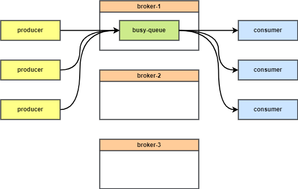
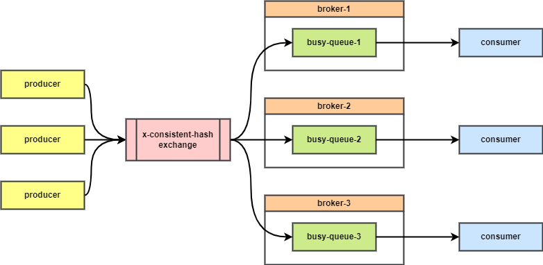

# RabbitMQ 一致性哈希交换器 使用和原理

## 1. 背景

### 1.1 使用场景

在使用 RabbitMQ 集群时，我们常常遇到队列中消息不平衡的场景。即某个队列的消息或流量非常大，其他队列流量较小。由于 RabbitMQ 的队列只能存在于一个节点，就会导致节点间负载不均衡。



在 CloudAMQP 的 [RabbitMQ 高性能最佳实践](https://www.cloudamqp.com/blog/part2-rabbitmq-best-practice-for-high-performance.html) 中提到了使用一致性哈希交换器（Consistent hash exchange plugin）来让消息在多个队列中负载均衡。有了它，我们就可以将一个队列拆分成多个子队列，平均地分布在每个节点上，让节点间负载均衡。

将一个队列拆分成多个队列也可以摆脱单队列的性能瓶颈，获得更高的吞吐量。



### 1.2 一致性哈希

一致性哈希交换器根据 routingKey 进行哈希，根据哈希结果将生产者发送的消息路由到哪个队列中。

普通的哈希算法无法保证在增加或者减少队列绑定时，同样的 routingKey 的消息路由到相同的队列。一致性哈希就是为了解决这个问题。

## 2. 使用

### 2.1 开启插件

需要先开启一致性哈希交换器插件

```bash
rabbitmq-plugins enable rabbitmq_consistent_hash_exchange
```

### 2.2 管理页面使用

开启插件后，在 RabbitMQ 管理页面可以创建 `x-consistent-hash` 类型的交换器，即一致性哈希交换器。


然后我们创建 3 个子队列


进入 exchange 详情，将 3 个队列与 exchange 绑定。

注意，这里的 Routing key 的含义是对应队列的权重，权重越高，消息路由到该队列的概率也越高。

这里我们将 3 个队列的权重都设为 10。


然后在 exchange 详情页面，手动发送消息，指定不同的 Routing key，观察消息在队列中的分布。

这里我发送 9 条消息，Routing key 为 1~9。


消息被分配到 3 个队列中。


由于发送的消息较少，这里还不是非常平均。发送更多消息将会更平均。

如何查看内核中的权重是否生效？可以用命令行提供的诊断命令查看一致性哈希交换器的哈希环节点分布：

```bash
rabbitmq-diagnostics consistent_hash_exchange_ring_state -p {vhost} {exhcange}
```

### 2.3 Java SDK 使用

下面以 Java SDK 为例，演示一致性哈希交换器的使用。先导入 maven 依赖。

```xml
<!-- RabbitMQ Java client -->
<dependency>
    <groupId>com.rabbitmq</groupId>
    <artifactId>amqp-client</artifactId>
    <version>5.13.0</version>
</dependency>
```

```java
import com.rabbitmq.client.*;

import java.io.IOException;
import java.util.concurrent.TimeoutException;

public class RabbitMQConsistentHashDemo {

    private static final String EXCHANGE_NAME = "consistent_hash_exchange";
    private static final String[] QUEUE_NAMES = {"queue1", "queue2", "queue3"};
    private static final int MESSAGE_COUNT = 300;

    public static void main(String[] args) throws IOException, TimeoutException {
        ConnectionFactory factory = new ConnectionFactory();
        factory.setHost("localhost");	// 设置 rabbitmq 连接地址，如有必要，还需要设置端口（默认 5672）、用户名和密码
        try (Connection connection = factory.newConnection();
             Channel channel = connection.createChannel()) {

            // 定义交换器
            channel.exchangeDeclare(EXCHANGE_NAME, "x-consistent-hash", true);

            // 定义 3 个子队列，并与交换器绑定
            for (String queueName : QUEUE_NAMES) {
                channel.queueDeclare(queueName, true, false, false, null);
                channel.queueBind(queueName, EXCHANGE_NAME, "10"); // 这里的 bindingKey 为路由到该队列消息的权重，用整数字符串表示
            }

            // 生产 300 条消息，
            for (int i = 0; i < MESSAGE_COUNT; i++) {
                String message = "Message-" + i;
                String routingKey = String.valueOf(i); // 用消息的序号作为 routingKey
                channel.basicPublish(EXCHANGE_NAME, "", null, message.getBytes());
            }

            System.out.println("Sent " + MESSAGE_COUNT + " messages.");

            // 打印每个队列堆积的消息数量
            for (String queueName : QUEUE_NAMES) {
                long count = channel.messageCount(queueName);
                System.out.println("Queue " + queueName + " has " + count + " messages.");
            }
        }
    }
}
```

### 2.4 高级用法

#### 2.4.1 使用 Header 作为路由键

在某些情况下，routingKey 需要被用于其他目的（如交换器间绑定）。在这种情况下可以配置一致性哈希交换器基于消息头进行路由。

使用的方法是，在创建一致性哈希交换器时指定 `hash-header` 参数来声明需要作为路由键的 header。

```java
String EXCHANGE = "e2";
String EXCHANGE_TYPE = "x-consistent-hash";

Map<String, Object> args = new HashMap<>();
args.put("hash-header", "hash-on");
ch.exchangeDeclare(EXCHANGE, EXCHANGE_TYPE, true, false, args);
```

上面的代码创建了一个一致性哈希交换器，使用消息的 `hash-on` 这个 header 作为路由键。

```java
for (int i = 0; i < 100000; i++) {
  AMQP.BasicProperties.Builder bldr = new AMQP.BasicProperties.Builder();
  Map<String, Object> hdrs = new HashMap<>();
  hdrs.put("hash-on", String.valueOf(i));
  ch.basicPublish(EXCHANGE, "", bldr.headers(hdrs).build(), "".getBytes("UTF-8"));
}
```

在发送消息时指定消息 header 中的 `hash-on` 属性，作为消息的路由键。

#### 2.4.2 使用消息属性作为路由键

还可以使用消息属性作为路由键，直接使用消息的 `message_id`、`correlation_id` 或 `timestamp` 属性来进行路由。

使用的方法是在创建一致性哈希交换器时用 `hash-property` 参数指定消息的路由属性名称。

```java
String EXCHANGE = "e3";
String EXCHANGE_TYPE = "x-consistent-hash";

Map<String, Object> args = new HashMap<>();
args.put("hash-property", "message_id");
ch.exchangeDeclare(EXCHANGE, EXCHANGE_TYPE, true, false, args);
```

上面的代码将 `message_id` 作为路由键。

```java
for (int i = 0; i < 100000; i++) {
  AMQP.BasicProperties.Builder bldr = new AMQP.BasicProperties.Builder();
  ch.basicPublish(EXCHANGE, "", bldr.messageId(String.valueOf(i)).build(), "".getBytes("UTF-8"));
}
```

上面的代码在发送消息时设置消息的 `message_id`，被用作路由键。

## 3. 原理

一致性哈希交换器的原理与普通的一致性哈希实现类似，[可以看这篇文章：一致性哈希 原理和实现](../other/20231015-consistent-hash.md)。

简单地说是在 erlang 的分布式数据库 mnesia 中初始化了一个哈希环，每个队列在哈希环上对应多个虚拟节点（虚拟节点的个数就是绑定时指定的权重）。

当新的队列（或其他绑定）被添加到交换器时，它将通过哈希值被映射到哈希环上。每个队列可能占据哈希环上的一个或多个位置点（由其权重决定），从而在消息分配时提供更多的均匀性。当消息进入交换器时，它也将哈希到这个环上，然后被路由到环上位置等于或顺时针最接近的队列。

下图是权重为 1 时的路由场景：


但是哈希算法并不保证节点均匀分配到哈希换上，所以需要用更多地虚拟节点来让节点更均匀地分布。

当权重为 3 时，每个节点（队列）会“分身“成多个虚拟节点，示意图如下：


## 参考资料

* [Part 2: RabbitMQ Best Practice for High Performance (High Throughput)](https://www.cloudamqp.com/blog/part2-rabbitmq-best-practice-for-high-performance.html)

* [RabbitMQ Consistent Hash Exchange Type](https://github.com/rabbitmq/rabbitmq-consistent-hash-exchange#rabbitmq-consistent-hash-exchange-type)
