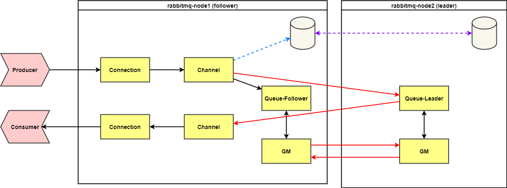
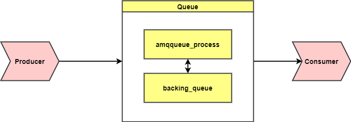
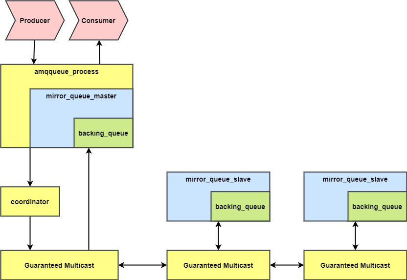
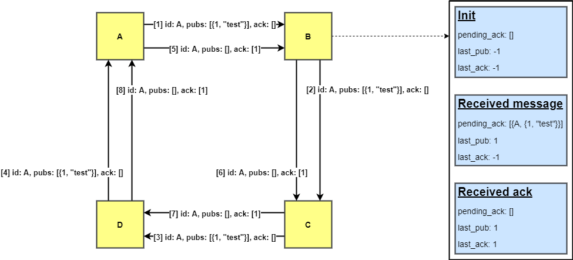

# RabbitMQ 镜像队列 使用和原理详解

[TOC]

# 1. 背景

单节点的 RabbitMQ 存在性能上限，可以通过垂直或者水平扩容的方式增加 RabbitMQ 的吞吐量。垂直扩容指的是提高 CPU 和内存的规格；水平扩容指部署 RabbitMQ 集群。

通过将单个节点的队列相对平均地分配到集群的不同节点，单节点的压力被分散，RabbitMQ 可以充分利用多个节点的计算和存储资源，以提升消息的吞吐量。

但是多节点的集群并不意味着有更好的可靠性——每个队列仍只存在于一个节点，当这个节点故障，这个节点上的所有队列都不再可用。

在 3.8 以前的版本，RabbitMQ 通过镜像队列（Classic Queue Mirroring）来提供高可用性。但镜像队列存在很大的局限性，在 3.8 之后的版本 RabbitMQ 推出了 Quorum queues 来替代镜像队列，在之后的版本中镜像队列将被移除。

镜像队列通过将一个队列镜像（消息广播）到其他节点的方式来提升消息的高可用性。当主节点宕机，从节点会提升为主节点继续向外提供服务。

本文将讲解镜像队列的使用方法和原理。

# 2. 镜像队列概述

RabbitMQ 以队列维度提供高可用的解决方案——镜像队列。

配置镜像队列规则后，新创建的队列按照规则成为镜像队列。每个镜像队列都包含一个主节点（Leader）和若干个从节点（Follower），其中只有主节点向外提供服务（生产消息和消费消息），从节点仅仅接收主节点发送的消息。

从节点会准确地按照主节点执行命令的顺序执行动作，所以从节点的状态与主节点应是一致的。

# 3. 使用方法和注意事项

## 3.1 配置方法

### 3.1.1 管理界面配置

使用策略（Policy）来配置镜像策略，策略使用正则表达式来配置需要应用镜像策略的队列名称，以及在参数中配置镜像队列的具体参数。

按此步骤创建镜像策略，该策略为所有 `mirror_` 开头的队列创建 3 副本镜像


创建完的策略如下图显示


参数解释：

- Name: policy的名称，用户自定义。
- Pattern: queue的匹配模式（正则表达式）。`^`表示所有队列都是镜像队列。
- Definition: 镜像定义，包括三个部分ha-sync-mode、ha-mode、ha-params。
  - ha-mode: 指明镜像队列的模式，有效取值范围为all/exactly/nodes。
    - all：表示在集群所有的代理上进行镜像。
    - exactly：表示在指定个数的代理上进行镜像，代理的个数由ha-params指定。
    - nodes：表示在指定的代理上进行镜像，代理名称通过ha-params指定。
  - ha-params: ha-mode模式需要用到的参数。
  - ha-sync-mode: 表示镜像队列中消息的同步方式，有效取值范围为：automatic，manually。
    - automatic：表示自动向master同步数据。
    - manually：表示手动向master同步数据。

- Priority: 可选参数， policy的优先级。

### 3.1.2 命令行

rabbitmqctl [**set_policy**](https://www.rabbitmq.com/rabbitmqctl.8.html#set_policy) [**-p** vhost] [**--priority** priority] [**--apply-to** apply-to] name pattern definition

例如，对队列名称以“queue_”开头的所有队列进行镜像，并在集群的两个节点上完成进行，policy的设置命令为：

```shell
rabbitmqctl set_policy --priority 0 --apply-to queues mirror_queue "^mirror_" '{"ha-mode":"exactly","ha-params":3,"ha-sync-mode":"automatic"}'
```

### 3.1.3 HTTP API

https://www.rabbitmq.com/ha.html#examples

```json
PUT /api/policies/%2f/ha-two
{
  "pattern":"^mirror_",
  "definition": {
    "ha-mode":"exactly",
    "ha-params":3,
    "ha-sync-mode":"automatic"
  }
}
```

## 3.2 镜像队列配置观测

配置完 Policy 后，创建新的队列，或者原有的的队列，如果队列名称符合 Policy 的匹配规则，则该队列会自动创建为镜像队列。

下图中 `mirror_queue` 匹配之前创建的镜像策略，为镜像队列。`normal_queue` 为普通队列


镜像队列显示的蓝色 `+2` 表示同步副本数为 2 个。此处如果用红色显示，则表示为同步副本数

显示的 `mirror-policy` 为该队列应用的镜像策略。

点击队列名称可以进入查看队列详细信息，从中可以看出队列的主节点、从节点和镜像策略


## 3.3 配置参数

镜像队列有许多配置参数，表达了镜像队列的镜像策略和异常后的晋升策略。

下面来详细解释一下这些配置参数的意义

### 3.3.1 镜像策略

| ha-mode | ha-params | 结果                                                         |
| ------- | --------- | ------------------------------------------------------------ |
| exactly | count     | 集群中队列副本的数量（主队列加上镜像）。count值为1表示一个副本：只有主节点。如果主节点不可用，则其行为取决于队列是否持久化。count值为2表示两个副本：一个队列主队列和一个队列镜像。换句话说:“镜像数=节点数-1”。如果运行队列主服务器的节点变得不可用，队列镜像将根据配置的镜像提升策略自动提升到主服务器。如果集群中的可用节点数少于count，则将队列镜像到所有节点。如果集群中有多个计数节点，并且一个包含镜像的节点宕机，那么将在另一个节点上创建一个新镜像。使用' exactly '模式和' ha-promot-on-shutdown ': ' always '可能是危险的，因为队列可以跨集群迁移，并在停机时变得不同步。 |
| all     | 不设置    | 队列跨集群中的所有节点镜像。当一个新节点被添加到集群中时，队列将被镜像到该节点。这个设置非常保守。建议设置的副本值为大多数节点`N / 2 + 1`。镜像到所有节点会给所有集群节点带来额外的负担，包括网络I/O、磁盘I/O和磁盘空间的使用。 |
| nodes   | 节点名称  | 队列被镜像到节点名中列出的节点。节点名是在rabbitmqctl cluster_status中出现的Erlang节点名；它们的形式通常是“rabbit@hostname”。如果这些节点名中有任何一个不是集群的一部分，则不构成错误。如果在声明队列时列表中的节点都不在线，则将在声明客户机连接的节点上创建队列。 |

### 3.3.2 新镜像同步策略

| ha-sync-mode | 说明                                                         |
| ------------ | ------------------------------------------------------------ |
| manual       | 这是默认模式。新队列镜像将不接收现有消息，它只接收新消息。一旦使用者耗尽了仅存在于主服务器上的消息，新的队列镜像将随着时间的推移成为主服务器的精确副本。如果主队列在所有未同步的消息耗尽之前失败，则这些消息将丢失。您可以手动完全同步队列，详情请参阅未同步的镜像部分。 |
| automatic    | 当新镜像加入时，队列将自动同步。值得重申的是，队列同步是一个阻塞操作。如果队列很小，或者您在RabbitMQ节点和ha-sync-batch-size之间有一个快速的网络，那么这是一个很好的选择。 |

### 3.3.3 从节点晋升策略

镜像队列主节点出现故障时，最老的从节点会被提升为新的主节点。如果新提升为主节点的这个副本与原有的主节点并未完成数据的同步，那么就会出现数据的丢失，而实际应用中，出现数据丢失可能会导致出现严重后果。

rabbitmq 提供了 `ha-promote-on-shutdown`，`ha-promote-on-failure` 两个参数让用户决策是保证队列的可用性，还是保证队列的一致性；两个参数分别控制正常关闭、异常故障情况下从节点是否提升为主节点，其可设置的值为 `when-synced` 和 `always`。

| ha-promote-on-shutdown/ha-promote-on-failure | 说明                                           |
| -------------------------------------------- | ---------------------------------------------- |
| when-synced                                  | 从节点与主节点完成数据同步，才会被提升为主节点 |
| always                                       | 无论什么情况下从节点都将被提升为主节点         |


> 这里要注意的是ha-promote-on-failure设置为always，插拔网线模拟网络异常的两个测试场景：当网络恢复后，其中一个会重新变为mirror，具体是哪个变为mirror，受cluster_partition_handling处理策略的影响。

> 例如两台节点A，B组成集群，并且cluster_partition_handling设置为autoheal，队列的master位于节点A上，具有全量数据，mirror位于节点B上，并且还未完成消息的同步，此时出现网络异常，网络异常后两个节点交互决策：如果节点A节点成为赢家，此时B节点内部会重启，这样数据全部保留不会丢失；相反如果B节点成为赢家，A需要重启，那么由于ha-prromote-on-failure设置为always，B节点上的mirror提升为master，这样就出现了数据丢失。

### 3.3.4 主队列选择策略

RabbitMQ中的每个队列都有一个主队列。该节点称为队列主服务器。所有队列操作首先经过主队列，然后复制到镜像。这对于保证消息的FIFO排序是必要的。

通过在策略中设置 `queue-master-locator` 键的方法可以定义主队列选择策略，这是常用的方法。


此外，也可以用队列参数 `x-queue-master-locator` 或配置文件中定义 `queue_master_locator` 的方式指定，此处不再赘述。

下面是该策略的可选参数列表

| queue-master-locator | 说明                           |
| -------------------- | ------------------------------ |
| min-masters          | 选择承载最小绑定主机数量的节点 |
| client-local         | 选择客户机声明队列连接到的节点 |
| min-masters          | 随机选择一个节点               |

## 3.4 注意事项

### 3.4.1 多少个镜像才是最优的

镜像到所有节点会增加所有集群节点的负载，包括网络 I/O、磁盘 I/O 和磁盘空间的使用。

 在大多数情况下，在每个节点上都有一个副本是不必要的。对于3个或更多节点的集群，建议复制到（N/2+1）个节点，例如 3 个节点集群中的 2 个节点或 5 个节点集群中的 3 个节点。

由于某些数据可能天生是短暂的或对时间非常敏感，因此对某些队列使用较少的镜像（甚至不使用任何镜像）是完全合理的。

### 3.4.2 生产者确认和事务

镜像队列同时支持生产者确认和事务机制。在事务机制中，只有当前事务在全部镜像中执行之后，客户端才会收到 `Tx.Commit-OK` 的消息。

同样的，在生产者确认机制中，生产者进行当前消息确认的前提是该消息被全部镜像接收。

### 3.4.3 流控

RabbitMQ 使用[信用证机制限制消息生产的速度](https://www.rabbitmq.com/memory.html#per-connection)。当生产者收到队列的所有镜像授予的信用时，才允许发送新的消息。（这里的信用指的时发送许可。）如果有镜像没有授予生产者信用，会导致生产者生产阻塞。生产者会一直被阻塞，直到所有镜像都授予它信用值，或者有的镜像从集群中断开。

Erlang 通过定时向所有节点发送心跳的方式检测断开的情况。发送心跳的间隔可以用 [net_ticktime](https://www.rabbitmq.com/nettick.html) 来控制。

### 3.4.4 主节点失效和消费者取消

从镜像队列中消费的客户端可能希望知道他们所消费的队列已经失败转移。当镜像队列发生故障时，哪些消息被发送到哪个消费者的信息就丢失了，因此所有未被确认的消息都会被重新发送，并设置了 `redelivered` 的标志。消费者可能希望知道这将会发生。

如果是这样，他们可以使用参数 `x-cancel-on-ha-failover` 设置为 `true`。然后，它们的消费将在故障转移时被取消，并发送消费者取消通知。然后消费者就有责任重新发行基本版。消费来重新开始消费。

```java
Channel channel = ...;
Consumer consumer = ...;
Map<String, Object> args = new HashMap<String, Object>();
args.put("x-cancel-on-ha-failover", true);
channel.basicConsume("my-queue", false, args, consumer);
```

这将使用参数集创建一个新的消费者。

# 4. 镜像队列原理

## 4.1 镜像队列的数据流

### 4.1.1 客户端连接主节点

首先看生产者消费者直接与主节点连接的情况。该情况下队列的主副本所在的节点与生产者/消费者直接连接，效率较高。


生产者，消费者连接到 RabbitMQ 后，在 RabbitMQ 内部会创建对应的 Connection，Channel 进程。

Connecton 进程从 socket 上接收生产者发送的消息后投递到 Channel 进程。

在 Channel 进程中，根据消息发送的 exchange 与消息的 routing-key，在内部数据库的路由表中，查找所有匹配的 Queue 的进程 PID，然后将消息投递到Queue 的进程中。**在镜像队列的情况下，Channel 进程除了将消息发送给队列的 Leader 进程外，还会将消息发送给队列所有的 Follower 进程**，而 Follower 进程都在远端节点上，因此这里就多了一次集群间的网络交互。

镜像队列的 Leader 进程收到消息后，需要将消息同步给所有的 Follower 进程。RabbitMQ 采用 GM（组播）算法实现，镜像队列中的 Leader 和所有 Follower 都会发送一次消息和接收一次消息，同时还会发送一次对消息的 ACK，和接收一次消息的 ACK。

综上所述，**生产者发送一条消息，队列 Leader 进程所在节点会收到两次：一次是生产者发送的，一次是队列 Follower 进程发送的；同样也会将消息对外发送两次：一次是生产者对应的 Channel 进程将消息发送给队列的 Follower 进程；一次是队列的 Leader 进程进行广播同步将消息发送给 Follower 进程**。此外，镜像队列的GM算法实现 ，每条消息还会有额外的确认消息在集群间进行发送。

再结合图中的情况，一条消息从生产者到消费，Node1节点是**2进3出**的流量，Node2节点是**2进1出**的流量。

### 4.1.2 客户端连接从节点



如果生产者和消费者连接的是从节点，根据镜像队列的机制，只有主节点向外提供服务，所以镜像队列的消费需要由 node2 的队列消费消息。

一条消息从生产到消费，生产者消费者连接的节点是**3进3出**，队列master进程所在的节点是**2进2出**。

## 4.2 镜像队列的实现原理

### 4.2.1 普通队列结构



通常队列由两部分组成

1. amqqueue_process ，负责协议相关的消息处理，即接收生产者发布的消息、向消费者投递消息、处理消息 confirm、acknowledge 等等
2. backing_queue，它提供了相关的接口供 amqqueue_process 调用，完成消息的存储以及可能的持久化工作等。

### 4.2.2 镜像队列结构




镜像队列同样由这两部分组成，amqqueue_process 仍旧进行协议相关的消息处理，backing_queue 则是由 master 节点和 slave 节点组成的一个特殊的 backing_queue。Leader 节点和 Follower 节点都由一组进程组成，一个负责消息广播的 GM，一个负责对 GM 收到的广播消息进行回调处理。

在 Leader 节点上回调处理是 coordinator，在slave节点上则是 mirror_queue_slave。mirror_queue_slave 中包含了普通的 backing_queue 进行消息的存储，Leader 节点中 backing_queue 包含在 mirror_queue_master 中由 amqqueue_process 进行调用。

### 4.2.3 GM(Guaranteed Multicast)

GM 模块实现的是一种可靠的组播通信协议，该协议能够保证组播消息的原子性，即保证组中活着的节点要么都收到消息要么都收不到。

它的实现大致为：将所有的节点形成一个**循环链表**，每个节点都会监控位于自己左右两边的节点，当有节点新增时，相邻的节点保证当前广播的消息会复制到新的节点上 : 当有节点失效时，相邻的节点会接管以保证本次广播的消息会复制到所有的节点。在 Leader 和 Follower 上的这些 GM 形成一个组 (gm_group) ，这个组的信息会记录在 Mnesia 中。不同的镜像队列形成不同的组。操作命令从 Leader 对应的 GM 发出后，顺着链表传送到所有的节点。由于所有节点组成了一个循环链表， Leader 对应的 GM 最终会收到自己发送的操作命令，这个时候 Leader 就知道该操作命令都同步到了所有的 slave 上。

### 4.2.4 消息的广播

消息从 Leader 节点发出，顺着节点链表发送。在这期间，所有的 Follower 节点都会对消息进行缓存，当 Leader 节点收到自己发送的消息后，会再次广播 ack 消息，同样 ack 消息会顺着节点链表经过所有的 Follower 节点，其作用是通知 Follower 节点可以清除缓存的消息，当 ack 消息回到 Leader 节点时对应广播消息的生命周期结束。

下图为一个简单的示意图，A 节点为 Leader 节点，广播一条内容为 `test` 的消息。`1` 表示消息为广播的第一条消息；`id=A`表示消息的发送者为节点 A。右边是Follower 节点记录的状态信息。



为什么所有的节点都需要缓存一份发布的消息呢？

master发布的消息是依次经过所有slave节点，在这期间的任何时刻，有可能有节点失效，那么相邻的节点可能需要重新发送给新的节点。例如，A->B->C->D->A形成的循环链表，A为master节点，广播消息发送给节点B，B再发送给C，如果节点C收到B发送的消息还未发送给D时异常结束了，那么节点B感知后节点C失效后需要重新将消息发送给D。同样，如果B节点将消息发送给C后，B,C节点中新增了E节点，那么B节点需要再将消息发送给新增的E节点。

# 5. 镜像队列实践

在 RabbitMQ 3.8 中发布了新的 Quorum Queues，旨在完全代替原有的镜像队列。

> 在许多情况下，仲裁队列将是比传统队列镜像更好的选择。鼓励读者熟悉仲裁队列，并考虑它们而不是经典的镜像队列

## 5.1 镜像队列的缺点

镜像队列最大的问题是其同步算法造成的低性能。镜像队列有如下几个设计缺陷

### 5.1.1 设计缺陷 1：broker 离线后重新上线

基本的问题是，当 broker 离线并再次恢复时，它在镜像中的任何数据都将被丢弃。这是关键的设计缺陷。现在，镜像已恢复在线，但为空，管理员需要做出决定:是否同步镜像。“同步”意味着将当前消息从 leader 复制到镜像。

### 5.1.2 设计缺陷 2：同步阻塞

此时第二个致命的设计缺陷显露了出来。如果要同步消息，会阻塞整个队列，让这个队列不可用。当队列比较短的时候这通常不是什么问题，但当队列很长或者消息总大小很大的时候，同步将会需要很长时间。不仅如此，同步会导致集群中与内存相关的问题，有时甚至会导致同步卡住，需要重新启动。

默认情况下，所有镜像队列都会自动同步，但也有人用户不同步镜像。这样，所有新消息都将被复制，老消息都不会被复制，这将减少冗余，会使消息丢失的概率加大。

这个问题也引发滚动升级的问题，因为重新启动的 broker 将丢弃其所有数据，并需要同步来恢复全部数据冗余。

# 参考资料

* [RabbitMQ Doc - Classic Queue Mirroring](https://www.rabbitmq.com/ha.html)
* [RabbitMQ——镜像队列的数据流](https://my.oschina.net/hncscwc/blog/4672769)
* [rabbitmq——镜像队列](https://my.oschina.net/hncscwc/blog/186350)
* [RabbitMQ——镜像队列Master故障后的处理](https://my.oschina.net/hncscwc/blog/4745863)
* [RabbitMQ Mirrored Queues Gotchas](https://www.erlang-solutions.com/blog/rabbitmq-mirrored-queues-gotchas/)