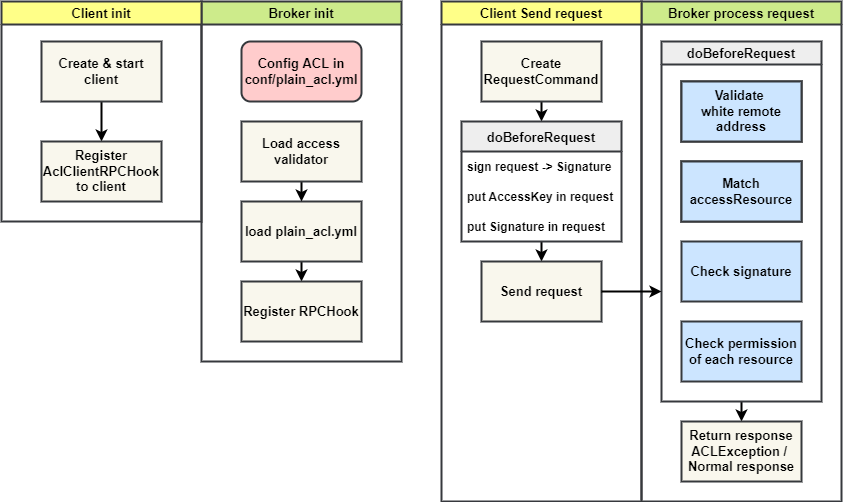
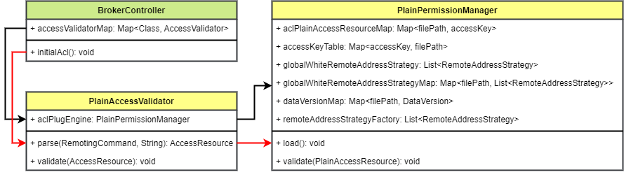

# RocketMQ ACL 权限控制 详解 & 源码剖析

[TOC]

## 1. 背景

很多网站、软件、应用都有自己的权限控制系统。一般来说用户会有自己的角色（用户组），每个角色有相应的权限集，只有拥有某种权限才能进行某些操作。随着消息队列的使用场景越来越广泛，消息队列的权限控制需求也也越来越迫切。

RocketMQ 再 4.4.0 版本引入了 ACL 模块，开始支持访问权限控制。ACL（Access Control List），即访问控制列表。RocketMQ 的 ACL 模块实现了一套简单访问控制功能，它包含用户、角色、权限、资源的概念，还支持按客户端 IP 段进行白名单控制。

如此一来，我们可以通过 ACL 来实现

本文介绍 RocketMQ ACL 模块的使用和实现原理，最后进行源码的解析。

## 2. 概述

### 2.1 基本概念

先来了解一下 RocketMQ ACL 中的概念。

我们设想这样一个场景：某公司运维团队维护了一个 RocketMQ 集群，为了保证集群的安全性，业务团队无法直接创建和修改 Topic，只能往自己申请的 Topic 上生产和消费。新建 Topic 需要提交申请由运维团队审批。这个简单的场景涉及了几个概念：用户（运维人员、开发人员）、角色（管理员、普通用户）、资源（Topic）、权限（修改 Topic 的权限、在 Topic 发送、接收消息的权限）

由此可以引出 RocketMQ ACL 中支持的 4 种概念：
1. 用户：访问控制的基本要素，包含用户名（AccessKey）、密码（SecretKey）
2. 角色：用户权限的集合，RocketMQ ACL 中定义了 2 中角色：管理员 / 非管理员
3. 资源：需要进行访问控制的对象。RocketMQ 中的 Topic 和 ConsumerGroup。
4. 权限：针对资源能进行的操作。RocketMQ 中主要指对 Topic 和 ConsumserGroup 的操作，包含如下 4 种。

| 权限 | 含义              |
| ---- | ----------------- |
| DENY | 拒绝              |
| ANY  | PUB 或者 SUB 权限 |
| PUB  | 发送权限          |
| SUB  | 订阅权限          |

此外，还包含白名单概念

* 白名单：客户端 IP 地址白名单，有全局和用户 2 种作用域。如果 Broker 接收到来自白名单中 IP 的请求，则直接放行，不进行后续的其他权限校验。

### 2.2 基本流程

RocketMQ 的权限控制由客户端和 Broker 端共同完成。

* Broker：Broker 端需要先在配置文件（conf/plain_acl.yml）中设置该 Broker 的访问权限配置。接收到客户端请求后根据配置的权限匹配，进行权限判断。
* 客户端：客户端需要标明每个请求的用户，具体的方法是通过 RPCHook 指定用户名和密码。

下面是 RocketMQ 进行权限控制的流程



#### 2.2.1 初始化

* **Broker 初始化**

  * Broker 初始化前，用户手动修改和配置 ACL 配置文件
  * 加载访问验证器 PlainAccessValidator
  * 读取配置文件，加载配置到内存。
  * 注册钩子函数，用作请求处理前的权限校验
  * 注意 Broker 会观察配置文件改动并且自动重新加载

* **客户端初始化**

  * 用户需手动配置一个 AclClientRPCHook，并指定用户名和密码参数。客户端初始化时注册该 AclClientRPCHook，用于在发送请求前在请求中加入验证信息。

#### 2.2.2 发送 / 处理请求

* **客户端发送请求**
  * 创建请求
  * 发送请求前执行 AclClientRPCHook 钩子函数的 before 方法
    * 对请求、用户名和密码进行签名
    * 将用户名和签名加入请求
  * 发送请求
* 服务端处理请求
  * 处理请求前执行注册的钩子函数，执行权限判断
  * 判断成功则正常返回，否则返回异常信息

### 2.3 使用方法

#### 2.3.1 Broker 端配置

首先需要在 `broker.conf` 中启动 Broker 的 ACL 功能。

```config
aclEnable=true
```

ACL 默认的配置文件名：`plain_acl.yml`，需要放在`{ROCKETMQ_HOME}/store/config`目录下。当前支持多配置文件，可以把不同业务的权限配置分别放在多个文件中。

下面为示例配置文件

```yaml
globalWhiteRemoteAddresses:
- 10.10.103.*
- 192.168.0.*

accounts:
- accessKey: RocketMQ
  secretKey: 12345678
  whiteRemoteAddress:
  admin: false
  defaultTopicPerm: DENY
  defaultGroupPerm: SUB
  topicPerms:
  - topicA=DENY
  - topicB=PUB|SUB
  - topicC=SUB
  groupPerms:
  # the group should convert to retry topic
  - groupA=DENY
  - groupB=PUB|SUB
  - groupC=SUB

- accessKey: rocketmq2
  secretKey: 12345678
  whiteRemoteAddress: 192.168.1.*
  # if it is admin, it could access all resources
  admin: true
```

可以看到配置文件主要分两个大项：

1. `globalWhiteRemoteAddresses`：用于配置全局客户端 IP 白名单
2. `accounts`：用来配置用户和用户权限

下面是配置的具体取值

| 字段                       | 取值                      | 含义                    |
| -------------------------- | ------------------------- | ----------------------- |
| globalWhiteRemoteAddresses | *;192.168.*.*;192.168.0.1 | 全局IP白名单            |
| accessKey                  | 字符串                    | Access Key              |
| secretKey                  | 字符串                    | Secret Key              |
| whiteRemoteAddress         | *;192.168.*.*;192.168.0.1 | 用户IP白名单            |
| admin                      | true;false                | 是否管理员账户          |
| defaultTopicPerm           | DENY;PUB;SUB;PUB\|SUB     | 默认的Topic权限         |
| defaultGroupPerm           | DENY;PUB;SUB;PUB\|SUB     | 默认的ConsumerGroup权限 |
| topicPerms                 | topic=权限                | 各个Topic的权限         |
| groupPerms                 | group=权限                | 各个ConsumerGroup的权限 |

#### 2.3.2 生产者使用

生产者和消费者使用 ACL，都需要用用户名和密码新建一个 AclClientRPCHook 对象，然后注册到客户端中。

```java
public class ACLProducerTest {
    private static final String ACL_ACCESS_KEY = "RocketMQ";
    private static final String ACL_SECRET_KEY = "12345678";

    public static void main(String[] args) throws MQClientException {
        // 将 AclClientHook 注册到客户端
        DefaultMQProducer producer = new DefaultMQProducer("ProducerGroupName", getAclRPCHook());
        producer.setNamesrvAddr("127.0.0.1:9876");
        producer.start();

        for (int i = 0; i < 128; i++)
            try {
                {
                    Message msg = new Message("topic0607",
                            "TagA",
                            "OrderID188",
                            "Hello world".getBytes(RemotingHelper.DEFAULT_CHARSET));
                    SendResult sendResult = producer.send(msg);
                    System.out.printf("%s%n", sendResult);
                }

            } catch (Exception e) {
                e.printStackTrace();
            }

        producer.shutdown();
    }

    // 新建 AclClientHook，配置用户名和密码
    static RPCHook getAclRPCHook() {
        return new AclClientRPCHook(new SessionCredentials(ACL_ACCESS_KEY, ACL_SECRET_KEY));
    }
}
```

#### 2.3.3 消费者使用

```java
public class ACLConsumerTest {
    private static final String ACL_ACCESS_KEY = "RocketMQ";
    private static final String ACL_SECRET_KEY = "12345678";

    public static void main(String[] args) throws MQClientException {
        // 将 AclClientHook 注册到客户端
        DefaultMQPushConsumer consumer = new DefaultMQPushConsumer("testGroup02", getAclRPCHook(), new AllocateMessageQueueAveragely());
        consumer.setNamesrvAddr("127.0.0.1:9876");
        consumer.subscribe("topic0607", "*");
        consumer.setConsumeFromWhere(ConsumeFromWhere.CONSUME_FROM_FIRST_OFFSET);
        consumer.registerMessageListener(new MessageListenerConcurrently() {

            @Override
            public ConsumeConcurrentlyStatus consumeMessage(List<MessageExt> msgs, ConsumeConcurrentlyContext context) {
                System.out.printf("%s Receive New Messages: %s %n", Thread.currentThread().getName(), msgs);
                return ConsumeConcurrentlyStatus.CONSUME_SUCCESS;
            }
        });
        consumer.start();
        System.out.printf("Consumer Started.%n");

    }

	// 新建 AclClientHook，配置用户名和密码
    static RPCHook getAclRPCHook() {
        return new AclClientRPCHook(new SessionCredentials(ACL_ACCESS_KEY,ACL_SECRET_KEY));
    }
}
```

## 3. 实现原理

这部分开始讲解 RocketMQ ACL 模块的实现原理，将会按照请求处理的先后顺序分为

1. 客户端 `AclClientRPCHook`
2. Broker 初始化 ACL 配置
3. Broker 权限验证

这几个部分。

### 3.1 客户端 AclClientRPCHook

客户端使用 ACL 功能时必须用 AccessKey 和 SecretKey 新建一个 `AclClientRPCHook`，这个 `RPCHook` 用于在发送请求前将该账号的用户名和密码信息放入请求中，以便 Broker 获取账号信息进行权限判断。

#### 3.1.1 注册 AclClientRPCHook

我们首先看一下客户端如何注册 `AclClientRPCHook`，让他能够在发送请求时起作用。

在 `NettyRemotingClient` 和 `NettyRemotingServer` 的抽象基类 `NettyRemotingAbstract` 中有一个 `rpcHooks` 列表，用于存放所有的 `RPCHook`。它会在处理请求的前后分别执行 `RPCHook` 的 before 和 after 方法。

注册 `AclClientRPCHook` 的逻辑会把这个 `RPCHook` 加入到 `rpcHooks` 列表里面。

#### 3.1.2 AclClientRPCHook 的逻辑

这个类仅定义了 before 逻辑。它会将请求的参数（header）和用户名密码参数打包，排序，然后进行签名。

> 相对应地，服务端收到请求后也会对请求参数进行排序，以同样的方法签名，通过比较签名的方式进行验证，防止请求数据被篡改。

随后会将签名和用户名加入到请求扩展属性中，然后发送请求。

### 3.2 Broker 初始化 ACL 配置

介绍 Broker 这边的 ACL 逻辑前，看一下 Broker ACL 相关的类。



其中红色线为初始化的方法调用链。

Broker 启动时会由 `BrokerController` 初始化 ACL 模块，加载所有的验证器。具体的方法是用 SPI 机制，读取 `METAINF/service/org.apache.rocketmq.acl.AccessValidator` 文件，加载 `AccessValidator` 的所有实现类。当前只有一个默认实现 `PlainAccessValidator`，用户也可以自己实现其他验证器。

`PlainAccessValidator` 初始化时会创建 `PlainPermissionManager` 对象，用它来解析权限配置文件（`plain_acl.yml`）。

`PlainPermissionManager` 会在初始化时加载目录中的所有配置文件，将权限配置信息加载到内存。同时，它会开启一个 `FileWatchService` 线程，用于每 0.5s 检测配置文件的变更，及时将变更加载到内存。

最后 Broker 将注册一个 RPCHook，在请求处理前后增加方法。在请求之前注册 `PlainAccessValidator` 的 `validate` 方法。这个 `validate` 方法中就包含了权限验证的逻辑。

### 3.3 Broker 权限验证


权限验证的逻辑在 `PlainAccessValidator` 的 `validate` 方法中，它会调用 `PlainPermissionManager` 的 `validate` 方法，传入的参数是客户端发送请求时指定的用户信息。下面是权限验证的步骤

1. 判断客户端 IP 是否在全局白名单中，如果匹配则直接放行
2. 判断该用户是否配置在权限控制列表中，如果不在则返回错误
3. 获取请求用户的访问控制权限，判断客户端 IP 是否在用户维度的白名单中，如果匹配则放行
4. 对请求参数验计算签名，验证与客户端计算的签名是否一致，不一致则返回异常
5. 验证资源访问权限，判断该用户是否有客户端请求的资源的相应操作权限

## 4. 源码解析

### 4.1 客户端 AclClientRPCHook

#### 4.1.1 注册 AclClientRPCHook

在 `NettyRemotingClient` 和 `NettyRemotingServer` 的抽象基类 `NettyRemotingAbstract` 中有一个 `rpcHooks` 列表，用于存放所有的 `RPCHook`。它会在处理请求的前后分别执行 `RPCHook` 的 before 和 after 方法。

注册 `AclClientRPCHook` 的逻辑会把这个 `RPCHook` 加入到 `rpcHooks` 列表里面。

```java
// NettyRemotingAbstract.java
protected List<RPCHook> rpcHooks = new ArrayList<RPCHook>();
```

```java
// NettyRemotingClient.java
@Override
public void registerRPCHook(RPCHook rpcHook) {
    if (rpcHook != null && !rpcHooks.contains(rpcHook)) {
        rpcHooks.add(rpcHook);
    }
}
```

Producer 端调用底层 API 发送命令的前后，调用 `RPCHook` 上面的 `doBeforeRequest` 和 `doAfterRequest` 方法，便于在发送命令的前后拦截

```java
// NettyRemotingClient.java
@Override
public RemotingCommand invokeSync(String addr, final RemotingCommand request, long timeoutMillis) {
    doBeforeRpcHooks(addr, request);
    // ...
    doAfterRpcHooks(RemotingHelper.parseChannelRemoteAddr(channel), request, response);   
}

protected void doBeforeRpcHooks(String addr, RemotingCommand request) {
    if (rpcHooks.size() > 0) {
        for (RPCHook rpcHook: rpcHooks) {
            rpcHook.doBeforeRequest(addr, request);
        }
    }
}

protected void doAfterRpcHooks(String addr, RemotingCommand request, RemotingCommand response) {
    if (rpcHooks.size() > 0) {
        for (RPCHook rpcHook: rpcHooks) {
            rpcHook.doAfterResponse(addr, request, response);
        }
    }
}
```

#### 4.1.2 AclClientRPCHook 的逻辑

仅定义了 before 逻辑。它会将请求的参数（header）和用户名密码参数打包，排序，然后进行签名。

* 首先 `parseRequestContent` 方法使用 `SortedMap` 将客户端的 AccessKey、SecurityToken 以及请求中 header 的属性进行排序
* 然后 `combineRequestContent` 方法会将上一步返回的 map 以及请求合并成一个 byte 数组
* `calSignature`方法会根据客户端的 `AccessKey` 以及上一步返回的 byte 数组生成一个签名
* 将生成的签名添加到请求的扩展属性中
* 将 AccessKey 添加到请求的扩展属性中

```java
@Override
public void doBeforeRequest(String remoteAddr, RemotingCommand request) {
    byte[] total = AclUtils.combineRequestContent(request,
        parseRequestContent(request, sessionCredentials.getAccessKey(), sessionCredentials.getSecurityToken()));
    String signature = AclUtils.calSignature(total, sessionCredentials.getSecretKey());
    request.addExtField(SIGNATURE, signature);
    request.addExtField(ACCESS_KEY, sessionCredentials.getAccessKey());
    
    // The SecurityToken value is unneccessary,user can choose this one.
    if (sessionCredentials.getSecurityToken() != null) {
        request.addExtField(SECURITY_TOKEN, sessionCredentials.getSecurityToken());
    }
}

protected SortedMap<String, String> parseRequestContent(RemotingCommand request, String ak, String securityToken) {
    CommandCustomHeader header = request.readCustomHeader();
    // Sort property
    SortedMap<String, String> map = new TreeMap<String, String>();
    map.put(ACCESS_KEY, ak);
    if (securityToken != null) {
        map.put(SECURITY_TOKEN, securityToken);
    }
    try {
        // Add header properties
        if (null != header) {
            Field[] fields = fieldCache.get(header.getClass());
            if (null == fields) {
                fields = header.getClass().getDeclaredFields();
                for (Field field : fields) {
                    field.setAccessible(true);
                }
                Field[] tmp = fieldCache.putIfAbsent(header.getClass(), fields);
                if (null != tmp) {
                    fields = tmp;
                }
            }

            for (Field field : fields) {
                Object value = field.get(header);
                if (null != value && !field.isSynthetic()) {
                    map.put(field.getName(), value.toString());
                }
            }
        }
        return map;
    } catch (Exception e) {
        throw new RuntimeException("incompatible exception.", e);
    }
}
```

### 4.2 Broker 初始化 ACL 配置

1. Broker 启动时会由 `BrokerController` 初始化 ACL 模块，加载所有的验证器。具体的方法是用 SPI 机制，读取 `METAINF/service/org.apache.rocketmq.acl.AccessValidator` 文件，加载 `AccessValidator` 的所有实现类。当前只有一个默认实现 `PlainAccessValidator`，用户也可以自己实现其他验证器。

```java
/**
  * ACL（访问控制列表）初始化
  */
private void initialAcl() {
    if (!this.brokerConfig.isAclEnable()) {
        log.info("The broker dose not enable acl");
        return;
    }

    // 使用SPI机制加载配置的AccessValidator实现类
    // 读取METAINF/service/org.apache.rocketmq.acl.AccessValidator文件中配置的访问验证器PlainAccessValidator
    List<AccessValidator> accessValidators = ServiceProvider.load(ServiceProvider.ACL_VALIDATOR_ID, AccessValidator.class);
    if (accessValidators == null || accessValidators.isEmpty()) {
        log.info("The broker dose not load the AccessValidator");
        return;
    }

    for (AccessValidator accessValidator: accessValidators) {
        final AccessValidator validator = accessValidator;
        accessValidatorMap.put(validator.getClass(),validator);
        // 向Broker处理服务启注册钩子函数
        this.registerServerRPCHook(new RPCHook() {
            /**
              * 在服务端接收到请求并解码后、执行处理请求前被调用
              */
            @Override
            public void doBeforeRequest(String remoteAddr, RemotingCommand request) {
                //Do not catch the exception
                validator.validate(validator.parse(request, remoteAddr));
            }

            /**
              * 在处理完请求后调用
              */
            @Override
            public void doAfterResponse(String remoteAddr, RemotingCommand request, RemotingCommand response) {
            }
        });
    }
}
```

2. `PlainAccessValidator` 初始化时会创建 `PlainPermissionManager` 对象，用它来解析权限配置文件（`plain_acl.yml`）。

3. `PlainPermissionManager` 会在初始化时加载目录中的所有配置文件，将权限配置信息加载到内存。同时，它会开启一个 `FileWatchService` 线程，用于每 0.5s 检测配置文件的变更，及时将变更加载到内存

```java
public PlainPermissionManager() {
    // 解析 yaml 文件，将配置加载到内存
    load();
    // 监听配置文件变化，如发生变化，重新加载配置
    watch();
}
```

#### 4.2.1 PlainPermissonManager 的字段含义


其中红色线为初始化的方法调用链。下面看一下 `PlainPermissonManager` 中字段的含义，由于支持了从多文件加载权限配置，所以这些配置大多为 Map 类型，Key 是文件路径，Value 是文件中包含的权限配置。

```java
// PlainPermissionManager.java
// 权限映射配置表，用来缓存所有ACL配置文件的权限数据
private Map<String/** fileFullPath **/, Map<String/** AccessKey **/, PlainAccessResource>> aclPlainAccessResourceMap = new HashMap<>();

// 用来缓存 AccessKey 和 ACL 配置文件的映射关系
private Map<String/** AccessKey **/, String/** fileFullPath **/> accessKeyTable = new HashMap<>();

// 用来缓存所有 ACL 配置文件的全局白名单
private List<RemoteAddressStrategy> globalWhiteRemoteAddressStrategy = new ArrayList<>();

// 远程 IP 解析策略工厂，用于解析白名单 IP 地址
private RemoteAddressStrategyFactory remoteAddressStrategyFactory = new RemoteAddressStrategyFactory();

// 缓存 ACL 配置文件和全局白名单的映射关系
private Map<String/** fileFullPath **/, List<RemoteAddressStrategy>> globalWhiteRemoteAddressStrategyMap = new HashMap<>();

// 是否监听 acl 配置文件。如果开启监听，一旦文件内容改变，可以在不重启服务的情况下自动生效
private boolean isWatchStart;

// 配置文件版本号表
private Map<String/** fileFullPath **/, DataVersion> dataVersionMap = new HashMap<>();
```

- aclPlainAccessResourceMap

aclPlainAccessResourceMap是个Map类型，用来缓存所有ACL配置文件的权限数据，其中key表示ACL配置文件的绝对路径， value表示相应配置文件中的权限数据，需要注意的是value也是一个Map类型，其中key是String类型表示AccessKey，value是PlainAccessResource类型。

- accessKeyTable

accessKeyTable是个Map类型，用来缓存AccessKey和ACL配置文件的映射关系，其中key表示AccessKey，value表示ACL配置文件的绝对路径。

- globalWhiteRemoteAddressStrategy

globalWhiteRemoteAddressStrategy用来缓存所有ACL配置文件的全局白名单。

- globalWhiteRemoteAddressStrategyMap

globalWhiteRemoteAddressStrategyMap是个Map类型，用来缓存ACL配置文件和全局白名单的映射关系

- dataVersionMap

dataVersionMap是个Map类型，用来缓存所有ACL配置文件的DataVersion，其中key表示ACL配置文件的绝对路径，value表示该配置文件对应的DataVersion。

#### 4.2.2 PlainPermissonManager#load

它有两个 load 方法，分别用于重新加载全部文件，和重载一个文件的配置。

- `load()`
  * `load()` 方法会获取 `RocketMQ安装目录/conf` 目录（包括该目录的子目录）和 `rocketmq.acl.plain.file` 下所有ACL配置文件，然后遍历这些文件读取权限数据和全局白名单。

- `load(String aclFilePath)`
  * `load(String aclFilePath)` 方法完成加载指定ACL配置文件内容的功能，将配置文件中的全局白名单 `globalWhiteRemoteAddresses` 和用户权限 `accounts` 加载到缓存中， 这里需要注意以下几点：

1. 判断缓存中该配置文件的全局白名单 `globalWhiteRemoteAddresses` 和用户权限`accounts` 数据是否为空，如果不为空则需要注意删除文件原有数据

2. 相同的 `accessKey` 只允许存在在一个ACL配置文件中

```java
/**
 * 解析所有 ACL 配置文件，将 ACL 配置规则加载到内存
 */
public void load() {
    if (fileHome == null || fileHome.isEmpty()) {
        return;
    }

    // 定义临时变量，用于暂存解析出来的 ACL 配置。这里没有直接覆盖全局配置，是为了防止全局配置在未解析完全的情况下被读取
    Map<String, Map<String, PlainAccessResource>> aclPlainAccessResourceMap = new HashMap<>();
    Map<String, String> accessKeyTable = new HashMap<>();
    List<RemoteAddressStrategy> globalWhiteRemoteAddressStrategy = new ArrayList<>();
    Map<String, List<RemoteAddressStrategy>> globalWhiteRemoteAddressStrategyMap = new HashMap<>();
    Map<String, DataVersion> dataVersionMap = new HashMap<>();

    // 获取所有 ACL 配置文件
    fileList = getAllAclFiles(defaultAclDir);
    if (new File(defaultAclFile).exists() && !fileList.contains(defaultAclFile)) {
        fileList.add(defaultAclFile);
    }

    // 遍历 ACL 配置文件，解析配置
    for (int i = 0; i < fileList.size(); i++) {
        JSONObject plainAclConfData = AclUtils.getYamlDataObject(fileList.get(i),
                                                                 JSONObject.class);
        if (plainAclConfData == null || plainAclConfData.isEmpty()) {
            throw new AclException(String.format("%s file is not data", fileList.get(i)));
        }
        log.info("Broker plain acl conf data is : ", plainAclConfData.toString());

        // 解析全局 IP 白名单配置
        List<RemoteAddressStrategy> globalWhiteRemoteAddressStrategyList = new ArrayList<>();
        JSONArray globalWhiteRemoteAddressesList = plainAclConfData.getJSONArray("globalWhiteRemoteAddresses");
        if (globalWhiteRemoteAddressesList != null && !globalWhiteRemoteAddressesList.isEmpty()) {
            for (int j = 0; j < globalWhiteRemoteAddressesList.size(); j++) {
                globalWhiteRemoteAddressStrategyList.add(remoteAddressStrategyFactory.
                                                         getRemoteAddressStrategy(globalWhiteRemoteAddressesList.getString(j)));
            }
        }
        if (globalWhiteRemoteAddressStrategyList.size() > 0) {
            globalWhiteRemoteAddressStrategyMap.put(fileList.get(i), globalWhiteRemoteAddressStrategyList);
            globalWhiteRemoteAddressStrategy.addAll(globalWhiteRemoteAddressStrategyList);
        }

        // 解析账号权限配置
        JSONArray accounts = plainAclConfData.getJSONArray(AclConstants.CONFIG_ACCOUNTS);
        Map<String, PlainAccessResource> plainAccessResourceMap = new HashMap<>();
        if (accounts != null && !accounts.isEmpty()) {
            List<PlainAccessConfig> plainAccessConfigList = accounts.toJavaList(PlainAccessConfig.class);
            for (PlainAccessConfig plainAccessConfig : plainAccessConfigList) {
                PlainAccessResource plainAccessResource = buildPlainAccessResource(plainAccessConfig);
                //AccessKey can not be defined in multiple ACL files
                if (accessKeyTable.get(plainAccessResource.getAccessKey()) == null) {
                    plainAccessResourceMap.put(plainAccessResource.getAccessKey(), plainAccessResource);
                    accessKeyTable.put(plainAccessResource.getAccessKey(), fileList.get(i));
                } else {
                    log.warn("The accesssKey {} is repeated in multiple ACL files", plainAccessResource.getAccessKey());
                }
            }
        }
        if (plainAccessResourceMap.size() > 0) {
            aclPlainAccessResourceMap.put(fileList.get(i), plainAccessResourceMap);
        }

        // 解析数据版本
        JSONArray tempDataVersion = plainAclConfData.getJSONArray(AclConstants.CONFIG_DATA_VERSION);
        DataVersion dataVersion = new DataVersion();
        if (tempDataVersion != null && !tempDataVersion.isEmpty()) {
            List<DataVersion> dataVersions = tempDataVersion.toJavaList(DataVersion.class);
            DataVersion firstElement = dataVersions.get(0);
            dataVersion.assignNewOne(firstElement);
        }
        dataVersionMap.put(fileList.get(i), dataVersion);
    }

    if (dataVersionMap.containsKey(defaultAclFile)) {
        this.dataVersion.assignNewOne(dataVersionMap.get(defaultAclFile));
    }
    // 刷新全局配置
    this.dataVersionMap = dataVersionMap;
    this.globalWhiteRemoteAddressStrategyMap = globalWhiteRemoteAddressStrategyMap;
    this.globalWhiteRemoteAddressStrategy = globalWhiteRemoteAddressStrategy;
    this.aclPlainAccessResourceMap = aclPlainAccessResourceMap;
    this.accessKeyTable = accessKeyTable;
}
```

#### 4.2.3 PlainPermissonManager#watch

`watch()` 方法用来监控 `RocketMQ安装目录/conf` 目录下所有ACL配置文件和 `rocketmq.acl.plain.file` 是否发生变化。

变化考虑两种情况：

1. ACL 配置文件的数量发生变化， 此时会调用 `load()` 方法重新加载所有配置文件的数据
2. 一种是配置文件的内容发生变化，调用 `load(String aclFilePath)` 加载单个文件的配置。

具体完成监控ACL配置文件变化的是 `AclFileWatchService` 服务， 该服务是一个线程，当启动该服务后它会以 `WATCH_INTERVAL`（该参数目前设置为5秒，目前还不能在Broker配置文件中设置）的时间间隔来执行其核心逻辑。

在该服务中会记录其监控的ACL配置文件目录 `aclPath`、 ACL配置文件的数量 `aclFilesNum`、所有ACL配置文件绝对路径 `fileList` 以及每个ACL配置文件最近一次修改的时间 `fileLastModifiedTime` （Map类型，key为ACL配置文件的绝对路径，value为其最近一次修改时间）。 

该服务的核心逻辑如下： 

* 获取ACL配置文件数量并和 `aclFilesNum` 进行比较是否相等
  * 不相等则更新 `aclFilesNum和fileList` 并调用 `load()` 方法重新加载所有配置文件
  * 相等则遍历每个ACL配置文件，获取其最近一次修改的时间，并将该时间与 `fileLastModifiedTime`中记录的时间进行比较
    * 不相等则表示该文件发生过修改， 此时调用 `load(String aclFilePath)` 方法重新加载该配置文件。

```java
// PlainPermissionManager.java
/**
 * 监听ACL配置文件变化，重新load
 */
private void watch() {
    try {
        AclFileWatchService aclFileWatchService = new AclFileWatchService(defaultAclDir, defaultAclFile, new AclFileWatchService.Listener() {
            @Override
            public void onFileChanged(String aclFileName) {
                load(aclFileName);
            }

            @Override
            public void onFileNumChanged(String path) {
                load();
            }
        });
        aclFileWatchService.start();
        log.info("Succeed to start AclFileWatchService");
        this.isWatchStart = true;
    } catch (Exception e) {
        log.error("Failed to start AclWatcherService", e);
    }
}
```

```java
// AclFileWatchService.java
@Override
public void run() {
    log.info(this.getServiceName() + " service started");

    while (!this.isStopped()) {
        try {
            this.waitForRunning(WATCH_INTERVAL);

            if (fileList.size() > 0) {
                fileList.clear();
            }
            getAllAclFiles(aclPath);
            if (new File(defaultAclFile).exists() && !fileList.contains(defaultAclFile)) {
                fileList.add(defaultAclFile);
            }
            int realAclFilesNum = fileList.size();

            if (aclFilesNum != realAclFilesNum) {
                log.info("aclFilesNum: " + aclFilesNum + "  realAclFilesNum: " + realAclFilesNum);
                aclFilesNum = realAclFilesNum;
                log.info("aclFilesNum: " + aclFilesNum + "  realAclFilesNum: " + realAclFilesNum);
                Map<String, Long> fileLastModifiedTime = new HashMap<>(realAclFilesNum);
                for (int i = 0; i < realAclFilesNum; i++) {
                    String fileAbsolutePath = fileList.get(i);
                    fileLastModifiedTime.put(fileAbsolutePath, new File(fileAbsolutePath).lastModified());
                }
                this.fileLastModifiedTime = fileLastModifiedTime;
                listener.onFileNumChanged(aclPath);
            } else {
                for (int i = 0; i < aclFilesNum; i++) {
                    String fileName = fileList.get(i);
                    Long newLastModifiedTime = new File(fileName).lastModified();
                    if (!newLastModifiedTime.equals(fileLastModifiedTime.get(fileName))) {
                        fileLastModifiedTime.put(fileName, newLastModifiedTime);
                        listener.onFileChanged(fileName);
                    }
                }
            }
        } catch (Exception e) {
            log.warn(this.getServiceName() + " service has exception. ", e);
        }
    }
    log.info(this.getServiceName() + " service end");
}
```


### 4.3 Broker 权限验证

Broker 权限验证主要逻辑都在 `PlainPermissionManager#validate` 方法中

1. 判断客户端 IP 是否在全局白名单中，如果匹配则直接放行
2. 判断该用户是否配置在权限控制列表中，如果不在则返回错误
3. 获取请求用户的访问控制权限，判断客户端 IP 是否在用户维度的白名单中，如果匹配则放行
4. 对请求参数验计算签名，验证与客户端计算的签名是否一致，不一致则返回异常
5. 验证资源访问权限，判断该用户是否有客户端请求的资源的相应操作权限

```java
public void validate(PlainAccessResource plainAccessResource) {

    // Check the global white remote addr
    for (RemoteAddressStrategy remoteAddressStrategy : globalWhiteRemoteAddressStrategy) {
        if (remoteAddressStrategy.match(plainAccessResource)) {
            return;
        }
    }

    if (plainAccessResource.getAccessKey() == null) {
        throw new AclException(String.format("No accessKey is configured"));
    }

    if (!accessKeyTable.containsKey(plainAccessResource.getAccessKey())) {
        throw new AclException(String.format("No acl config for %s", plainAccessResource.getAccessKey()));
    }

    // Check the white addr for accesskey
    String aclFileName = accessKeyTable.get(plainAccessResource.getAccessKey());
    PlainAccessResource ownedAccess = aclPlainAccessResourceMap.get(aclFileName).get(plainAccessResource.getAccessKey());
    if (ownedAccess.getRemoteAddressStrategy().match(plainAccessResource)) {
        return;
    }

    // Check the signature
    String signature = AclUtils.calSignature(plainAccessResource.getContent(), ownedAccess.getSecretKey());
    if (!signature.equals(plainAccessResource.getSignature())) {
        throw new AclException(String.format("Check signature failed for accessKey=%s", plainAccessResource.getAccessKey()));
    }
    // Check perm of each resource

    checkPerm(plainAccessResource, ownedAccess);
}
```

`checkPerm(PlainAccessResource needCheckedAccess, PlainAccessResource ownedAccess)` 方法完成验证账号是否有该资源访问权限的逻辑。

```java
/**
 * 验证是否有某资源的访问权限
 * 
 * @param needCheckedAccess 客户端请求需要的资源权限
 * @param ownedAccess 该账号拥有的资源权限
 */
void checkPerm(PlainAccessResource needCheckedAccess, PlainAccessResource ownedAccess) {
    if (Permission.needAdminPerm(needCheckedAccess.getRequestCode()) && !ownedAccess.isAdmin()) {
        throw new AclException(String.format("Need admin permission for request code=%d, but accessKey=%s is not", needCheckedAccess.getRequestCode(), ownedAccess.getAccessKey()));
    }
    Map<String, Byte> needCheckedPermMap = needCheckedAccess.getResourcePermMap();
    Map<String, Byte> ownedPermMap = ownedAccess.getResourcePermMap();

    // 本次操作无需权限验证，直接通过
    if (needCheckedPermMap == null) {
        // If the needCheckedPermMap is null,then return
        return;
    }

    // 该账号未设置任何访问规则，且用户是管理员，直接通过
    if (ownedPermMap == null && ownedAccess.isAdmin()) {
        // If the ownedPermMap is null and it is an admin user, then return
        return;
    }

    // 遍历需要的权限与拥有的权限进行对比
    for (Map.Entry<String, Byte> needCheckedEntry : needCheckedPermMap.entrySet()) {
        String resource = needCheckedEntry.getKey();
        Byte neededPerm = needCheckedEntry.getValue();
        boolean isGroup = PlainAccessResource.isRetryTopic(resource);

        if (ownedPermMap == null || !ownedPermMap.containsKey(resource)) {
            // Check the default perm
            byte ownedPerm = isGroup ? ownedAccess.getDefaultGroupPerm() :
                ownedAccess.getDefaultTopicPerm();
            if (!Permission.checkPermission(neededPerm, ownedPerm)) {
                throw new AclException(String.format("No default permission for %s", PlainAccessResource.printStr(resource, isGroup)));
            }
            continue;
        }
        if (!Permission.checkPermission(neededPerm, ownedPermMap.get(resource))) {
            throw new AclException(String.format("No default permission for %s", PlainAccessResource.printStr(resource, isGroup)));
        }
    }
}
```

## 参考资料

* [权限控制——官网文档](https://github.com/apache/rocketmq/blob/develop/docs/cn/acl/user_guide.md)
* [RocketMQ_Multiple_ACL_Files_设计](https://github.com/apache/rocketmq/blob/develop/docs/cn/acl/RocketMQ_Multiple_ACL_Files_%E8%AE%BE%E8%AE%A1.md)
* [RocketMQ ACL使用指南](https://blog.csdn.net/prestigeding/article/details/94317946)
* [源码分析RocketMQ ACL实现机制](https://blog.csdn.net/prestigeding/article/details/94975796)
* [RocketMQ 源码分析之 ACL](https://blog.csdn.net/qq_25145759/article/details/117519379)
* [RocketMQ ACL 权限控制](https://kunzhao.org/docs/rocketmq/rocketmq-acl/)
