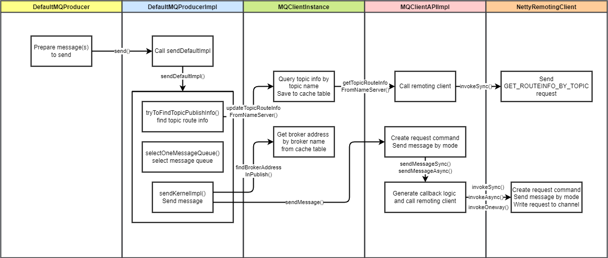

# RocketMQ 消息发送设计和原理详解 源码剖析

[TOC]

## 1. 背景

发送消息是 MQ 最基础的操作之一。RocketMQ 官方提供了多语言客户端支持消息的发送和消费操作。
当然，消息发送并不仅仅牵扯到客户端操作。客户端做的是向 Broker 发送请求，请求中包含了消息的全部信息。而 Broker 需要处理客户端发送来的生产请求，将消息存储起来。
在这篇文章中我将解析消息发送流程中生产者和 Broker 的处理流程，揭秘 RocketMQ 消息发送高性能、高可靠的原理。

## 2. 概述

RocketMQ 的 Java 客户端提供了丰富的消息发送 API，支持多种消息发送的方式和特殊消息的发送。
包括 3 种发送方式（同步、异步、单向）和多种特殊消息（顺序消息、延时消息、批量消息、过滤消息、事务消息）。
对于客户端消息发送 API 的具体使用方式，可以参考官方文档：[https://github.com/apache/rocketmq/blob/develop/docs/cn/RocketMQ_Example.md](https://github.com/apache/rocketmq/blob/develop/docs/cn/RocketMQ_Example.md)。

### 2.1 消息发送方式和特殊消息

#### 2.1.1 三种消息发送方式

RocketMQ 支持 3 种消息发送方式：同步、异步和单向。

1. 同步（Sync）
   * 发送消息时，同步等待，直到 Broker 返回发送结果。
   * 这种方式最为可靠，但是发送性能最差。
   * 在一些可靠性要求非常高的场景下，推荐使用同步方式。比如：重要的消息通知，短信通知。
2. 异步（Async）
   * 发送消息时，无需等待 Broker 返回发送结果，发送线程不阻塞。执行发送 API 时指定消息发送成功后的回调函数。
   * 这种方式相比于同步发送，性能可以提升多个数量级，但可靠性不如同步发送。
   * 在对响应时间敏感、流量较大的场景下，推荐使用异步方式。异步发送是使用最广泛的发送方式。
3. 单向（One-way）
   * 发送消息时，直接返回，不等待 Broker 返回发送结果，也不注册回调函数。
   * 这种发送方式性能最高，可靠性最差。它不关心发送结果，不在乎消息是否成功存储在 Broker 中。
   * 适用于消息丢失也没有太大影响的场景，例如发送日志。

这三种发送方式中，异步发送是最为广泛使用的发送方式。配合一些重试和补偿机制，可以达成较高的可靠性和很高的性能。

#### 2.1.2 特殊消息类型

下面简单介绍一下几种特殊消息类型。

1. 普通消息：发送效率最高、使用场景最广泛的消息类型。普通消息可以由客户端并发发送。不保证普通消息消费的顺序。单 Broker 性能可以达到十万级别。（视 Broker 配置而变）
2. 队列级别顺序消息：RocketMQ 将一个 Topic 分为多个队列，以提高消费速度。每隔分区内的消息遵循先生产先消费的顺序。
3. Topic 级别顺序消息：如果把一个 Topic 的队列数量设为 1，那么该 Topic 中的消息也遵循先生产先消费。
4. 延迟消息：消息发送后，消费者并不马上收到消息，而是等待一段指定的时间之后才能消费到该消息。
5. 事务消息：提供分布式事务功能，可以保证发送消息和另外的操作同时成功或者同时失败。
6. 批量消息：将多个消息包装成一个批量消息，一起发送。降低网络传输次数，提升传输效率。

### 2.2 路由机制

RocketMQ 的 Topic 可以分为多个队列，每个队列可能分布在不同 Broker 上。

消息的路由指的是发送消息时需要先获取 Topic 的路由信息（其中包含每个 Topic 的队列和它们所在的 Broker 地址），然后选择一个队列进行发送。

消息发送的 API 提供了参数，可以传入要发送的队列信息，或者传入队列选择方法，以供用户选择发往某个 Broker 的具体队列。
### 2.3 消息发送流程

消息发送的流程涉及到 RocketMQ 的三个组件：生产者、Broker、NameServer。
其中生产者负责发送消息，Broker 负责处理消息发送请求，NameServer 负责更新和提供路由信息。


如图所示
* 生产者每 30 秒向 NameServer 拉取路由信息，Broker 每 30 秒向 NameServer 发送路由信息。
* 生产者发送消息时，会先在本地查询 Topic 路由信息。
* 如果查询不到，会请求 NameServer 查询。
* 随后将消息发送给 Broker。
* Broker 也会在本地查询 Topic 路由信息来检查消息的 Topic 是否存在。
* 随后保存消息，如果是异步发送则直接返回，如果同步发送则等待消息保存成功后返回。

### 2.4 高可用设计

#### 2.4.1 生产者高可用

* 消息发送重试机制：生产者在消息发送时如果出现失败，默认会重试 2 次。
* 故障规避机制：如果重试的消息仍发往同一个 Broker，发送大概率还是会失败，所以在重试时会尽量避开刚刚发送失败的 Broker。
  * 可以通过配置故障延迟机制来指定是在本次消息发送时暂时避开发送失败的 Broker，还是在之后一段时间都避开该 Broker


#### 2.4.2 Broker 端高可用

Broker 端的高可用是用数据同步的方式，将消息同步到备 Broker 上，当主 Broker 发生故障时，可以从备 Broker 上恢复数据。

## 3. 详细设计

### 3.1 消息


RocketMQ 中的消息类主要有 3 个

* `Message` 为客户端需要使用的消息类。
* `MessageExt` 为消息扩展属性类，它扩展了 `Message`，在 Broker 上产生此对象。
* `MessageExtBrokerInner` 是存储内部使用的 Message 对象，在 rocketmq-store 模块使用。 

在发送消息时，用到的是 `Message`，可以指定消息的属性、消息体和 flag。

### 3.2 生产者类图


* `DefaultMQProducer` 是 RocketMQ 中默认的生产者实现，它实现了 MQAdmin 接口。
* `DefaultMQProducer` 内部包装了一个 `DefaultMQProducerImpl` 字段，它是生产者的具体实现类，`DefaultMQProducer` 调用它内部的 `DefaultMQProducerImpl` 来发送命令。
* `DefaultMQProducerImpl` 内部注册了一个 `MQClientInstance` 字段。`MQClientInstance` 是与 NameServer 和 Broker 通信的中介。 `MQClientInstance` 与 `ClientId` 一一对应，`ClientId` 由 `clientIp`、`instanceName`、`unitName` 组成。如果不手动修改，一般来说一个启动的客户端进程只有一个 `MQClientInstance` 实例，这样可以节省客户端资源。
* `MQClientInstnace` 内部的 `producerTable` 注册了 ClientId 和 `DefaultMQProducerImpl` 的对应关系
* `MQClientAPIImpl` 提供了发送消息的 API，它调用 `RemotingClient` 执行发送。

### 3.3 生产者启动


1. 构造 `DefaultMQProducer` 实例，`start()` 启动
2. 初始化 `DefaultMQProducerImpl`，设置状态为 `CREATE_JUST`
3. 启动 `DefaultMQProducerImpl`
4. 检查配置
5. 根据 `ClientId` 获取或创建 `MQClientInstance`
6. 将 `DefaultMQProducerImpl` 注册到 `MQClientInstance`
7. 启动 `MQClientInstance`，`MQClientInstance` 启动定时任务，包括从 NameServer 拉取 Topic 路由信息、向 Broker 发送心跳
8. `MQClientInstance` 启动 `PullMessageService` 和 `RebalanceService`
11. 设置服务状态为 `RUNNING`

### 3.4 消息发送

RocketMQ 的消息发送流程图如下图所示：



其中 `MQProducerImpl` 负责执行核心的消息发送方法 `sendDefaultImpl`

这个方法中包含了消息发送的核心逻辑

1. 查找 Topic 路由信息
2. 选择消息队列
3. 发送消息

#### 3.4.1 查找 Topic 路由信息

指定 Topic 发送消息后，生产者需要知道消息要发往哪个 Broker 地址。于是需要获取 Topic 路由信息，查询 Topic 所在的 Broker，随后选择一个 Broker 进行发送。该逻辑在 `DefaultMQProducerImpl#tryToFindTopicPublishInfo()` 中执行。

在第一次发送消息时，本地没有缓存 Topic 路由信息，所以需要主动从 NameServer 拉取，然后更新到本地路由表缓存。随后生产者会启动定时任务，每隔 30s 重新从 NameServer 拉取路由信息。

注意，第一次查询 NameServer 时，如果没有拉取到 Topic 路由信息，则会使用默认 Topic（`AUTO_CREATE_TOPIC_KEY_TOPIC`）再次查询。

>默认 Topic 在 Broker 启动时创建，是为自动创建主题运用的。
>它的目的是在主题没有被创建时，让生产者发送消息时也能够查询到 Broker 地址。
>然后等消息真正发送到 Broker 时，会根据消息的 Topic 创建主题。

如果最终都没有拉取到 Topic 路由信息，则会抛出异常。

#### 3.4.2 重试机制

同步发送和异步发送的重试次数分别由 `retryTimesWhenSendFailed` 和 `retryTimesWhenSendAsyncFailed` 指定，默认都为 2 次（发送 1 次，重试 1 次）。

* 同步发送的重试逻辑即在 `sendDefaultImpl()` 方法中循环发送执行发送逻辑。
* 异步发送的重试逻辑在 `MQClientAPIIpml()` 的`sendMessageAsync()` 构造的回调方法中指定。它调用 `onExceptionImpl()` 方法，如果当前发送次数小于异步发送重试次数，则再次执行 `sendMessageAsync()` 重试发送。

#### 3.4.3 选择消息队列：故障延迟机制

获取到 Topic 路由信息后，需要从中选择一个队列进行发送。选择队列的逻辑由 `MQFaultStrategy#selectOneMessageQueue()`处理，它用来处理 Broker 的**队列选择**和**故障延迟机制**。

**默认机制**

默认机制下，按照轮询的方式选择队列。如果上一次发送成功，选择下一个队列。如果上一次发送失败，会规避上一次发送的 `MessageQueue ` 所在的 Broker。

**故障延迟机制**

故障延迟机制是为了能够在消息发送的时候尽量避开上次发送失败的 Broker，它由 `sendLatencyFaultEnable`  参数来设置开启，默认为关闭状态。

* 关闭：发送一次消息失败后，会在本次消息发送过程中避开该 Broker，但下次发送消息时还会继续尝试。
* 开启：发送一次消息失败后，会悲观地认为 Broker 不可用，在接下来一段时间内都不再向其发送消息。随着发送失败次数的增多，规避时间将越来越长。

#### 3.4.4 发送消息

消息发送逻辑由 `DefaultMQProducerImpl#sendKernelImpl()` 处理。

1. 先根据上一步选择的队列，查询 `MQClientInstance` 获取对应的 Broker 地址（先查本地缓存，如果没有则从 NameServer 拉取）。
2. 设置消息的全局唯一 ID，然后对于超过 4KB （默认）的消息执行 zip 压缩。
3. 执行发送之前的钩子函数 `executeSendMessageHookBefore()`，如消息轨迹的处理逻辑就在这里进行处理。
4. 构建消息请求（头）
4. 根据消息发送方式调用 `MQClientAPIImpl` 进行网络传输
4. 执行消息发送后的钩子函数

`MQClientAPIImpl` 负责调用 `NettyRemotingClient` 将生产消息的请求发往 Broker。

### 3.5 Broker 处理发送请求

Broker 通过 `SendMessageProcessor` 处理生产者发来的消息生产请求。当前使用 `asyncSendMessage()` 异步处理生产者发送过来的请求。

RocketMQ 的 Netty 请求处理机制会按照业务逻辑进行处理器的拆分。具体地说，RocketMQ 为不同的请求类型（请求码）注册不同的业务处理器和线程池去处理。比如消息生产的请求由 `sendMessageExecutor` 线程池处理，消费请求由 `pullMessageExecutor` 处理……

Broker 处理消息生产请求逻辑如下：

1. 检查消息合理性
2. 如果消息重试次数超过允许的最大重试次数，将进入死信队列。
3. 调用存储模块将消息存储

### 3.6 Batch 消息（批量消息）

为了减少网络请求次数，RocketMQ 支持将统一主题的一批消息打包发送。对于每条消息较小且消息较多的场景，使用批量发送可以提升发送效率。

批量消息 `MessageBatch` 类继承普通消息类 `Message`，内部仅仅多了消息列表 `List<Message> messages`。这样就可以像发送普通消息一样发送批量消息。发送前需要做的就是将多条普通消息体编码，放到 `MessageBatch` 的消息体中。

服务端接收到后，按照相同规则对批量消息进行解码，即可解码出多条消息。

## 4. 源码解析

### 4.1 生产者启动

#### 4.1.1 DefaultMQProducerImpl#start

```java
// DefaultMQProducerImpl.java
public void start(final boolean startFactory) throws MQClientException {
    switch (this.serviceState) {
        // 如果状态为 CREATE_JUST，执行启动逻辑。该对象创建时默认状态为 CREATE_JUST
        case CREATE_JUST:
            this.serviceState = ServiceState.START_FAILED;

            // 检查 producerGroup 是否合法
            this.checkConfig();

            // 改变生产者的 instanceName 为进程 ID，避免同一个服务器上的多个生产者实例名相同
            if (!this.defaultMQProducer.getProducerGroup().equals(MixAll.CLIENT_INNER_PRODUCER_GROUP)) {
                this.defaultMQProducer.changeInstanceNameToPID();
            }

            // 创建 MQClientInstance 实例
            this.mQClientFactory = MQClientManager.getInstance().getOrCreateMQClientInstance(this.defaultMQProducer, rpcHook);

            // 向 MQClientInstance 注册服务，将当前生产者加入 MQClientInstance 管理（加入 MQClientInstance.producerTable）
            // 方便后续调用网络请求、进行心跳检测等
            boolean registerOK = mQClientFactory.registerProducer(this.defaultMQProducer.getProducerGroup(), this);
            if (!registerOK) {
                this.serviceState = ServiceState.CREATE_JUST;
                throw new MQClientException("The producer group[" + this.defaultMQProducer.getProducerGroup()
                                            + "] has been created before, specify another name please." + FAQUrl.suggestTodo(FAQUrl.GROUP_NAME_DUPLICATE_URL),
                                            null);
            }

            this.topicPublishInfoTable.put(this.defaultMQProducer.getCreateTopicKey(), new TopicPublishInfo());

            // 启动 MQClientInstance，如果已经启动，则不会执行
            if (startFactory) {
                mQClientFactory.start();
            }

            log.info("the producer [{}] start OK. sendMessageWithVIPChannel={}", this.defaultMQProducer.getProducerGroup(),
                     this.defaultMQProducer.isSendMessageWithVIPChannel());
            // 设置服务状态为 RUNNING
            this.serviceState = ServiceState.RUNNING;
            break;
        case RUNNING:
        case START_FAILED:
        case SHUTDOWN_ALREADY:
            throw new MQClientException("The producer service state not OK, maybe started once, "
                                        + this.serviceState
                                        + FAQUrl.suggestTodo(FAQUrl.CLIENT_SERVICE_NOT_OK),
                                        null);
        default:
            break;
    }

    // 启动后马上向 NameServer 发送心跳
    this.mQClientFactory.sendHeartbeatToAllBrokerWithLock();

    RequestFutureHolder.getInstance().startScheduledTask(this);

}
```

#### 4.1.2 MQClientException

```java
/**
 * 启动客户端代理
 *
 * @throws MQClientException
 */
public void start() throws MQClientException {

    synchronized (this) {
        switch (this.serviceState) {
            case CREATE_JUST:
                this.serviceState = ServiceState.START_FAILED;
                // If not specified,looking address from name server
                if (null == this.clientConfig.getNamesrvAddr()) {
                    this.mQClientAPIImpl.fetchNameServerAddr();
                }
                // Start request-response channel
                this.mQClientAPIImpl.start();
                // Start various schedule tasks
                this.startScheduledTask();
                // Start pull service
                this.pullMessageService.start();
                // Start rebalance service
                this.rebalanceService.start();
                // Start push service
                // 当消费失败的时候，需要把消息发回去
                this.defaultMQProducer.getDefaultMQProducerImpl().start(false);
                log.info("the client factory [{}] start OK", this.clientId);
                this.serviceState = ServiceState.RUNNING;
                break;
            case START_FAILED:
                throw new MQClientException("The Factory object[" + this.getClientId() + "] has been created before, and failed.", null);
            default:
                break;
        }
    }
}

/**
 * 启动定时任务
 */
private void startScheduledTask() {
    if (null == this.clientConfig.getNamesrvAddr()) {
        this.scheduledExecutorService.scheduleAtFixedRate(new Runnable() {

            @Override
            public void run() {
                try {
                    MQClientInstance.this.mQClientAPIImpl.fetchNameServerAddr();
                } catch (Exception e) {
                    log.error("ScheduledTask fetchNameServerAddr exception", e);
                }
            }
        }, 1000 * 10, 1000 * 60 * 2, TimeUnit.MILLISECONDS);
    }

    /**
     * 默认每30s从nameserver获取Topic路由信息
     * 包括 生产者和消费者
     */
    this.scheduledExecutorService.scheduleAtFixedRate(new Runnable() {

        @Override
        public void run() {
            try {
                MQClientInstance.this.updateTopicRouteInfoFromNameServer();
            } catch (Exception e) {
                log.error("ScheduledTask updateTopicRouteInfoFromNameServer exception", e);
            }
        }
    }, 10, this.clientConfig.getPollNameServerInterval(), TimeUnit.MILLISECONDS);

    /**
     * 每30s向Broker端发送心跳
     * 1. 清除离线的Broker
     * 2. 汇报心跳给broker
     */
    this.scheduledExecutorService.scheduleAtFixedRate(new Runnable() {

        @Override
        public void run() {
            try {
                MQClientInstance.this.cleanOfflineBroker();
                MQClientInstance.this.sendHeartbeatToAllBrokerWithLock();
            } catch (Exception e) {
                log.error("ScheduledTask sendHeartbeatToAllBroker exception", e);
            }
        }
    }, 1000, this.clientConfig.getHeartbeatBrokerInterval(), TimeUnit.MILLISECONDS);

    /**
     * 每5s把消费者的offset持久化
     */
    this.scheduledExecutorService.scheduleAtFixedRate(new Runnable() {

        @Override
        public void run() {
            try {
                MQClientInstance.this.persistAllConsumerOffset();
            } catch (Exception e) {
                log.error("ScheduledTask persistAllConsumerOffset exception", e);
            }
        }
    }, 1000 * 10, this.clientConfig.getPersistConsumerOffsetInterval(), TimeUnit.MILLISECONDS);

    /**
     * 每60s调整线程池
     */
    this.scheduledExecutorService.scheduleAtFixedRate(new Runnable() {

        @Override
        public void run() {
            try {
                MQClientInstance.this.adjustThreadPool();
            } catch (Exception e) {
                log.error("ScheduledTask adjustThreadPool exception", e);
            }
        }
    }, 1, 1, TimeUnit.MINUTES);
}
```

### 4.2 消息发送

#### 4.2.1 消息发送实现

```java
// DefaultMQProducerImpl.java
/**
 * 发送消息实现
 * - 验证合法性 checkMessage
 * - 查找主题路由信息 tryToFindTopicPublishInfo
 * - 选择消息队列 selectOneMessageQueue
 * - 发送消息 sendKernelImpl
 *
 * @param msg
 * @param communicationMode
 * @param sendCallback
 * @param timeout
 * @return
 * @throws MQClientException
 * @throws RemotingException
 * @throws MQBrokerException
 * @throws InterruptedException
 */
private SendResult sendDefaultImpl(
    Message msg,
    final CommunicationMode communicationMode,
    final SendCallback sendCallback,
    final long timeout
) throws MQClientException, RemotingException, MQBrokerException, InterruptedException {
    // 检查生产者处于运行状态
    this.makeSureStateOK();
    // 验证消息是否符合规范
    Validators.checkMessage(msg, this.defaultMQProducer);
    final long invokeID = random.nextLong();
    long beginTimestampFirst = System.currentTimeMillis();
    long beginTimestampPrev = beginTimestampFirst;
    long endTimestamp = beginTimestampFirst;
    // 获取主题的路由信息
    TopicPublishInfo topicPublishInfo = this.tryToFindTopicPublishInfo(msg.getTopic());
    if (topicPublishInfo != null && topicPublishInfo.ok()) {
        boolean callTimeout = false;
        MessageQueue mq = null;
        Exception exception = null;
        SendResult sendResult = null;
        int timesTotal = communicationMode == CommunicationMode.SYNC ? 1 + this.defaultMQProducer.getRetryTimesWhenSendFailed() : 1;
        int times = 0;
        String[] brokersSent = new String[timesTotal];
        // 循环执行发送，处理同步发送重试。同步发送共重试timesTotal次，默认为2次，异步发送只执行一次
        for (; times < timesTotal; times++) {
            String lastBrokerName = null == mq ? null : mq.getBrokerName();
            // 选择消息队列
            MessageQueue mqSelected = this.selectOneMessageQueue(topicPublishInfo, lastBrokerName);
            if (mqSelected != null) {
                mq = mqSelected;
                brokersSent[times] = mq.getBrokerName();
                try {
                    beginTimestampPrev = System.currentTimeMillis();
                    if (times > 0) {
                        //Reset topic with namespace during resend.
                        msg.setTopic(this.defaultMQProducer.withNamespace(msg.getTopic()));
                    }
                    long costTime = beginTimestampPrev - beginTimestampFirst;
                    if (timeout < costTime) {
                        callTimeout = true;
                        break;
                    }

                    // 发送消息
                    sendResult = this.sendKernelImpl(msg, mq, communicationMode, sendCallback, topicPublishInfo, timeout - costTime);
                    endTimestamp = System.currentTimeMillis();
                    // 处理发送异常，更新失败条目
                    this.updateFaultItem(mq.getBrokerName(), endTimestamp - beginTimestampPrev, false);
                    switch (communicationMode) {
                        case ASYNC:
                            return null;
                        case ONEWAY:
                            return null;
                        case SYNC:
                            if (sendResult.getSendStatus() != SendStatus.SEND_OK) {
                                if (this.defaultMQProducer.isRetryAnotherBrokerWhenNotStoreOK()) {
                                    continue;
                                }
                            }

                            return sendResult;
                        default:
                            break;
                    }
                }
                // catch ...
            } else {
                break;
            }
        }

        // 发送成功，返回发送结果
        if (sendResult != null) {
            return sendResult;
        }

        // 发送失败，抛出异常
        // ...
        // mqClientException.setResponseCode(...)
        throw mqClientException;
    }

    validateNameServerSetting();

    throw new MQClientException("No route info of this topic: " + msg.getTopic() + FAQUrl.suggestTodo(FAQUrl.NO_TOPIC_ROUTE_INFO),
        null).setResponseCode(ClientErrorCode.NOT_FOUND_TOPIC_EXCEPTION);
}
```

#### 4.2.2 查找路由信息

```java
// DefaultMQProducerImpl.java
private TopicPublishInfo tryToFindTopicPublishInfo(final String topic) {
    // 尝试获取缓存的路由信息
    TopicPublishInfo topicPublishInfo = this.topicPublishInfoTable.get(topic);
    // 如果路由信息没有找到，则从NameServer上获取
    if (null == topicPublishInfo || !topicPublishInfo.ok()) {
        this.topicPublishInfoTable.putIfAbsent(topic, new TopicPublishInfo());
        this.mQClientFactory.updateTopicRouteInfoFromNameServer(topic);
        topicPublishInfo = this.topicPublishInfoTable.get(topic);
    }

    if (topicPublishInfo.isHaveTopicRouterInfo() || topicPublishInfo.ok()) {
        return topicPublishInfo;
    } else {
        // 如果第一次没有查询到，第二次使用默认主题查询
        this.mQClientFactory.updateTopicRouteInfoFromNameServer(topic, true, this.defaultMQProducer);
        topicPublishInfo = this.topicPublishInfoTable.get(topic);
        return topicPublishInfo;
    }
}
```

#### 4.2.3 选择消息队列

**默认机制**，故障延迟机制关闭

```java
// TopicPublishInfo.java
/**
 * 选择队列
 * 上一次发送成功则选择下一个队列，上一次发送失败会规避上次发送的 MessageQueue 所在的 Broker
 *
 * @param lastBrokerName 上次发送的 Broker 名称，如果为空表示上次发送成功
 * @return
 */
public MessageQueue selectOneMessageQueue(final String lastBrokerName) {
    if (lastBrokerName == null) {
        // 轮询队列，选择下一个队列
        return selectOneMessageQueue();
    } else {
        // 上次发送失败，规避上次发送的 MessageQueue 所在的 Broker
        for (int i = 0; i < this.messageQueueList.size(); i++) {
            int index = this.sendWhichQueue.incrementAndGet();
            int pos = Math.abs(index) % this.messageQueueList.size();
            if (pos < 0)
                pos = 0;
            MessageQueue mq = this.messageQueueList.get(pos);
            if (!mq.getBrokerName().equals(lastBrokerName)) {
                return mq;
            }
        }
        return selectOneMessageQueue();
    }
}
```

**故障延迟机制**

```java
// MQFaultStrategy.java
/**
 * 选择发送的队列，根据是否启用 Broker 故障延迟机制走不同逻辑
 *
 * sendLatencyFaultEnable=false，默认不启用 Broker 故障延迟机制
 * sendLatencyFaultEnable=true，启用 Broker 故障延迟机制
 *
 * @param tpInfo
 * @param lastBrokerName
 * @return
 */
public MessageQueue selectOneMessageQueue(final TopicPublishInfo tpInfo, final String lastBrokerName) {
    // 启用 Broker 故障延迟机制
    if (this.sendLatencyFaultEnable) {
        try {
            // 轮询获取一个消息队列
            int index = tpInfo.getSendWhichQueue().incrementAndGet();
            for (int i = 0; i < tpInfo.getMessageQueueList().size(); i++) {
                int pos = Math.abs(index++) % tpInfo.getMessageQueueList().size();
                if (pos < 0)
                    pos = 0;
                MessageQueue mq = tpInfo.getMessageQueueList().get(pos);
                // 验证该消息队列是否可用，规避注册过不可用的 Broker。
                if (latencyFaultTolerance.isAvailable(mq.getBrokerName()))
                    return mq;
            }

            // 如果没有可用的 Broker，尝试从规避的 Broker 中选择一个可用的 Broker，如果没有找到，返回 null
            final String notBestBroker = latencyFaultTolerance.pickOneAtLeast();
            int writeQueueNums = tpInfo.getQueueIdByBroker(notBestBroker);
            if (writeQueueNums > 0) {
                final MessageQueue mq = tpInfo.selectOneMessageQueue();
                if (notBestBroker != null) {
                    mq.setBrokerName(notBestBroker);
                    mq.setQueueId(tpInfo.getSendWhichQueue().incrementAndGet() % writeQueueNums);
                }
                return mq;
            } else {
                latencyFaultTolerance.remove(notBestBroker);
            }
        } catch (Exception e) {
            log.error("Error occurred when selecting message queue", e);
        }

        return tpInfo.selectOneMessageQueue();
    }
    // 不启用 Broker 故障延迟机制
    return tpInfo.selectOneMessageQueue(lastBrokerName);
}
```

#### 4.2.4 发送消息 API 核心入口

```java
// DefaultMQProducerImpl.java
/**
 * 消息发送 API 核心入口
 * 1. 根据 MessageQueue 获取 Broker 地址
 * 2. 为消息分配全局唯一 ID，执行消息压缩和事务
 * 3. 如果注册了发送钩子函数，则执行发送之前的钩子函数
 * 4. 构建消息发送请求包
 * 5. 根据消息发送方式（同步、异步、单项）进行网络传输
 * 6. 如果注册了发送钩子函数，执行发送之后的钩子函数
 *
 * @param msg 待发送消息
 * @param mq 发送的消息队列
 * @param communicationMode 消息发送模式：SYNC、ASYNC、ONEWAY
 * @param sendCallback 异步发送回调函数
 * @param topicPublishInfo 主题路由信息
 * @param timeout 消息发送超时时间
 * @return 消息发送结果
 */
private SendResult sendKernelImpl(final Message msg,
                                  final MessageQueue mq,
                                  final CommunicationMode communicationMode,
                                  final SendCallback sendCallback,
                                  final TopicPublishInfo topicPublishInfo,
                                  final long timeout) throws MQClientException, RemotingException, MQBrokerException, InterruptedException {
    long beginStartTime = System.currentTimeMillis();
    // 根据 MessageQueue 获取 Broker 的网络地址
    String brokerAddr = this.mQClientFactory.findBrokerAddressInPublish(mq.getBrokerName());
    if (null == brokerAddr) {
        // 如果 MQClientInstance 的 brokerAddrTable 未缓存该 Broker 信息，则从 NameServer 主动拉取 topic 路由信息
        tryToFindTopicPublishInfo(mq.getTopic());
        brokerAddr = this.mQClientFactory.findBrokerAddressInPublish(mq.getBrokerName());
    }

    SendMessageContext context = null;
    // 找到 topic 的路由信息
    if (brokerAddr != null) {
        brokerAddr = MixAll.brokerVIPChannel(this.defaultMQProducer.isSendMessageWithVIPChannel(), brokerAddr);

        byte[] prevBody = msg.getBody();
        try {
            // 设置消息的全局唯一 ID（UNIQUE_ID），对于批量消息，在生成过程中已经设置了 ID
            //for MessageBatch,ID has been set in the generating process
            if (!(msg instanceof MessageBatch)) {
                MessageClientIDSetter.setUniqID(msg);
            }

            // 处理命名空间逻辑
            boolean topicWithNamespace = false;
            if (null != this.mQClientFactory.getClientConfig().getNamespace()) {
                msg.setInstanceId(this.mQClientFactory.getClientConfig().getNamespace());
                topicWithNamespace = true;
            }

            // 处理压缩，默认消息体超过 4KB 的消息进行 zip 压缩，并设置压缩标识
            int sysFlag = 0;
            boolean msgBodyCompressed = false;
            if (this.tryToCompressMessage(msg)) {
                sysFlag |= MessageSysFlag.COMPRESSED_FLAG;
                msgBodyCompressed = true;
            }

            // 处理事务 Prepared 消息，并设置事务标识
            final String tranMsg = msg.getProperty(MessageConst.PROPERTY_TRANSACTION_PREPARED);
            if (Boolean.parseBoolean(tranMsg)) {
                sysFlag |= MessageSysFlag.TRANSACTION_PREPARED_TYPE;
            }

            // CheckForbiddenHook ...

            // 执行消息发送前的钩子函数
            if (this.hasSendMessageHook()) {
                context = new SendMessageContext();
                context.setProducer(this);
                context.setProducerGroup(this.defaultMQProducer.getProducerGroup());
                context.setCommunicationMode(communicationMode);
                context.setBornHost(this.defaultMQProducer.getClientIP());
                context.setBrokerAddr(brokerAddr);
                context.setMessage(msg);
                context.setMq(mq);
                context.setNamespace(this.defaultMQProducer.getNamespace());
                String isTrans = msg.getProperty(MessageConst.PROPERTY_TRANSACTION_PREPARED);
                if (isTrans != null && isTrans.equals("true")) {
                    context.setMsgType(MessageType.Trans_Msg_Half);
                }

                if (msg.getProperty("__STARTDELIVERTIME") != null || msg.getProperty(MessageConst.PROPERTY_DELAY_TIME_LEVEL) != null) {
                    context.setMsgType(MessageType.Delay_Msg);
                }
                // 执行所有 before 钩子函数
                this.executeSendMessageHookBefore(context);
            }

            // 构建消息发送请求
            SendMessageRequestHeader requestHeader = new SendMessageRequestHeader();
            requestHeader.setProducerGroup(this.defaultMQProducer.getProducerGroup());
            requestHeader.setTopic(msg.getTopic());
            requestHeader.setDefaultTopic(this.defaultMQProducer.getCreateTopicKey());
            requestHeader.setDefaultTopicQueueNums(this.defaultMQProducer.getDefaultTopicQueueNums());
            requestHeader.setQueueId(mq.getQueueId());
            requestHeader.setSysFlag(sysFlag);
            requestHeader.setBornTimestamp(System.currentTimeMillis());
            requestHeader.setFlag(msg.getFlag());
            requestHeader.setProperties(MessageDecoder.messageProperties2String(msg.getProperties()));
            requestHeader.setReconsumeTimes(0);
            requestHeader.setUnitMode(this.isUnitMode());
            requestHeader.setBatch(msg instanceof MessageBatch);
            if (requestHeader.getTopic().startsWith(MixAll.RETRY_GROUP_TOPIC_PREFIX)) {
                String reconsumeTimes = MessageAccessor.getReconsumeTime(msg);
                if (reconsumeTimes != null) {
                    requestHeader.setReconsumeTimes(Integer.valueOf(reconsumeTimes));
                    MessageAccessor.clearProperty(msg, MessageConst.PROPERTY_RECONSUME_TIME);
                }

                String maxReconsumeTimes = MessageAccessor.getMaxReconsumeTimes(msg);
                if (maxReconsumeTimes != null) {
                    requestHeader.setMaxReconsumeTimes(Integer.valueOf(maxReconsumeTimes));
                    MessageAccessor.clearProperty(msg, MessageConst.PROPERTY_MAX_RECONSUME_TIMES);
                }
            }

            // 根据消息发送方式进行网络传输
            SendResult sendResult = null;
            switch (communicationMode) {
                case ASYNC:
                    Message tmpMessage = msg;
                    boolean messageCloned = false;
                    if (msgBodyCompressed) {
                        //If msg body was compressed, msgbody should be reset using prevBody.
                        //Clone new message using commpressed message body and recover origin massage.
                        //Fix bug:https://github.com/apache/rocketmq-externals/issues/66
                        tmpMessage = MessageAccessor.cloneMessage(msg);
                        messageCloned = true;
                        msg.setBody(prevBody);
                    }

                    if (topicWithNamespace) {
                        if (!messageCloned) {
                            tmpMessage = MessageAccessor.cloneMessage(msg);
                            messageCloned = true;
                        }
                        msg.setTopic(NamespaceUtil.withoutNamespace(msg.getTopic(), this.defaultMQProducer.getNamespace()));
                    }

                    long costTimeAsync = System.currentTimeMillis() - beginStartTime;
                    if (timeout < costTimeAsync) {
                        throw new RemotingTooMuchRequestException("sendKernelImpl call timeout");
                    }
                    sendResult = this.mQClientFactory.getMQClientAPIImpl().sendMessage(
                        brokerAddr,
                        mq.getBrokerName(),
                        tmpMessage,
                        requestHeader,
                        timeout - costTimeAsync,
                        communicationMode,
                        sendCallback,
                        topicPublishInfo,
                        this.mQClientFactory,
                        this.defaultMQProducer.getRetryTimesWhenSendAsyncFailed(),
                        context,
                        this);
                    break;
                case ONEWAY:
                case SYNC:
                    long costTimeSync = System.currentTimeMillis() - beginStartTime;
                    if (timeout < costTimeSync) {
                        throw new RemotingTooMuchRequestException("sendKernelImpl call timeout");
                    }
                    // 执行客户端同步发送方法
                    sendResult = this.mQClientFactory.getMQClientAPIImpl().sendMessage(
                        brokerAddr,
                        mq.getBrokerName(),
                        msg,
                        requestHeader,
                        timeout - costTimeSync,
                        communicationMode,
                        context,
                        this);
                    break;
                default:
                    assert false;
                    break;
            }

            if (this.hasSendMessageHook()) {
                context.setSendResult(sendResult);
                this.executeSendMessageHookAfter(context);
            }

            return sendResult;
        } 
        // catch ...
        } finally {
            msg.setBody(prevBody);
            msg.setTopic(NamespaceUtil.withoutNamespace(msg.getTopic(), this.defaultMQProducer.getNamespace()));
        }
    }

    // 主动更新后还是找不到路由信息，则抛出异常
    throw new MQClientException("The broker[" + mq.getBrokerName() + "] not exist", null);
}
```

### 4.3 Broker 处理发送请求

#### 4.3.1 Broker 注册发送消息处理器

```java
/**
 * 创建和注册Broker请求处理类
 * RocketMQ按照业务逻辑区分请求处理器，每个类型的请求码对应一个业务处理器（NettyRequestProcessor）
 * 这样就实现了为不同请求码设置对应线程池，实现不同请求线程池的隔离
 */
public void registerProcessor() {
    /**
    * SendMessageProcessor
    */
    SendMessageProcessor sendProcessor = new SendMessageProcessor(this);
    sendProcessor.registerSendMessageHook(sendMessageHookList);
    sendProcessor.registerConsumeMessageHook(consumeMessageHookList);

    this.remotingServer.registerProcessor(RequestCode.SEND_MESSAGE, sendProcessor, this.sendMessageExecutor);
    this.remotingServer.registerProcessor(RequestCode.SEND_MESSAGE_V2, sendProcessor, this.sendMessageExecutor);
    this.remotingServer.registerProcessor(RequestCode.SEND_BATCH_MESSAGE, sendProcessor, this.sendMessageExecutor);
    this.remotingServer.registerProcessor(RequestCode.CONSUMER_SEND_MSG_BACK, sendProcessor, this.sendMessageExecutor);
    // ...
}
```

其中 `sendMessageExecutor` 是发送消息处理线程池，默认有 4 个线程。每个线程执行 `SendMessageProcessor#processRequest()` 方法

#### 4.3.2 发送消息处理器处理

`SendMessageProcessor#processRequest()` 最终调用 `asyncSendMessage()` 方法处理发送请求

```java
// SendMessageProcessor.java
/**
 * 处理客户端的发送消息请求
 * 1. 检查消息合法性检查
 * 2. 如果消息重试次数超过最大重试次数，消息将进入 DLQ 死信队列。
 * 3. 将消息保存到存储
 *
 * @param ctx
 * @param request
 * @param mqtraceContext
 * @param requestHeader
 * @return
 */
private CompletableFuture<RemotingCommand> asyncSendMessage(ChannelHandlerContext ctx, RemotingCommand request,
                                                            SendMessageContext mqtraceContext,
                                                            SendMessageRequestHeader requestHeader) {
    // 构造Response，包含消息合法性检查
    final RemotingCommand response = preSend(ctx, request, requestHeader);
    final SendMessageResponseHeader responseHeader = (SendMessageResponseHeader)response.readCustomHeader();

    if (response.getCode() != -1) {
        return CompletableFuture.completedFuture(response);
    }

    final byte[] body = request.getBody();

    int queueIdInt = requestHeader.getQueueId();
    TopicConfig topicConfig = this.brokerController.getTopicConfigManager().selectTopicConfig(requestHeader.getTopic());

    if (queueIdInt < 0) {
        queueIdInt = randomQueueId(topicConfig.getWriteQueueNums());
    }

    // 构造存储用的Message对象
    MessageExtBrokerInner msgInner = new MessageExtBrokerInner();
    msgInner.setTopic(requestHeader.getTopic());
    msgInner.setQueueId(queueIdInt);

    // 判断发过来的消息是否已经到达重新消费的重试最大次数，进入死信队列
    if (!handleRetryAndDLQ(requestHeader, response, request, msgInner, topicConfig)) {
        return CompletableFuture.completedFuture(response);
    }

    msgInner.setBody(body);
    msgInner.setFlag(requestHeader.getFlag());
    Map<String, String> origProps = MessageDecoder.string2messageProperties(requestHeader.getProperties());
    MessageAccessor.setProperties(msgInner, origProps);
    msgInner.setBornTimestamp(requestHeader.getBornTimestamp());
    msgInner.setBornHost(ctx.channel().remoteAddress());
    msgInner.setStoreHost(this.getStoreHost());
    msgInner.setReconsumeTimes(requestHeader.getReconsumeTimes() == null ? 0 : requestHeader.getReconsumeTimes());
    String clusterName = this.brokerController.getBrokerConfig().getBrokerClusterName();
    MessageAccessor.putProperty(msgInner, MessageConst.PROPERTY_CLUSTER, clusterName);
    if (origProps.containsKey(MessageConst.PROPERTY_WAIT_STORE_MSG_OK)) {
        // There is no need to store "WAIT=true", remove it from propertiesString to save 9 bytes for each message.
        // It works for most case. In some cases msgInner.setPropertiesString invoked later and replace it.
        String waitStoreMsgOKValue = origProps.remove(MessageConst.PROPERTY_WAIT_STORE_MSG_OK);
        msgInner.setPropertiesString(MessageDecoder.messageProperties2String(msgInner.getProperties()));
        // Reput to properties, since msgInner.isWaitStoreMsgOK() will be invoked later
        origProps.put(MessageConst.PROPERTY_WAIT_STORE_MSG_OK, waitStoreMsgOKValue);
    } else {
        msgInner.setPropertiesString(MessageDecoder.messageProperties2String(msgInner.getProperties()));
    }

    // 保存到消息存储
    CompletableFuture<PutMessageResult> putMessageResult = null;
    String transFlag = origProps.get(MessageConst.PROPERTY_TRANSACTION_PREPARED);
    if (transFlag != null && Boolean.parseBoolean(transFlag)) {
        if (this.brokerController.getBrokerConfig().isRejectTransactionMessage()) {
            response.setCode(ResponseCode.NO_PERMISSION);
            response.setRemark(
                "the broker[" + this.brokerController.getBrokerConfig().getBrokerIP1()
                + "] sending transaction message is forbidden");
            return CompletableFuture.completedFuture(response);
        }
        putMessageResult = this.brokerController.getTransactionalMessageService().asyncPrepareMessage(msgInner);
    } else {
        putMessageResult = this.brokerController.getMessageStore().asyncPutMessage(msgInner);
    }
    return handlePutMessageResultFuture(putMessageResult, response, request, msgInner, responseHeader, mqtraceContext, ctx, queueIdInt);
}
```

## 参考资料

* [生产消息样例——官方文档](https://github.com/apache/rocketmq/blob/develop/docs/cn/RocketMQ_Example.md)
* [RocketMQ 消息发送流程](https://kunzhao.org/docs/rocketmq/rocketmq-send-message-flow/)
* 《RocketMQ 技术内幕 第二版》
* 《RocketMQ 分布式消息中间件 核心原理与最佳实践》
