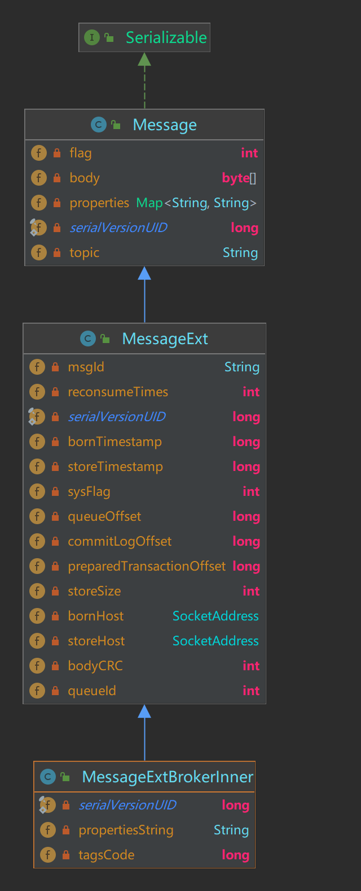
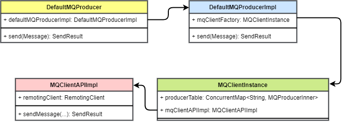
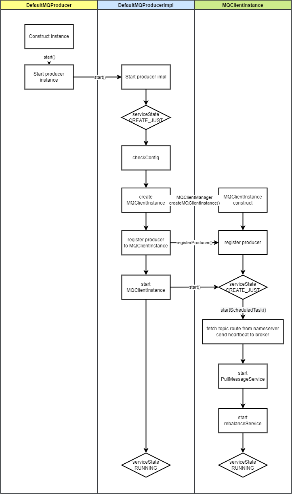

# RocketMQ 消息发送设计和原理详解 源码剖析

[TOC]

# 1. 背景

发送消息是 MQ 最基础的操作之一。RocketMQ 官方提供了多语言客户端支持消息的发送和消费操作。
当然，消息发送并不仅仅牵扯到客户端操作。客户端做的是向 Broker 发送请求，请求中包含了消息的全部信息。而 Broker 需要处理客户端发送来的生产请求，将消息存储起来。
在这篇文章中我将将解析消息发送流程中生产者和 Broker 的处理流程，揭秘 RocketMQ 消息发送高性能、高可靠的原理。

# 2. 概述

RocketMQ 的 Java 客户端提供了丰富的消息发送 API，支持多种消息发送的方式和特殊消息的发送。
包括 3 种发送方式（同步、异步、单向）和多种特殊消息（顺序消息、延时消息、批量消息、过滤消息、事务消息）。
对于客户端消息发送 API 的具体使用方式，可以参考官方文档：[https://github.com/apache/rocketmq/blob/develop/docs/cn/RocketMQ_Example.md](https://github.com/apache/rocketmq/blob/develop/docs/cn/RocketMQ_Example.md)。

## 2.1 消息发送方式和特殊消息

### 2.1.1 三种消息发送方式

RocketMQ 支持 3 种消息发送方式：同步、异步和单向。

1. 同步（Sync）
   * 发送消息时，同步等待，直到 Broker 返回发送结果。
   * 这种方式最为可靠，但是发送性能最差。
   * 在一些可靠性要求非常高的场景下，推荐使用同步方式。比如：重要的消息通知，短信通知。
2. 异步（Async）
   * 发送消息时，无需等待 Broker 返回发送结果，发送线程不阻塞。执行发送 API 时指定消息发送成功后的回调函数。
   * 这种方式相比于同步发送，性能可以提升多个数量级，但可靠性不如同步发送。
   * 在对响应时间敏感、流量较大的场景下，推荐使用异步方式。异步发送是使用最广泛的发送方式。
3. 单向（One-way）
   * 发送消息时，直接返回，不等待 Broker 返回发送结果，也不注册回调函数。
   * 这种发送方式性能最高，可靠性最差。它不关心发送结果，不在乎消息是否成功存储在 Broker 中。
   * 适用于消息丢失也没有太大影响的场景，例如发送日志。

这三种发送方式中，异步发送是最为广泛使用的发送方式。配合一些重试和补偿机制，可以达成较高的可靠性和很高的性能。

### 2.1.2 特殊消息类型

下面简单介绍一下几种特殊消息类型。

1. 普通消息：发送效率最高、使用场景最广泛的消息类型。普通消息可以由客户端并发发送。不保证普通消息消费的顺序。单 Broker 性能可以达到十万级别。（视 Broker 配置而变）
2. 队列级别顺序消息：RocketMQ 将一个 Topic 分为多个队列，以提高消费速度。每隔分区内的消息遵循先生产先消费的顺序。
3. Topic 级别顺序消息：如果把一个 Topic 的队列数量设为 1，那么该 Topic 中的消息也遵循先生产先消费。
4. 延迟消息：消息发送后，消费者并不马上收到消息，而是等待一段指定的时间之后才能消费到该消息。
5. 事务消息：提供分布式事务功能，可以保证发送消息和另外的操作同时成功或者同时失败。
6. 批量消息：将多个消息包装成一个批量消息，一起发送。降低网络传输次数，提升传输效率。

## 2.2 路由机制

RocketMQ 的 Topic 可以分为多个队列，每个队列可能分布在不同 Broker 上。

消息的路由指的是发送消息时需要先获取 Topic 的路由信息（其中包含每个 Topic 的队列和它们所在的 Broker 地址），然后选择一个队列进行发送。

消息发送的 API 提供了参数，可以传入要发送的队列信息，或者传入队列选择方法。
## 2.3 消息发送流程

消息发送的流程涉及到 RocketMQ 的三个组件：生产者、Broker、NameServer。
其中生产者负责发送消息，Broker 负责处理消息发送请求，NameServer 负责更新和提供路由信息。

如图所示
* 生产者每 30 秒向 NameServer 拉取路由信息，Broker 每 30 秒向 NameServer 发送路由信息。
* 生产者发送消息时，会先在本地查询 Topic 路由信息。
* 如果查询不到，会请求 NameServer 查询。
* 随后将消息发送给 Broker。
* Broker 也会在本地查询 Topic 路由信息来检查消息的 Topic 是否存在。
* 随后保存消息，如果是异步发送则直接返回，如果同步发送则等待消息保存成功后返回。

## 2.4 高可用设计

### 2.4.1 生产者高可用

* 消息发送重试机制：生产者在消息发送时如果出现失败，默认会重试 2 次。
* 故障规避机制：如果重试的消息仍发往同一个 Broker，发送大概率还是会失败，所以在重试时会尽量避开刚刚发送失败的 Broker。

### 2.4.2 Broker 端高可用

Broker 端的高可用是用数据同步的方式，将消息同步到备 Broker 上，当主 Broker 发生故障时，可以从备 Broker 上恢复数据。

# 3. 详细设计

## 3.1 消息

RocketMQ 中的消息类主要有 3 个

* `Message` 为客户端需要使用的消息类。
* `MessageExt` 为消息扩展属性类，它扩展了 `Message`，在 Broker 上产生此对象。
* `MessageExtBrokerInner` 是存储内部使用的 Message 对象，在 rocketmq-store 模块使用。 

在发送消息时，用到的是 `Message`，可以指定消息的属性、消息体和 flag。

## 3.2 生产者类图

* `DefaultMQProducer` 是 RocketMQ 中默认的生产者实现，它实现了 MQAdmin 接口。
* `DefaultMQProducer` 内部包装了一个 `DefaultMQProducerImpl` 字段，它是生产者的具体实现类，`DefaultMQProducer` 调用它内部的 `DefaultMQProducerImpl` 来发送命令。
* `DefaultMQProducerImpl` 内部注册了一个 `MQClientInstance` 字段。`MQClientInstance` 是与 NameServer 和 Broker 通信的中介。 `MQClientInstance` 与 `ClientId` 一一对应，`ClientId` 由 `clientIp`、`instanceName`、`unitName` 组成。如果不手动修改，一般来说一个启动的客户端进程只有一个 `MQClientInstance` 实例，这样可以节省客户端资源。
* `MQClientInstnace` 内部的 `producerTable` 注册了 ClientId 和 `DefaultMQProducerImpl` 的对应关系
* `MQClientAPIImpl` 提供了发送消息的 API，它调用 `RemotingClient` 执行发送。

## 3.3 生产者启动

1. 构造 `DefaultMQProducer` 实例，`start()` 启动
2. 初始化 `DefaultMQProducerImpl`，设置状态为 `CREATE_JUST`
3. 启动 `DefaultMQProducerImpl`
4. 检查配置
5. 根据 `ClientId` 获取或创建 `MQClientInstance`
6. 将 `DefaultMQProducerImpl` 注册到 `MQClientInstance`
7. 启动 `MQClientInstance`
8. 启动定时任务，包括从 NameServer 拉取 Topic 路由信息、向 Broker 发送心跳
9. 启动 `PullMessageService`
10. 启动 `RebalanceService`
11. 设置服务状态为 `RUNNING`

## 3.4 消息发送

RocketMQ 的消息发送流程图如下图所示：

其中 MQProducerImpl 负责执行核心的消息发送方法 `sendDefaultImpl`

这个方法中包含了消息发送的核心逻辑

1. 查找 Topic 路由信息
2. 选择消息队列
3. 发送消息

### 3.4.1 查找 Topic 路由信息

指定 Topic 发送消息后，生产者需要知道消息要发往哪个 Broker 地址。于是需要获取 Topic 路由信息，查询 Topic 所在的 Broker，随后选择一个 Broker 进行发送。

在第一次发送消息时，本地没有缓存 Topic 路由信息，所以需要主动从 NameServer 拉取，然后更新到本地路由表缓存。随后生产者会启动定时任务，每隔 30s 重新从 NameServer 拉取路由信息。

注意，第一次查询 NameServer 时，如果没有拉取到 Topic 路由信息，则会使用默认 Topic（`AUTO_CREATE_TOPIC_KEY_TOPIC`）再次查询。

>默认 Topic 在 Broker 启动时创建，是为自动创建主题运用的。
>它的目的是在主题没有被创建时，让生产者发送消息时也能够查询到 Broker 地址。
>然后等消息真正发送到 Broker 时，会根据消息的 Topic 创建主题。

如果最终都没有拉取到 Topic 路由信息，则会抛出异常。

### 3.4.2 选择消息队列

获取到 Topic 路由信息后，需要从中选择一个队列进行发送。

### 3.4.3 发送消息

# 4. 源码解析

# 参考资料

* [样例——官方文档](https://github.com/apache/rocketmq/blob/develop/docs/cn/RocketMQ_Example.md)
* [RocketMQ 消息发送流程](https://kunzhao.org/docs/rocketmq/rocketmq-send-message-flow/)
* 《RocketMQ 技术内幕 第二版》