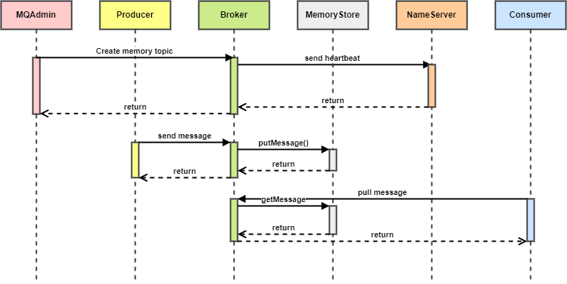

# RocketMQ Memory Store

## 背景

## 概要设计

### 整体流程

首先需要在 Broker 中创建 Topic，并指定为内存存储的 Topic。

1. 生产者发送生产请求
2. `SendMessageProcessor` 处理生产请求
   1. 根据请求的 Topic 获取 `TopicConfig`
   2. 判断该 Topic 是否是内存 Topic
   3. 如果不是，走原有 `DefaultMessageStore` 存储
   4. 如果是，走 `MemoryMessageStore` 存储
3. 消费者发送拉取消息请求
4. `PullMessageProcessor` 处理拉取消息请求
   1. 根据请求的 Topic 获取 `TopicConfig`
   2. 判断该 Topic 是否是内存 Topic
   3. 如果不是，走原有 `DefaultMessageStore` 取消息
   4. 如果是，走 `MemoryMessageStore` 取消息

## 详细设计

### 整体流程顺序图

### 类设计

#### MemoryMessageStore

* 为 `MemoryMessageStore` 设置一个存储阈值，为内存中存储的消息总大小，默认为可用内存的 75%
* `messageQueueMap`：一个 `HashMap`，Key 是 Topic 名称，Value 是 Disruptor 存储的 `MessageExtBrokerInner` 消息队列
* `messageTotalSize`：记录保存的消息总大小

* `putMessage`：将消息根据 Topic 放入指定队列，如果超过消息总大小阈值，则从该 Topic 中删除一条消息。如果该 Topic 为空，则删除一条保存最久的消息

#### TopicConfig

* `boolean memory`：是否是内存 Topic

#### BrokerController

* `memoryTopicEnable`：是否启动内存 Topic 功能，默认 false

