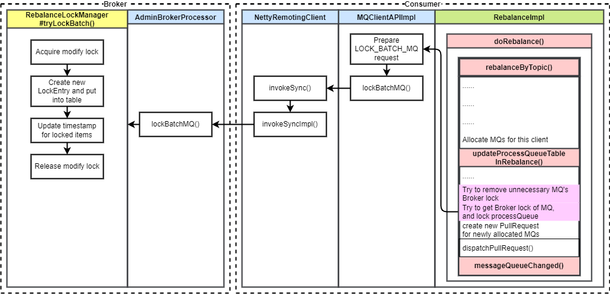
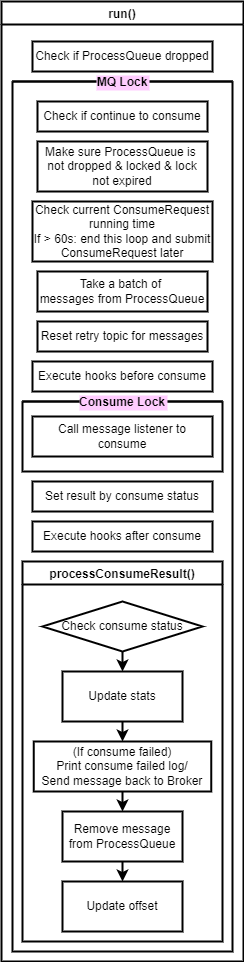
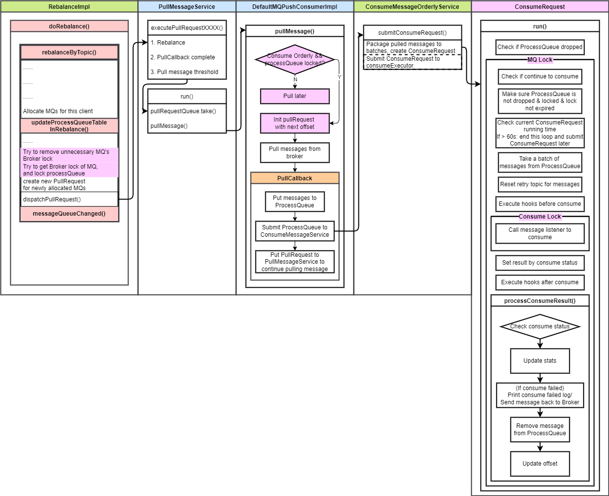

# RocketMQ 消费者（6）顺序消费 流程详解 & 源码解析

## 1. 背景

本文是 RocketMQ 消费者系列的第六篇，上一篇主要介绍并发消费，而本片主要介绍 RocketMQ 顺序消费的设计和流程。

我把 RocketMQ 消费分成如下几个步骤

1. 重平衡
2. 消费者拉取消息
3. Broker 接收拉取请求后从存储中查询消息并返回
4. 消费者消费消息

顺序消息逻辑主要在步骤 4 当中承载，然而为了能够实现顺序的消费，在步骤 1 和 2 中就需要有相应的操作以锁定消费队列，确保顺序消费。

---

RocketMQ 支持 2 种消费方式，即并发消费和顺序消费。

并发消费是比较常用的一种消费方式。并发有两层含义：

1. 队列间并发消费：一个 Topic 可以有 N 个队列，每个队列都可以被一个消费者消费，最多可以有 N 个消费者同时进行消费
2. 队列中的多个消息并发消费：消费者执行消费逻辑时，使用一个消费线程池进行消费，该线程池默认有 20 个线程同时进行消费，所以也有可能并发消费一个队列中的多个消息

由于 RocketMQ 的 Topic 和队列的设计，让同一 Topic 下的并发消费无法避免，因为只要有多个队列让多个消费者同时消费，就必定存在并发消费。所以 RocketMQ 仅支持单个队列中的消息的顺序消费。

如果要做到 Topic 维度严格的顺序，那么需要将 Topic 的队列数设为 1。

## 2. 概要设计

顺序消费的设计的要点主要有两个：

1. 保证消费速度，即消费线程池同时消费多个队列的消息。

2. 保证顺序性，即一个队列同一时间只能被一个消费者的一个线程消费。

第一点可以在并发消费的基础上修改消费线程池的逻辑，第二点需要用到多个锁来保证。

### 2.1 消费线程池逻辑

#### 2.1.1 消费线程池顺序消费

并发消费的消费线程池，每个线程的消费任务是：消费一批（默认一条）消息。消费任务由拉取任务提交，存在同时运行的多个任务都是消费同一个队列的可能。

顺序消费的消费任务也由拉取任务提交，逻辑改成了：持续消费一个队列的消息，直到该队列的消息消费完或者超过最大消费时间（1分钟）。这样可以保证每个队列最多被一个消费线程处理，每个消费线程也最大程度上被使用。1 分钟的超时时间是为了防止某个队列消息过多或消费过慢，让其他队列也有被消费到的机会。

#### 2.1.2 保证一个队列同时仅被一个消费线程消费

在上述逻辑的基础上，可能存在同时有多个同一队列的消费任务被提交到消费线程池的情况，需要保证一个队列最多仅被一个线程消费。

RocketMQ 为每个消息队列都初始化一把锁（**消息队列锁**），消费任务开始时获取锁，消费任务结束时释放锁，保证就算有多个线程同时消费一个队列，但同时最多只有一个线程真正在执行消费（其他线程都在等待锁释放）。

> 这个实现可能导致消费线程池中多个线程同时等待一把锁，似乎是一个可以优化的点。比如通过修改消息拉取线程， 保证该队列消费完之前不拉取新的消息（拉取消息前判断该队列的消息是否被消费完，如果未被消费完则跳过拉取操作，将该拉取请求放入拉取队列末尾）

### 2.2 重平衡时顺序消费

消费任务中添加的消息队列锁保证了同一消费者中的顺序消费，但保证消费线程池顺序消费就可以实现顺序消费了吗？NO。顺序消费还有一个敌人——重平衡。

重平衡可能会将一个队列的消费负载从一个消费者切换到另一个消费者。老消费者的消费任务可能还没有结束，新消费者开始消费，这样也存在两个消费者同时消费一个队列的情况。

---

#### 2.2.1 Broker 管理的分布式锁

为了跨消费者进行消费队列负载的协调，引入分布式锁是最好的选择，RocketMQ 让 Broker 来管理和保存该锁，我们姑且把这个锁叫做 **Broker锁**。

消费者在重平衡后，对于新分配到的队列，会尝试向 Broker 请求 **Broker锁** ；丢弃的队列则向 Broker 释放锁。如果请求到锁才开始拉取，请求不到则等到下次重平衡再次请求。

**Broker锁** 在 Broker 端被设了过期时间，1 分钟不更新则过期。顺序消费服务的定时任务会每 20s 向 Broker 发送请求，请求和更新自己负载的消费队列的 **Broker锁**。

在消息拉取和顺序消费服务每消费一批消息前，都会判断是否持有 **Broker锁**，来保证没有多个消费者在重平衡后同时消费一个队列。

还有一个**消费锁**，用来保证在有消息正在被顺序消费时，不能释放 **Broker锁**。

## 3. 详细设计

### 3.1 Broker锁

#### 3.1.1 设计

**Broker锁** 是在 Broker 上保存和管理的分布式锁，它的存在是为了解决重平衡后可能的不同消费者并行消费问题。由 Broker 端的 `RebalanceLockManager` 管理。

每个消息队列都可能会有一个锁，每个消费组的消费应该隔离，所以每个消费组都有一组锁。锁的容器是两层 Map：

```java
ConcurrentMap<String/* group */, ConcurrentHashMap<MessageQueue, LockEntry/* client ID & update timestamp */>> mqLockTable
```

为了避免一些异常情况，如消费者异常退出，没有主动解锁，导致队列一直上锁，这里为 **Broker锁** 设置了超时时间（默认 1 分钟）。

由消费者向 Broker 发请求进行加解锁、查询是否加锁等操作。



#### 3.1.2 加解锁时机

消费者重平衡后，调用 `updateProcessQueueTableInRebalance`，如上图粉色部分所示。

对于要丢弃的队列，尝试释放 **Broker锁**；对于对分配到的队列尝试请求 **Broker锁**。

#### 3.1.3 加解锁流程

加锁的过程是向 Broker 发请求，锁管理器将锁创建后放入锁容器 `mqLockTable` 并更新加锁时间；解锁则是将 `LockEntry` 从锁容器中移除。

上图展示了加锁流程：

1. 重平衡后更新处理队列，尝试加锁（或者更新现有锁），向 Broker 发请求
2. `MQClientAPIImpl` 中准备锁定请求，调用 `NettyRemotingClient` 向 Broker 发送请求
3. Broker 端 `AdminBrokerProcessor` 处理加锁请求
4. `RebalanceLockManager` 最终处理加锁逻辑，先获取锁容器的改动锁。然后为没有加锁的队列新建 `LockEntry`，为已有的 `LockEntry` 更新加锁时间和客户端 ID。最后释放锁容器的锁。

#### 3.1.4 边界条件：消费消息时重平衡

存在一种边界条件，消费消息耗时较长的情况下，可能存在重平衡后要释放某个队列的 **Broker锁**，但是这个队列仍有消息正在被消费。

这种情况下不能贸然释放 **Broker锁**，因为如果释放，其他消费者会获取 Broker锁并开始消费，可能会重复且并发地消费那批没有消费完的消息，这里就存在并发问题。

RocketMQ 的做法是如果队列有消息正被消费，则不会释放它的 **Broker锁**，等到下一次重平衡（默认 20s 周期）再判断是否可以释放。

具体的做法是引入一个新的锁 **消费锁**，一批消息消费时加锁，消费完后解锁。

重平衡后尝试释放 **Broker锁** 前，先试着获取 **消费锁**，如果 1s 内获取不到，则跳过。

### 3.2 消费线程池顺序消费逻辑

#### 3.2.1 消费线程池顺序消费设计

每个消费者都有一个消费线程池（默认 20 个线程）来处理消息拉取任务拉取成功后提交的消费任务。

消息拉取任务将拉取到的消息都放到消息队列对应的处理队列中，然后将处理队列整个放入消费任务，提交给消费线程池。

每个消费任务都持续消费一个队列，直到消费时间到期（1 分钟）或者处理队列中消息消费完。

为了保证消费线程池中没有多个线程消费同一个队列，为每个消费队列初始化**消费队列锁（MQ Lock）**，并在消费任务执行时加锁

#### 3.2.2 消费线程池顺序消费任务流程



1. 检查处理队列是否丢弃（是否仍由该消费者负载该队列）
2. 获取消费队列锁（保证消费线程池中消费这个队列的最多只有一个线程）
3. 保证处理队列的 Broker锁 已经获取且未过期
4. 从处理队列中取一批消息（默认 1 条）
5. 对于重试消息，从消息属性中获取它真正的 Topic 并恢复
6. 执行消费前钩子函数
7. 加 **消费锁**，执行消费逻辑，释放 **消费锁**
8. 根据消费结果设置返回状态
9. 执行消费后钩子函数
10. 处理这批消息的消费结果
    1. 检查消费结果
    2. 如果消费失败，广播模式：打印错误日志；集群模式：将消息发回 Broker，等待重新消费
    3. 将消息从处理队列移除
    4. 提交消费进度

### 3.3 顺序消费流程



1. 消费流程以重平衡为起点。重平衡后向 Broker 发送请求，释放和申请 **Broker锁**
2. 为该消费者负载的队列新建消息拉取请求，进行消息拉取
3. `pullMessage`：拉取前再次判断队列 Broker锁 的状态。消息拉取线程从拉取任务队列中获取任务并执行拉取
4. 拉取成功后的 `PullCallback` 将拉取到的消息放入处理队列，然后给顺序消费服务提交顺序消费任务
5. 顺序消费服务的消费线程池执行消费任务，执行逻辑上面讲过

## 4. 源码解析

### 4.1 Broker锁

#### 4.1.1 Broker锁 管理器

```java
public class RebalanceLockManager {
    // 锁容器读写锁
    private final Lock lock = new ReentrantLock();
    // 消息队列锁定状态表
    private final ConcurrentMap<String/* group */, ConcurrentHashMap<MessageQueue, LockEntry>> mqLockTable =
        new ConcurrentHashMap<String, ConcurrentHashMap<MessageQueue, LockEntry>>(1024);
    /**
     * 批量锁定消息队列
     *
     * @param group 消费组
     * @param mqs 要锁定的消息队列
     * @param clientId 客户端 ID
     * @return 锁定成功的消息队列
     */
    public Set<MessageQueue> tryLockBatch(final String group, final Set<MessageQueue> mqs,
        final String clientId) {
        // 要锁定的队列中已经锁定的队列
        Set<MessageQueue> lockedMqs = new HashSet<MessageQueue>(mqs.size());
        // 之前没有锁定，需要锁定的队列
        Set<MessageQueue> notLockedMqs = new HashSet<MessageQueue>(mqs.size());

        for (MessageQueue mq : mqs) {
            if (this.isLocked(group, mq, clientId)) {
                lockedMqs.add(mq);
            } else {
                notLockedMqs.add(mq);
            }
        }

        // 锁定需要锁定的队列
        if (!notLockedMqs.isEmpty()) {
            try {
                this.lock.lockInterruptibly();
                try {
                    ConcurrentHashMap<MessageQueue, LockEntry> groupValue = this.mqLockTable.get(group);
                    if (null == groupValue) {
                        groupValue = new ConcurrentHashMap<>(32);
                        this.mqLockTable.put(group, groupValue);
                    }

                    for (MessageQueue mq : notLockedMqs) {
                        // 为队列新建锁定标识，加入锁定状态表
                        LockEntry lockEntry = groupValue.get(mq);
                        if (null == lockEntry) {
                            lockEntry = new LockEntry();
                            lockEntry.setClientId(clientId);
                            groupValue.put(mq, lockEntry);
                        }

                        if (lockEntry.isLocked(clientId)) {
                            lockEntry.setLastUpdateTimestamp(System.currentTimeMillis());
                            lockedMqs.add(mq);
                            continue;
                        }

                        String oldClientId = lockEntry.getClientId();

                        if (lockEntry.isExpired()) {
                            lockEntry.setClientId(clientId);
                            lockEntry.setLastUpdateTimestamp(System.currentTimeMillis());
                            lockedMqs.add(mq);
                            continue;
                        }
                    }
                } finally {
                    this.lock.unlock();
                }
            } catch (InterruptedException e) {
                log.error("putMessage exception", e);
            }
        }
        return lockedMqs;
    }
}
```

#### 4.1.2 消费者解锁/加锁

##### 4.1.2.1 重平衡后更新处理队列

重平衡时，队列分配完成后对队列进行解锁和加锁

```java
// RebalanceImpl.java
/**
 * 重平衡后更新 ProcessQueue 表
 * 丢弃不再消费的队列，为新增的队列新建 ProcessQueue 和 PullRequest
 *
 * @param topic 主题
 * @param mqSet 重平衡后该消费者新分配到的的消息队列
 * @param isOrder 是否顺序消费
 * @return
 */
private boolean updateProcessQueueTableInRebalance(final String topic, final Set<MessageQueue> mqSet,
                                                   final boolean isOrder) {
    boolean changed = false;

    // 遍历本地缓存的消费者分到的消息队列，判断要丢弃的队列并丢弃
    Iterator<Entry<MessageQueue, ProcessQueue>> it = this.processQueueTable.entrySet().iterator();
    while (it.hasNext()) {
        Entry<MessageQueue, ProcessQueue> next = it.next();
        MessageQueue mq = next.getKey();
        ProcessQueue pq = next.getValue();

        if (mq.getTopic().equals(topic)) {
            // 如果新分配到的消息队列集合中不含有老的消息队列，丢弃老的处理队列
            if (!mqSet.contains(mq)) {
                // 该 ProcessQueue 中不会有消息被消费
                pq.setDropped(true);
                // 移除消费队列，并释放 Broker锁，移除前持久化。
                if (this.removeUnnecessaryMessageQueue(mq, pq)) {
                    it.remove();
                    changed = true;

                }
            } else if (pq.isPullExpired()) {
                /**
                 * 如果Reblance之后的mq集合包含该MessageQueue,但是ProcessQueue已经太久没有拉取数据（上次拉取消息的时间距离现在超过设置时间）
                */
                switch (this.consumeType()) {
                    case CONSUME_ACTIVELY:
                        break;
                    case CONSUME_PASSIVELY:
                        /**
                         * PushConsumer为被动消费
                         * 如果是PUSH，则丢弃ProcessQueue
                         * 同时删除MessageQueue
                         */
                        pq.setDropped(true);
                        if (this.removeUnnecessaryMessageQueue(mq, pq)) {
                            it.remove();
                            changed = true;
                        }
                        break;
                    default:
                        break;
                }
            }
        }
    }

    // 遍历新分配的 MessageQueue，对于新分配的，创建 PullRequest 启动拉取
    List<PullRequest> pullRequestList = new ArrayList<PullRequest>();
    // 为每个 MessageQueue 新建一个 PullRequest
    for (MessageQueue mq : mqSet) {
        // 本地缓存的 ProcessQueue 中不包含，表示新增队列
        if (!this.processQueueTable.containsKey(mq)) {
            // 如果是顺序消费，尝试给处理队列加锁：尝试向 Broker 发送锁定队列请求。如果加锁失败则跳过，在下一次重平衡时尝试加锁
            if (isOrder && !this.lock(mq)) {
                log.warn("doRebalance, {}, add a new mq failed, {}, because lock failed", consumerGroup, mq);
                // 顺序消费，锁定处理队列失败，跳过拉取
                continue;
            }

            // 从内存中移除该 MessageQueue 的消费进度（老的进度不需要）
            this.removeDirtyOffset(mq);
            ProcessQueue pq = new ProcessQueue();

            // 计算当前 MessageQueue 应该从哪里开始拉取消息
            long nextOffset = -1L;
            try {
                // 计算并从偏移量存储中读取下次拉取的偏移量
                nextOffset = this.computePullFromWhereWithException(mq);
            } catch (Exception e) {
                log.info("doRebalance, {}, compute offset failed, {}", consumerGroup, mq);
                continue;
            }

            if (nextOffset >= 0) {
                // 添加 MessageQueue 和 ProcessQueue 的映射关系
                ProcessQueue pre = this.processQueueTable.putIfAbsent(mq, pq);
                if (pre != null) {
                    log.info("doRebalance, {}, mq already exists, {}", consumerGroup, mq);
                } else {
                    // 添加成功，创建新的 PullRequest
                    // 唯一的创建 PullRequest 的地方
                    log.info("doRebalance, {}, add a new mq, {}", consumerGroup, mq);
                    PullRequest pullRequest = new PullRequest();
                    pullRequest.setConsumerGroup(consumerGroup);
                    pullRequest.setNextOffset(nextOffset);
                    pullRequest.setMessageQueue(mq);
                    pullRequest.setProcessQueue(pq);
                    pullRequestList.add(pullRequest);
                    changed = true;
                }
            } else {
                log.warn("doRebalance, {}, add new mq failed, {}", consumerGroup, mq);
            }
        }
    }

    // 将新建的 PullRequest 加入消息拉取线程 PullMessageService，开始拉取
    this.dispatchPullRequest(pullRequestList);

    return changed;
}
```

##### 4.1.2.2 消息队列解锁

```java
// RebalancePushImpl.java
/**
 * 将重平衡后丢弃的消费队列移除
 * 移除前持久化消费的消费进度
 *
 * @param mq 消息队列
 * @param pq 处理队列
 * @return
 */
@Override
public boolean removeUnnecessaryMessageQueue(MessageQueue mq, ProcessQueue pq) {
    // 持久化消费进度，然后移除
    this.defaultMQPushConsumerImpl.getOffsetStore().persist(mq);
    this.defaultMQPushConsumerImpl.getOffsetStore().removeOffset(mq);
    if (this.defaultMQPushConsumerImpl.isConsumeOrderly()
        && MessageModel.CLUSTERING.equals(this.defaultMQPushConsumerImpl.messageModel())) {
        try {
            // 如果是顺序消费，尝试获取队列的消费锁，最多等待 1s
            if (pq.getConsumeLock().tryLock(1000, TimeUnit.MILLISECONDS)) {
                // 获取成功，表示该队列没有消息正被消费，可以向 Broker 发请求解锁该队列
                try {
                    return this.unlockDelay(mq, pq);
                } finally {
                    pq.getConsumeLock().unlock();
                }
            } else {
                // 获取消费锁失败，表示该队列有消息正被消费，且消费时长大于 1s，那么本次无法将该队列解锁
                // 该队列新分配到负载的 Broker 由于拿不到该队列的锁，也无法开始消费，需要等待下一次重平衡时再尝试解锁
                log.warn("[WRONG]mq is consuming, so can not unlock it, {}. maybe hanged for a while, {}",
                         mq,
                         pq.getTryUnlockTimes());
                // 增加解锁尝试次数
                pq.incTryUnlockTimes();
            }
        } catch (Exception e) {
            log.error("removeUnnecessaryMessageQueue Exception", e);
        }

        return false;
    }
    return true;
}
```

##### 4.1.2.3 消息队列加锁

```java
// RebalanceImpl.java
/**
 * 锁定消息队列，向 Broker 发请求
 * 顺序消费时使用
 *
 * @param mq 要锁定的消息队列
 * @return 是否锁定成功
 */
public boolean lock(final MessageQueue mq) {
    // 查询 Broker 地址
    FindBrokerResult findBrokerResult = this.mQClientFactory.findBrokerAddressInSubscribe(mq.getBrokerName(), MixAll.MASTER_ID, true);
    if (findBrokerResult != null) {
        // 构造锁定消息队列请求
        LockBatchRequestBody requestBody = new LockBatchRequestBody();
        requestBody.setConsumerGroup(this.consumerGroup);
        requestBody.setClientId(this.mQClientFactory.getClientId());
        requestBody.getMqSet().add(mq);

        try {
            // 调用 API 向 Broker 发送锁定队列请求，返回锁定成功的队列集合
            Set<MessageQueue> lockedMq =
                this.mQClientFactory.getMQClientAPIImpl().lockBatchMQ(findBrokerResult.getBrokerAddr(), requestBody, 1000);
            for (MessageQueue mmqq : lockedMq) {
                // 将锁定成功队列的处理队列加锁
                ProcessQueue processQueue = this.processQueueTable.get(mmqq);
                if (processQueue != null) {
                    processQueue.setLocked(true);
                    processQueue.setLastLockTimestamp(System.currentTimeMillis());
                }
            }

            boolean lockOK = lockedMq.contains(mq);
            log.info("the message queue lock {}, {} {}",
                     lockOK ? "OK" : "Failed",
                     this.consumerGroup,
                     mq);
            return lockOK;
        } catch (Exception e) {
            log.error("lockBatchMQ exception, " + mq, e);
        }
    }

    return false;
}
```

### 4.2 消息拉取

#### 4.2.1 消息拉取

消息拉取操作，对于顺序消费情况，提交拉取请求前会先判断处理队列的锁定状态。

* 锁定：如果是第一次锁定（第一次拉取），计算并设置本次拉取任务消息队列的拉取偏移量
* 未锁定：等待 3s 后再次执行拉取请求

```java
/**
 * 拉取消息入口
 * 
 * @param pullRequest 拉取请求，包含需要拉取的消费队列信息
 */
public void pullMessage(final PullRequest pullRequest) {
    // 获取待拉取的消费队列
    final ProcessQueue processQueue = pullRequest.getProcessQueue();

    // ...

    if (!this.consumeOrderly) {
		// ...
    } else {
        // 处理顺序消费，如果处理队列已经被锁定
        if (processQueue.isLocked()) {
            // 如果之前没有被锁定过（是第一次拉取）
            if (!pullRequest.isPreviouslyLocked()) {
                long offset = -1L;
                try {
                    // 计算拉取偏移量
                    offset = this.rebalanceImpl.computePullFromWhereWithException(pullRequest.getMessageQueue());
                } catch (Exception e) {
                    // 计算异常，等待 3s 后再次判断
                    this.executePullRequestLater(pullRequest, pullTimeDelayMillsWhenException);
                    log.error("Failed to compute pull offset, pullResult: {}", pullRequest, e);
                    return;
                }
                boolean brokerBusy = offset < pullRequest.getNextOffset();
                log.info("the first time to pull message, so fix offset from broker. pullRequest: {} NewOffset: {} brokerBusy: {}",
                         pullRequest, offset, brokerBusy);
                if (brokerBusy) {
                    log.info("[NOTIFYME]the first time to pull message, but pull request offset larger than broker consume offset. pullRequest: {} NewOffset: {}",
                             pullRequest, offset);
                }

                // 设置之前已经锁定过
                pullRequest.setPreviouslyLocked(true);
                // 设置要拉取的偏移量，在方法后面的逻辑中立即执行拉取
                pullRequest.setNextOffset(offset);
            }
        } else {
            // 如果处理队列没有被锁定，等待 3s 后将 PullRequest 放入拉取请求队列，再次判断锁定情况尝试拉取
            this.executePullRequestLater(pullRequest, pullTimeDelayMillsWhenException);
            log.info("pull message later because not locked in broker, {}", pullRequest);
            return;
        }
    }
    
    // ...
}
```

#### 4.2.2 消息拉取成功

```java
public void onSuccess(PullResult pullResult) {
    if (pullResult != null) {
        // 将消息字节数组解码成消息列表并填充msgFoundList；对消息进行TAG模式过滤
        pullResult = DefaultMQPushConsumerImpl.this.pullAPIWrapper.processPullResult(pullRequest.getMessageQueue(), pullResult,
                                                                                     subscriptionData);

        switch (pullResult.getPullStatus()) {
            // 找到对应消息
            case FOUND:
                // 上次请求偏移量
                long prevRequestOffset = pullRequest.getNextOffset();
                // 更新下一次拉取的偏移量
                pullRequest.setNextOffset(pullResult.getNextBeginOffset());
                // 计算和记录拉取用时
                long pullRT = System.currentTimeMillis() - beginTimestamp;
                DefaultMQPushConsumerImpl.this.getConsumerStatsManager().incPullRT(pullRequest.getConsumerGroup(),
                                                                                   pullRequest.getMessageQueue().getTopic(), pullRT);
                // 如果msgFoundList为空，马上进行下次拉取
                // msgFoundList为空的情况：因为根据TAG过滤时在服务端只验证了TAG的哈希码，客户端要再次对消息进行了过滤（见上），可能会出现为空的情况
                long firstMsgOffset = Long.MAX_VALUE;
                if (pullResult.getMsgFoundList() == null || pullResult.getMsgFoundList().isEmpty()) {
                    DefaultMQPushConsumerImpl.this.executePullRequestImmediately(pullRequest);
                } else {
                    // 获取返回结果中第一条消息的消费队列offset
                    firstMsgOffset = pullResult.getMsgFoundList().get(0).getQueueOffset();

                    DefaultMQPushConsumerImpl.this.getConsumerStatsManager().incPullTPS(pullRequest.getConsumerGroup(),
                                                                                        pullRequest.getMessageQueue().getTopic(), pullResult.getMsgFoundList().size());

                    // 将拉取到的消息存入ProcessQueue
                    boolean dispatchToConsume = processQueue.putMessage(pullResult.getMsgFoundList());
                    // 将拉取到的消息提交到ConsumeMessageService中供消费者消费（异步）
                    DefaultMQPushConsumerImpl.this.consumeMessageService.submitConsumeRequest(
                        pullResult.getMsgFoundList(),
                        processQueue,
                        pullRequest.getMessageQueue(),
                        dispatchToConsume);

                    // 等待pullInterval毫秒后重新拉取，或立即重新拉取
                    if (DefaultMQPushConsumerImpl.this.defaultMQPushConsumer.getPullInterval() > 0) {
                        DefaultMQPushConsumerImpl.this.executePullRequestLater(pullRequest,
                                                                               DefaultMQPushConsumerImpl.this.defaultMQPushConsumer.getPullInterval());
                    } else {
                        DefaultMQPushConsumerImpl.this.executePullRequestImmediately(pullRequest);
                    }
                }

                // ...
        }
        // ...
    }
}
```

### 4.3 顺序消费任务

```java
// ConsumeMessageOrderlyService.java
// class ConsumeRequest
public void run() {
    if (this.processQueue.isDropped()) {
        log.warn("run, the message queue not be able to consume, because it's dropped. {}", this.messageQueue);
        return;
    }

    // 从锁容器中获取消息队列消费锁
    final Object objLock = messageQueueLock.fetchLockObject(this.messageQueue);
    // 消费时申请独占消息队列消费锁对象
    synchronized (objLock) {
        // 如果是广播模式；或者集群模式下处理队列被锁定且锁未超时，直接消费
        if (MessageModel.BROADCASTING.equals(ConsumeMessageOrderlyService.this.defaultMQPushConsumerImpl.messageModel())
            || (this.processQueue.isLocked() && !this.processQueue.isLockExpired())) {
            final long beginTime = System.currentTimeMillis();
            // 是否继续本次消费请求的消费任务
            for (boolean continueConsume = true; continueConsume; ) {
                if (this.processQueue.isDropped()) {
                    log.warn("the message queue not be able to consume, because it's dropped. {}", this.messageQueue);
                    break;
                }

                if (MessageModel.CLUSTERING.equals(ConsumeMessageOrderlyService.this.defaultMQPushConsumerImpl.messageModel())
                    && !this.processQueue.isLocked()) {
                    log.warn("the message queue not locked, so consume later, {}", this.messageQueue);
                    ConsumeMessageOrderlyService.this.tryLockLaterAndReconsume(this.messageQueue, this.processQueue, 10);
                    break;
                }

                if (MessageModel.CLUSTERING.equals(ConsumeMessageOrderlyService.this.defaultMQPushConsumerImpl.messageModel())
                    && this.processQueue.isLockExpired()) {
                    log.warn("the message queue lock expired, so consume later, {}", this.messageQueue);
                    ConsumeMessageOrderlyService.this.tryLockLaterAndReconsume(this.messageQueue, this.processQueue, 10);
                    break;
                }

                // 计算本次消费请求任务执行时长，如果超过 60s，结束本次消费任务，（顺序消费任务以时长计算）
                long interval = System.currentTimeMillis() - beginTime;
                if (interval > MAX_TIME_CONSUME_CONTINUOUSLY) {
                    // 如果本次消费任务执行时长超过 60s，等到 10ms 后继续执行，以便让其他队列有机会消费
                    ConsumeMessageOrderlyService.this.submitConsumeRequestLater(processQueue, messageQueue, 10);
                    break;
                }

                // 每次从处理队列获取的一批消息数量，默认为 1
                final int consumeBatchSize =
                    ConsumeMessageOrderlyService.this.defaultMQPushConsumer.getConsumeMessageBatchMaxSize();

                // 从处理队列中取一批（默认 1 条）消息
                List<MessageExt> msgs = this.processQueue.takeMessages(consumeBatchSize);
                // 为重试消息恢复真正的 Topic
                defaultMQPushConsumerImpl.resetRetryAndNamespace(msgs, defaultMQPushConsumer.getConsumerGroup());
                if (!msgs.isEmpty()) {
                    // 如果获取的这批消息不为空
                    final ConsumeOrderlyContext context = new ConsumeOrderlyContext(this.messageQueue);

                    ConsumeOrderlyStatus status = null;

                    // 消费前钩子函数
                    ConsumeMessageContext consumeMessageContext = null;
                    if (ConsumeMessageOrderlyService.this.defaultMQPushConsumerImpl.hasHook()) {
                        consumeMessageContext = new ConsumeMessageContext();
                        consumeMessageContext
                            .setConsumerGroup(ConsumeMessageOrderlyService.this.defaultMQPushConsumer.getConsumerGroup());
                        consumeMessageContext.setNamespace(defaultMQPushConsumer.getNamespace());
                        consumeMessageContext.setMq(messageQueue);
                        consumeMessageContext.setMsgList(msgs);
                        consumeMessageContext.setSuccess(false);
                        // init the consume context type
                        consumeMessageContext.setProps(new HashMap<String, String>());
                        ConsumeMessageOrderlyService.this.defaultMQPushConsumerImpl.executeHookBefore(consumeMessageContext);
                    }

                    long beginTimestamp = System.currentTimeMillis();
                    ConsumeReturnType returnType = ConsumeReturnType.SUCCESS;
                    boolean hasException = false;
                    try {
                        // 消费消息锁
                        this.processQueue.getConsumeLock().lock();
                        if (this.processQueue.isDropped()) {
                            log.warn("consumeMessage, the message queue not be able to consume, because it's dropped. {}",
                                     this.messageQueue);
                            break;
                        }

                        // 消息消费监听器执行真正的消费业务逻辑
                        status = messageListener.consumeMessage(Collections.unmodifiableList(msgs), context);
                    } catch (Throwable e) {
                        log.warn(String.format("consumeMessage exception: %s Group: %s Msgs: %s MQ: %s",
                                               RemotingHelper.exceptionSimpleDesc(e),
                                               ConsumeMessageOrderlyService.this.consumerGroup,
                                               msgs,
                                               messageQueue), e);
                        hasException = true;
                    } finally {
                        // 消费消息锁解锁
                        this.processQueue.getConsumeLock().unlock();
                    }

                    if (null == status
                        || ConsumeOrderlyStatus.ROLLBACK == status
                        || ConsumeOrderlyStatus.SUSPEND_CURRENT_QUEUE_A_MOMENT == status) {
                        log.warn("consumeMessage Orderly return not OK, Group: {} Msgs: {} MQ: {}",
                                 ConsumeMessageOrderlyService.this.consumerGroup,
                                 msgs,
                                 messageQueue);
                    }

                    // 判断消费状态
                    long consumeRT = System.currentTimeMillis() - beginTimestamp;
                    if (null == status) {
                        if (hasException) {
                            returnType = ConsumeReturnType.EXCEPTION;
                        } else {
                            returnType = ConsumeReturnType.RETURNNULL;
                        }
                    } else if (consumeRT >= defaultMQPushConsumer.getConsumeTimeout() * 60 * 1000) {
                        returnType = ConsumeReturnType.TIME_OUT;
                    } else if (ConsumeOrderlyStatus.SUSPEND_CURRENT_QUEUE_A_MOMENT == status) {
                        returnType = ConsumeReturnType.FAILED;
                    } else if (ConsumeOrderlyStatus.SUCCESS == status) {
                        returnType = ConsumeReturnType.SUCCESS;
                    }

                    if (ConsumeMessageOrderlyService.this.defaultMQPushConsumerImpl.hasHook()) {
                        consumeMessageContext.getProps().put(MixAll.CONSUME_CONTEXT_TYPE, returnType.name());
                    }

                    if (null == status) {
                        status = ConsumeOrderlyStatus.SUSPEND_CURRENT_QUEUE_A_MOMENT;
                    }

                    // 消息消费后钩子函数
                    if (ConsumeMessageOrderlyService.this.defaultMQPushConsumerImpl.hasHook()) {
                        consumeMessageContext.setStatus(status.toString());
                        consumeMessageContext
                            .setSuccess(ConsumeOrderlyStatus.SUCCESS == status || ConsumeOrderlyStatus.COMMIT == status);
                        ConsumeMessageOrderlyService.this.defaultMQPushConsumerImpl.executeHookAfter(consumeMessageContext);
                    }

                    // 更新统计数据（消息消费时间）
                    ConsumeMessageOrderlyService.this.getConsumerStatsManager()
                        .incConsumeRT(ConsumeMessageOrderlyService.this.consumerGroup, messageQueue.getTopic(), consumeRT);

                    // 消费结果处理
                    continueConsume = ConsumeMessageOrderlyService.this.processConsumeResult(msgs, status, context, this);
                } else {
                    // 获取的这批消息为空，说明处理队列为空，结束本次消费请求的消费
                    continueConsume = false;
                }
            }
        } else {
            if (this.processQueue.isDropped()) {
                log.warn("the message queue not be able to consume, because it's dropped. {}", this.messageQueue);
                return;
            }

            ConsumeMessageOrderlyService.this.tryLockLaterAndReconsume(this.messageQueue, this.processQueue, 100);
        }
    }
}
```

