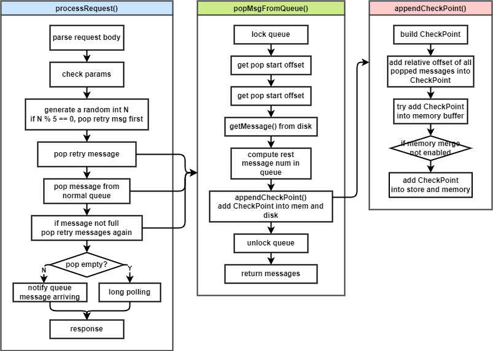

# RocketMQ POP 消费模式 原理详解 & 源码解析

## 1. 背景

### 1.1 什么是 Pop 消费

RocketMQ 5.0 中引入了一种新的消费模式：Pop 消费模式。

我们知道 RocketMQ 原来有两种消费模式：Pull 模式消费和 Push 模式消费，其中 Push 模式指的是 Broker 将消息主动“推送”给消费者，它的背后其实是消费者在不断地 Pull 消息来实现类似于 Broker “推”消息给消费者的效果。

新引入的 Pop 消费模式主要是用于 Push 消费时将拉消息的动作替换成 Pop 。Pop 消费的行为和 Pull 消费很像，区别在于 Pop 消费的重平衡是在 Broker 端做的，而之前的 Pull 和 Push 消费都是由客户端完成重平衡。

### 1.2 如何使用 Pop 消费

RocketMQ 提供了 2 种方式，能够让 Push 消费切换为使用 Pop 模式拉取消息（Pull 消费暂不支持切换 Pop 模式），分别为命令行方式切换和客户端代码方式切换。

#### 1.2.1 使用命令行方式切换

利用命令行，用如下命令，指定集群和需要切换的消费组，可以将一个消费组切换成 Pop 消费模式消费某个 Topic

```bash
mqadmin setConsumeMode -c cluster -t topic -g group -m POP -q 8
```

以下为参数含义

```java
opt = new Option("c", "clusterName", true, "create subscription group to which cluster");
opt = new Option("t", "topicName", true, "topic name");
opt = new Option("g", "groupName", true, "consumer group name");
opt = new Option("m", "mode", true, "consume mode. PULL/POP");
opt = new Option("q", "popShareQueueNum", true, "num of queue which share in pop mode");
```

#### 1.2.2 代码切换

在创建 Consumer 之前，先运行 `switchPop()` 方法，它其实与上面命令行的逻辑一样，也是发送请求给集群中的所有 Broker 节点，让它们切换对应消费者组和 Topic 的消费者的消费模式为 Pop 模式。

```java
// PopPushConsumer.java
public class PopPushConsumer {

    public static final String CONSUMER_GROUP = "CID_JODIE_1";
    public static final String TOPIC = "TopicTest";

    // Or use AdminTools directly: mqadmin setConsumeMode -c cluster -t topic -g group -m POP -n 8
    private static void switchPop() throws Exception {
        DefaultMQAdminExt mqAdminExt = new DefaultMQAdminExt();
        mqAdminExt.start();

        ClusterInfo clusterInfo = mqAdminExt.examineBrokerClusterInfo();
        Set<String> brokerAddrs = clusterInfo.getBrokerAddrTable().values().stream().map(BrokerData::selectBrokerAddr).collect(Collectors.toSet());

        for (String brokerAddr : brokerAddrs) {
            mqAdminExt.setMessageRequestMode(brokerAddr, TOPIC, CONSUMER_GROUP, MessageRequestMode.POP, 8, 3_000);
        }
    }

    public static void main(String[] args) throws Exception {
        switchPop();

        DefaultMQPushConsumer consumer = new DefaultMQPushConsumer(CONSUMER_GROUP);
        consumer.subscribe(TOPIC, "*");
        consumer.setConsumeFromWhere(ConsumeFromWhere.CONSUME_FROM_LAST_OFFSET);
        consumer.registerMessageListener((MessageListenerConcurrently) (msgs, context) -> {
            System.out.printf("%s Receive New Messages: %s %n", Thread.currentThread().getName(), msgs);
            return ConsumeConcurrentlyStatus.CONSUME_SUCCESS;
        });
        consumer.setClientRebalance(false);
        consumer.start();
        System.out.printf("Consumer Started.%n");
    }
}
```

### 1.3 引入 Pop 消费模式的原因

引入 Pop 消费主要的原因是由于 Push 消费的机制导致它存在一些痛点。RocketMQ 5.0 云原生化的要求催生着一种能够解决这些痛点的新消费模式诞生。

Push 消费模式的重平衡逻辑是在客户端完成的，这就导致了几个问题：

1. 客户端代码逻辑较重，要支持一种新语言的客户端就必须实现完整的重平衡逻辑，此外还需要实现拉消息、位点管理、消费失败后将消息发回 Broker 重试等逻辑。这给多语言客户端的支持造成很大的阻碍。
2. 当客户端升级或者下线时，都要进行重平衡操作，可能造成消息堆积。

 此外，Push 消费的特性是重平衡后每个消费者都分配到消费一定数量的队列，而每个队列最多只能被一个消费者消费。这就决定了消费者的横向扩展能力受到 Topic 中队列数量的限制。这里有引入了如下痛点

1. 消费者无法无限扩展，当消费者数量扩大到大于队列数量时，有的消费者将无法分配到队列。
2. 当某些消费者僵死（hang 住）时（与 Broker 的心跳未断，但是无法消费消息），会造成其消费的队列的消息堆积，迟迟无法被消费，也不会主动重平衡来解决这个问题。

---

引入 Pop 消费模式之后，可以解决 Push 消费导致的可能的消息堆积问题和横向扩展能力问题。此外，RocketMQ 5.0 中引入了的轻量化客户端就用到了 Pop 消费能力，将 Pop 消费接口用 gRPC 封装，实现了多语言轻量化客户端，而不必在客户端实现重平衡逻辑。详见该项目 [rocketmq-clients](https://github.com/apache/rocketmq-clients)。

## 2. 概要设计

Pop 消费主要的设计思想是将繁重的客户端逻辑如重平衡、消费进度提交、消费失败后发到 Broker 重试等逻辑放到 Broker 端。

客户端只需要不断发送 Pop 请求，由 Broker 端来分配每次拉取请求要拉取的队列并返回消息。这样就可以实现多个客户端同时拉取一个队列的效果，不会存在一个客户端 hang 住导致队列消息堆积，也不会存在频繁的重平衡导致消息积压。

### 2.1 Pop 消费流程


为了保证消费速度，Pop 消费一次请求可以拉取一批消息，拉取到的消息系统属性中有一个比较重要的属性叫做 `POP_CK`，它是该消息的句柄，ACK 时要通过句柄来定位到它。在 Broker 端会为这批消息保存一个 `CheckPoint`，它里面包含一批消息的句柄信息。


对于长时间没有 ACK 的消息，Broker 端并非毫无办法。Pop 消费引入了消息不可见时间（invisibleTime）的机制。当 Pop 出一条消息后，这条消息对所有消费者不可见，即进入不可见时间，当它超过该时刻还没有被 ACK，Broker 将会把它放入重试队列（这个过程称为 Revive），这条消息重新可以被消费。


Push 消费的重试间隔时间会随着重试次数而增加，Pop 消费也沿用了这个设计。此外，Pop 消费提供了一个接口 `changeInvisibleTime()` 来修改单条消息的不可见时间。


从图上可以看见，本来消息会在中间这个时间点再一次的可见的，但是我们在可见之前提前使用 `changeInvisibleTime` 延长了不可见时间，让这条消息的可见时间推迟了。

当消费失败（用户业务代码返回 reconsumeLater 或者抛异常）的时候，消费者就通过 `changeInvisibleTime` 按照重试次数来修改下一次的可见时间。另外如果消费消息用时超过了 30 秒（默认值，可以修改），则 Broker 也会把消息放到重试队列。

### 2.2 客户端-服务端交互


Pop 消费的流程与 Push 消费较为相似，这里我分为 5 个步骤。

1. 向 Broker 端发送请求，切换消息拉取模式为 Pop 模式
2. 重平衡服务执行重平衡，此时已经切换为 Pop 模式，所以是向 Broker 端发起请求，请求中带有重平衡策略，Broker 会返回重平衡的结果。
3. 重平衡完毕之后开始拉取消息，拉取消息服务发送 `POP_MESSAGE` 请求给 Broker，获取一批消息
4. 消费这批消息
5. 对成功消费的消息，发送 ACK 请求给 Broker

### 2.3 服务端实现


服务端收到 Pop 请求后，会先在 Queue 维度上加锁，保证同一时间只有一个消费者可以拉取该队列的消息。

随后服务端会在存储中查询一批消息，将这批消息的构建的 `CheckPoint` 保存在 Broker 中，以便与 ACK 的消息匹配。

`CheckPoint` 的存在目的是与 ACK 的消息匹配，并将没有匹配的消息重试。`CheckPoint` 的 `ReviveTime` 就是它这批消息需要被尝试重试（唤醒）的时间。

`CheckPoint`会先被保存在内存中，一般来说消息消费很快，所以在内存中就能够与 ACK 消息匹配成功后删除。如果在一段时间（默认 3s）内没有匹配成功，它将会从内存中被删除，转入磁盘等待匹配。

对于 ACK 消息也一样，它先被放入内存中匹配，如果在内存中找不到对应的 `CheckPoint`，也会放入磁盘。

---

RocketMQ 的磁盘存储实际上就是 Topic 和队列。为了避免频繁检查匹配状态，我们只在 `CheckPoint` 需要被唤醒时做检查，这里就可以用到定时消息，将 `CheckPoint` 和 ACK 消息定时到 `ReviveTime` 投递。这里 RocketMQ 将 `CheckPoint` 的投递时间提前 1s，以便能先消费到，与 ACK 消息匹配。

当定时到期，它们会被投递到 `REVIVE_TOPIC`。有个后台线程消费这个 Topic，把 `CheckPoint` 放到一个 map 中，对于 ACK 消息则从 map 中查找 `CheckPoint` 来尝试匹配，如果匹配成功则更新 `REVIVE_TOPIC` 的消费位点。对于超过 `ReviveTime` 还没有被匹配的 `CheckPoint`，查出这批消息中要重试消息对应的真实消息，并放到 Pop 消费重试 Topic 中。

Broker 端的 Pop 消费逻辑会概率性消费到重试 Topic 中的消息。


## 3. 详细设计

### 3.1 Broker 端重平衡

Pop 消费的重平衡在 Broker 端完成，客户端的重平衡服务重平衡时会向 Broker 端发送查询请求，查询自己的分配结果。

重平衡的主要逻辑其实与在客户端重平衡类似，只不过变成了 Broker 接收客户端的参数之后根据这些参数进行重平衡，然后把重平衡结果返回给客户端。

Broker 端重平衡入口为 `QueryAssignmentProcessor#doLoadBalance()`。

对于广播模式，直接返回 Topic 下所有的队列。

对于集群模式，Pop 模式的重平衡与 Push 模式不同，它允许一个队列被多个消费者 Pop 消费。在切换 Pop 模式时引入了 `popShareQueueNum` 参数，表示允许消费者进行额外的负载获取队列的次数（可以被共享的队列数），0 表示可以消费所有队列。

所以重平衡时对每个消费者执行 `popShareQueueNum`  次重平衡策略，将多次重平衡分配到的队列都分给这个消费者消费。这样，每个队列就会被多个消费者消费。

下图为 `popShareQueueNum = 1`  时的重平衡情况，每个消费者被负载了 2 次，每个队列被 2 个消费者共享（1 + `popShareQueueNum`）。


### 3.2 Broker 端 Pop 消息



Pop 消息的 Broker 端处理是由 `PopMessageProcessor#processRequest()` 完成。

该方法逻辑为

1. 完成请求体解析和一些参数和权限的校验
2. 生成一个 0 到 99 的随机整数，如果能被 5 整除，则先拉取重试 Topic。
3. 从重试 Topic 的每个 Queue 中 Pop 消息
4. 根据请求的队列 Pop 对应的队列的消息。如果 Pop 请求指定了队列，只会消费一个队列的消息；如果没有指定队列，则 Pop 所有队列的消息
5. 如果 Pop 的消息没有满（达到请求的最大消息数量），且之前没有拉取过重试消息，则 Pop 重试 Topic 所有队列的消息（期望填充满 Pop 请求要求的数量）
6. 判断是否 Pop 到消息，如果有则传输回客户端，如果没有则挂起轮询，直到超过请求的 timeout 参数指定的时间

其中 3、4、5 都涉及到从存储中 Pop 消息，它们都调用同一个方法：`popMsgFromQueue`，它是真正查询消息的方法，下面看一下它的逻辑

1. 将需要 Pop 的队列上锁（用 `AtomicBoolean` 实现）
2. 计算 Pop 消息的起始偏移量，会返回内存中 CheckPoint 与 ACK 消息匹配后的最新位点
3. 从磁盘中根据起始偏移量查询一批消息
4. 计算队列剩余的消息数量
5. 拉取的这批消息将生成一个 `CheckPoint`，存入内存和磁盘
6. 解锁队列
7. 返回 Pop 到的消息

### 3.3 Broker 端 ACK 消息

### 3.4 Broker 端 `CheckPoint` 与 `AckMsg` 匹配

## 4. 源码解析

### 4.1 Broker 端重平衡

#### 4.1.1 `QueryAssignmentProcessor#doLoadBalance`

```java
/**
 * Broker 端重平衡
 * Returns empty set means the client should clear all load assigned to it before, null means invalid result and the
 * client should skip the update logic
 *
 * @param topic
 * @param consumerGroup
 * @param clientId
 * @param messageModel 消费模型（广播/集群）
 * @param strategyName 重平衡策略名
 * @return the MessageQueues assigned to this client
 */
private Set<MessageQueue> doLoadBalance(final String topic, final String consumerGroup, final String clientId,
                                        final MessageModel messageModel, final String strategyName,
                                        SetMessageRequestModeRequestBody setMessageRequestModeRequestBody, final ChannelHandlerContext ctx) {
    Set<MessageQueue> assignedQueueSet = null;
    final TopicRouteInfoManager topicRouteInfoManager = this.brokerController.getTopicRouteInfoManager();

    switch (messageModel) {
        case BROADCASTING: {
            // 广播模式，返回该 Topic 下所有队列
            assignedQueueSet = topicRouteInfoManager.getTopicSubscribeInfo(topic);
            if (assignedQueueSet == null) {
                log.warn("QueryLoad: no assignment for group[{}], the topic[{}] does not exist.", consumerGroup, topic);
            }
            break;
        }
        case CLUSTERING: {
            // 集群模式
            // 获取 Topic 下所有队列
            Set<MessageQueue> mqSet = topicRouteInfoManager.getTopicSubscribeInfo(topic);
            if (null == mqSet) {
                if (!topic.startsWith(MixAll.RETRY_GROUP_TOPIC_PREFIX)) {
                    log.warn("QueryLoad: no assignment for group[{}], the topic[{}] does not exist.", consumerGroup, topic);
                }
                return null;
            }

            if (!brokerController.getBrokerConfig().isServerLoadBalancerEnable()) {
                return mqSet;
            }

            List<String> cidAll = null;
            // 获取发起请求的消费组信息
            ConsumerGroupInfo consumerGroupInfo = this.brokerController.getConsumerManager().getConsumerGroupInfo(consumerGroup);
            if (consumerGroupInfo != null) {
                cidAll = consumerGroupInfo.getAllClientId();
            }
            if (null == cidAll) {
                log.warn("QueryLoad: no assignment for group[{}] topic[{}], get consumer id list failed", consumerGroup, topic);
                return null;
            }

            List<MessageQueue> mqAll = new ArrayList<MessageQueue>();
            mqAll.addAll(mqSet);
            // 将队列和消费者客户端ID 排序
            Collections.sort(mqAll);
            Collections.sort(cidAll);
            List<MessageQueue> allocateResult = null;

            try {
                // 根据重平衡策略名称获取策略
                AllocateMessageQueueStrategy allocateMessageQueueStrategy = name2LoadStrategy.get(strategyName);
                if (null == allocateMessageQueueStrategy) {
                    log.warn("QueryLoad: unsupported strategy [{}],  {}", strategyName, RemotingHelper.parseChannelRemoteAddr(ctx.channel()));
                    return null;
                }

                if (setMessageRequestModeRequestBody != null && setMessageRequestModeRequestBody.getMode() == MessageRequestMode.POP) {
                    // POP 模式重平衡
                    allocateResult = allocate4Pop(allocateMessageQueueStrategy, consumerGroup, clientId, mqAll,
                                                  cidAll, setMessageRequestModeRequestBody.getPopShareQueueNum());

                } else {
                    // 普通重平衡
                    allocateResult = allocateMessageQueueStrategy.allocate(consumerGroup, clientId, mqAll, cidAll);
                }
            } catch (Throwable e) {
                log.error("QueryLoad: no assignment for group[{}] topic[{}], allocate message queue exception. strategy name: {}, ex: {}", consumerGroup, topic, strategyName, e);
                return null;
            }

            assignedQueueSet = new HashSet<MessageQueue>();
            if (allocateResult != null) {
                assignedQueueSet.addAll(allocateResult);
            }
            break;
        }
        default:
            break;
    }
    return assignedQueueSet;
}
```

#### 4.1.2 `QueryAssignmentProcessor#allocate4Pop`

```java
/**
 * POP 模式重平衡
 *
 * @param allocateMessageQueueStrategy 重平衡策略
 * @param consumerGroup 消费组
 * @param clientId 消费组客户端 ID
 * @param mqAll 全部消息队列
 * @param cidAll 全部客户端ID
 * @param popShareQueueNum Pop 模式下可允许被共享的队列数，0 表示无限
 * @return 该消费者负载的队列列表
 */
public List<MessageQueue> allocate4Pop(AllocateMessageQueueStrategy allocateMessageQueueStrategy,
                                       final String consumerGroup, final String clientId, List<MessageQueue> mqAll, List<String> cidAll,
                                       int popShareQueueNum) {

    List<MessageQueue> allocateResult;
    if (popShareQueueNum <= 0 || popShareQueueNum >= cidAll.size() - 1) {
        // 每个消费者能消费所有队列，返回全部队列。队列 ID 为 -1 表示 Pop 消费时消费全部队列
        //each client pop all messagequeue
        allocateResult = new ArrayList<>(mqAll.size());
        for (MessageQueue mq : mqAll) {
            //must create new MessageQueue in case of change cache in AssignmentManager
            MessageQueue newMq = new MessageQueue(mq.getTopic(), mq.getBrokerName(), -1);
            allocateResult.add(newMq);
        }

    } else {
        if (cidAll.size() <= mqAll.size()) {
            // 消费者数量小于等于队列数量，每个消费者分配 N 个队列，每个队列也会被分配给多个消费者
            //consumer working in pop mode could share the MessageQueues assigned to the N (N = popWorkGroupSize) consumer following it in the cid list
            allocateResult = allocateMessageQueueStrategy.allocate(consumerGroup, clientId, mqAll, cidAll);
            int index = cidAll.indexOf(clientId);
            if (index >= 0) {
                // 负载 popShareQueueNum 次，将每次负载的结果加入最终结果
                for (int i = 1; i <= popShareQueueNum; i++) {
                    index++;
                    index = index % cidAll.size();
                    List<MessageQueue> tmp = allocateMessageQueueStrategy.allocate(consumerGroup, cidAll.get(index), mqAll, cidAll);
                    allocateResult.addAll(tmp);
                }
            }
        } else {
            // 消费者数量大于队列数量，保证每个消费者都有队列消费
            //make sure each cid is assigned
            allocateResult = allocate(consumerGroup, clientId, mqAll, cidAll);
        }
    }

    return allocateResult;
}
```

### 4.2 Broker 端 Pop 消息

#### 4.2.1 `PopMessageProcessor#processRequest`

```java
/**
 * 处理 POP 消息请求
 *
 * @param channel
 * @param request
 * @return
 * @throws RemotingCommandException
 */
private RemotingCommand processRequest(final Channel channel, RemotingCommand request)
    throws RemotingCommandException {
    // ... 解析请求体和一系列校验

    // 生成随机数
    int randomQ = random.nextInt(100);
    int reviveQid;
    if (requestHeader.isOrder()) {
        reviveQid = KeyBuilder.POP_ORDER_REVIVE_QUEUE;
    } else {
        // 轮询选一个 Revive 队列
        reviveQid = (int) Math.abs(ckMessageNumber.getAndIncrement() % this.brokerController.getBrokerConfig().getReviveQueueNum());
    }

    int commercialSizePerMsg = this.brokerController.getBrokerConfig().getCommercialSizePerMsg();
    GetMessageResult getMessageResult = new GetMessageResult(commercialSizePerMsg);

    // 队列中剩余的消息数量
    long restNum = 0;
    // 1/5 的概率拉取重试消息
    boolean needRetry = randomQ % 5 == 0;
    long popTime = System.currentTimeMillis();
    // 拉取重试消息
    if (needRetry && !requestHeader.isOrder()) {
        TopicConfig retryTopicConfig =
            this.brokerController.getTopicConfigManager().selectTopicConfig(KeyBuilder.buildPopRetryTopic(requestHeader.getTopic(), requestHeader.getConsumerGroup()));
        if (retryTopicConfig != null) {
            for (int i = 0; i < retryTopicConfig.getReadQueueNums(); i++) {
                int queueId = (randomQ + i) % retryTopicConfig.getReadQueueNums();
                restNum = popMsgFromQueue(true, getMessageResult, requestHeader, queueId, restNum, reviveQid,
                                          channel, popTime, messageFilter,
                                          startOffsetInfo, msgOffsetInfo, orderCountInfo);
            }
        }
    }
    // 如果拉取请求没有指定队列（-1），则拉取所有队列
    if (requestHeader.getQueueId() < 0) {
        // read all queue
        for (int i = 0; i < topicConfig.getReadQueueNums(); i++) {
            int queueId = (randomQ + i) % topicConfig.getReadQueueNums();
            restNum = popMsgFromQueue(false, getMessageResult, requestHeader, queueId, restNum, reviveQid, channel, popTime, messageFilter,
                                      startOffsetInfo, msgOffsetInfo, orderCountInfo);
        }
    } else {
        // 拉取请求指定了队列，拉取对应的队列
        int queueId = requestHeader.getQueueId();
        restNum = popMsgFromQueue(false, getMessageResult, requestHeader, queueId, restNum, reviveQid, channel,
                                  popTime, messageFilter,
                                  startOffsetInfo, msgOffsetInfo, orderCountInfo);
    }
    // 如果前面拉取普通消息之后，没有满，则再拉取一次重试消息
    // if not full , fetch retry again
    if (!needRetry && getMessageResult.getMessageMapedList().size() < requestHeader.getMaxMsgNums() && !requestHeader.isOrder()) {
        TopicConfig retryTopicConfig =
            this.brokerController.getTopicConfigManager().selectTopicConfig(KeyBuilder.buildPopRetryTopic(requestHeader.getTopic(), requestHeader.getConsumerGroup()));
        if (retryTopicConfig != null) {
            for (int i = 0; i < retryTopicConfig.getReadQueueNums(); i++) {
                int queueId = (randomQ + i) % retryTopicConfig.getReadQueueNums();
                restNum = popMsgFromQueue(true, getMessageResult, requestHeader, queueId, restNum, reviveQid,
                                          channel, popTime, messageFilter,
                                          startOffsetInfo, msgOffsetInfo, orderCountInfo);
            }
        }
    }
    // 拉取消息成功
    if (!getMessageResult.getMessageBufferList().isEmpty()) {
        response.setCode(ResponseCode.SUCCESS);
        getMessageResult.setStatus(GetMessageStatus.FOUND);
        if (restNum > 0) {
            // all queue pop can not notify specified queue pop, and vice versa
            notifyMessageArriving(requestHeader.getTopic(), requestHeader.getConsumerGroup(),
                                  requestHeader.getQueueId());
        }
    } else {
        // 没有拉取到消息，长轮询
        int pollingResult = polling(channel, request, requestHeader);
        if (POLLING_SUC == pollingResult) {
            return null;
        } else if (POLLING_FULL == pollingResult) {
            response.setCode(ResponseCode.POLLING_FULL);
        } else {
            response.setCode(ResponseCode.POLLING_TIMEOUT);
        }
        getMessageResult.setStatus(GetMessageStatus.NO_MESSAGE_IN_QUEUE);
    }
    responseHeader.setInvisibleTime(requestHeader.getInvisibleTime());
    responseHeader.setPopTime(popTime);
    responseHeader.setReviveQid(reviveQid);
    responseHeader.setRestNum(restNum);
    responseHeader.setStartOffsetInfo(startOffsetInfo.toString());
    responseHeader.setMsgOffsetInfo(msgOffsetInfo.toString());
    if (requestHeader.isOrder() && orderCountInfo != null) {
        responseHeader.setOrderCountInfo(orderCountInfo.toString());
    }
    response.setRemark(getMessageResult.getStatus().name());
    // 传输消息
    return response;
}
```

#### 4.2.2 `PopMessageProcessor#popMsgFromQueue`

```java
/**
 * 从消息队列中 POP 消息
 *
 * @param isRetry 是否是重试 Topic
 * @param getMessageResult
 * @param requestHeader
 * @param queueId 消息队列 ID
 * @param restNum 队列剩余消息数量
 * @param reviveQid 唤醒队列 ID
 * @param channel Netty Channel，用于获取客户端 host，来提交消费进度
 * @param popTime Pop 时间
 * @param messageFilter
 * @param startOffsetInfo 获取 Pop 的起始偏移量
 * @param msgOffsetInfo 获取所有 Pop 的消息的逻辑偏移量
 * @param orderCountInfo
 * @return
 */
private long popMsgFromQueue(boolean isRetry, GetMessageResult getMessageResult,
                             PopMessageRequestHeader requestHeader, int queueId, long restNum, int reviveQid,
                             Channel channel, long popTime,
                             ExpressionMessageFilter messageFilter, StringBuilder startOffsetInfo,
                             StringBuilder msgOffsetInfo, StringBuilder orderCountInfo) {
    String topic = isRetry ? KeyBuilder.buildPopRetryTopic(requestHeader.getTopic(),
                                                           requestHeader.getConsumerGroup()) : requestHeader.getTopic();
    // {TOPIC}@{GROUP}@{QUEUE_ID}
    String lockKey =
        topic + PopAckConstants.SPLIT + requestHeader.getConsumerGroup() + PopAckConstants.SPLIT + queueId;
    boolean isOrder = requestHeader.isOrder();
    long offset = getPopOffset(topic, requestHeader, queueId, false, lockKey);
    // Queue 上加锁，保证同一时刻只有一个消费者可以拉取同一个 Queue 的消息
    if (!queueLockManager.tryLock(lockKey)) {
        // 返回该队列中待 Pop 的消息数量
        restNum = this.brokerController.getMessageStore().getMaxOffsetInQueue(topic, queueId) - offset + restNum;
        return restNum;
    }
    // 计算要 POP 的消息偏移量
    offset = getPopOffset(topic, requestHeader, queueId, true, lockKey);
    GetMessageResult getMessageTmpResult = null;
    try {
        // 顺序消费，阻塞
        if (isOrder && brokerController.getConsumerOrderInfoManager().checkBlock(topic,
                                                                                 requestHeader.getConsumerGroup(), queueId, requestHeader.getInvisibleTime())) {
            return this.brokerController.getMessageStore().getMaxOffsetInQueue(topic, queueId) - offset + restNum;
        }

        // 已经拉取到足够的消息
        if (getMessageResult.getMessageMapedList().size() >= requestHeader.getMaxMsgNums()) {
            restNum =
                this.brokerController.getMessageStore().getMaxOffsetInQueue(topic, queueId) - offset + restNum;
            return restNum;
        }
        // 从磁盘消息存储中根据逻辑偏移量查询消息
        getMessageTmpResult = this.brokerController.getMessageStore().getMessage(requestHeader.getConsumerGroup()
                                                                                 , topic, queueId, offset,
                                                                                 requestHeader.getMaxMsgNums() - getMessageResult.getMessageMapedList().size(), messageFilter);
        if (getMessageTmpResult == null) {
            return this.brokerController.getMessageStore().getMaxOffsetInQueue(topic, queueId) - offset + restNum;
        }
        // maybe store offset is not correct.
        if (GetMessageStatus.OFFSET_TOO_SMALL.equals(getMessageTmpResult.getStatus())
            || GetMessageStatus.OFFSET_OVERFLOW_BADLY.equals(getMessageTmpResult.getStatus())
            || GetMessageStatus.OFFSET_FOUND_NULL.equals(getMessageTmpResult.getStatus())) {
            // commit offset, because the offset is not correct
            // If offset in store is greater than cq offset, it will cause duplicate messages,
            // because offset in PopBuffer is not committed.
            POP_LOGGER.warn("Pop initial offset, because store is no correct, {}, {}->{}",
                            lockKey, offset, getMessageTmpResult.getNextBeginOffset());
            offset = getMessageTmpResult.getNextBeginOffset();
            this.brokerController.getConsumerOffsetManager().commitOffset(channel.remoteAddress().toString(), requestHeader.getConsumerGroup(), topic,
                                                                          queueId, offset);
            getMessageTmpResult =
                this.brokerController.getMessageStore().getMessage(requestHeader.getConsumerGroup(), topic,
                                                                   queueId, offset,
                                                                   requestHeader.getMaxMsgNums() - getMessageResult.getMessageMapedList().size(), messageFilter);
        }

        // 计算队列还剩下的消息数量
        restNum = getMessageTmpResult.getMaxOffset() - getMessageTmpResult.getNextBeginOffset() + restNum;
        if (!getMessageTmpResult.getMessageMapedList().isEmpty()) {
            // 更新统计数据
            this.brokerController.getBrokerStatsManager().incBrokerGetNums(getMessageTmpResult.getMessageCount());
            this.brokerController.getBrokerStatsManager().incGroupGetNums(requestHeader.getConsumerGroup(), topic,
                                                                          getMessageTmpResult.getMessageCount());
            this.brokerController.getBrokerStatsManager().incGroupGetSize(requestHeader.getConsumerGroup(), topic,
                                                                          getMessageTmpResult.getBufferTotalSize());

            if (isOrder) {
                // 顺序消费，更新偏移量
                int count = brokerController.getConsumerOrderInfoManager().update(topic,
                                                                                  requestHeader.getConsumerGroup(),
                                                                                  queueId, getMessageTmpResult.getMessageQueueOffset());
                this.brokerController.getConsumerOffsetManager().commitOffset(channel.remoteAddress().toString(),
                                                                              requestHeader.getConsumerGroup(), topic, queueId, offset);
                ExtraInfoUtil.buildOrderCountInfo(orderCountInfo, isRetry, queueId, count);
            } else {
                // 添加 CheckPoint 到内存，用于等待 ACK
                appendCheckPoint(requestHeader, topic, reviveQid, queueId, offset, getMessageTmpResult, popTime, this.brokerController.getBrokerConfig().getBrokerName());
            }
            ExtraInfoUtil.buildStartOffsetInfo(startOffsetInfo, isRetry, queueId, offset);
            ExtraInfoUtil.buildMsgOffsetInfo(msgOffsetInfo, isRetry, queueId,
                                             getMessageTmpResult.getMessageQueueOffset());
        } else if ((GetMessageStatus.NO_MATCHED_MESSAGE.equals(getMessageTmpResult.getStatus())
                    || GetMessageStatus.OFFSET_FOUND_NULL.equals(getMessageTmpResult.getStatus())
                    || GetMessageStatus.MESSAGE_WAS_REMOVING.equals(getMessageTmpResult.getStatus())
                    || GetMessageStatus.NO_MATCHED_LOGIC_QUEUE.equals(getMessageTmpResult.getStatus()))
                   && getMessageTmpResult.getNextBeginOffset() > -1) {
            // 没有拉取到消息，添加假的消息 CheckPoint 到队列
            popBufferMergeService.addCkMock(requestHeader.getConsumerGroup(), topic, queueId, offset,
                                            requestHeader.getInvisibleTime(), popTime, reviveQid, getMessageTmpResult.getNextBeginOffset(), brokerController.getBrokerConfig().getBrokerName());
            //                this.brokerController.getConsumerOffsetManager().commitOffset(channel.remoteAddress().toString(), requestHeader.getConsumerGroup(), topic,
            //                        queueId, getMessageTmpResult.getNextBeginOffset());
        }
    } catch (Exception e) {
        POP_LOGGER.error("Exception in popMsgFromQueue", e);
    } finally {
        // Pop 完后解锁
        queueLockManager.unLock(lockKey);
    }
    // 将拉取到的消息放入结果容器中
    if (getMessageTmpResult != null) {
        for (SelectMappedBufferResult mapedBuffer : getMessageTmpResult.getMessageMapedList()) {
            getMessageResult.addMessage(mapedBuffer);
        }
    }
    return restNum;
}
```

## 参考资料

* [[RIP 19] Server side rebalance, lightweight consumer client support](https://github.com/apache/rocketmq/wiki/%5BRIP-19%5D-Server-side-rebalance,--lightweight-consumer-client-support)
* [RocketMQ 5.0 POP 消费模式探秘](https://developer.aliyun.com/article/801815)

