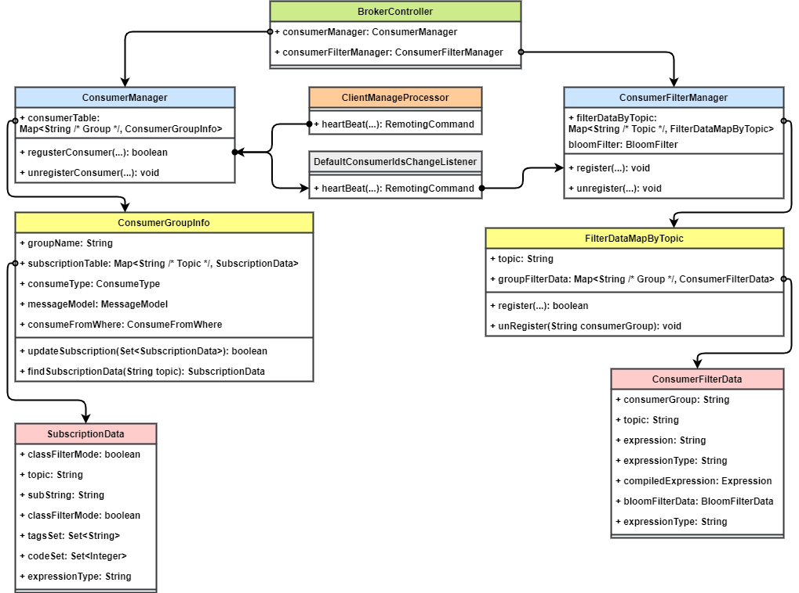
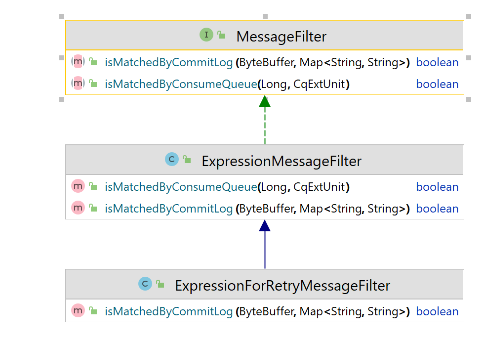
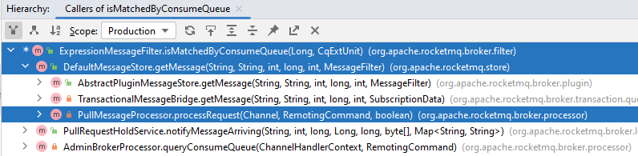
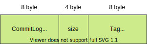
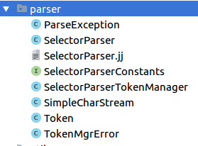
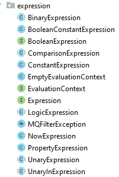

# Rocketmq Filter 消息过滤（TAGS、SQL92）原理详解 & 源码解析

## 1. 背景

### 1.1 Rocketmq 支持的过滤方式

Rocketmq 作为金融级的业务消息中间件，拥有强大的消息过滤能力。其支持多种消息过滤方式：

* 表达式过滤：通过设置过滤表达式的方式进行过滤
  * TAG：根据消息的 tag 进行过滤。
  * SQL92：可以用 SQL92 表达式来灵活地过滤消息的 tag 和属性。
* 类过滤：可以新建一个过滤类，编写自定义的过滤规则。

### 1.2 使用方法

#### 1.2.1 TAG 过滤

Tag 过滤是最简单的一种过滤方法，通常 Tag 可以用作消息的业务标识。可以设置 Tag 表达式，判断消息是否包含这个 Tag。

##### 生产者

```java
String[] tags = new String[] {"TagA", "TagB", "TagC"};
for (int i = 0; i < 60; i++) {
    Message msg = new Message("TagFilterTest",
        tags[i % tags.length],				// 设置消息 Tag
        "Hello world".getBytes(RemotingHelper.DEFAULT_CHARSET));
    msg.setTags(tags[i % tags.length]);		// 也可以通过 setTags 方法设置 Tag
    SendResult sendResult = producer.send(msg);
}
```

##### 消费者

在消费时，可以通过表达式过滤的方式设置需要过滤的 Tag，用 `||` 表达式表示或的意思，可以匹配多个 Tag。

```java
// 4.9.x
consumer.subscribe("TagFilterTest", "TagA || TagC");
```

在 Rocketmq 5.x 客户端之后，引入了新的订阅表达式写法：

```java
// 5.x
// 只订阅消息标签为"TagA"、"TagB"或"TagC"的消息。
FilterExpression filterExpression = new FilterExpression("TagA||TagB||TagC", FilterExpressionType.TAG);
pushConsumer.subscribe("TagFilterTest", filterExpression);
```

#### 1.2.2 SQL92

SQL92 过滤比 Tag 过滤更灵活，它可以使用SQL92语法作为过滤规则表达式，可以过滤消息的属性和 Tag（在SQL语法中，Tag的属性名称为TAGS）。

如果要使用 SQL92 过滤，需要设置 Broker 的配置项 `enablePropertyFilter=true`，这个配置默认为 `false`。

```properties
enablePropertyFilter=true
```

它的过滤语法规则如下：

| 语法                    | 说明                                                         | 示例                                                         |
| ----------------------- | ------------------------------------------------------------ | ------------------------------------------------------------ |
| IS NULL                 | 判断属性不存在。                                             | `a IS NULL` ：属性a不存在。                                  |
| IS NOT NULL             | 判断属性存在。                                               | `a IS NOT NULL`：属性a存在。                                 |
| *>* >= *\<* \<=         | 用于比较数字，不能用于比较字符串，否则消费者客户端启动时会报错。 **说明** 可转化为数字的字符串也被认为是数字。 | *`a IS NOT NULL AND a > 100`：属性a存在且属性a的值大于100。* `a IS NOT NULL AND a > 'abc'`：错误示例，abc为字符串，不能用于比较大小。 |
| BETWEEN xxx AND xxx     | 用于比较数字，不能用于比较字符串，否则消费者客户端启动时会报错。等价于>= xxx AND \<= xxx。表示属性值在两个数字之间。 | `a IS NOT NULL AND (a BETWEEN 10 AND 100)`：属性a存在且属性a的值大于等于10且小于等于100。 |
| NOT BETWEEN xxx AND xxx | 用于比较数字，不能用于比较字符串，否则消费者客户端启动会报错。等价于\< xxx OR > xxx，表示属性值在两个值的区间之外。 | `a IS NOT NULL AND (a NOT BETWEEN 10 AND 100)`：属性a存在且属性a的值小于10或大于100。 |
| IN (xxx, xxx)           | 表示属性的值在某个集合内。集合的元素只能是字符串。           | `a IS NOT NULL AND (a IN ('abc', 'def'))`：属性a存在且属性a的值为abc或def。 |
| *=* \<>                 | 等于和不等于。可用于比较数字和字符串。                       | `a IS NOT NULL AND (a = 'abc' OR a<>'def')`：属性a存在且属性a的值为abc或a的值不为def。 |
| *AND* OR                | 逻辑与、逻辑或。可用于组合任意简单的逻辑判断，需要将每个逻辑判断内容放入括号内。 | `a IS NOT NULL AND (a > 100) OR (b IS NULL)`：属性a存在且属性a的值大于100或属性b不存在。 |

##### 生产者

```java
String[] tags = new String[] {"TagA", "TagB", "TagC"};
for (int i = 0; i < 10; i++) {
    Message msg = new Message("SqlFilterTest",
        tags[i % tags.length],
        ("Hello RocketMQ " + i).getBytes(RemotingHelper.DEFAULT_CHARSET)
    );
    msg.putUserProperty("a", String.valueOf(i));		// 设置消息属性

    SendResult sendResult = producer.send(msg);
    System.out.printf("%s%n", sendResult);
}
```

##### 消费者

```java
// 4.9.x
consumer.subscribe("SqlFilterTest",
    MessageSelector.bySql("(TAGS is not null and TAGS in ('TagA', 'TagB'))" +
        "and (a is not null and a between 0 and 3)"));
```

```java
// 5.x
FilterExpression filterExpression = new FilterExpression("TAGS is not null and TAGS in ('TagA', 'TagB')", FilterExpressionType.SQL92);
simpleConsumer.subscribe("SqlFilterTest", filterExpression);
```

## 2. 概要设计

### 2.1 过滤信息的注册

消费者启动时（和每隔一段时间）会向 Broker 端发送心跳，心跳的信息就包含消费者的订阅信息（和过滤信息）。Broker 端有一个专门的消费者过滤信息管理器，更新和存储消费者的过滤信息。

### 2.2 表达式过滤

表达式过滤的逻辑在 Broker 端处理消费者的拉取消息请求时执行。

Rocketmq 的消息过滤接口`MessageFilter` 设计了两层过滤机制，它定义了两个方法，分别是根据消费队列过滤和根据消息详情过滤。这样设计的原因是：根据消息属性精确匹配的性能消耗比较大，所以先根据消费队列进行一次过滤，剩下的消息再根据消息详情过滤，可以减少比较次数，提升性能。

#### 2.2.1 Tag 过滤

对于 Tag 过滤，在构建消费队列时会保存根据消息 Tag 生成的 Hash 码（Long 类型，8 字节）。

根据消费队列过滤时，先计算消息的 Hash 码，判断是否与消费队列中保存的 hash 码一致。如果一致，说明消息的 Tag **有可能**是过滤匹配的 Tag，需要进一步匹配。这是由于不同的 Tag 字符串计算出的 Hash 码可能相同。

在 Broker 端，Tag 过滤不会进行进一步的匹配，而是在消费者端处理消息拉取结果时进行判断，如果过滤规则 Tag 集合中包含消息的 Tag，则返回给消费者，否则不消费。

#### 2.2.2 SQL92 过滤

对于 SQL92 过滤，也有两层过滤机制。第一层根据消费队列过滤主要是用来在许多消费组之间筛选出有可能匹配的消费组，第二层过滤（消息详情过滤）则根据消费组设定的过滤表达式，根据消息的属性和 Tag 进行精确匹配过滤。

具体的做法是，在消息生产时构造消费队列的过程当中，获取所有订阅该 Topic 的有过滤条件的消费组，预先根据这些消费组的过滤表达式进行一次精确匹配，计算出这条消息是否匹配。

随后将这些匹配的消费组的名称通过布隆过滤器进行计算，得到一个二进制数组，将其放入消费队列的扩展存储中。

布隆过滤器可以用来判断某个元素是否可能存在于集合中，在这里就用来判断这个消息是否可能匹配某个消费组的过滤规则。

在第一层过滤（消费队列过滤）时，从消费队列扩展存储中取出这个消息的布隆过滤器产生的二进制数组，用它来判断这个消费者是否可能匹配过滤规则；然后在第二层过滤时将通过第一层过滤的消息信息进行 SQL92 表达式匹配。

其中，在消息生产时用布隆过滤器计算二进制数组的操作和构造消费队列扩展存储的操作默认都是关闭的，也就是说默认只会进行 SQL92 表达式计算来精确匹配。如果要开启则需要设置一下配置项：

```properties
enableCalcFilterBitMap=true		# 设置在构造消费队列时，用布隆过滤器计算匹配过滤条件的消费组，构造成二进制数组
enableConsumeQueueExt=true		# 启用消费队列扩展存储，二进制数组会存到扩展存储中
```

开启这两项相当于开启了第一层过滤（消费队列过滤），它其实是把精确过滤的逻辑提前到消息生产时来做。

## 3. 详细设计

### 3.1 过滤信息注册

Tag 过滤信息和 SQL92 过滤信息的保存位置不同。

Tag 过滤信息由消费者发送心跳时有 Broker 端心跳处理方法调用 `ConsumerManager#registerConsumer` 进行更新，它存在 `ConsumerManager` 的 `ConcurrentMap<String/* Group */, ConsumerGroupInfo> consumerTable` 表中。其中的 `SubscriptionData` 就保存着 Tag 过滤表达式。

SQL92 过滤信息的注册也是由消费这发送心跳触发，它的存储位置是 `ConsumerFilterManager`，最终的 `ConsumerFilterData` 中包含了编译好的过滤表达式。



### 3.2 过滤器接口



Rocketmq 的消息过滤逻辑（表达式过滤、类过滤）都需要实现 `MessageFilter` 接口。它的两个方法先后在从 `MessageStore` 获取消息时调用。通过这两个过滤方法，可以实现二层过滤，先根据较少的信息（消费队列）进行一次粗粒度的过滤，再根据完整的消息信息做精确过滤，这样能够减少精确过滤的次数，提升性能。

* `boolean isMatchedByConsumeQueue(Long tagsCode, ConsumeQueueExt.CqExtUnit cqExtUnit)`：根据消费队列判断消息是否匹配过滤规则
  * `Long tagsCode`：存在消费队列中消息的 Hash 码
  * `CqExtUnit cqExtUnit`：消息消费队列扩展属性，为 SQL92 过滤专用，需要开启配置项才会存储扩展属性。
* `boolean isMatchedByCommitLog(ByteBuffer msgBuffer, Map<String, String> properties)`：根据完整消息来判断消息是否匹配过滤规则
  * `ByteBuffer msgBuffer`：完整消息内容
  * `Map<String, String> Properties`：消息属性，主要用于 SQL92 过滤

SQL92 和 Tag 过滤的逻辑都在 `ExpressionMessageFilter` 中，`ExpressionForRetryMessageFilter` 则为支持重试 Topic 的 Filter 实现。

其中 Tag 过滤只用到 `isMatchedByConsumeQueue`，而 SQL92 过滤主要用到 `isMatchedByCommitLog`，如果开启了一些配置则也会用到 `isMatchedByConsumeQueue`。

---

下面是 Tag 过滤的主方法 `isMatchedByConsumeQUeue` 和 `isMatchedByCommitLog`的调用层级（在 `getMessage` 中先后被调用）：



* `PullMessageProcessor#processRequest`： Broker 端消息拉取请求的入口。先尝试从消息拉取请求中获取过滤信息，如果没有则从服务端 `ConsumerManager` 中获取过滤信息，然后用订阅信息构造一个 `ExpressionMessageFilter`，将其传入 `getMessage` 。

* `DefaultMessageStore#getMessage` ：先根据 Topic 和队列 offset 获取消息的消费索引，然后根据消费索引从 CommitLog 查出完整消息。
  * 查出消费索引后，会先执行 `isMatchedByConsumeQueue` 的判断
  * 查出完整消息后，再执行 `isMatchedByCommitLog` 的判断

### 3.3 Tag 过滤

Rocketmq 的消费队列中专门开辟了 8 个字节的存储位置用于存储消息的 Tag 字符串的 Hash 码，用来为 Tag 过滤进行初筛。之所以不直接存 Tag 字符串，是因为 ConsumeQueue 的存储项是定长结构，加快处理性能。而且 ConsumeQueue 是内存映射文件，每个文件也不宜太大。



在消费者上报心跳，注册消费者时就会把过滤信息（Tag 的 Hash 码）生成，放入 `ConsumerManager` 中。

在 Broker 端，它只在 `isMatchedByConsumeQueue` 方法中判断该消息 Tag 的 Hash 码是否在过滤规则允许的 Tag Hash 码列表中，如果在则表示该消息可能符合过滤条件，返回给消费者。

在消费者端处理拉取结果的方法 `PullApiWrapper#processPullResult` 中，再进行精确判断，如果过滤匹配的 Tag 字符串列表中包含消息的 Tag，则返回给消费者消费。

### 3.4 SQL92 过滤

#### 3.4.1 编译 SQL 语句

Rocketmq 从 ActiveMQ 中拿到的 `SelectorParser.jj` 语法标准文件，在其之上做了一些修改。用它能够将消费者端指定的 SQL 语句解析为 `Expression` 表达式对象，方便后续消息的过滤匹配。

> [JavaCC (Java Compiler Compiler)](https://javacc.org/) 是一个能生成语法和词法分析器的生成程序，它通过阅读一个自定义的语法标准文件 (通常以 `jj` 为后缀名) ，然后就能生成能够解析该语法的扫描器和解析器的代码。
>
> 通过执行 `javacc SelectorParser.jj` 命令以后，其会生成如下七个 Java 文件，用以解析 SQL 语法：
>
> 

其中 `SelectorParser.java` 是主要的解析器类，会将 SQL92 表达式解析成一个抽象语法树（由 `Expression` 对象组成）。

`SqlFilter#compile` 作为表达式编译的入口，内部调用 `SelectorParser#parse`  方法，将 SQL92 语句编译成 `Expression` 表达式对象。

Rocketmq 实现了一些基本的 `Expression` 用以执行基本的 SQL92 过滤逻辑：



---

编译 SQL92 `Expression` 表达式的时机与 Tag 表达式类似。消费者上报心跳，注册消费者时会预先编译好，放在 `ConsumerFilterManager` 中。

在 Broker 端处理拉取消息请求时，先判断拉取消息请求是否带有过滤信息，如果带有，则根据过滤信息编译；否则从 `ConsumerFilterManager` 中获取编译好的。

#### 3.4.2 布隆过滤器 BloomFilter

#### 3.4.3 生成二进制位映射表

#### 3.4.4 消息过滤

## 4. 源码解析


## 参考资料

* [官方文档——消息过滤](https://rocketmq.apache.org/zh/docs/featureBehavior/07messagefilter)
* [RocketMQ 消息过滤流程——赵坤](https://kunzhao.org/docs/rocketmq/rocketmq-message-filter-flow)
* [源码分析RocketMQ消息过滤机制下篇-FilterServer、ClassFilter模式详解——丁威](https://blog.csdn.net/prestigeding/article/details/79287382)