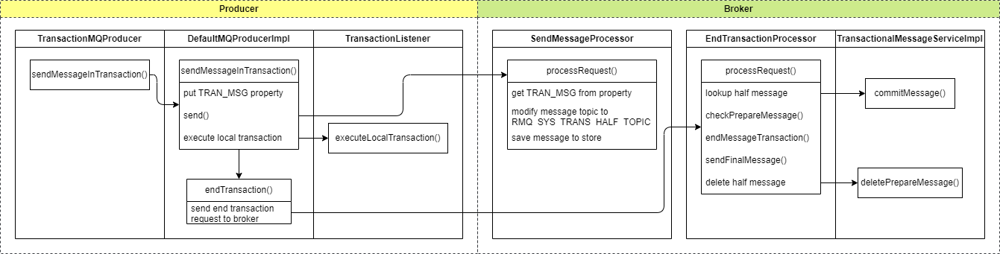

# RocketMQ 事务消息原理详解 & 源码解析

## 1. 背景

在当下的互联网时代，微服务架构兴起，业务量也达到了惊人的量级。消息队列作为微服务架构解耦、流量削峰、异步处理等的重要组件，成为了微服务架构中不可或缺的一部分。

事务指的是一系列操作，要么全部成功，要么全部失败，事务在业务系统中也有大规模的应用。当涉及到事务相关的系统模块时，普通消息无法满足“本地操作和消息发送”要么全部成功，要么全部失败的需求，因此有了事务消息的需求。

RocketMQ 在 4.3.0 版本开始支持分布式事务消息。RocketMQ 的事务消息在普通消息基础上，支持二阶段的提交能力。将二阶段提交和本地事务绑定，实现全局提交结果的一致性。

本文将基于 RocketMQ 5.3.x 源码，分析 RocketMQ 事务消息的实现原理。

## 2. 使用示例

本示例使用 RocketMQ 4.x 的 Java 客户端实现。

### 2.1 创建事务 Topic

事先创建好一个 Topic 用作事务消息接收。RocketMQ 5.x 版本之后，需要在创建 Topic 时指定消息类型，这里创建一个 `TRANSACTION` 类型的 Topic。

```bash
./bin/mqadmin updatetopic -n localhost:9876 -t TopicTest1234 -c DefaultCluster -a +message.type=TRANSACTION
```

### 2.2 实现事务消息本地执行和回查逻辑

然后需要实现 `TransactionListener` 接口，该接口有两个方法：

* `executeLocalTransaction`：执行本地事务，这个方法中填写本地事务逻辑，返回 `LocalTransactionState` 枚举值，表示本地事务的状态。
* `checkLocalTransaction`：检查本地事务，返回 `LocalTransactionState` 枚举值，表示本地事务的状态。

如果执行本地事务的操作直接返回 `LocalTransactionState.COMMIT_MESSAGE` 或 `LocalTransactionState.ROLLBACK_MESSAGE`，则不会调用 `checkLocalTransaction` 方法。如果返回 `LocalTransactionState.UNKNOW`，表示本地事务暂时没有执行完，结果未知，则会在后续调用 `checkLocalTransaction` 方法来检查本地事务执行的状态。

```java
public class TransactionListenerImpl implements TransactionListener {
    private AtomicInteger transactionIndex = new AtomicInteger(0);

    private ConcurrentHashMap<String, Integer> localTrans = new ConcurrentHashMap<>();

    @Override
    public LocalTransactionState executeLocalTransaction(Message msg, Object arg) {
        // 用作示例，模拟 3 种本地事务的执行结果
        int value = transactionIndex.getAndIncrement();
        int status = value % 3;
        localTrans.put(msg.getTransactionId(), status);
        // 故意返回 UNKNOW，模拟本地事务未执行完，需要执行事务状态检查
        return LocalTransactionState.UNKNOW;
    }

    @Override
    public LocalTransactionState checkLocalTransaction(MessageExt msg) {
        // 根据本地事务随机模拟的 3 种执行结果，返回对应的本地事务状态
        Integer status = localTrans.get(msg.getTransactionId());
        if (null != status) {
            switch (status) {
                case 0:
                    return LocalTransactionState.UNKNOW;
                case 1:
                    return LocalTransactionState.COMMIT_MESSAGE;
                case 2:
                    return LocalTransactionState.ROLLBACK_MESSAGE;
            }
        }
        return LocalTransactionState.COMMIT_MESSAGE;
    }
}
```

### 2.3 事务消息生产者

然后创建一个 `TransactionMQProducer` 实例，并设置 `TransactionListener`。

```java
public static void main(String[] args) throws MQClientException, InterruptedException {
    TransactionListener transactionListener = new TransactionListenerImpl();
    TransactionMQProducer producer = new TransactionMQProducer(PRODUCER_GROUP, Arrays.asList(TOPIC));

    producer.setNamesrvAddr(DEFAULT_NAMESRVADDR);
    // 本地事务执行状态回查线程池
    ExecutorService executorService = new ThreadPoolExecutor(2, 5, 100, TimeUnit.SECONDS, new ArrayBlockingQueue<>(2000), r -> {
        Thread thread = new Thread(r);
        thread.setName("client-transaction-msg-check-thread");
        return thread;
    });

    producer.setExecutorService(executorService);
    // 设置之前定义的本地事务执行和回查监听器实例
    producer.setTransactionListener(transactionListener);
    producer.start();

    String[] tags = new String[] {"TagA", "TagB", "TagC", "TagD", "TagE"};
    for (int i = 0; i < MESSAGE_COUNT; i++) {
        try {
            Message msg =
                new Message(TOPIC, tags[i % tags.length], "KEY" + i,
                    ("Hello RocketMQ " + i).getBytes(RemotingHelper.DEFAULT_CHARSET));
            SendResult sendResult = producer.sendMessageInTransaction(msg, null);
            System.out.printf("%s%n", sendResult);

            Thread.sleep(10);
        } catch (MQClientException | UnsupportedEncodingException e) {
            e.printStackTrace();
        }
    }
    // ...
}
```

### 2.4 消费者

最后启动一个消费者来消费事务消息。

```java
public static void main(String[] args) throws InterruptedException, MQClientException {

    DefaultMQPushConsumer consumer = new DefaultMQPushConsumer(CONSUMER_GROUP);

    // Uncomment the following line while debugging, namesrvAddr should be set to your local address
    consumer.setNamesrvAddr(NAMESRV_ADDR);

    consumer.subscribe(TOPIC, "*");
    consumer.setConsumeFromWhere(ConsumeFromWhere.CONSUME_FROM_FIRST_OFFSET);
    consumer.registerMessageListener(new MessageListenerConcurrently() {

        @Override
        public ConsumeConcurrentlyStatus consumeMessage(List<MessageExt> msgs, ConsumeConcurrentlyContext context) {
            System.out.printf("%s Receive New Messages: %s %n", Thread.currentThread().getName(), msgs);
            return ConsumeConcurrentlyStatus.CONSUME_SUCCESS;
        }
    });
    consumer.start();
    System.out.printf("Consumer Started.%n");
}
```

### 2.5 运行结果

生产者的运行日志如下：

```log
SendResult [sendStatus=SEND_OK, msgId=C0A80109803418B4AAC25D18010D0000, offsetMsgId=null, messageQueue=MessageQueue [topic=TopicTest1234, brokerName=broker-a, queueId=0], queueOffset=0, recallHandle=null]
SendResult [sendStatus=SEND_OK, msgId=C0A80109803418B4AAC25D1801BE0001, offsetMsgId=null, messageQueue=MessageQueue [topic=TopicTest1234, brokerName=broker-a, queueId=1], queueOffset=1, recallHandle=null]
SendResult [sendStatus=SEND_OK, msgId=C0A80109803418B4AAC25D1801CD0002, offsetMsgId=null, messageQueue=MessageQueue [topic=TopicTest1234, brokerName=broker-a, queueId=2], queueOffset=2, recallHandle=null]
SendResult [sendStatus=SEND_OK, msgId=C0A80109803418B4AAC25D1801DA0003, offsetMsgId=null, messageQueue=MessageQueue [topic=TopicTest1234, brokerName=broker-a, queueId=3], queueOffset=3, recallHandle=null]
SendResult [sendStatus=SEND_OK, msgId=C0A80109803418B4AAC25D1801E70004, offsetMsgId=null, messageQueue=MessageQueue [topic=TopicTest1234, brokerName=broker-a, queueId=0], queueOffset=4, recallHandle=null]
SendResult [sendStatus=SEND_OK, msgId=C0A80109803418B4AAC25D1801F50005, offsetMsgId=null, messageQueue=MessageQueue [topic=TopicTest1234, brokerName=broker-a, queueId=1], queueOffset=5, recallHandle=null]
SendResult [sendStatus=SEND_OK, msgId=C0A80109803418B4AAC25D1802020006, offsetMsgId=null, messageQueue=MessageQueue [topic=TopicTest1234, brokerName=broker-a, queueId=2], queueOffset=6, recallHandle=null]
SendResult [sendStatus=SEND_OK, msgId=C0A80109803418B4AAC25D18020F0007, offsetMsgId=null, messageQueue=MessageQueue [topic=TopicTest1234, brokerName=broker-a, queueId=3], queueOffset=7, recallHandle=null]
SendResult [sendStatus=SEND_OK, msgId=C0A80109803418B4AAC25D18021D0008, offsetMsgId=null, messageQueue=MessageQueue [topic=TopicTest1234, brokerName=broker-a, queueId=0], queueOffset=8, recallHandle=null]
SendResult [sendStatus=SEND_OK, msgId=C0A80109803418B4AAC25D18022B0009, offsetMsgId=null, messageQueue=MessageQueue [topic=TopicTest1234, brokerName=broker-a, queueId=1], queueOffset=9, recallHandle=null]
```

消费者运行日志如下：

```log
Consumer Started.
ConsumeMessageThread_CID_JODIE_1_1 Receive New Messages: [MessageExt [brokerName=broker-a, queueId=0, storeSize=420, queueOffset=0, sysFlag=8, bornTimestamp=1737222654439, bornHost=/127.0.0.1:5290, storeTimestamp=1737222675592, storeHost=/127.0.0.1:10911, msgId=7F00000100002A9F000000104A169B49, commitLogOffset=69962472265, bodyCRC=601994070, reconsumeTimes=0, preparedTransactionOffset=69962469259, toString()=Message{topic='TopicTest1234', flag=0, properties={CONSUME_START_TIME=1737222710178, MSG_REGION=DefaultRegion, UNIQ_KEY=C0A80109803418B4AAC25D1801E70004, CLUSTER=DefaultCluster, PGROUP=please_rename_unique_group_name, MIN_OFFSET=0, __transactionId__=C0A80109803418B4AAC25D1801E70004, TAGS=TagE, TRAN_MSG=true, KEYS=KEY4, WAIT=true, TRACE_ON=true, TRANSACTION_CHECK_TIMES=1, REAL_TOPIC=TopicTest1234, MAX_OFFSET=1, REAL_QID=0}, body=[72, 101, 108, 108, 111, 32, 82, 111, 99, 107, 101, 116, 77, 81, 32, 52], transactionId='C0A80109803418B4AAC25D1801E70004'}]] 
ConsumeMessageThread_CID_JODIE_1_2 Receive New Messages: [MessageExt [brokerName=broker-a, queueId=1, storeSize=420, queueOffset=0, sysFlag=8, bornTimestamp=1737222654398, bornHost=/127.0.0.1:5290, storeTimestamp=1737222675591, storeHost=/127.0.0.1:10911, msgId=7F00000100002A9F000000104A1699A5, commitLogOffset=69962471845, bodyCRC=1401636825, reconsumeTimes=0, preparedTransactionOffset=69962467966, toString()=Message{topic='TopicTest1234', flag=0, properties={CONSUME_START_TIME=1737222710178, MSG_REGION=DefaultRegion, UNIQ_KEY=C0A80109803418B4AAC25D1801BE0001, CLUSTER=DefaultCluster, PGROUP=please_rename_unique_group_name, MIN_OFFSET=0, __transactionId__=C0A80109803418B4AAC25D1801BE0001, TAGS=TagB, TRAN_MSG=true, KEYS=KEY1, WAIT=true, TRACE_ON=true, TRANSACTION_CHECK_TIMES=1, REAL_TOPIC=TopicTest1234, MAX_OFFSET=1, REAL_QID=1}, body=[72, 101, 108, 108, 111, 32, 82, 111, 99, 107, 101, 116, 77, 81, 32, 49], transactionId='C0A80109803418B4AAC25D1801BE0001'}]] 
ConsumeMessageThread_CID_JODIE_1_3 Receive New Messages: [MessageExt [brokerName=broker-a, queueId=3, storeSize=420, queueOffset=0, sysFlag=8, bornTimestamp=1737222654479, bornHost=/127.0.0.1:5290, storeTimestamp=1737222675592, storeHost=/127.0.0.1:10911, msgId=7F00000100002A9F000000104A169CED, commitLogOffset=69962472685, bodyCRC=988340972, reconsumeTimes=0, preparedTransactionOffset=69962470552, toString()=Message{topic='TopicTest1234', flag=0, properties={CONSUME_START_TIME=1737222710178, MSG_REGION=DefaultRegion, UNIQ_KEY=C0A80109803418B4AAC25D18020F0007, CLUSTER=DefaultCluster, PGROUP=please_rename_unique_group_name, MIN_OFFSET=0, __transactionId__=C0A80109803418B4AAC25D18020F0007, TAGS=TagC, TRAN_MSG=true, KEYS=KEY7, WAIT=true, TRACE_ON=true, TRANSACTION_CHECK_TIMES=1, REAL_TOPIC=TopicTest1234, MAX_OFFSET=1, REAL_QID=3}, body=[72, 101, 108, 108, 111, 32, 82, 111, 99, 107, 101, 116, 77, 81, 32, 55], transactionId='C0A80109803418B4AAC25D18020F0007'}]] 
```

只收到 3 条消息，因为发送时模拟了 3 种本地事务的执行结果，只有 3 条消息是 `COMMIT_MESSAGE` 状态，4 条消息是 `UNKNOW` 状态，3 条消息是 `ROLLBACK_MESSAGE` 状态。
`UNKNOWN` 状态的消息会继续进行回查，`ROLLBACK_MESSAGE` 状态的消息会被丢弃。

## 3. 概要设计

RocketMQ 的事务实现方式为二阶段提交：

1. 先将原始消息以事务半消息的形式发送到服务端，对消费者不可见。
2. 然后生产者执行本地事务，根据本地事务执行结果来复原或丢弃事务半消息。
3. 如果本地事务执行结果未知，则服务端对生产者进行定期回查本地事务执行状态。
4. 根据回查的本地事务执行结果，服务端将事务半消息复原或丢弃。

整个流程如下图所示：


1. 生产者（Sender）发送消息到 RocketMQ 服务端（Server），除了原本的信息外，向消息属性中添加了事务消息标识，表示一个事务半消息（Half message）。
2. 我们并不希望事务半消息被消费者消费到，所以它被保存在服务端一个专门用来保存半消息的特殊 Topic 中，消息持久化成功之后，向生产者返回 Ack 确认消息已经发送成功。
3. 生产者开始执行本地事务逻辑。
4. 生产者将本地事务执行结果上报给服务端。如果本地事务无法马上执行完，应上报 Unknown；执行成功则上报 Commit，执行失败上报 Rollback。服务端收到确认结果后处理逻辑如下：
   - Unknown：暂不处理，服务端在一定时间后，对生产者实例发起定时回查。
   - Commit/Rollback：生成一个事务操作消息（OP 消息），记录该事务半消息的最终处理结果，然后将 OP 消息保存到 OP Topic 中。在后面服务端定期回查前，从 OP Topic 中查询 OP 消息，如果能找到 OP 消息，表示该事务半消息需要提交或回滚，则执行提交或回滚操作。
5. 服务端进行定时回查，对半消息 Topic 中的半消息进行回查。先根据 OP Topic 中是否有该半消息对应的 OP 消息来判断半消息的执行结果。
   - 没有 OP 消息：进行回查。
   - 有 Commit 的 OP 消息：将半消息复原，发送到真实的 Topic，可以投递给消费者。
   - 有 Rollback 的 OP 消息：丢弃半消息。
6. 生产者收到消息回查请求后，检查对应消息的本地事务执行的最终结果。
7. 生产者将本地事务执行状态上报给服务端，进行二次确认，服务端仍按照步骤 4 对半事务消息进行处理。

## 4. 原理详解

### 4.1 事务消息发送



#### 4.1.1 生产者发送事务消息


RocketMQ 为事务消息定义了专门的生产者类型 `TransactionMQProducer` 和本地事务执行接口 `TransactionListener`。

调用事务生产者的 `sendMessageInTransaction` 方法发送事务消息，该方法会调用 `DefaultMQProducerImpl` 的 `sendMessageInTransaction` 方法，事务消息发送的主要逻辑都在该方法中。

`sendMessageInTransaction` 方法接收一个普通消息，将它包装成事务半消息发送给 Broker，然后执行本地事务，上报执行结果给 Broker。详细逻辑如下：

1. 设置原始消息的 `TRAN_MSG` 属性设置为 `true`，表示该消息是一个事务半消息。
2. 发送半消息到 Broker。
3. 如果半消息发送成功，执行本地事务，获取本地事务执行结果；如果发送失败，则不执行。
4. 调用 `endTransaction` 方法，通知 Broker 本地事务执行结果。这里是异步单向请求，不需要等待响应。

#### 4.1.2 Broker 接收事务半消息


Broker 的消息生产请求处理器 `SendMessageProcessor` 的 `processRequest` 方法处理生产者发来的普通消息和事务消息。

该方法会检查消息的 `TRAN_MSG` 属性，如果为 `true`，则表示该消息是一个事务半消息。为了让消费者暂时无法消费到该消息，RocketMQ 的设计是将它保存到 `RMQ_SYS_TRANS_HALF_TOPIC` Topic 中。后续收到生产者的本地事务执行结果后，会根据执行结果将事务半消息查出来，复原或丢弃。

#### 4.1.3 Broker 接收事务执行结果请求

Broker 的事务执行结果处理逻辑会在以下两个情况下触发：

* 生产者第一次发送事务半消息，执行本地事务，会调用 `endTransaction` 方法，通知 Broker 本地事务执行结果。
* 生产者收到 Broker 的事务执行状态回查请求，会查询本地事务执行结果，然后上报给 Broker。

Broker 的 `EndTransactionProcessor` 的 `processRequest` 方法处理事务执行结果请求，它根据生产者上报的本地事务执行结果，将事务半消息复原或丢弃。详细逻辑如下：

* 如果本地事务执行状态为 `COMMIT_MESSAGE`：
  1. 根据请求头中的事务半消息物理偏移量，从存储中查询出事务半消息。
  2. 复原事务半消息的原始 Topic 和队列。
  3. 将复原后的消息保存到存储，此时消息可以被消费者消费。
  4. 删除事务半消息：将事务半消息存储在事务消息 OP Topic：RMQ_SYS_TRANS_OP_HALF_TOPIC 中，表示该消息已经被处理, 无需再次回查。
* 如果本地事务执行状态为 `ROLLBACK_MESSAGE`
  1. 从存储中查询出事务半消息
  2. 删除事务半消息
* 如果本地事务执行状态为 `UNKNOWN` 则不作处理

### 4.2 事务状态回查


#### 4.2.1 Broker 回查事务状态


Broker 的服务线程 `TransactionalMessageCheckService` 每 30s 触发一次 `TransactionalMessageServiceImpl#check` 方法进行事务消息的回查。该方法会从半消息 Topic 中取出半消息，与 OP Topic 中的消息进行匹配（匹配上则认为处理完）。对于没有处理完的半消息，发送回查请求给生产者组中的一个生产者，触发生产者上报本地事务执行状态。它的详细逻辑如下：

* 获取事务半消息 Topic 的所有队列，然后遍历这些队列（默认只有 1 个队列）
  1. 获取半消息队列对应的 OP Topic 的队列，OP Topic 是用来保存事务半消息的操作结果的 Topic，为 `RMQ_SYS_TRANS_OP_HALF_TOPIC`。在上面的 Broker 处理本地事务执行结果请求时，事务的执行结果会保存到该 Topic 中。
  2. 调用 `fillOpRemoveMap` 方法，查询一批 OP 消息，然后遍历它们，把它们对应的需要移除的半消息的逻辑偏移量放到 `removeMap` 中，用作后续匹配。
  3. 不断循环消费事务半消息进行处理，直到没有新的半消息或处理持续时间超过 60s：
    * 判断当前要消费的半消息的偏移量是否在 `removeMap` 中，如果在则表示该半消息已经提交或回滚，跳过，继续消费下一条。
    * 对于没有在 `removeMap` 中的半消息
      1. 调用 `getHalfMsg` 方法从存储中查询出该半消息
      2. 判断事务消息是否需要丢弃，即超过最大回查次数（15次）；或者是否需要跳过，即超过文件保存时间。如果是则丢弃后继续查询下一条。
      3. 更新半消息的回查次数（+1），在消息属性中。
      4. 计算事务半消息是否处在免疫回查期：即事务消息发送一段时间之内不进行回查，默认 6s。如果在免疫器则跳出回查循环。
      5. 如果需要回查，将半消息重新保存（因为前面更新了回查次数，这里会新写入一条消息，这也是为了后面能够重新消费到这条半消息再次进行回查的判断，如果回查次数多会导致写放大。)。
      6. 根据生产组，轮询一个生产者，异步发送单向消息回查请求。
      7. 回查时会复原半消息的原始 Topic 和队列，然后将其作为回查请求体发送给生产者。

> 这里 OP 消息的操作较为繁琐，它用来标记一条半消息的事务执行结果。一个优化方案是直接将半消息的事务执行结果覆写到半消息本身，这样后面判断半消息是否需要回查时可以直接根据半消息本身来判断。这个方案的好处是可以不需要 OP 消息繁琐的操作，坏处是这样会破坏 CommitLog WAL 的语义，造成随机读写。如果需要覆盖的半消息不在页缓存，会触发磁盘 I/O，速度就比较慢了。

#### 4.2.2 生产者处理事务状态回查请求


生产者处理 Broker 回查请求的主要方法是 `DefaultMQProducerImpl#checkLocalTransaction`，它根据 Broker 发回的半消息获取本地事务执行结果，然后将执行结果发回 Broker。

## 5. 源码解析

### 5.1 事务消息发送

#### 5.1.1 生产者发送事务消息

##### TransactionMQProducer#sendMessageInTransaction

```java
// TransactionMQProducer.java
/**
 * 发送事务消息
 * 
 * @param msg Transactional message to send.
 *            需要发送的事务消息
 * @param arg Argument used along with local transaction executor.
 *            本地事务执行器的参数
 * @return 事务消息发送结果
 */
@Override
public TransactionSendResult sendMessageInTransaction(final Message msg,
    final Object arg) throws MQClientException {
    if (null == this.transactionListener) {
        throw new MQClientException("TransactionListener is null", null);
    }

    msg.setTopic(NamespaceUtil.wrapNamespace(this.getNamespace(), msg.getTopic()));
    return this.defaultMQProducerImpl.sendMessageInTransaction(msg, null, arg);
}
```

##### DefaultMQProducerImpl#sendMessageInTransaction

```java
// DefaultMQProducerImpl.java
/**
 * 发送事务消息
 * 
 * @param msg 事务消息
 * @param localTransactionListener 本地事务执行和状态检查器
 * @param arg 本地事务执行参数
 */
public TransactionSendResult sendMessageInTransaction(final Message msg,
    final TransactionListener localTransactionListener, final Object arg)
    throws MQClientException {
    TransactionListener transactionListener = getCheckListener();
    if (null == localTransactionListener && null == transactionListener) {
        throw new MQClientException("tranExecutor is null", null);
    }

    // ignore DelayTimeLevel parameter
    if (msg.getDelayTimeLevel() != 0) {
        MessageAccessor.clearProperty(msg, MessageConst.PROPERTY_DELAY_TIME_LEVEL);
    }

    Validators.checkMessage(msg, this.defaultMQProducer);

    SendResult sendResult = null;
    // 设置消息属性 TRAN_MSG，标记消息为事务消息
    MessageAccessor.putProperty(msg, MessageConst.PROPERTY_TRANSACTION_PREPARED, "true");
    MessageAccessor.putProperty(msg, MessageConst.PROPERTY_PRODUCER_GROUP, this.defaultMQProducer.getProducerGroup());
    try {
        // 发送半事务消息
        sendResult = this.send(msg);
    } catch (Exception e) {
        throw new MQClientException("send message Exception", e);
    }

    LocalTransactionState localTransactionState = LocalTransactionState.UNKNOW;
    Throwable localException = null;
    switch (sendResult.getSendStatus()) {
        case SEND_OK: {
            try {
                if (sendResult.getTransactionId() != null) {
                    msg.putUserProperty("__transactionId__", sendResult.getTransactionId());
                }
                String transactionId = msg.getProperty(MessageConst.PROPERTY_UNIQ_CLIENT_MESSAGE_ID_KEYIDX);
                if (null != transactionId && !"".equals(transactionId)) {
                    msg.setTransactionId(transactionId);
                }
                if (null != localTransactionListener) {
                    // 使用 DefaultMQProducerImpl 进行事务消息发送，执行本地事务
                    localTransactionState = localTransactionListener.executeLocalTransaction(msg, arg);
                } else {
                    // 使用新的 TransactionMQProducer 进行事务消息发送，执行本地事务
                    log.debug("Used new transaction API");
                    localTransactionState = transactionListener.executeLocalTransaction(msg, arg);
                }
                if (null == localTransactionState) {
                    localTransactionState = LocalTransactionState.UNKNOW;
                }

                if (localTransactionState != LocalTransactionState.COMMIT_MESSAGE) {
                    log.info("executeLocalTransactionBranch return: {} messageTopic: {} transactionId: {} tag: {} key: {}",
                        localTransactionState, msg.getTopic(), msg.getTransactionId(), msg.getTags(), msg.getKeys());
                }
            } catch (Throwable e) {
                log.error("executeLocalTransactionBranch exception, messageTopic: {} transactionId: {} tag: {} key: {}",
                    msg.getTopic(), msg.getTransactionId(), msg.getTags(), msg.getKeys(), e);
                localException = e;
            }
        }
        break;
        case FLUSH_DISK_TIMEOUT:
        case FLUSH_SLAVE_TIMEOUT:
        case SLAVE_NOT_AVAILABLE:
            localTransactionState = LocalTransactionState.ROLLBACK_MESSAGE;
            break;
        default:
            break;
    }

    try {
        // 结束事务，如果半消息发送失败或本地事务执行失败告诉服务端删除半消息，半消息发送成功且本地事务执行成功则告诉服务端让半消息复原
        this.endTransaction(msg, sendResult, localTransactionState, localException);
    } catch (Exception e) {
        log.warn("local transaction execute " + localTransactionState + ", but end broker transaction failed", e);
    }

    TransactionSendResult transactionSendResult = new TransactionSendResult();
    transactionSendResult.setSendStatus(sendResult.getSendStatus());
    transactionSendResult.setMessageQueue(sendResult.getMessageQueue());
    transactionSendResult.setMsgId(sendResult.getMsgId());
    transactionSendResult.setQueueOffset(sendResult.getQueueOffset());
    transactionSendResult.setTransactionId(sendResult.getTransactionId());
    transactionSendResult.setLocalTransactionState(localTransactionState);
    return transactionSendResult;
}
```

##### TransactionMQProducer#endTransaction

```java
// TransactionMQProducer.java
/**
 * 向 Broker 发送结束事务请求，根据本地事务执行状态，通知 Broker 半消息如何处理
 * 
 * @param msg 事务消息
 * @param sendResult 事务半消息的发送结果
 * @param localTransactionState 本地事务执行状态
 */
public void endTransaction(
    final Message msg,
    final SendResult sendResult,
    final LocalTransactionState localTransactionState,
    final Throwable localException) throws RemotingException, MQBrokerException, InterruptedException, UnknownHostException {
    final MessageId id;
    if (sendResult.getOffsetMsgId() != null) {
        id = MessageDecoder.decodeMessageId(sendResult.getOffsetMsgId());
    } else {
        id = MessageDecoder.decodeMessageId(sendResult.getMsgId());
    }
    String transactionId = sendResult.getTransactionId();
    final String destBrokerName = this.mQClientFactory.getBrokerNameFromMessageQueue(defaultMQProducer.queueWithNamespace(sendResult.getMessageQueue()));
    final String brokerAddr = this.mQClientFactory.findBrokerAddressInPublish(destBrokerName);
    EndTransactionRequestHeader requestHeader = new EndTransactionRequestHeader();
    requestHeader.setTopic(msg.getTopic());
    requestHeader.setTransactionId(transactionId);
    requestHeader.setCommitLogOffset(id.getOffset());
    requestHeader.setBrokerName(destBrokerName);
    // 根据本地事务执行状态设置事务结束请求类型
    switch (localTransactionState) {
        case COMMIT_MESSAGE:
            requestHeader.setCommitOrRollback(MessageSysFlag.TRANSACTION_COMMIT_TYPE);
            break;
        case ROLLBACK_MESSAGE:
            requestHeader.setCommitOrRollback(MessageSysFlag.TRANSACTION_ROLLBACK_TYPE);
            break;
        case UNKNOW:
            requestHeader.setCommitOrRollback(MessageSysFlag.TRANSACTION_NOT_TYPE);
            break;
        default:
            break;
    }

    // 执行事务结束钩子，这里主要会记录消息轨迹
    doExecuteEndTransactionHook(msg, sendResult.getMsgId(), brokerAddr, localTransactionState, false);
    requestHeader.setProducerGroup(this.defaultMQProducer.getProducerGroup());
    requestHeader.setTranStateTableOffset(sendResult.getQueueOffset());
    requestHeader.setMsgId(sendResult.getMsgId());
    String remark = localException != null ? ("executeLocalTransactionBranch exception: " + localException.toString()) : null;
    // 向 Broker 发送事务消息结束请求，根据本地事务执行状态通知 Broker 半消息如何处理
    this.mQClientFactory.getMQClientAPIImpl().endTransactionOneway(brokerAddr, requestHeader, remark,
        this.defaultMQProducer.getSendMsgTimeout());
}
```

#### 5.1.2 Broker 接收事务消息

##### SendMessageProcessor#processRequest 接收事务半消息

```java
// SendMessageProcessor.java
public RemotingCommand sendMessage(final ChannelHandlerContext ctx,
    final RemotingCommand request,
    final SendMessageContext sendMessageContext,
    final SendMessageRequestHeader requestHeader,
    final TopicQueueMappingContext mappingContext,
    final SendMessageCallback sendMessageCallback) throws RemotingCommandException {
    
    // ...

    // 尝试获取事务消息标识
    String traFlag = oriProps.get(MessageConst.PROPERTY_TRANSACTION_PREPARED);
    boolean sendTransactionPrepareMessage;
    if (Boolean.parseBoolean(traFlag)
        && !(msgInner.getReconsumeTimes() > 0 && msgInner.getDelayTimeLevel() > 0)) { //For client under version 4.6.1
        if (this.brokerController.getBrokerConfig().isRejectTransactionMessage()) {
            response.setCode(ResponseCode.NO_PERMISSION);
            response.setRemark(
                "the broker[" + this.brokerController.getBrokerConfig().getBrokerIP1()
                    + "] sending transaction message is forbidden");
            return response;
        }
        // 是事务消息
        sendTransactionPrepareMessage = true;
    } else {
        sendTransactionPrepareMessage = false;
    }

    // 异步存储消息
    if (brokerController.getBrokerConfig().isAsyncSendEnable()) {
        CompletableFuture<PutMessageResult> asyncPutMessageFuture;
        if (sendTransactionPrepareMessage) {
            // 如果是事务消息，构造事务半消息并存储
            asyncPutMessageFuture = this.brokerController.getTransactionalMessageService().asyncPrepareMessage(msgInner);
        } else {
            // 普通消息存储
            asyncPutMessageFuture = this.brokerController.getMessageStore().asyncPutMessage(msgInner);
        }

        final int finalQueueIdInt = queueIdInt;
        final MessageExtBrokerInner finalMsgInner = msgInner;
        asyncPutMessageFuture.thenAcceptAsync(putMessageResult -> {
            RemotingCommand responseFuture =
                handlePutMessageResult(putMessageResult, response, request, finalMsgInner, responseHeader, sendMessageContext,
                    ctx, finalQueueIdInt, beginTimeMillis, mappingContext, BrokerMetricsManager.getMessageType(requestHeader));
            if (responseFuture != null) {
                doResponse(ctx, request, responseFuture);
            }

            // record the transaction metrics, responseFuture == null means put successfully
            if (sendTransactionPrepareMessage && (responseFuture == null || responseFuture.getCode() == ResponseCode.SUCCESS)) {
                this.brokerController.getTransactionalMessageService().getTransactionMetrics().addAndGet(msgInner.getProperty(MessageConst.PROPERTY_REAL_TOPIC), 1);
            }

            sendMessageCallback.onComplete(sendMessageContext, response);
        }, this.brokerController.getPutMessageFutureExecutor());
        // Returns null to release the send message thread
        return null;
    // 同步存储消息
    } else {
        PutMessageResult putMessageResult = null;
        if (sendTransactionPrepareMessage) {
            // 如果是事务消息，构造事务半消息并存储
            putMessageResult = this.brokerController.getTransactionalMessageService().prepareMessage(msgInner);
        } else {
            // 普通消息存储
            putMessageResult = this.brokerController.getMessageStore().putMessage(msgInner);
        }
        handlePutMessageResult(putMessageResult, response, request, msgInner, responseHeader, sendMessageContext, ctx, queueIdInt, beginTimeMillis, mappingContext, BrokerMetricsManager.getMessageType(requestHeader));
        // record the transaction metrics
        if (putMessageResult.getPutMessageStatus() == PutMessageStatus.PUT_OK && putMessageResult.getAppendMessageResult().isOk()) {
            this.brokerController.getTransactionalMessageService().getTransactionMetrics().addAndGet(msgInner.getProperty(MessageConst.PROPERTY_REAL_TOPIC), 1);
        }
        sendMessageCallback.onComplete(sendMessageContext, response);
        return response;
    }
}
```

##### TransactionMessageBridge#parseHalfMessageInner 事务消息转换成事务半消息保存

```java
// TransactionMessageBridge.java
public PutMessageResult putHalfMessage(MessageExtBrokerInner messageInner) {
    return store.putMessage(parseHalfMessageInner(messageInner));
}

public CompletableFuture<PutMessageResult> asyncPutHalfMessage(MessageExtBrokerInner messageInner) {
    return store.asyncPutMessage(parseHalfMessageInner(messageInner));
}

/**
 * 准备事务半消息，将原消息的 Topic 和 QueueId 保存到消息属性中，然后将消息的 Topic 设置为 RMQ_SYS_TRANS_HALF_TOPIC 的 0 队列
 */
private MessageExtBrokerInner parseHalfMessageInner(MessageExtBrokerInner msgInner) {
    String uniqId = msgInner.getUserProperty(MessageConst.PROPERTY_UNIQ_CLIENT_MESSAGE_ID_KEYIDX);
    if (uniqId != null && !uniqId.isEmpty()) {
        MessageAccessor.putProperty(msgInner, TransactionalMessageUtil.TRANSACTION_ID, uniqId);
    }
    // 将原始消息的 Topic 和 QueueId 保存到事务半消息的属性中
    MessageAccessor.putProperty(msgInner, MessageConst.PROPERTY_REAL_TOPIC, msgInner.getTopic());
    MessageAccessor.putProperty(msgInner, MessageConst.PROPERTY_REAL_QUEUE_ID,
        String.valueOf(msgInner.getQueueId()));
    msgInner.setSysFlag(
        MessageSysFlag.resetTransactionValue(msgInner.getSysFlag(), MessageSysFlag.TRANSACTION_NOT_TYPE));
    // 设置事务半消息的 Topic 为 RMQ_SYS_TRANS_HALF_TOPIC
    msgInner.setTopic(TransactionalMessageUtil.buildHalfTopic());
    msgInner.setQueueId(0);
    msgInner.setPropertiesString(MessageDecoder.messageProperties2String(msgInner.getProperties()));
    return msgInner;
}
```

##### EndTransactionProcessor#processRequest 处理 EndTransaction 请求

```java
// EndTransactionProcessor.java
/**
 * 两个场景会发触发 END_TRANSACTION 请求
 * 1. 生产者第一次发送事务消息，执行完本地事务后
 * 2. 生产者收到服务端事务回查请求，查询完本地事务执行状态
 */
@Override
public RemotingCommand processRequest(ChannelHandlerContext ctx, RemotingCommand request) throws
    RemotingCommandException {
    final RemotingCommand response = RemotingCommand.createResponseCommand(null);
    final EndTransactionRequestHeader requestHeader =
        (EndTransactionRequestHeader) request.decodeCommandCustomHeader(EndTransactionRequestHeader.class);
    if (BrokerRole.SLAVE == brokerController.getMessageStoreConfig().getBrokerRole()) {
        response.setCode(ResponseCode.SLAVE_NOT_AVAILABLE);
        LOGGER.warn("Message store is slave mode, so end transaction is forbidden. ");
        return response;
    }
    
    // ...

    OperationResult result = new OperationResult();
    // 事务提交
    if (MessageSysFlag.TRANSACTION_COMMIT_TYPE == requestHeader.getCommitOrRollback()) {
        // 从存储中查询出事务半消息
        result = this.brokerController.getTransactionalMessageService().commitMessage(requestHeader);
        // 成功查询出事务半消息
        if (result.getResponseCode() == ResponseCode.SUCCESS) {
            if (rejectCommitOrRollback(requestHeader, result.getPrepareMessage())) {
                response.setCode(ResponseCode.ILLEGAL_OPERATION);
                LOGGER.warn("Message commit fail [producer end]. currentTimeMillis - bornTime > checkImmunityTime, msgId={},commitLogOffset={}, wait check",
                        requestHeader.getMsgId(), requestHeader.getCommitLogOffset());
                return response;
            }
            // 验证事务半消息的必要字段
            RemotingCommand res = checkPrepareMessage(result.getPrepareMessage(), requestHeader);
            if (res.getCode() == ResponseCode.SUCCESS) {
                // 验证成功
                // 恢复事务半消息的真实 Topic、队列，并设置事务 ID，并设置相关属性
                MessageExtBrokerInner msgInner = endMessageTransaction(result.getPrepareMessage());
                msgInner.setSysFlag(MessageSysFlag.resetTransactionValue(msgInner.getSysFlag(), requestHeader.getCommitOrRollback()));
                msgInner.setQueueOffset(requestHeader.getTranStateTableOffset());
                msgInner.setPreparedTransactionOffset(requestHeader.getCommitLogOffset());
                msgInner.setStoreTimestamp(result.getPrepareMessage().getStoreTimestamp());
                MessageAccessor.clearProperty(msgInner, MessageConst.PROPERTY_TRANSACTION_PREPARED);
                // 发送最终的事务消息，存储到 CommitLog 中，可以被消费者消费
                RemotingCommand sendResult = sendFinalMessage(msgInner);
                if (sendResult.getCode() == ResponseCode.SUCCESS) {
                    // 删除事务半消息：将事务半消息存储在事务消息操作 Topic：RMQ_SYS_TRANS_OP_HALF_TOPIC 中，表示该消息已经被处理
                    this.brokerController.getTransactionalMessageService().deletePrepareMessage(result.getPrepareMessage());
                    // successful committed, then total num of half-messages minus 1
                    this.brokerController.getTransactionalMessageService().getTransactionMetrics().addAndGet(msgInner.getTopic(), -1);
                    BrokerMetricsManager.commitMessagesTotal.add(1, BrokerMetricsManager.newAttributesBuilder()
                            .put(LABEL_TOPIC, msgInner.getTopic())
                            .build());
                    // record the commit latency.
                    Long commitLatency = (System.currentTimeMillis() - result.getPrepareMessage().getBornTimestamp()) / 1000;
                    BrokerMetricsManager.transactionFinishLatency.record(commitLatency, BrokerMetricsManager.newAttributesBuilder()
                            .put(LABEL_TOPIC, msgInner.getTopic())
                            .build());
                }
                return sendResult;
            }
            return res;
        }
    // 事务回滚
    } else if (MessageSysFlag.TRANSACTION_ROLLBACK_TYPE == requestHeader.getCommitOrRollback()) {
        // 从存储中查询出事务半消息
        result = this.brokerController.getTransactionalMessageService().rollbackMessage(requestHeader);
        if (result.getResponseCode() == ResponseCode.SUCCESS) {
            // 成功查询出事务半消息
            if (rejectCommitOrRollback(requestHeader, result.getPrepareMessage())) {
                response.setCode(ResponseCode.ILLEGAL_OPERATION);
                LOGGER.warn("Message rollback fail [producer end]. currentTimeMillis - bornTime > checkImmunityTime, msgId={},commitLogOffset={}, wait check",
                        requestHeader.getMsgId(), requestHeader.getCommitLogOffset());
                return response;
            }
            RemotingCommand res = checkPrepareMessage(result.getPrepareMessage(), requestHeader);
            if (res.getCode() == ResponseCode.SUCCESS) {
                // 删除事务半消息：将事务半消息存储在事务消息操作 Topic：RMQ_SYS_TRANS_OP_HALF_TOPIC 中，表示该消息已经被处理
                this.brokerController.getTransactionalMessageService().deletePrepareMessage(result.getPrepareMessage());
                // roll back, then total num of half-messages minus 1
                this.brokerController.getTransactionalMessageService().getTransactionMetrics().addAndGet(result.getPrepareMessage().getProperty(MessageConst.PROPERTY_REAL_TOPIC), -1);
                BrokerMetricsManager.rollBackMessagesTotal.add(1, BrokerMetricsManager.newAttributesBuilder()
                        .put(LABEL_TOPIC, result.getPrepareMessage().getProperty(MessageConst.PROPERTY_REAL_TOPIC))
                        .build());
            }
            return res;
        }
    }
    // 事务执行状态未知则不做处理
    response.setCode(result.getResponseCode());
    response.setRemark(result.getResponseRemark());
    return response;
}
```

### 5.2 事务状态回查

#### 5.2.1 Broker 回查事务状态

##### TransactionalMessageCheckService#onWaitEnd

```java
// TransactionalMessageCheckService.java
@Override
public void run() {
    log.info("Start transaction check service thread!");
    while (!this.isStopped()) {
        // 默认每 30s 检查一次
        long checkInterval = brokerController.getBrokerConfig().getTransactionCheckInterval();
        this.waitForRunning(checkInterval);
    }
    log.info("End transaction check service thread!");
}

@Override
protected void onWaitEnd() {
    // 事务消息回查免疫期，过了免疫期，即消息的存储时间 + 该值 > 系统当前时间，才对该消息执行事务状态回查。默认为 6s
    long timeout = brokerController.getBrokerConfig().getTransactionTimeOut();
    // 事务的最大检测次数，如果超过检测次数，消息会默认为丢弃，即 rollback 消息。默认 15 次
    int checkMax = brokerController.getBrokerConfig().getTransactionCheckMax();
    long begin = System.currentTimeMillis();
    log.info("Begin to check prepare message, begin time:{}", begin);
    // 发送请求到生产者客户端，回查事务消息执行状态
    this.brokerController.getTransactionalMessageService().check(timeout, checkMax, this.brokerController.getTransactionalMessageCheckListener());
    log.info("End to check prepare message, consumed time:{}", System.currentTimeMillis() - begin);
}
```

##### TransactionalMessageServiceImpl#check

```java
// TransactionalMessageServiceImpl.java
/**
 * 发送请求到生产者客户端，回查事务消息执行状态
 *
 * @param transactionTimeout The minimum time of the transactional message to be checked firstly, one message only
 * exceed this time interval that can be checked.
 *        事务消息首次回查的最小时间，超过这个时间间隔的事务消息才会被回查
 * @param transactionCheckMax The maximum number of times the message was checked, if exceed this value, this
 * message will be discarded.
 *        消息被回查的最大次数，超过这个次数则丢弃
 * @param listener When the message is considered to be checked or discarded, the relative method of this class will
 * be invoked.
 *        当消息被回查或者丢弃时，会调用该监听器的方法
 */
@Override
public void check(long transactionTimeout, int transactionCheckMax,
    AbstractTransactionalMessageCheckListener listener) {
    try {
        String topic = TopicValidator.RMQ_SYS_TRANS_HALF_TOPIC;
        // 获取事务半消息 Topic 的所有队列，默认只有 1 个队列
        Set<MessageQueue> msgQueues = transactionalMessageBridge.fetchMessageQueues(topic);
        if (msgQueues == null || msgQueues.size() == 0) {
            log.warn("The queue of topic is empty :" + topic);
            return;
        }
        for (MessageQueue messageQueue : msgQueues) {
            long startTime = System.currentTimeMillis();
            // 获取对应的操作队列，主题为：RMQ_SYS_TRANS_OP_HALF_TOPIC。该主题保存事务消息提交或者回滚的请求
            MessageQueue opQueue = getOpQueue(messageQueue);
            // 内部消费组 CID_SYS_RMQ_TRANS 对事务半消息的消费进度
            long halfOffset = transactionalMessageBridge.fetchConsumeOffset(messageQueue);
            // 内部消费组 CID_SYS_RMQ_TRANS 对操作队列的消费进度
            long opOffset = transactionalMessageBridge.fetchConsumeOffset(opQueue);
            log.info("Before check, the queue={} msgOffset={} opOffset={}", messageQueue, halfOffset, opOffset);
            if (halfOffset < 0 || opOffset < 0) {
                log.error("MessageQueue: {} illegal offset read: {}, op offset: {},skip this queue", messageQueue,
                    halfOffset, opOffset);
                continue;
            }

            // 已经处理完的操作消息的偏移量列表
            List<Long> doneOpOffset = new ArrayList<>();
            // 已经收到操作消息的事务半消息偏移量，需要被移除。key：半消息偏移量，value：操作消息偏移量
            HashMap<Long, Long> removeMap = new HashMap<>();
            // 在操作消息中的所有半消息的偏移量
            HashMap<Long, HashSet<Long>> opMsgMap = new HashMap<Long, HashSet<Long>>();
            // 拉取一批（32 条）操作队列的消息，填充 removeMap 和 opMsgMap。对于这批操作消息已经提交的事务半消息，不用回查需要移除
            PullResult pullResult = fillOpRemoveMap(removeMap, opQueue, opOffset, halfOffset, opMsgMap, doneOpOffset);
            if (null == pullResult) {
                log.error("The queue={} check msgOffset={} with opOffset={} failed, pullResult is null",
                    messageQueue, halfOffset, opOffset);
                continue;
            }
            // single thread
            // 获取空消息的次数
            int getMessageNullCount = 1;
            // 事务半消息队列的最新消费进度
            long newOffset = halfOffset;
            // 当前处理回查的事务半消息消费偏移量，从当前消费进度开始遍历
            long i = halfOffset;
            long nextOpOffset = pullResult.getNextBeginOffset();
            // 重新放入事务半消息队列的事务半消息数量
            int putInQueueCount = 0;
            int escapeFailCnt = 0;

            // 消息回查死循环，回查该队列中需要回查的事务半消息的执行状态
            while (true) {
                // 对该队列的消息的回查最多持续 60s
                if (System.currentTimeMillis() - startTime > MAX_PROCESS_TIME_LIMIT) {
                    log.info("Queue={} process time reach max={}", messageQueue, MAX_PROCESS_TIME_LIMIT);
                    break;
                }
                // 如果 removeMap 中包含该事务半消息的偏移量，说明该事务半消息已经被提交或者回滚，需要移除，不需要回查
                if (removeMap.containsKey(i)) {
                    log.debug("Half offset {} has been committed/rolled back", i);
                    Long removedOpOffset = removeMap.remove(i);
                    opMsgMap.get(removedOpOffset).remove(i);
                    if (opMsgMap.get(removedOpOffset).size() == 0) {
                        opMsgMap.remove(removedOpOffset);
                        doneOpOffset.add(removedOpOffset);
                    }
                // 该事务半消息没有被提交或者回滚，需要回查。查询出该事务半消息的消息体
                } else {
                    GetResult getResult = getHalfMsg(messageQueue, i);
                    // 事务半消息
                    MessageExt msgExt = getResult.getMsg();
                    if (msgExt == null) {
                        // 如果事务半消息 Topic 中获取不到消息，且超过最大获取不到消息的次数（默认 1 次），则结束本次回查
                        if (getMessageNullCount++ > MAX_RETRY_COUNT_WHEN_HALF_NULL) {
                            break;
                        }
                        if (getResult.getPullResult().getPullStatus() == PullStatus.NO_NEW_MSG) {
                            log.debug("No new msg, the miss offset={} in={}, continue check={}, pull result={}", i,
                                messageQueue, getMessageNullCount, getResult.getPullResult());
                            break;
                        } else {
                            // 传入的偏移量非法，修正偏移量后继续查询事务半消息
                            log.info("Illegal offset, the miss offset={} in={}, continue check={}, pull result={}",
                                i, messageQueue, getMessageNullCount, getResult.getPullResult());
                            i = getResult.getPullResult().getNextBeginOffset();
                            newOffset = i;
                            continue;
                        }
                    }

                    // 事务消息逃逸
                    // ...

                    // 判断事务消息是否需要丢弃，即超过最大回查次数（15次）；或者是否需要跳过，即超过文件保存时间。
                    // 如果不丢弃或跳过，这里会增加事务半消息属性中的重试次数
                    if (needDiscard(msgExt, transactionCheckMax) || needSkip(msgExt)) {
                        // 丢弃或跳过：将事务半消息发送到特殊的内部 Topic：TRANS_CHECK_MAX
                        listener.resolveDiscardMsg(msgExt);
                        newOffset = i + 1;
                        i++;
                        continue;
                    }
                    // 如果事务半消息的存储时间大于等于本次回查开始时间，说明这条是新的事务半消息存储进来，结束本次回查，稍后再回查
                    if (msgExt.getStoreTimestamp() >= startTime) {
                        log.debug("Fresh stored. the miss offset={}, check it later, store={}", i,
                            new Date(msgExt.getStoreTimestamp()));
                        break;
                    }

                    // 计算事务半消息是否处在免疫回查期：即事务消息发送一段时间之内不进行回查
                    // 事务半消息已经存在的时长
                    long valueOfCurrentMinusBorn = System.currentTimeMillis() - msgExt.getBornTimestamp();
                    // 免疫回查期时长，默认等于事务超时时间，6s
                    long checkImmunityTime = transactionTimeout;
                    // 消息属性中定义的免疫回查时长
                    String checkImmunityTimeStr = msgExt.getUserProperty(MessageConst.PROPERTY_CHECK_IMMUNITY_TIME_IN_SECONDS);
                    if (null != checkImmunityTimeStr) {
                        // 如果消息属性中也定义了免疫回查时长，优先使用消息属性中的值，单位为秒
                        checkImmunityTime = getImmunityTime(checkImmunityTimeStr, transactionTimeout);
                        // 事务半消息存在时长小于免疫回查时长，不需要回查
                        if (valueOfCurrentMinusBorn < checkImmunityTime) {
                            // 检查该事务半消息的偏移量，如果在 removeMap 里，即该消息已经被提交或回滚，不需要处理了。
                            // 跳过，继续下一个事务半消息的回查判断
                            if (checkPrepareQueueOffset(removeMap, doneOpOffset, msgExt, checkImmunityTimeStr)) {
                                newOffset = i + 1;
                                i++;
                                continue;
                            }
                        }
                    } else {
                        if (0 <= valueOfCurrentMinusBorn && valueOfCurrentMinusBorn < checkImmunityTime) {
                            log.debug("New arrived, the miss offset={}, check it later checkImmunity={}, born={}", i,
                                checkImmunityTime, new Date(msgExt.getBornTimestamp()));
                            break;
                        }
                    }
                    /*
                     * 判断是否需要回查，满足以下 3 个条件之一则进行回查
                     * 1. 没有操作消息，且当前半消息在回查免疫期外
                     * 2. 存在操作消息，且本批次操作消息中最后一个在免疫期外
                     * 3. Broker 与客户端有时间差
                     */
                    List<MessageExt> opMsg = pullResult == null ? null : pullResult.getMsgFoundList();
                    boolean isNeedCheck = opMsg == null && valueOfCurrentMinusBorn > checkImmunityTime
                        || opMsg != null && opMsg.get(opMsg.size() - 1).getBornTimestamp() - startTime > transactionTimeout
                        || valueOfCurrentMinusBorn <= -1;

                    if (isNeedCheck) {
                        // 将事务半消息重新放入到事务半消息队列中，因为前面更新了事务半消息的属性（回查次数），需要更新消费偏移量并且重新存储。
                        // 并且回查是一个异步过程，不确定回查是否能够请求到，所以这里做最坏的打算，没有请求成功则下次继续回查。
                        // 如果回查成功则写入操作消息 Map，下次不会回查。
                        // 这里有个问题是：最坏的情况下（事务消息一直执行中，不停回查），会最多重复存储 15 次事务半消息，造成写放大。
                        if (!putBackHalfMsgQueue(msgExt, i)) {
                            continue;
                        }
                        putInQueueCount++;
                        log.info("Check transaction. real_topic={},uniqKey={},offset={},commitLogOffset={}",
                                msgExt.getUserProperty(MessageConst.PROPERTY_REAL_TOPIC),
                                msgExt.getUserProperty(MessageConst.PROPERTY_UNIQ_CLIENT_MESSAGE_ID_KEYIDX),
                                msgExt.getQueueOffset(), msgExt.getCommitLogOffset());
                        // 通过 listener 向消费者客户端发送单向的消息回查请求
                        listener.resolveHalfMsg(msgExt);
                    // 不需要进行回查，更新下一个要检查的事务操作消息的偏移量
                    } else {
                        nextOpOffset = pullResult != null ? pullResult.getNextBeginOffset() : nextOpOffset;
                        pullResult = fillOpRemoveMap(removeMap, opQueue, nextOpOffset,
                                halfOffset, opMsgMap, doneOpOffset);
                        if (pullResult == null || pullResult.getPullStatus() == PullStatus.NO_NEW_MSG
                                || pullResult.getPullStatus() == PullStatus.OFFSET_ILLEGAL
                                || pullResult.getPullStatus() == PullStatus.NO_MATCHED_MSG) {

                            try {
                                Thread.sleep(SLEEP_WHILE_NO_OP);
                            } catch (Throwable ignored) {
                            }

                        } else {
                            log.info("The miss message offset:{}, pullOffsetOfOp:{}, miniOffset:{} get more opMsg.", i, nextOpOffset, halfOffset);
                        }

                        continue;
                    }
                }
                newOffset = i + 1;
                i++;
            }
            // 更新事务半消息消费队列的回查进度
            if (newOffset != halfOffset) {
                transactionalMessageBridge.updateConsumeOffset(messageQueue, newOffset);
            }
            // 更新操作队列的消费进度
            long newOpOffset = calculateOpOffset(doneOpOffset, opOffset);
            if (newOpOffset != opOffset) {
                transactionalMessageBridge.updateConsumeOffset(opQueue, newOpOffset);
            }
            GetResult getResult = getHalfMsg(messageQueue, newOffset);
            pullResult = pullOpMsg(opQueue, newOpOffset, 1);
            long maxMsgOffset = getResult.getPullResult() == null ? newOffset : getResult.getPullResult().getMaxOffset();
            long maxOpOffset = pullResult == null ? newOpOffset : pullResult.getMaxOffset();
            long msgTime = getResult.getMsg() == null ? System.currentTimeMillis() : getResult.getMsg().getStoreTimestamp();

            log.info("After check, {} opOffset={} opOffsetDiff={} msgOffset={} msgOffsetDiff={} msgTime={} msgTimeDelayInMs={} putInQueueCount={}",
                    messageQueue, newOpOffset, maxOpOffset - newOpOffset, newOffset, maxMsgOffset - newOffset, new Date(msgTime),
                    System.currentTimeMillis() - msgTime, putInQueueCount);
        }
    } catch (Throwable e) {
        log.error("Check error", e);
    }

}

/**
 * 计算免疫回查时长，如果消息属性中定义了免疫回查时长，则使用消息属性中定义的免疫回查时长，否则使用事务超时时间
 * @param checkImmunityTimeStr 消息属性中定义的免疫回查时长
 * @param transactionTimeout 事务超时时间
 * @return 免疫回查时长
 */
private long getImmunityTime(String checkImmunityTimeStr, long transactionTimeout) {
    long checkImmunityTime;

    checkImmunityTime = getLong(checkImmunityTimeStr);
    if (-1 == checkImmunityTime) {
        checkImmunityTime = transactionTimeout;
    } else {
        checkImmunityTime *= 1000;
    }
    return checkImmunityTime;
}
```

##### AbstractTransactionalMessageCheckListener#resolveHalfMsg

```java
// AbstractTransactionalMessageCheckListener.java
/**
 * 处理事务半消息（回查其执行状态）
 * @param msgExt 事务半消息
 */
public void resolveHalfMsg(final MessageExt msgExt) {
    if (executorService != null) {
        executorService.execute(new Runnable() {
            @Override
            public void run() {
                try {
                    sendCheckMessage(msgExt);
                } catch (Exception e) {
                    LOGGER.error("Send check message error!", e);
                }
            }
        });
    } else {
        LOGGER.error("TransactionalMessageCheckListener not init");
    }
}

/**
 * 发送回查请求到生产者客户端
 *
 * @param msgExt 事务半消息
 * @throws Exception
 */
public void sendCheckMessage(MessageExt msgExt) throws Exception {
    CheckTransactionStateRequestHeader checkTransactionStateRequestHeader = new CheckTransactionStateRequestHeader();
    checkTransactionStateRequestHeader.setTopic(msgExt.getTopic());
    checkTransactionStateRequestHeader.setCommitLogOffset(msgExt.getCommitLogOffset());
    checkTransactionStateRequestHeader.setOffsetMsgId(msgExt.getMsgId());
    checkTransactionStateRequestHeader.setMsgId(msgExt.getUserProperty(MessageConst.PROPERTY_UNIQ_CLIENT_MESSAGE_ID_KEYIDX));
    checkTransactionStateRequestHeader.setTransactionId(checkTransactionStateRequestHeader.getMsgId());
    checkTransactionStateRequestHeader.setTranStateTableOffset(msgExt.getQueueOffset());
    checkTransactionStateRequestHeader.setBrokerName(brokerController.getBrokerConfig().getBrokerName());
    // 从消息属性中复原真实的 topic 和 queueId
    msgExt.setTopic(msgExt.getUserProperty(MessageConst.PROPERTY_REAL_TOPIC));
    msgExt.setQueueId(Integer.parseInt(msgExt.getUserProperty(MessageConst.PROPERTY_REAL_QUEUE_ID)));
    msgExt.setStoreSize(0);
    String groupId = msgExt.getProperty(MessageConst.PROPERTY_PRODUCER_GROUP);
    // 轮询选择一个可用的生产者客户端通道
    Channel channel = brokerController.getProducerManager().getAvailableChannel(groupId);
    if (channel != null) {
        // 发送回查请求到生产者客户端，回查事务消息执行状态。单向请求，不需要等待响应
        brokerController.getBroker2Client().checkProducerTransactionState(groupId, channel, checkTransactionStateRequestHeader, msgExt);
    } else {
        LOGGER.warn("Check transaction failed, channel is null. groupId={}", groupId);
    }
}
```

#### 5.2.2 Producer 处理回查请求

##### ClientRemotingProcessor#checkTransactionState

```java
// ClientRemotingProcessor.java
/**
 * 处理 Broker 发来的事务回查请求，发送本地事务执行状态到 Broker
 */
public RemotingCommand checkTransactionState(ChannelHandlerContext ctx,
    RemotingCommand request) throws RemotingCommandException {
    final CheckTransactionStateRequestHeader requestHeader =
        (CheckTransactionStateRequestHeader) request.decodeCommandCustomHeader(CheckTransactionStateRequestHeader.class);
    final ByteBuffer byteBuffer = ByteBuffer.wrap(request.getBody());
    final MessageExt messageExt = MessageDecoder.decode(byteBuffer);
    if (messageExt != null) {
        if (StringUtils.isNotEmpty(this.mqClientFactory.getClientConfig().getNamespace())) {
            messageExt.setTopic(NamespaceUtil
                .withoutNamespace(messageExt.getTopic(), this.mqClientFactory.getClientConfig().getNamespace()));
        }
        String transactionId = messageExt.getProperty(MessageConst.PROPERTY_UNIQ_CLIENT_MESSAGE_ID_KEYIDX);
        if (null != transactionId && !"".equals(transactionId)) {
            messageExt.setTransactionId(transactionId);
        }
        final String group = messageExt.getProperty(MessageConst.PROPERTY_PRODUCER_GROUP);
        if (group != null) {
            MQProducerInner producer = this.mqClientFactory.selectProducer(group);
            if (producer != null) {
                final String addr = RemotingHelper.parseChannelRemoteAddr(ctx.channel());
                // 检查本地事务执行状态，发送到 Broker
                producer.checkTransactionState(addr, messageExt, requestHeader);
            } else {
                logger.debug("checkTransactionState, pick producer by group[{}] failed", group);
            }
        } else {
            logger.warn("checkTransactionState, pick producer group failed");
        }
    } else {
        logger.warn("checkTransactionState, decode message failed");
    }

    return null;
}
```

##### DefaultMQProducerImpl#checkTransactionState

```java
// DefaultMQProducerImpl.java
/**
 * 处理 Broker 发来的事务消息执行状态回查请求，检查本地事务执行状态，发送到 Broker
 *
 * @param addr Broker 地址
 * @param msg Broker 发回的事务半消息
 * @param header Broker 回查的请求头
 */
@Override
public void checkTransactionState(final String addr, final MessageExt msg,
    final CheckTransactionStateRequestHeader header) {
    Runnable request = new Runnable() {
        private final String brokerAddr = addr;
        private final MessageExt message = msg;
        private final CheckTransactionStateRequestHeader checkRequestHeader = header;
        private final String group = DefaultMQProducerImpl.this.defaultMQProducer.getProducerGroup();

        @Override
        public void run() {
            TransactionCheckListener transactionCheckListener = DefaultMQProducerImpl.this.checkListener();
            TransactionListener transactionListener = getCheckListener();
            if (transactionCheckListener != null || transactionListener != null) {
                LocalTransactionState localTransactionState = LocalTransactionState.UNKNOW;
                Throwable exception = null;
                try {
                    // 获取本地事务执行状态
                    if (transactionCheckListener != null) {
                        // 使用了老的生产者
                        localTransactionState = transactionCheckListener.checkLocalTransactionState(message);
                    } else {
                        // 使用了新的事务消息生产者 API
                        log.debug("TransactionCheckListener is null, used new check API, producerGroup={}", group);
                        localTransactionState = transactionListener.checkLocalTransaction(message);
                    }
                } catch (Throwable e) {
                    log.error("Broker call checkTransactionState, but checkLocalTransactionState exception", e);
                    exception = e;
                }

                // 将本地事务执行状态发送到 Broker
                this.processTransactionState(
                    checkRequestHeader.getTopic(),
                    localTransactionState,
                    group,
                    exception);
            } else {
                log.warn("CheckTransactionState, pick transactionCheckListener by group[{}] failed", group);
            }
        }

        /**
         * 根据本地事务执行装填，提交或回滚事务消息
         */
        private void processTransactionState(
            final String topic,
            final LocalTransactionState localTransactionState,
            final String producerGroup,
            final Throwable exception) {
            final EndTransactionRequestHeader thisHeader = new EndTransactionRequestHeader();
            thisHeader.setTopic(topic);
            thisHeader.setCommitLogOffset(checkRequestHeader.getCommitLogOffset());
            thisHeader.setProducerGroup(producerGroup);
            thisHeader.setTranStateTableOffset(checkRequestHeader.getTranStateTableOffset());
            // 是 Broker 端回查后发出的请求
            thisHeader.setFromTransactionCheck(true);
            thisHeader.setBrokerName(checkRequestHeader.getBrokerName());

            String uniqueKey = message.getProperties().get(MessageConst.PROPERTY_UNIQ_CLIENT_MESSAGE_ID_KEYIDX);
            if (uniqueKey == null) {
                uniqueKey = message.getMsgId();
            }
            thisHeader.setMsgId(uniqueKey);
            thisHeader.setTransactionId(checkRequestHeader.getTransactionId());
            // 根据本地事务执行状态，设置请求头中的 commitOrRollback 值
            switch (localTransactionState) {
                case COMMIT_MESSAGE:
                    thisHeader.setCommitOrRollback(MessageSysFlag.TRANSACTION_COMMIT_TYPE);
                    break;
                case ROLLBACK_MESSAGE:
                    thisHeader.setCommitOrRollback(MessageSysFlag.TRANSACTION_ROLLBACK_TYPE);
                    log.warn("when broker check, client rollback this transaction, {}", thisHeader);
                    break;
                case UNKNOW:
                    thisHeader.setCommitOrRollback(MessageSysFlag.TRANSACTION_NOT_TYPE);
                    log.warn("when broker check, client does not know this transaction state, {}", thisHeader);
                    break;
                default:
                    break;
            }

            String remark = null;
            if (exception != null) {
                remark = "checkLocalTransactionState Exception: " + UtilAll.exceptionSimpleDesc(exception);
            }
            // 执行事务消息状态回查后钩子，主要是上报消息轨迹
            doExecuteEndTransactionHook(msg, uniqueKey, brokerAddr, localTransactionState, true);

            try {
                // 向 Broker 发送事务执行结果，Broker 根据结果处理事务半消息
                DefaultMQProducerImpl.this.mQClientFactory.getMQClientAPIImpl().endTransactionOneway(brokerAddr, thisHeader, remark,
                    3000);
            } catch (Exception e) {
                log.error("endTransactionOneway exception", e);
            }
        }
    };

    this.checkExecutor.submit(request);
}
```

## 参考资料

- [RocketMQ 设计文档——事务消息](https://github.com/apache/rocketmq/blob/master/docs/cn/design.md#5-%E4%BA%8B%E5%8A%A1%E6%B6%88%E6%81%AF)
- [官方文档——事务消息](https://rocketmq.apache.org/zh/docs/featureBehavior/04transactionmessage)
- [RocketMQ 源码分析事务消息系列——丁威](https://blog.csdn.net/prestigeding/article/details/81259646)