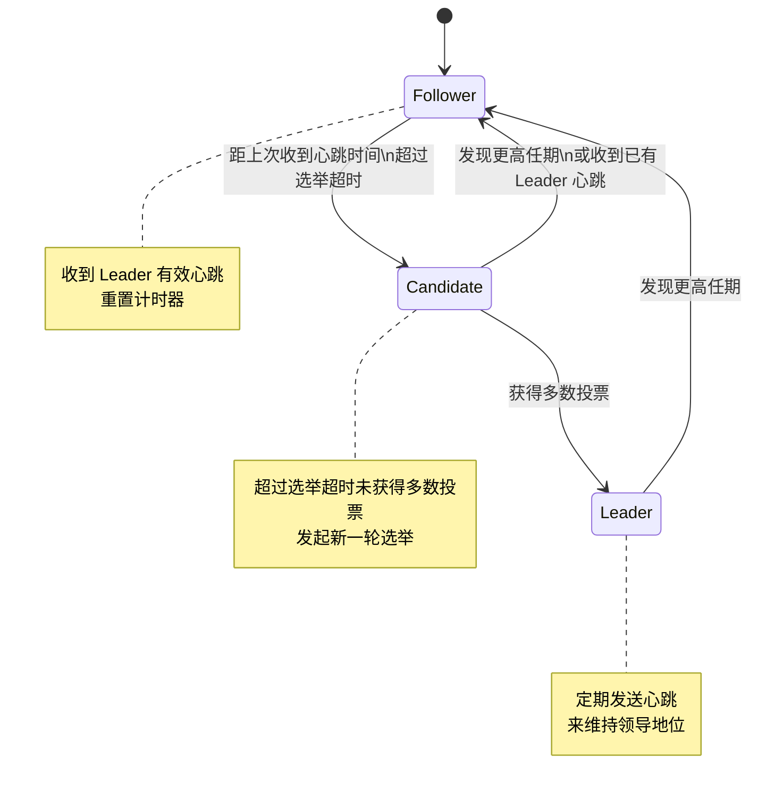
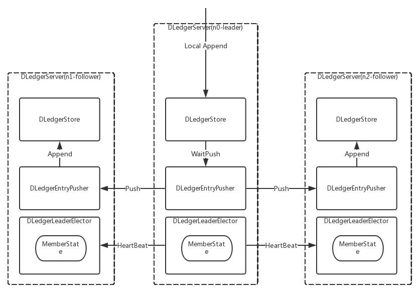
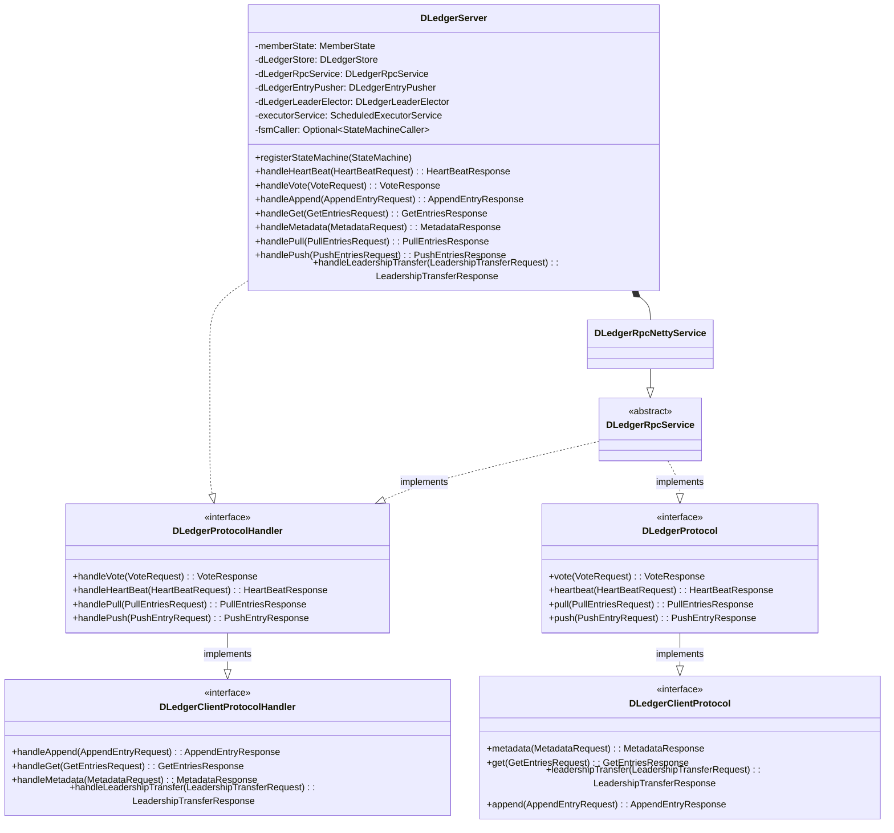
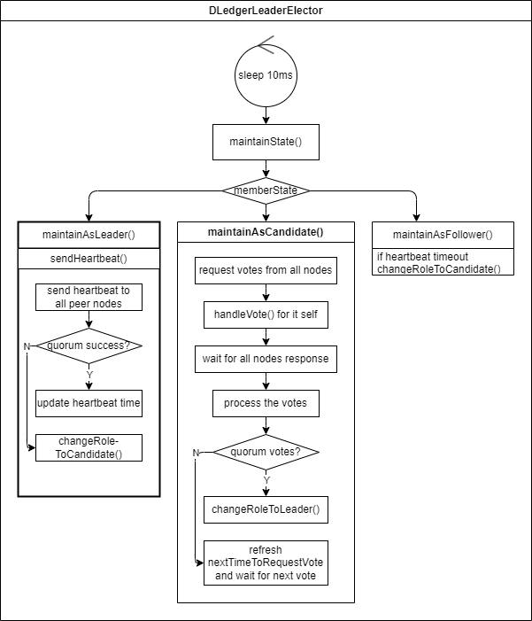

# RocketMQ DLedger Leader 选举 流程详解 & 源码解析

## 1. 背景

在 RocketMQ 4.5.0 版本以前，只提供了主从同步功能，但是主节点宕机之后从节点只能读不能写，没有主从切换能力。RocketMQ 4.5.0 引入了 DLedger 来实现主从切换。

DLedger 是基于 Raft 算法的 WAL 实现，它是为消息场景量身定制的，提供了日志写入和读取的接口，且对顺序读出和随机读出做了优化，充分适应消息系统消峰填谷的需求。

在 RocketMQ 4.8.0 版本以前，DLedger 模式的性能比主备模式差 1 个数量级[^1]，所以建议用尽可能新的版本部署。

[^1]: https://github.com/apache/rocketmq/issues/2278

DLedger 的实现大体可以分为两个部分，Leader 选举和日志复制，本文基于 DLedger 0.2.7 版本源码详解 Leader 选举的设计和流程。

## 2. 概要设计

### 2.1 节点状态流转

DLedger 的主从同步主要是实现了 Raft 协议，我们先来看一下 Raft 协议中节点的 3 个角色之间的行为和转换。



Raft 选主的过程中有一些重要的请求类型：

* 心跳请求：Leader 节点定期发送心跳请求给其他节点，以维持领导地位。
* 投票请求：Candidate 节点在选举超时后，会发起投票请求，向其他节点请求投票。由于是向其他节点请求投票，所以我们后面把它称为**拉票请求**方便理解。
* 其它的客户端请求和日志追加请求不在 Leader 选举流程中，本文暂不展开。

Raft 选主流程中还有两个重要的 timeout：

* 心跳超时：Leader 节点发送心跳请求给其他节点的间隔时间，DLedger 里是 2s。
* 选举超时：Follower 在选举超时后，会成为 Candidate，启动选主流程。DLedger 里是 3 倍的心跳超时，即 6s。

下面我们看一下每种角色的节点的行为。

#### 2.2 Follower

* 行为：
  * 启动计时器，时间为选举超时（Election timeout）。
* 发起请求：无
* 处理请求：
  * Candidate 拉票请求：如果没有投过票则返回投票，更新投票轮次（为请求的轮次），并记录投票给谁。
  * Leader 心跳请求：收到后会返回响应并重新启动计时器。
* 状态转移：
  * 计时器到期：转换成 Candidate。

#### 2.3 Leader

* 行为：
  * 处理所有客户端请求和日志复制
  * 每过心跳超时（Heartbeat timeout），向所有其他节点发送心跳请求，维持统治。
* 发起请求：
  * 向其他节点发送心跳请求，处理心跳响应。如果收到的响应的轮次大于当前轮次，则转换为 Follower。
* 处理请求：
  * Candidate 拉票请求：
    * 轮次大于当前，转换成 Follower。
    * 轮次小于等于当前，无动作。
  * Leader 心跳请求：
    * 轮次小于当前，无动作。
    * 轮次大于当前，转换成 Follower。
    * 轮次等于当前，可能是由于发生网络分区导致出现多个 Leader，都降为 Follower 重新选举。
  * 客户端请求：处理日志复制
* 状态转移：
  * 发现其他节点的心跳请求响应有更大的投票轮次：转换成 Follower。

#### 2.4 Candidate

* 行为：
  * 发起新的选举轮次（term += 1），给自己投票，然后向其他节点发起拉票请求。
    * 刚进入 Candidate 状态会发起新的投票轮次，先给自己投票。
    * 发起投票后，启动计时器，统计选举超时。当计时器到期仍未得到半数以上投票，开启新的投票轮次。
* 发起请求：
  * 选举轮次启动时，给其他节点发拉票请求，获取其他节点的投票响应。
* 处理请求：
  * 其他 Candidate 拉票请求：如果其他 Candidate 投票轮次大于当前轮次，则投票给它并更新当前轮次。否则无动作。
  * Leader 心跳请求：对比投票轮次，如果大于等于当前轮次，则说明已经有 Leader 选出，自己转换成 Follower。
* 状态转移：
  * 选票超过半数：转换成 Leader。
  * 收到 Leader 心跳请求：此时其他节点已经是 Leader，转换成 Follower。
  * 选票未超过半数（Split vote）：保持为 Candidate，在选举超时后开始新的选举轮次。

## 3. 详细设计

下图是 3 个 DLedger 节点组成的集群，其中中间的是主节点，左右两个从节点。



其中 `DLedgerStore` 是日志存储类，收到日志追加请求后把日志保存，然后推给 `DLedgerEntryPusher` 类。

`DLedgerEntryPusher` 是 DLedger 的日志追加实现类，它会把本地的数据推到从节点的 `DLedgerEntryPusher`，在从节点上保存。

`DLedgerLeaderElector` 则是负责 DLedger 主从切换的，它向其他节点收发心跳和投票请求，来执行主从切换。

### 3.1 类设计



上图为 DLedger 主要类的类图。

其中 `DLedgerServer` 表示一个 DLedger 节点，它是 Raft 协议集群节点的封装。

`DLedgerProtocolHandler` 和 `DLedgerClientProtocolHandler` 分别是 DLedger 服务端和客户端的协议处理器接口，定义了一个 DLedger 节点需要实现的协议处理方法。

`DLedgerProtocl` 和 `DLedgerClientProtocol` 分别是 DLedger 服务端和客户端的请求实现类，定义了一个 DLedger 节点需要实现的所有请求方法。

`DLedgerServer` 封装了实现 DLedger 所需要的字段，下面我们一一说明它们的含义和作用。

* `MemberState`：节点状态机，用于保存当前节点的角色（Leader/Follower/Candidate）、当前任期、当前日志写入状态、当前投票、对端节点列表等。
* `DLedgerStore`：日志存储类，用于操作当前节点的日志存储。
* `DLedgerRpcService`：DLedger 节点间通信类，实现了 `DLedgerProtocolHandler` 和 `DLedgerProtocol` 接口。它是 DLedger 节点发送请求和处理请求的入口。处理请求时，它会调用 `DLedgerServer` 的请求处理方法，本身不处理请求，仅作为代理转发。
* `DLedgerLeaderElector`：主从切换逻辑实现类，有一个服务线程不断运行节点的状态维护方法，根据节点角色的不同，执行不同的状态维护逻辑。这也是本文将着重解析的类。

### 3.2 DLedgerLeaderElector 逻辑



DLedger 的选主逻辑与 Raft 标准的选主逻辑实现上有一些差异。

`DLedgerLeaderElector` 负责节点的状态维护。它当中有一个 `StateMaintainer` 现成，负责触发节点的状态维护方法，即 `maintainState()`，它会根据节点当前的状态执行对应状态的状态维维护方法。每次执行完状态维护方法后，等待 10ms 再执行下一次状态维护方法。

下面详细分析每个状态维护的方法。

#### 3.2.1 Follower

`maintainAsFollower()` 方法的逻辑如下：

如果在 3 个心跳周期内没有收到心跳请求，将角色转换为 Candidate。

#### 3.2.2 Leader

* 如果当前时间距离上次发送心跳的时间超过心跳周期（2s），则向所有节点发送心跳，然后等待响应并仲裁结果。

#### 3.2.3 Candidate

* 如果到了下一次拉票请求的时间，则进行判断
* 如果当前节点不是 Candidate，无动作
* 上一次投票结果是需要等待下一轮投票，或需要立即开始下一轮投票
  * 更新投票轮次，发起新一轮投票
  * 否则，维持当前投票轮次
* 向其他节点发拉票请求，等待所有节点响应并仲裁结果

#### 3.2.4 心跳请求

##### 心跳请求发送、响应处理

发送心跳请求的方法是 `DLedgerLeaderElector#sendHeartbeats`

* 等待心跳响应，超过半数成功则继续。
   * 如果半数以上 Follower 返回成功，则更新成功心跳时间戳。
   * 如果没有达到半数以上 Follower 返回成功
     * 成功 + 未准备的响应超过半数，立即发送下一次心跳
     * Follower 的最大投票 term 比当前节点大，当前节点切换成 Candidate
     * Follower 有其他的 Leader，当前节点切换成 Candidate
     * 超过 3 个心跳周期都没有半数以上成功响应，当前节点切换成 Candidate，待收到 Leader 的心跳请求后变为 Follower

##### 心跳请求处理

处理心跳请求的方法是 `DLedgerLeaderElector#handleHeartbeat`

* 发送节点的 term 小于当前节点的 term，告诉对方已经过期，需要重新选举。
* term 相同，判断请求的节点是否是当前的 Leader
    * 如果请求节点是当前节点的 Leader，更新心跳时间戳，返回成功
    * 如果当前节点还没有 Leader，切换角色为 Follower，设置 Leader
    * 如果请求节点不是当前节点的 Leader，告诉对方 Leader 不一致，对方会切换回 Candidate，重新选举
* 发送节点的 term 大于当前节点的 term，则当前节点切换为 Candidate，立即发起选举。

#### 3.2.5 拉票请求

##### 拉票请求发送、响应处理

发送拉票请求的方法是 `DLedgerLeaderElector#voteForQuorumResponses`

发送拉票请求时，会先投票给自己，然后把当前节点的状态、term 等信息放入请求中。

根据投票结果进行仲裁的逻辑如下：

* 对端 term 大于当前节点 term，使用对端 term 进入 Candidate 角色。
* 已有 Leader，保持 Candidate 角色，待收到 Leader 的心跳请求后变为 Follower。重置下次拉票计时器，如果没有收到心跳的话在选举超时后会重新发起拉票请求。
* 有效投票未超过半数，重置下次拉票计时器，等待重新投票，不增加 term。
* 有效票超过半数，切换成 Leader
* 有效票 + 未准备好 超过半数，立即重新拉票
* 其他情况，重置下次拉票计时器，继续本轮拉票

##### 拉票请求处理

处理拉票请求的方法是 `DLedgerLeaderElector#handleVote`

* 先根据 LedgerEndTerm 进行仲裁，LedgerEndTerm 是日志最后写入时的投票轮次。
  * 如果请求拉票节点的 ledgerEndTerm 小于当前节点的 ledgerEndTerm，说明拉票节点的日志复制进度比当前低，无法成为 Leader，返回拒绝。
  * 如果 ledgerEndTerm 相等，ledgerEndIndex 小于当前节点的 ledgerEndIndex，说明拉票节点的日志复制进度比当前低，无法成为 Leader，返回拒绝。
* 然后根据 term 进行仲裁
  * 如果请求拉票节点的 term 小于当前的 term，说明请求拉票节点已经过期，返回拒绝。
  * 如果 term 相等，继续判断
    * 如果当前节点未投票，继续下面逻辑
    * 如果当前节点已投票给请求的节点，也继续下面逻辑
    * 如果当前节点已投票给其他节点，拒绝投票，并返回自己投的 Leader
  * 如果请求拉票节点的 term 大于当前的 term，则当前节点用对方的 term 降级为 Candidate，拒绝拉票请求，告知对方自己未准备好
* 最后如果请求拉票节点的 term 小于当前节点的 ledgerEndTerm，也拒绝
* 如果通过上面所有的过滤，则投票给请求拉票的节点：设置自己投票的 Leader，并返回投票。

## 4. 源码解析

### 4.1 状态维护

### 4.2 maintainAsFollower

```java
// DLedgerLeaderElector.java
private void maintainAsFollower() {
    // 距离上次收到心跳是否超过 2 个心跳周期。在不加锁的情况下判断，减少加锁次数
    if (DLedgerUtils.elapsed(lastLeaderHeartBeatTime) > 2 * heartBeatTimeIntervalMs) {
        synchronized (memberState) {
            // 超过 maxHeartBeatLeak(3) 个心跳周期没有收到心跳包，则切换成 Candidate
            if (memberState.isFollower() && (DLedgerUtils.elapsed(lastLeaderHeartBeatTime) > maxHeartBeatLeak * heartBeatTimeIntervalMs)) {
                logger.info("[{}][HeartBeatTimeOut] lastLeaderHeartBeatTime: {} heartBeatTimeIntervalMs: {} lastLeader={}", memberState.getSelfId(), new Timestamp(lastLeaderHeartBeatTime), heartBeatTimeIntervalMs, memberState.getLeaderId());
                changeRoleToCandidate(memberState.currTerm());
            }
        }
    }
}
```

### 4.3 maintainAsLeader

```java
// DLedgerLeaderElector.java
private void maintainAsLeader() throws Exception {
    // 距离上次发送心跳超过 1 个心跳周期（2s），发送心跳请求
    if (DLedgerUtils.elapsed(lastSendHeartBeatTime) > heartBeatTimeIntervalMs) {
        long term;
        String leaderId;
        synchronized (memberState) {
            if (!memberState.isLeader()) {
                //stop sending
                return;
            }
            term = memberState.currTerm();
            leaderId = memberState.getLeaderId();
            // 记录本次发送心跳时间戳
            lastSendHeartBeatTime = System.currentTimeMillis();
        }
        // 向所有从节点发送心跳
        sendHeartbeats(term, leaderId);
    }
}
```

### 4.3 maintainAsCandidate

```java
// DLedgerLeaderElector.java
private void maintainAsCandidate() throws Exception {
    //for candidate
    // 未到下一次拉票时间，直接返回
    if (System.currentTimeMillis() < nextTimeToRequestVote && !needIncreaseTermImmediately) {
        return;
    }
    // 投票轮次
    long term;
    // 日志末尾 Term
    long ledgerEndTerm;
    // 当前 Log 最大 index，即下一条 Log 的起始 index
    long ledgerEndIndex;
    synchronized (memberState) {
        if (!memberState.isCandidate()) {
            return;
        }
        // 如果上一次投票结果是等待下一轮投票，或应立即发起投票
        if (lastParseResult == VoteResponse.ParseResult.WAIT_TO_VOTE_NEXT || needIncreaseTermImmediately) {
            // 获取新投票轮次，准备发起新一轮投票
            long prevTerm = memberState.currTerm();
            term = memberState.nextTerm();
            logger.info("{}_[INCREASE_TERM] from {} to {}", memberState.getSelfId(), prevTerm, term);
            lastParseResult = VoteResponse.ParseResult.WAIT_TO_REVOTE;
        } else {
            // 维持当前投票轮次
            term = memberState.currTerm();
        }
        ledgerEndIndex = memberState.getLedgerEndIndex();
        ledgerEndTerm = memberState.getLedgerEndTerm();
    }
    // 如果需要立即发起拉票
    if (needIncreaseTermImmediately) {
        // 设置下一次拉票时间
        nextTimeToRequestVote = getNextTimeToRequestVote();
        // 设置该标志位为 false
        needIncreaseTermImmediately = false;
        return;
    }

    // 向其他节点发起拉票请求
    long startVoteTimeMs = System.currentTimeMillis();
    final List<CompletableFuture<VoteResponse>> quorumVoteResponses = voteForQuorumResponses(term, ledgerEndTerm, ledgerEndIndex);
    // 已知的最大投票轮次
    final AtomicLong knownMaxTermInGroup = new AtomicLong(term);
    // 所有投票数
    final AtomicInteger allNum = new AtomicInteger(0);
    // 有效投票数
    final AtomicInteger validNum = new AtomicInteger(0);
    // 赞成投票数
    final AtomicInteger acceptedNum = new AtomicInteger(0);
    // 未准备好投票。如果对端节点的投票轮次小于发起投票的轮次，则认为我对端未准备好，对端节点会用本节点的轮次进入 Candidate 状态
    final AtomicInteger notReadyTermNum = new AtomicInteger(0);
    // 发起投票节点的投票轮次小于对端节点的个数
    final AtomicInteger biggerLedgerNum = new AtomicInteger(0);
    // 是否已经存在 Leader
    final AtomicBoolean alreadyHasLeader = new AtomicBoolean(false);

    // 等待所有响应结果
    CountDownLatch voteLatch = new CountDownLatch(1);
    for (CompletableFuture<VoteResponse> future : quorumVoteResponses) {
        future.whenComplete((VoteResponse x, Throwable ex) -> {
            try {
                if (ex != null) {
                    throw ex;
                }
                logger.info("[{}][GetVoteResponse] {}", memberState.getSelfId(), JSON.toJSONString(x));
                if (x.getVoteResult() != VoteResponse.RESULT.UNKNOWN) {
                    // 有效票 + 1
                    validNum.incrementAndGet();
                }
                // 统计投票结果
                synchronized (knownMaxTermInGroup) {
                    switch (x.getVoteResult()) {
                        case ACCEPT:
                            // 赞成票 + 1
                            acceptedNum.incrementAndGet();
                            break;
                        case REJECT_ALREADY_VOTED:
                            // 拒绝，已经投给其他节点
                        case REJECT_TAKING_LEADERSHIP:
                            break;
                        case REJECT_ALREADY_HAS_LEADER:
                            // 拒绝，已经存在 Leader 节点
                            alreadyHasLeader.compareAndSet(false, true);
                            break;
                        case REJECT_TERM_SMALL_THAN_LEDGER:
                        case REJECT_EXPIRED_VOTE_TERM:
                            // 拒绝，当前投票轮次小于 Leader，更新自身投票轮次
                            if (x.getTerm() > knownMaxTermInGroup.get()) {
                                knownMaxTermInGroup.set(x.getTerm());
                            }
                            break;
                        case REJECT_EXPIRED_LEDGER_TERM:
                            // 拒绝，当前 ledgerTerm 小于对端 ledgerTerm
                        case REJECT_SMALL_LEDGER_END_INDEX:
                            // 拒绝，当前 ledgerEndIndex 小于对端 ledgerEndIndex
                            biggerLedgerNum.incrementAndGet();
                            break;
                        case REJECT_TERM_NOT_READY:
                            // 拒绝，对端投票轮次小于当前轮次，即对端未准备好。此时对端节点使用当前投票轮次进入 Candidate 状态
                            notReadyTermNum.incrementAndGet();
                            break;
                        default:
                            break;

                    }
                }
                // 已经有 Leader / 收到过半赞成，结束等待
                if (alreadyHasLeader.get()
                    || memberState.isQuorum(acceptedNum.get())
                    || memberState.isQuorum(acceptedNum.get() + notReadyTermNum.get())) {
                    voteLatch.countDown();
                }
            } catch (Throwable t) {
                logger.error("vote response failed", t);
            } finally {
                // 如果所有对端节点都返回响应，结束等待
                allNum.incrementAndGet();
                if (allNum.get() == memberState.peerSize()) {
                    voteLatch.countDown();
                }
            }
        });

    }

    // 同步等待所有节点响应
    try {
        voteLatch.await(2000 + random.nextInt(maxVoteIntervalMs), TimeUnit.MILLISECONDS);
    } catch (Throwable ignore) {

    }

    lastVoteCost = DLedgerUtils.elapsed(startVoteTimeMs);
    VoteResponse.ParseResult parseResult;
    // 根据投票结果进行仲裁，驱动状态机
    if (knownMaxTermInGroup.get() > term) {
        // 对端 term 大于自身 term，使用对端 term 进入 Candidate 状态
        parseResult = VoteResponse.ParseResult.WAIT_TO_VOTE_NEXT;
        nextTimeToRequestVote = getNextTimeToRequestVote();
        changeRoleToCandidate(knownMaxTermInGroup.get());
    } else if (alreadyHasLeader.get()) {
        // 已有 Leader，保持 Candidate 状态，待收到 Leader 心跳请求后变为 Follower
        parseResult = VoteResponse.ParseResult.WAIT_TO_REVOTE;
        // 重置下次拉票计时器，添加心跳最大超时时间。表示：等待在指定时间内收到 Leader 的心跳，降为 Follower。
        nextTimeToRequestVote = getNextTimeToRequestVote() + heartBeatTimeIntervalMs * maxHeartBeatLeak;
    } else if (!memberState.isQuorum(validNum.get())) {
        // 有效票未超过半数，重置下次拉票计时器，等待重新投票。不增加投票轮次
        parseResult = VoteResponse.ParseResult.WAIT_TO_REVOTE;
        nextTimeToRequestVote = getNextTimeToRequestVote();
    } else if (!memberState.isQuorum(validNum.get() - biggerLedgerNum.get())) {
        parseResult = VoteResponse.ParseResult.WAIT_TO_REVOTE;
        nextTimeToRequestVote = getNextTimeToRequestVote() + maxVoteIntervalMs;
    } else if (memberState.isQuorum(acceptedNum.get())) {
        // 有效票超过半数，成为 Leader 节点
        parseResult = VoteResponse.ParseResult.PASSED;
    } else if (memberState.isQuorum(acceptedNum.get() + notReadyTermNum.get())) {
        // 有效票 + 未准备好投票 超过半数，立即重新拉票
        parseResult = VoteResponse.ParseResult.REVOTE_IMMEDIATELY;
    } else {
        // 赞成票 + 对端 ledgerEndIndex 超过半数，重置计时器，继续本轮选举
        parseResult = VoteResponse.ParseResult.WAIT_TO_VOTE_NEXT;
        nextTimeToRequestVote = getNextTimeToRequestVote();
    }
    lastParseResult = parseResult;
    logger.info("[{}] [PARSE_VOTE_RESULT] cost={} term={} memberNum={} allNum={} acceptedNum={} notReadyTermNum={} biggerLedgerNum={} alreadyHasLeader={} maxTerm={} result={}",
        memberState.getSelfId(), lastVoteCost, term, memberState.peerSize(), allNum, acceptedNum, notReadyTermNum, biggerLedgerNum, alreadyHasLeader, knownMaxTermInGroup.get(), parseResult);

    if (parseResult == VoteResponse.ParseResult.PASSED) {
    // 有效票超过半数的情况，切换成 Leader
        logger.info("[{}] [VOTE_RESULT] has been elected to be the leader in term {}", memberState.getSelfId(), term);
        changeRoleToLeader(term);
    }
}
```

### 4.4 心跳请求

#### 4.4.1 sendHeartbeats

```java
// DLedgerLeaderElector.java
/**
 * Leader 节点向 Follower 节点发送心跳包，等待所有节点的心跳响应，然后根据响应的节点数量进行结果仲裁。
 */
private void sendHeartbeats(long term, String leaderId) throws Exception {
    // 集群内节点个数
    final AtomicInteger allNum = new AtomicInteger(1);
    // 收到成功响应的节点个数
    final AtomicInteger succNum = new AtomicInteger(1);
    // 收到对端未准备好的响应的节点个数
    final AtomicInteger notReadyNum = new AtomicInteger(0);
    // 当前集群节点维护的最大投票轮次
    final AtomicLong maxTerm = new AtomicLong(-1);
    // 是否存在 Leader 节点不一致
    final AtomicBoolean inconsistLeader = new AtomicBoolean(false);
    // latch，用于等待异步请求结果
    final CountDownLatch beatLatch = new CountDownLatch(1);
    // 本次心跳包开始发送的时间戳
    long startHeartbeatTimeMs = System.currentTimeMillis();
    // 遍历集群中所有节点，异步发送心跳
    for (String id : memberState.getPeerMap().keySet()) {
        if (memberState.getSelfId().equals(id)) {
            continue;
        }
        // 构造心跳包
        HeartBeatRequest heartBeatRequest = new HeartBeatRequest();
        heartBeatRequest.setGroup(memberState.getGroup());
        heartBeatRequest.setLocalId(memberState.getSelfId());
        heartBeatRequest.setRemoteId(id);
        heartBeatRequest.setLeaderId(leaderId);
        heartBeatRequest.setTerm(term);
        // 异步发送心跳
        CompletableFuture<HeartBeatResponse> future = dLedgerRpcService.heartBeat(heartBeatRequest);
        future.whenComplete((HeartBeatResponse x, Throwable ex) -> {
            // 心跳响应回调，统计响应结果
            try {
                if (ex != null) {
                    memberState.getPeersLiveTable().put(id, Boolean.FALSE);
                    throw ex;
                }
                switch (DLedgerResponseCode.valueOf(x.getCode())) {
                    // 成功响应
                    case SUCCESS:
                        succNum.incrementAndGet();
                        break;
                    // Leader 节点投票轮次小于 Follower 节点
                    case EXPIRED_TERM:
                        maxTerm.set(x.getTerm());
                        break;
                    // Follower 节点已经有新的 Leader
                    case INCONSISTENT_LEADER:
                        inconsistLeader.compareAndSet(false, true);
                        break;
                    // Follower 未准备好
                    case TERM_NOT_READY:
                        notReadyNum.incrementAndGet();
                        break;
                    default:
                        break;
                }

                if (x.getCode() == DLedgerResponseCode.NETWORK_ERROR.getCode())
                    memberState.getPeersLiveTable().put(id, Boolean.FALSE);
                else
                    memberState.getPeersLiveTable().put(id, Boolean.TRUE);

                // 成功响应的 Follower 节点超过半数，唤醒心跳线程
                if (memberState.isQuorum(succNum.get())
                    || memberState.isQuorum(succNum.get() + notReadyNum.get())) {
                    beatLatch.countDown();
                }
            } catch (Throwable t) {
                logger.error("heartbeat response failed", t);
            } finally {
                allNum.incrementAndGet();
                // 所有 Follower 都响应（但成功的没有超过半数），也唤醒心跳线程
                if (allNum.get() == memberState.peerSize()) {
                    beatLatch.countDown();
                }
            }
        });
    }
    // 等待心跳结果，超过半数成功则继续
    beatLatch.await(heartBeatTimeIntervalMs, TimeUnit.MILLISECONDS);
    // 仲裁心跳响应结果
    if (memberState.isQuorum(succNum.get())) {
        // 半数以上 Follower 节点成功响应，更新上次成功心跳时间戳
        lastSuccHeartBeatTime = System.currentTimeMillis();
    } else {
        logger.info("[{}] Parse heartbeat responses in cost={} term={} allNum={} succNum={} notReadyNum={} inconsistLeader={} maxTerm={} peerSize={} lastSuccHeartBeatTime={}",
            memberState.getSelfId(), DLedgerUtils.elapsed(startHeartbeatTimeMs), term, allNum.get(), succNum.get(), notReadyNum.get(), inconsistLeader.get(), maxTerm.get(), memberState.peerSize(), new Timestamp(lastSuccHeartBeatTime));
        if (memberState.isQuorum(succNum.get() + notReadyNum.get())) {
            // （成功 + 未准备）超过半数，立即发送下一次心跳
            lastSendHeartBeatTime = -1;
        } else if (maxTerm.get() > term) {
            // Follower 投票轮次比 Leader 大，Leader 切换成 Candidate 并使用从节点的轮次
            changeRoleToCandidate(maxTerm.get());
        } else if (inconsistLeader.get()) {
            // Follower 有其他 Leader，该 Leader 节点切换成 Candidate
            changeRoleToCandidate(term);
        } else if (DLedgerUtils.elapsed(lastSuccHeartBeatTime) > maxHeartBeatLeak * heartBeatTimeIntervalMs) {
            // 超过 maxHeartBeatLeak 个心跳周期（6s）没有半数心跳响应成功，切换成 Candidate
            changeRoleToCandidate(term);
        }
    }
}
```

#### 4.4.2 handleHeartbeat

```java
// DLedgerLeaderElector.java
/**
 * Follower 收到 Leader 心跳请求，处理心跳请求后响应
 *
 * @param request
 * @return
 * @throws Exception
 */
public CompletableFuture<HeartBeatResponse> handleHeartBeat(HeartBeatRequest request) throws Exception {

    if (!memberState.isPeerMember(request.getLeaderId())) {
        logger.warn("[BUG] [HandleHeartBeat] remoteId={} is an unknown member", request.getLeaderId());
        return CompletableFuture.completedFuture(new HeartBeatResponse().term(memberState.currTerm()).code(DLedgerResponseCode.UNKNOWN_MEMBER.getCode()));
    }

    if (memberState.getSelfId().equals(request.getLeaderId())) {
        logger.warn("[BUG] [HandleHeartBeat] selfId={} but remoteId={}", memberState.getSelfId(), request.getLeaderId());
        return CompletableFuture.completedFuture(new HeartBeatResponse().term(memberState.currTerm()).code(DLedgerResponseCode.UNEXPECTED_MEMBER.getCode()));
    }

    // 发送请求的节点（Leader）轮次小于当前节点（Follower），返回 EXPIRED_TERM，告诉对方轮次已经过期，需要重新选举
    if (request.getTerm() < memberState.currTerm()) {
        return CompletableFuture.completedFuture(new HeartBeatResponse().term(memberState.currTerm()).code(DLedgerResponseCode.EXPIRED_TERM.getCode()));
    } else if (request.getTerm() == memberState.currTerm()) {
        // 轮次相同，判断请求的节点是否是当前的 Leader
        if (request.getLeaderId().equals(memberState.getLeaderId())) {
            // 如果请求的节点是当前的 Leader，更新上次收到 Leader 心跳的时间戳，返回成功
            lastLeaderHeartBeatTime = System.currentTimeMillis();
            return CompletableFuture.completedFuture(new HeartBeatResponse());
        }
    }

    // 处理异常情况，通常情况下上面已经返回。需要加锁以保证线程安全
    //abnormal case
    //hold the lock to get the latest term and leaderId
    synchronized (memberState) {
        if (request.getTerm() < memberState.currTerm()) {
            // Leader 节点轮次小于 Follower，返回 EXPIRED_TERM，告诉对方轮次已经过期，需要重新选举
            return CompletableFuture.completedFuture(new HeartBeatResponse().term(memberState.currTerm()).code(DLedgerResponseCode.EXPIRED_TERM.getCode()));
        } else if (request.getTerm() == memberState.currTerm()) {
            // 轮次相同，判断请求的节点是否是当前的 Leader
            if (memberState.getLeaderId() == null) {
                // 如果当前节点还没有 Leader，切换角色成为 Follower，设置 Leader 节点 Id，返回成功
                changeRoleToFollower(request.getTerm(), request.getLeaderId());
                return CompletableFuture.completedFuture(new HeartBeatResponse());
            } else if (request.getLeaderId().equals(memberState.getLeaderId())) {
                // 如果请求的节点是当前的 Leader，更新上次收到 Leader 心跳的时间戳，返回成功
                lastLeaderHeartBeatTime = System.currentTimeMillis();
                return CompletableFuture.completedFuture(new HeartBeatResponse());
            } else {
                // 如果请求的节点不是当前的 Leader，返回 INCONSISTENT_LEADER，告诉对方 Leader 节点不一致，对方会切换成 Candidate，重新选举
                //this should not happen, but if happened
                logger.error("[{}][BUG] currTerm {} has leader {}, but received leader {}", memberState.getSelfId(), memberState.currTerm(), memberState.getLeaderId(), request.getLeaderId());
                return CompletableFuture.completedFuture(new HeartBeatResponse().code(DLedgerResponseCode.INCONSISTENT_LEADER.getCode()));
            }
        } else {
            // 如果请求的轮次大于当前轮次，认为本节点未准备好，进入 Candidate 状态，立即发起一轮投票，返回 TERM_NOT_READY
            //To make it simple, for larger term, do not change to follower immediately
            //first change to candidate, and notify the state-maintainer thread
            changeRoleToCandidate(request.getTerm());
            needIncreaseTermImmediately = true;
            //TOOD notify
            return CompletableFuture.completedFuture(new HeartBeatResponse().code(DLedgerResponseCode.TERM_NOT_READY.getCode()));
        }
    }
}
```

### 4.5 拉票请求

#### 4.5.1 voteForQuorumResponses

```java
// DLedgerLeaderElector.java
/**
 * 向其他节点发起投票请求（拉票），等待各个节点响应
 *
 * @param term 当前轮次
 * @param ledgerEndTerm 最新日志的 term
 * @param ledgerEndIndex 最大日志条目 index
 * @return
 * @throws Exception
 */
private List<CompletableFuture<VoteResponse>> voteForQuorumResponses(long term, long ledgerEndTerm,
    long ledgerEndIndex) throws Exception {
    List<CompletableFuture<VoteResponse>> responses = new ArrayList<>();
    // 遍历集群内所有节点
    for (String id : memberState.getPeerMap().keySet()) {
        // 构建投票请求
        VoteRequest voteRequest = new VoteRequest();
        voteRequest.setGroup(memberState.getGroup());
        voteRequest.setLedgerEndIndex(ledgerEndIndex);
        voteRequest.setLedgerEndTerm(ledgerEndTerm);
        voteRequest.setLeaderId(memberState.getSelfId());
        voteRequest.setTerm(term);
        voteRequest.setRemoteId(id);
        CompletableFuture<VoteResponse> voteResponse;
        if (memberState.getSelfId().equals(id)) {
            // 投票给自己
            voteResponse = handleVote(voteRequest, true);
        } else {
            // 发送投票请求到其他节点
            //async
            voteResponse = dLedgerRpcService.vote(voteRequest);
        }
        responses.add(voteResponse);

    }
    return responses;
}
```

#### 4.5.2 handleVote

```java
// DLedgerLeaderElector.java
/**
 * 处理收到的拉票请求
 *
 * @param request 拉票请求
 * @param self 是否自身发送的投票请求
 * @return
 */
public CompletableFuture<VoteResponse> handleVote(VoteRequest request, boolean self) {
    // 由于一个节点可能同时收到多个其他节点的拉票请求，所以需要加锁。锁定状态机对象。
    //hold the lock to get the latest term, leaderId, ledgerEndIndex
    synchronized (memberState) {
        if (!memberState.isPeerMember(request.getLeaderId())) {
            logger.warn("[BUG] [HandleVote] remoteId={} is an unknown member", request.getLeaderId());
            return CompletableFuture.completedFuture(new VoteResponse(request).term(memberState.currTerm()).voteResult(VoteResponse.RESULT.REJECT_UNKNOWN_LEADER));
        }
        if (!self && memberState.getSelfId().equals(request.getLeaderId())) {
            logger.warn("[BUG] [HandleVote] selfId={} but remoteId={}", memberState.getSelfId(), request.getLeaderId());
            return CompletableFuture.completedFuture(new VoteResponse(request).term(memberState.currTerm()).voteResult(VoteResponse.RESULT.REJECT_UNEXPECTED_LEADER));
        }

        // 根据当前节点的 ledgerEndTerm 进行仲裁
        // 如果发起拉票节点的 ledgerEndTerm 小于当前节点的 ledgerEndTerm，说明发起拉票节点的日志复制进度比当前节点低，无法成为 Leader，拒绝
        if (request.getLedgerEndTerm() < memberState.getLedgerEndTerm()) {
            return CompletableFuture.completedFuture(new VoteResponse(request).term(memberState.currTerm()).voteResult(VoteResponse.RESULT.REJECT_EXPIRED_LEDGER_TERM));
        // 如果 ledgerEndTerm 相等，但是发起拉票节点的 ledgerEndIndex 小于当前节点的 ledgerEndIndex，说明发起拉票节点的日志复制进度比当前节点低，无法成为 Leader，拒绝
        } else if (request.getLedgerEndTerm() == memberState.getLedgerEndTerm() && request.getLedgerEndIndex() < memberState.getLedgerEndIndex()) {
            return CompletableFuture.completedFuture(new VoteResponse(request).term(memberState.currTerm()).voteResult(VoteResponse.RESULT.REJECT_SMALL_LEDGER_END_INDEX));
        }

        // 拉票请求的 term 小于当前 term，拒绝投票
        if (request.getTerm() < memberState.currTerm()) {
            return CompletableFuture.completedFuture(new VoteResponse(request).term(memberState.currTerm()).voteResult(VoteResponse.RESULT.REJECT_EXPIRED_VOTE_TERM));
        // 拉票请求的 term 等于当前 term，处理拉票请求
        } else if (request.getTerm() == memberState.currTerm()) {
            // 如果当前节点未投票，继续下面的逻辑
            if (memberState.currVoteFor() == null) {
                //let it go
            // 如果当前节点已投票给请求节点，也继续下面的逻辑
            } else if (memberState.currVoteFor().equals(request.getLeaderId())) {
                //repeat just let it go
            // 如果当前节点已投票给其他节点，拒绝投票
            } else {
                // 如果当前节点已存在 Leader 节点，拒绝并告知对方已有的 Leader 节点
                if (memberState.getLeaderId() != null) {
                    return CompletableFuture.completedFuture(new VoteResponse(request).term(memberState.currTerm()).voteResult(VoteResponse.RESULT.REJECT_ALREADY_HAS_LEADER));
                // 如果当前节点没有 Leader 节点，拒绝
                } else {
                    return CompletableFuture.completedFuture(new VoteResponse(request).term(memberState.currTerm()).voteResult(VoteResponse.RESULT.REJECT_ALREADY_VOTED));
                }
            }
        // 拉票请求的 term 大于当前 term，当前节点降级为 Candidate，拒绝拉票请求，告知对方节点自己未准备好
        } else {
            // 使用发起拉票请求的 term 进入 Candidate 状态
            //stepped down by larger term
            changeRoleToCandidate(request.getTerm());
            needIncreaseTermImmediately = true;
            //only can handleVote when the term is consistent
            return CompletableFuture.completedFuture(new VoteResponse(request).term(memberState.currTerm()).voteResult(VoteResponse.RESULT.REJECT_TERM_NOT_READY));
        }

        // 如果发起拉票请求节点的 term 小于当前节点的 ledgerEndTerm，拒绝投票
        if (request.getTerm() < memberState.getLedgerEndTerm()) {
            return CompletableFuture.completedFuture(new VoteResponse(request).term(memberState.getLedgerEndTerm()).voteResult(VoteResponse.RESULT.REJECT_TERM_SMALL_THAN_LEDGER));
        }

        if (!self && isTakingLeadership() && request.getLedgerEndTerm() == memberState.getLedgerEndTerm() && memberState.getLedgerEndIndex() >= request.getLedgerEndIndex()) {
            return CompletableFuture.completedFuture(new VoteResponse(request).term(memberState.currTerm()).voteResult(VoteResponse.RESULT.REJECT_TAKING_LEADERSHIP));
        }

        // 投票给发起拉票请求的节点
        memberState.setCurrVoteFor(request.getLeaderId());
        return CompletableFuture.completedFuture(new VoteResponse(request).term(memberState.currTerm()).voteResult(VoteResponse.RESULT.ACCEPT));
    }
}
```

## 参考资料

- [DLedger Wiki](https://github.com/openmessaging/dledger/wiki)
- RocketMQ 技术内幕 第2版

* [The Secret Lives of Data - Raft](http://thesecretlivesofdata.com/raft/)