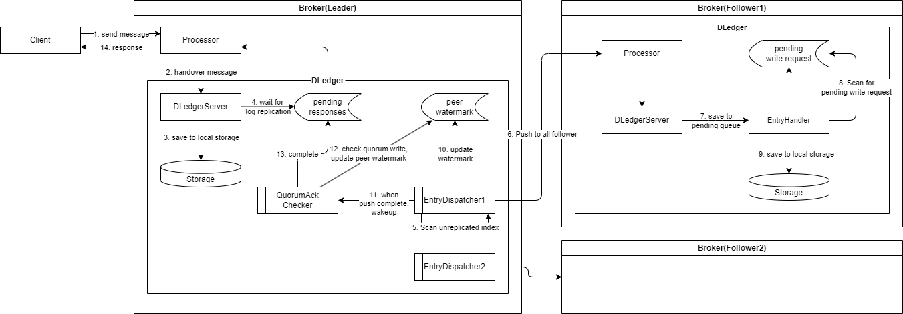
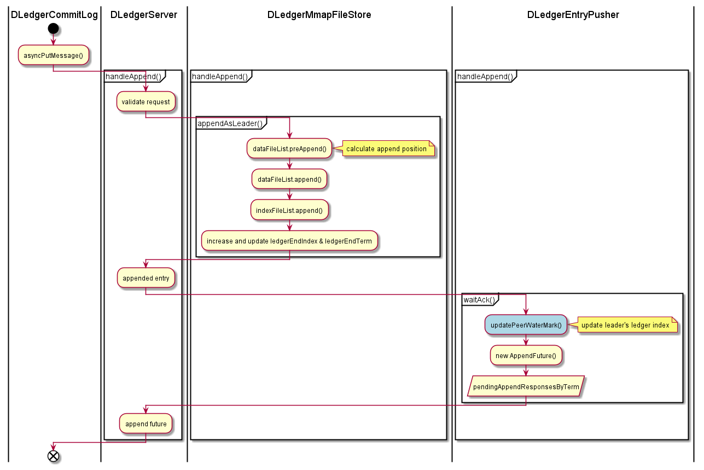
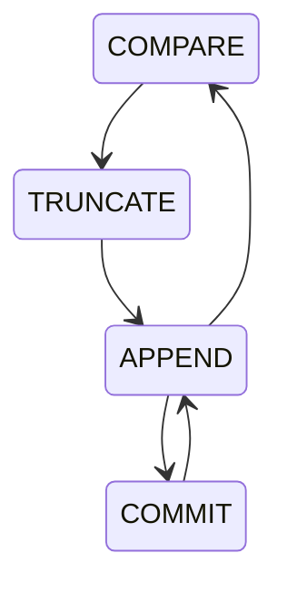
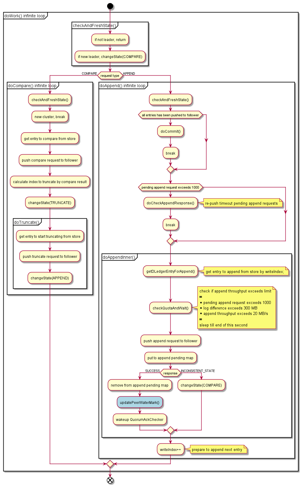

# RocketMQ DLedger 日志复制 流程详解 & 源码解析

## 1. 背景

在 RocketMQ 4.5.0 版本以前，只提供了主从同步功能，但是主节点宕机之后从节点只能读不能写，没有主从切换能力。RocketMQ 4.5.0 引入了 DLedger 来实现主从切换。

DLedger 是基于 Raft 算法的 WAL 实现，它是为消息场景量身定制的，提供了日志写入和读取的接口，且对顺序读出和随机读出做了优化，充分适应消息系统消峰填谷的需求。

在 RocketMQ 4.8.0 版本以前，DLedger 模式的性能比主备模式差 1 个数量级[^1]，所以建议用尽可能新的版本部署。

[^1]: https://github.com/apache/rocketmq/issues/2278

DLedger 的实现大体可以分为两个部分，Leader 选举和日志复制。Leader 选举负责集群中选出一个主节点，而日志复制则确保各节点之间的数据一致性。本文基于 DLedger 0.2.7 版本源码详解日志复制的设计和流程。

## 2. 概要设计



整个日志复制流程如上图所示：

1. 客户端向 Broker 发送消息，Leader Broker 中的消息处理器处理该生产请求。
2. 在 DLedger 模式开启的情况下，消息处理器将生产请求交给 DLedger 服务进行消息存储。
3. DLedger 服务先将消息保存到本地存储。
4. 构造客户端响应的 Future，放到一个 Map 中，等待日志转发线程将日志转发到 Follower 之后回填这个 Future 的结果后返回给客户端。
5. 日志转发线程从上次转发的位置开始扫描。
6. 日志转发线程将消息转发到 Follower 节点，该过程也是异步的，转发后会将等待转发完成的日志序号存在一个 pendingMap 中。
7. Follower Broker 中 DLedger 请求处理器收到 Leader 的日志转发请求，将该请求放入待处理队列。
8. Follower 的日志条目接收器扫描待处理队列中的请求。
9. 将扫描到的请求对应的消息写入 Follower 本地存储，回填等待转发完成的 Future 结果。
10. Leader 的日志转发线程感知到日志转发请求完成后，移除 pendingMap 中的日志序号，更新节点水位表，这个表中存储着集群中所有节点的日志转发最新水位，用于判断日志是否被大多数节点写入。
11. 日志转发线程同时唤醒结果仲裁线程。
12. 结果仲裁线程根据节点水位表，得到当前集群中的大多数节点已经写入的日志序号。
13. 大多数节点已经写入的日志序号和它之前的日志序号都认为已经写入完成，回填之前日志追加请求的 Future 结果。
14. 返回结果给客户端。

## 3. 详细设计

| 字段名               | 所属类               | 持久化 | 含义                                                         |
| -------------------- | -------------------- | ------ | ------------------------------------------------------------ |
| writeIndex           | EntryDispatcher      | ×      | Leader 向某一 Follower 节点推送的下一 index                  |
| ledgerEndIndex       | DLedgerMmapFileStore | √      | 本地已写入存储的最大 index                                   |
| committedIndex       | DLedgerMmapFileStore | √      | 已被集群中超过半数节点确认的 index，表示已提交（可应用到状态机）的最大index |
| lastQuorumIndex      | QuorumAckChecker     | ×      | 仲裁成功的最大 index，表示已达到多数节点复制确认的最大 index |
| peerWaterMarksByTerm | DLedgerEntryPusher   | ×      | 每个 term，集群内各个节点已经确认存储的最大 index（水位线）  |

```java
lastQuorumIndex ≤ committedIndex ≤ ledgerEndIndex
```

### 3.1 Leader 日志存储



1. 对于启动 DLedger 模式的 RocketMQ Broker，其 CommitLog 会被初始化为 `DLedgerCommitLog`，它的 `handleAppend` 方法会作为 `DLedgerServer` 的入口，调用 DLedger 的日志追加逻辑。
2. 先校验日志追加请求的合法性，然后调用 `appendAsLeader` 将日志追加到 Leader 本地存储。
   1. 追加前会先根据追加请求计算出 log 需要放入的偏移量。
   2. 将 log 写入底层文件。
   3. 将构造 log 索引，写入索引文件。
   4. 更新 `ledgerEndIndex` 和 `ledgerEndTerm`，表示 Ledger 本地存储的最大 index 和 term。这两个元数据会定期持久化到磁盘，以便故障恢复时使用。
   5. 返回追加结果。
3. 调用 `DLedgerEntryPusher` 的 `waitAck` 方法，将日志推送到 Follower 节点。
   1. 更新集群水位表中 Leader 的最大日志序号，因为在 Leader 上写入的日志已经被确认。
   2. 新建一个日志追加的 Future，放入等待响应的日志追加 Future 中，等日志转发线程回填该 Future 的结果后就将结果返回给上层客户端。

### 3.2 Leader 转发日志到 Follower

Leader 日志转发的流程由 `EntryDispatcher` 类处理，它的主要逻辑在 `doWork` 方法中，无限循环调用。

`EntryDispatcher` 类有 4 个状态，每个状态会向 Follower 发送不同类型的请求。
下面是 `EntryDispatcher` 类状态流转图：



* `COMPARE`：日志对比，当发生 Leader 切换时，新 Leader 需要与 Follower 进行日志对比，截断 Follower 多余的日志。
* `TRUNCATE`：日志截断，新 Leader 发现 Follower 存在多余的数据（未提交的），发送 `TRUNCATE` 请求，要求 Follower 删除多余的数据，保证数据一致性。
* `APPEND`：日志追加，Leader 向 Follower 发送日志追加请求，Leader 将日志复制追加到 Follower。
* `COMMIT`：日志提交，Leader 向 Follower 同步当前节点的已提交日志序号。其实在 `APPEND` 时也会向 Follower 同步当前节点的已提交日志序号，但是有时 `APPEND` 请求不那么频繁，可能存在老的日志在多数节点复制完之后更新 `committedIndex`，但是无法及时用 `APPEND` 请求去更新到 Follower，所以此时需要 `COMMIT` 请求来同步。每秒会向 Follower `COMMIT` 一次。

---

`EntryDispatcher` 的执行逻辑如下：



1. 检查和刷新节点状态，如果不是 Leader 则返回，如果是，则继续判断 `EntryDispatcher` 的状态。
2. 如果是新 Leader，初始状态是 `COMPARE`，进入 `doCompare` 方法。
   1. 如果是新集群，没有数据，无需比较。
   2. 把 Leader 当前的日志末尾 index 作为需要比较的 index，从存储中获取末尾的日志。
   3. 向 Follower 发送 `COMPARE` 请求，等待 Follower 的响应。
   4. 根据比较的结果，决定 Follower 是否要截断，以及从哪里开始截断。具体逻辑查看下面的源码解析部分。
   5. 切换 `EntryDispatcher` 状态为 `TRUNCATE`
   6. 执行 `doTruncate` 方法。
   7. 根据需要截断的 index，从存储中获取对应的日志。
   8. 向 Follower 发送 `TRUNCATE` 请求，等待 Follower 的响应。
   9. 切换 `EntryDispatcher` 状态为 `APPEND`。
3. 完成 `COMPARE` 和 `TRUNCATE` 后，`EntryDispatcher` 的状态会被切换为 `APPEND`，进入 `doAppend` 方法。
   1. 如果所有

### 3.3 Follower 存储日志

### 3.4 Leader 仲裁日志复制结果

## 4. 源码解析

## 参考资料
