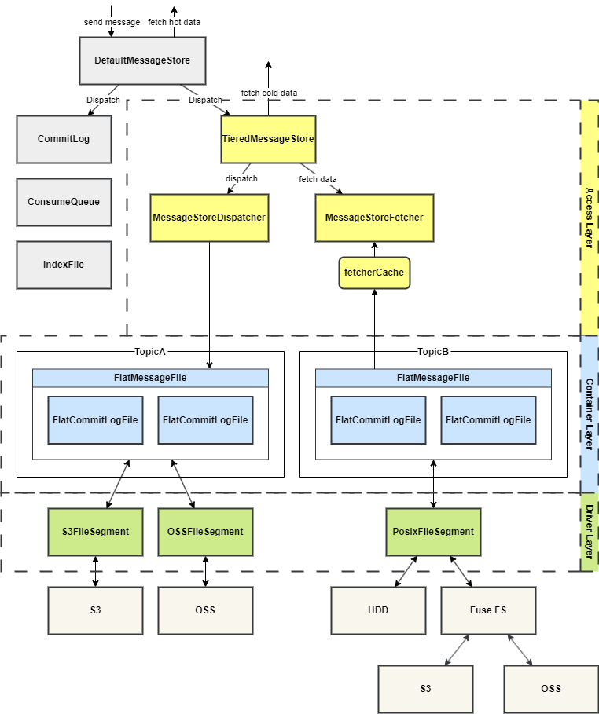
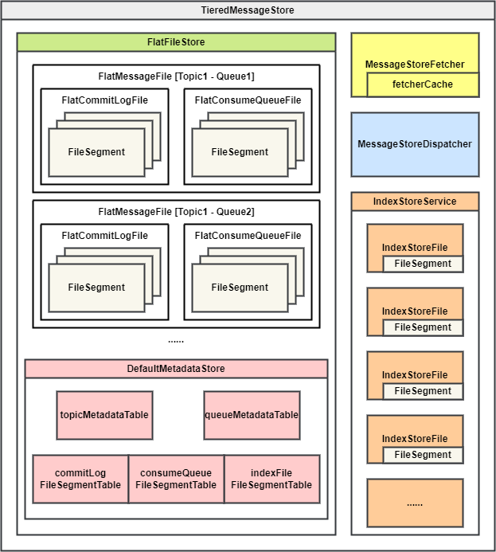
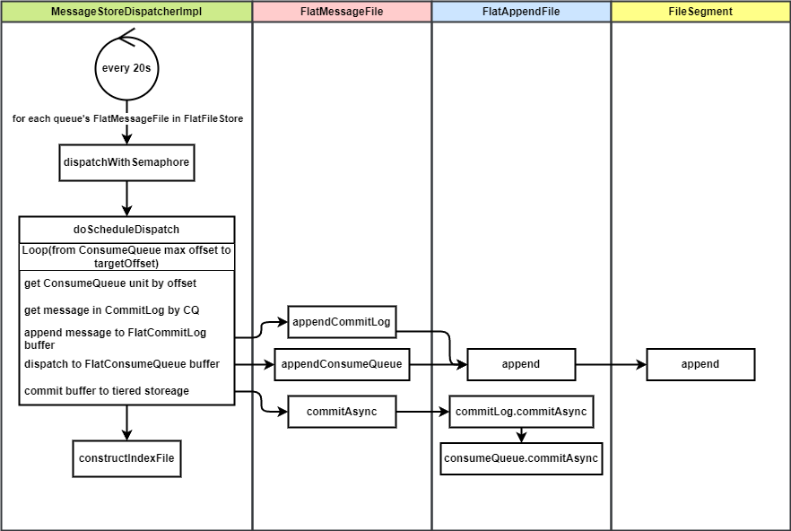

# Rocketmq 5 分级存储 Tieredstore（RIP-57、RIP-65） 原理详解 & 源码解析

## 1. 背景

### 1.1 需求

RocketMQ 5.x 的演进目标之一是云原生化，在云原生和 Serverless 的浪潮下，需要解决 RocketMQ 存储层存在两个瓶颈。

1. 数据量膨胀过快，单体硬件无法支撑
2. 存储的低成本和速度无法兼得

众多云厂商也希望提供 Serverless 化的 RocketMQ 来降低成本，为用户提供更加极致弹性的云服务。

### 1.2 解决的问题

除了以上两个瓶颈之外，分级存储还希望解决的问题是

1. 消息仅支持保留固定的时间
2. Topic 的数据与 Broker 绑定，无法迁移。比如在 Broker 缩容的场景下，被削减的 Broker 上的历史数据无法保留。

### 1.3 演进过程

RocketMQ 5.1 中提出了分级存储的方案（[RIP-57](https://github.com/apache/rocketmq/wiki/RIP-57-Tiered-storage-for-RocketMQ)），但当时的版本还未达到生产可用。

[RIP-65](https://github.com/apache/rocketmq/wiki/RIP-65-Tiered-Storage-Optimization) 对之前的分级存储实现进行了重构，修改了模型抽象、线程模式、元数据管理和索引文件的实现，提升了分级存储的代码可读性。

[ISSUE #7878](https://github.com/apache/rocketmq/issues/7878) 又对分级存储的代码进行了大量重构，修复已知问题，提升性能，减少资源利用率。

经过几次重构，当前的分级存储基本已经属于可用的状态。不过官方只提供了内存和本地文件两种分级存储文件段的实现，其他存储介质分级存储的实现需要用户自行扩展来实现。

## 2. 使用

### 2.1 Broker 配置

要测试分级存储，需要在 `broker.conf` 中添加如下配置：

```ini
# tiered
messageStorePlugIn=org.apache.rocketmq.tieredstore.TieredMessageStore
tieredBackendServiceProvider=org.apache.rocketmq.tieredstore.provider.PosixFileSegment
tieredStoreFilePath=e:\\data\\rocketmq\\node\\tieredstore
tieredStorageLevel=FORCE
```

分级存储各个配置的含义表如下：

| 配置                            | 默认值                                                       | 单位 | 作用                                                         |
| ------------------------------- | ------------------------------------------------------------ | ---- | ------------------------------------------------------------ |
| messageStorePlugIn              |                                                              |      | 扩展 MessageStore 实现，如果要用分级存储，设置成`org.apache.rocketmq.tieredstore.TieredMessageStore ` |
| tieredMetadataServiceProvider   | org.apache.rocketmq.tieredstore.metadata.DefaultMetadataStore |      | 分级存储元数据存储实现                                       |
| tieredBackendServiceProvider    | org.apache.rocketmq.tieredstore.provider.MemoryFileSegment   |      | 分级存储数据存储实现                                         |
| tieredStoreFilepath             |                                                              |      | 分级存储数据文件保存位置（POSIX provider）                   |
| tieredStorageLevel              | NOT_IN_DISK                                                  |      | 分级存储读取策略，默认 NOT_IN_DISK，即只有在本地存储中不存在时才会读取分级存储。其他选项为：DISABLE，禁用分级存储；NOT_IN_MEM，消息不在内存（Page Cache）时读分级存储；FORCE，强制读取分级存储 |
| tieredStoreFileReservedTime     | 72                                                           | hour | 分级存储消息保存时间                                         |
| commitLogRollingInterval        | 24                                                           | hour | 分级存储 CommitLog 强制滚动时间                              |
| readAheadCacheEnable            | true                                                         |      | 从分级存储读取时是否启用预读缓存                             |
| readAheadMessageCountThreshold  | 4096                                                         |      | 从分级存储时每次读取消息数量阈值                             |
| readAheadMessageSizeThreshold   | 16 * 1024 * 1024                                             | byte | 从分级存储中每次读取消息的长度阈值                           |
| readAheadCacheExpireDuration    | 15000                                                        | ms   | 预读缓存过期时间，没有读写操作 15s 后过期                    |
| readAheadCacheSizeThresholdRate | 0.3                                                          | 比例 | 最大预读缓存大小，为 JVM 最大内存的一定比例                  |
| tieredStoreMaxPendingLimit      | 10000                                                        |      | 分级存储写文件最大同时写文件数量                             |

目前 RocketMQ 源码中内置了两种分级存储 FileSegment 的实现

* MemoryFileSegment：使用内存作为二级存储
* PosixFileSegment：使用磁盘文件作为二级存储

他们都是实验性的，这里选择了 `PosixFileSegment`。

要实现其他存储介质的分级存储，只需要扩展 `FileSegment` 实现一个新的 `FileSegment` 类即可。

### 2.2 数据组织结构

对启用了分级存储的 Broker 进行压测，一段时间后分级存储目录中的文件：

```
/e/data/rocketmq/node/tieredstore
`-- [   0]  212d6b50_DefaultCluster
                    `-- [   0]  broker-a
        |           `-- [   0]  rmq_sys_INDEX
        |           `-- [   0]  0
        |           `-- [   0]  INDEX
        |           `-- [572M]  cfcd208400000000000000000000
        `-- [   0]  topic-tiered
            |-- [   0]  0
            |   |-- [   0]  COMMIT_LOG
            |   |   |-- [1024M]  1f329fef00000000001073741775
            |   |   |-- [1024M]  cfcd208400000000000000000000
            |   |   `-- [707M]  dcb86ff200000000002147483550
            |   `-- [   0]  CONSUME_QUEUE
            |       |-- [ 60M]  40d473e300000000000104857600
            |       `-- [100M]  cfcd208400000000000000000000
            |-- [   0]  1
            |   |-- [   0]  COMMIT_LOG
            |   |   |-- [1024M]  1f329fef00000000001073741775
            |   |   |-- [1024M]  cfcd208400000000000000000000
            |   |   `-- [707M]  dcb86ff200000000002147483550
            |   `-- [   0]  CONSUME_QUEUE
            |       |-- [ 60M]  40d473e300000000000104857600
            |       `-- [100M]  cfcd208400000000000000000000
            |-- [   0]  2
            |   |-- [   0]  COMMIT_LOG
            |   |   |-- [1024M]  1f329fef00000000001073741775
            |   |   |-- [1024M]  cfcd208400000000000000000000
            |   |   `-- [707M]  dcb86ff200000000002147483550
            |   `-- [   0]  CONSUME_QUEUE
            |       |-- [ 60M]  40d473e300000000000104857600
            |       `-- [100M]  cfcd208400000000000000000000
            `-- [   0]  3
                |-- [   0]  COMMIT_LOG
                |   |-- [1024M]  1f329fef00000000001073741775
                |   |-- [1024M]  cfcd208400000000000000000000
                |   `-- [707M]  dcb86ff200000000002147483550
                `-- [   0]  CONSUME_QUEUE
                    |-- [ 60M]  40d473e300000000000104857600
                    `-- [100M]  cfcd208400000000000000000000
```

其中索引文件单独存放，每个 Topic 的队列都单独有 CommitLog 和 ConsumeQueue

* CommitLog 为消息数据，与本地存储不同，每个 Topic 的队列都拆分单独一组的 CommitLog 文件，每个 1G
* ConsumeQueue 为消费索引

* INDEX 为索引文件，单独目录存放

## 3. 概要设计

### 3.1 技术架构选型

分级存储的方案中一个重要的选择是直写还是转写。

* **直写**：用高可用的存储或分布式文件系统直接替换本地块存储。优点是池化存储。
* **转写**：热数据使用本地块存储先顺序写，压缩之后转储到更廉价的存储系统中。优点是降低冷数据的长期存储成本。

最理想的终态可以是两者的结合，RocketMQ 自己来做数据转冷。因为消息系统自身对如何更好的压缩数据和加速读取的细节更了解，在转冷的过程中能够做一些消息系统内部的格式变化来加速冷数据的读取，减少 IO 次数、配置不同的 TTL 等。


目前的分级存储方案考虑到商业和开源技术架构的一致性，选择先实现**转写**模式。具体包括以下一些考虑：

* 成本：将大部分冷数据卸载到更便宜的存储系统中后，热数据的存储成本可以显著减小，更直接的降低存储成本。
* 可移植性：直写分布式文件系统通常需要依赖特定 SDK，配合 RDMA 等技术来降低延迟，对应用不完全透明，运维、人力、技术复杂度都有一定上升。保留成熟的本地存储，只需要实现与其他存储后端的适配层就可以轻松切换多种存储后端。
* 延迟与性能：通常分布式文件系统跨可用区部署，消息写多数派成功才能被消费，存在跨可用区的延迟。直接写本地磁盘的延迟会小于跨可用区的延迟，其延迟在热数据读写的情况下也不是瓶颈。
* 可用性： 转写模式下，整个系统弱依赖二级存储，更适合开源与非公有云场景。

### 3.2 存储模型与抽象

分级存储的模型与本地存储的模型一一对应，结构上也类似。最大的区别在于分级存储模型的组织形式，其 CommitLog 不再将所有队列的消息数据都存在一起，而是按照队列的维度拆分存储。

下表展示了本地存储与分级存储模型的对应关系。

| 本地存储        | 分级存储             | 说明                                                         |
| --------------- | -------------------- | ------------------------------------------------------------ |
| MappedFile      | FileSegment          | 对应单个文件，MappedFile 是 mmap 实现的内存映射文件，FileSegment 是分级存储中文件的句柄 |
| MappedFileQueue | FlatAppendFile       | 多个 MappedFile/FileSegment 组成的链表，只有最后一个文件是可写的，前面的都是不可变的 |
| CommitLog       | FlatCommitLogFile    | MappedFileQueue/FlatAppendFile 的封装，CommitLog 是由所有队列的消息数据构成的文件，FlatCommitLogFile 存储单个队列中的消息数据 |
| ConsumeQueue    | FlatConsumeQueueFile | MappedFileQueue/FilatAppendFile 的封装，消费索引文件，保存着每个消息在 CommitLog 中的物理偏移量，用于消费每个队列的时候查询消息。本地存储的 ConsumeQueue 详解见 [这篇文章](./20220301-rocketmq-consumequeue.md) |
|                 | FlatMessageFile      | 分级存储引入的概念，表示单个队列的消息文件，组合 FlatCommitLogFile 和 FlatConsumeQueueFile，并提供一系列操作接口 |
| IndexFile       | IndexStoreFile       | 索引文件，也由一组文件构成，用于根据 Key 查询消息。本地存储的 IndexFile 类似一个 HashMap，hash 冲突时，value 是头插法构造成的一个链表。分级存储的 IndexStoreFile 最后一个文件格式与本地存储的 IndexFile 类似，但是列表前面的文件在写入完毕后会经过压缩。本地存储的 IndexFile 讲解见 [这篇文章](./20220301-rocketmq-indexfile.md) |

### 3.3 分层设计

分级存储的实现分为 3 层，从上至下分别是**接入层**、**容器层**、**驱动层**。

* **驱动层**最为底层，负责实现逻辑文件到具体的分级存储系统的映射。实现 `FileSegment` 接口，目前提供了内存和本地磁盘的实现。
* **容器层**为上面提到的存储模型除了 `FileSegment` 以外的其他分级存储抽象。
* **接入层**作为操作分级存储数据的入口，包含整个分级存储的 `MessageStore`，以及从分级存储读数据的 Fetcher 和写数据的 Dispatcher。



### 3.4 写消息

写消息经过一次重构，由原来的实时上传改为**攒批**，纯**异步**上传。在相同流量下性能提升了 3 倍以上。

写消息逻辑由**分级存储消息分发器**处理，它被注册到默认存储的分发器链中，在其他分发器都分发完毕后被调用，在这里被调用只是为了创建队列的文件容器和持久化队列的元数据。

**分级存储消息分发器**是一个服务线程，每 20s 进行一次扫描，依次扫描所有的队列，决定是否要上传消息。

触发上传的条件有两个：距离上次提交达到一定时间（默认 30s），或者等待上传的消息超过一定数量（默认 4096）。

上传的过程是：

1. 先将等待上传的这部分消息放入刷盘缓冲区
2. 为这些消息创建消费队列，也是将消费队列数据放入刷盘缓冲区
3. 判断缓冲区中的消息是否达到阈值（等到到一定时间或者缓冲区中消息到一定数量），如果达到阈值，则用一个专门的消息上传线程池异步上传已被放入缓冲区的消息。
4. 上传的过程中，先批量上传消息数据，上传成功后再批量上传消费索引数据（最后如果开启索引构建的话，再构建索引）

### 3.5 读消息

#### 3.5.1 读取策略

在分级存储的情况下，随着时间的推移，消息的存储位置也会经历 内存（Page Cache）-> 本地存储 -> 二级存储 这样的转变。


RocketMQ 分级存储把读取策略抽象了出来，供用户自行配置，默认是 `NOT_IN_DISK`。

* DISABLE：禁用分级存储，所有 fetch 请求都将由本地消息存储处理。
* NOT_IN_DISK：只有 offset 不在本地存储中的 fetch 请求才会由分级存储处理。
* NOT_IN_MEM：只有 offset 不在内存中的 fetch 请求才会由分级存储处理。
* FORCE：所有 fetch 请求都将由分级存储处理。

#### 3.5.2 读取流程

为了加速从二级存储读取的速度和减少整体上对二级存储的请求次数，引入了预读缓存的设计。

* 首先根据读取策略，查询已提交二级存储的 offset 和消息是否在内存中这些信息来判断是否要走二级存储读取。

* 优先从预读缓存读取消息。（如果开启预读缓存功能）
* 如果从缓存中读到消息，直接返回。如果没有读到消息，立即从二级存储中拉取消息，拉取到后放入缓存，然后返回。
  * 从二级存储读取消息的过程：先读取消费队列数据，然后用消费队列数据查询消息数据，确定要读取消息数据的长度，最后从分级存储中读取消息数据并返回。

### 3.6 索引设计

#### 3.6.1 索引重排

[索引文件](./20220301-rocketmq-indexfile.md) 是为了根据 Key 查询消息而创建的。它的组织结构近似一个 HashMap，Key 为消息的 Key 进行 hash 之后的值，Value 包含了消息物理偏移量等信息。

当发生哈希冲突时（消息 Key 经过 hash 之后可能相同），采用链表的形式处理冲突，将新插入的 Value 插入 hash 槽的开头（头插法）。这样，每个 hash 槽就对应了一条按照插入时间倒序排列的链表。

但是这样的结构组成文件之后，读取一个 hash 槽对应的链表时，由于每个 Value 插入时间不是连续的，它们会分布在文件的不同位置，这样查询时就存在多次随机读。

冷存储的 IOPS 代价是十分昂贵的，所以在分级存储中面向查询进行优化，如下图所示。


新的索引文件将每个 hash 槽所对应的 Value 重新排列，在文件中连续存储和读取，不再使用非连续的链表形式。这样可以让查询时的多次随机 IO 变成一次 IO。

#### 3.6.2 索引构建流程

分级存储的索引文件分为三个状态：

1. **UNSEALED**：初始状态，**类似**主存索引文件格式（顺序写），存储在本地磁盘上，正在被写入。一般只有最后一个索引文件处于该状态。路径为 `{storePath}/tiered_index_file/{时间戳}`
2. **SEALED**：已经或正在被压缩成新格式的索引文件，还未上传到外部存储。路径为 `{storePath}/tiered_index_file/compacting/{时间戳}`
3. **UPLOAD**：已经上传到二级存储。

索引文件在消息上传到二级存储后开始构建，每次写入只会写入文件列表最后一个处于 `UNSEALED` 状态的文件。当一个索引文件写满后，把它改为 `SEALED` 状态，并新建一个 `UNSEALED` 的索引文件。

索引文件服务启动一个线程，每 10s 扫描一次，找到创建时间**最早**的处于 `SEALED` 状态的索引文件，**压缩**并上传到二级存储。

**压缩**的过程会在 `compacting` 目录创建一个新格式的索引文件，然后遍历老索引文件，将内容重新排列后写入新的索引文件，最后将新索引文件内容上传到二级存储。上传完成之后会删掉处于本地的新老索引文件。

### 3.7 重启恢复和元数据

在 Broker 重启后，需要重新加载分级存储文件句柄到内存。之前加载过的二级存储文件信息通过元数据的形式保存在本地文件中，专门用于 Broker 重启之后的恢复。

元数据文件默认保存的位置是 `${ROCKETMQ_HOME}/store/config/tieredStoreMetadata.json`。

元数据文件分为两类：一类是保存 Topic、Queue 数据的；另一类是保存所有分级存储文件句柄（FileSegment）的。每当有新的 Topic 或 Queue 的消息被分发到分级存储，对应的 Topic 和 Queue 的元数据会被创建和持久化；每当新的分级存储文件句柄（FileSegment）被创建，对应的文件句柄元数据也会被创建和持久化。

在重启后，分级存储系统会读取持久化在本地的 Topic、Queue 元数据，在内存中重建 Queue，然后再读取文件句柄的元数据，在内存中恢复所有分级存储的文件句柄。

## 4. 详细设计

分级存储的代码位于一个单独的模块 `tieredstore`，由 `TieredMessageStore` 这个类承载。

### 4.1 接入方式

RocketMQ 支持以插件的方式引入自定义的存储实现，分级存储就是通过实现 `AbstractPluginMessageStore` 来作为插件进行接入的。`AbstractPluginMessageStore` 实现了 `MessageStore` 接口，可以作为 Broker 的存储实现。

#### 4.1.1 分级存储初始化

在 BrokerController 初始化时，调用 `initializeMessageStore()` 方法，会先进行默认存储的初始化。

默认存储有两种类型

1. `DefaultMessageStore`，为使用磁盘文件存储的默认存储实现
2. `RocksDBMessageStore`，使用 RocksDB 进行存储实现，为了支持百万队列而引入

然后如果配置了插件存储，则将实例化插件存储，作为 Broker 中真正使用的存储实现。最后，将默认存储作为一个引用传入插件存储，这样，在插件存储中仍然可以调用默认存储。

#### 4.1.2 分级存储调用

##### 写消息

在存储消息时，`TieredMessageStore` 并没有重写消息存储的方法，而是直接调用了默认存储的消息保存，先将消息存至默认的本地存储中。

分级存储在这里的接入方法是：在默认存储的消息分发器中添加分级存储的消息分发器实例。这样，消息在存储到 `CommitLog` 之后会先分发到 `ConsumeQueue` 和 `IndexFile`，然后分发到分级存储。

##### 读消息

查询时，`TieredMessageStore` 重写了 `getMessageAsync` 方法，根据配置的分级存储消息读取策略进行判断，如果是读本地存储，则使用本地存储的引用调用其 `getMessageAsync` 方法，如果是读分级存储则调用分级存储 `fetcher` 获取消息。

### 4.2 存储模型



如上图所示，`TieredMessageStore` 中包含了分级存储所有的存储模型，下面来分别介绍

* FlatFileStore：分级存储中消息文件存储的实现，内部有一个 Map 作为分级存储文件容器，Key 是队列，Value 是该队列的分级存储文件，以 `FlatMessageFile` 的形式存储

  * FlatMessageFile：表示单个队列的存储实现，它封装了 `FlatCommitLogFile` 和 `FlatConsumeQueueFile` 对象，并且提供了读/写消息等操作接口。

    * FlatCommitLogFile：分级存储 `CommitLog` 文件，类似本地存储的 `CommitLog`，由一组 `FileSegment` 队列构成。区别是分级存储的 `CommitLog` 是以队列维度保存的。

      这是为了方便连续地读取单个队列中的消息。如果仍然以本地存储的方式将所有队列的 `CommitLog` 统一存储，同一队列的消息数据可能会横跨更多的文件，为分级存储带来更多的 IOPS 压力，这对分级存储来说是非常昂贵的。

    * FlatConsumeQueueFile：分级存储队列消费索引，类似本地存储的 `ConsumeQueue`，由一组 `FileSegment` 队列构成。保存着消息位置（指向 `FlatCommitLogFile` 的偏移量）

      * FlatAppendFile：`FlatCommitLogFile` 和 `FlatConsumeQueueFile` 都扩展了这个类，它类似本地存储的 `MappedFileQueue`，是零个或多个定长 `FileSegment` 组成的链表。其中最多只有最后一个 `FileSegment` 是可写的，前面的文件都是只读的。
        * FileSegment：类似本地存储的 `MappedFile`，分级存储中的文件最小单元。

* DefaultMetadataStore：分级存储元数据存储实现，用于存储 Topic、Queue、FileSegment 等元数据信息

  * topicMetadataTable：Map，存储分级存储中 Topic 的元数据和额外属性
  * queueMetadataTable：Map，存储分级存储中 Queue 元数据和额外属性
  * commitLogFileSegmentTable：分级存储 `CommitLog` 的 `FileSegment` 文件元数据
  * consumeQueueFileSegment：分级存储 `ConsumeQueue` 的 `FileSegment` 文件元数据
  * indexFileSegmentTable：分级存储 `IndexFile` 的 `FileSegment` 文件元数据

* MessageStoreFetcher：分级存储消息读取器，负责处理分级存储读取请求。

  * fetcherCache：读取器预读缓存，为了加速从二级存储读取的速度和减少整体上对二级存储请求数而设置。在读取前查询和读取缓存；从二级存储读到数据后放入缓存。

* MessageStoreDispatcher：分级存储消息分发器，是一个服务线程，定时将本地已经攒批的数据上传到分级存储。

* IndexStoreService：分级存储索引服务，内部包含了由 `IndexStoreFile` 构成的索引文件表，以及当前正在写入的索引文件的引用。同时提供了索引文件操作的接口。

  * IndexStoreFile：分级存储索引文件，类似本地存储的 `IndexFile`，底层是分级存储 `FileSegment`。

### 4.3 写消息

初始化分级存储时会将分级存储 dispatcher 注册到 CommitLog 的 dispatcher 链当中。

在消息写入 CommitLog 后，reput 线程会扫描 CommitLog 中的消息，然后依次运行 dispatcher 链中的 dispatcher，生成 ConsumeQueue 和 IndexFile。在这之后，会执行分级存储 dispatcher 方法。分级存储的 dispatcher 仅仅根据扫描到的消息创建分级存储对应的队列目录和空的分级存储 FileSegment 文件，上传数据的流程为定时发起。



`MessageStoreDispatcherImpl` 是分级存储消息分发器的实现，用于将本地存储的消息提交到分级存储中。它是一个服务线程，每 20s 运行一次，判断缓冲区中等待上传的消息是否达到阈值，如果达到则将本地存储中的这批消息提交到分级存储。

每 20s，它遍历当前分级存储中所有的 `FlatMessageFile`（也就是遍历每个 Queue），对他们执行 `dispatchWithSemaphore` 方法。

这个方法获取信号量，然后将执行异步上传操作，当前默认允许的同时上传的 Queue 数量为 2500。

`doScheduleDispatch` 方法执行消息数据的获取、缓冲和上传。

每次上传的数据量是有一个阈值的，满足了阈值条件其中之一才进行上传，否则等待下一次扫描。

* 超时：上次提交到当前时间是否超过分级存储存储的提交时间阈值（30s）
* 缓冲区满：当前队列等待提交的消息数量超过阈值（4096）

该方法的第一步是找到本次上传数据的偏移量起始和结束位置。在这之前需要明确一些概念。

RocketMQ 在多副本的情况下，消息被写入 CommitLog 之后更新 max offset（图中黄色部分），但这些消息还需要同步到其他副本。多副本中多数派的最小位点（低水位）为 commit offset，而在这之间的消息是正在等待副本同步的。允许上传到分级存储的消息（也就是上传数据的结束位置最多）是 commit offset 之前。


起始位置的计算方式如下：

* 如果这个队列的分级存储 FileSegment 为空（刚初始化），那么起始位置即该 FileSegment 文件对应的队列起始偏移量。
* 如果这个 FileSegment 已经初始化过，那么为分级存储 ConsumeQueue 当前的 maxOffset。因为分级存储的 CommitLog 和 ConsumeQueue 上传是一系列操作，必须保证消息上传到这两个文件成功才视作上传成功。所以应该以 ConsumeQueue 的 max offset 为准。

明确了起始位置之后，要计算当次上传的结束位置。单次上传最大消息数据量也有一个阈值，默认为 4M，如果队列中等待上传的消息量超过 4M，则截断上传，否则全部上传。

上传到分级存储的操作也分为两步，`append` 和 `commit`。

* append：将数据放入上传缓冲区，等待批量上传。这个过程在这里是同步的。分级存储文件的 max offset 包含了放入缓冲区中等待上传的消息数据。
* commit：真正将数据上传到二级存储，为异步操作。分级存储文件中的 commit offset 为已经上传到分级存储的消息数据。

整个分发逻辑为：

1. 从起始位置到结束位置遍历队列逻辑偏移量
2. 根据偏移量获取本地存储中的 ConsumeQueue 单元
3. 根据 ConsumeQueue 单元查找本地存储 CommitLog，获取消息数据
4. 将消息数据 append 到分级存储 CommitLog 中的缓存
5. 提交一个分级存储的 DispatchRequest，append 到分级存储 ConsumeQueue 的缓存
6. 异步执行 commit，先将 CommitLog 缓存中的数据上传到分级存储，然后将 ConsumeQueue 缓存中的数据上传到二级存储
7. 如果开启 IndexFile，则调用 `constructIndexFile` 构造分级存储 IndexFile，具体逻辑后面会讲

### 4.4 读消息

### 4.5 索引文件

### 4.6 重启恢复和元数据


## 5. 源码解析

### 5.1 分级存储接入

#### 5.1.1 BrokerController#initializeMessageStore 初始化分级存储实现

```java
public boolean initializeMessageStore() {
    boolean result = true;
    try {
        DefaultMessageStore defaultMessageStore;
        if (this.messageStoreConfig.isEnableRocksDBStore()) {
            defaultMessageStore = new RocksDBMessageStore(this.messageStoreConfig, this.brokerStatsManager, this.messageArrivingListener, this.brokerConfig, topicConfigManager.getTopicConfigTable());
        } else {
            defaultMessageStore = new DefaultMessageStore(this.messageStoreConfig, this.brokerStatsManager, this.messageArrivingListener, this.brokerConfig, topicConfigManager.getTopicConfigTable());
        }

        // 如果开启主从切换（DLedger 模式），为 DLedgerLeaderElector 选主器添加角色变更监听器
        if (messageStoreConfig.isEnableDLegerCommitLog()) {
            DLedgerRoleChangeHandler roleChangeHandler = new DLedgerRoleChangeHandler(this, defaultMessageStore);
            ((DLedgerCommitLog) defaultMessageStore.getCommitLog()).getdLedgerServer().getDLedgerLeaderElector().addRoleChangeHandler(roleChangeHandler);
        }

        this.brokerStats = new BrokerStats(defaultMessageStore);

        // Load store plugin
        MessageStorePluginContext context = new MessageStorePluginContext(
            messageStoreConfig, brokerStatsManager, messageArrivingListener, brokerConfig, configuration);
        // 根据配置文件中的 storePlugin 属性，加载对应的消息存储插件。并且传入默认的消息存储实现的引用，以便插件中可以调用默认的消息存储实现。
        this.messageStore = MessageStoreFactory.build(context, defaultMessageStore);
        this.messageStore.getDispatcherList().addFirst(new CommitLogDispatcherCalcBitMap(this.brokerConfig, this.consumerFilterManager));
        if (messageStoreConfig.isTimerWheelEnable()) {
            // ...
        }
    } catch (IOException e) {
        result = false;
        LOG.error("BrokerController#initialize: unexpected error occurs", e);
    }
    return result;
}
```

#### 5.1.2 MessageStoreFactory#build 构造分级存储插件

```java
/**
 * 根据 BrokerConfig 配置的 MessageStorePlugin 创建扩展 MessageStore 实现
 *
 * @param messageStore 默认 MessageStore，当前有 {@link org.apache.rocketmq.store.DefaultMessageStore} 和 {@link org.apache.rocketmq.store.RocksDBMessageStore} 两个实现
 */
public static MessageStore build(MessageStorePluginContext context,
    MessageStore messageStore) throws IOException {
    String plugin = context.getBrokerConfig().getMessageStorePlugIn();
    // 如果指定了扩展 MessageStore 实现，则创建扩展 MessageStore 实现，并将默认 MessageStore 作为参数传入
    if (plugin != null && plugin.trim().length() != 0) {
        String[] pluginClasses = plugin.split(",");
        for (int i = pluginClasses.length - 1; i >= 0; --i) {
            String pluginClass = pluginClasses[i];
            try {
                @SuppressWarnings("unchecked")
                Class<AbstractPluginMessageStore> clazz = (Class<AbstractPluginMessageStore>) Class.forName(pluginClass);
                Constructor<AbstractPluginMessageStore> construct = clazz.getConstructor(MessageStorePluginContext.class, MessageStore.class);
                AbstractPluginMessageStore pluginMessageStore = construct.newInstance(context, messageStore);
                messageStore = pluginMessageStore;
            } catch (Throwable e) {
                throw new RuntimeException("Initialize plugin's class: " + pluginClass + " not found!", e);
            }
        }
    }
    return messageStore;
}
```

### 5.2 写消息

#### 5.2.1 MessageStoreDispatcherImpl#doScheduleDispatch 定时上传消息到分级存储

```java
/**
 * 定时任务，每隔 20 秒为每个队列执行一次分发
 */
@Override
public void run() {
    log.info("{} service started", this.getServiceName());
    while (!this.isStopped()) {
        flatFileStore.deepCopyFlatFileToList().forEach(this::dispatchWithSemaphore);
        this.waitForRunning(Duration.ofSeconds(20).toMillis());
    }
    log.info("{} service shutdown", this.getServiceName());
}

/**
 * 分发消息，将消息写入到 {@link FlatMessageFile} 文件中
 *
 * @param force true: 等待直到获取锁成功，false: 获取锁失败时直接返回
 */
@Override
public CompletableFuture<Boolean> doScheduleDispatch(FlatFileInterface flatFile, boolean force) {
    if (stopped) {
        return CompletableFuture.completedFuture(true);
    }

    String topic = flatFile.getMessageQueue().getTopic();
    int queueId = flatFile.getMessageQueue().getQueueId();

    // 获取分级存储文件锁，写消息。force 为 true 时，会待直到获取锁成功
    // For test scenarios, we set the 'force' variable to true to
    // ensure that the data in the cache is directly committed successfully.
    force = !storeConfig.isTieredStoreGroupCommit() || force;
    if (force) {
        flatFile.getFileLock().lock();
    } else {
        if (!flatFile.getFileLock().tryLock()) {
            return CompletableFuture.completedFuture(false);
        }
    }

    try {
        // 如果 Topic 被过滤，则直接销毁文件
        if (topicFilter != null && topicFilter.filterTopic(flatFile.getMessageQueue().getTopic())) {
            flatFileStore.destroyFile(flatFile.getMessageQueue());
            return CompletableFuture.completedFuture(false);
        }

        // 已经提交到缓冲区的 ConsumeQueue offset
        long currentOffset = flatFile.getConsumeQueueMaxOffset();
        // 已经刷盘的 ConsumeQueue offset
        long commitOffset = flatFile.getConsumeQueueCommitOffset();
        long minOffsetInQueue = defaultStore.getMinOffsetInQueue(topic, queueId);
        long maxOffsetInQueue = defaultStore.getMaxOffsetInQueue(topic, queueId);

        // 如果 ConsumeQueue 的 FileSegment 文件完全没有初始化，则初始化文件
        // If set to max offset here, some written messages may be lost
        if (!flatFile.isFlatFileInit()) {
            currentOffset = Math.max(minOffsetInQueue,
                maxOffsetInQueue - storeConfig.getTieredStoreGroupCommitSize());
            flatFile.initOffset(currentOffset);
            return CompletableFuture.completedFuture(true);
        }

        // 如果上一次刷盘失败（已刷盘 offset 小于提交到缓冲区的 offset，说明没有全部刷盘成功），立即重试上次刷盘
        // If the previous commit fails, attempt to trigger a commit directly.
        if (commitOffset < currentOffset) {
            this.commitAsync(flatFile);
            return CompletableFuture.completedFuture(false);
        }

        // 如果当前 offset 小于最小 offset，则销毁文件，重新创建文件
        if (currentOffset < minOffsetInQueue) {
            log.warn("MessageDispatcher#dispatch, current offset is too small, " +
                    "topic={}, queueId={}, offset={}-{}, current={}",
                topic, queueId, minOffsetInQueue, maxOffsetInQueue, currentOffset);
            flatFileStore.destroyFile(flatFile.getMessageQueue());
            flatFileStore.computeIfAbsent(new MessageQueue(topic, brokerName, queueId));
            return CompletableFuture.completedFuture(true);
        }

        if (currentOffset > maxOffsetInQueue) {
            log.warn("MessageDispatcher#dispatch, current offset is too large, " +
                    "topic: {}, queueId: {}, offset={}-{}, current={}",
                topic, queueId, minOffsetInQueue, maxOffsetInQueue, currentOffset);
            return CompletableFuture.completedFuture(false);
        }

        // 如果超过滚动时间（24h），则滚动文件
        long interval = TimeUnit.HOURS.toMillis(storeConfig.getCommitLogRollingInterval());
        if (flatFile.rollingFile(interval)) {
            log.info("MessageDispatcher#dispatch, rolling file, " +
                    "topic: {}, queueId: {}, offset={}-{}, current={}",
                topic, queueId, minOffsetInQueue, maxOffsetInQueue, currentOffset);
        }

        if (currentOffset == maxOffsetInQueue) {
            return CompletableFuture.completedFuture(false);
        }

        long bufferSize = 0L;
        long groupCommitSize = storeConfig.getTieredStoreGroupCommitSize();
        long groupCommitCount = storeConfig.getTieredStoreGroupCommitCount();
        // 计算目标 offset，为当前以提交到缓冲区的 ConsumeQueue offset 加上单次提交的消息数阈值
        long targetOffset = Math.min(currentOffset + groupCommitCount, maxOffsetInQueue);

        // 判断是否需要立即提交，还是继续攒批
        // 取出最后 append 到缓冲区的一条消息
        ConsumeQueueInterface consumeQueue = defaultStore.getConsumeQueue(topic, queueId);
        CqUnit cqUnit = consumeQueue.get(currentOffset);
        SelectMappedBufferResult message =
            defaultStore.selectOneMessageByOffset(cqUnit.getPos(), cqUnit.getSize());
        // 超时：上次提交到当前时间是否超过分级存储存储的提交时间阈值（30s）
        boolean timeout = MessageFormatUtil.getStoreTimeStamp(message.getByteBuffer()) +
            storeConfig.getTieredStoreGroupCommitTimeout() < System.currentTimeMillis();
        // 缓冲区满：当前队列等待提交的消息数量超过阈值（4096）
        boolean bufferFull = maxOffsetInQueue - currentOffset > storeConfig.getTieredStoreGroupCommitCount();

        if (!timeout && !bufferFull && !force) {
            // 如果没有到提交时间阈值、缓冲区没有满、没有强制刷盘，则不进行刷盘，继续攒批
            log.debug("MessageDispatcher#dispatch hold, topic={}, queueId={}, offset={}-{}, current={}, remain={}",
                topic, queueId, minOffsetInQueue, maxOffsetInQueue, currentOffset, maxOffsetInQueue - currentOffset);
            return CompletableFuture.completedFuture(false);
        } else {
            // 如果到提交时间阈值或者缓冲区满或者强制刷盘，则进行刷盘
            if (MessageFormatUtil.getStoreTimeStamp(message.getByteBuffer()) +
                TimeUnit.MINUTES.toMillis(5) < System.currentTimeMillis()) {
                log.warn("MessageDispatcher#dispatch behind too much, topic={}, queueId={}, offset={}-{}, current={}, remain={}",
                    topic, queueId, minOffsetInQueue, maxOffsetInQueue, currentOffset, maxOffsetInQueue - currentOffset);
            } else {
                log.info("MessageDispatcher#dispatch, topic={}, queueId={}, offset={}-{}, current={}, remain={}",
                    topic, queueId, minOffsetInQueue, maxOffsetInQueue, currentOffset, maxOffsetInQueue - currentOffset);
            }
        }
        message.release();

        // 准备提交，先将消息放入缓冲区
        // 对于目标偏移量之前的每个偏移量，从消费队列中获取消费队列单元，然后根据其从本地存储中查询消息
        // 将消息追加到 CommitLog 缓冲区，并将分发请求追加到 ConsumeQueue 缓冲区
        long offset = currentOffset;
        for (; offset < targetOffset; offset++) {
            cqUnit = consumeQueue.get(offset);
            bufferSize += cqUnit.getSize();
            if (bufferSize >= groupCommitSize) {
                break;
            }
            message = defaultStore.selectOneMessageByOffset(cqUnit.getPos(), cqUnit.getSize());

            // 将消息追加到分级存储 CommitLog 缓冲区
            ByteBuffer byteBuffer = message.getByteBuffer();
            AppendResult result = flatFile.appendCommitLog(message);
            if (!AppendResult.SUCCESS.equals(result)) {
                break;
            }

            long mappedCommitLogOffset = flatFile.getCommitLogMaxOffset() - byteBuffer.remaining();
            Map<String, String> properties = MessageFormatUtil.getProperties(byteBuffer);

            DispatchRequest dispatchRequest = new DispatchRequest(topic, queueId, mappedCommitLogOffset,
                cqUnit.getSize(), cqUnit.getTagsCode(), MessageFormatUtil.getStoreTimeStamp(byteBuffer),
                cqUnit.getQueueOffset(), properties.getOrDefault(MessageConst.PROPERTY_KEYS, ""),
                properties.getOrDefault(MessageConst.PROPERTY_UNIQ_CLIENT_MESSAGE_ID_KEYIDX, ""),
                0, 0, new HashMap<>());
            dispatchRequest.setOffsetId(MessageFormatUtil.getOffsetId(byteBuffer));

            // 提交一个 DispatchRequest 到分级存储 ConsumeQueue
            result = flatFile.appendConsumeQueue(dispatchRequest);
            if (!AppendResult.SUCCESS.equals(result)) {
                break;
            }
        }

        // 如果等待提交的消息数量超过阈值（4096），立即进行下一次提交
        // If there are many messages waiting to be uploaded, call the upload logic immediately.
        boolean repeat = timeout || maxOffsetInQueue - offset > storeConfig.getTieredStoreGroupCommitCount();

        // 如果 FlatMessageFile 中待分发的 ConsumeQueue 请求不为空，则将缓冲区中的数据刷到二级存储
        if (!flatFile.getDispatchRequestList().isEmpty()) {
            Attributes attributes = TieredStoreMetricsManager.newAttributesBuilder()
                .put(TieredStoreMetricsConstant.LABEL_TOPIC, topic)
                .put(TieredStoreMetricsConstant.LABEL_QUEUE_ID, queueId)
                .put(TieredStoreMetricsConstant.LABEL_FILE_TYPE, FileSegmentType.COMMIT_LOG.name().toLowerCase())
                .build();
            TieredStoreMetricsManager.messagesDispatchTotal.add(offset - currentOffset, attributes);

            this.commitAsync(flatFile).whenComplete((unused, throwable) -> {
                    if (repeat) {
                        // 如果等待提交的消息数量超过阈值（4096），立即进行下一次提交
                        storeExecutor.commonExecutor.submit(() -> dispatchWithSemaphore(flatFile));
                    }
                }
            );
        }
    } finally {
        flatFile.getFileLock().unlock();
    }
    return CompletableFuture.completedFuture(false);
}

/**
 * 执行 CommitLog 刷盘，再执行 ConsumeQueue 的刷盘，再执行 Index 构建（如果开启 Index）
 *
 * @param flatFile
 * @return
 */
public CompletableFuture<Void> commitAsync(FlatFileInterface flatFile) {
    return flatFile.commitAsync().thenAcceptAsync(success -> {
        if (success) {
            if (storeConfig.isMessageIndexEnable()) {
                flatFile.getDispatchRequestList().forEach(
                    request -> constructIndexFile(flatFile.getTopicId(), request));
            }
            flatFile.release();
        }
    }, MessageStoreExecutor.getInstance().bufferCommitExecutor);
}
```

#### 5.2.2 FileSegment#commitAsync 异步上传

```java
/**
 * 将 {@link #bufferList} 中的数据写入分级存储文件中
 */
@SuppressWarnings("NonAtomicOperationOnVolatileField")
public CompletableFuture<Boolean> commitAsync() {
    if (closed) {
        return CompletableFuture.completedFuture(false);
    }

    if (!needCommit()) {
        return CompletableFuture.completedFuture(true);
    }

    // acquire lock
    if (commitLock.drainPermits() <= 0) {
        return CompletableFuture.completedFuture(false);
    }

    // 处理上次提交的错误（如果 fileSegmentInputStream 不为空）
    // handle last commit error
    if (fileSegmentInputStream != null) {
        long fileSize = this.getSize();
        if (fileSize == GET_FILE_SIZE_ERROR) {
            log.error("FileSegment correct position error, fileName={}, commit={}, append={}, buffer={}",
                this.getPath(), commitPosition, appendPosition, fileSegmentInputStream.getContentLength());
            releaseCommitLock();
            return CompletableFuture.completedFuture(false);
        }
        if (correctPosition(fileSize)) {
            fileSegmentInputStream = null;
        }
    }

    // 计算要提交数据的大小，并创建一个 FileSegmentInputStream 自定义输入流
    int bufferSize;
    if (fileSegmentInputStream != null) {
        // 上次提交失败，重置输入流，重新提交
        fileSegmentInputStream.rewind();
        bufferSize = fileSegmentInputStream.available();
    } else {
        // 上次提交成功，用 bufferList 中的 ByteBuffer 创建新的输入流
        List<ByteBuffer> bufferList = this.borrowBuffer();
        bufferSize = bufferList.stream().mapToInt(ByteBuffer::remaining).sum();
        if (bufferSize == 0) {
            // 没有数据要提交，释放提交锁
            releaseCommitLock();
            return CompletableFuture.completedFuture(true);
        }
        fileSegmentInputStream = FileSegmentInputStreamFactory.build(
            fileType, this.getCommitOffset(), bufferList, null, bufferSize);
    }

    // 调用 commit0 方法执行实际提交操作
    boolean append = fileType != FileSegmentType.INDEX;
    return flightCommitRequest =
        this.commit0(fileSegmentInputStream, commitPosition, bufferSize, append)
            // 处理提交操作结果
            .thenApply(result -> {
                if (result) {
                    // 提交成功，更新 commit offset，清空 fileSegmentInputStream
                    commitPosition += bufferSize;
                    fileSegmentInputStream = null;
                    return true;
                } else {
                    // 提交失败，重置 fileSegmentInputStream
                    fileSegmentInputStream.rewind();
                    return false;
                }
            })
            .exceptionally(this::handleCommitException)
            .whenComplete((result, e) -> releaseCommitLock());
}
```

### 5.3 读消息

#### 5.3.1 MessageStoreFetcherImpl#getMessageAsync 分级存储消息读取入口

```java
/**
 * 从分级存储读消息
 *
 * @param group         Consumer group that launches this query.
 * @param topic         Topic to query.
 * @param queueId       Queue ID to query.
 * @param queueOffset        Logical offset to start from.
 * @param maxCount      Maximum count of messages to query.
 * @param messageFilter Message filter used to screen desired messages.
 */
@Override
public CompletableFuture<GetMessageResult> getMessageAsync(
    String group, String topic, int queueId, long queueOffset, int maxCount, final MessageFilter messageFilter) {

    GetMessageResult result = new GetMessageResult();
    // 根据队列查找分级存储文件
    FlatMessageFile flatFile = flatFileStore.getFlatFile(new MessageQueue(topic, brokerName, queueId));

    // 分级存储队列文件不存在，返回 NO_MATCHED_LOGIC_QUEUE
    if (flatFile == null) {
        result.setNextBeginOffset(queueOffset);
        result.setStatus(GetMessageStatus.NO_MATCHED_LOGIC_QUEUE);
        return CompletableFuture.completedFuture(result);
    }

    // 从分级存储文件获取最小和最大偏移量，其中最大偏移量取的是消费队列的已提交偏移量（正在上传中的不算在内）
    // Max queue offset means next message put position
    result.setMinOffset(flatFile.getConsumeQueueMinOffset());
    result.setMaxOffset(flatFile.getConsumeQueueCommitOffset());

    // 根据 fetch 的 queueOffset 和返回结果的 minOffset、maxOffset 来决定返回的结果
    // Fill result according file offset.
    // Offset range  | Result           | Fix to
    // (-oo, 0]      | no message       | current offset
    // (0, min)      | too small        | min offset
    // [min, max)    | correct          |
    // [max, max]    | overflow one     | max offset
    // (max, +oo)    | overflow badly   | max offset

    if (result.getMaxOffset() <= 0) {
        result.setStatus(GetMessageStatus.NO_MESSAGE_IN_QUEUE);
        result.setNextBeginOffset(queueOffset);
        return CompletableFuture.completedFuture(result);
    } else if (queueOffset < result.getMinOffset()) {
        result.setStatus(GetMessageStatus.OFFSET_TOO_SMALL);
        result.setNextBeginOffset(result.getMinOffset());
        return CompletableFuture.completedFuture(result);
    } else if (queueOffset == result.getMaxOffset()) {
        result.setStatus(GetMessageStatus.OFFSET_OVERFLOW_ONE);
        result.setNextBeginOffset(result.getMaxOffset());
        return CompletableFuture.completedFuture(result);
    } else if (queueOffset > result.getMaxOffset()) {
        result.setStatus(GetMessageStatus.OFFSET_OVERFLOW_BADLY);
        result.setNextBeginOffset(result.getMaxOffset());
        return CompletableFuture.completedFuture(result);
    }

    boolean cacheBusy = fetcherCache.estimatedSize() > memoryMaxSize * 0.8;
    if (storeConfig.isReadAheadCacheEnable() && !cacheBusy) {
        // 从缓存读消息
        return getMessageFromCacheAsync(flatFile, group, queueOffset, maxCount)
            .thenApply(messageResultExt -> messageResultExt.doFilterMessage(messageFilter));
    } else {
        // 从分级存储读消息
        return getMessageFromTieredStoreAsync(flatFile, queueOffset, maxCount)
            .thenApply(messageResultExt -> messageResultExt.doFilterMessage(messageFilter));
    }
}
```

#### 5.3.2 MessageStoreFetcherImpl#getMessageFromCacheAsync 从缓存中读取消息

```java
/**
 * 从分级存储预读缓存读消息
 */
public CompletableFuture<GetMessageResultExt> getMessageFromCacheAsync(
    FlatMessageFile flatFile, String group, long queueOffset, int maxCount) {

    MessageQueue mq = flatFile.getMessageQueue();
    // 从缓存中读一批消息
    GetMessageResultExt result = getMessageFromCache(flatFile, queueOffset, maxCount);

    // 读取到消息
    if (GetMessageStatus.FOUND.equals(result.getStatus())) {
        log.debug("MessageFetcher cache hit, group={}, topic={}, queueId={}, offset={}, maxCount={}, resultSize={}, lag={}",
            group, mq.getTopic(), mq.getQueueId(), queueOffset, maxCount,
            result.getMessageCount(), result.getMaxOffset() - result.getNextBeginOffset());
        return CompletableFuture.completedFuture(result);
    }

    // 如果缓存中没有读到，立即从二级存储中拉消息，并放入缓存
    // If cache miss, pull messages immediately
    log.debug("MessageFetcher cache miss, group={}, topic={}, queueId={}, offset={}, maxCount={}, lag={}",
        group, mq.getTopic(), mq.getQueueId(), queueOffset, maxCount, result.getMaxOffset() - result.getNextBeginOffset());

    return fetchMessageThenPutToCache(flatFile, queueOffset, storeConfig.getReadAheadMessageCountThreshold())
        .thenApply(maxOffset -> getMessageFromCache(flatFile, queueOffset, maxCount));
}

/**
 * 从二级存储拉消息，放入缓存
 */
protected CompletableFuture<Long> fetchMessageThenPutToCache(
    FlatMessageFile flatFile, long queueOffset, int batchSize) {

    MessageQueue mq = flatFile.getMessageQueue();
    // 从二级存储读消息
    return this.getMessageFromTieredStoreAsync(flatFile, queueOffset, batchSize)
        .thenApply(result -> {
            if (result.getStatus() == GetMessageStatus.OFFSET_OVERFLOW_ONE ||
                result.getStatus() == GetMessageStatus.OFFSET_OVERFLOW_BADLY) {
                return -1L;
            }
            if (result.getStatus() != GetMessageStatus.FOUND) {
                log.warn("MessageFetcher prefetch message then put to cache failed, result={}, " +
                        "topic={}, queue={}, queue offset={}, batch size={}",
                    result.getStatus(), mq.getTopic(), mq.getQueueId(), queueOffset, batchSize);
                return -1L;
            }
            List<Long> offsetList = result.getMessageQueueOffset();
            List<Long> tagCodeList = result.getTagCodeList();
            List<SelectMappedBufferResult> msgList = result.getMessageMapedList();
            // 将读到的消息放入缓存
            for (int i = 0; i < offsetList.size(); i++) {
                SelectMappedBufferResult msg = msgList.get(i);
                SelectBufferResult bufferResult = new SelectBufferResult(
                    msg.getByteBuffer(), msg.getStartOffset(), msg.getSize(), tagCodeList.get(i));
                this.putMessageToCache(flatFile, queueOffset + i, bufferResult);
            }
            return offsetList.get(offsetList.size() - 1);
        });
}
```

#### 5.3.3 MessageStoreFetcherImpl#getMessageFromTieredStoreAsync 从二级存储中读取消息

```java
/**
 * 从二级存储中读取消息
 */
public CompletableFuture<GetMessageResultExt> getMessageFromTieredStoreAsync(
    FlatMessageFile flatFile, long queueOffset, int batchSize) {

    // 从分级存储文件获取最小和最大偏移量，其中最大偏移量取的是消费队列的已提交偏移量（正在上传中的不算在内）
    GetMessageResultExt result = new GetMessageResultExt();
    result.setMinOffset(flatFile.getConsumeQueueMinOffset());
    result.setMaxOffset(flatFile.getConsumeQueueCommitOffset());

    // 根据 fetch 的 queueOffset 和返回结果的 minOffset、maxOffset 来决定返回的结果
    if (queueOffset < result.getMinOffset()) {
        result.setStatus(GetMessageStatus.OFFSET_TOO_SMALL);
        result.setNextBeginOffset(result.getMinOffset());
        return CompletableFuture.completedFuture(result);
    } else if (queueOffset == result.getMaxOffset()) {
        result.setStatus(GetMessageStatus.OFFSET_OVERFLOW_ONE);
        result.setNextBeginOffset(queueOffset);
        return CompletableFuture.completedFuture(result);
    } else if (queueOffset > result.getMaxOffset()) {
        result.setStatus(GetMessageStatus.OFFSET_OVERFLOW_BADLY);
        result.setNextBeginOffset(result.getMaxOffset());
        return CompletableFuture.completedFuture(result);
    }

    if (queueOffset < result.getMaxOffset()) {
        batchSize = Math.min(batchSize, (int) Math.min(
            result.getMaxOffset() - queueOffset, storeConfig.getReadAheadMessageCountThreshold()));
    }

    // 读取 ConsumeQueue
    CompletableFuture<ByteBuffer> readConsumeQueueFuture;
    try {
        readConsumeQueueFuture = flatFile.getConsumeQueueAsync(queueOffset, batchSize);
    } catch (TieredStoreException e) {
        switch (e.getErrorCode()) {
            case ILLEGAL_PARAM:
            case ILLEGAL_OFFSET:
            default:
                result.setStatus(GetMessageStatus.OFFSET_FOUND_NULL);
                result.setNextBeginOffset(queueOffset);
                return CompletableFuture.completedFuture(result);
        }
    }

    int finalBatchSize = batchSize;
    CompletableFuture<ByteBuffer> readCommitLogFuture = readConsumeQueueFuture.thenCompose(cqBuffer -> {

        // 从 ConsumeQueue Buffer 中解析出第一条和最后一条消息的 commitLog offset，并验证是否合法
        long firstCommitLogOffset = MessageFormatUtil.getCommitLogOffsetFromItem(cqBuffer);
        cqBuffer.position(cqBuffer.remaining() - MessageFormatUtil.CONSUME_QUEUE_UNIT_SIZE);
        long lastCommitLogOffset = MessageFormatUtil.getCommitLogOffsetFromItem(cqBuffer);
        if (lastCommitLogOffset < firstCommitLogOffset) {
            log.error("MessageFetcher#getMessageFromTieredStoreAsync, last offset is smaller than first offset, " +
                    "topic={} queueId={}, offset={}, firstOffset={}, lastOffset={}",
                flatFile.getMessageQueue().getTopic(), flatFile.getMessageQueue().getQueueId(), queueOffset,
                firstCommitLogOffset, lastCommitLogOffset);
            return CompletableFuture.completedFuture(ByteBuffer.allocate(0));
        }

        // 获取整体要读的消息长度，如果长度超过阈值，则缩小单次读取长度（从最后一条消息开始往前缩小，直到缩到只有一条消息）
        // Get at least one message
        // Reducing the length limit of cq to prevent OOM
        long length = lastCommitLogOffset - firstCommitLogOffset + MessageFormatUtil.getSizeFromItem(cqBuffer);
        while (cqBuffer.limit() > MessageFormatUtil.CONSUME_QUEUE_UNIT_SIZE &&
            length > storeConfig.getReadAheadMessageSizeThreshold()) {
            cqBuffer.limit(cqBuffer.position());
            cqBuffer.position(cqBuffer.limit() - MessageFormatUtil.CONSUME_QUEUE_UNIT_SIZE);
            length = MessageFormatUtil.getCommitLogOffsetFromItem(cqBuffer)
                - firstCommitLogOffset + MessageFormatUtil.getSizeFromItem(cqBuffer);
        }
        int messageCount = cqBuffer.position() / MessageFormatUtil.CONSUME_QUEUE_UNIT_SIZE + 1;

        log.info("MessageFetcher#getMessageFromTieredStoreAsync, " +
                "topic={}, queueId={}, broker offset={}-{}, offset={}, expect={}, actually={}, lag={}",
            flatFile.getMessageQueue().getTopic(), flatFile.getMessageQueue().getQueueId(),
            result.getMinOffset(), result.getMaxOffset(), queueOffset, finalBatchSize,
            messageCount, result.getMaxOffset() - queueOffset);

        // 从分级存储 CommitLog 中读取消息
        return flatFile.getCommitLogAsync(firstCommitLogOffset, (int) length);
    });

    return readConsumeQueueFuture.thenCombine(readCommitLogFuture, (cqBuffer, msgBuffer) -> {
        // 拆分每条消息的 ByteBuffer
        List<SelectBufferResult> bufferList = MessageFormatUtil.splitMessageBuffer(cqBuffer, msgBuffer);
        int requestSize = cqBuffer.remaining() / MessageFormatUtil.CONSUME_QUEUE_UNIT_SIZE;

        // not use buffer list size to calculate next offset to prevent split error
        if (bufferList.isEmpty()) {
            // 消息 ByteBuffer 列表为空
            result.setStatus(GetMessageStatus.NO_MATCHED_MESSAGE);
            result.setNextBeginOffset(queueOffset + requestSize);
        } else {
            // 消息 ByteBuffer 列表不为空
            result.setStatus(GetMessageStatus.FOUND);
            result.setNextBeginOffset(queueOffset + requestSize);

            // 将所有消息加入结果
            for (SelectBufferResult bufferResult : bufferList) {
                ByteBuffer slice = bufferResult.getByteBuffer().slice();
                slice.limit(bufferResult.getSize());
                SelectMappedBufferResult msg = new SelectMappedBufferResult(bufferResult.getStartOffset(),
                    bufferResult.getByteBuffer(), bufferResult.getSize(), null);
                result.addMessageExt(msg, MessageFormatUtil.getQueueOffset(slice), bufferResult.getTagCode());
            }
        }
        return result;
    }).exceptionally(e -> {
        MessageQueue mq = flatFile.getMessageQueue();
        log.warn("MessageFetcher#getMessageFromTieredStoreAsync failed, " +
            "topic={} queueId={}, offset={}, batchSize={}", mq.getTopic(), mq.getQueueId(), queueOffset, finalBatchSize, e);
        result.setStatus(GetMessageStatus.OFFSET_FOUND_NULL);
        result.setNextBeginOffset(queueOffset);
        return result;
    });
}
```

### 5.4 索引文件

#### 5.4.1 IndexStoreService/IndexStoreFile#putKey 写入索引项

```java
// IndexStoreService.java
/**
 * 向最新的索引文件中写入索引项
 */
@Override
public AppendResult putKey(
    String topic, int topicId, int queueId, Set<String> keySet, long offset, int size, long timestamp) {

    if (StringUtils.isBlank(topic)) {
        return AppendResult.UNKNOWN_ERROR;
    }

    if (keySet == null || keySet.isEmpty()) {
        return AppendResult.SUCCESS;
    }

    // 向当前写入的索引文件中写入索引项，重试 3 次
    for (int i = 0; i < 3; i++) {
        AppendResult result = this.currentWriteFile.putKey(
            topic, topicId, queueId, keySet, offset, size, timestamp);

        if (AppendResult.SUCCESS.equals(result)) {
            return AppendResult.SUCCESS;
        } else if (AppendResult.FILE_FULL.equals(result)) {
            // 当前索引文件已满，创建新的索引文件
            // use current time to ensure the order of file
            this.createNewIndexFile(System.currentTimeMillis());
        }
    }

    // 写入失败
    log.error("IndexStoreService put key three times return error, topic: {}, topicId: {}, " +
        "queueId: {}, keySize: {}, timestamp: {}", topic, topicId, queueId, keySet.size(), timestamp);
    return AppendResult.UNKNOWN_ERROR;
}

// IndexStoreFile.java
public AppendResult putKey(
    String topic, int topicId, int queueId, Set<String> keySet, long offset, int size, long timestamp) {

    if (StringUtils.isBlank(topic)) {
        return AppendResult.UNKNOWN_ERROR;
    }

    if (keySet == null || keySet.isEmpty()) {
        return AppendResult.SUCCESS;
    }

    try {
        fileReadWriteLock.writeLock().lock();

        // 只有 UNSEALED 状态的索引文件才允许被写入
        if (!UNSEALED.equals(fileStatus.get())) {
            return AppendResult.FILE_FULL;
        }

        // 索引数量超过最大值（默认 2000w），将索引文件状态置为 SEALED 等待压缩，返回文件已满
        if (this.indexItemCount.get() + keySet.size() >= this.indexItemMaxCount) {
            this.fileStatus.set(IndexStatusEnum.SEALED);
            return AppendResult.FILE_FULL;
        }

        // 遍历每个 Key，插入索引项
        for (String key : keySet) {
            int hashCode = this.hashCode(this.buildKey(topic, key));
            int slotPosition = this.getSlotPosition(hashCode % this.hashSlotMaxCount);
            int slotOldValue = this.getSlotValue(slotPosition);
            int timeDiff = (int) ((timestamp - this.beginTimestamp.get()) / 1000L);

            // 构造 IndexItem，写入索引文件
            IndexItem indexItem = new IndexItem(
                topicId, queueId, offset, size, hashCode, timeDiff, slotOldValue);
            int itemIndex = this.indexItemCount.incrementAndGet();
            this.byteBuffer.position(this.getItemPosition(itemIndex));
            this.byteBuffer.put(indexItem.getByteBuffer());
            this.byteBuffer.putInt(slotPosition, itemIndex);

            if (slotOldValue <= INVALID_INDEX) {
                this.hashSlotCount.incrementAndGet();
            }
            // 更新 endTimestamp
            if (this.endTimestamp.get() < timestamp) {
                this.endTimestamp.set(timestamp);
            }
            // 更新索引文件 Header
            this.flushNewMetadata(byteBuffer, indexItemMaxCount == this.indexItemCount.get() + 1);

            log.trace("IndexStoreFile put key, timestamp: {}, topic: {}, key: {}, slot: {}, item: {}, previous item: {}, content: {}",
                this.getTimestamp(), topic, key, hashCode % this.hashSlotMaxCount, itemIndex, slotOldValue, indexItem);
        }
        return AppendResult.SUCCESS;
    } catch (Exception e) {
        log.error("IndexStoreFile put key error, topic: {}, topicId: {}, queueId: {}, keySet: {}, offset: {}, " +
            "size: {}, timestamp: {}", topic, topicId, queueId, keySet, offset, size, timestamp, e);
    } finally {
        fileReadWriteLock.writeLock().unlock();
    }

    return AppendResult.UNKNOWN_ERROR;
}
```

#### 5.4.2 IndexStoreService/IndexStoreFile#doCompaction 索引文件压缩重排

```java
// IndexStoreService.java
/**
 * 每 10s 进行一次扫描和压缩
 */
@Override
public void run() {
    while (!this.isStopped()) {
        // 删除过期索引文件
        long expireTimestamp = System.currentTimeMillis()
            - TimeUnit.HOURS.toMillis(storeConfig.getTieredStoreFileReservedTime());
        this.destroyExpiredFile(expireTimestamp);

        // 按时间顺序找到下一个 SEALED 待压缩文件
        IndexFile indexFile = this.getNextSealedFile();
        // 压缩并上传
        if (indexFile != null) {
            if (this.doCompactThenUploadFile(indexFile)) {
                this.setCompactTimestamp(indexFile.getTimestamp());
                continue;
            }
        }
        this.waitForRunning(TimeUnit.SECONDS.toMillis(10));
    }
    log.info(this.getServiceName() + " service shutdown");
}

/**
 * 压缩索引文件并上传到二级存储
 */
public boolean doCompactThenUploadFile(IndexFile indexFile) {
    if (IndexFile.IndexStatusEnum.UPLOAD.equals(indexFile.getFileStatus())) {
        log.error("IndexStoreService file status not correct, so skip, timestamp: {}, status: {}",
            indexFile.getTimestamp(), indexFile.getFileStatus());
        indexFile.destroy();
        return true;
    }

    Stopwatch stopwatch = Stopwatch.createStarted();
    // 如果缓冲区的所有内容都已刷盘到二级存储，则可以进行压缩
    if (flatAppendFile.getCommitOffset() == flatAppendFile.getAppendOffset()) {
        // 压缩成新索引文件，返回新文件的 ByteBuffer
        ByteBuffer byteBuffer = indexFile.doCompaction();
        if (byteBuffer == null) {
            log.error("IndexStoreService found compaction buffer is null, timestamp: {}", indexFile.getTimestamp());
            return false;
        }
        // 创建新的 FileSegment，即压缩后的索引文件
        flatAppendFile.rollingNewFile(Math.max(0L, flatAppendFile.getAppendOffset()));
        flatAppendFile.append(byteBuffer, indexFile.getTimestamp());
        flatAppendFile.getFileToWrite().setMinTimestamp(indexFile.getTimestamp());
        flatAppendFile.getFileToWrite().setMaxTimestamp(indexFile.getEndTimestamp());
    }
    // 等待压缩后的索引文件刷盘到分级存储
    boolean result = flatAppendFile.commitAsync().join();

    List<FileSegment> fileSegmentList = flatAppendFile.getFileSegmentList();
    FileSegment fileSegment = fileSegmentList.get(fileSegmentList.size() - 1);
    if (!result || fileSegment == null || fileSegment.getMinTimestamp() != indexFile.getTimestamp()) {
        log.warn("IndexStoreService upload compacted file error, timestamp: {}", indexFile.getTimestamp());
        return false;
    } else {
        log.info("IndexStoreService upload compacted file success, timestamp: {}", indexFile.getTimestamp());
    }

    // 将上传后的所以你文件封装成 IndexFile，保存到 timeStoreTable 中
    readWriteLock.writeLock().lock();
    try {
        IndexFile storeFile = new IndexStoreFile(storeConfig, fileSegment);
        timeStoreTable.put(storeFile.getTimestamp(), storeFile);
        // 删除本地 IndexFile（未压缩的和压缩后的）
        indexFile.destroy();
    } catch (Exception e) {
        log.error("IndexStoreService rolling file error, timestamp: {}, cost: {}ms",
            indexFile.getTimestamp(), stopwatch.elapsed(TimeUnit.MILLISECONDS), e);
    } finally {
        readWriteLock.writeLock().unlock();
    }
    return true;
}

// IndexStoreFile.java
/**
 * 压缩索引文件到新文件，设置索引文件状态为 SEALED，返回新文件 ByteBuffer
 *
 * @return 压缩后索引文件 ByteBuffer，读模式
 */
@Override
public ByteBuffer doCompaction() {
    Stopwatch stopwatch = Stopwatch.createStarted();
    ByteBuffer buffer;
    try {
        buffer = compactToNewFile();
        log.debug("IndexStoreFile do compaction, timestamp: {}, file size: {}, cost: {}ms",
            this.getTimestamp(), buffer.capacity(), stopwatch.elapsed(TimeUnit.MICROSECONDS));
    } catch (Exception e) {
        log.error("IndexStoreFile do compaction, timestamp: {}, cost: {}ms",
            this.getTimestamp(), stopwatch.elapsed(TimeUnit.MICROSECONDS), e);
        return null;
    }

    try {
        // Make sure there is no read request here
        fileReadWriteLock.writeLock().lock();
        fileStatus.set(IndexStatusEnum.SEALED);
    } catch (Exception e) {
        log.error("IndexStoreFile change file status to sealed error, timestamp={}", this.getTimestamp());
    } finally {
        fileReadWriteLock.writeLock().unlock();
    }
    return buffer;
}

/**
 * 将 UNSEALED 状态的索引文件压缩到新文件
 * <p>
 * 压缩文件于压缩前文件相比
 * <ul>
 *     <li>header 不变</li>
 *     <li>hash 槽从 4byte 扩大到 8byte，增加了</li>
 *     <li>索引项经过排序，去掉了指针，从 32byte 变为 28byte</li>
 * </ul>
 *
 * @return 压缩后的新文件 ByteBuffer，读模式
 * @throws IOException
 */
protected ByteBuffer compactToNewFile() throws IOException {

    byte[] payload = new byte[IndexItem.INDEX_ITEM_SIZE];
    ByteBuffer payloadBuffer = ByteBuffer.wrap(payload);
    // 索引项开始写入位置 = header size + hash 槽总 size（hash 槽数 500w * hash 槽 size 8）
    int writePosition = INDEX_HEADER_SIZE + (hashSlotMaxCount * HASH_SLOT_SIZE);
    // 文件大小 = 索引项写入位置 + 索引项总 size（索引项数 2000w * 索引项 size 32）
    int fileMaxLength = writePosition + COMPACT_INDEX_ITEM_SIZE * indexItemCount.get();

    // 创建新的压缩索引文件
    compactMappedFile = new DefaultMappedFile(this.getCompactedFilePath(), fileMaxLength);
    // 压缩后的索引文件 ByteBuffer
    MappedByteBuffer newBuffer = compactMappedFile.getMappedByteBuffer();

    // 遍历所有 hash 槽（500w）
    for (int i = 0; i < hashSlotMaxCount; i++) {
        int slotPosition = this.getSlotPosition(i);
        int slotValue = this.getSlotValue(slotPosition);
        int writeBeginPosition = writePosition;

        // 遍历 hash 槽中所有的索引项
        while (slotValue > INVALID_INDEX && writePosition < fileMaxLength) {
            // 读取压缩前索引项
            ByteBuffer buffer = this.byteBuffer.duplicate();
            buffer.position(this.getItemPosition(slotValue));
            buffer.get(payload);
            // 读取老索引项的下一个索引项位置
            int newSlotValue = payloadBuffer.getInt(COMPACT_INDEX_ITEM_SIZE);
            // 截掉老索引项的下一个索引项位置，新索引项中不需要。这行是多余的，后面没有操作 buffer
            buffer.limit(COMPACT_INDEX_ITEM_SIZE);
            // 索引项写入到新索引文件
            newBuffer.position(writePosition);
            newBuffer.put(payload, 0, COMPACT_INDEX_ITEM_SIZE);
            log.trace("IndexStoreFile do compaction, write item, slot: {}, current: {}, next: {}", i, slotValue, newSlotValue);
            // 指向下一个索引项位置
            slotValue = newSlotValue;
            // 写入位置后移
            writePosition += COMPACT_INDEX_ITEM_SIZE;
        }

        // 计算所有索引项总长度
        int length = writePosition - writeBeginPosition;
        // 向压缩后的文件写入 hash 槽数据
        // 0~4byte: 这个 hash 槽索引项的起始位置
        newBuffer.putInt(slotPosition, writeBeginPosition);
        // 5~8byte: 这个 hash 槽所有索引项的总长度
        newBuffer.putInt(slotPosition + Integer.BYTES, length);

        if (length > 0) {
            log.trace("IndexStoreFile do compaction, write slot, slot: {}, begin: {}, length: {}", i, writeBeginPosition, length);
        }
    }

    // 更新 header
    this.flushNewMetadata(newBuffer, true);
    // 切换成读模式
    newBuffer.flip();
    return newBuffer;
}
```

#### 5.4.3 IndexStoreService/IndexStoreFile#queryAsync 根据消息 Key 查询索引项

```java
// IndexStoreService.java
/**
 * 异步查询索引项
 *
 * @param topic     The topic of the key.
 * @param key       The key to be queried.
 * @param maxCount
 * @param beginTime The start time of the query range.
 * @param endTime   The end time of the query range.
 * @return
 */
@Override
public CompletableFuture<List<IndexItem>> queryAsync(
    String topic, String key, int maxCount, long beginTime, long endTime) {

    CompletableFuture<List<IndexItem>> future = new CompletableFuture<>();
    try {
        readWriteLock.readLock().lock();
        // 获取时间范围内的所有索引文件
        ConcurrentNavigableMap<Long, IndexFile> pendingMap =
            this.timeStoreTable.subMap(beginTime, true, endTime, true);
        List<CompletableFuture<Void>> futureList = new ArrayList<>(pendingMap.size());
        ConcurrentHashMap<String /* queueId-offset */, IndexItem> result = new ConcurrentHashMap<>();

        // 逆序遍历索引文件，异步查询索引项
        for (Map.Entry<Long, IndexFile> entry : pendingMap.descendingMap().entrySet()) {
            CompletableFuture<Void> completableFuture = entry.getValue()
                .queryAsync(topic, key, maxCount, beginTime, endTime)
                .thenAccept(itemList -> itemList.forEach(indexItem -> {
                    if (result.size() < maxCount) {
                        result.put(String.format(
                            "%d-%d", indexItem.getQueueId(), indexItem.getOffset()), indexItem);
                    }
                }));
            futureList.add(completableFuture);
        }

        // 等待所有查询任务完成
        CompletableFuture.allOf(futureList.toArray(new CompletableFuture[0]))
            .whenComplete((v, t) -> {
                // Try to return the query results as much as possible here
                // rather than directly throwing exceptions
                if (result.isEmpty() && t != null) {
                    future.completeExceptionally(t);
                } else {
                    List<IndexItem> resultList = new ArrayList<>(result.values());
                    future.complete(resultList.subList(0, Math.min(resultList.size(), maxCount)));
                }
            });
    } catch (Exception e) {
        future.completeExceptionally(e);
    } finally {
        readWriteLock.readLock().unlock();
    }
    return future;
}
```

```java
// IndexStoreFile.java
public CompletableFuture<List<IndexItem>> queryAsync(
    String topic, String key, int maxCount, long beginTime, long endTime) {

    switch (this.fileStatus.get()) {
        case UNSEALED:
        case SEALED:
            // 从本地未压缩的索引文件中查询索引项。SEALED 状态的索引文件仍然会保留未压缩前的索引文件。
            return this.queryAsyncFromUnsealedFile(buildKey(topic, key), maxCount, beginTime, endTime);
        case UPLOAD:
            // 从已压缩并上传到二级存储的索引文件中查询索引项
            return this.queryAsyncFromSegmentFile(buildKey(topic, key), maxCount, beginTime, endTime);
        case SHUTDOWN:
        default:
            return CompletableFuture.completedFuture(new ArrayList<>());
    }
}

/**
 * 从未压缩的索引文件中查询索引项。SEALED 状态的索引文件仍然会保留未压缩前的索引文件，可能已经创建新索引文件并正在压缩
 */
protected CompletableFuture<List<IndexItem>> queryAsyncFromUnsealedFile(
    String key, int maxCount, long beginTime, long endTime) {

    return CompletableFuture.supplyAsync(() -> {
        List<IndexItem> result = new ArrayList<>();
        try {
            fileReadWriteLock.readLock().lock();
            if (!UNSEALED.equals(this.fileStatus.get()) && !SEALED.equals(this.fileStatus.get())) {
                return result;
            }

            if (mappedFile == null || !mappedFile.hold()) {
                return result;
            }

            // 根据 key 的 hashCode 计算 hash 槽位置，获取 hash 槽的值。它指向第一个索引项的位置
            int hashCode = this.hashCode(key);
            int slotPosition = this.getSlotPosition(hashCode % this.hashSlotMaxCount);
            int slotValue = this.getSlotValue(slotPosition);

            // 遍历索引项链表，直到找到足够的索引项或者达到最大查询次数（默认 512）
            int left = MAX_QUERY_COUNT;
            while (left > 0 &&
                slotValue > INVALID_INDEX &&
                slotValue <= this.indexItemCount.get()) {

                byte[] bytes = new byte[IndexItem.INDEX_ITEM_SIZE];
                ByteBuffer buffer = this.byteBuffer.duplicate();
                buffer.position(this.getItemPosition(slotValue));
                buffer.get(bytes);
                IndexItem indexItem = new IndexItem(bytes);
                if (hashCode == indexItem.getHashCode()) {
                    result.add(indexItem);
                    if (result.size() > maxCount) {
                        break;
                    }
                }
                slotValue = indexItem.getItemIndex();
                left--;
            }

            log.debug("IndexStoreFile query from unsealed mapped file, timestamp: {}, result size: {}, " +
                    "key: {}, hashCode: {}, maxCount: {}, timestamp={}-{}",
                getTimestamp(), result.size(), key, hashCode, maxCount, beginTime, endTime);
        } catch (Exception e) {
            log.error("IndexStoreFile query from unsealed mapped file error, timestamp: {}, " +
                "key: {}, maxCount: {}, timestamp={}-{}", getTimestamp(), key, maxCount, beginTime, endTime, e);
        } finally {
            fileReadWriteLock.readLock().unlock();
            mappedFile.release();
        }
        return result;
    }, MessageStoreExecutor.getInstance().bufferFetchExecutor);
}

/**
 * 从已压缩并上传到二级存储的索引文件中查询索引项
 */
protected CompletableFuture<List<IndexItem>> queryAsyncFromSegmentFile(
    String key, int maxCount, long beginTime, long endTime) {

    if (this.fileSegment == null || !UPLOAD.equals(this.fileStatus.get())) {
        return CompletableFuture.completedFuture(Collections.emptyList());
    }

    Stopwatch stopwatch = Stopwatch.createStarted();
    // 从二级存储中读取索引文件，根据 key 的 hashCode 计算 hash 槽位置
    int hashCode = this.hashCode(key);
    int slotPosition = this.getSlotPosition(hashCode % this.hashSlotMaxCount);

    // 根据 hash 槽位置查询 hash 槽
    CompletableFuture<List<IndexItem>> future = this.fileSegment.readAsync(slotPosition, HASH_SLOT_SIZE)
        .thenCompose(slotBuffer -> {
            if (slotBuffer.remaining() < HASH_SLOT_SIZE) {
                log.error("IndexStoreFile query from tiered storage return error slot buffer, " +
                    "key: {}, maxCount: {}, timestamp={}-{}", key, maxCount, beginTime, endTime);
                return CompletableFuture.completedFuture(null);
            }
            // 读取 hash 槽中的索引项起始位置和总长度
            int indexPosition = slotBuffer.getInt();
            int indexTotalSize = Math.min(slotBuffer.getInt(), COMPACT_INDEX_ITEM_SIZE * 1024);
            if (indexPosition <= INVALID_INDEX || indexTotalSize <= 0) {
                return CompletableFuture.completedFuture(null);
            }
            // 根据索引项起始位置和索引项总长度读取索引项
            return this.fileSegment.readAsync(indexPosition, indexTotalSize);
        })
        // 组装读取到的索引项
        .thenApply(itemBuffer -> {
            List<IndexItem> result = new ArrayList<>();
            if (itemBuffer == null) {
                return result;
            }

            if (itemBuffer.remaining() % COMPACT_INDEX_ITEM_SIZE != 0) {
                log.error("IndexStoreFile query from tiered storage return error item buffer, " +
                    "key: {}, maxCount: {}, timestamp={}-{}", key, maxCount, beginTime, endTime);
                return result;
            }

            // 遍历索引项，根据索引项的时间戳范围和 hashCode 过滤索引项，直到找到足够的索引项
            int size = itemBuffer.remaining() / COMPACT_INDEX_ITEM_SIZE;
            byte[] bytes = new byte[COMPACT_INDEX_ITEM_SIZE];
            for (int i = 0; i < size; i++) {
                itemBuffer.get(bytes);
                IndexItem indexItem = new IndexItem(bytes);
                long storeTimestamp = indexItem.getTimeDiff() + beginTimestamp.get();
                if (hashCode == indexItem.getHashCode() &&
                    beginTime <= storeTimestamp && storeTimestamp <= endTime &&
                    result.size() < maxCount) {
                    result.add(indexItem);
                }
            }
            return result;
        });

    return future.whenComplete((result, throwable) -> {
        long costTime = stopwatch.elapsed(TimeUnit.MILLISECONDS);
        if (throwable != null) {
            log.error("IndexStoreFile query from segment file, cost: {}ms, timestamp: {}, " +
                    "key: {}, hashCode: {}, maxCount: {}, timestamp={}-{}",
                costTime, getTimestamp(), key, hashCode, maxCount, beginTime, endTime, throwable);
        } else {
            String details = Optional.ofNullable(result)
                .map(r -> r.stream()
                    .map(item -> String.format("%d-%d", item.getQueueId(), item.getOffset()))
                    .collect(Collectors.joining(", ")))
                .orElse("");

            log.debug("IndexStoreFile query from segment file, cost: {}ms, timestamp: {}, result size: {}, ({}), " +
                    "key: {}, hashCode: {}, maxCount: {}, timestamp={}-{}",
                costTime, getTimestamp(), result != null ? result.size() : 0, details, key, hashCode, maxCount, beginTime, endTime);
        }
    });
}
```

## 参考资料

* [Tiered storage README.md](https://github.com/apache/rocketmq/blob/develop/tieredstore/README.md)
* [RIP 57 Tiered storage for RocketMQ](https://github.com/apache/rocketmq/wiki/RIP-57-Tiered-storage-for-RocketMQ)
* [RIP 65 Tiered Storage Optimization](https://github.com/apache/rocketmq/wiki/RIP-65-Tiered-Storage-Optimization)
* [Refactoring and improving Tiered Storage Implementation](https://github.com/apache/rocketmq/issues/6633)
* [[RIP-65] Support efficient random index for massive messages](https://github.com/apache/rocketmq/issues/7545)
* [[Enhancement] Performance Improvement and Bug Fixes for the Tiered Storage Module](https://github.com/apache/rocketmq/issues/7878)
* [RocketMQ 多级存储设计与实现](https://blog.lv5.moe/p/introduce-tiered-storage-for-rocketmq)
* [谈谈 RocketMQ 5.0 分级存储背后一些有挑战的技术优化](https://developer.aliyun.com/article/1441642?spm=a2c6h.24874632.expert-profile.29.5f185d0693jYjN)
* [RocketMQ5源码（七）分层存储](https://juejin.cn/post/7340603873605222435)