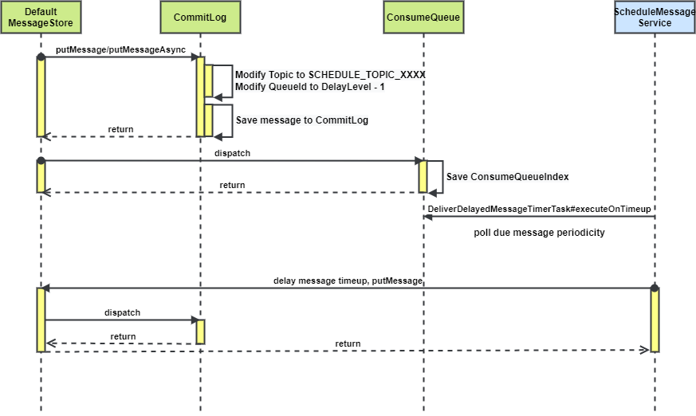

# RocketMQ 延迟消息（定时消息）源码解析

# 1. 概述

## 1.1 定时消息概念

定时消息指发送一条消息，消费者不立即能够消费，而是需要在指定时间进行消费

- 生产者在发送消息时为消息指定发送时间，或者延迟时间
- 定时消息指消息发送后，不能立即被消费者消费
- 当到达指定的发送时间或者延迟相应时间后，消费者才可消费

## 1.2 RocketMQ中的定时消息支持

截至目前版本，RocketMQ 不支持任意时间的定时消息，而是提供了18个延迟等级。发送消息时可以从18个延迟等级中选一个，然后这条消息会延迟相应的时间发送。

默认支持的延迟等级为：

```bash
1s 5s 10s 30s 1m 2m 3m 4m 5m 6m 7m 8m 9m 10m 20m 30m 1h 2h
```

可在 Broker 端通过 `messageDelayLevel` 参数进行配置

需要注意的是 RocketMQ 的定时消息受到 CommitLog 保存时间的限制。也就是说如果 CommitLog 最长保存3天，那么延迟时间最长为3天。

# 2. 概要流程

下面讲一下RocketMQ中发送定时消息，Broker处理再到消息被消费的流程

- 生产者
    1. 生产者发送消息时，用户需在消息属性中设置延迟等级
- Broker
    1. Broker 初始化时会创建一个 Topic，专门存放延迟消息。该 Topic 默认有18（延迟等级个数）个 Queue
    2. Broker 启动时，为每个延迟等级都创建一个处理线程。该线程扫描对应的延迟等级 Queue。
    3. Broker 收到消息后，查看属性中是否有延迟等级信息。如果有，则将该消息的 Topic 和 QueueId 分别替换成延迟消息对应的 Topic 和延迟等级对应的 QueueId。
       
        然后将消息真正的 Topic 和 QueueId 放到消息的 properties 属性中
        
        最后将消息保存到磁盘。
        
    4. 延迟消息保存后，会在在其 ConsumeQueue 生成索引（上面说过，每个延迟等级都有一个 Queue）
    5. 延迟等级处理线程周期性扫描对应的延迟等级 ConsumeQueue 中是否有到期的消息，如果有则将消息真正的 Topic 和 QueueId 恢复，然后重新投递，如果没有则继续循环扫描
- 消费者
    1. 当延迟消息被延迟等级处理线程重新投递之后，消费者可以消费到该消息


# 3. 详细流程

延迟消息在 Producer 端只需要在消息上额外设置延迟等级即可，所以这里只讨论 Broker 端的流程。

```java
// 在Producer端设置消息为定时消息
Message msg = new Message();
msg.setTopic("TopicA");
msg.setTags("Tag");
msg.setBody("this is a delay message".getBytes());
// 设置延迟level为5，对应延迟1分钟
msg.setDelayTimeLevel(5);
producer.send(msg);
```

---

## 3.1 定时消息涉及到的类

我们先来看一下定时消息涉及到的类分别实现了什么功能

- `SCHEDULE_TOPIC_XXXX`：这是一个 RocketMQ 系统 Topic，在 Broker 启动时会自动创建，专门用来保存还没有到投递时间的定时消息。系统级别的 Topic 无法被消费者消费，所以在被重新投递之前，消费者无法消费到未到期的定时消息。
    - 它默认有 18 个 Queue，对应18个延迟等级。每个 Queue 都保存所有对应延迟等级的定时消息。
    - 这么设计的原因：延迟消息每个消息的投递时间不确定，Broker 端需要将消息根据投递时间排序后投递。只支持指定时间延迟，并为每个延迟等级设计单独的 Queue 就是为了解决消息排序的问题。这样一来，每个 Queue 中的消息都是按照消息产生的时间顺序发送的。
- **CommitLog**：RocketMQ 消息存储的实现，在定时消息功能中，它主要负责在保存消息时将原消息的 Topic 和 QueueId 替换成定时消息对应的 Topic 和 QueueId。
- **ConsumeQueue**：RocketMQ 的消费队列，用于消费者消费消息。每个队列元素是一个消息的索引，该索引主要包含消息在 CommitLog 中的偏移量。
    - 消费者消费时查询 ConsumeQueue，一旦发现新的索引项，就可以用该项中的偏移量从 CommitLog 中找到消息并消费。
- **ScheduleMessageService**：实现定时消息延迟投递的主要逻辑。为每个延迟等级的 Queue 创建一个线程，该线程循环扫描对应的 Queue，如果发现到投递时间的消息，则把消息的 Topic 和 QueueId 恢复，然后重新投递到 CommitLog 中。

## 3.2 定时消息时序图



1. DefaultMessageStore 调用 putMessage 方法保存消息，内部调用 CommitLog 保存消息
2. CommitLog 保存消息时检查是否是延迟消息（是否有 DelayLevel 属性）
    - 如果是，则修改消息的

## 3.3 每个类关于定时消息的具体逻辑

### 3.3.1 CommitLog

- `putMessage() / AsyncPutMessage()`：同步和异步的消息存储函数，Broker 收到消息后存储消息时调用。
    - 在存盘之前，中检查消息属性中`delayLevel > 0`来判断是否是定时消息
    - 如果是定时消息，将原消息的 Topic 和 QueueId 替换成定时消息对应的 Topic 和 QueueId；然后将消息真正的 Topic 和 QueueId 存放到消息 `properties`属性中
    - 将消息存储。之后会根据存储的消息构建消息的索引文件 ConsumeQueue 和 IndexFile
    - 重投递时，会计算出消息的真正投递时间，保存到 ConsumeQueue 索引的 `tagsCode` 位置。

### 3.3.2 ScheduleMessageService

这个类扩展了 `ConfigManager`，`ConfigManager` 提供了管理一个配置文件的功能，包含配置文件持久化的函数和重新加载配置文件到内存的函数。

- `ConcurrentMap<Integer /* level */, Long/* offset */> offsetTable`：每个延迟等级扫描的逻辑 offset，会被作为配置文件保存，在启动时从磁盘中加载。
- `start()`：Broker 不为 `SLAVE` 时，在 Broker 启动时运行。
    1. 从磁盘中加载`offsetTable`
    2. 为每个延迟等级创建一个`DeliverDelayedMessageTimerTask`，用于周期性扫描延迟等级的消息，将到期的消息重新投递
    3. 创建一个周期性定时任务，定时将`offsetTable`持久化
- `Timer timer`：最初 RocketMQ 使用 Java 的 `Timer` 来执行定时任务，但是由于 Timer 内部只有一个线程同步执行，无法同时投递多个延迟等级的消息。在 [PR#3287](https://github.com/apache/rocketmq/pull/3287) 中替换成了 `ScheduledExecutorService`，用以提高定时消息重投递的性能。

### 3.3.3 DeliverDelayedMessageTimerTask

`ScheduleMessageService`的内部类，扩展了 `TimerTask`，用以被 `Timer` 定时调用。（后改成 Runnable，用以被`ScheduledExecutorService`定时调用）

每个该类对应一个延迟等级的 Queue，负责周期性扫描该 Queue 中是否有到期消息，如果有则将到期消息都投递到 CommitLog，如果没有则等待 0.1s 继续下次扫描。

- `run()`：执行入口，这里没有用 while 循环或者是周期性定时任务来周期执行，而是每次 `run()` 里面都会执行一个新的定时任务（`DeliverDelayedMessageTimerTask`），以此来达到周期性执行该任务的效果。
- `executeOnTimeup()`：扫描消息并且检查是否到投递时间的主要逻辑都在这个函数里面，由`run()`调用

# 4. 源码解析

## 4.1 CommitLog

- **asyncPutMessage：消息异步保存**
    - 在存盘之前，中检查消息属性中`delayLevel > 0`来判断是否是定时消息
    - 如果是定时消息，将原消息的 Topic 和 QueueId 替换成定时消息对应的 Topic 和 QueueId；然后将消息真正的 Topic 和 QueueId 存放到消息 `properties`属性中

```java
public CompletableFuture<PutMessageResult> asyncPutMessage(final MessageExtBrokerInner msg) {
    // ...

    String topic = msg.getTopic();
    int queueId = msg.getQueueId();

    final int tranType = MessageSysFlag.getTransactionValue(msg.getSysFlag());
    if (tranType == MessageSysFlag.TRANSACTION_NOT_TYPE || tranType == MessageSysFlag.TRANSACTION_COMMIT_TYPE) {
        // Delay Delivery
				// 判断是否是定时消息
        if (msg.getDelayTimeLevel() > 0) {
            if (msg.getDelayTimeLevel() > this.defaultMessageStore.getScheduleMessageService().getMaxDelayLevel()) {
                msg.setDelayTimeLevel(this.defaultMessageStore.getScheduleMessageService().getMaxDelayLevel());
            }
						// 替换消息的Topic和QueueId为定时消息Topic和延迟等级对应的QueueId
            topic = TopicValidator.RMQ_SYS_SCHEDULE_TOPIC;
            queueId = ScheduleMessageService.delayLevel2QueueId(msg.getDelayTimeLevel());

            // Backup real topic, queueId
						// 把真正的 Topic 和 QueueId 放到消息属性中
            MessageAccessor.putProperty(msg, MessageConst.PROPERTY_REAL_TOPIC, msg.getTopic());
            MessageAccessor.putProperty(msg, MessageConst.PROPERTY_REAL_QUEUE_ID, String.valueOf(msg.getQueueId()));
            msg.setPropertiesString(MessageDecoder.messageProperties2String(msg.getProperties()));

            msg.setTopic(topic);
            msg.setQueueId(queueId);
        }
    }
		// ...消息存储逻辑
}
```

同步保存消息的方法即是异步方法调用`get()`，不再赘述

## 4.2 ScheduleMessageService

- **start：延迟消息服务启动**
    1. 从磁盘中加载`offsetTable`
    2. 为每个延迟等级创建一个`DeliverDelayedMessageTimerTask`，用于周期性扫描延迟等级的消息，将到期的消息重新投递
    3. 创建一个周期性定时任务，定时将`offsetTable`持久化

```java
public void start() {
    if (started.compareAndSet(false, true)) {
        super.load();
        this.timer = new Timer("ScheduleMessageTimerThread", true);
        for (Map.Entry<Integer, Long> entry : this.delayLevelTable.entrySet()) {
            Integer level = entry.getKey();
            Long timeDelay = entry.getValue();
            Long offset = this.offsetTable.get(level);
            if (null == offset) {
                offset = 0L;
            }

            if (timeDelay != null) {
                this.timer.schedule(new DeliverDelayedMessageTimerTask(level, offset), FIRST_DELAY_TIME);
            }
        }

        this.timer.scheduleAtFixedRate(new TimerTask() {

            @Override
            public void run() {
                try {
                    if (started.get()) {
                        ScheduleMessageService.this.persist();
                    }
                } catch (Throwable e) {
                    log.error("scheduleAtFixedRate flush exception", e);
                }
            }
        }, 10000, this.defaultMessageStore.getMessageStoreConfig().getFlushDelayOffsetInterval());
    }
}
```

### 4.2.1 DeliverDelayedMessageTimerTask

- **executeOnTimeup：延迟到期执行**
    1. 先获延迟等级取对应的 ConsumeQueue，然后根据 `offsetTable` 中获取的延迟等级对应的 offset（记录这个队列扫描的偏移量）开始扫描后面的消息
    2. 从 ConsumeQueue 获取 tagsCode，这里面存的是真正投递时间，跟现在的时间戳比较，来判断该消息是否要投递
        - 如果现在已经到了投递时间点，投递消息
        - 如果现在还没到投递时间点，继续创建一个定时任务，countdown 秒之后执行，然后 return
    3. 等待 0.1s，执行一个新的 `DeliverDelayedMessageTimerTask`

```java
public void executeOnTimeup() {
    // 根据delayLevel查找对应的延迟消息ConsumeQueue
    ConsumeQueue cq =
        ScheduleMessageService.this.defaultMessageStore.findConsumeQueue(TopicValidator.RMQ_SYS_SCHEDULE_TOPIC,
            delayLevel2QueueId(delayLevel));

    long failScheduleOffset = offset;

    if (cq != null) {
        // 根据ConsumeQueue的有效延迟消息逻辑offset，获取所有有效的消息
        SelectMappedBufferResult bufferCQ = cq.getIndexBuffer(this.offset);
        if (bufferCQ != null) {
            try {
                long nextOffset = offset;
                int i = 0;
                ConsumeQueueExt.CqExtUnit cqExtUnit = new ConsumeQueueExt.CqExtUnit();
                // 遍历ConsumeQueue中的所有有效消息
                for (; i < bufferCQ.getSize(); i += ConsumeQueue.CQ_STORE_UNIT_SIZE) {
                    // 获取ConsumeQueue索引的三个关键属性
                    long offsetPy = bufferCQ.getByteBuffer().getLong();
                    int sizePy = bufferCQ.getByteBuffer().getInt();
                    long tagsCode = bufferCQ.getByteBuffer().getLong();

                    if (cq.isExtAddr(tagsCode)) {
                        if (cq.getExt(tagsCode, cqExtUnit)) {
                            tagsCode = cqExtUnit.getTagsCode();
                        } else {
                            //can't find ext content.So re compute tags code.
                            log.error("[BUG] can't find consume queue extend file content!addr={}, offsetPy={}, sizePy={}",
                                tagsCode, offsetPy, sizePy);
                            long msgStoreTime = defaultMessageStore.getCommitLog().pickupStoreTimestamp(offsetPy, sizePy);
                            tagsCode = computeDeliverTimestamp(delayLevel, msgStoreTime);
                        }
                    }

                    // ConsumeQueue里面的tagsCode实际是一个时间点（投递时间点）
                    long now = System.currentTimeMillis();
                    long deliverTimestamp = this.correctDeliverTimestamp(now, tagsCode);

                    nextOffset = offset + (i / ConsumeQueue.CQ_STORE_UNIT_SIZE);

                    long countdown = deliverTimestamp - now;

                    // 如果现在已经到了投递时间点，投递消息
                    // 如果现在还没到投递时间点，继续创建一个定时任务，countdown秒之后执行
                    if (countdown <= 0) {
                        MessageExt msgExt =
                            ScheduleMessageService.this.defaultMessageStore.lookMessageByOffset(
                                offsetPy, sizePy);

                        if (msgExt != null) {
                            try {
                                MessageExtBrokerInner msgInner = this.messageTimeup(msgExt);
                                if (TopicValidator.RMQ_SYS_TRANS_HALF_TOPIC.equals(msgInner.getTopic())) {
                                    log.error("[BUG] the real topic of schedule msg is {}, discard the msg. msg={}",
                                            msgInner.getTopic(), msgInner);
                                    continue;
                                }
                                // 重新投递消息到CommitLog
                                PutMessageResult putMessageResult =
                                    ScheduleMessageService.this.writeMessageStore
                                        .putMessage(msgInner);
                                // 投递成功
                                if (putMessageResult != null
                                    && putMessageResult.getPutMessageStatus() == PutMessageStatus.PUT_OK) {
                                    continue;
                                // 投递失败
                                } else {
                                    // XXX: warn and notify me
                                    log.error(
                                        "ScheduleMessageService, a message time up, but reput it failed, topic: {} msgId {}",
                                        msgExt.getTopic(), msgExt.getMsgId());
                                    ScheduleMessageService.this.timer.schedule(
                                        new DeliverDelayedMessageTimerTask(this.delayLevel,
                                            nextOffset), DELAY_FOR_A_PERIOD);
                                    ScheduleMessageService.this.updateOffset(this.delayLevel,
                                        nextOffset);
                                    return;
                                }
                            } catch (Exception e) {
                                /*
                                 * XXX: warn and notify me
                                 * msgExt里面的内容不完整
                                 * ，如没有REAL_QID,REAL_TOPIC之类的
                                 * ，导致数据无法正常的投递到正确的消费队列，所以暂时先直接跳过该条消息
                                 */
                                log.error(
                                    "ScheduleMessageService, messageTimeup execute error, drop it. msgExt="
                                        + msgExt + ", nextOffset=" + nextOffset + ",offsetPy="
                                        + offsetPy + ",sizePy=" + sizePy, e);
                            }
                        }
                    } else {
                        // 该条ConsumeQueue索引对应的消息如果未到投递时间，那么创建一个定时任务，到投递时间时执行
                        // 如果有还未投递的消息，创建定时任务后直接返回
                        ScheduleMessageService.this.timer.schedule(
                            new DeliverDelayedMessageTimerTask(this.delayLevel, nextOffset),
                            countdown);
                        ScheduleMessageService.this.updateOffset(this.delayLevel, nextOffset);
                        return;
                    }
                } // end of for

                // 如果所有消息都已经被投递，那么等待0.1s后重新执行该检查任务
                nextOffset = offset + (i / ConsumeQueue.CQ_STORE_UNIT_SIZE);
                ScheduleMessageService.this.timer.schedule(new DeliverDelayedMessageTimerTask(
                    this.delayLevel, nextOffset), DELAY_FOR_A_WHILE);
                ScheduleMessageService.this.updateOffset(this.delayLevel, nextOffset);
                return;
            } finally {

                bufferCQ.release();
            }
        } // end of if (bufferCQ != null)
        else {
            /*
             * 索引文件被删除，定时任务中记录的offset已经被删除，会导致从该位置中取不到数据，
             * 这里直接纠正下一次定时任务的offset为当前定时任务队列的最小值
             */
            long cqMinOffset = cq.getMinOffsetInQueue();
            if (offset < cqMinOffset) {
                failScheduleOffset = cqMinOffset;
                log.error("schedule CQ offset invalid. offset=" + offset + ", cqMinOffset="
                    + cqMinOffset + ", queueId=" + cq.getQueueId());
            }
        }
    } // end of if (cq != null)

    ScheduleMessageService.this.timer.schedule(new DeliverDelayedMessageTimerTask(this.delayLevel,
        failScheduleOffset), DELAY_FOR_A_WHILE);
}
```

# 5. 更多思考

## 5.1 为什么不实现任意时间的定时消息？

1. 实现有一定难度
    - 受到 CommitLog 保存时间限制：现在的延迟消息机制基于 CommitLog，消息到期之后会从 CommitLog 把定时消息查出来重新投递，如果 CommitLog 被删除，那么无法重新投递。
2. 不愿意开源
    - 为了提供差异化服务（云服务竞争力体现）

## 5.2 任意时间定时消息实现？

社区有一个PR，可以实现在 CommitLog 保存时间之内任意时间的延迟消息实现。其实现了一个新的定时消息 Index 文件，用来根据投递时间查询该时间需要投递的消息，解决了定时消息排序的问题。

[PR#2290](https://github.com/apache/rocketmq/pull/2290)