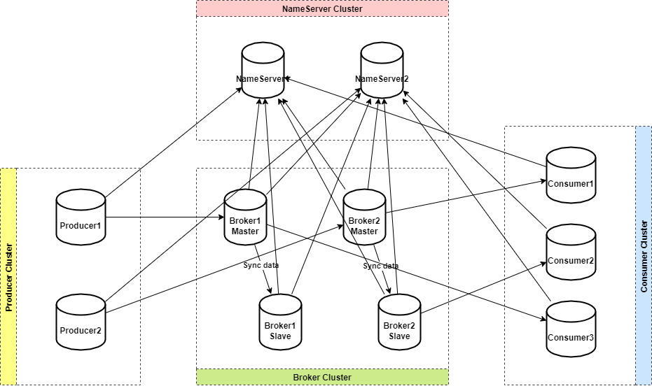
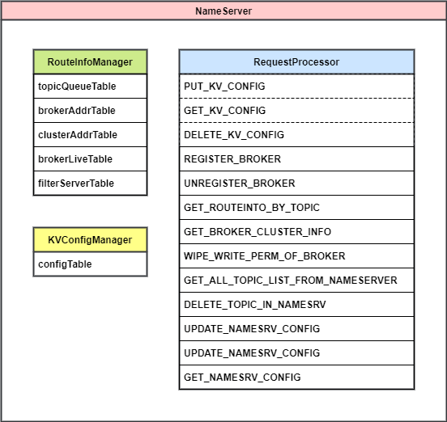
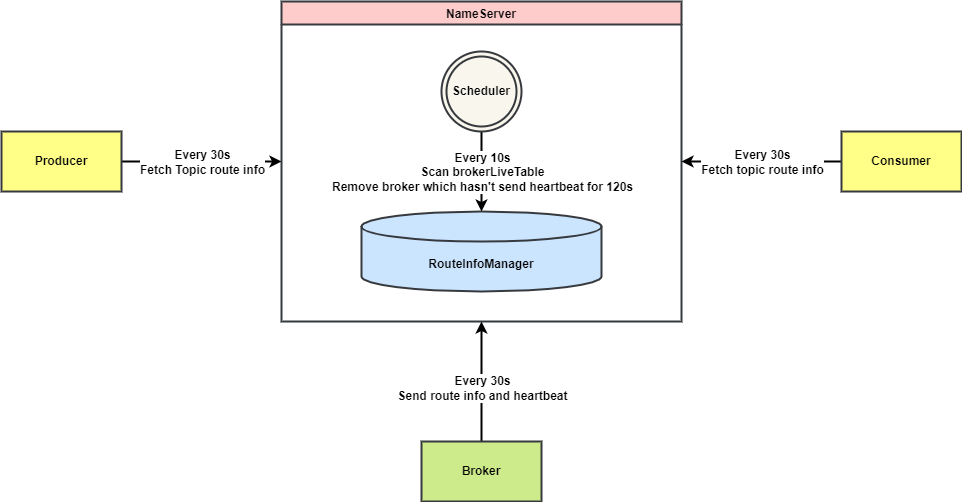
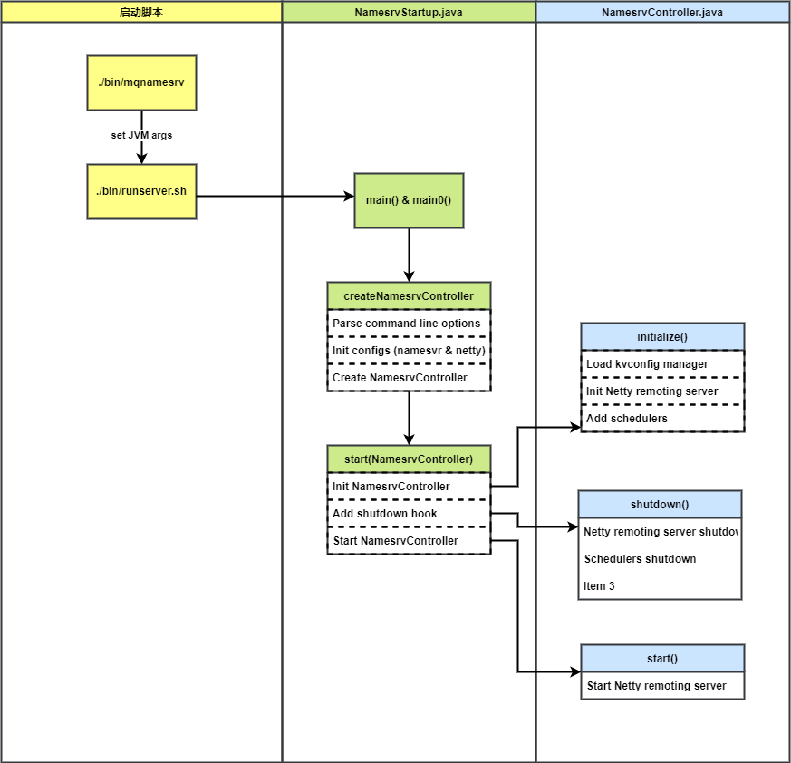
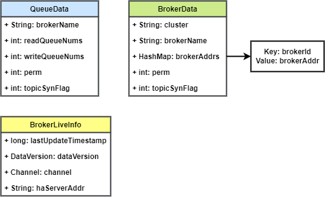

# RocketMQ NameServer 详解 源码剖析

# 1. 概述

## 1.1 NameServer 是什么

NameServer 是组成 RocketMQ 的重要组件之一，是除了 Broker 之外另一个需要部署的服务。设想这样一个问题：RocketMQ 的 Topic 分布在不同的 Broker 上，作为消息的生产者和消费者，如何知道要从哪个 Broker 地址生产或消费消息？如果连接的 Broker 宕机了，如何在不重启的情况下感知？NameServer 就是为了解决这些问题设计的。

NameServer 是一个简单的 Topic 路由注册中心，类似 Kafka、Dubbo 中的 Zookeeper，支持 Broker 的动态注册与发现。主要包含两个功能

1. Broker 管理：NameServer 接受 Broker 集群的注册信息并且保存下来作为路由信息的基本数据。然后提供心跳检测机制，检查 Broker 是否还存活。
2. 路由信息管理：每个 NameServer 将保存关于Broker集群的整个路由信息和用于客户端查询的队列信息。然后 Producer 和 Conumser 通过 NameServer 就可以知道整个 Broker 集群的路由信息，从而进行消息的投递和消费。

NameServer 通常以集群的方式部署，各实例间相互不进行信息通讯。RocketMQ 典型的双主双从部署方式如下图所示：



Broker 定期向 NameServer 发送心跳，上报路由信息。客户端（生产者、消费者）定期请求 NameServer 获取最新的路由信息。

## 1.2 NameServer 与 Zookeeper

Kafka 在老版本中使用 Zookeeper 作为路由中心，在 3.0 之后的版本也将 Zookeeper 的依赖移除。在早期版本的 RocketMQ 中据说也是使用 Zookeeper 作为路由中心，为什么主流消息队列都抛弃了 Zookeeper 选择自研路由中心呢？

主要原因是 Zookeeper 运行机制复杂、对于 RocketMQ 来说依赖太重，维护和定位问题较困难；而 NameServer 的实现非常轻量级，且具备很高的可靠程度，用于路由发现的场景非常合适。此外还有以下一些原因：

>1. 根据 CAP 理论，同时最多只能满足两个点，而 zookeeper 满足的是 CP，也就是说 zookeeper 并不能保证服务的可用性，zookeeper 在进行选举的时候，整个选举的时间太长，期间整个集群都处于不可用的状态，而这对于一个注册中心来说肯定是不能接受的，作为服务发现来说就应该是为可用性而设计。
>2. 基于性能的考虑，NameServer 本身的实现非常轻量，而且可以通过增加机器的方式水平扩展，增加集群的抗压能力，而 zookeeper 的写是不可扩展的，而zookeeper 要解决这个问题只能通过划分领域，划分多个zookeeper集群来解决，首先操作起来太复杂，其次这样还是又违反了CAP中的A的设计，导致服务之间是不连通的。
>3. 持久化的机制来带的问题，ZooKeeper 的 ZAB 协议对每一个写请求，会在每个 ZooKeeper 节点上保持写一个事务日志，同时再加上定期的将内存数据镜像（Snapshot）到磁盘来保证数据的一致性和持久性，而对于一个简单的服务发现的场景来说，这其实没有太大的必要，这个实现方案太重了。而且本身存储的数据应该是高度定制化的。
>4. 消息发送应该弱依赖注册中心，而RocketMQ的设计理念也正是基于此，生产者在第一次发送消息的时候从 NameServer 获取到Broker地址后缓存到本地，如果 NameServer 整个集群不可用，短时间内对于生产者和消费者并不会产生太大影响。

# 2. 概要设计

NameServer 仅仅处理其他模块的请求，而不会主动向其他模块发起请求。正如其名字 Server，它其实本质上就是一个 NettyServer。

## 2.1 模块

NameServer 的代码并不多，如下所示


它主要有 3 个模块：Topic 路由管理模块（`RouteInfoManager`）、通信模块（`DefaultRequestProcessor`、`ClusterTestRequestProcessor`）、KV 数据存储模块（`KVConfigManager`)。



RouteInfoManager 中存储 5 个 `HashMap`，这就是 NameServer 中主要存储的数据。它们仅存在于内存中，并不会持久化。其中数据内容如下：

* topicQueueTable：保存 Topic 的队列信息，也是真正的路由信息。队列信息中包含了其所在的 Broker 名称和读写队列数量。
* brokerAddrTable：保存 Broker 信息，包含其名称、集群名称、主备 Broker 地址。
* clusterAddrTable：保存 Cluster信息，包含每个集群中所有的 Broker 名称列表。
* brokerLiveTable：Broker 状态信息，包含当前所有存活的 Broker，和它们最后一次上报心跳的时间。
* filterServerTable：Broker 上的 FilterServer 列表，用于类模式消息过滤，该机制在 4.4 版本后被废弃。

RequestProcessor 继承了 AsyncNettyRequestProcessor。作为 NameServer 的请求处理器，根据不同种类的请求做不同类型的处理。
其中 `KV_CONFIG` 类型的请求用于 KVConfig 模块，当前不会用到。其他请求类型由 Broker 和 Producer、Consumer 发起。

KVConfigManager 内部保存了一个二级 `HashMap`： `configTable`，并且会将该对象进行持久化。

## 2.2 交互



上图为 NameServer 与其他组件交互的示意图。可以看到 Producer、Consumer、Broker 均每 30s 向 NameServer 发起一次请求，NameServer 中也有定时器，定期扫描和更新内部数据。

1. Broker 每隔 30s 向 NameServer 集群的每台机器都发送心跳包，包含自身 Topic 队列的路由信息。
2. NameServer 收到 Broker 心跳信息会记录时间戳（到 brokerAddrTable），用作判断 Broker 是否掉线。
3. 生产者和消费者每隔 30s 向 NameServer 发送请求，获取它们要生产/消费的 Topic 的路由信息。
4. NameServer 中启动一个定时任务线程，每隔 10s 扫描 brokerAddrTable 中所有的 Broker 上次发送心跳时间，如果超过 120s 没有收到心跳，则从存活 Broker 表中移除该 Broker。

# 3. 详细设计

## 3.1 NameServer 启动



上图为 NameServer 启动流程的示意图。

1. 由启动脚本调用 `NamesrvStartup#main` 函数触发启动流程
2. `NamesrvStartup#createNamesrvController` 函数中先解析命令行参数，然后初始化 NameServer 和 Netty remote server 配置，最后创建 `NamesrvController` 的实例。
3. `NamesrvStartup#start` 初始化 `NamesrvController`；调用 `NamesrvController#start()` 方法，启动 Netty remoting server；最后注册关闭钩子函数，在 JVM 线程关闭之前，关闭 Netty remoting server 和处理线程池，关闭定时任务线程。
4. `NamesrvController` 实例是 NameServer 的核心控制器，它的初始化方法 `initialize()` 先加载 KVConfig manager，然后初始化 Netty remoting server。最后添加 2 个定时任务：一个每 10s 打印一次 KV 配置，一个每 10s 扫描 Broker 列表，移除掉线的 Broker。

## 3.2 路由信息

### 3.2.1 NameServer 端保存的路由信息

NameServer 中的路由信息主要指的是前面说到的 5 个 `HashMap`。它们只会保存在内存中，不会被持久化。下面看一下它们的具体结构。

```java
HashMap<String/* topic */, Map<String /* brokerName */ , QueueData>> topicQueueTable;
HashMap<String/* brokerName */, BrokerData> brokerAddrTable;
HashMap<String/* clusterName */, Set<String/* brokerName */>> clusterAddrTable;
HashMap<String/* brokerAddr */, BrokerLiveInfo> brokerLiveTable;
HashMap<String/* brokerAddr */, List<String>/* Filter Server */> filterServerTable;
```



### 3.2.2 客户端保存的路由信息

客户端中的路由信息保存在这个表中，也仅保存在内存，不会持久化。

```java
ConcurrentMap<String/* Topic */, TopicRouteData> topicRouteTable = new ConcurrentHashMap<String, TopicRouteData>();
```

其中包含该 Topic 的队列列表、Broker 信息列表等数据。

```java
public class TopicRouteData extends RemotingSerializable {
    // 顺序消息的配置，来自 KvConfig
    private String orderTopicConf;
    // Topic 队列元数据
    private List<QueueData> queueDatas;
    // Topic 分布的 Broker 元数据
    private List<BrokerData> brokerDatas;
    // Topic 上 FilterServer 的地址列表
    private HashMap<String/* brokerAddr */, List<String>/* Filter Server */> filterServerTable;
    // ...
}
```

## 3.3 路由注册

路由注册包含两个方面：Broker 上报路由信息，和 NameServer 处理 Broker 的请求，将 Broker 上报的路由信息存起来。

### 3.3.1 Broker 上报心跳和路由信息

Broker 发送心跳包的定时任务在 `BrokerController#start()` 方法中启动，每隔 30s 调用 `registerBrokerAll` 发送一次心跳包，并将自身的 Topic 队列路由信息发送给 NameServer。
Broker 会遍历 NameServer 列表，向每个 NameServer 发送心跳包。

心跳包的请求头中包含

* Broker 地址
* BrokerId，0 表示主节点，>0 表示从节点
* Broker 名称
* 集群名称
* 主节点地址

请求体中包含 `topicConfigTable`，包含了每个 Topic 的所有队列信息。

上报的心跳包请求类型是:`RequestCode.REGISTER_BROKER`

### 3.3.2 NameServer 保存上报的路由信息

NameServer 的 `DefaultRequestProcessor` 接收到 `REGISTER_BROKER` 类型的请求后，将上报的路由信息调用 `RouteInfoManager#registerBroker()` 写入内存中的路由表。

写入过程首先会获取写锁，然后依次写入 `RouteInfoManager` 中的几个路由信息表。

1. `RouteInfoManager` 加写锁
2. 更新 `clusterAddrTable`，更新集群信息
3. 更新 `brokerAddrTable`，更新 Broker 信息
4. 更新 `topicQueueTable`，更新 Topic 队列信息
5. 更新 `brokerLiveTable`，更新 Broker 存活状态
6. 更新 `filterServerTable`，注册 Broker 的过滤器 Server 地址列表
7. 释放写锁

## 3.4 路由删除

如果 Broker 宕机，则无法向 NameServer 发送心跳包。NameServer 中有一个定时任务线程，每隔 10s 检查 Broker 存活状态，如果 Broker 已经 120s 没有上报心跳，则关闭与 Broker 的连接，同时更新路由信息表，将该 Broker 相关信息移除。

每次扫描，都会遍历 `brokerLiveTable`，取每个 Broker 的 `lastUpdateTimestamp` 与当前时间对比，如果相差大于 120s，则执行路由删除逻辑 `RouteInfoManager#onChannelDestroy()`。
另一个触发路由删除逻辑的是 Broker 正常关闭，会调用 `unregisterBroker` 方法，删除 NameServer 上的 Broker 信息。

路由删除逻辑如下

1. `RouteInfoManager` 加写锁
2. 从 `brokerAddrTable` 找到对应的 Broker，移除
3. 从 `clusterAddrTable` 找到对应 Broker，移除
4. 根据 BrokerName，从 `topicQueueTable` 中移除该 Broker 的队列
5. 释放写锁

## 3.5 路由发现（客户端拉取路由信息）

NameServer 不会主动将路由信息推送给客户端，客户端需要自己定时从 NameServer 拉取路由信息。客户端中会启动一个定时任务，每 30s 向 NameServer 发送请求获取最新的路由信息。

### 3.5.1 客户端请求路由信息

客户端中注册定时任务的方法是 `MQClientInstance#startScheduledTask()`，每隔 30s 调用 `updateTopicRouteInfoFromNameServer()` 方法，更新路由信息。

客户端只会获取它生产或者消费的 Topic 路由信息，更新之后保存到 `MQClientInstance.topicRouteTable` 中，它也仅保存在内存中。

### 3.5.2 NameServer 返回路由信息

NameServer 收到客户端获取路由信息请求后，调用 `DefaultRequestProcessor#getRouteInfoByTopic()` 方法，返回 Topic 路由信息。该方法逻辑如下

1. 调用 `RouteInfoManager#pickupTopicRouteData()` 方法，从路由表 `topicQueueTable`、`brokerAddrTable`、`filterServerTable` 中获取信息，填充 `TopicRouteData` 对象。
2. 如果该主题为顺序消息，从 KVConfig 中获取顺序消息相关的配置，填充进 `TopicRouteData` 对象。
3. 将 `TopicRouteData` 对象编码，并返回给客户端。

# 4. 源码剖析

## 4.1 NameServer 启动

### 4.1.1 NemesrvStartup

NamesrvStartup 类是 NameServer 的启动类，它会调用 `NamesrvController` 类的初始化和启动方法，执行 NameServer 具体模块的初始化和启动。

`NamesrvStartup#createNamesrvController` 函数中先解析命令行参数，然后初始化 NameServer 和 Netty remote server 配置，最后启动 `NamesrvController` 的初始化

```java
public static NamesrvController createNamesrvController(String[] args) throws IOException, JoranException {
    System.setProperty(RemotingCommand.REMOTING_VERSION_KEY, Integer.toString(MQVersion.CURRENT_VERSION));
    //PackageConflictDetect.detectFastjson();

    // 解析命令行参数
    Options options = ServerUtil.buildCommandlineOptions(new Options());
    commandLine = ServerUtil.parseCmdLine(
        "mqnamesrv", args, buildCommandlineOptions(options), new PosixParser());
    if (null == commandLine) {
        System.exit(-1);
        return null;
    }

    // 初始化 Name server 配置参数
    final NamesrvConfig namesrvConfig = new NamesrvConfig();
    // 初始化 Name server 网络配置（Netty 服务端配置）
    final NettyServerConfig nettyServerConfig = new NettyServerConfig();
    nettyServerConfig.setListenPort(9876);
    // 使用 -c 指定配置文件路径
    if (commandLine.hasOption('c')) {
        String file = commandLine.getOptionValue('c');
        if (file != null) {
            InputStream in = new BufferedInputStream(new FileInputStream(file));
            properties = new Properties();
            properties.load(in);
            MixAll.properties2Object(properties, namesrvConfig);
            MixAll.properties2Object(properties, nettyServerConfig);

            namesrvConfig.setConfigStorePath(file);

            System.out.printf("load config properties file OK, %s%n", file);
            in.close();
        }
    }

    // 使用 -p 打印当前加载配置属性
    if (commandLine.hasOption('p')) {
        InternalLogger console = InternalLoggerFactory.getLogger(LoggerName.NAMESRV_CONSOLE_NAME);
        MixAll.printObjectProperties(console, namesrvConfig);
        MixAll.printObjectProperties(console, nettyServerConfig);
        System.exit(0);
    }

    // 加载命令行中指定的属性，形如 --listenPort 9876
    MixAll.properties2Object(ServerUtil.commandLine2Properties(commandLine), namesrvConfig);

    if (null == namesrvConfig.getRocketmqHome()) {
        System.out.printf("Please set the %s variable in your environment to match the location of the RocketMQ installation%n", MixAll.ROCKETMQ_HOME_ENV);
        System.exit(-2);
    }

    // 初始化 Logback
    LoggerContext lc = (LoggerContext) LoggerFactory.getILoggerFactory();
    JoranConfigurator configurator = new JoranConfigurator();
    configurator.setContext(lc);
    lc.reset();
    configurator.doConfigure(namesrvConfig.getRocketmqHome() + "/conf/logback_namesrv.xml");

    log = InternalLoggerFactory.getLogger(LoggerName.NAMESRV_LOGGER_NAME);

    // 打印 Name server 配置参数
    MixAll.printObjectProperties(log, namesrvConfig);
    MixAll.printObjectProperties(log, nettyServerConfig);

    // 初始化 Name server 控制器
    final NamesrvController controller = new NamesrvController(namesrvConfig, nettyServerConfig);

    // remember all configs to prevent discard
    controller.getConfiguration().registerConfig(properties);

    return controller;
}
```

`NamesrvStartup#start` 初始化 `NamesrvController`；调用 `NamesrvController#start(`) 方法，启动 Netty remoting server；最后注册关闭钩子函数，在 JVM 线程关闭之前，关闭 Netty remoting server 和处理线程池，关闭定时任务线程。

```java
public static NamesrvController start(final NamesrvController controller) throws Exception {

    if (null == controller) {
        throw new IllegalArgumentException("NamesrvController is null");
    }

    // 初始化 NamesrvController：加载 KVConfig，初始化 Netty remoting server，添加定时任务
    boolean initResult = controller.initialize();
    if (!initResult) {
        controller.shutdown();
        System.exit(-3);
    }

    // 注册 JVM 钩子函数，在 JVM 完全关闭之前，执行该方法，关闭 Name server
    Runtime.getRuntime().addShutdownHook(new ShutdownHookThread(log, new Callable<Void>() {
        @Override
        public Void call() throws Exception {
            controller.shutdown();
            return null;
        }
    }));

    // 启动 NamesrvController，主要是启动 Netty remoting server
    controller.start();

    return controller;
}
```

### 4.1.2 NamesrvController 启动

初始化方法 `initialize()` 先加载 KVConfig manager，然后初始化 Netty remoting server。最后添加 2 个定时任务：一个每 10s 打印一次 KV 配置，一个每 10s 扫描 Broker 列表，移除掉线的 Broker。

```java
public boolean initialize() {
    // 加载 KV 配置
    this.kvConfigManager.load();

    // 初始化通信层
    this.remotingServer = new NettyRemotingServer(this.nettyServerConfig, this.brokerHousekeepingService);

    // 初始化线程池
    this.remotingExecutor =
        Executors.newFixedThreadPool(nettyServerConfig.getServerWorkerThreads(), new ThreadFactoryImpl("RemotingExecutorThread_"));

    this.registerProcessor();

    // 增加定时任务，每 10s 扫描一次 Broker，移除未激活状态的 Broker
    this.scheduledExecutorService.scheduleAtFixedRate(new Runnable() {

        @Override
        public void run() {
            NamesrvController.this.routeInfoManager.scanNotActiveBroker();
        }
    }, 5, 10, TimeUnit.SECONDS);

    // 增加定时任务，每 10min 打印一次 KV 配置
    this.scheduledExecutorService.scheduleAtFixedRate(new Runnable() {

        @Override
        public void run() {
            NamesrvController.this.kvConfigManager.printAllPeriodically();
        }
    }, 1, 10, TimeUnit.MINUTES);

    if (TlsSystemConfig.tlsMode != TlsMode.DISABLED) {
        // Register a listener to reload SslContext
        try {
            fileWatchService = new FileWatchService(
                new String[] {
                    TlsSystemConfig.tlsServerCertPath,
                    TlsSystemConfig.tlsServerKeyPath,
                    TlsSystemConfig.tlsServerTrustCertPath
                },
                new FileWatchService.Listener() {
                    boolean certChanged, keyChanged = false;
                    @Override
                    public void onChanged(String path) {
                        if (path.equals(TlsSystemConfig.tlsServerTrustCertPath)) {
                            log.info("The trust certificate changed, reload the ssl context");
                            reloadServerSslContext();
                        }
                        if (path.equals(TlsSystemConfig.tlsServerCertPath)) {
                            certChanged = true;
                        }
                        if (path.equals(TlsSystemConfig.tlsServerKeyPath)) {
                            keyChanged = true;
                        }
                        if (certChanged && keyChanged) {
                            log.info("The certificate and private key changed, reload the ssl context");
                            certChanged = keyChanged = false;
                            reloadServerSslContext();
                        }
                    }
                    private void reloadServerSslContext() {
                        ((NettyRemotingServer) remotingServer).loadSslContext();
                    }
                });
        } catch (Exception e) {
            log.warn("FileWatchService created error, can't load the certificate dynamically");
        }
    }

    return true;
}
```

`start()` 和 `shutdown()` 方法，分别是启动和关闭 Netty remoting server、`fileWatchService`。

其中 fileWatchService 是用来监听文件变化执行回调函数的，这里的作用是：当文件变化时，重新加载 SslContext。

```java
public void start() throws Exception {
    this.remotingServer.start();

    if (this.fileWatchService != null) {
        this.fileWatchService.start();
    }
}

public void shutdown() {
    this.remotingServer.shutdown();
    this.remotingExecutor.shutdown();
    this.scheduledExecutorService.shutdown();

    if (this.fileWatchService != null) {
        this.fileWatchService.shutdown();
    }
}
```

## 4.2 路由信息

### 4.2.1 NameServer 路由信息

下面以单个 Broker 上报的路由信息为例展示 NameServer 中路由信息的结构。

#### topicQueueTable

```java
HashMap<String/* topic */, Map<String /* brokerName */ , QueueData>> topicQueueTable;
```

当前没有注册自定义 Topic，只注册了默认 Topic

```json
{
    "RMQ_SYS_TRANS_HALF_TOPIC":{
        "broker-local":{
            "brokerName":"broker-local",
            "perm":6,
            "readQueueNums":1,
            "topicSysFlag":0,
            "writeQueueNums":1
        }
    },
    "SCHEDULE_TOPIC_XXXX":{
        "broker-local":{
            "brokerName":"broker-local",
            "perm":6,
            "readQueueNums":18,
            "topicSysFlag":0,
            "writeQueueNums":18
        }
    },
    "SELF_TEST_TOPIC":{
        "broker-local":{
            "brokerName":"broker-local",
            "perm":6,
            "readQueueNums":1,
            "topicSysFlag":0,
            "writeQueueNums":1
        }
    },
    "broker-local":{
        "broker-local":{
            "brokerName":"broker-local",
            "perm":7,
            "readQueueNums":1,
            "topicSysFlag":0,
            "writeQueueNums":1
        }
    },
    "TBW102":{
        "broker-local":{
            "brokerName":"broker-local",
            "perm":7,
            "readQueueNums":8,
            "topicSysFlag":0,
            "writeQueueNums":8
        }
    },
    "BenchmarkTest":{
        "broker-local":{
            "brokerName":"broker-local",
            "perm":6,
            "readQueueNums":1024,
            "topicSysFlag":0,
            "writeQueueNums":1024
        }
    },
    "DefaultCluster":{
        "broker-local":{
            "brokerName":"broker-local",
            "perm":7,
            "readQueueNums":16,
            "topicSysFlag":0,
            "writeQueueNums":16
        }
    },
    "DefaultCluster_REPLY_TOPIC":{
        "broker-local":{
            "brokerName":"broker-local",
            "perm":6,
            "readQueueNums":1,
            "topicSysFlag":0,
            "writeQueueNums":1
        }
    },
    "OFFSET_MOVED_EVENT":{
        "broker-local":{
            "brokerName":"broker-local",
            "perm":6,
            "readQueueNums":1,
            "topicSysFlag":0,
            "writeQueueNums":1
        }
    }
}
```

#### brokerAddrTable

```java
HashMap<String/* brokerName */, BrokerData> brokerAddrTable;
```

```json
{
    "broker-local":{
        "brokerAddrs":{
            "0":"127.0.0.1:10911"
        },
        "brokerName":"broker-local",
        "cluster":"DefaultCluster"
    }
}
```

#### clusterAddrTable

```java
HashMap<String/* clusterName */, Set<String/* brokerName */>> clusterAddrTable;
```

```json
{
    "DefaultCluster":[
        "broker-local"
    ]
}
```

#### brokerLiveTable

```java
HashMap<String/* brokerAddr */, BrokerLiveInfo> brokerLiveTable;
```

```json
{
    "127.0.0.1:10911":{
        "channel":{
            "active":true,
            "inputShutdown":false,
            "open":true,
            "outputShutdown":false,
            "registered":true,
            "shutdown":false,
            "writable":true
        },
        "dataVersion":{
            "counter":1,
            "timestamp":1651564857610
        },
        "haServerAddr":"10.0.0.2:10912",
        "lastUpdateTimestamp":1651564899813
    }
}
```

### 4.2.2 客户端路由信息

```java
ConcurrentMap<String/* Topic */, TopicRouteData> topicRouteTable = new ConcurrentHashMap<String, TopicRouteData>();
```

```java
public class TopicRouteData extends RemotingSerializable {
    // 顺序消息的配置，来自 KvConfig
    private String orderTopicConf;
    // Topic 队列元数据
    private List<QueueData> queueDatas;
    // Topic 分布的 Broker 元数据
    private List<BrokerData> brokerDatas;
    // Topic 上 FilterServer 的地址列表
    private HashMap<String/* brokerAddr */, List<String>/* Filter Server */> filterServerTable;
    // ...
}
```

```json
{
    "%RETRY%benchmark_consumer":{
        "brokerDatas":[
            {
                "brokerAddrs":{
                    "0":"127.0.0.1:10911"
                },
                "brokerName":"broker-local",
                "cluster":"DefaultCluster"
            }
        ],
        "filterServerTable":{

        },
        "queueDatas":[
            {
                "brokerName":"broker-local",
                "perm":6,
                "readQueueNums":1,
                "topicSysFlag":0,
                "writeQueueNums":1
            }
        ]
    },
    "TBW102":{
        "brokerDatas":[
            {
                "brokerAddrs":{
                    "0":"127.0.0.1:10911"
                },
                "brokerName":"broker-local",
                "cluster":"DefaultCluster"
            }
        ],
        "filterServerTable":{

        },
        "queueDatas":[
            {
                "brokerName":"broker-local",
                "perm":7,
                "readQueueNums":8,
                "topicSysFlag":0,
                "writeQueueNums":8
            }
        ]
    }
}
```

## 4.3 路由注册

### 4.3.1 Broker 上报心跳和路由信息

BrokerController 最终会调用 `BrokerOuterAPI#registerBrokerAll` 上报心跳和路由信息。

```java
// BrokerOuterAPI.java
/**
 * 向所有 Name server 发送心跳包
 * @return 心跳包发送的响应列表
 */
public List<RegisterBrokerResult> registerBrokerAll(
    final String clusterName,
    final String brokerAddr,
    final String brokerName,
    final long brokerId,
    final String haServerAddr,
    final TopicConfigSerializeWrapper topicConfigWrapper,
    final List<String> filterServerList,
    final boolean oneway,
    final int timeoutMills,
    final boolean compressed) {

    final List<RegisterBrokerResult> registerBrokerResultList = new CopyOnWriteArrayList<>();
    List<String> nameServerAddressList = this.remotingClient.getNameServerAddressList();
    if (nameServerAddressList != null && nameServerAddressList.size() > 0) {

        // 为所有心跳请求构造统一的请求头
        final RegisterBrokerRequestHeader requestHeader = new RegisterBrokerRequestHeader();
        requestHeader.setBrokerAddr(brokerAddr);
        requestHeader.setBrokerId(brokerId);
        requestHeader.setBrokerName(brokerName);
        requestHeader.setClusterName(clusterName);
        // 主节点地址，初次请求时为空，从节点向 Name server 注册后更新
        requestHeader.setHaServerAddr(haServerAddr);
        requestHeader.setCompressed(compressed);

        // 构造统一的请求体
        RegisterBrokerBody requestBody = new RegisterBrokerBody();
        // Topic 配置，存储 Broker 启动时的一些默认 Topic
        requestBody.setTopicConfigSerializeWrapper(topicConfigWrapper);
        // 消息过滤服务器列表
        requestBody.setFilterServerList(filterServerList);
        final byte[] body = requestBody.encode(compressed);
        final int bodyCrc32 = UtilAll.crc32(body);
        requestHeader.setBodyCrc32(bodyCrc32);
        final CountDownLatch countDownLatch = new CountDownLatch(nameServerAddressList.size());
        // 遍历所有 Name server 地址，发送心跳请求
        for (final String namesrvAddr : nameServerAddressList) {
            brokerOuterExecutor.execute(new Runnable() {
                @Override
                public void run() {
                    try {
                        RegisterBrokerResult result = registerBroker(
                            namesrvAddr, oneway, timeoutMills, requestHeader, body);
                        if (result != null) {
                            registerBrokerResultList.add(result);
                        }

                        log.info("register broker[{}]to name server {} OK", brokerId, namesrvAddr);
                    } catch (Exception e) {
                        log.warn("registerBroker Exception, {}", namesrvAddr, e);
                    } finally {
                        countDownLatch.countDown();
                    }
                }
            });
        }

        try {
            countDownLatch.await(timeoutMills, TimeUnit.MILLISECONDS);
        } catch (InterruptedException e) {
        }
    }

    return registerBrokerResultList;
}
```

### 4.3.2 NameServer 保存上报的路由信息

`RouteInfoManager#registerBroker` 将 Broker 上报的路由信息保存到 NameServer 上。

1. `RouteInfoManager` 加写锁
2. 更新 `clusterAddrTable`，更新集群信息
3. 更新 `brokerAddrTable`，更新 Broker 信息
4. 更新 `topicQueueTable`，更新 Topic 队列信息
5. 更新 `brokerLiveTable`，更新 Broker 存活状态
6. 更新 `filterServerTable`，注册 Broker 的过滤器 Server 地址列表
7. 释放写锁

```java
/**
 * 处理 Broker 心跳信息，存到本地路由表
 * 如果是 SLAVE，则返回 MASTER 的 HA 地址
 */
public RegisterBrokerResult registerBroker(
    final String clusterName,
    final String brokerAddr,
    final String brokerName,
    final long brokerId,
    final String haServerAddr,
    final TopicConfigSerializeWrapper topicConfigWrapper,
    final List<String> filterServerList,
    final Channel channel) {
    RegisterBrokerResult result = new RegisterBrokerResult();
    try {
        try {
            // 路由注册需要加写锁，防止并发修改 RouteInfoManager 中的路由表
            this.lock.writeLock().lockInterruptibly();

            // 更新集群信息表。判断 Broker 所属集群是否存在，不存在则创建集群，然后将 Broker 名加入集群信息表
            Set<String> brokerNames = this.clusterAddrTable.get(clusterName);
            if (null == brokerNames) {
                brokerNames = new HashSet<String>();
                this.clusterAddrTable.put(clusterName, brokerNames);
            }
            brokerNames.add(brokerName);

            boolean registerFirst = false;

            // 更新 Broker 地址表，更新主备信息
            BrokerData brokerData = this.brokerAddrTable.get(brokerName);
            if (null == brokerData) {
                // 该 Broker 首次注册
                registerFirst = true;
                brokerData = new BrokerData(clusterName, brokerName, new HashMap<Long, String>());
                this.brokerAddrTable.put(brokerName, brokerData);
            }
            Map<Long, String> brokerAddrsMap = brokerData.getBrokerAddrs();
            //Switch slave to master: first remove <1, IP:PORT> in namesrv, then add <0, IP:PORT>
            //The same IP:PORT must only have one record in brokerAddrTable
            Iterator<Entry<Long, String>> it = brokerAddrsMap.entrySet().iterator();
            while (it.hasNext()) {
                Entry<Long, String> item = it.next();
                if (null != brokerAddr && brokerAddr.equals(item.getValue()) && brokerId != item.getKey()) {
                    it.remove();
                }
            }

            String oldAddr = brokerData.getBrokerAddrs().put(brokerId, brokerAddr);
            registerFirst = registerFirst || (null == oldAddr);

            // 更新 Topic 信息表。只有主节点 Topic 配置信息发生变化或第一次注册才会更新
            if (null != topicConfigWrapper
                && MixAll.MASTER_ID == brokerId) {
                if (this.isBrokerTopicConfigChanged(brokerAddr, topicConfigWrapper.getDataVersion())
                    || registerFirst) {
                    ConcurrentMap<String, TopicConfig> tcTable =
                        topicConfigWrapper.getTopicConfigTable();
                    if (tcTable != null) {
                        for (Map.Entry<String, TopicConfig> entry : tcTable.entrySet()) {
                            this.createAndUpdateQueueData(brokerName, entry.getValue());
                        }
                    }
                }
            }

            // 更新 Broker 存活状态信息，包含最后更新时间
            BrokerLiveInfo prevBrokerLiveInfo = this.brokerLiveTable.put(brokerAddr,
                new BrokerLiveInfo(
                    System.currentTimeMillis(),
                    topicConfigWrapper.getDataVersion(),
                    channel,
                    haServerAddr));
            if (null == prevBrokerLiveInfo) {
                log.info("new broker registered, {} HAServer: {}", brokerAddr, haServerAddr);
            }

            // 更新 Broker 的 FilterServer 列表，一个 Broker 可能有多个 Filter Server
            if (filterServerList != null) {
                if (filterServerList.isEmpty()) {
                    this.filterServerTable.remove(brokerAddr);
                } else {
                    this.filterServerTable.put(brokerAddr, filterServerList);
                }
            }

            if (MixAll.MASTER_ID != brokerId) {
                String masterAddr = brokerData.getBrokerAddrs().get(MixAll.MASTER_ID);
                if (masterAddr != null) {
                    BrokerLiveInfo brokerLiveInfo = this.brokerLiveTable.get(masterAddr);
                    if (brokerLiveInfo != null) {
                        result.setHaServerAddr(brokerLiveInfo.getHaServerAddr());
                        result.setMasterAddr(masterAddr);
                    }
                }
            }
        } finally {
            this.lock.writeLock().unlock();
        }
    } catch (Exception e) {
        log.error("registerBroker Exception", e);
    }

    return result;
}
```

## 4.4. 路由删除

路由删除逻辑如下

1. `RouteInfoManager` 加写锁
2. 从 `brokerAddrTable` 找到对应的 Broker，移除
3. 从 `clusterAddrTable` 找到对应 Broker，移除
4. 根据 BrokerName，从 `topicQueueTable` 中移除该 Broker 的队列
5. 释放写锁

```java
/**
 * Channel 被关闭，或者 Channel Idle 时间超限
 * 关闭与 Broker 的连接，删除它的路由信息
 */
public void onChannelDestroy(String remoteAddr, Channel channel) {
    String brokerAddrFound = null;
    if (channel != null) {
        try {
            try {
                this.lock.readLock().lockInterruptibly();
                Iterator<Entry<String, BrokerLiveInfo>> itBrokerLiveTable =
                    this.brokerLiveTable.entrySet().iterator();
                while (itBrokerLiveTable.hasNext()) {
                    Entry<String, BrokerLiveInfo> entry = itBrokerLiveTable.next();
                    if (entry.getValue().getChannel() == channel) {
                        brokerAddrFound = entry.getKey();
                        break;
                    }
                }
            } finally {
                this.lock.readLock().unlock();
            }
        } catch (Exception e) {
            log.error("onChannelDestroy Exception", e);
        }
    }

    if (null == brokerAddrFound) {
        brokerAddrFound = remoteAddr;
    } else {
        log.info("the broker's channel destroyed, {}, clean it's data structure at once", brokerAddrFound);
    }

    if (brokerAddrFound != null && brokerAddrFound.length() > 0) {

        try {
            try {
                // 加写锁，删除该 Broker 的路由信息
                this.lock.writeLock().lockInterruptibly();
                this.brokerLiveTable.remove(brokerAddrFound);
                this.filterServerTable.remove(brokerAddrFound);

                // 移除 Broker 基础信息表中的该 Broker 信息
                String brokerNameFound = null;
                boolean removeBrokerName = false;
                Iterator<Entry<String, BrokerData>> itBrokerAddrTable =
                    this.brokerAddrTable.entrySet().iterator();
                while (itBrokerAddrTable.hasNext() && (null == brokerNameFound)) {
                    BrokerData brokerData = itBrokerAddrTable.next().getValue();

                    Iterator<Entry<Long, String>> it = brokerData.getBrokerAddrs().entrySet().iterator();
                    while (it.hasNext()) {
                        Entry<Long, String> entry = it.next();
                        Long brokerId = entry.getKey();
                        String brokerAddr = entry.getValue();
                        if (brokerAddr.equals(brokerAddrFound)) {
                            brokerNameFound = brokerData.getBrokerName();
                            it.remove();
                            log.info("remove brokerAddr[{}, {}] from brokerAddrTable, because channel destroyed",
                                brokerId, brokerAddr);
                            break;
                        }
                    }

                    if (brokerData.getBrokerAddrs().isEmpty()) {
                        removeBrokerName = true;
                        itBrokerAddrTable.remove();
                        log.info("remove brokerName[{}] from brokerAddrTable, because channel destroyed",
                            brokerData.getBrokerName());
                    }
                }

                // 从集群信息表中移除该 Broker
                if (brokerNameFound != null && removeBrokerName) {
                    Iterator<Entry<String, Set<String>>> it = this.clusterAddrTable.entrySet().iterator();
                    while (it.hasNext()) {
                        Entry<String, Set<String>> entry = it.next();
                        String clusterName = entry.getKey();
                        Set<String> brokerNames = entry.getValue();
                        boolean removed = brokerNames.remove(brokerNameFound);
                        if (removed) {
                            log.info("remove brokerName[{}], clusterName[{}] from clusterAddrTable, because channel destroyed",
                                brokerNameFound, clusterName);

                            if (brokerNames.isEmpty()) {
                                log.info("remove the clusterName[{}] from clusterAddrTable, because channel destroyed and no broker in this cluster",
                                    clusterName);
                                it.remove();
                            }

                            break;
                        }
                    }
                }

                // 移除 TopicQueue 表中该 Broker 的队列
                if (removeBrokerName) {
                    Iterator<Entry<String, List<QueueData>>> itTopicQueueTable =
                        this.topicQueueTable.entrySet().iterator();
                    while (itTopicQueueTable.hasNext()) {
                        Entry<String, List<QueueData>> entry = itTopicQueueTable.next();
                        String topic = entry.getKey();
                        List<QueueData> queueDataList = entry.getValue();

                        Iterator<QueueData> itQueueData = queueDataList.iterator();
                        while (itQueueData.hasNext()) {
                            QueueData queueData = itQueueData.next();
                            if (queueData.getBrokerName().equals(brokerNameFound)) {
                                itQueueData.remove();
                                log.info("remove topic[{} {}], from topicQueueTable, because channel destroyed",
                                    topic, queueData);
                            }
                        }

                        if (queueDataList.isEmpty()) {
                            itTopicQueueTable.remove();
                            log.info("remove topic[{}] all queue, from topicQueueTable, because channel destroyed",
                                topic);
                        }
                    }
                }
            } finally {
                this.lock.writeLock().unlock();
            }
        } catch (Exception e) {
            log.error("onChannelDestroy Exception", e);
        }
    }
}
```

## 4.5 路由发现

NameServer 收到客户端获取路由信息请求后，调用 `DefaultRequestProcessor#getRouteInfoByTopic()` 方法，返回 Topic 路由信息。该方法逻辑如下

1. 调用 `RouteInfoManager#pickupTopicRouteData()` 方法，从路由表 `topicQueueTable`、`brokerAddrTable`、`filterServerTable` 中获取信息，填充 `TopicRouteData` 对象。
2. 如果该主题为顺序消息，从 KVConfig 中获取顺序消息相关的配置，填充进 `TopicRouteData` 对象。
3. 将 `TopicRouteData` 对象编码，并返回给客户端。

```java
/**
 * 处理客户端拉取路由信息请求，返回包含 TopicRouteData 的返回体
 */
public RemotingCommand getRouteInfoByTopic(ChannelHandlerContext ctx,
    RemotingCommand request) throws RemotingCommandException {
    final RemotingCommand response = RemotingCommand.createResponseCommand(null);
    final GetRouteInfoRequestHeader requestHeader =
        (GetRouteInfoRequestHeader) request.decodeCommandCustomHeader(GetRouteInfoRequestHeader.class);

    // 根据请求的主题获取该主题的路由信息
    TopicRouteData topicRouteData = this.namesrvController.getRouteInfoManager().pickupTopicRouteData(requestHeader.getTopic());

    // 如果该主题为顺序消息，则从 NameServer KvConfig 中获取顺序消息相关配置
    if (topicRouteData != null) {
        if (this.namesrvController.getNamesrvConfig().isOrderMessageEnable()) {
            String orderTopicConf =
                this.namesrvController.getKvConfigManager().getKVConfig(NamesrvUtil.NAMESPACE_ORDER_TOPIC_CONFIG,
                    requestHeader.getTopic());
            topicRouteData.setOrderTopicConf(orderTopicConf);
        }

        byte[] content = topicRouteData.encode();
        response.setBody(content);
        response.setCode(ResponseCode.SUCCESS);
        response.setRemark(null);
        return response;
    }

    response.setCode(ResponseCode.TOPIC_NOT_EXIST);
    response.setRemark("No topic route info in name server for the topic: " + requestHeader.getTopic()
        + FAQUrl.suggestTodo(FAQUrl.APPLY_TOPIC_URL));
    return response;
}
```

# 参考资料

* [官方文档——架构设计](https://github.com/apache/rocketmq/blob/master/docs/cn/architecture.md)
* [深入剖析RocketMQ源码-NameServer](https://www.cnblogs.com/vivotech/p/15323042.html)