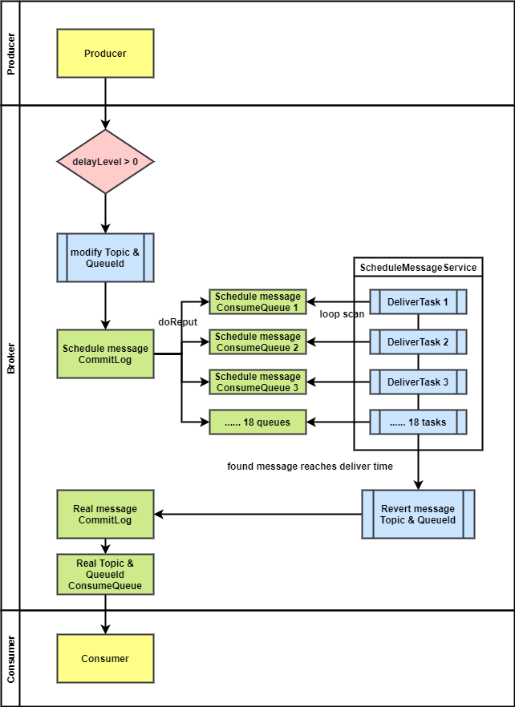

# RocketMQ 实现高性能定时消息

# 背景

RocketMQ 是阿里孵化的 Apache 顶级开源分布式高可用消息队列。在开源版本中支持延迟消息的功能，但是仅支持几个固定的延迟时间（1s 5s 10s 30s 1m 2m 3m 4m 5m 6m 7m 8m 9m 10m 20m 30m 1h 2h）。本文介绍如何在 RocketMQ 基础上实现高性能的、任意时间的定时消息。

## 定时消息和延迟消息是什么？

定时消息和延迟消息是消息队列中对于消息的基本概念。

* 定时消息：生产者将消息发送到消息队列服务端，但不期望这条消息马上被投递，而是在当前时间之后的某个时间投递，此时消费者才可以消费到这条消息。
* 延迟消息：生产者将消息发送到消息队列服务端，但不期望这条消息马上被投递，而是延迟一定时间后投递。

这两个概念虽然感觉起来不同，但是在实际使用中效果是完全相同的：消息到达消息队列服务端后不会马上投递，而是到达某个时间才投递给消费者。也就是说，实现其中一个，就可以达到另一个的效果。

使用定时消息，将消息定时设置为当前时间往后的 X 时间，可以实现延迟消息的效果。
使用延迟消息，如果想要固定时间投递，可以计算投递时间到当前时间的时间差 X，然后设置这条消息延迟 X 时间。

所以本文中所实现的定时消息效果也可以用作延迟消息使用。

## 定时消息的需求和应用场景

定时消息在当前的互联网环境中有非常大的需求。

例如电商/网约车等业务中都会出现的订单场景，客户下单后并不会马上付款，但是这个订单也不可能一直开着，因为订单会占用商品/网约车资源。这时候就需要一个机制，在比如 5 分钟后进行一次回调，回调关闭订单的方法。
这个回调的触发可以用分布式定时任务来处理，，但是更好的方法可以是使用消息队列发送一个延迟消息，因为一条消息会比一个分布式定时任务轻量得多。
开启一个消费者消费订单取消 Topic 的消息，收到消息后关闭订单，简单高效。

当用户支付了订单，那么这个订单不再需要被取消，刚才发的延迟消息也不再需要被投递。当然，你可以在消费消息时判断一下订单的状态以确定是否需要关闭，但是这样做会有一次额外的数据库操作。如果可以取消定时消息，那么只要发送一条定时消息取消的命令就可以取消之前发送的定时消息投递。

除此之外，定时消息还能用于更多其他场景，如定时任务触发、等待重试、事件预订等等。

## 各大消息队列对定时消息支持的现状

当前各大消息队列和云厂商都对定时消息和延迟消息有一定程度上的支持，但是往往在精度、延迟时间、性能等方面无法都达到完美。

| 消息队列 / 功能     | 延迟时间                           | 精度            | 性能                                  | 是否支持取消 |
| ------------------- | ---------------------------------- | --------------- | ------------------------------------- | ------------ |
| Kafka               | ×                                  | ×               | ×                                     | ×            |
| RabbitMQ            | 一个队列只支持一个延迟时间         |                 | 低于 RocketMQ                         | ×            |
| Pulser              | 支持跨度很大的延迟消息             | 1s              | 无法支持大规模使用                    | ×            |
| RocketMQ            | 仅支持固定等级的延迟消息，最大 2 h | 1s              | 等同于 RocketMQ 普通消息性能          | ×            |
| Amazon SQS          | 15 分钟内                          | ？              | ？                                    | ×            |
| 阿里云 RocketMQ     | 40 天                              | 1s~2s的延迟误差 | 等同于 RocketMQ 普通消息性能          | ×            |
| 腾讯云 CMQ          | 1 小时内                           | 1s              | 单队列处于飞行状态的消息数限制为2万条 | ×            |
| **华为云 RocketMQ** | **1 年**                           | **0.1s**        | 等同于 RocketMQ 普通消息性能          | **√**        |

可以看到，4 大主流开源消息队列对定时消息的实现都有局限性，无法达到任意时间定时。

各大云厂商将该功能作为一个竞争力项，支持比较灵活的延迟消息。其中华为云 RocketMQ 支持最长 1 年的延迟消息，且延迟精度能够达到 0.1s 内，同时还具备基本等同于普通消息的性能表现。此外，还支持延迟消息的取消，功能领先所有开源消息队列和云化消息队列。

下面我们将揭开华为云 RocketMQ 任意时间定时消息的面纱，看一看它究竟是怎么实现的。

# 设计和实现

在设计定时消息的实现方案前，我的设计目标是——构建定时消息底座，不仅能让业务使用，也能在其之上构建其他服务，如定时任务调度服务；甚至作为 RocketMQ 一些特性的基础，基于定时消息实现如消息重投等功能。作为一个底座，其必须有如下的特点：支持任意时间的定时、高精度、高性能、高可靠。

## 难点和取舍

各大开源消息队列和云厂商没有实现完美的定时消息，因为在每个指标上要达到完美，都涉及到其他方面的一些取舍。

* 延迟时间：一般来说，保存的消息数据都有一个过期时间，如 3 天过期清除，也就是说定时消息延迟时间最大也不能超过这个清除时间。支持更大的延迟时间意味着延迟消息更长的保存时间，也意味着需要单独对定时消息进行存储。
* 精度：定时消息如何投递？势必会用到类似定时任务地机制。比如每 1s 执行一次定时任务投递这 1s 内的定时消息。定时消息的精度越高就意味着定时任务执行越频繁，计算压力越大，I/O 越频繁。
* 性能和可靠性：这两个指标往往不能兼得。更高的可靠性意味着消息同步投递、主从同步，那么消息的 TPS 就不可避免地变低。

对于这些取舍，我想说的是：我全都要！

## 站在巨人的肩膀上

在实现“全都要” 的定时消息之前，我们先来看一下开源版本 RocketMQ 定时消息的实现，从中可以学习和借鉴需多东西。

开源版本 RocketMQ 的定时消息也是取舍之后的产物。对于单队列支持任意时间定时消息的难点是消息的顺序问题。比如用户先发了一条延迟 1 分钟的消息，随后马上发一条延迟 3 秒的消息，显然延迟 3 秒的消息需要先被投递出去，那么服务端在收到消息后需要对消息进行排序再投递。在 RocketMQ 中，为了保证可靠性，消息是需要落盘的，且对性能和延迟的要求，决定了在服务端对消息进行排序是完全不可接受的。

如何解决排序问题？开源版本的做法是：通过固定几个延迟等级的方式，绕过排序。开源 RocketMQ 设定了 18 个固定延迟时间的延迟等级：1s 5s 10s 30s 1m 2m 3m 4m 5m 6m 7m 8m 9m 10m 20m 30m 1h 2h。这样，对于每个延迟等级，他们之中的消息顺序就是固定的：先来先投递，后来后投递，从而绕过了排序这个问题。

下面是开源 RocketMQ 延迟消息的流程图

RocketMQ 为延迟消息创建了一个内部 Topic，下有 18 个 Queue，对应 18 个延迟等级。收到延迟消息后，不会立即投递到它本该去的 Topic 中，而是投递到延迟消息 Topic 中的对应 Queue。然后的实现十分简单粗暴：为每个 Queue 创建一个线程，循环扫描这个 Queue 里面的消息是否到达投递时间，如果到达则投递到它本该去的 Topic 中。由于每个 Queue 里面消息的延迟等级相同，那么他们的投递就是按顺序的，避免了对延迟消息重新排序。

开源的延迟消息实现经过 [4.9.3 版本的优化](./RocketMQ%20%E5%BB%B6%E8%BF%9F%E6%B6%88%E6%81%AF%EF%BC%88%E5%AE%9A%E6%97%B6%E6%B6%88%E6%81%AF%EF%BC%894.9.3%20%E7%89%88%E6%9C%AC%E4%BC%98%E5%8C%96%20%E5%BC%82%E6%AD%A5%E6%8A%95%E9%80%92%E6%94%AF%E6%8C%81.md)，已经支持了异步投递，拥有了不错的性能。

但是它仍存在一个致命的问题：不支持 18 个等级之外的延迟时间。日益增长的客户诉求促使我们探究任意时间定时消息的实现。站在开源 RocketMQ 实现的肩膀上，只要能将 18 个等级改为定时任意时间，就可以实现高性能高可靠的定时消息，因为高可靠和高性能都可以依赖 RocketMQ 本身的机制达到。

## 存储设计

想要实现任意时间的定时消息，存储设计是最重要的。存储设计面临的两个最大的问题就是

1. 定时消息的顺序：先发送的不一定先投递。
2. 消息存储过期：如果定时消息和普通消息存在一起，那么最大延迟时间还是会受到普通消息文件过期时间的限制。

这两个问题可以通过精心的设计存储方案来解决。

### 使用索引文件解决定时消息顺序问题

回想 RocketMQ 的[索引文件 IndexFile](./RocketMQ%20IndexFile%20%E7%B4%A2%E5%BC%95%E6%96%87%E4%BB%B6.md)，它提供了按照消息 Key 查找消息的能力。具体的做法是：它用类似 HashMap 的形式存储了每个消息 Key 下的消息的位置信息，当查询某个 Key 的消息时，可以马上定位到这个 Key 下存储的消息位置信息链表，然后通过位置信息从消息存储文件 CommitLog 中将消息全部信息查出来。

对于定时消息，也可以构建这样一个索引文件，用来快速查找某一时刻需要投递的消息。这样一来，投递消息时只需要借助索引文件就可以查找所有该时刻需要投递的消息，免去了排序的步骤，解决了定时消息顺序问题。

参照 IndexFile，定时消息索引的存储方案设计就变得很简单。索引文件的 Key 即投递的时间段，Value 即该时间段内要投递的所有消息位置信息。

*特别提需要确定的几个关键值*

1. *索引每个 Key 的时间跨度：1s 的精度我认为太差，一些秒杀场景可能慢 1 秒就没货了，于是决定降低一个数量级—— 0.1s*
2. *容量和时间跨度：RocketMQ 中文件存储为内存映射文件，最大不超过 2G，所以每个索引文件不应超过 2G。如果按 TPS 1w 来算，1 小时的索引文件大小就会达到 700M 左右。所以时间跨度定为 1 小时，容量为 3600w。如果超过 3600w 怎么办？把这个文件做成可扩展的文件队列即可。*

### 消息存储的方案取舍

想要摆脱消息默认过期时间的限制，达到更长的延迟时间，那么只能把定时消息单独存储，投递前永不删除。

如果要单独存储，也有几个选择：使用第三方 K-V 数据库如 RocksDB，或者自研存储。下面来分析一下这几个方案的优缺点

|                    | 优点                                   | 缺点                         |
| ------------------ | -------------------------------------- | ---------------------------- |
| 与普通消息共用存储 | 无需额外开发                           | 延迟时间受限                 |
| RocksDB            | 延迟时间不限。性能高，开发量较小       | 引入第三方组件，增加维护成本 |
| 自研存储           | 延迟时间不限。性能高，易于管理，侵入小 | 开发量大                     |

由前文所说，我们希望实现一个定时消息的底座，不希望将其他第三方组件引入开源 RocketMQ，于是毅然选择自研存储。

## 定时消息投递

# 华为云 RocketMQ 定时消息

# 参考资料

* [如何在MQ中实现支持任意延迟的消息？](如何在MQ中实现支持任意延迟的消息？ )
* [任意时间延时消息原理讲解：设计与实现](https://mp.weixin.qq.com/s?__biz=MzU2NjIzNDk5NQ%3D%3D&mid=2247486449&idx=1&sn=489b5e17521d2b961fa21e1e5be8a082&chksm=fcaed1edcbd958fba6bc9450d9aedab11ef8b19c77697f9c9d8e615d1ca034437229f3023b51&mpshare=1&scene=23&srcid=%23rd)
* [如果有人再问你怎么实现分布式延时消息，这篇文章丢给他](http://blog.itpub.net/31555607/viewspace-2672190/)
* [延时消息常见实现方案](https://segmentfault.com/a/1190000041282378)