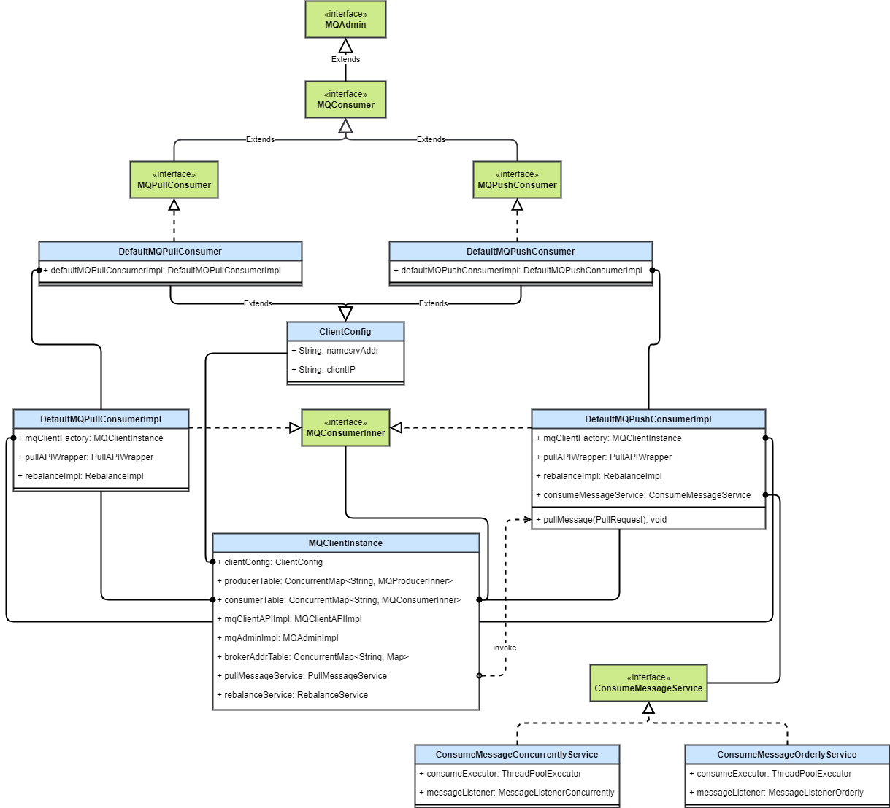

# RocketMQ 消息消费（2）客户端设计和启动流程详解 & 源码解析

## 1. 背景

## 2. 概要设计

### 2.1 消费者客户端设计

先看一下 RocketMQ 客户端代码中消费者相关的类图。

其中 `DefaultMQPullConsumer` 和 `DefaultMQPushConsumer` 就是我们实际消费中需要新建的消费者对象。它们实现了消费者接口，扩展了客户端配置类。

新建 `DefaultXXXXConsumer` 对象时会在内部一个创建 `DefaultMQXXXXConsumerImpl` 对象。这里使用了代理模式，`DefaultXXXXConsumer` 对象只是一个壳，内部的大部分方法都通过调用代理 `DefaultMQXXXXConsumerImpl` 来执行。

`DefaultMQXXXXConsumerImpl` 实现类中包含了：

* MQClientInstnace：客户端实例，每个客户端进程一般只有一个这玩意。它的用处很多，很多操作最终都是调用它来做的。
  * 保存路由信息
  * 保存生产者消费者组信息
  * 向 Broker 发送请求
  * 启动重平衡

### 2.2 消费者客户端启动

消费者的启动主要涉及上面讲到的 `DefaultMQXXXXConsumer`、`DefaultMQXXXXConsumerImpl` 和 `MQClientInstnace` 这三个类。

#### 2.2.1 新建消费者

* 新建消费者时构造 `DefaultMQXXXXConsumer` 对象，指定队列负载算法，内部构造一个 `DefaultMQXXXXConsumerImpl` 对象。

* `DefaultMQXXXXConsumerImpl` 设为刚创建状态，并新建重平衡服务 `RebalanceService`

* 在首次启动前，`DefaultMQXXXXConsumerImpl` 对象中的 `MQClientInstance` 对象还没有被创建出来。

#### 2.2.2 消费者启动

* 启动命令也是在 `DefaultMQXXXXConsumer` 调用并代理到 `DefaultMQXXXXConsumerImpl`。

* 此时  `DefaultMQXXXXConsumerImpl` 会初始化一些服务和参数，然后创建一个 `MQClientInstance` 对象。
* `MQClientInstance` 对象启动客户端的各种服务（Broker 通信、定时任务、消息拉取、重平衡……）

## 3. 详细设计

### 3.1 消费者客户端类设计

#### 3.1.1 整体类图

---

#### 3.1.2 消费者接口

由于需要支持拉和推两种消费模式，所以按通常的想法，消费者类的设计中将会有一个**消费者接口**，然后**推消费者**和**拉消费者接口**分别扩展**消费者接口**。消费者接口提供一些共用方法，拉和推消费者实现拉消费和推消费方法。RocketMQ 就是这样做的。其中 MQConsumer 即消费者接口，扩展 MQAdmin 在这显得有些多余。

* MQAdmin 接口提供了客户端的一些基本的管理接口，生产者、消费者和命令工具都扩展了它。
* MQConsumer 接口很简单，主要提供了通过 Topic 获取读队列的方法 `Set<MessageQueue> fetchSubscribeMessageQueues(final String topic)`。

---

#### 3.1.3 拉 & 推模式消费者接口

接下来是拉消费者和推消费者接口。

如果我们自己来设计拉 & 推模式消费者接口，需要定义哪些方法？可以想象一下消费时要做的操作，就可以定义出相应的方法。

* 拉模式消费者的消费步骤为：拉取消息，执行消费逻辑，上报消费进度，如果有需要的话对于消费失败的消息还需要发回 Broker 重新消费。
* 推模式消费者消费步骤更简单，只需要订阅一个 Topic，然后指定消费回调函数，即可在收到消息时自动消费。

RocketMQ 的拉 & 推模式消费者接口就定义了这些方法，先来看一下类图：

**MQPullConsumer**

* `void registerMessageQueueListener(final String topic, final MessageQueueListener listener)` 方法注册消息队列变更时的回调方法。
* `PullResult pull` 从 RocketMQ 服务器拉取一批消息。
  * MessageQueue：拉取的队列
  * MessageSelector：消息过滤器
  * offset：拉取的消息在消费队列中的偏移量
  * maxNums：最大拉取消息条数
  * timeout：拉取超时时间
* `void pull` 为异步拉取方法，拉取成功后调用 `PullCallback`
* `updateConsumeOffset` 更新消息消费偏移量
* `fetchConsumeOffset` 获取消息消费偏移量
* `sendMessageBack` 对于消费失败的消息，发回 Broker 重新消费

**MQPushConsumer**

* `subscribe`：订阅主题，订阅之后可以收到来自该主题的消息。
  * topic：订阅的主题，可以多次调用该方法来订阅多个主题
  * subExpression：消息过滤表达式
  * messageSelector：消息选择器，提供了 SQL92 和 Tag 模式的过滤选择功能
* `unsubscribe`：取消订阅
* `registerMessageListener`：用来注册消费监听器，包含两种消费模式：并发消费和顺序消费

#### 3.1.4 消费者实现

 `DefaultMQXXXXConsumer` 是拉消费者接口 `MQXXXXConsumer` 的默认实现。这里用到了代理模式，将具体的方法实现都实现在 `DefaultMQXXXXConsumerImpl` 中，`DefaultMQXXXXConsumer` 保存了一个 `DefaultMQXXXXConsumerImpl` 的代理。

`DefaultMQXXXXConsumerImpl` 中有一个客户端实例的引用 `MQClientInstance mqClientFactory`，用来与 Broker 通信、保存元数据。

`DefaultMQXXXXConsumerImpl` 实现了 `MQConsumerInner` 接口，提供了消费者实现的一些公用方法。

#### 3.1.5 拉模式消费者

拉模式消费者消费的流程主要是这几步：拉消息、消费、上报进度，当然还包括失败处理。

### 3.2 消费者启动

## 4. 源码解析

## 参考资料

* [官方文档——设计](https://github.com/apache/rocketmq/blob/master/docs/cn/design.md#42-consumer%E7%9A%84%E8%B4%9F%E8%BD%BD%E5%9D%87%E8%A1%A1)
* [RocketMQ 实战与进阶——丁威](http://learn.lianglianglee.com/%E4%B8%93%E6%A0%8F/RocketMQ%20%E5%AE%9E%E6%88%98%E4%B8%8E%E8%BF%9B%E9%98%B6%EF%BC%88%E5%AE%8C%EF%BC%89/08%20%E6%B6%88%E6%81%AF%E6%B6%88%E8%B4%B9%20API%20%E4%B8%8E%E7%89%88%E6%9C%AC%E5%8F%98%E8%BF%81%E8%AF%B4%E6%98%8E.md)
* [RocketMQ消费消息——白云鹏](https://www.baiyp.ren/RocketMQ%E6%B6%88%E8%B4%B9%E6%B6%88%E6%81%AF.html)
* [消息中间件—RocketMQ消息消费（一）——癫狂侠](https://www.jianshu.com/p/f071d5069059)
* [RocketMQ 消息接受流程——赵坤](https://kunzhao.org/docs/rocketmq/rocketmq-message-receive-flow/)
* [RocketMQ 消息消费——贝贝猫](https://zhuanlan.zhihu.com/p/360911990)
* [RocketMQ 5.0 POP 消费模式探秘](https://developer.aliyun.com/article/801815)
* [RocketMQ消息消费源码分析](https://www.jianshu.com/p/4757079f871f)
* [Rocketmq消费消息原理——服务端技术栈](https://blog.csdn.net/daimingbao/article/details/120231289)
* [RocketMQ——4. Consumer 消费消息——Kong](http://47.100.139.123/blog/article/89)
* [RocketMQ推送消费源码分析(一)-消息拉取——IT小栈](https://itzones.cn/2020/05/29/RocketMQ%E6%8E%A8%E9%80%81%E6%B6%88%E8%B4%B9%E6%BA%90%E7%A0%81%E5%88%86%E6%9E%90-%E6%B6%88%E6%81%AF%E6%8B%89%E5%8F%96/)