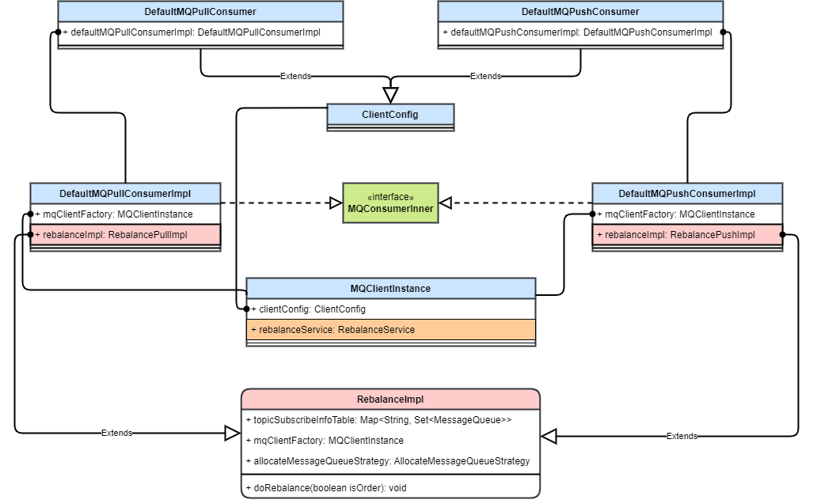
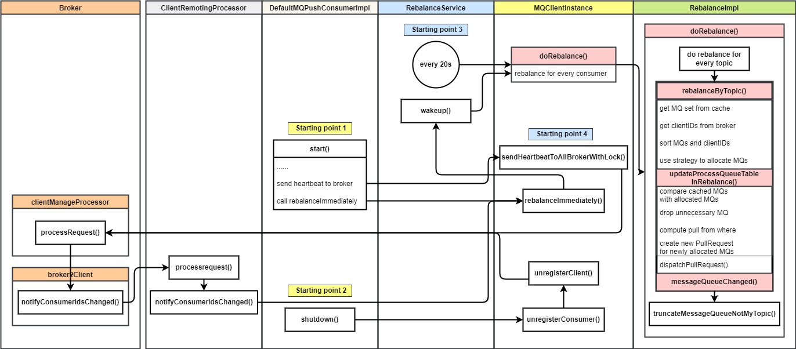

# RocketMQ 消费者（3）重平衡 流程详解 & 源码解析

## 1. 背景

本文是 RocketMQ 消费者系列的第三篇，介绍消费者重平衡。

我把 RocketMQ 消费分成如下几个步骤

1. 重平衡
2. 消费者拉取消息
3. Broker 接收拉取请求后从存储中查询消息并返回
4. 消费者消费消息

其中重平衡是消费者开始消费的起点。

### 1.1 重平衡的含义

RocketMQ 的 Topic 设计成有多个 Queue，被多个消费者同时消费来加快消费速率。

在多个消费者同时消费一个 Topic 时，其中的每个 Queue 只能同时被一个消费者消费。在消费者数量变化时，将  Queue 分配给消费者进行消费的动作即重平衡。

## 2. 概要设计

RocketMQ 的重平衡大致实现方式为：在消费者端用一个固定的分配策略将所有的消费队列分配给所有的消费者。通过将每个消费者的分配策略设置成一致，并且将消费者和消费队列排序的方法，保证每个消费者的分配的结果幂等。

### 2.1 重平衡的触发

RocketMQ 的重平衡在消费端完成。唯一的触发点是一个重平衡线程，触发方式分主动触发和定时触发。

* 主动触发：消费者数量发生变化
  1. 推模式消费者启动或恢复时，唤醒本地的重平衡线程，立即重平衡。在这之前还上报心跳让 Broker 感知到新消费者启动，发送请求让所有消费者重平衡。
  2. 消费者关机时，向 Broker 发请求解除注册。Broker 收到请求后发送请求让其他消费者重平衡。
* 定时触发：重平衡线程每 20s 触发一次重平衡。

### 2.2 重平衡类设计

重平衡主要涉及两个类：重平衡实现 `RebalanceImpl` 和重平衡线程 `RebalanceService`

* 重平衡线程：客户端实例持有，每个客户端进程一般只有一个，负责定时或者立即触发重平衡。但它只负责触发，重平衡的实际逻辑在实现类中。
* 重平衡实现：
  * `RebalanceImpl` 中保存了消费者负载的消息队列、重分配策略，并实现了重分配的方法（调用重平衡策略）。
  * 每个消费者持有一个重平衡实现，根据推和拉模式的不同，分别在 `RebalanceImpl` 的基础上新实现了推模式和拉模式的重平衡实现。

### 2.3 重平衡流程

消费者按 Topic 维度进行重平衡。

1. 从本地缓存中获取 Topic 的所有 Queue
2. 向 Broker 获取所有消费者
3. 按预设的策略将队列分配给消费者
4. 判断自己分配到的队列是否变化
   * 如果变化则丢弃老队列，开始拉取新队列，并将订阅关系上报到 Broker

RocketMQ 的重平衡流程在消费者端完成，但是由 Broker 端发送信号给所有消费者触发。

## 3. 详细设计

### 3.1 重平衡实现类 RebalanceImpl

`RebalanceImpl` 类中实现了整个重平衡流程。

#### 3.1.1 域

RabalanceImpl 类保存一些重平衡需要的基本信息。

1. `subscriptionInner`：消费者订阅的所有 Topic。重平衡时遍历这些 Topic 进行重平衡。
2. `topicSubscribeInfoTable`：Topic 下的所有队列。重平衡时对这些队列应用重分配策略进行分配。
3. `processQueueTable`：该消费者负载的所有消息队列。重平衡完成后，对比之前的负载来判断是否要改变队列进行消息拉取。

此外还有一个重要的域即重分配策略类 `allocateMessageQueueStrategy`，同一消费组中的每个消费者应保持一致，以保证重分配的结果一致。

#### 3.1.2 方法

重平衡实现类中包含重平衡的一系列逻辑，由抽象类直接实现。

* 重平衡方法 `doRebalance`
  * 重平衡方法会可以细分为对每个 Topic 进行重平衡的方法 `rebalanceByTopic`
    * 对 Topic 进行重平衡后需要判断并更新消费者的负载，方法为 `updateProcessQueueTableInRebalance`

此外还包含了一些抽象方法，根据消费者类型不同有着不同的实现。

* `messageQueueChange`：负载的消息队列发生变化时调用
* `dispatchPullRequest`：分发拉取请求到消息拉取服务，开始拉取消息
* `removeUnnecessaryMessageQueue`：将重平衡后丢弃的消费队列移除

### 3.2 重平衡流程

### 3.3 重平衡队列分配策略

## 4. 源码解析

