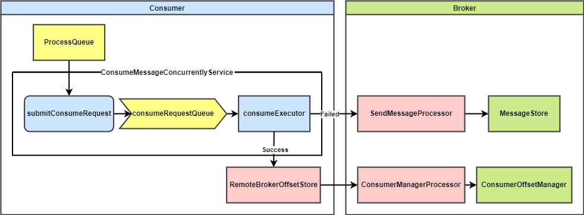
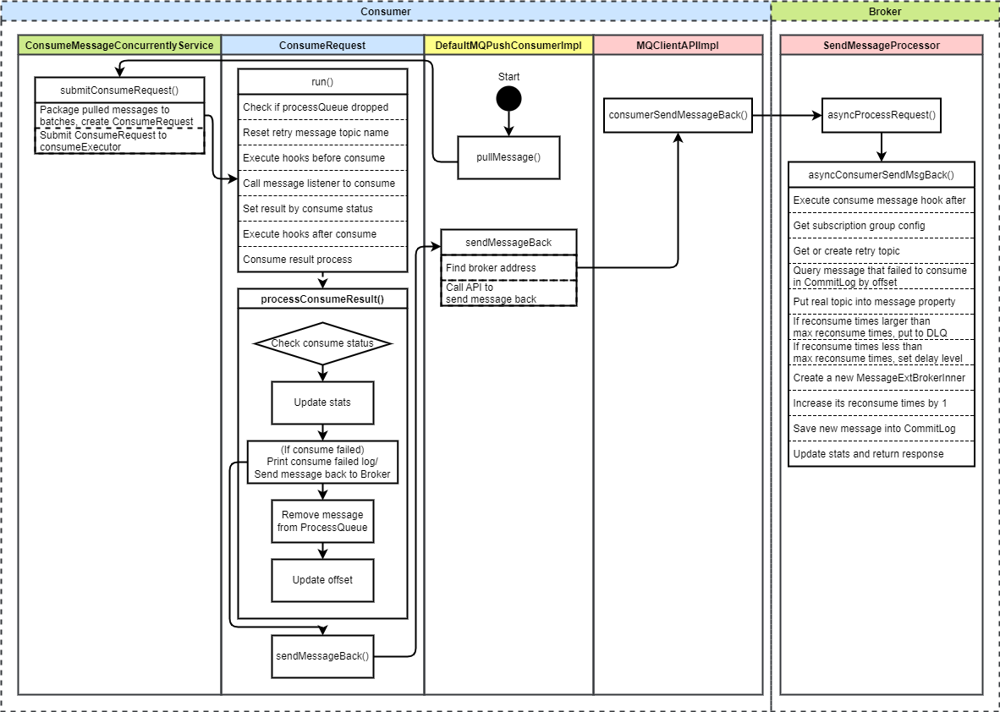
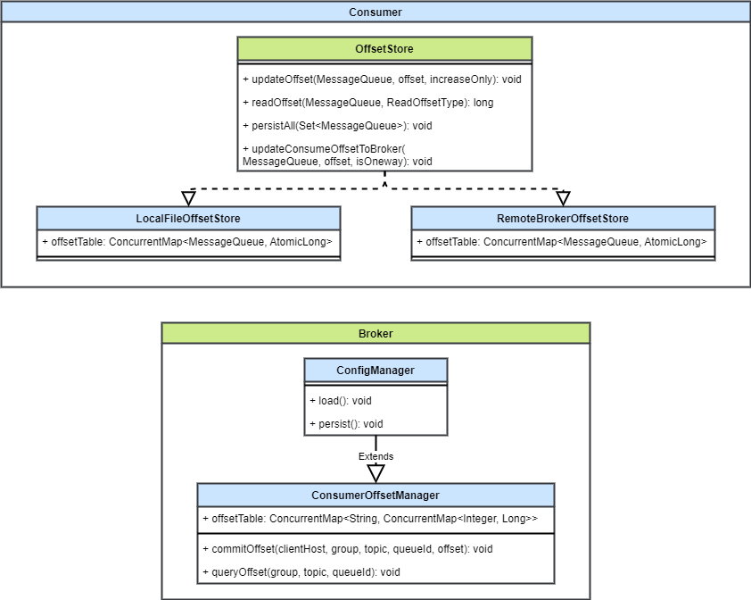
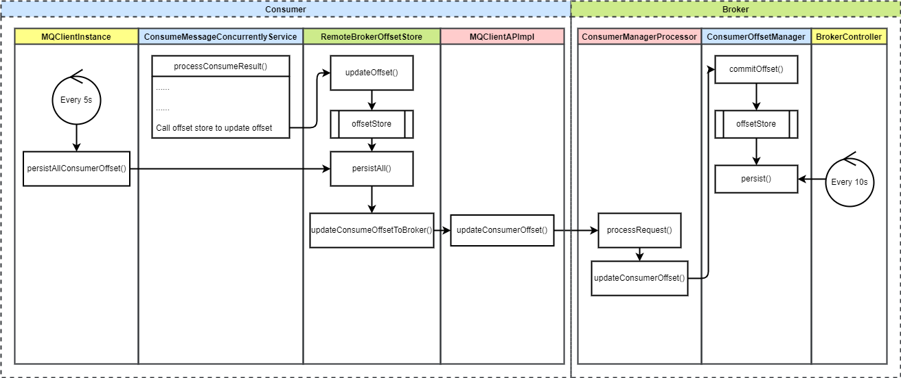

# RocketMQ 消费者（5）消息消费、消费进度上报 流程详解 & 源码解析

## 1. 背景

本文是 RocketMQ 消费者系列的第五篇，主要介绍并发消费者的消费和消费进度上报的流程。

我把 RocketMQ 消费分成如下几个步骤

1. 重平衡
2. 消费者拉取消息
3. Broker 接收拉取请求后从存储中查询消息并返回
4. 消费者消费消息

本文介绍的是步骤 4。RocketMQ 的消费还分并发消费和顺序消费，顺序消费将会在下一篇进行讲解。

## 2. 概要设计

### 2.1 推模式并发消费交互流程

RocketMQ 推模式下有并发消费和顺序消费两种消费模式。并发消费，顾名思义，将由一个消费线程池并行处理消费逻辑，消费速度较快。

默认为消费线程池设置 20 个线程。从上一步拉取消息到消费者后，将拉取到的一批消息提交给并发消费服务，并发消费服务将消息封装成一个个消费请求（每个消费请求将消费一批消息，默认一批只包含一条消息）提交给消费线程池进行消费。

消费时将会调用订阅时注册的消费监听器中的业务方法，执行真正的业务逻辑，然后处理消费结果。

如果消费成功，则更新消费进度。如果消费失败，则需要将失败的消息发回 Broker，一段时间后进行重新消费。

总结一下，推模式并发消费主要的步骤为：

1. 从拉取到的消息保存的处理队列获取消息，封装成消费请求，提交到消费线程池进行并发消费
2. 调用注册的监听器执行消费逻辑
3. 消费结果处理
   * 消费成功则将这批消息从处理队列中移除，并更新消费进度
   * 消费失败则将失败的消息发回 Broker，利用延迟消息特性，过一段时间将会再次收到这些消息进行消费

### 2.2 重试消费设计

为了保证消息消费的高可靠性，RocketMQ 默认提供了重试消费和死信队列功能。消费失败的消息将会过一段时间后重新消费，每次重新消费的时间间隔将会逐渐增加。当重新消费次数超过最大阈值时，消息将会被放入死信队列，为用户提供了主动处理这些消费多次失败的消息的可能。

重试消费需要在消费结果处理的步骤中进行判断，如果消息消费失败，则将消息发回给 Broker。

Broker 收到请求后用延迟消息机制，用该消息重新消费的次数计算延迟等级，生成一个新消息，将重新消费次数 + 1，作为延迟消息放入消息存储。

延迟到期后该消息将被重新投递到消费者。

初始的延迟为 30s，每次重试消费失败后延迟等级会增加，最后一次延迟 2 小时。如果仍然消费失败，则会被放入死信 Topic。

### 2.3 消费进度管理设计

广播模式下，每个消费者都要消费全量消息，消费者之间不需要共享消费进度，所以消费进度可以存在本地。

集群模式下，多个消费者共同消费一个 Topic，还存在重平衡的可能性，所以需要共享消费进度，这样的话消费进度存在 Broker 端比较好。

RocketMQ 为广播模式和集群模式分别创建了消费进度存储类。

#### 2.3.1 广播模式消费进度管理

广播模式的消费者本地存储进度比较简单，它包含一个内存中的消费进度缓存表，用来实时更新。客户端实例启动时会启动定时任务，每 5s 将内存中的消费进度持久化到磁盘。

#### 2.3.2 集群模式消费进度管理

集群模式的消费进度管理涉及到消费者端和 Broker 端，每端都有一个消费进度管理器。消费者端仅保存一个消费进度内存缓存表，用来让消费者实时上报消费进度。客户端实例启动时的定时任务每 5s 会让消费者端的管理器向 Broker 端发送持久化请求。

Broker 端也包含一个消费进度内存缓存表，每 5s 会收到消费者端的请求，更新内存缓存表。Broker 启动时也会启动定时任务，每 10s 将消费进度管理器的内存缓存持久化到磁盘。

#### 2.3.3 消费者更新消费进度

推模式消费者在处理消费结果的逻辑中，如果消费成功则会更新消费进度。

拉模式消费者则需要用户自行调用消费者的方法触发消费进度更新。

## 3. 详细设计

### 3.1 推模式并发消费流程

### 3.2 消费进度管理

#### 3.2.1 消费进度管理类设计

消费者端，实现了 `OffsetStore` 接口，定义了更新、查询和持久化消费进度的方法。

有两个实现类，这里都使用了内存缓存，定时持久化的设计方法。保存一个缓存表 `offsetTable`，用来快速更新和查询。

* `LocalFileOffsetStore` ：消费者本地进度存储，持久化时保存到消费者本地
* `RemoteBrokerOffset`：Broker 端存储，持久化时先保存到本地缓存，然后发送请求给 Broker，保存到 Broker 缓存。Broker 再定时持久化

Broker 端也有一个对应的消费进度管理器 `ConsumerOffsetManager`，同样也是缓存 + 定时持久化的设计。

它扩展了 `ConfigManager`，`ConfigManager` 是用来管理配置的，它定义了持久化和加载的接口。

`ConsumerOffsetManager` 负责接收消费者的消费进度更新请求，然后定时持久化到磁盘。

#### 3.2.2 消费进度更新流程

这里讲解集群模式下消费进度的更新流程

每个消费者都会有一个消费进度管理器 `RemoteBrokerOffsetStore`，在消费者启动时创建。

Broker 端也有一个消费进度管理器 `ConsumerOffsetManager`，在 Broker 启动时创建。

这两个消费进度管理器都保存一个消费进度缓存表 `offsetStore` 在内存中，用于快速更新和查询。Broker 端消费进度管理器会定时将消费进度表持久化到磁盘。

1. 客户端实例 `MQClientInstance` 启动时，创建定时任务，每 5s 触发消费进度管理器的持久化方法。
2. 消费流程最后，如果消费请求被消费成功，将会调用 `RemoteBrokerOffsetStore` 的 `updateOffset` 方法，更新消费进度缓存
3. `persistAll()` 方法会遍历消费进度缓存表 `offsetStore`，为每个消息队列都向 Broker 发送消费进度更新和持久化的请求。
4. `updateConsumeOffsetToBroker` 构造一个消息队列的消费进度更新请求，发送给 Broker
5. Broker 的 `ConsumerManagerProcess` 处理请求，调用 `updateConsumerOffset` 方法，让消费进度管理器更新消费进度
6. 消费进度管理器的 `commitOffset` 方法将消费进度更新到其内存缓存表 `offsetStore`
7. `BrokerController` 启动时启动定时任务，每 10s 调用 `ConsumerOffsetManager` 的 `persist()` 方法，持久化消费进度

## 4. 源码解析

